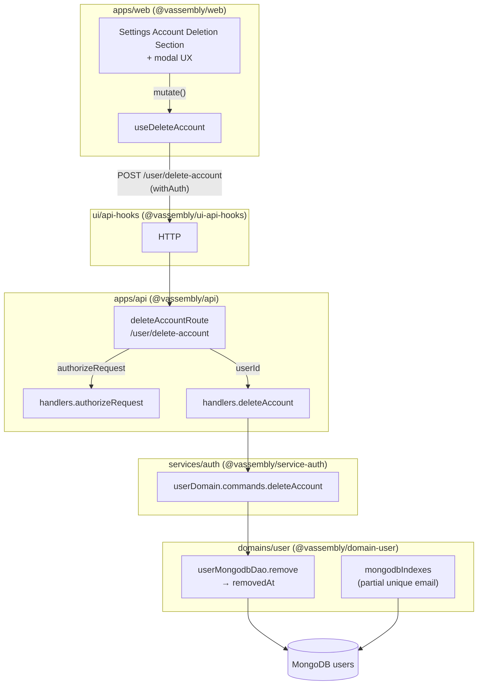

# Account Deletion — Architecture Specification

**Status:** Specification (implementation-aligned as of repo state, May 2026)  
**Last updated:** 2026-05-06  
**Related:**
- **[PRD](./prd.md)** — product requirements (R1–R12), acceptance criteria, UX rules.
- **Parent:** [User Settings Architecture](../user-settings/architecture.md) — **§ Account deletion — immediate soft-delete (May 2026)** introduces this feature and supersession of the legacy flow.

---

## Executive summary

Account deletion is a **single-step, authenticated REST operation** that **soft-removes** the user document by setting **`removedAt`** (`MongoDbDAO.remove` / `@vassembly/model` soft-remove semantics). **No** pending-deletion tokens, confirmation emails, or second HTTP round-trip exist on the server. The Settings UI keeps a **destructive modal** only to gate user intent locally; submitting it issues **exactly one** `POST /user/delete-account` call.

Email may be reused after deletion: uniqueness is enforced for **active** rows only via a **MongoDB partial unique index** plus **active-only** reads (`getByEmail`, list queries aligned with [`ACTIVE_USERS_ONLY_MATCH`](../../../domains/user/src/queries/activeUsersOnlyFilter.ts)).

**Librarian audit (catalog):** The monorepo already wires `deleteAccount` (domain → service → API → hooks → Settings). Legacy `requestAccountDeletion`, `confirmAccountDeletion`, deletion-token fields, and old routes/hooks are **absent from source**. This document is the **canonical technical spec**; where it overlaps with superseded prose in sibling docs (e.g. user-settings Todo lists naming removed files), prefer **paths and behaviors described here**.

---

## 1. System architecture overview

### 1.1 Component flow

Data and control flow (**subject** = authenticated user from session):



### 1.2 Responsibilities by layer

| Layer | Responsibility |
|-------|------------------|
| **`apps/web`** | UX-only modal; session teardown + preference clearing on confirmed success |
| **`@vassembly/ui-api-hooks`** | Thin REST client; authenticated `POST` with empty body; maps `{ success }` |
| **`@vassembly/api`** | Transport-only: resolve `userId` from auth, delegate to handler |
| **`@vassembly/service-auth`** | Validate inputs, orchestrate domain; map unexpected errors |
| **`@vassembly/domain-user`** | **Single command** `deleteAccount`; DAO soft-remove; idempotent semantics for already removed |
| **`@vassembly/client-mongodb`** | `MongoDbDAO.remove` sets `removedAt` via model `toMongoDb({ isRemove: true })` |

GraphQL deletion is **out of scope** per [PRD](./prd.md) unless product later mandates it. The **`user(id)`** query remains a read-only path layered on **`getUser` → `getById`** (removed users behave as absent — see §7).

---

## 2. Data model changes

### 2.1 Source of truth: `removedAt`

Soft-delete is keyed **only** by **`removedAt`** on [`UserModel`](../../../domains/user/src/model/model.ts) (inherited from `@vassembly/model`). No server-side pending state.

### 2.2 Legacy deletion token fields (removed)

Per [PRD R8](./prd.md):

- **`deletionConfirmationTokenHash`** and **`deletionConfirmationExpiresAt`** are **removed** from the TypeScript model and application code paths.
- **MongoDB:** legacy keys may linger on old documents until operational `$unset`; **new code never reads/writes them**.

### 2.3 Public vs persistence fields

[`UserPublicResponse`](../../../domains/user/src/model/model.ts) includes **`removedAt`** for typing where serialization exposes it; client factories may scrub public payloads — align with UX policy (normally clients after deletion tear down session and do not rely on profile reads).

---

## 3. Workflow and API changes

### 3.1 User workflow (canonical)

Aligns with [PRD §2.1](./prd.md):

1. Authenticated user opens Settings → Account deletion section.  
2. Opens confirmation modal (checkbox / typed phrase — **client-only** gating).  
3. Single submit → **`POST /user/delete-account`** (`body`: `{}`; identity from auth).  
4. Success → tear down local auth + clear stored preferences; route to signed-out UX.  
5. Later, **registration with same email** allowed (§6).

### 3.2 HTTP surface

| Method | Path | Behavior |
|--------|------|----------|
| `POST` | **`/user/delete-account`** | **Only** deletion endpoint; **`authorizeRequest` + `deleteAccount`** |
| ~~`POST`~~ | ~~`/user/request-account-deletion`~~ | **Removed** (superseded) |
| ~~`POST`~~ | ~~`/user/confirm-account-deletion`~~ | **Removed** (superseded) |

Route module reference: [`apps/api/src/routes/user/deleteAccount.ts`](../../../apps/api/src/routes/user/deleteAccount.ts) (prefix **`/user`** registered in [`routes/index.ts`](../../../apps/api/src/routes/index.ts)).

### 3.3 Domain/service shape

Per [PRD R5–R6](./prd.md):

- **One domain command:** `deleteAccount({ userId })`  
- **One service handler:** `handlers.deleteAccount`  
- **No** paired request/confirm commands or handlers  

---

## 4. Backend architecture

### 4.1 Domain command — `deleteAccount`

**Location:** [`domains/user/src/commands/deleteAccount/`](../../../domains/user/src/commands/deleteAccount/).

**Steps (prescriptive):**

1. Validate `userId` with shared [`USER_ID_VALIDATION_SCHEMA`](../../../domains/user/src/commands/userIdValidationSchema.ts).  
2. **Load** user via `userMongodbDao.get`. Missing → **`NotFoundError`**.  
3. If **`removedAt`** already set → **`{ success: true }`** (**idempotent success** policy — encoded today; aligns with [PRD R12](./prd.md) “pick one”; document/tests must stay consistent).  
4. Else → **`await userMongodbDao.remove(queryInstance)`** → sets **`removedAt`**.  

**Do not** use hard delete; **avoid** unrelated `removeDb` pathways unless validated for the same `userId`/ObjectId semantics (see `@vassembly/commands` helpers vs direct DAO).

Exports: [`domains/user/src/commands/index.ts`](../../../domains/user/src/commands/index.ts).

### 4.2 Service handler — `deleteAccount`

**Location:** [`services/auth/src/handlers/deleteAccount/`](../../../services/auth/src/handlers/deleteAccount/).

Thin wrapper:

- Validates handler input (`userId`).
- **`return userDomain.commands.deleteAccount({ userId })`**
- Maps non-**`CommonError`** failures to **`InternalError`** for consistent service boundary.

Authorization **who may delete whom**:

- **`POST /user/delete-account`** obtains **`userId` only from [`handlers.authorizeRequest`](../../../services/auth/src/handlers/authorizeRequest/index.ts)** (session/JWT headers). Self-serve: **subject == target** implicitly; callers cannot supply another user's id in the body (there is none).

### 4.3 API route

[`deleteAccountRoute`](../../../apps/api/src/routes/user/deleteAccount.ts):

- `authorizeRequest({ headers })` → `userId`
- **`handlers.deleteAccount({ userId })`**

Startup: **`mongodbIndexes()`** from `@vassembly/domain-user` after Mongo init ([`routes/index.ts`](../../../apps/api/src/routes/index.ts)).

---

## 5. Frontend changes

### 5.1 Settings section

Section composition under User Settings shell (anchors, authenticated-only access) stays per [User Settings PRD](../user-settings/prd.md).

**Representative files:**

- [`SettingsAccountDeletionSection.tsx`](../../../apps/web/app/settings/_components/SettingsAccountDeletionSection.tsx)
- [`SettingsAccountDeletionInteractiveBody.tsx`](../../../apps/web/app/settings/_components/accountDeletion/SettingsAccountDeletionInteractiveBody.tsx)
- Consumes **`useDeleteAccount`** from `@vassembly/ui-api-hooks`

### 5.2 Modal (UI-only confirmation)

Requirements from [PRD R2](./prd.md):

- Checkbox + typed destructive phrase reuse patterns (e.g. settings form schemas near `SETTINGS_ACCOUNT_DELETE_CONFIRMATION_SCHEMA` / feature visibility).
- **No** intermediate API calls for “staging” deletion; modal submit triggers **exactly one** mutation to **`/user/delete-account`**.
- On **network/server failure**, **do not** tear down session (see PRD §4.1 interrupted flows).

### 5.3 Client hook

[`ui/api-hooks/src/user/useDeleteAccount.ts`](../../../ui/api-hooks/src/user/useDeleteAccount.ts):

- `POST` **`/user/delete-account`** with **`withAuth: true`**, body `{}`.
- Returns shape compatible with **`UseApolloMutationState`** for uniformity with GraphQL-ish hooks naming (`deleteAccount.success`).

**Remove:** any legacy `useRequestAccountDeletion` / `useConfirmAccountDeletion` hooks and dual-call flows (already absent — keep regression tests from reintroducing them).

---

## 6. Email reuse implementation

### 6.1 Preferred: partial unique index (implemented)

[`mongodbIndexes`](../../../domains/user/src/clients/mongodb.ts):

- **Index name:** `users_email_unique_active_only`
- **`unique: true`** on `{ email: 1 }`
- **`partialFilterExpression`** (equivalent intent to **`ACTIVE_USERS_ONLY_MATCH`**):

  `$or: [{ removedAt: { $exists: false } }, { removedAt: null }]`

**Semantics:** Multiple **removed** rows may retain the **same historical email** without violating uniqueness; **at most one active** `(email)` enrollment.

**Operational note:** Indexes must exist in **all** deployed environments before relying on concurrency safety; API startup **`createIndex`** is idempotent.

### 6.2 Alternative: tombstone email (fallback)

Only if partial indexes cannot be used:

- On delete: rewrite **`email`** on the removed doc to a sentinel (e.g. `deleted-{id}@internal`) plus optional **`formerEmail`** for compliance.
- **Trade-offs:** invasive writes, migrations, downstream reporting/query impact — **not** default.

### 6.3 Registration alignment

[`create`](../../../domains/user/src/commands/create/index.ts) uses **`getByEmail`** → **active-only**. After soft-delete, **no active user** resolves for that email → **new registration succeeds** once index + queries align ([PRD R10–R11](./prd.md)).

**Test scenario:** register → delete → register same email → second document **`removedAt` unset**.

---

## 7. Auth continuity

How removed accounts are treated across reads and login.

### 7.1 `getByEmail` (active-only)

[`getByEmail`](../../../domains/user/src/queries/getByEmail.ts) merges filter **`ACTIVE_USERS_ONLY_MATCH`** — removed rows **never** returned for credential lookup or duplicate-email checks.

### 7.2 `verify` (`verifyCredentials`)

[`verify`](../../../domains/user/src/queries/verifyCredentials/index.ts):

- Uses **`getByEmail`** (already active-only).
- **Defense in depth:** if **`removedAt`** were present anyway → **`UnauthorizedError`** with generic “Invalid email or password” (same as unknown user).

**Net:** Removed users **cannot authenticate**.

### 7.3 `getById` and “current user” reads

[`getById`](../../../domains/user/src/queries/getById.ts): if **`result.data.removedAt`** → **`NotFoundError`**.

[`getUser`](../../../services/auth/src/handlers/getUser/index.ts) delegates to **`getById`** — GraphQL **`user(id)`** therefore **cannot** resolve removed identities as live users ([`registerUserResolvers`](../../../apps/api/src/graphql/resolvers/user.ts)).

### 7.4 Login / refresh (optional hardening surface)

JWT/session may briefly exist after deletion until expiry. Recommended product behavior:

- Next protected request should fail authorization or **`getUser`/`getById`** when re-validating identity.
- If refresh or auth middleware loads user by id without **`getById`**, audit and align with **`removedAt`** (parent doc [User Settings Architecture](../user-settings/architecture.md) “optional follow-ups”).

---

## 8. Code reuse and removal

### 8.1 Reuse (keep / extend)

| Asset | Usage |
|-------|--------|
| `MongoDbDAO.remove` + Model soft-remove | **Primary** deletion mechanism |
| `USER_ID_VALIDATION_SCHEMA` | All user-id command inputs |
| `handlers.authorizeRequest` | Resolve `userId` for self-serve routes |
| `ACTIVE_USERS_ONLY_MATCH` | Email + list + password-reset resolution |
| Modal + `Alert` + session teardown + `clearStoredUserPreferences` patterns | Settings UX ([PRD §6 checklist](./prd.md)) |

Parallel helper [`commands/remove.ts`](../../../domains/user/src/commands/remove.ts) (`removeDb`) — **distinct** validation path from `deleteAccount`; do not confuse with account deletion UX unless deliberately unified later.

### 8.2 Removal checklist (legacy supersession)

| Remove / avoid | Replacement |
|-----------------|---------------|
| `requestAccountDeletion` + `confirmAccountDeletion` domains | **`deleteAccount`** |
| Confirmation token hashing on user doc | —
| `confirmAccountDeletion` service handler | **`deleteAccount` handler** |
| `/user/request-account-deletion`, `/user/confirm-account-deletion` | **`POST /user/delete-account`** |
| Dual hooks (`useRequest*`, `useConfirm*`) | **`useDeleteAccount`** |

(Source tree today matches this matrix; sibling documentation that still enumerates legacy paths should be trimmed over time.)

---

## 9. Affected packages and dependencies

Package graph (**upstream ← downstream**, same as [PRD §7](./prd.md)):

```text
@vassembly/domain-user
    ↑ @vassembly/service-auth
        ↑ apps/api (+ optional GraphQL resolvers importing handlers)
            ↑ @vassembly/ui-api-hooks
                ↑ @vassembly/web
```

**External/shared deps (non-exhaustive):**

| Package | Role |
|---------|------|
| `@vassembly/client-mongodb` | DAO implementation |
| `@vassembly/model` | `removedAt`, `toMongoDb({ isRemove: true })` |
| `@vassembly/errors` | `NotFoundError`, `UnauthorizedError`, `WrongParamError`, … |
| `@vassembly/validation` | Zod validators |
| `@vassembly/server` | `defineRoute`, server bootstrap |

---

## 10. Testing strategy

Per-layer expectations (Vitest black-box tests; align with [PRD §6 / §8](./prd.md)).

| Layer | Coverage |
|-------|----------|
| **Domain** | `deleteAccount`: success sets **`removedAt`** (via read-after or mocked DAO assertion); unknown id → **`NotFoundError`**; **`removedAt` pre-set** → idempotent success (per §4.1 policy) |
| **Service** | `deleteAccount` handler mocks domain — success/error propagation |
| **API** | Authenticated **`POST`** returns agreed `{ success: true }`; **`/confirm-account-deletion` absent**; unauthorized without session |
| **Hooks** | (Optional) HTTP client mocks — parsing + error mapping |
| **Web** | Component test: guarded modal → exact **one** `mutate` / HTTP call path; dismissal → zero calls |
| **Registration/auth integration** | `create` after delete same email succeeds; **`verify`** / login fails for removed user |

Add **migration/index** verification in staging or infra tests if feasible (unique index collision scenarios).

---

## 11. Implementation steps (ordered)

Use as execution checklist — many items reflect **verification** given current implementation:

1. **Domain:** Confirm `deleteAccount`, model without legacy token fields, exports clean.  
2. **Domain indexes:** **`mongodbIndexes`** deployed + verified on all clusters.  
3. **Queries:** `getByEmail`, `getListQuery`, password-reset resolution use **active-only** semantics consistently.  
4. **Commands:** **`create`** duplicate check uses **`getByEmail`** (active-only).  
5. **Service:** Single **`deleteAccount`** handler wired; **`authorizeRequest`** semantics documented.  
6. **API:** Register **`POST /user/delete-account`** only; bootstrap index ensure.  
7. **`ui-api-hooks`:** **`useDeleteAccount`** only; REST path `/user/delete-account`.  
8. **`apps/web`:** Modal UX-only; success path teardown + redirects.  
9. **Auth/session:** Audit refresh/auth middleware for **`removedAt`** parity with **`getById`** if stale sessions must fail fast.  
10. **Docs:** Normalize User Settings architecture cross-links to reference **this** doc for deletion specifics.  
11. **Ops (optional):** `$unset` legacy `deletionConfirmation*` keys from Mongo.

---

## 12. Todo plan (delegation)

One package per item; workflows follow project standards (`tdd-unit-test-writer` → `coder` ↔ `code-reviewer` ≤2 loops where net-new logic; otherwise `coder → code-reviewer`).

---

### 1. **`@vassembly/domain-user`** — [extend / verify]

- **Changes:** Keep **`deleteAccount`** as sole account-deletion command; ensure **`removedAt`** + partial index semantics documented in README; tighten/extend **`getById`/`getByEmail`/`verify`/`create`** tests for email reuse + removed users if gaps found.  
- **Files:**  
  [`domains/user/src/commands/deleteAccount/`](../../../domains/user/src/commands/deleteAccount/) · [`domains/user/src/model/model.ts`](../../../domains/user/src/model/model.ts) · [`domains/user/src/model/factories.ts`](../../../domains/user/src/model/factories.ts) · [`domains/user/src/clients/mongodb.ts`](../../../domains/user/src/clients/mongodb.ts) · [`domains/user/src/queries/getByEmail.ts`](../../../domains/user/src/queries/getByEmail.ts) · [`domains/user/src/queries/getById.ts`](../../../domains/user/src/queries/getById.ts) · [`domains/user/src/queries/verifyCredentials/index.ts`](../../../domains/user/src/queries/verifyCredentials/index.ts) · [`domains/user/src/queries/activeUsersOnlyFilter.ts`](../../../domains/user/src/queries/activeUsersOnlyFilter.ts) · [`domains/user/src/commands/create/index.ts`](../../../domains/user/src/commands/create/index.ts) · [`domains/user/README.md`](../../../domains/user/README.md)  
- **Suggested subagent workflow:** `code-reviewer` (diff-only) → `coder` if gaps · else `coder → Done`  
- **Dependencies:** None  

---

### 2. **`@vassembly/service-auth`** — [extend / verify]

- **Changes:** Verify **`deleteAccount`** handler + **`authorizeRequest`** integration; optional refresh/auth hardening for **`removedAt`**.  
- **Files:**  
  [`services/auth/src/handlers/deleteAccount/`](../../../services/auth/src/handlers/deleteAccount/) · [`services/auth/src/handlers/authorizeRequest/`](../../../services/auth/src/handlers/authorizeRequest/) · [`services/auth/src/handlers/getUser/`](../../../services/auth/src/handlers/getUser/) · [`services/auth/src/handlers/index.ts`](../../../services/auth/src/handlers/index.ts)  
- **Suggested subagent workflow:** `coder → code-reviewer`  
- **Dependencies:** Todo 1 (if domain contract changes)  

---

### 3. **`@vassembly/api`** — [extend / verify]

- **Changes:** Confirm **`deleteAccountRoute`** + startup **`ensureUserCollectionIndexes`**; remove references to legacy routes in docs under `apps/api` if any.  
- **Files:**  
  [`apps/api/src/routes/index.ts`](../../../apps/api/src/routes/index.ts) · [`apps/api/src/routes/user/deleteAccount.ts`](../../../apps/api/src/routes/user/deleteAccount.ts) · [`apps/api/src/graphql/resolvers/user.ts`](../../../apps/api/src/graphql/resolvers/user.ts) (read path only)  
- **Suggested subagent workflow:** `coder → code-reviewer`  
- **Dependencies:** Todo 2  

---

### 4. **`@vassembly/ui-api-hooks`** — [extend / verify]

- **Changes:** Maintain **`useDeleteAccount`** as the only deletion hook; tests for error mapping if missing.  
- **Files:**  
  [`ui/api-hooks/src/user/useDeleteAccount.ts`](../../../ui/api-hooks/src/user/useDeleteAccount.ts) · [`ui/api-hooks/src/user/index.ts`](../../../ui/api-hooks/src/user/index.ts) · [`ui/api-hooks/src/http/useHttpClient.ts`](../../../ui/api-hooks/src/http/useHttpClient.ts) (consumer context only)  
- **Suggested subagent workflow:** `coder → code-reviewer`  
- **Dependencies:** Todo 3  

---

### 5. **`@vassembly/web`** — [extend / verify]

- **Changes:** UX-only modal; **`useDeleteAccount`** single call; success teardown + **`clearStoredUserPreferences`** per existing prefs layer; accessibility for modal.  
- **Files:**  
  [`apps/web/app/settings/_components/accountDeletion/SettingsAccountDeletionInteractiveBody.tsx`](../../../apps/web/app/settings/_components/accountDeletion/SettingsAccountDeletionInteractiveBody.tsx) · [`apps/web/app/settings/_components/SettingsAccountDeletionSection.tsx`](../../../apps/web/app/settings/_components/SettingsAccountDeletionSection.tsx) · related `.test.tsx` if present  
- **Suggested subagent workflow:** `coder ↔ code-reviewer`  
- **Dependencies:** Todo 4  

---

### 6. **Cross-cutting QA / infra** — [verify]

- **Changes:** Automated flow **register → delete → register**; production index presence checks; prune obsolete documentation references to legacy routes in **`docs/features/user-settings/`** pointers.  
- **Files:** e2e or integration test placement per repo conventions; [`docs/features/user-settings/architecture.md`](../user-settings/architecture.md) (cross-links only — coordinate with owning doc editors)  
- **Suggested subagent workflow:** `shell` (tests) · `coder` for test code  
- **Dependencies:** Todos 1–5  

---

**End of document**
