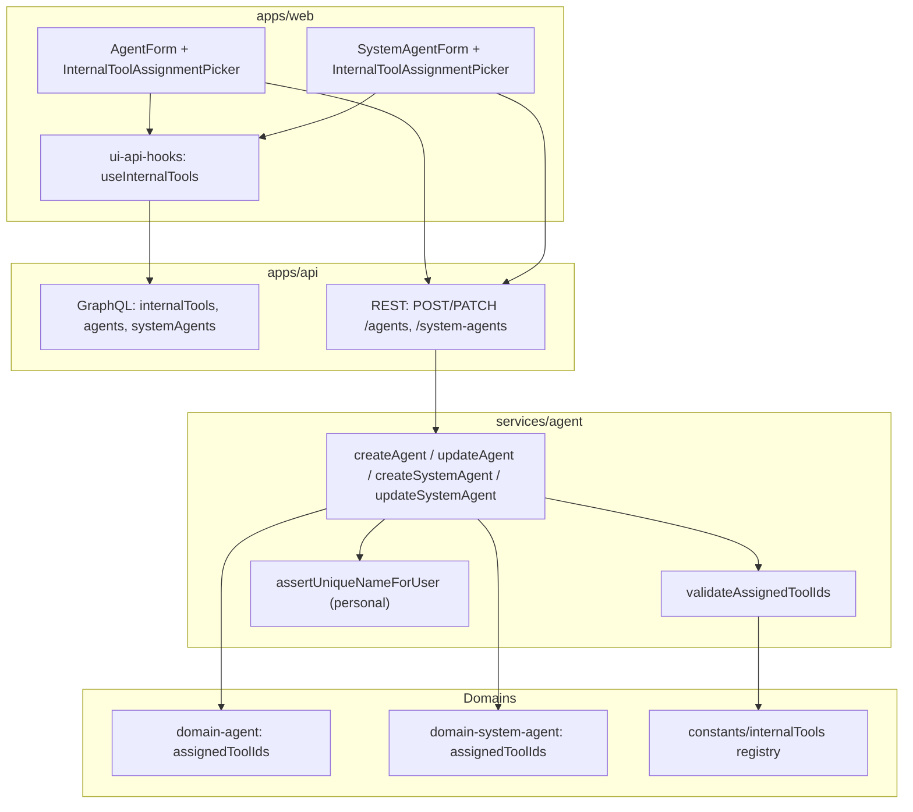
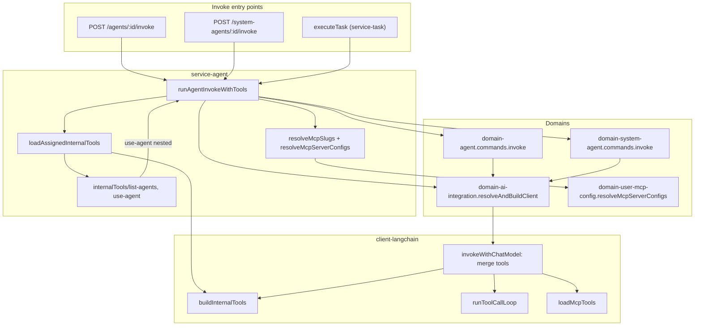
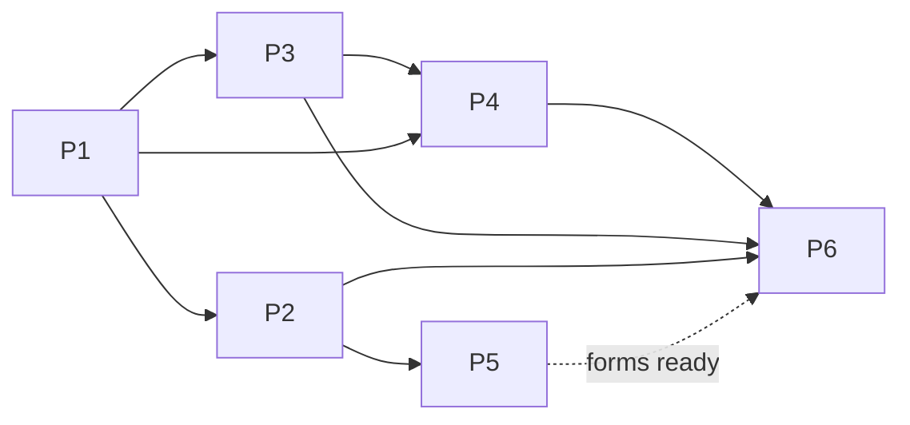

# Agent Internal Tools — Implementation Architecture

**Status:** Engineering handoff  
**Last updated:** 2026-06-14  
**Related:** [Agent MCP Assignment](../agent-mcp-assignment/architecture.md) · [Agent Management](../agent-management/architecture.md) · [System Agent](../system-agent/architecture.md) · [Async LLM Task Execution](../async-llm-task-execution/architecture.md)

This document defines the architecture for assigning **first-party internal tools** (`use-agent`, `list-agents`) to personal and system agents, exposing them via GraphQL/REST, and wiring merged internal + MCP tools into LLM invoke (sync and async). It incorporates a **librarian catalog pass** (~72–78% reuse of the MCP assignment stack).

**PRD:** [`prd.md`](./prd.md)

---

## Analysis

### Audit of existing domains and services

| Area | Package / path | Current capability | Reuse for this feature |
|------|----------------|-------------------|------------------------|
| Personal agent entity | `@vassembly/domain-agent` | `assignedMcpIds`, invoke with `mcpServerConfigs` | **Extend** with `assignedToolIds`; clone Zod/mapper/GraphQL pattern |
| System agent entity | `@vassembly/domain-system-agent` | CRUD, string-concat invoke (no tools) | **Extend** with `assignedToolIds`; **refactor invoke** to structured params |
| Agent orchestration | `@vassembly/service-agent` | `validateAssignedMcpIds`, `invokePersonalAgent` (MCP only) | **Extend** — tool validation, handlers, shared invoke engine |
| Task orchestration | `@vassembly/service-task` | `executeTask` → plain system invoke | **Extend** — share invoke engine with internal tools |
| LLM client | `@vassembly/client-langchain` | MCP-only branch in `invokeWithChatModel`; generic `runToolCallLoop` | **Extend** — internal tool factories + merge |
| Credential bridge | `@vassembly/domain-ai-integration` | `getModeledProviderClient` passes `mcpServerConfigs` | **Extend** — pass internal tool descriptors through invoke params |
| MCP runtime pattern | `@vassembly/domain-user-mcp-config` | Adapter registry + skip list | **Pattern only** — static registry + skip stale ids |
| Personal agent form | `apps/web/.../AgentForm` | `McpAssignmentPicker` | **Mirror** with `InternalToolAssignmentPicker` |
| System agent form | `apps/web/.../SystemAgentForm` | Admin CRUD, no assignment pickers | Add internal tools picker |
| Shared constants | `@vassembly/constants` | Auth roles, headers | **Extend** — registry metadata (ids, scopes, display) |
| API gateway | `apps/api` | Agent REST/GraphQL with `assignedMcpIds`; personal invoke | **Extend** — `internalTools` query, `assignedToolIds`, metadata |

### What can be reused (~75%)

| Layer | Reuse | Evidence |
|-------|-------|----------|
| Domain assignment field + Zod + mappers | **~90%** | `assignedMcpIds` end-to-end on personal agents; copy for `assignedToolIds` on both domains |
| Service write validation | **~75%** | `validateAssignedMcpIds` structure; simpler (static registry, no user config gate) |
| Service invoke orchestration | **~60%** | `invokePersonalAgent` MCP block is template; system invoke + `executeTask` need more work |
| `client-langchain` runtime | **~70%** | `runToolCallLoop` unchanged; `invokeWithChatModel` needs merge branch |
| API GraphQL/REST | **~80%** | Extend existing routes/resolvers; new `internalTools` query is small |
| UI picker + forms | **~85%** | `McpAssignmentPicker` is near-direct clone; catalog hook simpler than MCP config |
| Tool handlers (`use-agent`, `list-agents`) | **~0%** | Net-new business logic |
| Personal name uniqueness | **~40%** | Pattern from `system-agent` `assertUniqueActiveName` |

**Weighted overall: ~72–78%.** Net-new work concentrates in registry handlers, nested `use-agent`, system/async invoke parity, and personal name uniqueness.

### What must be new (~25%)

| Gap | Placement |
|-----|-----------|
| Static internal tool registry (metadata) | `packages/constants/src/internalTools/` |
| LangChain tool factories | `packages/client-langchain/src/internalTools/` |
| `assignedToolIds` on both agent models | `domains/agent/`, `domains/system-agent/` |
| `validateAssignedToolIds` + access scope | `services/agent/src/helpers/` |
| `list-agents` / `use-agent` handlers | `services/agent/src/helpers/internalTools/` |
| Shared nested invoke engine | `services/agent/src/helpers/internalTools/runAgentInvokeWithTools.ts` |
| Merge internal + MCP in invoke | `packages/client-langchain/src/operations/invokeWithChatModel.ts` |
| Personal agent name uniqueness (409) | `domains/agent/src/queries/assertUniqueNameForUser/` |
| System invoke structured params + tools | `domains/system-agent/src/commands/invoke/` |
| `InternalToolAssignmentPicker` UI | `apps/web/app/agents/_components/` |
| GraphQL `internalTools` catalog query | `apps/api/src/graphql/resolvers/` |

### New packages required

**No new packages for v1.** Extend existing domains, services, `client-langchain`, `constants`, `ui/api-hooks`, and `apps/web`.

### Librarian findings (incorporated)

- Clone `assignedMcpIds*` → `assignedToolIds*` across domain, service, API, UI
- **Split registry:** metadata in `@vassembly/constants` (readable by service + API without `client-*`); LangChain factories in `client-langchain` importing ids from constants
- **Handlers stay in service** — factories accept **injected handler map**; no `client-langchain` → `service-agent` import
- **`use-agent` must not call `invokePersonalAgent`/`invokeSystemAgent` directly** — extract `runAgentInvokeWithTools` to break circular imports
- **Prerequisite:** system agent invoke must move from string concat (`domains/system-agent/src/commands/invoke/index.ts`) to structured invoke (system message + tool params), matching personal agent path
- Services **must not** import `@vassembly/client-langchain` — bridge via `domain-ai-integration`
- `executeTask` should call exported helper from `service-agent`, not duplicate tool-loading logic

---

## Architecture & Package Placement

### Package / file placement table

| Package | Type | New / modified paths | Responsibility |
|---------|------|----------------------|----------------|
| `@vassembly/constants` | extend | `src/internalTools/registry.ts`, `src/internalTools/types.ts`, `src/index.ts` | Static catalog metadata: id, displayName, description, accessScope, llmToolName |
| `@vassembly/domain-agent` | extend | `src/model/model.ts`, `commands/shared/assignedToolIdsSchema.ts`, `commands/create/*`, `commands/update/*`, `queries/assertUniqueNameForUser/**`, `clients/mongodb.ts`, `model/dto.ts`, `model/graphql.ts`, `commands/invoke/types.ts` | Persist `assignedToolIds`; personal name uniqueness; invoke param extension |
| `@vassembly/domain-system-agent` | extend | `src/model/model.ts`, `commands/shared/assignedToolIdsSchema.ts`, `commands/create/*`, `commands/update/*`, `commands/invoke/*`, `model/dto.ts`, `model/graphql.ts` | Persist `assignedToolIds`; structured invoke with tools |
| `@vassembly/domain-ai-integration` | extend | `src/clients/langchain.ts` | Pass `internalToolBindings` through `ModeledProviderInvokeParams` → `AiProviderInvokeParams` |
| `@vassembly/service-agent` | extend | `src/helpers/validateAssignedToolIds.ts`, `src/helpers/internalTools/**`, `src/handlers/createAgent/*`, `updateAgent/*`, `createSystemAgent/*`, `updateSystemAgent/*`, `invokePersonalAgent/*`, `invokeSystemAgent/*` | Validation, tool handlers, shared invoke engine, metadata |
| `@vassembly/service-task` | extend | `src/handlers/executeTask/index.ts` | Call shared invoke engine instead of plain domain invoke |
| `@vassembly/client-langchain` | extend | `src/internalTools/**`, `src/operations/invokeWithChatModel.ts`, `src/operations/runToolCallLoop.ts`, `src/types.ts` | Tool factories, merge + bind, usage tracking |
| `apps/api` | extend | `src/graphql/resolvers/internalTool.ts`, `src/graphql/resolvers/agent.ts`, `systemAgent.ts`, `src/routes/agents/create.ts`, `update.ts`, `invoke.ts`, `src/routes/system-agents/schemas.ts`, `create.ts`, `update.ts`, `invoke.ts` | GraphQL catalog + type fields; REST validation; invoke metadata schema |
| `@vassembly/ui-api-hooks` | extend | `src/internalTools/**`, `src/agents/types.ts`, `src/systemAgents/types.ts`, GraphQL query docs | `useInternalTools` hook; extend agent types |
| `apps/web` | extend | `app/agents/_components/InternalToolAssignmentPicker/**`, `AgentForm/*`, `PlatformAgentsSection/SystemAgentForm/*`, create/edit page hooks | Picker + form state + REST payloads |

### High-level data flow — assignment (write path)



### High-level data flow — invoke (runtime)



### Layer responsibilities

| Package | Responsibility |
|---------|----------------|
| `constants` | Read-only registry metadata; O(1) lookup by id; no handlers |
| `domain-agent` / `domain-system-agent` | Persist `assignedToolIds`; shape validation; personal name uniqueness query |
| `service-agent` | Cross-domain validation (registry + access scope); tool handler business logic; shared invoke engine; metadata assembly |
| `service-task` | Delegate async execution to shared invoke engine |
| `domain-ai-integration` | Bridge invoke params to `client-langchain` (no service → client import) |
| `client-langchain` | Build LangChain tools from registry + injected handlers; merge with MCP; tool-call loop + usage tracking |
| `apps/api` | GraphQL reads; REST commands; invoke response schemas |
| `ui/api-hooks` + `apps/web` | Catalog hook; picker; form integration |

### Cross-package dependency rules

- Domains **do not** import each other or `client-langchain`
- Services **do not** import `@vassembly/client-*` — LangChain wiring via `domain-ai-integration`
- `client-langchain` **does not** import services — handlers injected at invoke time
- Registry metadata in `constants` — handlers in `service-agent` only
- **`use-agent` → `runAgentInvokeWithTools`** — never public handler → handler cycle

---

## Recommendation

**Most conservative approach:** Mirror the live MCP assignment vertical slice (`assignedMcpIds` → validate → picker → GraphQL/REST → invoke metadata) for `assignedToolIds`, add a **split static registry** (metadata in constants, factories in `client-langchain`), implement tool business logic in **`service-agent/src/helpers/internalTools/`**, and extract **`runAgentInvokeWithTools`** so personal invoke, system invoke, async `executeTask`, and nested `use-agent` share one tool-loading path.

**Trade-offs:**

| Decision | Choice | Alternative rejected |
|----------|--------|---------------------|
| Storage | `assignedToolIds: string[]` on agent documents | Separate assignment collection |
| Registry | Code in `constants` + factories in `client-langchain` | DB-seeded catalog; single package registry with handlers |
| Assignment API | Extend existing POST/PATCH | Dedicated sub-resource |
| Catalog read | GraphQL `internalTools` query | REST endpoint (violates query convention) |
| Nested invoke | Shared `runAgentInvokeWithTools` helper | Handler calls itself (circular import risk) |
| Tool merge precedence | Internal tools win on name collision | MCP wins; fail on collision |
| Personal name uniqueness | Enforce on create/update (409); ambiguity error at runtime for legacy dupes | DB migration backfill (out of scope v1) |
| Max assigned tools | No artificial cap v1 (catalog size is natural limit) | Mirror MCP max-5 (unnecessary for 2 static tools) |

---

## 1. Data Model Changes

### 1.1 Agent model extensions

**Personal agents — file:** `domains/agent/src/model/model.ts`

```typescript
assignedToolIds?: string[];  // registry tool ids; default []
```

**System agents — file:** `domains/system-agent/src/model/model.ts`

```typescript
assignedToolIds?: string[];  // registry tool ids; default []
```

| Field | Type | Notes |
|-------|------|-------|
| `assignedToolIds` | `string[]` | References static registry `id` (e.g. `use-agent`, `list-agents`) |
| Default on create | `[]` | Omit from body → persist empty array |
| Uniqueness | Required | Reject duplicate ids in same array |
| Order | Preserved | UI display order only; no invoke ordering semantics |
| Max length | None v1 | Catalog has 2 entries; add constant later if catalog grows |

### 1.2 MongoDB document shape

**Collections:** `agents`, `systemAgents` (unchanged names)

```json
{
  "assignedMcpIds": ["mcp-id-1"],
  "assignedToolIds": ["list-agents", "use-agent"]
}
```

**Migration:** No backfill. Mappers use `assignedToolIds ?? []`.

### 1.3 Indexes

**Personal agent name uniqueness — file:** `domains/agent/src/clients/mongodb.ts`

```typescript
await collection.createIndex(
  { userId: 1, name: 1 },
  {
    unique: true,
    partialFilterExpression: { removedAt: null, status: 'active' },
    collation: { locale: 'en', strength: 2 }, // case-insensitive
  },
);
```

Alternative: normalized `nameLower` field — prefer collation index if supported in existing Mongo setup (mirror how system agent uses regex in `assertUniqueActiveName`; index + query must agree).

**Optional (defer unless reverse lookup needed):** `{ assignedToolIds: 1 }` multikey — not required v1 (no reverse-lookup UI).

### 1.4 Validation rules

| Rule | Layer | Error |
|------|-------|-------|
| No duplicate ids | Domain Zod | `ValidationError` (400) |
| Each id non-empty string | Domain Zod | `ValidationError` (400) |
| Each id exists in registry | Service `validateAssignedToolIds` | `ValidationError` / `WrongParamError` (400) |
| Personal: tool `accessScope` allows personal | Service | `WrongParamError` (400) — `SYSTEM_ONLY` rejected |
| System: any registry tool allowed | Service | — |
| Personal name unique per user (active) | Service on create/update | `ConflictError` (409) |
| Agent ownership / admin | Service (existing) | `NotFoundError` / `ForbiddenError` |

**Stale references:** If a tool id is removed from registry in a later deploy, persisted ids remain; **write** validation fails on edit; **invoke** skips with `skippedInternalToolIds` (mirrors MCP stale behavior).

### 1.5 DTO and GraphQL

Extend `toAgentResponse` / `toSystemAgentResponse` — always return `assignedToolIds: string[]`.

**GraphQL** — extend domain schemas:

```graphql
enum InternalToolAccessScope {
  SYSTEM_AND_PERSONAL
  SYSTEM_ONLY
}

type InternalTool {
  id: ID!
  displayName: String!
  description: String!
  accessScope: InternalToolAccessScope!
}

type Query {
  internalTools: [InternalTool!]!
}

type Agent {
  assignedToolIds: [ID!]!
}

type SystemAgent {
  assignedToolIds: [ID!]!
}
```

Catalog resolver reads from `@vassembly/constants` registry (or thin `listInternalTools` service handler returning constants).

---

## 2. Internal Tool Registry (v1)

### 2.1 Registry metadata — `@vassembly/constants`

**Directory:** `packages/constants/src/internalTools/`

```
internalTools/
├── index.ts           # exports registry, helpers
├── registry.ts        # INTERNAL_TOOL_REGISTRY array
├── types.ts           # InternalToolDefinition, InternalToolAccessScope
└── constants.ts       # INTERNAL_TOOL_IDS, MAX_USE_AGENT_DEPTH = 2
```

**Entry shape (metadata only — no handlers):**

| Property | v1 `use-agent` | v1 `list-agents` |
|----------|----------------|------------------|
| `id` | `use-agent` | `list-agents` |
| `displayName` | Use agent | List agents |
| `description` | Delegate to another agent by name | List agents visible to caller |
| `accessScope` | `SYSTEM_AND_PERSONAL` | `SYSTEM_AND_PERSONAL` |
| `llmToolName` | `use_agent` | `list_agents` |

**Helpers:**

```typescript
export const getInternalToolById = (id: string): InternalToolDefinition | undefined;
export const getAllInternalTools = (): InternalToolDefinition[];
export const isToolEligibleForAgentType = (tool, agentType: 'personal' | 'system'): boolean;
```

Pattern reference: `domains/user-mcp-config/src/commands/resolveMcpServerConfigs/adapters/index.ts` (slug → adapter map). Internal tools use **id → metadata** only; execution lives in service.

### 2.2 LangChain factories — `@vassembly/client-langchain`

**Directory:** `packages/client-langchain/src/internalTools/`

```
internalTools/
├── index.ts
├── buildInternalTools.ts
├── types.ts              # InternalToolHandler, InternalToolBinding, BuildInternalToolsResult
└── schemas/
    ├── useAgentSchema.ts
    └── listAgentsSchema.ts
```

**`buildInternalTools`** accepts:

```typescript
export interface BuildInternalToolsParams {
  toolIds: string[];
  handlers: Record<string, InternalToolHandler>;  // injected by service
}

export interface BuildInternalToolsResult {
  tools: DynamicStructuredTool[];
  boundToolIds: string[];
  skippedToolIds: string[];
}
```

- Look up metadata from `@vassembly/constants` (add workspace dependency)
- Build Zod schema for LLM-visible params only (`use-agent`: `name`, `agentPrompt`; `list-agents`: empty object)
- Skip unknown/stale ids → `skippedToolIds`
- **Never** expose `userId`, credential ids, or admin fields in schemas

---

## 3. Domain Layer

### 3.1 `@vassembly/domain-agent`

#### Zod schema — mirror MCP

**File:** `domains/agent/src/commands/shared/assignedToolIdsSchema.ts`

Clone `assignedMcpIdsSchema.ts` without max-length cap (or use generous cap if desired):

```typescript
const ASSIGNED_TOOL_IDS_BASE = z
  .array(z.string().min(1))
  .refine((ids) => new Set(ids).size === ids.length, {
    message: 'assignedToolIds must not contain duplicates',
  });

export const assignedToolIdsCreateSchema = ASSIGNED_TOOL_IDS_BASE.optional().default([]);
export const assignedToolIdsUpdateSchema = ASSIGNED_TOOL_IDS_BASE.optional();
```

Wire into `commands/create/index.ts`, `commands/update/index.ts`.

#### Personal name uniqueness query

**Directory:** `domains/agent/src/queries/assertUniqueNameForUser/`

Mirror `domains/system-agent/src/queries/assertUniqueActiveName/`:

```typescript
export interface AssertUniqueNameForUserParams {
  userId: string;
  name: string;
  excludeId?: string;
}

// Throws ConflictError('Agent name already in use') on duplicate among active, non-removed agents
```

Call from `service-agent` create/update handlers **before** domain command.

#### Invoke types extension

**File:** `domains/agent/src/commands/invoke/types.ts`

```typescript
export interface InternalToolBinding {
  toolId: string;
  handler: (args: Record<string, unknown>) => Promise<string>;
}

export interface ModeledProviderInvokeParams {
  message: string;
  systemMessage?: string;
  mcpServerConfigs?: AgentInvokeMcpServerConfig[];
  internalToolBindings?: InternalToolBinding[];
}

export interface InvokeAgentParams {
  // ...existing
  internalToolBindings?: InternalToolBinding[];
}
```

> **Note:** Handler functions are opaque to the domain — domain passes bindings through to `modeledProviderClient.invoke`. Service constructs bindings; domain does not import handler implementations.

**File:** `domains/agent/src/commands/invoke/index.ts` — pass `internalToolBindings` through.

#### Tests

| File | Cases |
|------|-------|
| `commands/create/index.test.ts` | Default `[]`; duplicates rejected |
| `commands/update/index.test.ts` | Replace array; clear to `[]` |
| `queries/assertUniqueNameForUser/index.test.ts` | Case-insensitive conflict; excludeId on update |

### 3.2 `@vassembly/domain-system-agent`

#### Model + schema

Same `assignedToolIds` pattern in create/update schemas and mappers.

#### Invoke refactor (prerequisite for tools)

**Files:** `domains/system-agent/src/commands/invoke/index.ts`, `types.ts`

Replace string concat:

```typescript
// Before
const prompt = `${agentResult.data.rule}\n\n${validated.message}`;
const response = await params.modeledProviderClient.invoke(prompt);

// After
const response = await params.modeledProviderClient.invoke({
  message: validated.message,
  systemMessage: agentResult.data.rule,
  mcpServerConfigs: params.mcpServerConfigs,
  internalToolBindings: params.internalToolBindings,
});
```

Extend `InvokeSystemAgentParams` / result types accordingly.

#### Tests

- Invoke passes structured params (mock client)
- Create/update with `assignedToolIds`

### 3.3 `@vassembly/domain-ai-integration`

**File:** `domains/ai-integration/src/clients/langchain.ts`

Extend `ModeledProviderInvokeParams`:

```typescript
export interface InternalToolBinding {
  toolId: string;
  handler: (args: Record<string, unknown>) => Promise<string>;
}

export interface ModeledProviderInvokeParams {
  message: string;
  systemMessage?: string;
  mcpServerConfigs?: AiProviderInvokeParams['mcpServerConfigs'];
  internalToolBindings?: InternalToolBinding[];
}
```

In `getModeledProviderClient.invoke`, map bindings to `client-langchain` params (see §6).

---

## 4. Service Handlers

### 4.1 `validateAssignedToolIds`

**File:** `services/agent/src/helpers/validateAssignedToolIds.ts`

```typescript
export interface ValidateAssignedToolIdsParams {
  assignedToolIds: string[];
  agentType: 'personal' | 'system';
}

export const validateAssignedToolIds = async (params): Promise<void> => {
  for (const toolId of params.assignedToolIds) {
    const tool = getInternalToolById(toolId);
    if (!tool) throw new WrongParamError(`Unknown internal tool: ${toolId}`);
    if (params.agentType === 'personal' && tool.accessScope === 'SYSTEM_ONLY') {
      throw new WrongParamError(`Tool ${toolId} is not available for personal agents`);
    }
  }
};
```

Simpler than `validateAssignedMcpIds` — no cross-domain DB lookups.

Wire into `createAgent`, `updateAgent`, `createSystemAgent`, `updateSystemAgent`.

### 4.2 Internal tool handlers

**Directory:** `services/agent/src/helpers/internalTools/`

```
internalTools/
├── index.ts                        # createInternalToolHandlers, loadAssignedInternalTools
├── types.ts                        # InternalToolContext, InternalToolHandlerMap
├── loadAssignedInternalTools.ts    # resolve handlers + build bindings
├── listAgents/
│   ├── index.ts
│   ├── types.ts
│   └── index.test.ts
├── useAgent/
│   ├── index.ts
│   ├── types.ts
│   ├── resolveTarget.ts
│   └── index.test.ts
└── runAgentInvokeWithTools.ts      # shared invoke engine
```

#### Runtime context (transient)

```typescript
export interface InternalToolContext {
  userId: string;
  callerAgentType: 'personal' | 'system';
  callerAgentId: string;
  recursionDepth: number;       // 0 at root; increment on use-agent
  rootInvokeId: string;
}
```

#### `list-agents` handler

| Aspect | Specification |
|--------|---------------|
| LLM params | None (empty schema) |
| Personal caller | Active personal agents for `userId`: `{ name, description, category, agentType: 'personal' }` |
| System caller | Active system agents + user's personal agents; include `agentType` per row |
| Security | Never accept `userId` from LLM; always `context.userId` |

Uses `agentDomain.queries` (list by userId) and `systemAgentDomain.queries` (active catalog) — **service composes**, domains do not cross-import.

#### `use-agent` handler

| Aspect | Specification |
|--------|---------------|
| LLM params | `name: string`, `agentPrompt: string` (non-empty) |
| Depth check | Reject when `recursionDepth >= MAX_USE_AGENT_DEPTH` (2) |
| Personal caller targets | Personal agents for `userId` only |
| System caller targets | System catalog first (case-insensitive name), then personal for `userId` |
| Ambiguity | Multiple personal matches → user-safe ambiguity error |
| Nested invoke | Call **`runAgentInvokeWithTools`** with target agent id/type, `message: agentPrompt`, `recursionDepth + 1` |
| Credentials | Personal target → `integrationCredentialId`; system target → user's system-call preference |
| Target tools | Nested invoke loads target's `assignedToolIds` + `assignedMcpIds` |

**User-safe error messages** (from PRD §5.5):

- Depth: *Maximum agent delegation depth reached.*
- Not allowed: *That agent cannot be invoked by this agent.*
- Not found: *No agent named "{name}" was found.*
- Ambiguous: *Multiple agents match this name. Rename agents to continue.*
- Missing credential: *The selected agent does not have a connected AI integration.*

### 4.3 Shared invoke engine

**File:** `services/agent/src/helpers/internalTools/runAgentInvokeWithTools.ts`

Single orchestration used by:

- `invokePersonalAgent`
- `invokeSystemAgent`
- `executeTask` (via export)
- `use-agent` nested calls

```typescript
export interface RunAgentInvokeWithToolsParams {
  userId: string;
  agentType: 'personal' | 'system';
  agentId: string;
  message: string;
  connectionOverride?: { integrationCredentialId: string };
  toolContext: InternalToolContext;
}

export interface RunAgentInvokeWithToolsResult {
  message: string;
  usage?: { promptTokens: number; completionTokens: number };
  metadata: {
    model?: string;
    mcpIdsUsed: string[];
    skippedMcpIds: string[];
    internalToolIdsUsed: string[];
    skippedInternalToolIds: string[];
    maxUseAgentDepth: number;
  };
}
```

**Flow:**

1. Load agent (personal: ownership check; system: active check)
2. Resolve credential (`integrationCredentialId` or system-call preference / override)
3. `resolveAndBuildClient`
4. Resolve MCP configs (personal: `assignedMcpIds`; system: `[]` v1 or future field)
5. `loadAssignedInternalTools({ assignedToolIds, toolContext })` → bindings + skip list
6. Domain invoke command with structured params
7. Return message + metadata (tool ids used tracked from client-langchain result)

Refactor existing `invokePersonalAgent` to delegate to this engine at `recursionDepth: 0`.

### 4.4 Extend create/update handlers

| Handler | File | Change |
|---------|------|--------|
| `createAgent` | `handlers/createAgent/index.ts` | `validateAssignedToolIds`; `assertUniqueNameForUser` |
| `updateAgent` | `handlers/updateAgent/index.ts` | Same when `assignedToolIds` or `name` present |
| `createSystemAgent` | `handlers/createSystemAgent/index.ts` | `validateAssignedToolIds` (system type) |
| `updateSystemAgent` | `handlers/updateSystemAgent/index.ts` | Same |

### 4.5 `@vassembly/service-task`

**File:** `services/task/src/handlers/executeTask/index.ts`

Replace direct `systemAgentDomain.commands.invoke` with:

```typescript
import { runAgentInvokeWithTools } from '@vassembly/service-agent/helpers/internalTools/runAgentInvokeWithTools';
// Or export from service-agent handlers index — prefer named export from helpers
```

Pass `userId` from task context, `agentType: 'system'`, `agentId: task.agentAssignedId`, `message: task.description`, `toolContext` with `recursionDepth: 0` and new `rootInvokeId`.

**Package dependency:** Add `@vassembly/service-agent` to `services/task/package.json` if not present (one-way: task → agent service).

---

## 5. API Design

Convention: **GraphQL for reads**, **REST for commands**.

### 5.1 GraphQL

#### `internalTools` query

**File:** `apps/api/src/graphql/resolvers/internalTool.ts`

```graphql
query InternalTools {
  internalTools {
    id
    displayName
    description
    accessScope
  }
}
```

Resolver returns `getAllInternalTools()` from constants. Auth: JWT required (same as other queries).

Register in `apps/api/src/graphql/index.ts`.

#### Extend agent types

Ensure `assignedToolIds` exposed on `Agent` and `SystemAgent` via domain GraphQL schemas (already pattern for `assignedMcpIds` on personal agents).

### 5.2 REST — agent create/update

**Files:** `apps/api/src/routes/agents/create.ts`, `update.ts`

```typescript
assignedToolIds: z
  .array(z.string().min(1))
  .optional()
  .default([]),  // create only
```

**Files:** `apps/api/src/routes/system-agents/schemas.ts`, `create.ts`, `update.ts`

Same field; admin-only (existing middleware).

**Response schemas:** Add `assignedToolIds: z.array(z.string())`.

### 5.3 REST — invoke metadata

**Files:** `apps/api/src/routes/agents/invoke.ts`, `system-agents/invoke.ts`

Extend response metadata:

```typescript
metadata: z.object({
  model: z.string().optional(),
  mcpIdsUsed: z.array(z.string()).optional(),
  skippedMcpIds: z.array(z.string()).optional(),
  internalToolIdsUsed: z.array(z.string()).optional(),
  skippedInternalToolIds: z.array(z.string()).optional(),
  maxUseAgentDepth: z.number().optional(),
}).optional(),
```

### 5.4 Error mapping

| Situation | HTTP | Error |
|-----------|------|-------|
| Unknown / duplicate tool ids | 400 | `ValidationError` / `WrongParamError` |
| Tool not eligible for personal agent | 400 | `WrongParamError` |
| Duplicate personal agent name | 409 | `ConflictError` |
| Agent not owned / not found | 404 | `NotFoundError` |
| System agent write by non-admin | 403 | `ForbiddenError` |

---

## 6. LLM Runtime Integration

### 6.1 Overview

```
API → service-agent.runAgentInvokeWithTools
    → domain-ai-integration.resolveAndBuildClient
    → domain-{agent|system-agent}.commands.invoke (structured)
    → domain-ai-integration.getModeledProviderClient
    → client-langchain.invokeWithChatModel
        → buildInternalTools (injected handlers)
        → loadMcpTools
        → merge tools (internal precedence on name collision)
        → runToolCallLoop
```

### 6.2 Extend `@vassembly/client-langchain`

**File:** `packages/client-langchain/src/types.ts`

```typescript
export interface InternalToolBinding {
  toolId: string;
  handler: (args: Record<string, unknown>) => Promise<string>;
}

export interface AiProviderInvokeParams {
  model: string;
  message: string;
  systemMessage?: string;
  mcpServerConfigs?: McpServerConfig[];
  internalToolBindings?: InternalToolBinding[];
}

export interface AiProviderInvokeResult {
  message: string;
  model: string;
  toolUsage?: {
    internalToolIdsUsed: string[];
    skippedInternalToolIds: string[];
    skippedMcpToolNames?: string[];
  };
}
```

**File:** `packages/client-langchain/src/operations/invokeWithChatModel.ts`

Refactor `invokeModel`:

```typescript
const mcpServerConfigs = invokeParams.mcpServerConfigs ?? [];
const internalBindings = invokeParams.internalToolBindings ?? [];

const hasTools = mcpServerConfigs.length > 0 || internalBindings.length > 0;

if (!hasTools) {
  // existing message-only path
}

const { tools: internalTools, boundToolIds, skippedToolIds } =
  buildInternalTools({ toolIds: internalBindings.map(b => b.toolId), handlers: ... });

const { tools: mcpTools, close } = await loadMcpTools({ serverConfigs: mcpServerConfigs });

const mergedTools = mergeToolsWithInternalPrecedence({ internalTools, mcpTools });
// log skipped MCP tools on name collision

try {
  const response = await runToolCallLoop({ model, tools: mergedTools, messages, maxIterations });
  return { message, toolUsage: trackUsedTools(...) };
} finally {
  await close();
}
```

**Merge rule (PRD §6.5):** Internal tool names take precedence; conflicting MCP tools skipped with observability log.

**Constants:** Reuse `MCP_TOOL_MAX_ITERATIONS = 10` for combined loop. Root invoke timeout 60s unchanged (nested calls share budget).

### 6.3 Tool usage tracking

Extend `runToolCallLoop` or wrap at invoke level to record which internal tool ids executed at least once → `internalToolIdsUsed`. Skipped at load time → `skippedInternalToolIds` from `buildInternalTools`.

### 6.4 Invoke failure modes

| Scenario | Behavior |
|----------|----------|
| Stale tool id in persisted agent | Skip; include in `skippedInternalToolIds`; invoke continues |
| `use-agent` depth exceeded | Tool returns error string; loop may continue |
| Target missing credential | Tool returns user-safe error; no secret leakage |
| MCP + internal name collision | MCP tool skipped; internal bound |
| No tools resolved | Standard LLM invoke (messages only) |

---

## 7. UI Changes

### 7.1 `InternalToolAssignmentPicker`

**Directory:** `apps/web/app/agents/_components/InternalToolAssignmentPicker/`

Mirror `McpAssignmentPicker/`:

```
InternalToolAssignmentPicker/
├── InternalToolAssignmentPicker.tsx
├── types.ts
├── styles.module.scss
└── index.ts
```

| Prop | Type | Notes |
|------|------|-------|
| `value` | `string[]` | Selected registry ids |
| `onChange` | `(ids: string[]) => void` | |
| `tools` | `InternalToolItem[]` | From `useInternalTools`, pre-filtered by agent type |
| `isLoading` | `boolean` | |
| `errorMessage` | `string?` | |
| `agentType` | `'personal' \| 'system'` | Filters `SYSTEM_ONLY` on personal forms |

**UX (PRD §5.1):**

- Label: **Internal tools**
- Helper: *Platform capabilities such as listing agents and delegating to another agent.*
- Multi-select dropdown + removable chips with `displayName`
- Stale id chip: *This tool is no longer available. Remove it to save.*
- Separate section from MCP picker — do not combine controls
- No max counter (unlike MCP 2/5) unless product adds cap later

### 7.2 Form integration

| File | Change |
|------|--------|
| `AgentForm/AgentForm.tsx` | Add picker below MCP section |
| `AgentForm/useAgentForm.ts` | `assignedToolIds` in Zod + initial values |
| `AgentForm/types.ts` | Extend form values |
| `agents/create/useAgentCreatePage.ts` | POST body |
| `agents/[id]/edit/useAgentEditPage.ts` | PATCH body |
| `SystemAgentForm/SystemAgentForm.tsx` | Add picker (all eligible tools) |
| System agent create/edit page hooks | REST payloads |

### 7.3 API hooks

**Directory:** `ui/api-hooks/src/internalTools/`

| File | Purpose |
|------|---------|
| `queries/INTERNAL_TOOLS_QUERY.ts` | GraphQL document |
| `useInternalTools.ts` | Catalog hook |
| `types.ts` | `InternalToolDto`, access scope enum |
| `index.ts` | Public exports |

Extend `ui/api-hooks/src/agents/types.ts`, `listAgentsQuery.ts`, `systemAgents/types.ts` with `assignedToolIds`.

Extend `useInvokePersonalAgent` / system invoke types with internal tool metadata fields.

### 7.4 Optional v1 enhancement

Invoke modals may show assigned internal tool display names (read-only) — same pattern as MCP names; **not blocking** for v1.

---

## 8. Test Strategy

### 8.1 Unit tests by layer

| Layer | File focus | Critical cases |
|-------|------------|----------------|
| **constants** | `internalTools/registry.test.ts` | v1 entries; `getInternalToolById`; eligibility helper |
| **domain-agent** | create/update, `assertUniqueNameForUser` | Default `[]`; duplicates; case-insensitive name conflict |
| **domain-system-agent** | create/update, invoke | Structured invoke params; `assignedToolIds` persistence |
| **service-agent** | `validateAssignedToolIds`, handlers, `runAgentInvokeWithTools` | Unknown id; `SYSTEM_ONLY` on personal; list-agents scope; use-agent depth 2 block; system-before-personal name resolution; ambiguity; nested credential rules |
| **client-langchain** | `buildInternalTools`, `invokeWithChatModel` | Merge precedence; skip stale ids; usage tracking; mock handlers |
| **service-task** | `executeTask` | Delegates to invoke engine; MISSING_CREDENTIAL unchanged |
| **apps/api** | Route schemas | 400 unknown tools; 409 duplicate name |
| **ui/api-hooks** | `useInternalTools` | Maps GraphQL catalog |
| **apps/web** | Picker + form tests | Filter system-only; stale chip; separate from MCP |

### 8.2 Integration tests

| Scenario | Suggested location |
|----------|-------------------|
| GraphQL `internalTools` returns 2 entries | `apps/api/e2e/features/agents/agent-internal-tools.feature` |
| POST/PATCH persists `assignedToolIds` | Same |
| Reject unknown tool id (400) | Same |
| Duplicate personal name (409) | Same |
| Personal invoke metadata includes internal tool fields | Same (smoke with mocked LLM if needed) |
| `executeTask` loads internal tools | `apps/api/e2e/features/tasks/task-internal-tools.feature` |
| Picker separate from MCP on form | `apps/web/e2e/features/agents/agent-internal-tools-picker.feature` |

### 8.3 Test-first delegation hints

| Package | Write tests first for |
|---------|----------------------|
| `constants` | Registry helpers |
| `domain-agent` | `assignedToolIdsSchema`, `assertUniqueNameForUser` |
| `domain-system-agent` | Structured invoke contract |
| `service-agent` | `validateAssignedToolIds`, `list-agents`, `use-agent`, depth limit |
| `client-langchain` | `buildInternalTools`, merge in `invokeWithChatModel` |

### 8.4 Definition of done (architecture)

- [ ] Registry with `use-agent`, `list-agents` and access scopes
- [ ] `assignedToolIds` on personal + system agents (GraphQL + REST)
- [ ] `InternalToolAssignmentPicker` on both forms (separate from MCP)
- [ ] Personal name uniqueness 409 on create/update
- [ ] Merged internal + MCP tools at invoke; metadata fields populated
- [ ] `use-agent` recursion capped at depth 2
- [ ] `executeTask` parity with sync system invoke
- [ ] Vitest at domain + service + client-langchain layers
- [ ] No service → `client-langchain` direct imports

---

## 9. Implementation Phases

### Phase overview

| Phase | Scope | Key deliverable |
|-------|-------|-----------------|
| **P1 — Registry & domain model** | constants, domain-agent, domain-system-agent | Registry metadata, `assignedToolIds`, schemas, personal name uniqueness query |
| **P2 — Service & API** | service-agent validation, apps/api, ui-api-hooks types | REST/GraphQL assignment + catalog; 409 name conflict |
| **P3 — Runtime loaders** | client-langchain, domain-ai-integration | `buildInternalTools`, merge in `invokeWithChatModel`, invoke param bridge |
| **P4 — Tool handlers** | service-agent internalTools | `list-agents`, `use-agent`, `runAgentInvokeWithTools` |
| **P5 — UI pickers** | apps/web, ui-api-hooks | `InternalToolAssignmentPicker`, form wiring |
| **P6 — Invoke & async wiring** | invoke handlers, executeTask, system invoke refactor | End-to-end tool execution + metadata |

**Dependency graph:**



P5 and P6 can proceed in parallel after P4. P6 must complete for v1 acceptance.

### P1 — Registry & domain model (file-level)

| File | Action |
|------|--------|
| `packages/constants/src/internalTools/registry.ts` | **Create** — v1 entries |
| `packages/constants/src/internalTools/types.ts` | **Create** |
| `packages/constants/src/internalTools/index.ts` | **Create** |
| `packages/constants/src/index.ts` | **Modify** — export internal tools |
| `domains/agent/src/model/model.ts` | **Modify** — `assignedToolIds` |
| `domains/agent/src/commands/shared/assignedToolIdsSchema.ts` | **Create** |
| `domains/agent/src/commands/create/index.ts` | **Modify** |
| `domains/agent/src/commands/update/index.ts` | **Modify** |
| `domains/agent/src/model/toAgentResponse.ts`, `dto.ts`, `graphql.ts` | **Modify** |
| `domains/agent/src/queries/assertUniqueNameForUser/index.ts` | **Create** |
| `domains/agent/src/clients/mongodb.ts` | **Modify** — name uniqueness index |
| `domains/system-agent/src/model/model.ts` | **Modify** |
| `domains/system-agent/src/commands/shared/assignedToolIdsSchema.ts` | **Create** |
| `domains/system-agent/src/commands/create/index.ts`, `update/index.ts` | **Modify** |
| `domains/system-agent/src/model/toSystemAgentResponse.ts`, `dto.ts`, `graphql.ts` | **Modify** |

### P2 — Service & API (file-level)

| File | Action |
|------|--------|
| `services/agent/src/helpers/validateAssignedToolIds.ts` | **Create** |
| `services/agent/src/handlers/createAgent/index.ts` | **Modify** |
| `services/agent/src/handlers/updateAgent/index.ts` | **Modify** |
| `services/agent/src/handlers/createSystemAgent/index.ts` | **Modify** |
| `services/agent/src/handlers/updateSystemAgent/index.ts` | **Modify** |
| `apps/api/src/graphql/resolvers/internalTool.ts` | **Create** |
| `apps/api/src/graphql/index.ts` | **Modify** |
| `apps/api/src/routes/agents/create.ts`, `update.ts` | **Modify** |
| `apps/api/src/routes/system-agents/schemas.ts`, `create.ts`, `update.ts` | **Modify** |
| `ui/api-hooks/src/internalTools/**` | **Create** |
| `ui/api-hooks/src/agents/types.ts`, `listAgentsQuery.ts` | **Modify** |
| `ui/api-hooks/src/systemAgents/types.ts` | **Modify** |

### P3 — Runtime loaders (file-level)

| File | Action |
|------|--------|
| `packages/client-langchain/src/internalTools/buildInternalTools.ts` | **Create** |
| `packages/client-langchain/src/internalTools/types.ts` | **Create** |
| `packages/client-langchain/src/internalTools/schemas/*.ts` | **Create** |
| `packages/client-langchain/src/operations/invokeWithChatModel.ts` | **Modify** — merge path |
| `packages/client-langchain/src/operations/runToolCallLoop.ts` | **Modify** — optional usage tracking |
| `packages/client-langchain/src/types.ts` | **Modify** |
| `packages/client-langchain/package.json` | **Modify** — depend on `@vassembly/constants` |
| `domains/agent/src/commands/invoke/types.ts`, `index.ts` | **Modify** |
| `domains/system-agent/src/commands/invoke/types.ts`, `index.ts` | **Modify** — structured invoke |
| `domains/ai-integration/src/clients/langchain.ts` | **Modify** |

### P4 — Tool handlers (file-level)

| File | Action |
|------|--------|
| `services/agent/src/helpers/internalTools/types.ts` | **Create** |
| `services/agent/src/helpers/internalTools/listAgents/index.ts` | **Create** |
| `services/agent/src/helpers/internalTools/useAgent/index.ts` | **Create** |
| `services/agent/src/helpers/internalTools/useAgent/resolveTarget.ts` | **Create** |
| `services/agent/src/helpers/internalTools/loadAssignedInternalTools.ts` | **Create** |
| `services/agent/src/helpers/internalTools/runAgentInvokeWithTools.ts` | **Create** |
| `services/agent/src/helpers/internalTools/index.ts` | **Create** |

### P5 — UI pickers (file-level)

| File | Action |
|------|--------|
| `apps/web/app/agents/_components/InternalToolAssignmentPicker/**` | **Create** |
| `apps/web/app/agents/_components/AgentForm/AgentForm.tsx` | **Modify** |
| `apps/web/app/agents/_components/AgentForm/useAgentForm.ts` | **Modify** |
| `apps/web/app/agents/create/useAgentCreatePage.ts` | **Modify** |
| `apps/web/app/agents/[id]/edit/useAgentEditPage.ts` | **Modify** |
| `apps/web/app/agents/_components/PlatformAgentsSection/SystemAgentForm/SystemAgentForm.tsx` | **Modify** |
| System agent create/edit page hooks | **Modify** |

### P6 — Invoke & async wiring (file-level)

| File | Action |
|------|--------|
| `services/agent/src/handlers/invokePersonalAgent/index.ts` | **Modify** — delegate to `runAgentInvokeWithTools` |
| `services/agent/src/handlers/invokeSystemAgent/index.ts` | **Modify** — delegate to engine |
| `services/task/src/handlers/executeTask/index.ts` | **Modify** |
| `services/task/package.json` | **Modify** — depend on service-agent helper export |
| `apps/api/src/routes/agents/invoke.ts` | **Modify** — metadata schema |
| `apps/api/src/routes/system-agents/invoke.ts` | **Modify** — metadata schema |
| `ui/api-hooks/src/agents/useInvokePersonalAgent.ts` | **Modify** — metadata types |

---

## 10. Risks and Mitigations

| Risk | Impact | Mitigation |
|------|--------|------------|
| `use-agent` circular imports | Build/runtime failure | `runAgentInvokeWithTools` shared engine; handlers never call public invoke handlers |
| System invoke still string-concat | Tools cannot bind | P3 includes system invoke refactor before P6 |
| Service imports `client-langchain` | Architecture violation | All wiring via `domain-ai-integration` + bindings |
| Legacy duplicate personal agent names | Ambiguous `use-agent` | 409 on new writes; runtime ambiguity error per PRD |
| Nested invoke timeout | Root 60s exceeded | Depth cap 2; log depth + duration |
| Name collision internal vs MCP tools | Wrong tool executed | Internal precedence + log skipped MCP binding |
| `executeTask` divergence | Async missing tools | Single engine exported from service-agent |

---

## Todo Plan

1. **`@vassembly/constants`** — [Type: extend utility]
   - Changes: Static internal tool registry metadata + helpers
   - Files: `src/internalTools/registry.ts`, `types.ts`, `index.ts`, `src/index.ts`
   - Workflow: unit-test-writer → coder ↔ code-reviewer (max 2)
   - Dependencies: None

2. **`@vassembly/domain-agent`** — [Type: extend domain]
   - Changes: `assignedToolIds`; Zod; DTO/GraphQL; `assertUniqueNameForUser`; name index; invoke type extension
   - Files: `src/model/*`, `commands/shared/assignedToolIdsSchema.ts`, `commands/create/*`, `commands/update/*`, `queries/assertUniqueNameForUser/**`, `clients/mongodb.ts`, `commands/invoke/types.ts`
   - Workflow: unit-test-writer → coder ↔ code-reviewer (max 2) → documentation-writer
   - Dependencies: Todo 1

3. **`@vassembly/domain-system-agent`** — [Type: extend domain]
   - Changes: `assignedToolIds`; Zod; DTO/GraphQL; structured invoke types
   - Files: `src/model/*`, `commands/shared/assignedToolIdsSchema.ts`, `commands/create/*`, `commands/update/*`, `commands/invoke/*`
   - Workflow: unit-test-writer → coder ↔ code-reviewer (max 2) → documentation-writer
   - Dependencies: Todo 1

4. **`@vassembly/service-agent`** (validation + CRUD) — [Type: extend service]
   - Changes: `validateAssignedToolIds`; extend create/update handlers; personal name check
   - Files: `src/helpers/validateAssignedToolIds.ts`, `handlers/createAgent/*`, `updateAgent/*`, `createSystemAgent/*`, `updateSystemAgent/*`
   - Workflow: unit-test-writer → coder ↔ code-reviewer (max 2)
   - Dependencies: Todos 2, 3

5. **`apps/api` + `@vassembly/ui-api-hooks`** (assignment API) — [Type: extend]
   - Changes: GraphQL `internalTools`; `assignedToolIds` on types; REST schemas; hooks
   - Files: `apps/api/src/graphql/resolvers/internalTool.ts`, agent/system-agent routes; `ui/api-hooks/src/internalTools/**`, agent/systemAgents types
   - Workflow: coder ↔ code-reviewer (max 2)
   - Dependencies: Todos 2, 3, 4

6. **`@vassembly/client-langchain` + `@vassembly/domain-ai-integration`** — [Type: extend]
   - Changes: `buildInternalTools`; merge in `invokeWithChatModel`; bridge params
   - Files: `packages/client-langchain/src/internalTools/**`, `operations/invokeWithChatModel.ts`, `types.ts`; `domains/ai-integration/src/clients/langchain.ts`; domain invoke pass-through
   - Workflow: unit-test-writer → coder ↔ code-reviewer (max 2)
   - Dependencies: Todos 1, 2, 3

7. **`@vassembly/service-agent`** (runtime) — [Type: extend service]
   - Changes: Internal tool handlers; `runAgentInvokeWithTools`; refactor invoke handlers
   - Files: `src/helpers/internalTools/**`, `handlers/invokePersonalAgent/*`, `invokeSystemAgent/*`
   - Workflow: unit-test-writer → coder ↔ code-reviewer (max 2)
   - Dependencies: Todo 6

8. **`@vassembly/service-task`** — [Type: extend service]
   - Changes: `executeTask` uses shared invoke engine
   - Files: `src/handlers/executeTask/index.ts`, `package.json`
   - Workflow: unit-test-writer → coder ↔ code-reviewer (max 2)
   - Dependencies: Todo 7

9. **`apps/web`** — [Type: extend app]
   - Changes: `InternalToolAssignmentPicker`; AgentForm + SystemAgentForm integration
   - Files: `app/agents/_components/InternalToolAssignmentPicker/**`, `AgentForm/*`, `SystemAgentForm/*`, page hooks
   - Workflow: ui-designer → coder ↔ code-reviewer (max 2)
   - Dependencies: Todo 5

10. **`apps/api`** (invoke metadata) — [Type: extend app]
    - Changes: Invoke response schemas with internal tool metadata
    - Files: `src/routes/agents/invoke.ts`, `src/routes/system-agents/invoke.ts`
    - Workflow: coder → code-reviewer
    - Dependencies: Todo 7

---

## Recommended Implementation Delegation Order

Order for **tdd-unit-test-writer → coder** handoffs (parallel tracks noted):

| Step | Owner | Package(s) | Rationale |
|------|-------|------------|-----------|
| **1** | tdd-unit-test-writer → coder | `@vassembly/constants` | Registry is leaf dependency; no domain/service blockers |
| **2a** | tdd-unit-test-writer → coder | `@vassembly/domain-agent` | Can parallel with 2b after step 1 |
| **2b** | tdd-unit-test-writer → coder | `@vassembly/domain-system-agent` | Can parallel with 2a after step 1 |
| **3** | tdd-unit-test-writer → coder | `@vassembly/service-agent` (validation only) | Needs domain schemas; unblocks API |
| **4** | coder | `apps/api`, `ui-api-hooks` | Assignment + catalog exposed for UI |
| **5** | tdd-unit-test-writer → coder | `@vassembly/client-langchain`, `domain-ai-integration`, domain invoke pass-through | Runtime merge; parallel with step 4 after step 1 |
| **6** | tdd-unit-test-writer → coder | `@vassembly/service-agent` (handlers + engine) | Depends on step 5; highest complexity |
| **7** | tdd-unit-test-writer → coder | `@vassembly/service-task` | Thin wiring after step 6 |
| **8** | ui-designer → coder | `apps/web` | Parallel with 5–7 after step 4 |
| **9** | coder | `apps/api` invoke routes | Final metadata schemas after step 6 |
| **10** | code-reviewer | All touched packages | Max 2 iterations per todo |

**Critical path:** 1 → 2a/2b → 5 → 6 → 7 → 9 (runtime + async acceptance).

**Safe parallelization after step 1:** 2a + 2b; after step 4: 5 + 8; after step 6: 7 + 9 + 8 completion.

---

*Ready for phased implementation. Start with P1 (registry + domains), then P2 (validation + API) in parallel with P3 (client-langchain merge). P4 (handlers) gates P6 (invoke wiring). P5 (UI) after P2. See [prd.md](./prd.md).*
