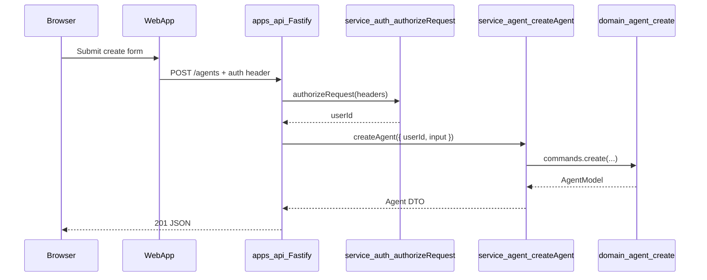
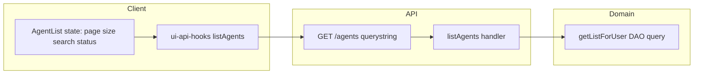
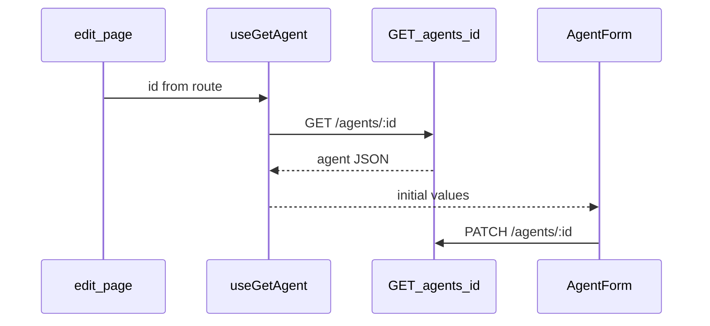
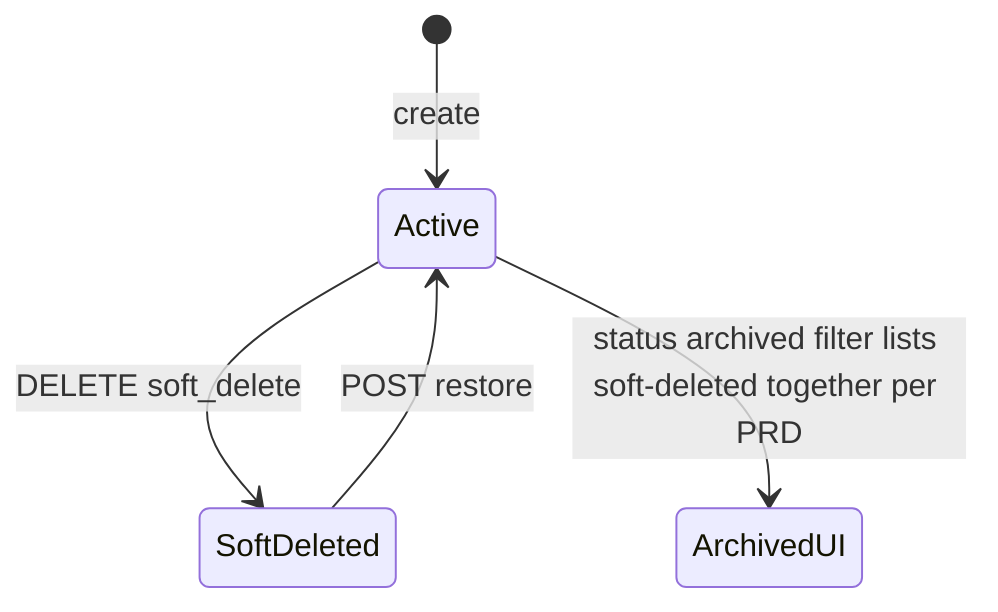

# Agent Management — Implementation Architecture

This document turns `prd.md` and `design.md` into an implementation plan aligned with the vassembly monorepo. It incorporates a **librarian catalog pass** (reuse: `service-auth` authorization, `domain-user` list/pagination patterns, `ui-layout` / `ProtectedAuthRoute`, `@vassembly/commands` `removeSoftDb`, Mongo index registration via domain export).

---

## 1. Monorepo structure and file organization

### Backend packages (new)

| Package | Path | Purpose |
|--------|------|--------|
| Domain | `domains/agent/` → `@vassembly/domain-agent` | Agent model, Mongo DAO, Zod schemas, commands, queries, indexes |
| Service | `services/agent/` → `@vassembly/service-agent` | Handlers: orchestration, ownership rules, mapping errors |

### API gateway (existing app)

| Area | Path | Purpose |
|------|------|---------|
| Routes | `apps/api/src/routes/agents/` | Thin Fastify routes (`defineRoute`) calling `@vassembly/service-agent` handlers; Zod for body/query |
| Wire-up | `apps/api/src/routes/index.ts` | Register `routesWithPrefix("/agents", [...])`, add `mongodbIndexes` from `domain-agent` to `initMongoDb` |

**Important:** `apps/api` is a **Fastify** service (`@vassembly/server`), not Next.js API Routes. Public paths are still the same REST shape (e.g. `GET /agents`, `GET /agents/:id`), but they are registered via `createServer` + `defineRoute`.

### Shared HTTP hooks (extend existing UI package)

| Area | Path | Purpose |
|------|------|---------|
| Hooks | `ui/api-hooks/src/agents/` (new folder) | REST hooks using existing `useHttpMutation`, `useFetch` / `executeRequest` + `withAuth` (same pattern as `useUpdateUserProfile`) |

### Frontend app (existing Next.js App Router)

| Area | Path | Purpose |
|------|------|---------|
| Pages | `apps/web/app/agents/page.tsx` | List route `/agents` |
| | `apps/web/app/agents/create/page.tsx` | Create `/agents/create` |
| | `apps/web/app/agents/[id]/edit/page.tsx` | Edit `/agents/:id/edit` |
| Feature UI | `apps/web/app/agents/_components/` | `AgentList`, `AgentForm`, `AgentDeleteDialog`, `AgentRestoreDialog` (matches `app/settings/_components/` colocation) |
| Hooks (optional local) | `apps/web/app/agents/_hooks/` or `apps/web/lib/agents/` | Thin wrappers if any view-specific state stays out of `ui-api-hooks` |
| Layout / nav | `apps/web/lib/layout/AuthLayout.tsx` | Add **Agents** drawer item when authenticated (see §3e) |
| Guard | Reuse `apps/web/lib/auth/ProtectedAuthRoute.tsx` | Same pattern as `app/settings/page.tsx` |

**Path correction vs design sketch:** Use `apps/web/app/...`, not `apps/web/src/app/...`. Colocate under `app/agents/_components/` rather than a top-level `src/components/agents/` (no such tree exists today).

### New / touched files (checklist)

**`domains/agent/`**

- `package.json`, `tsconfig.json`, `vitest.config.ts`, `README.md`
- `src/model/model.ts` — `AgentModel`
- `src/model/factories.ts` — `agentFactory`, translation factory if needed
- `src/model/index.ts`
- `src/clients/mongodb.ts` — `agentMongodbDao` (`collectionName: "agents"`)
- `src/clients/index.ts`, `src/clients/mongodbIndexes.ts` — compound / single / text index definitions
- `src/commands/index.ts`, `create.ts`, `update.ts`, `remove.ts` (hard, optional admin), `removeSoft.ts`, `restore.ts` (custom: clears `removedAt`, sets `status` active per PRD)
- `src/queries/index.ts`, `getById.ts`, `getListForUser.ts` (name TBD: list with `userId`, `page`, `size`, `search`, `status`)
- `src/index.ts` — export `commands`, `queries`, `mongodbIndexes` (mirror `domain-user`)

**`services/agent/`**

- `package.json`, `tsconfig.json`, `vitest.config.ts`, `README.md`
- `src/handlers/index.ts`
- Per handler: `createAgent/`, `listAgents/`, `getAgent/`, `updateAgent/`, `deleteAgent/`, `restoreAgent/` — each: `index.ts`, `types.ts`, `index.test.ts`

**`apps/api/src/routes/agents/`**

- `create.ts` — `POST` `/`
- `list.ts` — `GET` `/`
- `getById.ts` — `GET` `/:id` *(requires server support for path params; see §2c)*
- `update.ts` — `PATCH` `/:id`
- `delete.ts` — `DELETE` `/:id`
- `restore.ts` — `POST` `/:id/restore`
- Optional `types.ts` for shared Zod pieces

**`ui/api-hooks/`**

- `src/agents/*.ts` — list/get/create/update/delete/restore hooks
- `src/agents/index.ts`, export from `src/index.ts`

**`apps/web/app/agents/`**

- `page.tsx`, `create/page.tsx`, `[id]/edit/page.tsx`
- `_components/` as above
- Optional `_hooks/useAgentFormState.ts` if form state stays in-app

**`packages/server/` (conditional)**

- If implementing param routes in the generic registrar: `src/types.ts`, `src/registerRoutes.ts`, `src/defineRoute.ts` (extend handler input with `params`)

---

## 2. Backend architecture

### 2a. Domain package (`@vassembly/domain-agent`)

**Model (`AgentModel`):** Extends `@vassembly/model` `Model` with: `name`, `category` (`coding` | `personal` | `utility`), `description`, `rule`, `userId`, `status` (`active` | `archived` | `disabled`), `createdAt`, `updatedAt`, `removedAt` (nullable). Align field naming with Mongo (`_id` → `id` via existing model patterns).

**Commands**

- **create** — `createDb`-style; validation: required fields + enums + max lengths per PRD; set `userId` from service input (not from client body); default `status: active`, `removedAt: null`.
- **update** — partial allowed fields only; domain validation; **service** must not call update when `removedAt` set (or command throws a domain error the service maps to 400).
- **removeSoft** — `removeSoftDb`; PRD also sets `status` to `archived` on delete: implement as **custom command** or single transactional update (`removedAt` + `status`) per existing command helpers.
- **restore** — custom: `removedAt = null`, `status = active`.
- **remove** (hard) — optional; only if product needs purge; PRD focuses on soft delete.

**Queries**

- **getById** — by `_id` (and optionally `userId` filter in DAO query for defense in depth).
- **getListForUser** — **custom query** (not generic `getListAll` alone): `userId` (required), `page` + `size` → `offset`/`limit`, optional `search` (name + description only — see below), optional `status` with PRD semantics:
  - **Default** (no status / `active`): `removedAt === null` **and** `status === active`.
  - **`disabled`**: `removedAt === null` **and** `status === disabled`.
  - **`archived`**: `status === archived` **including** rows where `removedAt` is set (soft-deleted rows use `status archived` per PRD).

**Search:** No shared full-text helper exists across domains today. Prefer MongoDB **`$text`** on a **text index** over `{ name: 1, description: 1 }` as specified in PRD; when `search` is non-empty, add `$text: { $search: ... }` (and **do not** match `rule`). If `$text` is deferred, use case-insensitive regex on `name` + `description` only (**not** ideal for scale; document as temporary).

**DAO:** `agentMongodbDao` via `@vassembly/client-mongodb` `MongoDbDAO<AgentModel>`.

**Validation:** Zod per command in domain (consistent with other domains).

**Indexes** (export from domain like `mongodbIndexes` in `domain-user`)

- `userId`
- `status`
- `{ userId: 1, status: 1 }`
- `createdAt`
- Text index on `name` + `description` (PRD); ensure list + search queries are explain-friendly.

### 2b. Service package (`@vassembly/service-agent`)

**Handlers** (each with `types.ts` + tests):

| Handler | Responsibility |
|---------|----------------|
| `createAgent` | Validate create input; `userId` from caller; `domain.commands.create` |
| `listAgents` | `userId` + pagination + search + status filter → `queries.getListForUser` |
| `getAgent` | Load by id; **if `agent.userId !== userId` treat as not found** (see PRD: do not reveal existence — use same error as missing) |
| `updateAgent` | Ownership; if `removedAt` set → throw/mapped **400** with PRD message; else `domain.commands.update` |
| `deleteAgent` | Ownership; soft-delete + set status archived (PRD); `removeSoft` or dedicated command |
| `restoreAgent` | Ownership; if not deleted (`removedAt` null) → **400**; else `restore` command |

**Authorization:** Handlers accept `userId: string` from the API layer (already extracted from JWT). **Do not trust** any `userId` from request bodies. Compare to `agent.userId` for all id-based operations.

**Auth:** Service **does not** call `authorizeRequest` itself (keeps service HTTP-agnostic). The **API route** calls `handlers.authorizeRequest` from `@vassembly/service-auth` (same as `updateProfileRoute`).

### 2c. API routes (`apps/api`)

Pattern mirrors `apps/api/src/routes/user/updateProfile.ts`: `defineRoute` + Zod + `await handlers.authorizeRequest({ headers })` + call **agent** service handler with `{ userId, ... }`.

**Gap (must address in Phase 2):** `@vassembly/server` `registerRoutes` currently passes only `{ body, query, headers }` to route handlers — **no `params`**. For `/:id` routes, either:

1. **Extend `@vassembly/server`** to forward Fastify `request.params` (and optionally Zod-validate `params`) — **recommended** single fix for all REST resources with ids, or  
2. Register agent param routes manually outside `defineRoute` (only if intentionally avoiding a server change).

### 2d. MongoDB

- **Collection:** `agents`
- **Document:** `_id`, `name`, `category`, `description`, `rule`, `userId`, `status`, `createdAt`, `updatedAt`, `removedAt`
- **Soft delete:** List default excludes `removedAt != null` unless status filter `archived` applies per PRD.

### 2e. Error mapping (HTTP)

Map `@vassembly/errors` in the gateway error handler where other routes do; typical mapping:

| Situation | Status |
|-----------|--------|
| Validation (Zod / domain) | 400 |
| Missing / invalid token | 401 |
| Wrong ownership (list/get/update/delete) | **404** for read/id operations where PRD requires no existence leak; optional **403** only where product explicitly documents it |
| Update when soft-deleted | 400 + PRD message |
| Restore when not deleted | 400 |

**Note:** The PRD explicitly requires not revealing existence on cross-user access — prefer **404** for `getAgent` when id missing **or** wrong owner. Defer to PRD over a generic “403 for forbidden” cheat sheet if they conflict.

---

## 3. Frontend architecture

### 3a. Pages (`apps/web/app/agents`)

- **`page.tsx`** — List: wraps content with `ProtectedAuthRoute` + `returnUrl` to `/login?returnUrl=...` (copy `settings/page.tsx`).
- **`create/page.tsx`** — Create form.
- **`[id]/edit/page.tsx`** — Load agent via hook, pass to `AgentForm` (loading/error states).

### 3b. Components (`app/agents/_components/`)

- **`AgentList.tsx`** — Table (`@vassembly/ui-table` if fits), search input, status filter, pagination (`@vassembly/ui-pagination`), row actions (edit, delete, restore as applicable).
- **`AgentForm.tsx`** — Fields: name, category, description, rule; submit/create vs update modes.
- **`AgentDeleteDialog.tsx`**, **`AgentRestoreDialog.tsx`** — Confirmations; call delete/restore hooks.
- **Validation** — Zod or shared schema mirroring API (max lengths, required fields).

### 3c. State and data fetching

- Prefer **`@vassembly/ui-api-hooks`** new **agents** hooks (REST) for parity with `useUpdateUserProfile` / `HttpClientProvider`.
- Local state: React hooks (`useState`, `useReducer` for complex form) — no new global store required.
- **Snackbar / toast:** Use existing system-design / app notification pattern already used elsewhere (align with settings flows).

### 3d. Protected routing

- Reuse **`ProtectedAuthRoute`** + `useUserAuth` from `@vassembly/ui-user-auth`.
- **`apps/web/middleware.ts`** only handles auth-page redirects when logged in; **do not** rely on it to protect `/agents`.

### 3e. Drawer navigation

- **`AuthLayout.tsx`** builds `drawerConfig`. Today **`resolveLayoutConfig`** replaces `sections` entirely if provided — so when adding an Agents link, **merge** preset sections from `MAIN_LAYOUT_PRESET` / `Layout` default with an extra item (e.g. under **Workspace**): Agents → `/agents`, **only when `isAuthenticated`** (mirror conditional pattern with `useMemo`).

---

## 4. API design (schemas)

Base path: **`/agents`** (prefix on API host; client uses configured HTTP base).

**a) `POST /agents`**

- Body: `{ name, category, description, rule }`
- **201** body: `{ id, name, category, description, rule, userId, status, createdAt, updatedAt, removedAt }` (shape aligned with model public mapping)

**b) `GET /agents?page=0&size=10&search=&status=active`**

- Query: `page` (0-based), `size`, optional `search`, optional `status` (default list behavior = active + non-deleted per PRD — encode explicitly in handler/domain)
- **200:** `{ items: Agent[], totalCount, page, size }`

**c) `GET /agents/:id`**

- **200:** full agent object  
- **404:** not found or not owned (PRD)

**d) `PATCH /agents/:id`**

- Body: optional `name`, `category`, `description`, `rule`
- **200:** full agent  
- **400:** validation or **“Agent has been deleted; restore before updating.”** when `removedAt` set

**e) `DELETE /agents/:id`**

- **200:** `{ success: true, message: "Agent deleted" }` (or minimal `{ success: true }` if product standardizes — keep compatible with design)

**f) `POST /agents/:id/restore`**

- **200:** full agent with `removedAt: null`, `status: active`  
- **400:** not deleted

---

## 5. Authentication and authorization flow

- **JWT:** `authorizeRequest` in routes (`@vassembly/service-auth`) validates token via `@vassembly/domain-auth-token` and yields **`userId`**.
- **Scope:** Every agent handler receives that `userId`; domain queries filter by `userId` for list; single-resource handlers verify ownership (or use query that includes `userId`).
- **Soft delete vs PATCH:** PATCH rejected when `removedAt` is set; DELETE and RESTORE allowed per PRD.

---

## 6. Data flow diagrams

### 6.1 Authentication → agent creation

### 6.2 List with search / filter / pagination

### 6.3 Edit with pre-fill

### 6.4 Soft delete and restore

---

## 7. Testing strategy

### Backend

- **Domain:** Model + factories; command validation; list query matrix (default / disabled / archived / search only name+description / pagination).
- **Service:** Black-box handler tests with **mocked domain**: ownership, deleted-agent PATCH, restore when not deleted, list filters.
- **API:** Route tests (if present in repo pattern): status codes, Zod rejection, auth header missing → 401. **IDOR:** user A token cannot mutate user B’s id.
- **`packages/server`:** Unit tests for `params` forwarding if extended.

### Frontend

- Component tests: `AgentList` / `AgentForm` rendering and validation messages (Vitest + Testing Library per `apps/web` config).
- Protected route: render settings-style test that unauthenticated flow redirects (if existing pattern).

### Security

- Missing JWT → 401.
- Cross-user id tampering → 404 or consistent non-leaky response on GET; no mutation success.
- PATCH on soft-deleted → 400.

---

## 8. Dependencies and tech stack

**Backend:** `@vassembly/model`, `@vassembly/commands`, `@vassembly/queries`, `@vassembly/client-mongodb`, `@vassembly/errors`, `@vassembly/validation`, `zod`, `@vassembly/service-auth` (authorize only from routes).

**Frontend:** React, Next.js App Router, `@vassembly/ui-*` (layout, table, pagination, dialogs, toasts as adopted), `@vassembly/ui-api-hooks` for HTTP.

---

## 9. Implementation phases

| Phase | Scope | Depends on |
|-------|--------|------------|
| **1 — Backend foundation** | Scaffold `domain-agent`: model, DAO, commands (create, update, removeSoft+status, restore), `getListForUser`, `getById`, Zod, `mongodbIndexes`, domain tests | — |
| **1b — Server params (if needed)** | Extend `@vassembly/server` for route params OR temporary non-REST id passing (avoid if possible) | Blocks Phase 2 route `/:id` |
| **2 — Service + API** | Scaffold `service-agent` handlers; Fastify routes under `/agents`; wire indexes in `apps/api`; register routes in `index.ts` | Phase 1 (+ 1b) |
| **3 — UI hooks** | `ui-api-hooks` agents REST hooks | Phase 2 stable payloads |
| **4 — Web UI** | Pages, `_components`, `ProtectedAuthRoute`, notifications | Phase 3 |
| **5 — Navigation + polish** | `AuthLayout` Agents link, a11y/responsive pass | Phase 4 |
| **6 — Security + E2E** | IDOR matrix, manual or automated E2E if available | Phase 5 |

---

## 10. Assumptions and constraints

- MongoDB available; `initMongoDb` registers `mongodbIndexes` from domains (add agent indexes alongside user).
- JWT and `authorizeRequest` remain the single REST auth entry (no duplicate middleware object until refactored globally).
- **Last-write-wins** — no optimistic locking.
- **Concurrency:** Accept PRD “no locking” statement.
- **User deletion:** PRD mentions cleanup when user deleted — scope as future hook from user deletion flow if not already defined (optional follow-up; not blocking CRUD).
- **GraphQL:** Out of scope for v1 agents API (REST only), unless product later adds gateway resolvers.

---

## Analysis summary

### Existing reuse

- **Auth:** `handlers.authorizeRequest` (`services/auth`), token extraction + `@vassembly/domain-auth-token`.
- **API shape:** `defineRoute` + `routesWithPrefix` (`apps/api/src/routes/index.ts`).
- **Web protection:** `ProtectedAuthRoute`, `useUserAuth` (`ui-user-auth`).
- **Layout / drawer:** `AuthLayout` + `@vassembly/ui-layout` presets; extend `drawer.sections` carefully (full sections array when overriding).
- **Soft delete primitives:** `Model.removedAt`, `removeSoftDb` (`@vassembly/commands`).
- **List pagination:** `limit`/`offset` patterns from `domain-user` queries as reference for custom list query.

### Gaps addressed by this feature

- New **`domain-agent`** and **`service-agent`** (greenfield).
- **Search** on name + description (text index + query).
- **Path-param routes** need a small gateway or server enhancement.

### Architectural decisions (justified)

1. **`domain-agent` as new domain** — Agent is a distinct aggregate with its own lifecycle and storage; not a field on `domain-user`.
2. **Handlers in `service-agent`, not `service-auth`** — Keeps auth service focused on identity/session; agent CRUD stays in its own service (consistent with orchestration rules).
3. **404 for cross-user GET** — Matches PRD non-leakage; overrides generic “403” examples where they conflict.
4. **Extend `ui-api-hooks` for REST** — Matches existing `useHttpMutation` usage and centralizes auth headers / base URL.
5. **`app/agents/_components/`** — Matches established `settings` colocation; avoids inventing a new top-level `components/` tree under `apps/web`.

---

## Todo plan (per package)

1. **`@vassembly/domain-agent`** — [Type: new domain]  
   - **Changes:** Full domain implementation + README + `mongodbIndexes`.  
   - **Files:** `domains/agent/**` as listed in §1.  
   - **Workflow:** unit-test-writer → coder ↔ code-reviewer (max 2) → documentation-writer.  
   - **Dependencies:** None.

2. **`@vassembly/server`** — [Type: utility / infrastructure] *(if param routes chosen)*  
   - **Changes:** Handler input includes `params`; Fastify `request.params` wired + tests.  
   - **Files:** `packages/server/src/types.ts`, `registerRoutes.ts`, tests.  
   - **Workflow:** coder → code-reviewer.  
   - **Dependencies:** None (can parallel with domain until API routes need it).

3. **`@vassembly/service-agent`** — [Type: new service]  
   - **Changes:** All handlers + tests; no HTTP.  
   - **Files:** `services/agent/**`.  
   - **Workflow:** unit-test-writer → coder ↔ code-reviewer.  
   - **Dependencies:** `domain-agent`.

4. **`@vassembly/api`** (`apps/api`) — [Type: app gateway]  
   - **Changes:** `src/routes/agents/*`, `routes/index.ts`, `package.json` deps on `service-agent` + `domain-agent` indexes.  
   - **Workflow:** coder → code-reviewer.  
   - **Dependencies:** `service-agent`, server params if applicable.

5. **`@vassembly/ui-api-hooks`** — [Type: client hooks]  
   - **Changes:** Agents REST hooks + barrel exports.  
   - **Files:** `ui/api-hooks/src/agents/**`, `src/index.ts`.  
   - **Workflow:** coder → code-reviewer (+ tests if hook tests exist for similar hooks).  
   - **Dependencies:** Stable API contract from `apps/api`.

6. **`@vassembly/web`** (`apps/web`) — [Type: app]  
   - **Changes:** `app/agents/**`, `AuthLayout` drawer, possibly `.scss` modules colocated.  
   - **Workflow:** coder ↔ code-reviewer; optional UI-designer pass.  
   - **Dependencies:** `ui-api-hooks` agent hooks.

---

*This plan is ready for test authorship and phased implementation.*
