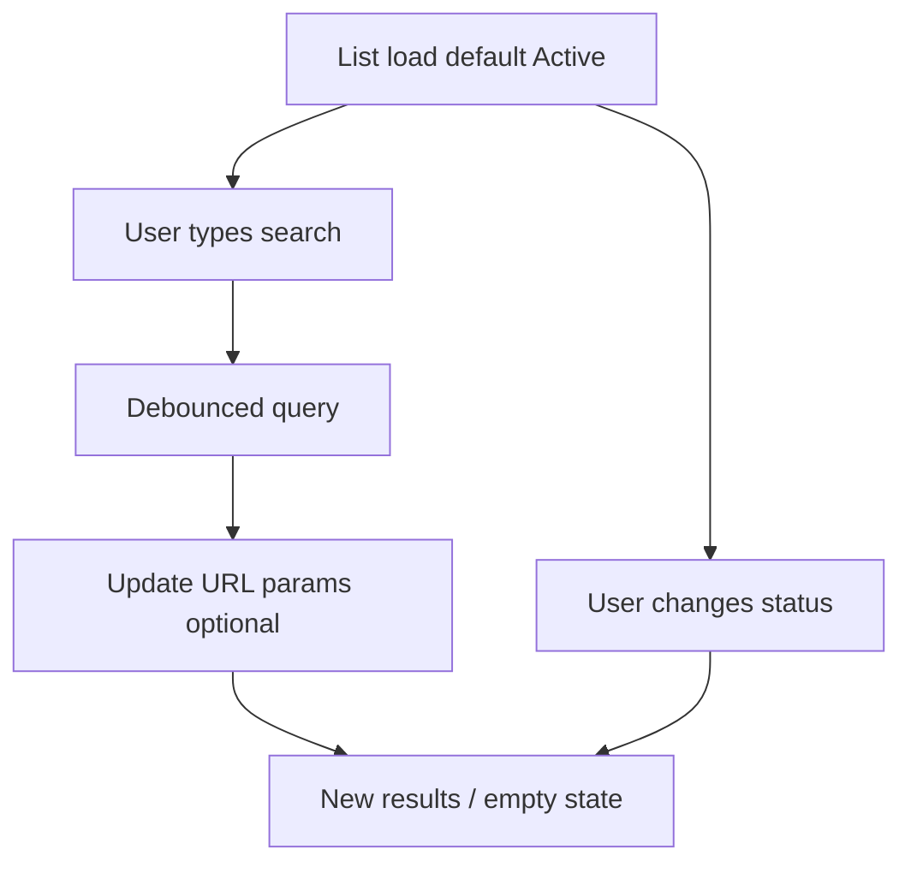

# Agent Management — UI/UX Design Specification

**Related:** [PRD](./prd.md)  
**Design system:** [Synthetic Luminal](/.cursor/rules/design.md) · Theme tokens: `ui/system-design/theme/src/tokens/`  
**App shell:** `@vassembly/ui-layout` + `@vassembly/ui-drawer-navigation` (see `AuthLayout`, `MAIN_LAYOUT_PRESET`)

---

## 1. Design system and consistency

### 1.1 Confirmed system

- **Visual language:** The Synthetic Luminal — dark `surface` base, **tonal stacking** (no standard 1px dividers for layout), **glassmorphism** for overlays/dialogs, **ambient luminance** (soft primary-tinted glow, not heavy shadows).
- **Typography:** **Space Grotesk** for page titles, section headings, and table numerals/dates; **Inter** for body, labels, helper text, and form fields.
- **Motion:** Transitions **300–500ms**, easing `cubic-bezier(0.22, 1, 0.36, 1)`. Drawer animation baseline: **~400ms** (existing drawer tokens).

### 1.2 Color usage for Agent pages

| Role | Token / value | Usage |
|------|----------------|--------|
| Page background | `$color-surface` | Main content area |
| Content bands / filter bar | `$color-surface-container-low` or `$color-surface-container` | Toolbar and table container (tonal lift) |
| Table rows / cards | `$color-surface-container-high` hover: slightly lighter tier | Row hover without borders |
| Inputs (rest) | `$color-surface-container-highest` | Fields per DS |
| Primary CTA | `$gradient-primary` (135°) | Create Agent, Restore (when primary action) |
| Secondary actions | Glass: `$color-surface-variant` + `backdrop-filter: blur(20px)` | Cancel, pagination, icon buttons |
| Focus ring | `primary` @ ~40% opacity + subtle outer glow | All interactive elements |
| Field error | `$color-error` text + `$color-error-container` wash | Invalid fields |
| Success (toast, active badge) | `$color-success`, `$color-success-container` | Active status, success feedback |
| Warning (disabled) | `$color-warning`, `$color-warning-container` | Disabled status |
| Archived / neutral | `$color-text-secondary` + `$color-surface-container` badge | Archived status |
| Danger (destructive) | `$color-error` filled or high-contrast outline | Delete confirm primary |

**Two-accent rule:** On a single screen, treat **primary gradient** as the dominant accent; use **success/warning/error** only for **semantic status and feedback**, not decorative gradients. **Category** badges avoid a third “neon”: differentiate **Coding / Personal / Utility** with **label + icon**, shared `primary_fixed_dim` or neutral icon color, and **tonal backgrounds** (`surface-container-high`) — not three competing hue fills.

### 1.3 Typography scale (Agent feature)

| Element | Token / spec |
|---------|----------------|
| Page title | `typography-heading-md` or `heading-lg` (Space Grotesk, semibold/bold) |
| Section / toolbar label | `title-sm` / `title-md` (Inter) |
| Table header | `label-sm`, uppercase optional for “technical readout”; `$letter-spacing-tracked` for section labels |
| Table cell body | `body-sm` / `body-md` |
| Form labels | `label-md`, required asterisk same style, `$color-error` for asterisk only |
| Helper / hint | `body-sm`, `$color-text-secondary` |
| Error under field | `body-sm`, `$color-error` |
| Meta (“Last updated”) | `body-sm`, `$color-text-tertiary` |

### 1.4 Spacing rhythm

- Vertical gap between major blocks: **`$spacing-section-gap`** (2rem) or **`$spacing-section-gap-lg`** (3rem) from page title to content.
- Form field stacks: **`$spacing-vertical-rhythm`** (1.5rem) between field groups; **`$spacing-component-gap-md`** (0.75rem) between label and control.
- Table: **`$spacing-6`** vertical separation between logical row groups if using card-style rows; cell padding **`$spacing-4` horizontal / `$spacing-3` vertical** minimum.

### 1.5 Buttons, forms, validation

- **Primary:** `$border-radius-button-primary` (1.5rem), gradient fill, no border; min height **44px** touch target.
- **Secondary / Cancel:** glass secondary per DS; text **“Cancel”** (not icon-only).
- **Destructive:** filled `$color-error` or outlined ghost with error text; label **“Delete”** / **“Delete Agent”** in dialog.
- **Icon buttons (Edit, Delete, Restore):** Minimum **40×40px** hit area; `aria-label` required.
- **Inputs:** `$border-radius-input`; rest state **no hard border**; focus: 1px “ghost” border `primary` ~40% + glow; error: error text + `error_container` wash.
- **Validation:** **On blur** (and on submit); inline message below control; `aria-invalid`, `aria-describedby` pointing to error id; **submit disabled** while client-side errors exist OR while request in flight.

### 1.6 Loading, error, success (global patterns)

- **Loading (page):** Centered **spinner** or skeleton rows inside `surface-container` panel; `aria-busy="true"` on region.
- **Loading (inline):** Table body shows **skeleton** 5–8 rows or spinner in tbody; filter bar disabled with reduced opacity.
- **Error (page):** Full-width **inline alert** band (`surface-container-high` + error icon + message + optional “Retry”).
- **Success / error (operations):** **Toast/snackbar** (see §10); success **auto-dismiss ~4s**; errors **manual dismiss** or longer timeout; **pause on hover** for a11y.

### 1.7 Drawer integration

- **Implementation note:** Main app drawer sections today are defined in `MAIN_LAYOUT_PRESET` (`Workspace` → Home). **Agents** should be added as a **nav row** in the same section (below Home) or a new **“Library” / “Tools”** section placed **below Workspace**, **only rendered when `isAuthenticated`** (extend `AuthLayout` / drawer `sections` merge — same pattern as passing `isAuthenticated`, `user`, callbacks).
- **Active state:** Any route under **`/agents`** (`/agents`, `/agents/create`, `/agents/:id/edit`) highlights **Agents** with existing nav active styles (contrast + optional primary glow).
- **Icon:** Prefer a **bot / workflow** icon from `@vassembly/ui-icons` if available; else **gear / layers** icon consistent with “configuration” — document final choice in implementation PR.

---

## 2. Agent list page (`/agents`)

### 2.1 Purpose and access

- **Purpose:** Paginated catalog of the current user’s agents with search (name + description), status filter, and row actions.
- **Access:** **Protected**; unauthenticated users redirected to **`/login?returnUrl=…`** (existing `ProtectedAuthRoute` / auth patterns).

### 2.2 Layout structure

- **Shell:** Standard authenticated layout with header + drawer.
- **Content max-width:** **~1200–1280px** centered with horizontal padding **`$spacing-container-lg`**.
- **Header row:** Left: title **“Agents”**; right: **Create Agent** (primary).

#### ASCII — list page (desktop)

```
┌──────────────────────────────────────────────────────────────────────────┐
│  [Drawer]   │  Agents                                    [ Create Agent ]  │
│             │  ───────────────────────────────────────────────────────  │
│  Home       │  ┌─────────────────────────────────────────────────────┐   │
│  Agents ●   │  │ [🔍 Search agents...________] [×]  Status: [Active ▼]│   │
│             │  └─────────────────────────────────────────────────────┘   │
│             │  ┌─────────────────────────────────────────────────────┐   │
│             │  │ Name (link)   Category   Status    Created    Acts  │   │
│             │  │ ───────────────────────────────────────────────────  │   │
│             │  │ Review Bot    Coding     Active    Jan 12     ✏ 🗑   │   │
│             │  │ …                                                    │   │
│             │  └─────────────────────────────────────────────────────┘   │
│             │  Showing 1–10 of 47 agents    [ ← Prev ]  1 2 3 …  [ Next → ]│
└──────────────────────────────────────────────────────────────────────────┘
```

### 2.3 Table — columns

| Column | Behavior |
|--------|----------|
| **Name** | Primary; **link** to `/agents/:id/edit` (or detail if introduced later; PRD implies edit). **Space Grotesk** optional for name emphasis. |
| **Category** | Badge: text + icon; tonal background (see §1.2). Values: Coding, Personal, Utility. |
| **Status** | Badge: **Active** (success + check icon), **Archived** (neutral + archive icon), **Disabled** (warning + pause icon). Never color-only. |
| **Created** | Locale-formatted date; use Space Grotesk for numerals per DS. |
| **Actions** | **Edit** (pencil), **Delete** (trash) for non-deleted rows; if row is **soft-deleted / archived per rules**, show **Restore** (undo) and hide Edit or show Edit disabled with tooltip — **PRD:** deleted agents cannot be updated until restored; **list** may show archived when filter allows — show **Restore** prominently, **omit Edit** or show disabled **Edit** with explanation. |

**Row height:** Min **56px**; comfortable **64px** with badges.

### 2.4 Search and filter bar

- **Search:** Text input with **leading search icon**; **placeholder:** “Search by name or description…”
  - **Behavior:** Debounced **~300ms** real-time search **or** submit on Enter; either is acceptable if API is called with clear loading state; spec prefers **debounced** to match “real-time” ask without request storms.
- **Clear:** **×** appears when non-empty; clears input and refetches list.
- **Status filter:** Select: **All | Active | Archived | Disabled**.
  - **Default:** **Active** (matches API default: active + not soft-deleted).
  - **Copy:** Helper line optional: “Archived includes agents you deleted.” (aligns with PRD.)
- **Layout:** Filter bar sits in **`surface-container`** panel with **16px** internal padding; controls **horizontal** on desktop, **stacked** on narrow screens (search full-width first, filter full-width second).

### 2.5 Pagination

- **Position:** Below table, **between** table and bottom of viewport with comfortable margin **`$spacing-8`**.
- **Pattern:** **Previous / Next** + **page numbers** (ellipsis for many pages) **or** compact “Page N of M” + prev/next — prefer **numbered** if page count is cheap from API.
- **Summary:** **“Showing X–Y of Z agents”** (Z = total from API).
- **Default:** **10** per page; **disabled** prev on first page, next on last.

### 2.6 Actions

- **Create Agent:** Top-right primary; navigates to **`/agents/create`**.
- **Edit:** Row action → `/agents/:id/edit`.
- **Delete:** Opens **§5** dialog; on success refresh list and toast.
- **Restore:** Row action when applicable → **§6** dialog.

### 2.7 Empty and loading

- **Loading:** Skeleton table **or** spinner overlay inside table panel; disable pagination controls.
- **Empty (no agents, default filter):** Illustration optional; headline **“No agents yet”**; body **“Create your first agent to get started.”**; primary **Create Agent**.
- **Empty (search/filter):** **“No agents match your criteria.”**; secondary **“Clear search”** + **“Reset filters”** if applicable.

### 2.8 Toasts

| Event | Message (example) |
|--------|-------------------|
| Create success | “Agent created.” |
| Update success | “Agent updated.” |
| Delete success | “Agent deleted.” |
| Restore success | “Agent restored.” |
| Generic error | First line: **“Something went wrong.”** Second: server message if safe; no JWT/PII. |

---

## 3. Create / update agent form (`/agents/create`, `/agents/:id/edit`)

### 3.1 Purpose and access

- **Create:** Empty form; focus **Name** on mount.
- **Edit:** Load agent by id; prefill; show **Last updated**; if **`removedAt` set**, **banner + disabled fields** (§3.4).

### 3.2 Layout

- **Desktop:** **Narrow column** max-width **560–640px** centered on `surface`.
- **Mobile:** Full width with **`$spacing-container-md`** horizontal padding.
- **Title:** Create: **“Create New Agent”**; Edit: **“Edit Agent”** (`heading-md`).

#### ASCII — form page

```
                    Create New Agent
                    ─────────────────

                    Name *
                    [  e.g., Code Review Helper          ]
                    Give your agent a descriptive name (max 100 chars)

                    Category *
                    [  Select a category...            ▼ ]

                    Description *
                    [  multiline                        ]
                    [                                    ]
                    0 / 500 characters

                    Rule *
                    [  multiline                        ]
                    [                                    ]
                    0 / 2000 characters

                    [ Cancel ]     [ Create Agent ]

```

### 3.3 Fields

| Field | Type | Required | Max | Placeholder | Helper | Validation messages |
|-------|------|----------|-----|-------------|--------|---------------------|
| **Name** | text | Yes | 100 | e.g., Code Review Helper | “Give your agent a descriptive name (max 100 chars)” | “Name is required.” / “Name must be at most 100 characters.” |
| **Category** | select | Yes | — | Select a category… | — | “Category is required.” |
| **Description** | textarea | Yes | 500 | Describe what this agent does… | Counter **X/500** | Required; max length |
| **Rule** | textarea | Yes | 2000 | Define the rule or instruction… | **X/2000** | Required; max length |

- **Required:** Visible **asterisk** in label; `aria-required="true"`.
- **Counters:** Below textarea, right-aligned or below helper; `aria-live="polite"` on count optional when approaching limit.

### 3.4 Edit mode specifics

- **Last updated:** Below buttons or above footer actions: **“Last updated: [formatted]”** (`text-tertiary`, `body-sm`).
- **Deleted agent (`removedAt` set):**
  - **Banner:** Full-width inside form container — **warning** tone (`warning_container`); icon + **“This agent has been deleted. Restore it to make changes.”**
  - **Primary in banner:** **Restore** (opens §6 or inline confirm).
  - **Form:** All inputs **`disabled`**, **no** edit submit; **Cancel** still navigates to `/agents`.

### 3.5 Buttons

- **Submit:** **“Create Agent”** / **“Update Agent”**; shows **spinner** + `aria-busy` when submitting; **disabled** if invalid or loading.
- **Cancel:** Secondary; **`/agents`** without dirty guard (per PRD).

### 3.6 Success and error flows

- **Success:** Toast + redirect to **`/agents`** after **1.5s** (configurable 1–2s) **or** immediate redirect with toast only — prefer **short delay** so user perceives confirmation.
- **Error:** Toast with message; **stay** on form; **preserve** field values.

---

## 4. Navigation integration

| Requirement | Spec |
|-------------|------|
| Placement | New item **below Home** in **Workspace** section **or** new section **below** Workspace (e.g. “Your library”). |
| Visibility | **Only if authenticated** — omit link object or hide group when logged out. |
| Href | **`/agents`** |
| Active routes | Prefix match **`/agents`** including **`/agents/create`** and **`/agents/:id/edit`**. |
| Icon | Bot / sparkles / workflow icon per icon inventory |

---

## 5. Delete confirmation dialog

### 5.1 Trigger

**Delete** on list row (only when policy allows soft-delete).

### 5.2 Content

- **Modal:** Glass panel, `border-radius-modal`, max-width **400–440px**, padding **`$spacing-6`**.
- **Title:** **“Delete agent?”** (`heading-sm`, Space Grotesk)
- **Body:** “Are you sure you want to delete **‘{name}’**? You can restore it later.”
- **Buttons:** [ **Cancel** ] (secondary) · [ **Delete** ] (danger, right primary in LTR)

#### ASCII

```
        ╔════════════════════════════════════╗
        ║  Delete agent?                     ║
        ║  Are you sure you want to delete   ║
        ║  'Code Review Helper'? You can     ║
        ║  restore it later.                 ║
        ║                                    ║
        ║     [ Cancel ]    [ Delete ]       ║
        ╚════════════════════════════════════╝
```

- **Loading:** Delete button shows spinner; **Cancel** disabled during request.
- **Focus trap** + **ESC** closes to Cancel; **initial focus** on Cancel (safer) or Delete — **prefer Cancel** as initial focus to reduce accidental confirm.

---

## 6. Restore confirmation dialog

### 6.1 Trigger

**Restore** in banner (edit page) or row action (list when archived/deleted visible).

### 6.2 Content

- **Title:** **“Restore agent?”**
- **Body:** “Restore **‘{name}’** to active status?”
- **Buttons:** [ **Cancel** ] [ **Restore** ] — **Restore** uses **primary gradient** (positive action).

---

## 7. Accessibility and responsiveness

### 7.1 Accessibility

- **Labels:** Every input has **visible `<label>`**; `htmlFor` bound to `id`.
- **Keyboard:** Logical tab order: toolbar (search → filter → create) → table (skip link optional) → row actions → pagination → footer.
- **Focus:** **Visible focus ring** on all controls (never `outline: none` without replacement).
- **Dialogs:** `role="dialog"`, `aria-modal="true"`, `aria-labelledby` title id; focus trap; return focus to trigger on close.
- **Table:** `<th scope="col">`; sortable headers future-proof `aria-sort`.
- **Errors:** `aria-invalid="true"`, **`aria-describedby`** linking to error id.
- **Live regions:** Toasts `role="status"` or `alert` for errors.
- **Contrast:** Semantic badges meet **4.5:1** for text; icons supplement color.

### 7.2 Responsive

- **< 768px:** Stack filter bar; table → **card list** (each card: name, badges, created, row actions) **or** horizontal scroll with sticky first column — **prefer cards** for readability.
- **Form:** Submit + Cancel **full-width stacked** (Cancel on top or bottom per platform convention — **Submit last** is fine).
- **Drawer:** Existing **overlay drawer** behavior; hamburger in header.

---

## 8. Wireframes reference (summary)

- **§2.2** — List page desktop.
- **§3.2** — Form stacked fields.
- **§5.2** — Delete modal.
- **§6.2** — Restore modal.

**Banner (deleted agent on edit):**

```
┌─────────────────────────────────────────────────────┐
│ ⚠ This agent has been deleted. Restore it to edit.  │
│                         [ Restore ]                  │
└─────────────────────────────────────────────────────┘
[field: Name    [ disabled                          ]]
...
```

---

## 9. State diagrams (user flows)

### 9.1 Create flow

```mermaid
flowchart LR
  A[/agents] --> B[Create Agent]
  B --> C[/agents/create]
  C --> D{Valid submit}
  D -->|No| C
  D -->|Yes| E[POST create]
  E -->|Success| F[Toast]
  F --> A
  E -->|Error| G[Toast error]
  G --> C
```

### 9.2 Edit / update flow

```mermaid
flowchart LR
  A[/agents] --> B[Edit row]
  B --> C[/agents/:id/edit]
  C --> D{removedAt?}
  D -->|Yes| E[Banner + disabled + Restore path]
  D -->|No| F[Edit form]
  F --> G{Valid submit}
  G -->|Yes| H[PATCH update]
  H -->|Success| I[Toast + redirect]
  I --> A
  H -->|Error| J[Toast]
  J --> F
```

### 9.3 Delete flow

```mermaid
flowchart LR
  A[/agents] --> B[Delete]
  B --> C[Confirm dialog]
  C -->|Cancel| A
  C -->|Delete| D[DELETE soft-delete]
  D --> E[Toast + refresh]
  E --> A
```

### 9.4 Search / filter flow



---

## 10. Design tokens and measurements

| Element | Spec |
|---------|------|
| **Primary button** | Min height **44px**; padding **12px 24px**; `$border-radius-button-primary` (1.5rem); `$gradient-primary` |
| **Secondary button** | `$border-radius-button-secondary` (0.5rem); glass background |
| **Input / textarea** | Min height text **44px**; textarea min-height **120px** (description), **160px** (rule); padding **12px 14px**; `$border-radius-input` (0.375rem) |
| **Ghost border (focus)** | `primary` **40%** opacity, 1px; outer glow **~8px blur**, primary **15–20%** |
| **Table cell padding** | **12px 16px** |
| **Table header** | **14px 16px**; label-sm; **sticky header** optional with `surface-container` background |
| **Dialog overlay** | **rgba(0,0,0,0.55)** or `surface_container_lowest` **80%** + **blur(8px)**; content glass per DS |
| **Dialog width** | **400–440px**; max-height **90vh**; scroll body if needed |
| **Toast** | **Bottom center** or **bottom-end** (match app); **16px** from edges; enter/exit **400ms** liquid ease; width **min 280px max 420px** |
| **Badge** | Pill `$border-radius-pill` or `full-sm`; padding **4px 10px**; `label-sm` |
| **Elevation** | Ambient: **40px blur, 0 spread, 6% opacity**, tinted primary — for floating panel only |

---

## Developer handoff checklist

1. Implement routes under **`/agents*`** with **auth guard** and **drawer active state**.
2. **List:** wired to list API with **page, size=10, status, search**; align **Archived** filter with PRD (includes soft-deleted archived rows).
3. **Search** applies to **name + description only** (no rule) — reflect in placeholder copy.
4. **Forms:** client validation matches **max lengths**; **submit disabled** when invalid; **restore** path before edits when `removedAt` set.
5. **last-write-wins:** no optimistic UI conflict UI — optional subtle note in docs only if product wants.
6. Reuse **`@vassembly/ui-text`**, layout, theme tokens, and existing **toast** primitive if present; otherwise implement toast per §10.

---

*End of Agent Management UI/UX specification.*
