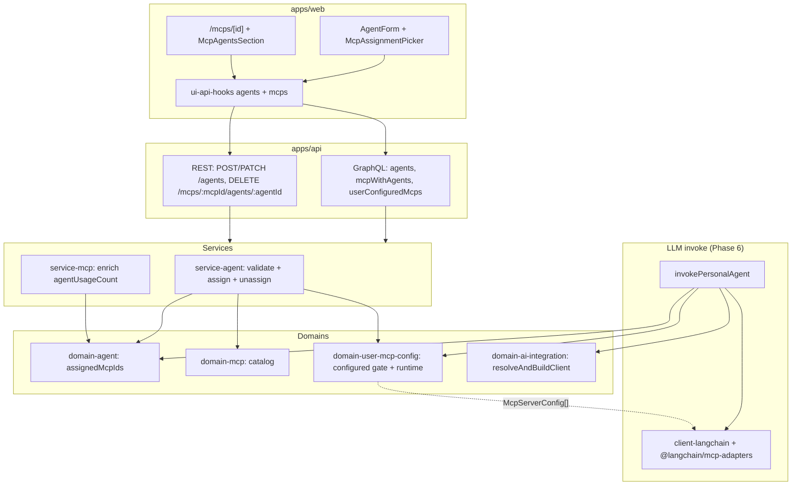
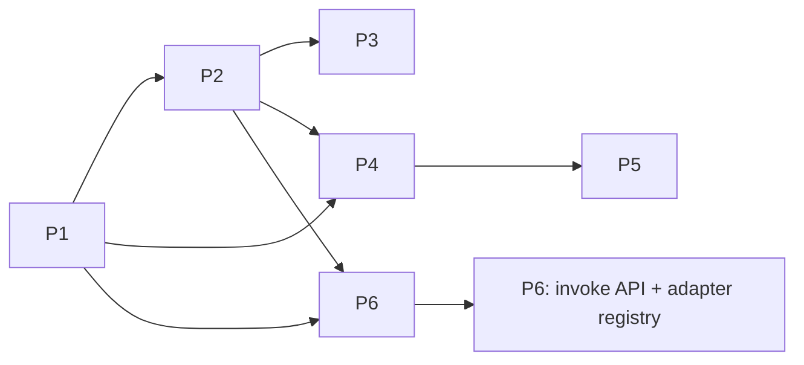

# Agent MCP Assignment — Implementation Architecture

**Status:** Engineering handoff  
**Last updated:** 2026-06-13  
**Related:** [Agent Management](../agent-management/architecture.md) · [AI Integrations](../ai-integrations/architecture.md) · [MCP Configuration Management](../mcp-configuration-management/architecture.md) · [System Agent](../system-agent/architecture.md) (personal invoke reference)

This document defines the architecture for assigning user-configured MCPs to personal agents, reverse lookup on MCP detail pages, and wiring assigned MCP tools into LLM invoke. It incorporates a **librarian catalog pass** (~70% reuse of agent ↔ credential and MCP configuration stacks).

---

## Analysis

### Audit of existing domains and services

| Area | Package / path | Current capability | Reuse for this feature |
|------|----------------|-------------------|------------------------|
| Personal agent entity | `@vassembly/domain-agent` | CRUD, `integrationCredentialId`, GraphQL `agents`, soft delete | **Extend** with `assignedMcpIds: string[]` |
| Agent orchestration | `@vassembly/service-agent` | create/update/list, credential validation, `getCredentialWithAgents` (handler exists, **not exposed**) | **Extend** — MCP validation, reverse lookup handlers |
| MCP catalog | `@vassembly/domain-mcp` | Read-only catalog, `configSchema`, `getById` | Validate `mcpId` references |
| User MCP config | `@vassembly/domain-user-mcp-config` | Per-user config CRUD, encryption, test adapters | **Configured-only** gate; runtime adapter registry |
| MCP orchestration | `@vassembly/service-mcp` | Config CRUD, `userConfiguredMcps`, list enrichment | **Extend** — `agentUsageCount`, `getMcpWithAgents` |
| Agent form UI | `apps/web/app/agents/_components/AgentForm` | `IntegrationCredentialPicker` (single select) | **Mirror** with multi-select MCP picker |
| MCP detail UI | `apps/web/app/mcps/[id]/` | Config form for configured MCPs | Add agents-using section |
| Configured MCP data | `ui/api-hooks/src/mcps/useUserConfiguredMcps` | GraphQL `userConfiguredMcps` | Picker data source |
| LLM client | `@vassembly/client-langchain` | `invoke()` — messages only, **no tools** | **Extend** with optional `tools` param |
| Credential resolution | `@vassembly/domain-ai-integration` | `resolveAndBuildClient` | Reuse in invoke path |
| Agent invoke (domain) | `domains/agent/src/commands/invoke` | `ModeledProviderClient.invoke(message)` | **Extend** client contract for tools |
| System invoke (reference) | `services/agent/src/handlers/invokeSystemAgent` | Credential → LangChain invoke | Pattern for `invokePersonalAgent` |
| Reverse lookup (credential) | `services/agent/src/helpers/getAgentsByCredentialId.ts` | Paginated filter in memory | **Replace** with dedicated Mongo query for MCP |
| Usage count (credential) | `domains/agent/src/queries/getCountByIntegrationCredentialId` | `countDocuments` by FK | **Mirror** for `getCountByMcpId` |

### What can be reused (~70%)

- **Agent ↔ integration credential** end-to-end pattern: form picker → REST create/patch → service cross-domain validation → domain FK storage → GraphQL list field → reverse lookup handler
- **MCP configuration** GraphQL reads + REST commands split
- **Service-layer orchestration** without domain cross-imports
- **`useUserConfiguredMcps`** for picker options (configured MCPs only)
- **`getCredentialWithAgents`** handler shape for `getMcpWithAgents`
- **`agentUsageCount`** enrichment pattern from AI integrations

### What must be new (~30%)

| Gap | Placement |
|-----|-----------|
| `assignedMcpIds` on agent model + indexes | `domains/agent/` |
| Efficient agents-by-MCP queries | `domains/agent/src/queries/` |
| Configured-MCP validation on agent write | `services/agent/` |
| MCP detail “agents using this” + unassign | `services/agent/` or split read/write |
| Multi-select MCP picker on agent form | `apps/web/app/agents/_components/` |
| Agents section on MCP detail (configured only) | `apps/web/app/mcps/[id]/_components/` |
| `agentUsageCount` on MCP list/detail | `services/mcp/` enrichment |
| Runtime MCP + LangChain tool binding | `@vassembly/client-langchain` (`@langchain/mcp-adapters`) + `domain-user-mcp-config` runtime adapters |
| Personal agent invoke API + MCP tools in LLM | `services/agent/`, `domain-agent`, `client-langchain` |
| GraphQL reverse lookup query | `apps/api/src/graphql/resolvers/mcp.ts` |

### New packages required

**No new packages.** Extend `@vassembly/client-langchain` with `@langchain/mcp-adapters` for MCP → LangChain tool loading (replaces planned `@vassembly/client-mcp`).

**No new domain** — extend `@vassembly/domain-agent`.  
**No new service** — extend `@vassembly/service-agent` and `@vassembly/service-mcp`.

### Librarian findings (incorporated)

- Store **catalog MCP `id`** in `assignedMcpIds` (not `slug`); configs keyed by `userId + mcpId`
- `getAgentsByCredentialId` scans all agent pages — **do not copy**; add indexed `getListByMcpId` query
- `getCredentialWithAgents` exists but is **not API-exposed** — expose MCP variant from day one on MCP detail
- `@langchain/mcp-adapters` (via `client-langchain`) wraps `@modelcontextprotocol/sdk` — domains do **not** import it directly
- Personal `POST /agents/:id/invoke` is planned (system-agent architecture) but **not implemented** — MCP-in-LLM depends on it
- Test adapters in `user-mcp-config` are not invoke adapters — add parallel `runtime` adapter registry

---

## Architecture & Package Placement

### High-level data flow



### Layer responsibilities

| Package | Responsibility |
|---------|----------------|
| `domain-agent` | Persist `assignedMcpIds`; domain validation (max 5, unique); queries by MCP id |
| `domain-mcp` | Catalog existence check (via service) |
| `domain-user-mcp-config` | Configured-only validation; per-slug runtime adapters → `McpServerConfig` |
| `service-agent` | Cross-domain validation on create/update; `getMcpWithAgents`; `unassignMcpFromAgent`; `invokePersonalAgent` |
| `service-mcp` | `agentUsageCount` enrichment on list/detail |
| `client-langchain` | `@langchain/mcp-adapters` (`MultiServerMCPClient`); tool-call loop in `invokeWithChatModel` |
| `apps/api` | GraphQL queries + REST commands |
| `ui/api-hooks` | Agent types, MCP reverse lookup query, unassign mutation hook |
| `apps/web` | Agent picker + MCP detail agents section |

### Cross-package dependency rules

- Domains **do not** import each other — service composes agent + mcp + user-mcp-config
- Services **do not** import `@vassembly/client-*` — MCP server configs via `resolveMcpServerConfigs`; LangChain/MCP wiring inside `client-langchain` (consumed through `domain-ai-integration`)
- API gateway calls service handlers only; Zod at route boundary

---

## 1. Data Model Changes

### 1.1 Agent model extension

**File:** `domains/agent/src/model/model.ts`

```typescript
assignedMcpIds?: string[];  // catalog MCP ids; default []
```

**Semantics:**

| Field | Type | Notes |
|-------|------|-------|
| `assignedMcpIds` | `string[]` | References `McpModel.id` (catalog), not `UserMcpConfigModel.id` |
| Default on create | `[]` | Omit from body → persist empty array |
| Max length | `5` | Constant `AGENT_MAX_ASSIGNED_MCPS` in `domains/agent/src/constants.ts` |
| Uniqueness | Required | Reject duplicate ids in same array |
| Order | Preserved | UI display order = array order; no semantic ordering for invoke |

### 1.2 MongoDB document shape

**Collection:** `agents` (unchanged)

```json
{
  "_id": "...",
  "name": "Research assistant",
  "category": "personal",
  "integrationCredentialId": "...",
  "assignedMcpIds": ["mcp-catalog-id-1", "mcp-catalog-id-2"],
  "userId": "...",
  "status": "active",
  "removedAt": null
}
```

**Migration:** No backfill required. Existing documents without `assignedMcpIds` treat as `[]` in mapper (`assignedMcpIds ?? []`).

### 1.3 Indexes

**File:** `domains/agent/src/clients/mongodb.ts`

```typescript
await collection.createIndex({ assignedMcpIds: 1 });           // multikey — reverse lookup
await collection.createIndex({ userId: 1, assignedMcpIds: 1 }); // scoped reverse lookup
```

| Index | Purpose |
|-------|---------|
| `{ assignedMcpIds: 1 }` | `getListByMcpId`, `getCountByMcpId` |
| `{ userId: 1, assignedMcpIds: 1 }` | Same queries with ownership filter |
| Existing `{ userId: 1, integrationCredentialId: 1 }` | Unchanged |

### 1.4 Validation rules

| Rule | Layer | Error |
|------|-------|-------|
| `assignedMcpIds.length <= 5` | Domain command Zod | `ValidationError` |
| No duplicate ids | Domain command Zod | `ValidationError` |
| Each id non-empty string | Domain command Zod | `ValidationError` |
| Each id exists in catalog | Service (`mcpDomain.queries.getById`) | `NotFoundError` (treat as invalid mcpId) |
| Each id has user config | Service (`userMcpConfigDomain.queries.getUserMcpConfigModel`) | `WrongParamError` — *"MCP is not configured"* |
| Agent ownership | Service (existing) | `NotFoundError` |
| Agent not soft-deleted on update | Service (existing) | `WrongParamError` |
| Category scope | All user agent categories (`coding`, `personal`, `utility`) | Confirmed in PRD |

**Stale references:** If user deletes MCP configuration, agents may retain `mcpId` in `assignedMcpIds` (mirrors `integrationCredentialId` on credential delete). Re-save agent fails configured-only validation; invoke skips missing configs (see §6).

### 1.5 DTO and GraphQL

**File:** `domains/agent/src/model/dto.ts`

```typescript
assignedMcpIds: string[];
```

**Mapper:** `toAgentResponse` — always return array (never `undefined`).

**GraphQL** (`domains/agent/src/model/graphql.ts`):

```graphql
type Agent {
  # existing fields...
  assignedMcpIds: [String!]!
}
```

**Optional enrichment (service, not domain):** `assignedMcps: [{ id, name, slug, iconPath }]` on GraphQL agent list — **defer to v2**; v1 client resolves names via `userConfiguredMcps` + ids on agent.

### 1.6 MCP catalog enrichment

**File:** `domains/mcp/src/model/dto.ts` (extend response type used by service)

```typescript
agentUsageCount?: number;  // count of non-deleted agents referencing this mcpId for user
```

Populated by `service-mcp` handlers (same pattern as `aiIntegrationDomain` list enrichment).

---

## 2. Domain Layer

### 2.1 `@vassembly/domain-agent` changes

#### Constants

**File:** `domains/agent/src/constants.ts`

```typescript
export const AGENT_MAX_ASSIGNED_MCPS = 5;
```

#### Commands — create / update

**Files:** `domains/agent/src/commands/create/index.ts`, `domains/agent/src/commands/update/index.ts`

Extend Zod schemas:

```typescript
assignedMcpIds: z
  .array(z.string().min(1))
  .max(AGENT_MAX_ASSIGNED_MCPS)
  .refine((ids) => new Set(ids).size === ids.length, {
    message: 'assignedMcpIds must not contain duplicates',
  })
  .optional()
  .default([]),
```

Domain validates **shape only** — not configured-only (cross-domain stays in service).

#### New queries

| Query | File | Returns | Mongo filter |
|-------|------|---------|--------------|
| `getCountByMcpId` | `queries/getCountByMcpId/index.ts` | `number` | `{ userId, assignedMcpIds: mcpId, removedAt: null }` |
| `getListByMcpId` | `queries/getListByMcpId/index.ts` | `AgentResponse[]` | Same + pagination (`page`, `size`, max 50) |

Mirror `getCountByIntegrationCredentialId` structure:

```typescript
export interface GetListByMcpIdInput {
  userId: string;
  mcpId: string;
  page?: number;
  size?: number;
}

export interface GetListByMcpIdOutput {
  items: AgentResponse[];
  totalCount: number;
  page: number;
  size: number;
}
```

Use `agentMongodbDao.collection.find(...)` with `assignedMcpIds: mcpId` — **do not** scan all agents (unlike current `getAgentsByCredentialId` helper).

#### Invoke command extension (Phase 6)

**File:** `domains/agent/src/commands/invoke/types.ts`

```typescript
export interface AgentInvokeMcpServerConfig {
  serverName: string;
  transport: 'stdio' | 'http' | 'sse';
  command?: string;
  args?: string[];
  env?: Record<string, string>;
  url?: string;
  headers?: Record<string, string>;
}

export interface ModeledProviderClient {
  invoke(params: {
    message: string;
    systemMessage?: string;
    mcpServerConfigs?: AgentInvokeMcpServerConfig[];
  }): Promise<{ message: string }>;
}
```

**File:** `domains/agent/src/commands/invoke/index.ts` — pass `mcpServerConfigs` through to `modeledProviderClient.invoke`.

> **Domain isolation:** `AgentInvokeMcpServerConfig` mirrors `McpServerConfig` from `domain-user-mcp-config` (same shape; no cross-domain import). Service maps `resolveMcpServerConfigs` output into invoke params.

#### Tests

| File | Cases |
|------|-------|
| `commands/create/index.test.ts` | Default `[]`; max 5; duplicates rejected |
| `commands/update/index.test.ts` | Replace array; clear to `[]` |
| `queries/getCountByMcpId/index.test.ts` | Count with/without match; excludes soft-deleted |
| `queries/getListByMcpId/index.test.ts` | Pagination; userId scoping |

### 2.2 `@vassembly/domain-user-mcp-config` changes (Phase 6)

#### Runtime adapter registry

**Directory:** `domains/user-mcp-config/src/commands/resolveMcpServerConfigs/`

```
resolveMcpServerConfigs/
├── index.ts
├── types.ts          # McpServerConfig (exported from domain)
└── adapters/
    ├── index.ts              # getMcpRuntimeAdapter(slug)
    ├── google-workspace-mcp.ts
    └── brave-search-mcp.ts
```

Parallel to `testMcpConnection/adapters/` — share slug map; runtime adapters map decrypted `fieldValues` → `McpServerConfig` for `@langchain/mcp-adapters` (no LangChain imports in domain).

#### `McpServerConfig` type

**File:** `domains/user-mcp-config/src/commands/resolveMcpServerConfigs/types.ts`

```typescript
export interface McpServerConfig {
  serverName: string;   // unique key, e.g. catalog mcpId
  transport: 'stdio' | 'http' | 'sse';
  command?: string;
  args?: string[];
  env?: Record<string, string>;
  url?: string;
  headers?: Record<string, string>;
}
```

Shape aligns with `MultiServerMCPClient` server entries in `@langchain/mcp-adapters`.

#### New command

```typescript
export interface ResolveMcpServerConfigsParams {
  userId: string;
  mcpConfigs: Array<{ mcpId: string; slug: string }>;
}

export interface ResolveMcpServerConfigsResult {
  serverConfigs: McpServerConfig[];
  skippedMcpIds: string[];  // missing config or unsupported adapter
}
```

**Flow:**

1. For each `mcpId`, load config via `getUserMcpConfigModel`
2. Service passes `{ mcpId, slug }[]` (domain cannot import `domain-mcp`)
3. Decode secrets via existing `decodePasswordFields`
4. `getMcpRuntimeAdapter({ slug }).toServerConfig({ mcpId, fieldValues })` → `McpServerConfig`

**No `clients/mcpClient.ts`** — MCP transport and tool discovery live in `client-langchain` only.

### 2.3 `@vassembly/domain-mcp` — no model changes

Service calls existing `queries.getById` for catalog validation only.

---

## 3. Service Handlers

### 3.1 `@vassembly/service-agent`

#### Shared helper — validate assigned MCPs

**File:** `services/agent/src/helpers/validateAssignedMcpIds.ts`

```typescript
export interface ValidateAssignedMcpIdsParams {
  userId: string;
  assignedMcpIds: string[];
}

export const validateAssignedMcpIds = async (
  params: ValidateAssignedMcpIdsParams,
): Promise<void> => {
  await Promise.all(
    params.assignedMcpIds.map(async (mcpId) => {
      await mcpDomain.queries.getById({ id: mcpId });
      const config = await userMcpConfigDomain.queries.getUserMcpConfigModel({
        userId: params.userId,
        mcpId,
      });
      if (config === null) {
        throw new WrongParamError(`MCP ${mcpId} is not configured`);
      }
    }),
  );
};
```

Use `Promise.all` for parallel validation (max 5 ids).

#### Extend existing handlers

| Handler | File | Change |
|---------|------|--------|
| `createAgent` | `handlers/createAgent/index.ts` | If `body.assignedMcpIds?.length`, call `validateAssignedMcpIds` |
| `updateAgent` | `handlers/updateAgent/index.ts` | If `patch.assignedMcpIds` defined, validate full replacement array |

#### New handlers

| Handler | Purpose | Dependencies |
|---------|---------|--------------|
| `getMcpWithAgents` | MCP detail reverse lookup | `mcpDomain`, `agentDomain.queries.getListByMcpId`, config check |
| `unassignMcpFromAgent` | Remove one MCP from one agent | `agentDomain` get + update |
| `invokePersonalAgent` | LLM call with MCP tools (Phase 4) | `aiIntegrationDomain`, `userMcpConfigDomain`, `agentDomain.commands.invoke` |

**`getMcpWithAgents`** — mirror `getCredentialWithAgents`:

```typescript
export interface GetMcpWithAgentsHandlerInput {
  userId: string;
  mcpId: string;
  page?: number;
  size?: number;
}

export interface GetMcpWithAgentsHandlerOutput {
  mcp: McpResponse;
  configurationStatus: 'configured' | 'pending';
  agentUsageCount: number;
  agents: AgentResponse[];
}
```

**Precondition:** Only meaningful when user has configuration for `mcpId`. If not configured → `WrongParamError` or return empty agents with `configurationStatus: pending` (recommend **404-style empty** on GraphQL when not configured — UI hides section anyway).

**`unassignMcpFromAgent`:**

```typescript
export interface UnassignMcpFromAgentHandlerInput {
  userId: string;
  mcpId: string;
  agentId: string;
}

// Load agent (ownership), filter assignedMcpIds, patch if changed
```

Idempotent: removing non-assigned MCP succeeds with unchanged agent.

#### Package dependencies

**File:** `services/agent/package.json`

Add:

```json
"@vassembly/domain-mcp": "workspace:*",
"@vassembly/domain-user-mcp-config": "workspace:*"
```

### 3.2 `@vassembly/service-mcp`

#### Enrich MCP responses with `agentUsageCount`

**File:** `services/mcp/src/helpers/getMcpAgentUsageCount.ts`

```typescript
import agentDomain from '@vassembly/domain-agent';

export const getMcpAgentUsageCount = async ({
  userId,
  mcpId,
}: {
  userId: string;
  mcpId: string;
}): Promise<number> =>
  agentDomain.queries.getCountByMcpId({ userId, mcpId });
```

Wire into `getMcp`, `listMcps` enrichment (batch optional for list — max page size 20, 20 count queries acceptable for MVP; optimize with `getCountByMcpIds` batch query in v2).

**File:** `services/mcp/package.json` — add `@vassembly/domain-agent` dependency.

---

## 4. API Design

Convention: **GraphQL for reads**, **REST for commands** (workspace rule).

### 4.1 GraphQL queries

#### Extend `Agent` type

Already on domain schema (§1.5). Ensure `apps/api` agent list resolver returns `assignedMcpIds` from `toAgentResponse`.

#### `mcpWithAgents` (new)

**Resolver:** `apps/api/src/graphql/resolvers/mcp.ts`

```graphql
type McpWithAgents {
  mcp: Mcp!
  configurationStatus: McpConfigurationStatus!
  agentUsageCount: Int!
  agents: [Agent!]!
  totalCount: Int!
  page: Int!
  size: Int!
}

type Query {
  mcpWithAgents(mcpId: String!, page: Int, size: Int): McpWithAgents
}
```

**Example query:**

```graphql
query McpWithAgents($mcpId: String!, $page: Int, $size: Int) {
  mcpWithAgents(mcpId: $mcpId, page: $page, size: $size) {
    agentUsageCount
    configurationStatus
    mcp { id name slug iconPath }
    agents {
      id
      name
      category
      status
      assignedMcpIds
    }
    totalCount
    page
    size
  }
}
```

**Auth:** Requires `authenticatedUserId`. Returns `null` or throws `UnauthorizedError` if unauthenticated.

**When MCP not configured for user:** Return `configurationStatus: pending`, `agents: []`, `agentUsageCount: 0` — UI uses `configurationStatus === 'configured'` to show section (only configured MCPs per PRD).

#### Extend `Mcp` type (list/detail)

```graphql
type Mcp {
  # existing...
  agentUsageCount: Int
}
```

### 4.2 REST commands

#### Extend agent create / update (primary assignment path)

**Files:** `apps/api/src/routes/agents/create.ts`, `update.ts`

**Create body** — add:

```typescript
assignedMcpIds: z
  .array(z.string().min(1))
  .max(5)
  .optional()
  .default([]),
```

**Patch body** — add:

```typescript
assignedMcpIds: z
  .array(z.string().min(1))
  .max(5)
  .optional(),
```

**Response schema** — add `assignedMcpIds: z.array(z.string())`.

**Examples:**

```http
POST /agents
{
  "name": "Research bot",
  "category": "personal",
  "description": "...",
  "rule": "...",
  "integrationCredentialId": "cred-id",
  "assignedMcpIds": ["mcp-id-1", "mcp-id-2"]
}
```

```http
PATCH /agents/:id
{
  "assignedMcpIds": ["mcp-id-1"]
}
```

Clear all MCPs: `{ "assignedMcpIds": [] }`.

#### Unassign MCP from agent (MCP detail page)

**File:** `apps/api/src/routes/mcps/unassignAgent.ts`

```http
DELETE /mcps/:mcpId/agents/:agentId
```

| | |
|---|---|
| **Auth** | JWT → `userId` |
| **Handler** | `agentService.unassignMcpFromAgent({ userId, mcpId, agentId })` |
| **200** | `{ agent: AgentResponse }` |
| **404** | Agent not found / not owned |
| **400** | Invalid params |

Register in `apps/api/src/routes/mcps/index.ts` **before** `/:mcpId/configuration` routes if path specificity requires.

**Alternative considered:** `PATCH /agents/:id/mcps` with `{ remove: [mcpId] }` — rejected for v1; DELETE nested resource is clearer for MCP detail actions and mirrors REST noun hierarchy.

#### Personal agent invoke (Phase 4)

**File:** `apps/api/src/routes/agents/invoke.ts`

```http
POST /agents/:id/invoke
Content-Type: application/json

{ "message": "Find recent emails about the project" }
```

**Response:**

```typescript
{
  message: string;
  model?: string;
  usage?: { promptTokens: number; completionTokens: number };
  metadata?: { mcpIdsUsed: string[]; skippedMcpIds: string[] };
}
```

Handler: `agentService.invokePersonalAgent`.

### 4.3 Error mapping

| Situation | HTTP | Error |
|-----------|------|-------|
| >5 MCPs / duplicates | 400 | `ValidationError` |
| MCP not in catalog | 404 | `NotFoundError` |
| MCP not configured | 400 | `WrongParamError` |
| Agent not owned | 404 | `NotFoundError` |
| Update soft-deleted agent | 400 | `WrongParamError` (existing) |
| Unauthenticated | 401 | `UnauthorizedError` |

---

## 5. UI Changes

### 5.1 Agent form — MCP assignment picker

**New component:** `apps/web/app/agents/_components/McpAssignmentPicker/`

Mirror `IntegrationCredentialPicker` structure:

```
McpAssignmentPicker/
├── McpAssignmentPicker.tsx
├── McpAssignmentSelectedList.tsx   # chips/rows with remove
├── types.ts
├── styles.module.scss
└── index.ts
```

| Prop | Type | Notes |
|------|------|-------|
| `value` | `string[]` | Selected catalog MCP ids |
| `onChange` | `(ids: string[]) => void` | Enforce max 5 in component |
| `configuredMcps` | `UserConfiguredMcpItem[]` | From `useUserConfiguredMcps` |
| `isLoading` | `boolean` | |
| `isDisabled` | `boolean` | Archived agent |
| `errorMessage` | `string?` | |

**UX:**

- Dropdown or combobox to **add** MCP (exclude already selected)
- Selected list below with **Remove** per item
- Counter: `2/5 MCPs assigned`
- Link: **Manage MCPs** → `/mcps`
- Disable add when `value.length >= 5`
- Show MCP name + slug from configured list

**Files to modify:**

| File | Change |
|------|--------|
| `AgentForm/AgentForm.tsx` | Add `McpAssignmentPicker`; load `useUserConfiguredMcps` |
| `AgentForm/useAgentForm.ts` | Add `assignedMcpIds: string[]` to values + Zod (max 5) |
| `AgentForm/types.ts` | Extend form values |
| `apps/web/app/agents/create/useAgentCreatePage.ts` | Include `assignedMcpIds` in POST body |
| `apps/web/app/agents/[id]/edit/useAgentEditPage.ts` | Include in PATCH body |
| `ui/api-hooks/src/agents/types.ts` | Add `assignedMcpIds` to `AgentDto`, `AgentFormValues` |

**Include selected-but-unconfigured MCP on edit** (edge case): If agent has stale id not in configured list, show warning chip with id/slug and allow remove (mirror `IntegrationCredentialPicker` selected credential fallback in `AgentForm`).

### 5.2 MCP detail — agents using this MCP

**New components:** `apps/web/app/mcps/[id]/_components/McpAgentsSection/`

```
McpAgentsSection/
├── McpAgentsSection.tsx
├── McpAgentListItem.tsx
├── useMcpAgentsSection.ts
├── styles.module.scss
└── index.ts
```

**Visibility rules:**

| Condition | UI |
|-----------|-----|
| MCP `configurationStatus !== 'configured'` | **Hide** section entirely |
| Configured, `agentUsageCount === 0` | Show empty state: *"No agents use this MCP yet"* |
| Configured, agents present | List with name, category, link to edit, **Remove from agent** |

**Page integration:** `apps/web/app/mcps/[id]/page.tsx`

```tsx
{configurationStatus === 'configured' ? (
  <McpAgentsSection mcpId={mcpId} />
) : null}
```

Place below `McpConfigForm` (or in sidebar per design — default below form).

**Remove action:**

- Confirm dialog: *"Remove {mcpName} from {agentName}?"*
- Call `useUnassignMcpFromAgent({ mcpId, agentId })` → REST DELETE
- Optimistic remove from list or refetch `mcpWithAgents`

### 5.3 API hooks

**Directory:** `ui/api-hooks/src/mcps/`

| File | Transport | Purpose |
|------|-----------|---------|
| `queries/MCP_WITH_AGENTS_QUERY.ts` | GraphQL | `mcpWithAgents` |
| `useMcpWithAgents.ts` | GraphQL | Detail section data |
| `http/useUnassignMcpFromAgent.ts` | REST DELETE | Remove MCP from agent |

**Directory:** `ui/api-hooks/src/agents/`

- Extend GraphQL `LIST_AGENTS_QUERY` selection set with `assignedMcpIds`

Export from `ui/api-hooks/src/index.ts`.

---

## 6. LLM Runtime Integration

### 6.1 Overview

Assigned MCPs must be available as **tools** during personal agent LLM invocation. This follows the same layering as AI credential resolution:

```
API → service-agent.invokePersonalAgent
    → domain-ai-integration.resolveAndBuildClient (agent.integrationCredentialId)
    → domain-user-mcp-config.commands.resolveMcpServerConfigs (agent.assignedMcpIds)
    → domain-agent.commands.invoke (message + mcpServerConfigs)
    → client-langchain (MultiServerMCPClient.getTools + bindTools + tool loop)
```

Services never import `client-langchain` or `@langchain/mcp-adapters` directly.

### 6.2 `invokePersonalAgent` handler

**File:** `services/agent/src/handlers/invokePersonalAgent/index.ts`

```typescript
export const invokePersonalAgent = async (input: InvokePersonalAgentParams) => {
  const { userId, agentId, message } = input;

  const { data: agent } = await agentDomain.queries.getById({ id: agentId, userId });

  if (!agent.integrationCredentialId) {
    throw new WrongParamError('Agent has no AI integration configured');
  }

  const modeledProviderClient = await aiIntegrationDomain.commands.resolveAndBuildClient({
    userId,
    connectionOverride: { integrationCredentialId: agent.integrationCredentialId },
  });

  const mcpIds = agent.assignedMcpIds ?? [];

  let mcpServerConfigs: McpServerConfig[] = [];
  let skippedMcpIds: string[] = [];

  if (mcpIds.length > 0) {
    const slugByMcpId = await resolveMcpSlugs({ mcpIds }); // service helper calling mcpDomain
    const configsResult = await userMcpConfigDomain.commands.resolveMcpServerConfigs({
      userId,
      mcpConfigs: mcpIds.map((id) => ({ mcpId: id, slug: slugByMcpId[id] })),
    });
    mcpServerConfigs = configsResult.serverConfigs;
    skippedMcpIds = configsResult.skippedMcpIds;
  }

  const result = await agentDomain.commands.invoke({
    modeledProviderClient,
    agentId,
    userId,
    message,
    systemMessage: agent.rule,
    mcpServerConfigs,
  });

  return { ...result, metadata: { mcpIdsUsed: mcpIds.filter((id) => !skippedMcpIds.includes(id)), skippedMcpIds } };
};
```

### 6.3 `@langchain/mcp-adapters` in `@vassembly/client-langchain`

**Dependency:** add `@langchain/mcp-adapters` to `packages/client-langchain/package.json`.

**New module:** `packages/client-langchain/src/mcp/`

```
src/mcp/
├── index.ts
├── loadMcpTools.ts
└── types.ts
```

**`loadMcpTools.ts`:**

```typescript
import { MultiServerMCPClient } from '@langchain/mcp-adapters';

import type { McpServerConfig } from './types';

export interface LoadMcpToolsParams {
  serverConfigs: McpServerConfig[];
}

export interface LoadMcpToolsResult {
  tools: StructuredToolInterface[];
  close: () => Promise<void>;
}

export const loadMcpTools = async ({
  serverConfigs,
}: LoadMcpToolsParams): Promise<LoadMcpToolsResult> => {
  const client = new MultiServerMCPClient({
    mcpServers: Object.fromEntries(
      serverConfigs.map((config) => [config.serverName, toMcpAdaptersServerEntry(config)]),
    ),
    onConnectionError: 'ignore',
    throwOnLoadError: false,
  });

  const tools = await client.getTools();

  return {
    tools,
    close: () => client.close(),
  };
};
```

`McpServerConfig` in `client-langchain` mirrors the domain type (or re-exported from a shared types package if needed — prefer duplicating the small interface in `client-langchain/src/mcp/types.ts` to avoid domain import from client package).

Domain runtime adapters map `fieldValues` + `slug` → `McpServerConfig`; **no direct `@modelcontextprotocol/sdk` usage in domains**.

### 6.4 `@vassembly/client-langchain` invoke extension

**File:** `packages/client-langchain/src/operations/invokeWithChatModel.ts`

When `mcpServerConfigs` provided:

```typescript
const { tools, close } = await loadMcpTools({ serverConfigs: invokeParams.mcpServerConfigs });
try {
  const chatModel = createChatModel(invokeParams.model);
  const modelWithTools = tools.length > 0 ? chatModel.bindTools(tools) : chatModel;
  // Tool-call loop: invoke → if tool_calls → execute via LangChain tools → re-invoke
  // Handle ToolException from @langchain/mcp-adapters on tool failure
} finally {
  await close();
}
```

Implement minimal tool-call loop (max iterations constant, e.g. `MCP_TOOL_MAX_ITERATIONS = 10`). LangChain tools from `getTools()` handle MCP `callTool` internally.

**File:** `packages/client-langchain/src/types.ts` — extend `AiProviderInvokeParams`:

```typescript
export interface AiProviderInvokeParams {
  model: string;
  message: string;
  systemMessage?: string;
  mcpServerConfigs?: McpServerConfig[];
}
```

### 6.5 Invoke failure modes

| Scenario | Behavior |
|----------|----------|
| MCP config deleted after assignment | Skip MCP; include in `skippedMcpIds`; invoke continues |
| Runtime adapter missing for slug | Skip; log warn |
| MCP tool call fails | `ToolException` from mcp-adapters — fail invoke with sanitized `WrongParamError` |
| No tools resolved | Standard LLM invoke (no tools) |

---

## 7. Test Strategy

### 7.1 Unit tests by layer

| Layer | Approach | Critical cases |
|-------|----------|----------------|
| **domain-agent** | Black-box commands/queries | max 5, duplicates, default `[]`, getListByMcpId pagination |
| **service-agent** | Mock domains | validate configured-only; unassign idempotent; create with invalid mcpId |
| **service-mcp** | Mock agent count query | agentUsageCount on getMcp |
| **client-langchain** | Mock `MultiServerMCPClient` / ChatModel | `loadMcpTools`, invoke with mcpServerConfigs, tool loop, `close()` |
| **API routes** | Schema + handler mock | PATCH with assignedMcpIds; DELETE unassign |
| **UI hooks** | Mock Apollo/HTTP | mcpWithAgents mapping |
| **Web components** | Testing Library | picker max 5, remove chip, MCP detail section visibility |

### 7.2 Integration / E2E scenarios

| Scenario | Layer |
|----------|-------|
| Create agent with 2 configured MCPs | API E2E |
| Reject 6th MCP | API E2E |
| Reject unconfigured mcpId | API E2E |
| Same MCP on multiple agents | API E2E |
| MCP detail lists agents | GraphQL E2E |
| Unassign from MCP detail | REST E2E |
| Cross-user agent unassign → 404 | API E2E |
| Invoke includes tools (smoke) | API E2E with test adapter |

### 7.3 Recommended E2E files

- `apps/api/e2e/features/agents/agent-mcp-assignment.feature`
- `apps/api/e2e/features/mcps/mcp-agents-usage.feature`
- `apps/web/e2e/features/agents/agent-mcp-picker.feature`
- `apps/web/e2e/features/mcps/mcp-agents-section.feature`

### 7.4 Definition of done

- [ ] Assign up to 5 configured MCPs on agent create/edit
- [ ] Selected list with remove on agent form
- [ ] One MCP assignable to multiple agents
- [ ] MCP detail shows agents (configured MCPs only)
- [ ] Unassign from MCP detail
- [ ] `assignedMcpIds` on GraphQL agent list
- [ ] `mcpWithAgents` GraphQL query
- [ ] Personal invoke passes MCP tools to LLM (Phase 4)
- [ ] Vitest coverage at domain + service layers
- [ ] Mongo indexes registered on API startup

---

## 8. Implementation Phases

### Phase overview

| Phase | Scope | Deliverable |
|-------|-------|-------------|
| **P1 — Data model** | domain-agent | `assignedMcpIds`, indexes, queries, DTO/GraphQL |
| **P2 — Assignment API** | service-agent + apps/api REST | create/patch with validation |
| **P3 — Agent form UI** | ui-api-hooks + apps/web | McpAssignmentPicker |
| **P4 — Reverse lookup** | service-agent + service-mcp + GraphQL | mcpWithAgents, agentUsageCount |
| **P5 — MCP detail UI** | apps/web + unassign REST | McpAgentsSection |
| **P6 — Runtime** | client-langchain + mcp-adapters, user-mcp-config adapters, invokePersonalAgent, AgentInvokeModal | MCP tools in LLM calls |

**Dependency graph:**



P3 and P4 can run in parallel after P2. P6 depends on P2 but not on P3/P5.

---

## 9. Risks and Resolved Decisions

| # | Decision | Resolution |
|---|----------|------------|
| 1 | **Agent scope** | **All personal user agents** (all categories). System agents out of scope. |
| 2 | **MCP config delete with assigned agents** | **Allow with warning** — stale ids remain; mirror AI credential delete. |
| 3 | **Dedicated PATCH /agents/:id/mcps** | **Body field on existing PATCH** for assign; **DELETE** for MCP-detail unassign. |
| 4 | **Personal invoke UI** | **Include `AgentInvokeModal`** on agent list — mirror `SystemAgentInvokeModal`. Phase 6. |
| 5 | **Runtime MCP slugs (v1)** | **User confirmed:** runtime adapters for **`google-workspace-mcp`** and **`brave-search-mcp`** (both seed catalog entries). Unknown slugs skipped at invoke. |
| 6 | **Tool loop limits** | `MCP_TOOL_MAX_ITERATIONS = 10`, 60s invoke timeout. |
| 7 | **getAgentsByCredentialId tech debt** | Out of scope; **new MCP query must use indexed lookup**. |
| 8 | **Enriched assignedMcps on Agent GraphQL** | **ids only** v1; client uses `userConfiguredMcps`. |
| 9 | **Batch agentUsageCount on MCP list** | N queries OK for page size ≤20; batch if perf issue. |

**PRD:** [`prd.md`](./prd.md)

### Risks

| Risk | Impact | Mitigation |
|------|--------|------------|
| Personal invoke not yet built | Blocks LLM requirement | Phase 6 explicit; reuse `invokeSystemAgent` chain |
| MCP runtime adapters | Tools missing per slug | **v1 scope locked:** both seed slugs (`google-workspace-mcp`, `brave-search-mcp`); default adapter skips unknown slugs |
| Tool-call loop complexity | Invoke failures / cost | Cap iterations; structured logging |
| Stale mcpIds after config delete | Confusing UI | Validation on save; warning chips on edit form |
| `@langchain/mcp-adapters` API churn | Client breakage | Pin version; isolate in `client-langchain/src/mcp/` |

---

## Recommendation

**Most conservative approach:** Extend the existing agent ↔ `integrationCredentialId` vertical slice with `assignedMcpIds: string[]`, clone reverse lookup from `getCredentialWithAgents`, reuse `useUserConfiguredMcps` for the picker, and wire MCP runtime through **`@langchain/mcp-adapters` inside `client-langchain`** — domain runtime adapters only map user config → `McpServerConfig` (mirrors how `domain-ai-integration` wraps `client-langchain` for AI providers).

**Trade-offs:**

| Decision | Choice | Alternative rejected |
|----------|--------|---------------------|
| Storage | Catalog `mcpId` array on agent | Junction collection (overkill for max 5) |
| Assignment API | Extend POST/PATCH `/agents` | Dedicated sub-resource only |
| Unassign API | `DELETE /mcps/:mcpId/agents/:agentId` | GraphQL mutation (violates conventions) |
| Reverse lookup query | `mcpWithAgents` on MCP resolver | Field on `Mcp` only (insufficient for agent list pagination) |
| Runtime placement | `@langchain/mcp-adapters` in `client-langchain` + domain server-config adapters | Custom `client-mcp` package; test adapters reused directly (wrong lifecycle) |
| Invoke | New `invokePersonalAgent` | Extend system invoke (wrong agent domain) |

---

## Todo Plan

1. **`@vassembly/domain-agent`** — [Type: extend domain]
   - Changes: `assignedMcpIds` on model; constants; create/update Zod; DTO/mapper/GraphQL; `getCountByMcpId`, `getListByMcpId`; Mongo indexes; invoke types extension (Phase 6)
   - Files: `domains/agent/src/model/*`, `commands/create/*`, `commands/update/*`, `queries/getCountByMcpId/**`, `queries/getListByMcpId/**`, `clients/mongodb.ts`, `constants.ts`, `commands/invoke/*`
   - Workflow: unit-test-writer → coder ↔ code-reviewer (max 2) → documentation-writer
   - Dependencies: None

2. **`@vassembly/service-agent`** — [Type: extend service]
   - Changes: `validateAssignedMcpIds` helper; extend create/update; `getMcpWithAgents`; `unassignMcpFromAgent`; `invokePersonalAgent` (Phase 6); add domain-mcp + domain-user-mcp-config deps
   - Files: `services/agent/src/helpers/validateAssignedMcpIds.ts`, `handlers/createAgent/*`, `handlers/updateAgent/*`, `handlers/getMcpWithAgents/**`, `handlers/unassignMcpFromAgent/**`, `handlers/invokePersonalAgent/**`, `package.json`
   - Workflow: unit-test-writer → coder ↔ code-reviewer (max 2)
   - Dependencies: Todo 1

3. **`@vassembly/service-mcp`** — [Type: extend service]
   - Changes: `getMcpAgentUsageCount` helper; enrich `getMcp` / `listMcps` with `agentUsageCount`; extend MCP DTO exposure
   - Files: `services/mcp/src/helpers/getMcpAgentUsageCount.ts`, `handlers/getMcp/*`, `handlers/listMcps/*`, `package.json`
   - Workflow: unit-test-writer → coder ↔ code-reviewer (max 2)
   - Dependencies: Todo 1

4. **`apps/api`** — [Type: extend app]
   - Changes: Extend agent REST schemas; `DELETE /mcps/:mcpId/agents/:agentId`; GraphQL `mcpWithAgents`; extend `Mcp.agentUsageCount`; `POST /agents/:id/invoke` (Phase 6)
   - Files: `src/routes/agents/create.ts`, `update.ts`, `invoke.ts`, `src/routes/mcps/unassignAgent.ts`, `src/routes/mcps/index.ts`, `src/graphql/resolvers/mcp.ts`, `src/graphql/resolvers/agent.ts`
   - Workflow: coder ↔ code-reviewer (max 2)
   - Dependencies: Todos 2, 3

5. **`@vassembly/ui-api-hooks`** — [Type: extend package]
   - Changes: Agent types + list query fields; `useMcpWithAgents`, `MCP_WITH_AGENTS_QUERY`, `useUnassignMcpFromAgent`; optional `useInvokePersonalAgent` (Phase 6)
   - Files: `src/agents/types.ts`, `src/agents/graphql/*`, `src/mcps/queries/MCP_WITH_AGENTS_QUERY.ts`, `src/mcps/useMcpWithAgents.ts`, `src/mcps/http/useUnassignMcpFromAgent.ts`, `src/index.ts`
   - Workflow: coder → code-reviewer
   - Dependencies: Todo 4

6. **`apps/web`** — [Type: extend app]
   - Changes: `McpAssignmentPicker` + AgentForm integration; `McpAgentsSection` on MCP detail; create/edit pages pass `assignedMcpIds`
   - Files: `app/agents/_components/McpAssignmentPicker/**`, `app/agents/_components/AgentForm/*`, `app/agents/create/*`, `app/agents/[id]/edit/*`, `app/mcps/[id]/_components/McpAgentsSection/**`, `app/mcps/[id]/page.tsx`
   - Workflow: ui-designer → coder ↔ code-reviewer (max 2)
   - Dependencies: Todo 5

7. **`@vassembly/client-langchain`** — [Type: extend package] *(Phase 6)*
   - Changes: Add `@langchain/mcp-adapters`; `loadMcpTools` via `MultiServerMCPClient`; tool-call loop in `invokeWithChatModel`; extend `AiProviderInvokeParams` with `mcpServerConfigs` and `systemMessage`
   - Files: `packages/client-langchain/src/mcp/**`, `src/operations/invokeWithChatModel.ts`, `src/types.ts`, `package.json`, tests
   - Workflow: unit-test-writer → coder ↔ code-reviewer (max 2)
   - Dependencies: None (can start parallel with P1–P5)

8. **`@vassembly/domain-user-mcp-config`** — [Type: extend domain] *(Phase 6)*
   - Changes: `resolveMcpServerConfigs` command; runtime adapters (`toServerConfig`); export `McpServerConfig` type
   - Files: `src/commands/resolveMcpServerConfigs/**`, `src/commands/index.ts`, `src/index.ts` (type export)
   - Workflow: unit-test-writer → coder ↔ code-reviewer (max 2)
   - Dependencies: None (adapters are pure config mapping)

9. **`@vassembly/domain-ai-integration`** — [Type: extend domain] *(Phase 6)*
   - Changes: Pass `mcpServerConfigs` / `systemMessage` through `getModeledProviderClient` invoke wrapper
   - Files: `src/clients/langchain/*`, `src/commands/resolveAndBuildClient/types.ts`
   - Workflow: coder → code-reviewer
   - Dependencies: Todo 7

---

*Ready for phased implementation. Start with P1–P2 (domain + service + REST), then parallel UI (P3) and reverse lookup (P4–P5), then P6 (runtime + invoke modal). See [prd.md](./prd.md).*
