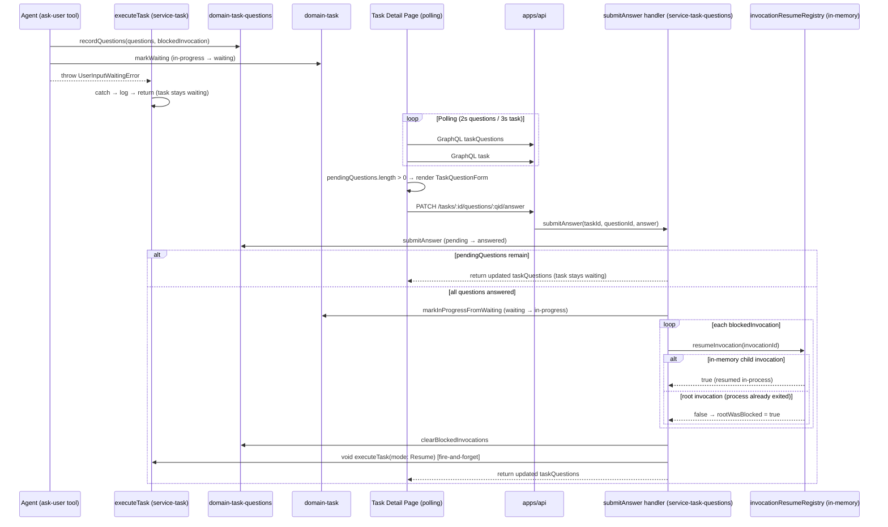

# Architecture: Agent Question Flow Bug Fixes

## Summary

The agent question (HITL) flow has five reported bugs. Bugs 1–4 address UI submit feedback, stale state, silent resume failures, and wrong task status when errors occur while `waiting`. Bug 5 (the primary regression) addresses agent invocations being marked as `failed` in the progress list whenever questions are asked — caused by `invokeWithChatModel` wrapping `UserInputWaitingError` as an `InternalError`. This document maps the current architecture, identifies exact root causes per bug, and plans minimal targeted fixes.

---

## Current Architecture

### Data Flow Diagram



### Key Files

| Layer | Path |
|-------|------|
| UI form component | `apps/web/app/tasks/[id]/_components/TaskQuestionForm/TaskQuestionForm.tsx` |
| UI form hook | `apps/web/app/tasks/[id]/_components/TaskQuestionForm/useTaskQuestionForm.ts` |
| Page hook (polling) | `apps/web/app/tasks/[id]/useTaskDetailPage.ts` |
| Page | `apps/web/app/tasks/[id]/page.tsx` |
| GraphQL hook | `ui/api-hooks/src/tasks/questions/useTaskQuestions.ts` |
| REST hook | `ui/api-hooks/src/tasks/questions/useSubmitAnswer.ts` |
| API resolver | `apps/api/src/graphql/resolvers/taskQuestions.ts` |
| API route | `apps/api/src/routes/tasks/submitAnswer.ts` |
| submitAnswer service | `services/task-questions/src/handlers/submitAnswer/index.ts` |
| executeTask service | `services/task/src/handlers/executeTask/index.ts` |
| ask-user tool | `services/agent/src/helpers/internalTools/askUser/index.ts` |
| Resume registry | `services/agent/src/invocationResumeRegistry/index.ts` |
| domain-task fail cmd | `domains/task/src/commands/fail/index.ts` |
| domain-task markWaiting | `domains/task/src/commands/markWaiting/index.ts` |
| domain-task-questions DAO | `domains/task-questions/src/clients/mongodb.ts` |

---

## Root Causes Per Bug

### Bug 1 — Last question submit has no UI feedback

**File:** `apps/web/app/tasks/[id]/_components/TaskQuestionForm/useTaskQuestionForm.ts`

`handleSubmit` performs two sequential async operations:

```typescript
// Step 1: REST call — tracked by isSubmitting from useSubmitAnswer
await submitAnswer({ taskId, questionId, body: { answer } });

setDraftAnswers(...);  // clears the current draft

// Advance index BEFORE refetch
if (canGoNext) { setCurrentIndex(next); }
else if (canGoPrevious) { setCurrentIndex(prev - 1); }  // ← jumps back!
else { setCurrentIndex(0); }

// Step 2: refetch — NOT tracked by isSubmitting
await onAnswerSubmitted();
```

`isSubmitting` from `useSubmitAnswer` only covers Step 1 (the HTTP call). After `submitAnswer()` resolves, `isSubmitting` becomes `false`, the submit button drops its loading state and appears enabled. Then the index advances to a different question — for a 4-question set on question 4 (`canGoPrevious = true`), this jumps back to question 3, showing an empty answer for a question that was already answered.

The form stays visible with this confusing intermediate state until `onAnswerSubmitted()` (refetch) completes and `pendingQuestions` becomes empty. To the user it looks like the submit was silently ignored — the loading stops, the question changes, and the button appears disabled (no value filled in).

**Root cause:** `isSubmitting` does not cover the full `handleSubmit` lifecycle. The early index advance creates a confusing in-between state. No local "processing" flag gates the entire submit-to-refetch cycle.

---

### Bug 2 — Stale/confusing state after refresh

**File:** `apps/web/app/tasks/[id]/useTaskDetailPage.ts`

This is a compound UX issue caused by Bug 1. The user refreshes because they saw no feedback (Bug 1). After refresh, the state they see is technically correct:
- The answered question appears in `answeredQuestions` (history section)
- The agent resumed (`executeTask(Resume)` fired) and may have asked a new question → new `pendingQuestion` appears

The confusion is twofold:

1. **No success feedback existed before refresh** — there was no toast or transition message confirming the last answer was recorded, so the user doesn't know whether their submit worked.

2. **Two `useEffect` hooks both show the same "assistant needs input" snackbar independently:**

```typescript
// Effect 1 — fires when task status enters waiting
useEffect(() => {
  const enteredWaitingState = task.status === TaskStatus.Waiting && previousStatus !== TaskStatus.Waiting;
  if (enteredWaitingState) { snackbar.show({ message: TASK_WAITING_NOTIFICATION_MESSAGE }); }
}, [task]);

// Effect 2 — fires when pending question count goes from 0 to >0
useEffect(() => {
  if (pendingCount > 0 && !hadPendingQuestions) {
    snackbar.show({ message: TASK_WAITING_NOTIFICATION_MESSAGE });
  }
}, [taskQuestions]);
```

When the agent asks a new question after resume, both effects can fire in the same render cycle, showing the identical notification twice and making the state feel more chaotic.

**Root cause:** Bug 1 forces a manual page refresh, exposing the resumed-and-re-asked state without context. Duplicate snackbar effects amplify the confusion.

---

### Bug 3 — Agent does not resume after all questions answered

**File:** `apps/web/app/tasks/[id]/_components/TaskQuestionForm/useTaskQuestionForm.ts`

`handleSubmit` has no try-catch:

```typescript
const handleSubmit = useCallback(async (): Promise<void> => {
  if (currentQuestion === undefined || isSubmitDisabled) return;

  await submitAnswer({ ... });   // ← no error handling
  setDraftAnswers(...);
  // index advance...
  await onAnswerSubmitted();     // ← no error handling
}, [...]);
```

The button calls `onClick={handleSubmit}` without `void` wrapping (implicit void). If `submitAnswer` or `onAnswerSubmitted` throws (network error, 5xx from server), the rejected Promise is unhandled. Consequences:
- No error is shown to the user
- `onAnswerSubmitted()` is never called (if `submitAnswer` threw), so the form stays frozen
- The agent never resumes because the service never received the answer
- `isSubmitting` goes back to `false` (REST call failed), making the button appear available again with no indication anything went wrong

Additionally: if `submitAnswer` service handler throws at `markInProgressFromWaiting` (e.g., due to task not being in `waiting` state from a concurrent request), the REST endpoint returns a 4xx/5xx. The frontend's `submitAnswer` hook propagates that throw. Without error handling in `handleSubmit`, the UI freezes silently and the agent never resumes.

**Root cause:** Missing try-catch in `handleSubmit` — submit failures are completely invisible to the user, and the agent resume flow is not triggered.

---

### Bug 4 — Wrong status on question failure (`waiting` → `failed`)

**File:** `domains/task/src/commands/fail/index.ts`

The `fail` command uses `updateDbById`, which performs an unconditional `$set` update with no filter on current status:

```typescript
const persistFail = updateDbById<TaskModel>({
  dao: taskMongodbDao,
  factory: taskFactory,
  validationSchema: FAIL_DB_SCHEMA,
});

export const fail = async ({ taskId, errorMessage, errorCode }) => {
  return persistFail({
    id: parsed.data.taskId,
    data: { status: TaskStatus.Failed, ... },   // unconditional
  });
};
```

Contrast with `markWaiting`, which uses `conditionalStatusUpdate` with a status filter:

```typescript
export const markWaiting = async ({ taskId }) =>
  conditionalStatusUpdate({
    filter: { status: TaskStatus.InProgress },  // guard
    update: { status: TaskStatus.Waiting },
    conflictCode: 'TASK_NOT_WAITABLE',
  });
```

The scenario that triggers Bug 4:

1. Agent calls `ask-user` → `recordQuestions` saves pending Q + `blockedInvocation` → `markWaiting` (in-progress → waiting) succeeds → throws `UserInputWaitingError`.
2. `UserInputWaitingError` propagates up through `runAgentInvokeWithTools`. If any middleware or tool runner inside wraps it in a different error type (e.g., a generic `Error`), `executeTask` will NOT match `instanceof UserInputWaitingError`.
3. `executeTask`'s catch block falls through to the generic error path: calls `taskDomain.commands.fail({ taskId, ... })`.
4. `fail` unconditionally sets status `waiting` → `failed`, even though valid pending questions exist.

Result: the task is `failed` with `pendingQuestions` still in the database. The UI shows the form (pending questions visible), but the task header shows `failed`. Polling stops (`isTaskDetailPollable(failed) = false`), so the UI freezes in the last polled state.

Additionally: once a task is `failed`, `executeTask(Resume)` will not re-run (there's no retry trigger). The orphaned questions can never be answered.

**Root cause:** `fail` command has no status guard. It must refuse to transition a `waiting` task to `failed` because the `waiting` state explicitly means user input is pending — execution errors should not override it.

---

## Implementation Steps

### Step 1: Fix `invokeWithChatModel.ts` — re-throw `UserInputWaitingError` (Bug 5)

**File:** `packages/client-langchain/src/operations/invokeWithChatModel.ts`

Add `UserInputWaitingError` to the import and to the re-throw guard:

```typescript
import { ExecutionPausedError, InternalError, UserInputWaitingError } from '@vassembly/errors';

// ...

} catch (error: unknown) {
  if (error instanceof ExecutionPausedError) {
    throw error;
  }

  if (error instanceof UserInputWaitingError) {
    throw error;
  }

  console.error(`${CONSOLE_LOG_PREFIX} invoke failed`, error);
  throw new InternalError(errorMessage, error);
}
```

This single change restores the full cooperative error-signalling contract: `UserInputWaitingError` propagates cleanly through `invokeWithChatModel` → `runAgentInvokeWithTools` → `use-agent` → `executeTask`, with each layer handling it correctly.

### Step 2: Fix `useTaskQuestionForm.ts` — processing state + error handling (Bugs 1 & 3)

**File:** `apps/web/app/tasks/[id]/_components/TaskQuestionForm/useTaskQuestionForm.ts`

- Add local `const [isProcessing, setIsProcessing] = useState(false)` that covers the entire `handleSubmit` flow
- Wrap the submit body in try/catch/finally: `setIsProcessing(true)` → submit → refetch → `setIsProcessing(false)` in `finally`
- On catch: call an error callback or show snackbar; do NOT advance index
- Remove the premature `setCurrentIndex` call from within `handleSubmit` (index should only advance after `onAnswerSubmitted()` confirms success)
- Return `isProcessing` instead of `isSubmitting` from the hook (or combine: `isProcessing || isSubmitting`)
- Update `UseTaskQuestionFormResult` type in `types.ts` to replace/augment `isSubmitting` with `isProcessing`

```typescript
// useTaskQuestionForm.ts — sketch of changes
const [isProcessing, setIsProcessing] = useState(false);

const handleSubmit = useCallback(async (): Promise<void> => {
  if (currentQuestion === undefined || isSubmitDisabled || isProcessing) return;

  setIsProcessing(true);
  try {
    await submitAnswer({
      taskId,
      questionId: currentQuestion.questionId,
      body: { answer: currentValue as string | string[] | boolean },
    });

    setDraftAnswers((previous) => {
      const next = { ...previous };
      delete next[currentQuestion.questionId];
      return next;
    });

    await onAnswerSubmitted();
  } catch {
    onSubmitError();
  } finally {
    setIsProcessing(false);
  }
}, [currentQuestion, isSubmitDisabled, isProcessing, submitAnswer, taskId,
    currentValue, onAnswerSubmitted, onSubmitError]);
```

The `onSubmitError` callback should be added to `TaskQuestionFormProps` (and `UseTaskQuestionFormParams`) so the parent page can show a snackbar.

### Step 3: Wire `onSubmitError` in `TaskQuestionForm.tsx` and `page.tsx` (Bug 1 & 3)

**Files:**
- `apps/web/app/tasks/[id]/_components/TaskQuestionForm/types.ts` — add `onSubmitError: () => void` to `TaskQuestionFormProps`
- `apps/web/app/tasks/[id]/_components/TaskQuestionForm/TaskQuestionForm.tsx` — pass `onSubmitError` through to hook
- `apps/web/app/tasks/[id]/page.tsx` — add `handleSubmitError` that calls `snackbar.show(error)`, pass to `TaskQuestionForm`

### Step 4: Fix `fail` command status guard (Bug 4)

**File:** `domains/task/src/commands/fail/index.ts`

Replace unconditional `updateDbById` with `conditionalStatusUpdate` filtering out the `waiting` (and `done`) states. This mirrors the existing pattern of `markWaiting`, `markInProgressFromWaiting`, etc.

```typescript
// fail/index.ts — sketch of changes
import { ConditionalStatusUpdate } from '../shared/conditionalStatusUpdate';
import { TaskStatus } from '../../model';

export const fail = async ({ taskId, errorMessage, errorCode }) => {
  const parsed = FAIL_INPUT_SCHEMA.safeParse(...);
  if (!parsed.success) throw new ValidationError(...);

  return conditionalStatusUpdate({
    taskId: parsed.data.taskId,
    filter: {
      status: { $nin: [TaskStatus.Waiting, TaskStatus.Done, TaskStatus.Failed] },
    },
    update: {
      status: TaskStatus.Failed,
      errorMessage: parsed.data.errorMessage,
      errorCode: parsed.data.errorCode,
      failedAt: new Date(),
    },
    conflictCode: 'TASK_NOT_FAILABLE',
    conflictMessage: 'Task cannot be failed from its current status',
  });
};
```

Note: `conditionalStatusUpdate` currently takes `filter: Partial<TaskModel>`, so the `$nin` operator requires extending its `filter` type to `Record<string, unknown>` or using a MongoDB query operator type. This may require a small change to `conditionalStatusUpdate`'s interface signature to accept a wider filter type, OR `fail` can use `taskMongodbDao.findOneAndUpdate` directly (like `conditionalStatusUpdate` does internally) with the same pattern.

### Step 5: Deduplicate "waiting" snackbar (Bug 2)

**File:** `apps/web/app/tasks/[id]/useTaskDetailPage.ts`

Remove the snackbar call from the `taskQuestions` effect. The task-status effect (which fires when `task.status` transitions to `waiting`) is the authoritative source. The `taskQuestions` effect should only update the `previousPendingQuestionCountRef`, not show a notification.

```typescript
// Remove snackbar.show from this effect:
useEffect(() => {
  if (taskQuestions === undefined) return;
  const pendingCount = taskQuestions.pendingQuestions.length;
  // REMOVED: snackbar notification (kept only in task-status effect)
  previousPendingQuestionCountRef.current = pendingCount;
}, [taskQuestions]);
```

### Step 6 (optional): Defensive status check in `executeTask` (Bug 4 defense)

**File:** `services/task/src/handlers/executeTask/index.ts`

Before calling `taskDomain.commands.fail`, re-read the task's current status and skip `fail` if the task is already in `waiting`:

```typescript
} catch (error) {
  if (error instanceof ExecutionPausedError) return;
  if (error instanceof UserInputWaitingError) return;

  const mapped = mapExecutionError(error);

  try {
    await taskProgressDomain.commands.finalizeTaskProgress({ taskId });
  } catch { /* silent */ }

  // Defensive check: don't fail a task that transitioned to waiting
  const currentTask = await taskDomain.queries.getModelById({ id: taskId });
  if (currentTask.data?.status === TaskStatus.Waiting) return;

  await taskDomain.commands.fail({ taskId, ...mapped });
  ...
}
```

This is optional if the domain-level guard (Step 4) is implemented, but adds defense-in-depth for edge cases where `fail` is called from other code paths not covered by this audit.

---

### Bug 5 — Agent invocations show as `failed` in task progress list when asking questions

**Symptom:** UI correctly shows the task as `waiting` (Waiting for Input), questions appear in the form, but the task progress list shows the agent (and any parent agents that delegated via `use-agent`) as **failed** with the error "Failed to invoke LM Studio model".

**File:** `packages/client-langchain/src/operations/invokeWithChatModel.ts`

The `ask-user` tool handler throws `UserInputWaitingError` (a cooperative control-flow signal, not a real error). This error propagates from the tool handler through `runToolCallLoop` → `invokeModel` → `invokeWithChatModel`'s catch block.

However, `invokeWithChatModel` only re-throws `ExecutionPausedError`; everything else, including `UserInputWaitingError`, is wrapped as `InternalError`:

```typescript
// current — BUG
} catch (error: unknown) {
  if (error instanceof ExecutionPausedError) {
    throw error; // ✓ re-thrown
  }
  // UserInputWaitingError falls through to here ← BUG
  console.error(`${CONSOLE_LOG_PREFIX} invoke failed`, error);
  throw new InternalError(errorMessage, error);
  // ^ wraps "Failed to invoke LM Studio model" with UserInputWaitingError as cause
}
```

The resulting `InternalError` ("Failed to invoke LM Studio model") then propagates to `runAgentInvokeWithTools`:

```typescript
// runAgentInvokeWithTools.ts — progress recording
if (
  recordProgress &&
  !(error instanceof ExecutionPausedError) &&
  !(error instanceof UserInputWaitingError)  // ← InternalError bypasses this guard
) {
  await recordProgress({ state: 'failed', errorDetails: { ... } }); // ← BUG: records 'failed'
}
throw error;
```

Because `InternalError` is not `UserInputWaitingError`, the guard fails and a `failed` progress event is persisted for the child agent. When the error continues to propagate up through `use-agent`, the same thing happens for each parent agent in the chain — each records a `failed` progress event.

Finally, `executeTask` receives `InternalError` and falls through to the defensive status check (`currentTask.status === TaskStatus.Waiting`), which correctly returns without failing the task. **The task status is protected; only the progress events are incorrect.**

**Error propagation chain (bug path):**

```
ask-user tool → UserInputWaitingError
  → runToolCallLoop → propagates
  → invokeModel → propagates
  → invokeWithChatModel catch → wraps as InternalError("Failed to invoke LM Studio model")
  → systemAgentDomain.commands.invoke → propagates
  → runAgentInvokeWithTools catch
      → InternalError ≠ UserInputWaitingError → records progress failed ← BUG
      → re-throws InternalError
  → use-agent tool handler
      → InternalError ≠ UserInputWaitingError → does NOT enter waitForCompletion ← BUG
      → re-throws InternalError
  → parent runAgentInvokeWithTools catch
      → records progress failed ← BUG
  → executeTask catch
      → currentTask.status === waiting → returns (task protected ✓)
```

**Correct propagation chain (after fix):**

```
ask-user tool → UserInputWaitingError
  → invokeWithChatModel catch → re-throws UserInputWaitingError (fixed)
  → runAgentInvokeWithTools catch
      → UserInputWaitingError → skips failed progress ✓
      → re-throws UserInputWaitingError
  → use-agent tool handler
      → UserInputWaitingError → waitForCompletion (correct) ✓
  → parent waits in-process (or process exits → executeTask(Resume))
  → executeTask catches UserInputWaitingError → logs waiting → returns ✓
```

**Root cause:** `invokeWithChatModel` treats `UserInputWaitingError` the same as real provider errors, wrapping it in `InternalError`. This breaks the cooperative error-signalling contract between the tool handler and `runAgentInvokeWithTools` / `use-agent`.

---

### Bug 5b — Agent invocation progress has no `waiting` state (enhancement)

After Bug 5 is fixed, agent invocations that asked questions will have only a `started` progress event with no closing event. The UI progress list will show these agents as "in progress" (or in whatever fallback state it uses for orphaned `started` events) rather than explicitly "Waiting for input".

To surface the correct state in the UI:

- Add `Waiting = 'waiting'` to `ProgressEventState` enum in `domains/task-progress/src/model/model.ts`
- Record a `waiting` progress event in `runAgentInvokeWithTools` when `UserInputWaitingError` is caught (analogous to how `completed` is recorded on success)
- Update the UI (`apps/web` task progress list) to render the `waiting` state with appropriate copy ("Waiting for input")

This is an enhancement that improves observability; Bug 5 fix alone removes the incorrect "failed" display.

---

## Correct State Transitions

```
created ──start──► in-progress
in-progress ──ask-user──► waiting          ✓ (via markWaiting, guarded)
waiting ──all-answered──► in-progress      ✓ (via markInProgressFromWaiting, guarded)
in-progress ──complete──► done
in-progress ──pause──► paused
paused ──resume──► in-progress
in-progress ──error──► failed              ✓ (should be allowed)
waiting ──error──► failed                  ✗ (must be BLOCKED — user input is pending)
done ──error──► failed                     ✗ (must be BLOCKED — already terminal)
failed ──retry──► in-progress
```

The `fail` command should only be callable from `in-progress`, `created`, or `paused` — never from terminal or `waiting` states.

---

## Architecture & Package Placement

Four packages require changes for Bugs 1–4. Bug 5 adds one more:

| Package | Type | Changes |
|---------|------|---------|
| `apps/web` | App (UI) | Fix `useTaskQuestionForm`, `useTaskDetailPage` |
| `domains/task` | Domain | Add status guard to `fail` command |
| `services/task` _(optional)_ | Service | Defensive status check before `fail` in `executeTask` |
| `packages/client-langchain` | Client package | Re-throw `UserInputWaitingError` in `invokeWithChatModel` |
| `domains/task-progress` _(enhancement)_ | Domain | Add `Waiting` state to `ProgressEventState` |
| `services/agent` _(enhancement)_ | Service | Record `waiting` progress event on `UserInputWaitingError` |

### Data Flow After Fix

```
User clicks Submit
  → handleSubmit sets isProcessing = true
  → submitAnswer REST call (isSubmitting = true → false)
  → if error → show error snackbar, isProcessing = false, return
  → onAnswerSubmitted() refetches task + questions
  → if all answered: form unmounts (pendingQuestions = [])
  → isProcessing = false (in finally)
  → task polling continues, agent resumes in background
```

---

## Recommendation

Fix in order of impact:

1. **`packages/client-langchain/invokeWithChatModel` (Bug 5)** — add `UserInputWaitingError` to the re-throw list (one line change). This is the highest-impact fix: it stops all agents from being marked failed when questions are asked, and restores the correct `use-agent` waiting flow.

2. **`apps/web/TaskQuestionForm` (Bugs 1, 2, 3)** — add local `isProcessing` state covering the full `handleSubmit` cycle, add try-catch with error snackbar, remove premature index advance.

3. **`domains/task/fail` command (Bug 4)** — add `conditionalStatusUpdate` guard to block `waiting` → `failed`. One-file fix with zero risk.

4. **`useTaskDetailPage` snackbar deduplication (Bug 2 UX)** — consolidate two "waiting" notification effects.

5. **`services/task/executeTask` (Bug 4 defense, optional)** — status check before calling `fail`.

6. **`domains/task-progress` + `services/agent` + `apps/web` progress UI (Bug 5b, enhancement)** — add `waiting` progress state so the UI shows "Waiting for input" on agent cards while questions are pending.

---

## Implementation Steps

### Step 1: Fix `invokeWithChatModel.ts` — re-throw `UserInputWaitingError` (Bug 5)

**File:** `packages/client-langchain/src/operations/invokeWithChatModel.ts`

Add `UserInputWaitingError` to the import and to the re-throw guard:

```typescript
import { ExecutionPausedError, InternalError, UserInputWaitingError } from '@vassembly/errors';

// ...

} catch (error: unknown) {
  if (error instanceof ExecutionPausedError) {
    throw error;
  }

  if (error instanceof UserInputWaitingError) {
    throw error;
  }

  console.error(`${CONSOLE_LOG_PREFIX} invoke failed`, error);
  throw new InternalError(errorMessage, error);
}
```

This single change restores the full cooperative error-signalling contract: `UserInputWaitingError` propagates cleanly through `invokeWithChatModel` → `runAgentInvokeWithTools` → `use-agent` → `executeTask`, with each layer handling it correctly.

### Step 2: Fix `useTaskQuestionForm.ts` — processing state + error handling (Bugs 1 & 3)

**File:** `apps/web/app/tasks/[id]/_components/TaskQuestionForm/useTaskQuestionForm.ts`

- Add local `const [isProcessing, setIsProcessing] = useState(false)` that covers the entire `handleSubmit` flow
- Wrap the submit body in try/catch/finally: `setIsProcessing(true)` → submit → refetch → `setIsProcessing(false)` in `finally`
- On catch: call an error callback or show snackbar; do NOT advance index
- Remove the premature `setCurrentIndex` call from within `handleSubmit` (index should only advance after `onAnswerSubmitted()` confirms success)
- Return `isProcessing` instead of `isSubmitting` from the hook (or combine: `isProcessing || isSubmitting`)
- Update `UseTaskQuestionFormResult` type in `types.ts` to replace/augment `isSubmitting` with `isProcessing`

```typescript
// useTaskQuestionForm.ts — sketch of changes
const [isProcessing, setIsProcessing] = useState(false);

const handleSubmit = useCallback(async (): Promise<void> => {
  if (currentQuestion === undefined || isSubmitDisabled || isProcessing) return;

  setIsProcessing(true);
  try {
    await submitAnswer({
      taskId,
      questionId: currentQuestion.questionId,
      body: { answer: currentValue as string | string[] | boolean },
    });

    setDraftAnswers((previous) => {
      const next = { ...previous };
      delete next[currentQuestion.questionId];
      return next;
    });

    await onAnswerSubmitted();
  } catch {
    onSubmitError();
  } finally {
    setIsProcessing(false);
  }
}, [currentQuestion, isSubmitDisabled, isProcessing, submitAnswer, taskId,
    currentValue, onAnswerSubmitted, onSubmitError]);
```

The `onSubmitError` callback should be added to `TaskQuestionFormProps` (and `UseTaskQuestionFormParams`) so the parent page can show a snackbar.

### Step 3: Wire `onSubmitError` in `TaskQuestionForm.tsx` and `page.tsx` (Bug 1 & 3)

**Files:**
- `apps/web/app/tasks/[id]/_components/TaskQuestionForm/types.ts` — add `onSubmitError: () => void` to `TaskQuestionFormProps`
- `apps/web/app/tasks/[id]/_components/TaskQuestionForm/TaskQuestionForm.tsx` — pass `onSubmitError` through to hook
- `apps/web/app/tasks/[id]/page.tsx` — add `handleSubmitError` that calls `snackbar.show(error)`, pass to `TaskQuestionForm`

### Step 4: Fix `fail` command status guard (Bug 4)

**File:** `domains/task/src/commands/fail/index.ts`

Replace unconditional `updateDbById` with `conditionalStatusUpdate` filtering out the `waiting` (and `done`) states. This mirrors the existing pattern of `markWaiting`, `markInProgressFromWaiting`, etc.

```typescript
// fail/index.ts — sketch of changes
import { ConditionalStatusUpdate } from '../shared/conditionalStatusUpdate';
import { TaskStatus } from '../../model';

export const fail = async ({ taskId, errorMessage, errorCode }) => {
  const parsed = FAIL_INPUT_SCHEMA.safeParse(...);
  if (!parsed.success) throw new ValidationError(...);

  return conditionalStatusUpdate({
    taskId: parsed.data.taskId,
    filter: {
      status: { $nin: [TaskStatus.Waiting, TaskStatus.Done, TaskStatus.Failed] },
    },
    update: {
      status: TaskStatus.Failed,
      errorMessage: parsed.data.errorMessage,
      errorCode: parsed.data.errorCode,
      failedAt: new Date(),
    },
    conflictCode: 'TASK_NOT_FAILABLE',
    conflictMessage: 'Task cannot be failed from its current status',
  });
};
```

Note: `conditionalStatusUpdate` currently takes `filter: Partial<TaskModel>`, so the `$nin` operator requires extending its `filter` type to `Record<string, unknown>` or using a MongoDB query operator type. This may require a small change to `conditionalStatusUpdate`'s interface signature to accept a wider filter type, OR `fail` can use `taskMongodbDao.findOneAndUpdate` directly (like `conditionalStatusUpdate` does internally) with the same pattern.

### Step 5: Deduplicate "waiting" snackbar (Bug 2)

**File:** `apps/web/app/tasks/[id]/useTaskDetailPage.ts`

Remove the snackbar call from the `taskQuestions` effect. The task-status effect (which fires when `task.status` transitions to `waiting`) is the authoritative source. The `taskQuestions` effect should only update the `previousPendingQuestionCountRef`, not show a notification.

```typescript
// Remove snackbar.show from this effect:
useEffect(() => {
  if (taskQuestions === undefined) return;
  const pendingCount = taskQuestions.pendingQuestions.length;
  // REMOVED: snackbar notification (kept only in task-status effect)
  previousPendingQuestionCountRef.current = pendingCount;
}, [taskQuestions]);
```

### Step 6 (optional): Defensive status check in `executeTask` (Bug 4 defense)

**File:** `services/task/src/handlers/executeTask/index.ts`

Before calling `taskDomain.commands.fail`, re-read the task's current status and skip `fail` if the task is already in `waiting`:

```typescript
} catch (error) {
  if (error instanceof ExecutionPausedError) return;
  if (error instanceof UserInputWaitingError) return;

  const mapped = mapExecutionError(error);

  try {
    await taskProgressDomain.commands.finalizeTaskProgress({ taskId });
  } catch { /* silent */ }

  // Defensive check: don't fail a task that transitioned to waiting
  const currentTask = await taskDomain.queries.getModelById({ id: taskId });
  if (currentTask.data?.status === TaskStatus.Waiting) return;

  await taskDomain.commands.fail({ taskId, ...mapped });
  ...
}
```

This is optional if the domain-level guard (Step 4) is implemented, but adds defense-in-depth for edge cases where `fail` is called from other code paths not covered by this audit.

### Step 7 (enhancement): Add `waiting` progress state (Bug 5b)

**Files:**

- `domains/task-progress/src/model/model.ts` — add `Waiting = 'waiting'` to `ProgressEventState`
- `services/agent/src/helpers/internalTools/runAgentInvokeWithTools.ts` — in the catch block, when `error instanceof UserInputWaitingError`, record a `waiting` progress event (analogous to `completed` on success)
- `apps/web` task progress list component — render a `waiting` state chip/badge ("Waiting for input") for events with `state === 'waiting'`

```typescript
// runAgentInvokeWithTools.ts — enhancement
} catch (error: unknown) {
  if (recordProgress && error instanceof UserInputWaitingError) {
    await recordProgress({
      agentId: params.agentId,
      parentAgentId: toolContext.parentAgentId,
      state: 'waiting',
      timestamp: new Date(),
      duration: Date.now() - invokeStartTime,
      ...integrationSnapshot,
    });
  } else if (
    recordProgress &&
    !(error instanceof ExecutionPausedError)
  ) {
    // existing failed recording
    await recordProgress({ state: 'failed', errorDetails: { ... }, ... });
  }
  throw error;
}
```

---

## Todo Plan

1. **`packages/client-langchain` — `invokeWithChatModel` re-throw fix (Bug 5)**
   - Changes needed: Add `UserInputWaitingError` to the import and re-throw guard in `invokeWithChatModel.ts`
   - Files to modify: `packages/client-langchain/src/operations/invokeWithChatModel.ts`
   - Suggested subagent workflow: `tdd-unit-test-writer → coder ↔ code-reviewer (loop: max 2 iterations)`
   - Dependencies: None — highest priority, unblocks all downstream correct behavior

2. **`apps/web` — TaskQuestionForm (Bugs 1, 2, 3)**
   - Changes needed:
     - `useTaskQuestionForm.ts`: add `isProcessing`, wrap `handleSubmit` in try/catch/finally, remove premature index advance, add `onSubmitError` param
     - `types.ts`: add `onSubmitError: () => void` to `TaskQuestionFormProps` and `UseTaskQuestionFormParams`
     - `TaskQuestionForm.tsx`: pass `onSubmitError` to hook; use combined `isProcessing` for button `isLoading` and `isDisabled`
     - `page.tsx`: pass `handleSubmitError` snackbar handler to `<TaskQuestionForm>`
   - Files to modify:
     - `apps/web/app/tasks/[id]/_components/TaskQuestionForm/useTaskQuestionForm.ts`
     - `apps/web/app/tasks/[id]/_components/TaskQuestionForm/types.ts`
     - `apps/web/app/tasks/[id]/_components/TaskQuestionForm/TaskQuestionForm.tsx`
     - `apps/web/app/tasks/[id]/page.tsx`
   - Suggested subagent workflow: `tdd-unit-test-writer → coder ↔ code-reviewer (loop: max 2 iterations) → documentation-writer`
   - Dependencies: None — can run in parallel with todo 1

3. **`apps/web` — useTaskDetailPage snackbar deduplication (Bug 2)**
   - Changes needed: Remove `snackbar.show(...)` from the `taskQuestions` `useEffect`, keep only the task-status `useEffect` as the notification source
   - Files to modify: `apps/web/app/tasks/[id]/useTaskDetailPage.ts`
   - Suggested subagent workflow: `coder → code-reviewer`
   - Dependencies: Can be done in parallel with todos 1 & 2

4. **`domains/task` — `fail` command status guard (Bug 4)**
   - Changes needed: Replace `updateDbById` in `fail/index.ts` with `conditionalStatusUpdate` (or equivalent MongoDB filter) to block `waiting` → `failed` transitions
   - Files to modify:
     - `domains/task/src/commands/fail/index.ts`
     - Possibly `domains/task/src/commands/shared/conditionalStatusUpdate.ts` if `filter` type needs widening for `$nin` operator
   - Suggested subagent workflow: `tdd-unit-test-writer → coder ↔ code-reviewer (loop: max 2 iterations)`
   - Dependencies: None — can run in parallel with todos 1, 2 & 3

5. **`services/task` — executeTask defensive status check (Bug 4, optional)**
   - Changes needed: Before calling `taskDomain.commands.fail`, re-read task status and skip fail if `waiting`
   - Files to modify: `services/task/src/handlers/executeTask/index.ts`
   - Suggested subagent workflow: `tdd-unit-test-writer → coder → code-reviewer`
   - Dependencies: Todo 4 should be completed first; this is defense-in-depth on top of the domain fix

6. **`domains/task-progress` + `services/agent` + `apps/web` — `waiting` progress state (Bug 5b, enhancement)**
   - Changes needed:
     - `domains/task-progress`: add `Waiting = 'waiting'` to `ProgressEventState`
     - `services/agent/runAgentInvokeWithTools`: record `waiting` progress event when `UserInputWaitingError` is caught
     - `apps/web` task progress list: render `waiting` state chip ("Waiting for input")
   - Files to modify:
     - `domains/task-progress/src/model/model.ts`
     - `services/agent/src/helpers/internalTools/runAgentInvokeWithTools.ts`
     - UI task progress list component (determine exact path from codebase)
   - Suggested subagent workflow: `tdd-unit-test-writer → coder ↔ code-reviewer (loop: max 2 iterations) → documentation-writer`
   - Dependencies: Todo 1 must be completed first (Bug 5 fix establishes correct error propagation)

---

## Test Strategy

| Todo | Test type | What to test |
|------|-----------|-------------|
| 1 (`invokeWithChatModel`) | Unit (`tdd-unit-test-writer`) | `UserInputWaitingError` from tool handler propagates unchanged; `ExecutionPausedError` still propagates; real provider errors still become `InternalError` |
| 2 (TaskQuestionForm) | Unit (`tdd-unit-test-writer`) | `handleSubmit` shows loading during full cycle; error from `submitAnswer` triggers `onSubmitError`; no premature index jump on last question; `isProcessing` blocks duplicate submits |
| 3 (snackbar dedup) | Unit | Snackbar shows once when entering `waiting`, not twice |
| 4 (`fail` status guard) | Unit (`tdd-unit-test-writer`) | `fail` throws `ConflictError` when task is `waiting`; `fail` succeeds from `in-progress`; `fail` throws from `done` |
| 5 (executeTask defense) | Unit | `executeTask` does not call `fail` when task is `waiting` after error |
| 6 (waiting progress state) | Unit | `runAgentInvokeWithTools` records `waiting` event on `UserInputWaitingError`; does not record `failed`; GraphQL schema exposes `waiting` state |
