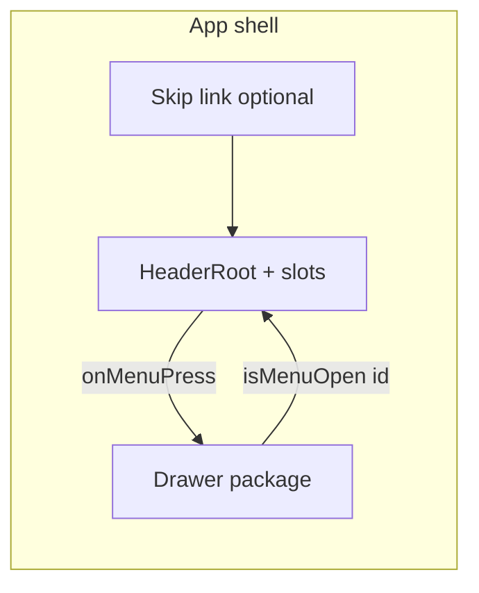

# Header — Implementation Architecture

Engineering plan for `@vassembly/ui-header`, derived from [design.md](./design.md) and a monorepo reuse audit (librarian handoff). **No drawer implementation** in this package; the menu trigger delegates to the parent via `onMenuPress`.

---

## Analysis

### Domain audit

Not applicable. The header is presentational chrome; no domain commands, queries, or entity models are required.

### Existing code to reuse

| Capability | Reuse |
|------------|--------|
| Design tokens (surface, primary, `primary_fixed_dim` → `$color-primary-fixed-dim`, outline-variant) | **`@vassembly/theme`** — import `src/tokens/index.scss` from SCSS modules (same pattern as `@vassembly/ui-footer`). |
| Breakpoints (mobile <768, tablet 768–1023, desktop ≥1024) | **`@vassembly/theme`** — `breakpoints.scss`: `$breakpoint-tablet` (768px), `$breakpoint-desktop` (1024px), `$media-mobile-only`, `$media-tablet-only`, `$media-desktop`. |
| Hamburger / menu icon (1.5px stroke, 24px) | **`@vassembly/ui-icons`** — `NavigationMenuIcon`. |
| Typography for nav links | **`@vassembly/ui-text`** — align variants with design (≈15–16px body/label scale); match `@vassembly/ui-breadcrumbs` / `@vassembly/ui-footer` usage. |
| `className` merging | **`@vassembly/ui-utils`** — `resolveClassName`. |
| Layout chrome precedent | **`@vassembly/ui-footer`** — landmark root, `*.module.scss` + theme import, optional `id`, Storybook. |
| `aria-current="page"` on current link | **`@vassembly/ui-breadcrumbs`** — pattern for current item. |

### Partial gaps (extend or build locally)

- **No shared React breakpoint hook** — responsive behavior should stay **`@media` in SCSS** (consistent with `ui/system-design/*`). Avoid introducing a one-off hook unless a prop must change by breakpoint in JS (not required by the current API).
- **Skip to main content** — not implemented as a shared component today; **document app-shell contract** (skip link as first focusable **before** `<header>`). Optionally add a minimal **`SkipToMainContentLink`** export in a later iteration if product wants a single canonical primitive (out of scope for MVP unless PM asks).
- **`@vassembly/ui-button`** — useful as a **reference** for focus rings and interaction tests; the menu CTA is **icon-only, fixed 44×44**, tertiary/glass styling per design — prefer a **dedicated `MenuTriggerCTA`** built on native `<button>` + SCSS to avoid fighting button size/variant semantics.

### Greenfield

- **`@vassembly/ui-header`** package, all named subcomponents, and header-specific SCSS.

### Layers involved

| Layer | Package |
|-------|---------|
| UI | `ui/system-design/header` → `@vassembly/ui-header` |
| App shell (future) | `apps/*` — compose header + drawer + skip link order; pass `isMenuOpen`, `menuSurfaceId` |

---

## Architecture & package placement

### Package location and naming

- **Path:** `ui/system-design/header/` (sibling to `footer`, `button`, `breadcrumbs` — not under deprecated `packages/ui/` paths in older docs).
- **Package name:** `@vassembly/ui-header`.
- **Rationale:** Matches `@vassembly/ui-<feature>` convention and keeps the component in **Synthetic Luminal** system-design packages with shared SCSS + Vitest + Storybook setup.

### Folder structure (recommended)

```text
ui/system-design/header/
├── package.json
├── tsconfig.json
├── vitest.config.ts
├── README.md
└── src/
    ├── index.ts                 # public exports only
    ├── types.ts                 # all prop / nav link interfaces
    ├── HeaderRoot.tsx           # <header>, optional sticky hook props
    ├── HeaderRoot.module.scss
    ├── HeaderInner.tsx          # max-width + horizontal padding (optional wrapper; can fold into HeaderRoot if <100 lines total)
    ├── HeaderBrand.tsx
    ├── HeaderBrand.module.scss
    ├── HeaderNav.tsx
    ├── HeaderNav.module.scss
    ├── HeaderUtilities.tsx
    ├── HeaderUtilities.module.scss
    ├── MenuTriggerCTA.tsx
    ├── MenuTriggerCTA.module.scss
    ├── headerMotion.scss        # optional shared variables: duration, easing (imported by *.module.scss)
    └── *.test.tsx               # colocated tests per component or grouped HeaderRoot.test.tsx
```

**File size policy:** Project convention targets **≤100 lines per file** — split subcomponents and SCSS rather than one mega-file.

**Exports:** Named exports only (`HeaderRoot`, `HeaderBrand`, `HeaderNav`, `HeaderUtilities`, `MenuTriggerCTA`, types). Optionally export a **composed `Header`** that wires default layout if product teams prefer a single import (thin wrapper over slots); design handoff names `HeaderRoot` as the landmark — use that as the primary documented API.

### Data flow



- **Header** emits `onMenuPress` only; **drawer** owns panel, trap, scrim.
- **Shared state** (`isMenuOpen`, drawer DOM `id`) lives in **app**; passed into header props for `aria-expanded` / `aria-controls`.

---

## 1. Package structure & naming (summary)

See **Folder structure** above. Register the workspace package in `pnpm-workspace.yaml` if the glob does not already include `ui/system-design/*` (mirror `ui-footer`).

---

## 2. Component breakdown

| Component | Responsibility | Notes |
|-----------|----------------|--------|
| **HeaderRoot** | Semantic `<header>`, full width, flex row, `justify-content: space-between`, min-height **56px** / **64px** (desktop), background from tokens, optional bottom hairline (`outline-variant` ~15% opacity) or tonal lift per design. Optional **sticky** behavior (scroll > 8px subtle opacity/blur) behind a prop, respecting `prefers-reduced-motion`. | Accepts `className`, optional `id`, children (composition). |
| **HeaderInner** (optional) | Horizontal padding: **16 / 24 / 32px** by breakpoint; optional max-width alignment with page grid. | Either separate component or CSS layer on HeaderRoot — pick one to avoid redundant DOM. |
| **HeaderBrand** | Left cluster: wraps **required** logo `ReactNode`; if the product uses a link, pass `<a>` or `<Link>` as child or support `brandHref` + render internal `<a>`. Min **44×44** hit area, vertical padding per §3.1. | Does not fetch routes. |
| **HeaderNav** | Optional horizontal `<nav aria-label="Main">` when `navLinks.length > 0`. Links: Inter styling, muted → primary hover, active state + `aria-current="page"`. **Hide** when links empty. **No wrapping** in-bar — use CSS `nowrap` + overflow hidden / product truncates list (design: do not sacrifice menu CTA). | Tablet/desktop-first; may be hidden on `$media-mobile-only` via SCSS if product passes links only for large screens (product decision; default SCSS can show whenever links provided). |
| **HeaderUtilities** | Slot wrapper for optional `ReactNode`; flex row, **left of** menu CTA; spacing **8px** min to CTA neighbor. | Mobile: prefer single utility. |
| **MenuTriggerCTA** | **Required** trailing control: native `<button type="button">`, **44×44** min, `NavigationMenuIcon`, `aria-expanded` from `isMenuOpen`, optional `aria-controls={menuSurfaceId}`, `onClick` → `onMenuPress`. Focus ring token-driven. Optional morph to “close” icon is **product + drawer spec** — support via optional `icon` slot or `menuIcon` prop later; default hamburger per design. | Not coupled to drawer package import. |

### Props interfaces (`types.ts`)

Define **separate interfaces** for each component; use **object params** only where a function has multiple arguments (N/A for React components). Suggested shapes:

**`HeaderNavLink`** (shared type)

- `label: string`
- `href: string`
- `isActive?: boolean`

**`HeaderRootProps`**

- `logo: ReactNode` — **required** (brand slot content; aligns with design “logo slot”).
- `onMenuPress: () => void` — **required**.
- `isMenuOpen?: boolean` — drives `aria-expanded` on trigger (default `false` when omitted).
- `menuSurfaceId?: string` — when drawer exposes stable `id`, pass for `aria-controls`.
- `navLinks?: HeaderNavLink[]` — omit or empty → no inline nav.
- `utilitiesSlot?: ReactNode` — optional.
- `className?: string`
- `id?: string`
- `isSticky?: boolean` (optional; if true, implement sticky + optional scroll-enhanced surface per design §6)
- `children?: ReactNode` — escape hatch for advanced composition; default layout uses slots below.

**Alternative composition API (recommended for clarity):** instead of flattening all props on `HeaderRoot`, export `HeaderRoot` with **only** layout/surface props + `children`, and document composition:

```tsx
<HeaderRoot>
  <HeaderBrand>{logo}</HeaderBrand>
  <HeaderNav links={navLinks} />
  <HeaderUtilities>{utilitiesSlot}</HeaderUtilities>
  <MenuTriggerCTA ... />
</HeaderRoot>
```

If the product prefers a **single-component** DX, provide **`Header`** composed default that maps `logo`, `navLinks`, `utilitiesSlot`, `onMenuPress`, etc., onto the slot children. **Either way**, keep subcomponents exported for flexibility.

**`MenuTriggerCTAProps`**

- `onPress: () => void`
- `isExpanded: boolean`
- `controlsId?: string`
- `className?: string`
- `ariaLabel?: string` — default e.g. `"Open menu"` / `"Main menu"` (i18n via prop).

---

## 3. State & hooks

| Topic | Approach |
|-------|----------|
| **Open/closed** | **Controlled** from app: `isMenuOpen` optional boolean. |
| **React context** | **Not required** for MVP — props from shell are enough. |
| **Sticky / scroll blur** | If implemented: **`useState` + `useEffect`** with passive scroll listener on `window` or scroll container ref, throttled; or CSS **`position: sticky`** only without JS blur for v1 simplicity. Prefer **CSS sticky** + static styles first; add JS enhancement in phase 2. |
| **`prefers-reduced-motion`** | **CSS `@media (prefers-reduced-motion: reduce)`** in SCSS (pattern exists across `ui/system-design/*`); shorten transitions to ≤150ms or instant for non-essential motion. |

**No** new shared monorepo hook unless multiple components need the same scroll/sticky logic — then extract to `@vassembly/ui-utils` in a follow-up ticket.

---

## 4. Styling approach

- **SCSS modules** (`*.module.scss`) per component (or shared partials imported into modules), matching **`@vassembly/ui-footer`** / **`@vassembly/ui-button`**.
- **Tokens:** `@import '@vassembly/theme/src/tokens/index.scss';` then use **`$color-surface`**, **`$color-primary`**, **`$color-primary-fixed-dim`**, **`$color-outline-variant`**, **`$color-on-surface`**, **`$color-on-surface-variant`** (or opacity utilities where design specifies ~70%).
- **No raw hex** in component styles except where theme does not yet expose a token (should be rare — escalate to theme package if missing).
- **Focus ring:** `outline` or `box-shadow` using **primary at 40% opacity**, **2px**, offset per design; transition **300–500ms** with **`cubic-bezier(0.22, 1, 0.36, 1)`** (define as SCSS variables in `headerMotion.scss`).
- **`resolveClassName`** for merging consumer `className`.

---

## 5. Responsive design implementation

| Breakpoint | Source | Layout |
|------------|--------|--------|
| Mobile | `$media-mobile-only` (max-width **767px**) | Logo left; utilities optional; **MenuTriggerCTA** `margin-inline-start: auto` or flex `justify-content: space-between` with right cluster `display: flex; gap: …`. Min height **56px**, padding **16px**. |
| Tablet | `$media-tablet-only` | Padding **24px**; optional nav; min height transition toward desktop. |
| Desktop | `$media-desktop` (≥**1024px**) | Padding **32px**; min height **64px**; optional nav with **24–32px** gaps between logo and nav per design. |

**Layout:** `display: flex; align-items: center; width: 100%` on the inner row. **Left group:** brand + nav (nav `flex-shrink: 0` with `white-space: nowrap` and hidden overflow if needed). **Right group:** utilities + MenuTriggerCTA (`flex-shrink: 0`). **Logo** `flex-shrink: 0`.

**Nav visibility on small screens:** Design allows optional omission of inline nav on mobile — implement by **media query** hiding `.nav` when below tablet **or** let the app pass `navLinks` only when appropriate; SCSS default: show when links exist, hide on `$media-mobile-only` **if** product wants (document in README; default to design narrative “often omitted on mobile” = **hidden when mobile-only** if links provided, overridable via prop `isInlineNavVisibleOnMobile` if needed — keep MVP simple: **always render nav when links provided**, product passes empty array on mobile to hide).

---

## 6. Accessibility implementation

| Requirement | Implementation |
|-------------|----------------|
| Landmark | **`HeaderRoot`** renders **`<header>`** once per composition; apps must not nest multiple full headers without `aria` mitigation. |
| Skip link | **Document:** first focusable in page should be “Skip to main content”; rendered **outside** this package **above** the header in DOM order. Header must not use `tabIndex` tricks that skip ahead of it incorrectly. |
| **Menu trigger** | `type="button"`; **`aria-expanded`** = `Boolean(isMenuOpen)`; **`aria-controls`** when `menuSurfaceId` set; **`aria-label`** configurable. |
| **Inline nav** | `<nav aria-label="Main">` (or configurable `navAriaLabel` prop) when nav visible. |
| **Current page** | **`aria-current="page"`** on active link (see breadcrumbs). |
| **Touch targets** | Min **44×44px** for button and brand link wrapper (`min-width` / `min-height` + padding). |
| **Focus visible** | `:focus-visible` styles; do not remove outlines without replacement ring. |
| **Keyboard** | Natural tab order: brand → nav links → utilities → menu button. |
| **High contrast / reduced motion** | Respect `prefers-reduced-motion`; active nav not color-only (underline or bottom bar per design). |

---

## 7. Animation & motion

- **Duration:** CSS custom properties or SCSS variables, e.g. `$header-motion-duration: 400ms` within **300–500ms** band for micro-interactions (hover/focus on trigger and links).
- **Easing:** `cubic-bezier(0.22, 1, 0.36, 1)`.
- **Properties to animate:** `color`, `opacity`, `box-shadow` / `outline-color`, optional `transform` on icon only if spec’d (keep subtle).
- **`prefers-reduced-motion: reduce`:** set transition to **none** or **≤150ms** for opacity-only.
- **Panel motion:** explicitly **out of scope** (drawer package).

---

## 8. Integration points

| Consumer | Integration |
|----------|--------------|
| **Drawer package** | Parent passes **`onMenuPress`** to open/toggle drawer; passes **`isMenuOpen`** and **`menuSurfaceId`** (drawer root `id`) for ARIA coordination. **No import** of drawer from `@vassembly/ui-header`. |
| **App shell** | Compose **skip link** → **`<HeaderRoot … />`** → **main** `id="main-content"` target; compose **drawer** sibling. |
| **Design tokens** | Strict dependency on **`@vassembly/theme`** SCSS entry used by other system-design components. |
| **Storybook** | `ui/storybook` — add stories for header variants (minimal, +nav, +utilities, open state); alias theme like existing packages. |

---

## 9. Testing strategy

| Layer | Tooling | Cases |
|-------|---------|--------|
| Unit / RTL | **Vitest** + **@testing-library/react** + **user-event** + **jest-dom** (match `@vassembly/ui-button`) | Renders with required slots; `onMenuPress` fires on button click; **`aria-expanded`** true/false from `isMenuOpen`; **`aria-controls`** when `menuSurfaceId` set; nav hidden when no links; **`aria-current="page"`** on active link; optional utilities render in document order before trigger. |
| a11y | **eslint-plugin-jsx-a11y** (if in repo config) + RTL queries (`getByRole('banner')`, `navigation`, `button`) | Landmark roles; button not `submit`. |
| Responsive | **No snapshot dependency required** — prefer **asserting class names** or CSS custom property values if exposed; optional **visual regression** via Storybook + Chromatic if project adopts later. For breakpoints, **unit test** `HeaderNav` visibility logic if any JS prop toggles; SCSS-only responsive behavior covered by **Storybook viewports** (manual / CI story smoke). |
| Motion | RTL does not assert curves — verify **reduced-motion** path via **`window.matchMedia` mock** in test if JS toggles classes; otherwise rely on SCSS lint / code review. |

---

## 10. Dependency map

### External

- `react`, `react-dom` (peer or direct per sibling packages)
- `sass`
- `vitest`, `@vitejs/plugin-react`, `@testing-library/*`, `typescript`, eslint/tsconfig workspaces (dev)

### Internal (runtime)

| Package | Usage |
|---------|--------|
| `@vassembly/theme` | SCSS tokens + media variables |
| `@vassembly/ui-icons` | `NavigationMenuIcon` |
| `@vassembly/ui-text` | Nav link typography |
| `@vassembly/ui-utils` | `resolveClassName` |

### Internal (not required for MVP)

- `@vassembly/ui-button` — dev-only reference or Storybook demos, not a hard dependency unless team standardizes icon button on it later.

---

## 11. Implementation phases

1. **Scaffold** `@vassembly/ui-header` from system-design template (mirror `ui-footer` `package.json` scripts/deps).
2. **Tokens + HeaderRoot shell** — landmark, flex skeleton, min-heights, padding breakpoints, surface background.
3. **MenuTriggerCTA** — smallest vertical slice: icon, 44×44, `aria-*`, motion tokens, tests.
4. **HeaderBrand** — logo slot + hit area.
5. **HeaderNav** — optional links, `aria-label`, active styles, nowrap.
6. **HeaderUtilities** — slot + spacing to CTA.
7. **Composition + README** — document app shell, drawer wiring, skip link order; Storybook stories for all variants.
8. **Polish** — optional sticky/blur, hairline separator, light-mode token verification if theme supports it.

---

## Recommendation

Ship **`@vassembly/ui-header`** as a **composition-first** system-design package: **SCSS modules + `@vassembly/theme` + `NavigationMenuIcon`**, no drawer coupling, **controlled ARIA** from shell state. This mirrors **`@vassembly/ui-footer`**, minimizes new infrastructure (no Tailwind, no breakpoint hooks), and satisfies Synthetic Luminal tokens and motion notes.

**Trade-off:** Skip-link and main landmark `id` remain **app responsibilities** — document clearly in README to satisfy design §8.

---

## Implementation steps (engineering checklist)

1. Add `ui/system-design/header` with `package.json` aligned to `@vassembly/ui-footer` (main/types → `src/index.ts`, vitest, sass, workspace deps).
2. Implement `types.ts` with all public interfaces; export from `src/index.ts`.
3. Implement `MenuTriggerCTA.tsx` + SCSS using `$color-primary-fixed-dim` / `$color-primary` hover and shared motion variables.
4. Implement `HeaderRoot` + inner layout SCSS using `$media-*` and spacing tokens (map 16/24/32 to theme spacing variables if available, else use rem values from design with a TODO to tokenize).
5. Implement `HeaderBrand`, `HeaderNav`, `HeaderUtilities` as thin presentational components.
6. Add `Header` composed export if single-import DX is desired.
7. Add `Header*.stories.tsx` and README integration section (drawer + skip link).
8. Add Vitest suites for trigger, nav, and aria wiring.

---

## Todo Plan

1. **`@vassembly/ui-header`** — [Type: new UI package]

   - **Changes needed:** Create package `ui/system-design/header` with scaffold, then implement slot components, SCSS, Storybook stories, Vitest tests, README (integration with drawer + skip link + tokens).
   - **Files to modify/create:** `ui/system-design/header/package.json`, `tsconfig.json`, `vitest.config.ts`, `README.md`, `src/index.ts`, `src/types.ts`, `src/HeaderRoot.tsx`, `src/HeaderRoot.module.scss`, `src/HeaderBrand.tsx`, `src/HeaderBrand.module.scss`, `src/HeaderNav.tsx`, `src/HeaderNav.module.scss`, `src/HeaderUtilities.tsx`, `src/HeaderUtilities.module.scss`, `src/MenuTriggerCTA.tsx`, `src/MenuTriggerCTA.module.scss`, `src/headerMotion.scss`, `src/*.test.tsx`, `src/*.stories.tsx`.
   - **Suggested subagent workflow:** coder (scaffold) → unit-test-writer + coder ↔ code-reviewer (max 2 loops) → documentation-writer (README) → optional Storybook verification in `ui/storybook`.
   - **Dependencies:** None (greenfield package).

2. **`ui/storybook`** — [Type: app / dev shell]

   - **Changes needed:** Register stories for `@vassembly/ui-header` (import package; ensure theme alias matches other system-design components).
   - **Files to modify/create:** Under Storybook app only — exact paths per existing story conventions.
   - **Suggested subagent workflow:** coder → Done.
   - **Dependencies:** Todo 1 (package must build/export first).

3. **`apps/web`** (or primary consumer app) — [Type: app integration — **optional / follow-up**]

   - **Changes needed:** Compose header + future drawer + skip link in layout; wire `onMenuPress` / `isMenuOpen` / `menuSurfaceId`. Not blocking package delivery.
   - **Files to modify/create:** App layout/shell files (TBD when app adopts shell).
   - **Suggested subagent workflow:** coder → code-reviewer.
   - **Dependencies:** Todo 1; drawer package when available.

---

## Librarian inputs incorporated

- **Greenfield** header package; **reuse** `@vassembly/theme`, `@vassembly/ui-icons` (`NavigationMenuIcon`), `@vassembly/ui-text`, `@vassembly/ui-utils`, patterns from **`@vassembly/ui-footer`** / **`@vassembly/ui-breadcrumbs`**.
- **No** shared breakpoint hook — SCSS `@media` with theme variables.
- **No** motion library — CSS transitions + `prefers-reduced-motion`.
- **Drawer** remains separate; coordination via props/ids only.
