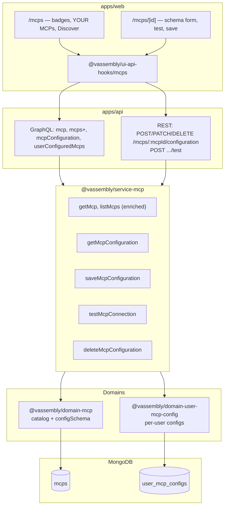
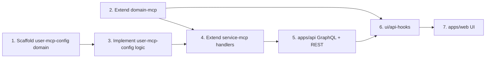

# MCP Configuration Management — Architecture

**Status:** Engineering handoff  
**Last updated:** 2026-06-08  
**Related:** [PRD](./prd.md), [Design Spec](./design.md), [MCP Listing Page](../mcp-listing-page/architecture.md) (prerequisite — shipped)

---

## Analysis

### Audit of existing domains

| Domain | Relevance | Reuse |
|--------|-----------|-------|
| `@vassembly/domain-mcp` | Read-only MCP catalog (`mcps` collection, `getList`, `getAvailableTags`, seed) | **Extend** — add `configSchema`, `getById`; keep commands out |
| `@vassembly/domain-ai-integration` | Per-user credentials, encryption, test connection, masked DTOs | **Primary pattern** for `user-mcp-config` commands/queries/mappers |
| `@vassembly/domain-user` | `userId` ownership | Referenced for auth context only; no extension |
| `@vassembly/client-encoder` | AES-256-CBC `encode`/`decode` | Encrypt `password`-type field values at write; decode only in test command |

**New domain required:** `@vassembly/domain-user-mcp-config` — distinct entity (user-owned configuration with commands). Cannot live in read-only `domain-mcp` per domain isolation rules.

### What exists vs gaps

| Layer | Exists | Gap |
|-------|--------|-----|
| Catalog model | `McpModel` without `configSchema` | Add flat field schema to model, seed, GraphQL, DTO |
| Catalog queries | `getList`, `getAvailableTags` | Add `getById` |
| User config | Nothing | New domain: CRUD commands, queries, MongoDB collection |
| Service | `listMcps`, `getAvailableTags` | Add config handlers; enrich list with `configurationStatus` |
| GraphQL | `mcps`, `availableTags` | Add `mcp`, `mcpConfiguration`, `userConfiguredMcps`; extend `Mcp` type |
| REST | No MCP routes | Add `/mcps/:mcpId/configuration` CRUD + test |
| UI hooks | `useMcps`, `useAvailableTags` | Add detail/config hooks + REST mutations |
| Web | `/mcps` list (no nav, no badges) | Extend list; add `/mcps/[id]` detail + dynamic form |
| Test adapters | AI provider client registry | New slug-keyed adapter registry in `user-mcp-config` domain |

### New packages needed

| Package | Justification |
|---------|---------------|
| `domains/user-mcp-config/` (`@vassembly/domain-user-mcp-config`) | Owns `UserMcpConfig` entity, encryption at command boundary, test command, indexes |

**No new service package.** Extend existing `@vassembly/service-mcp`.  
**No new utility packages.** Reuse `@vassembly/client-encoder`, `@vassembly/validation`, `@vassembly/commands`, `@vassembly/queries`.

### Librarian findings (incorporated)

- Closest end-to-end reference: `domains/ai-integration` → `services/agent` credential handlers → `apps/api/routes/ai-integrations/*` → `ui/api-hooks/aiIntegrations/*` → `AiIntegrationForm`
- Encryption belongs in **domain commands** (same as `ai-integration/commands/create`)
- `packages/ai-integration` does not exist; use `domains/ai-integration` + `packages/client-encoder`
- MCP listing stack is shipped; this feature is additive — no regressions to catalog read path

---

## Architecture & Package Placement

### High-level data flow



### Package responsibilities

| Package | Owns |
|---------|------|
| `domain-mcp` | Catalog entity, `configSchema` definition (read-only metadata), `getById`, seed |
| `domain-user-mcp-config` | `UserMcpConfig` persistence, field-value encryption, schema validation, test adapters, DTO masking |
| `service-mcp` | Auth gating, cross-domain orchestration (catalog lookup + config CRUD/test) |
| `apps/api` | GraphQL resolvers, REST route definitions, Zod response schemas |
| `ui/api-hooks` | GraphQL queries + `useHttpMutation` REST hooks |
| `apps/web` | List/detail pages, dynamic form, test-before-save UX |

### Cross-package dependency rules

- Domains **do not** import each other — service composes `mcpDomain` + `userMcpConfigDomain`
- Service **does not** import `@vassembly/client-*` — encryption and external test calls stay in `user-mcp-config` commands
- API gateway calls service handlers only

---

## 1. Data Model Design

### 1.1 Catalog extension — `configSchema` on `McpModel`

`configSchema` is **catalog metadata** stored on each MCP document in `mcps`. It drives dynamic form rendering and server-side validation. It is not user-specific.

```typescript
// domains/mcp/src/model/configSchema.ts

export const McpConfigFieldType = {
  Text: 'text',
  Password: 'password',
  Select: 'select',
  Checkbox: 'checkbox',
} as const;

export type McpConfigFieldTypeValue =
  (typeof McpConfigFieldType)[keyof typeof McpConfigFieldType];

export interface McpConfigFieldOption {
  value: string;
  label: string;
}

export interface McpConfigFieldSchema {
  key: string;
  label: string;
  type: McpConfigFieldTypeValue;
  description?: string;
  required?: boolean;
  defaultValue?: string | boolean;
  placeholder?: string;
  options?: McpConfigFieldOption[];       // required non-empty when type === 'select'
  format?: 'url' | 'email';               // text only
  pattern?: string;                       // regex string
  minLength?: number;
  maxLength?: number;
}

export interface McpConfigSchema {
  fields: McpConfigFieldSchema[];
}
```

**`McpModel` addition:**

```typescript
export class McpModel extends Model {
  // ...existing fields
  configSchema?: McpConfigSchema;
}
```

**How schema metadata is stored/read:**

| Concern | Location | Mechanism |
|---------|----------|-----------|
| Authoritative definition | `domains/mcp/seed/mcps.json` | Each MCP entry may include `configSchema` |
| Validation at seed | `domains/mcp/src/seed/schema.ts` | Zod schema for `McpConfigSchema` + field rules |
| Persistence | `mcps` collection | Embedded `configSchema` object on catalog document |
| API exposure | GraphQL `Mcp.configSchema` | Mapped via `toMcpResponse` |
| Form rendering | `apps/web` detail page | Client reads `mcp.configSchema.fields` array order |
| Save/test validation | `domain-user-mcp-config` | `validateFieldValuesAgainstSchema({ schema, values })` shared utility |

Seed example (Gmail MCP):

```json
{
  "slug": "google-workspace-mcp",
  "name": "Gmail MCP",
  "configSchema": {
    "fields": [
      { "key": "clientId", "label": "Client ID", "type": "text", "required": true },
      { "key": "clientSecret", "label": "Client Secret", "type": "password", "required": true },
      { "key": "scopes", "label": "Access Level", "type": "select", "required": true,
        "options": [
          { "value": "readonly", "label": "Read only" },
          { "value": "full", "label": "Full access" }
        ]
      },
      { "key": "acceptTerms", "label": "I accept the provider terms", "type": "checkbox", "required": true }
    ]
  }
}
```

### 1.2 New entity — `UserMcpConfigModel`

One record per (`userId`, `mcpId`). Stores resolved field values (secrets encrypted).

```typescript
// domains/user-mcp-config/src/model/model.ts

export const UserMcpConfigStatus = {
  Configured: 'configured',
} as const;

export class UserMcpConfigModel extends Model {
  userId!: string;
  mcpId!: string;                          // references mcps._id
  fieldValues!: Record<string, string | boolean>;  // password keys hold encrypted strings
  status!: 'configured';                   // MVP: only configured; pending = absence of record
  lastTestedAt?: Date;
  lastConnectionError?: string | null;
}
```

**Relationships:**

```
McpModel (catalog) 1 ── * UserMcpConfigModel (per user)
  mcpId references McpModel.id
  userId references authenticated user (no FK — enforced in queries/commands)
```

**Derived status (list badges):**

| Badge | Condition |
|-------|-----------|
| `configured` | `user_mcp_configs` document exists for (`userId`, `mcpId`) |
| `pending` | No document OR MCP has empty `configSchema.fields` (not configurable in MVP) |

**Field value storage shape (persisted document):**

```json
{
  "_id": "...",
  "userId": "user-123",
  "mcpId": "mcp-456",
  "fieldValues": {
    "clientId": "my-client-id",
    "clientSecret": "<aes-encrypted-base64>",
    "scopes": "readonly",
    "acceptTerms": true
  },
  "status": "configured",
  "lastTestedAt": "2026-06-08T12:00:00.000Z",
  "createdAt": "...",
  "updatedAt": "..."
}
```

**Read DTO (`UserMcpConfigResponse`) — secrets never echoed:**

```typescript
export interface UserMcpConfigFieldValueResponse {
  key: string;
  value?: string | boolean;   // present for non-password fields only
  hasSecret?: boolean;        // true for password fields with stored value
}

export interface UserMcpConfigResponse {
  id: string;
  mcpId: string;
  fieldValues: UserMcpConfigFieldValueResponse[];
  status: 'configured';
  lastTestedAt?: string;
  createdAt: string;
  updatedAt: string;
}
```

Mapper strips `password`-type keys from raw values; exposes `hasSecret: true` instead.

---

## 2. Database Schema Changes

### 2.1 New collection: `user_mcp_configs`

| Field | Type | Notes |
|-------|------|-------|
| `_id` | ObjectId | Auto |
| `userId` | string | Owner |
| `mcpId` | string | Catalog MCP id |
| `fieldValues` | object | Mixed string/boolean; encrypted strings for secrets |
| `status` | string | `configured` |
| `lastTestedAt` | Date | Set on successful test-at-save |
| `lastConnectionError` | string \| null | Optional; last failed test message |
| `createdAt` / `updatedAt` | Date | From `Model` |
| `removedAt` | Date \| null | Hard delete in MVP (use `remove` command); soft delete optional later |

### 2.2 Indexes

```typescript
// domains/user-mcp-config/src/clients/mongodb.ts

export const mongodbIndexes = async (): Promise<void> => {
  const collection = mongoDb.db.collection('user_mcp_configs');

  await collection.createIndex({ userId: 1, mcpId: 1 }, { unique: true });
  await collection.createIndex({ userId: 1 });
  await collection.createIndex({ mcpId: 1 });
  await collection.createIndex({ userId: 1, updatedAt: -1 });
  await collection.createIndex({ lastTestedAt: -1 });
};
```

| Index | Purpose |
|-------|---------|
| `{ userId: 1, mcpId: 1 }` unique | Enforce one config per user per MCP |
| `{ userId: 1 }` | List all configs for YOUR MCPs section |
| `{ userId: 1, updatedAt: -1 }` | Sort configured MCPs by recency |

### 2.3 Catalog collection changes

No new collection. Add optional `configSchema` field to existing `mcps` documents. Existing unique indexes on `slug` and `name` unchanged.

### 2.4 Migration / seed strategy

| Step | Action |
|------|--------|
| Bootstrap | Register `userMcpConfigDomain.mongodbIndexes` in `apps/api/src/routes/index.ts` `indexFunctions` |
| Catalog seed | Extend `domains/mcp/seed/mcps.json` with `configSchema` for MCPs requiring configuration |
| Seed loader | Update `domains/mcp/src/seed/schema.ts` Zod to validate `configSchema`; idempotent upsert on `slug` (existing `seedMcps` behavior) |
| User configs | **No seed** — created only via REST save |
| Schema change risk (MVP) | Document in release notes: changing catalog schema does not migrate existing user configs |

---

## 3. API Design

Follows workspace convention: **GraphQL for reads**, **REST for commands**.

### 3.1 GraphQL queries

#### `mcps` (enhanced)

Existing query; extend list item type with `configurationStatus`.

```graphql
type Mcp {
  # existing fields...
  configurationStatus: McpConfigurationStatus!  # 'configured' | 'pending'
}

enum McpConfigurationStatus {
  configured
  pending
}

type McpsList {
  items: [Mcp!]!
  total: Int!
  page: Int!
  size: Int!
}
```

**Sort:** Service returns items; **client applies configured-first sort** within Discover results (avoids server sort complexity with pagination). YOUR MCPs section uses separate query.

#### `mcp` (new)

```graphql
query Mcp($id: String!) {
  mcp(id: $id) {
    id
    name
    description
    tags
    iconPath
    slug
    documentationUrl
    repositoryUrl
    configSchema {
      fields {
        key
        label
        type
        description
        required
        defaultValue
        placeholder
        format
        pattern
        minLength
        maxLength
        options { value label }
      }
    }
    configurationStatus
  }
}
```

#### `mcpConfiguration` (new)

Current user's saved config for an MCP. Returns `null` when not configured.

```graphql
query McpConfiguration($mcpId: String!) {
  mcpConfiguration(mcpId: $mcpId) {
    id
    mcpId
    status
    lastTestedAt
    fieldValues {
      key
      value
      hasSecret
    }
    createdAt
    updatedAt
  }
}
```

#### `userConfiguredMcps` (new)

Powers YOUR MCPs section — all MCPs the user has configured (not paginated; cap at 50 in service).

```graphql
query UserConfiguredMcps {
  userConfiguredMcps {
    items {
      id
      name
      description
      tags
      iconPath
      slug
      configurationStatus
      lastConfiguredAt  # from UserMcpConfig.updatedAt
    }
  }
}
```

All queries require authentication (`UnauthorizedError` if missing `authenticatedUserId`).

### 3.2 REST endpoints

Base prefix: `/mcps` (register via `routesWithPrefix('/mcps', mcpRoutesList)`).

| Endpoint | Method | Purpose | Status |
|----------|--------|---------|--------|
| `/api/mcps/:mcpId/configuration` | `POST` | Create configuration | 201 |
| `/api/mcps/:mcpId/configuration` | `PATCH` | Update configuration | 200 |
| `/api/mcps/:mcpId/configuration` | `DELETE` | Remove configuration | 200 |
| `/api/mcps/:mcpId/configuration/test` | `POST` | Test connection (ephemeral) | 200 |

#### POST `/mcps/:mcpId/configuration` — Create

**Request body:**

```typescript
const SAVE_CONFIGURATION_BODY_SCHEMA = z.object({
  fieldValues: z.record(z.union([z.string(), z.boolean()])),
});
```

- `mcpId` from URL params
- Server loads MCP `configSchema`; validates `fieldValues` against schema
- Server runs connection test (same path as test endpoint) — **rejects save if test fails** (mirrors `createCredential`)
- Encrypts `password`-type fields; persists

**Response:** `UserMcpConfigResponse` (201)

**Errors:** `409` if config already exists (use PATCH), `400` validation, `404` MCP not found, `422` test failed

#### PATCH `/mcps/:mcpId/configuration` — Update

Same body shape. Additional rules:

- Blank/omitted `password` fields → retain existing encrypted value (merge server-side)
- Re-test before persist (server enforced)
- `404` if no existing config

#### DELETE `/mcps/:mcpId/configuration` — Remove

No body. Hard delete document scoped to `userId` + `mcpId`.

**Response:** `{ success: true }`

#### POST `/mcps/:mcpId/configuration/test` — Test connection

**Request body:**

```typescript
const TEST_CONFIGURATION_BODY_SCHEMA = z.object({
  fieldValues: z.record(z.union([z.string(), z.boolean()])),
  useSavedSecrets: z.boolean().optional(),  // default false; true when editing with blank password fields
});
```

**Behavior:**

1. Load MCP catalog entry + `configSchema`
2. Validate submitted `fieldValues` (password fields may be blank when `useSavedSecrets: true` and config exists)
3. Merge with stored secrets when blanks + `useSavedSecrets`
4. Call `userMcpConfigDomain.commands.testMcpConnection({ mcpSlug, fieldValues })`
5. Return result; **does not persist** (test-at-save gate is UX; save re-tests)

**Response:**

```typescript
const TEST_CONNECTION_RESPONSE_SCHEMA = z.object({
  success: z.boolean(),
  message: z.string().optional(),
  error: z.string().optional(),
});
```

**Timeout:** 15s at handler level; friendly timeout message.

### 3.3 Validation layers

| Layer | Responsibility |
|-------|----------------|
| REST route (API) | Zod body/params/response schemas via `defineRoute` |
| Service handler | Auth, MCP existence, ownership, orchestration |
| `domain-user-mcp-config` | Schema-aware field validation, encryption, test adapters |
| `domain-mcp` | Catalog `configSchema` Zod at seed only |
| UI (client) | Mirror schema rules for immediate feedback; defers to server as source of truth |

Shared validation utility (in `user-mcp-config`):

```
domains/user-mcp-config/src/commands/shared/validateFieldValues.ts
```

Builds dynamic Zod object from `McpConfigSchema` — used by create, update, and test commands.

---

## 4. Frontend Architecture

### 4.1 Routes

| Route | File | Purpose |
|-------|------|---------|
| `/mcps` | `apps/web/app/mcps/page.tsx` (extend) | YOUR MCPs + Discover sections |
| `/mcps/[id]` | `apps/web/app/mcps/[id]/page.tsx` (new) | Configuration detail |

Both wrapped in `ProtectedAuthRoute` (existing pattern).

### 4.2 Component structure

```
apps/web/app/mcps/
├── [id]/
│   ├── page.tsx
│   ├── McpDetailPageView.tsx
│   ├── McpDetailPageView.module.scss
│   └── _components/
│       ├── McpDetailHeader/
│       ├── McpConfigForm/           # mirrors AiIntegrationForm
│       ├── McpConfigField/          # type dispatcher
│       ├── McpSecretField/          # SecurityControlledPasswordField pattern
│       ├── McpDetailSkeleton/
│       ├── McpDiscardChangesModal/
│       └── McpRemoveConfigModal/
└── _components/
    ├── McpConfiguredSection/        # YOUR MCPs
    ├── McpStatusTag/
    └── McpListItem/                 # extend: badge, href, variant
```

### 4.3 `McpConfigField` dispatcher (MVP types only)

| Schema `type` | Component |
|---------------|-----------|
| `text` | `@vassembly/ui-text-field` |
| `password` | `McpSecretField` |
| `select` | `@vassembly/ui-dropdown` |
| `checkbox` | `@vassembly/ui-checkbox` |

Empty schema (`fields.length === 0`): message *"This MCP does not require configuration"*; hide Test/Save.

### 4.4 React hooks (`ui/api-hooks/src/mcps/`)

| Hook | Transport | Purpose |
|------|-----------|---------|
| `useMcps` | GraphQL | Extend query fields: `configurationStatus` |
| `useUserConfiguredMcps` | GraphQL | YOUR MCPs section |
| `useMcp` | GraphQL | Detail header + schema |
| `useMcpConfiguration` | GraphQL | Saved non-secret values |
| `useTestMcpConnection` | REST POST | `useHttpMutation` → `/mcps/:mcpId/configuration/test` |
| `useSaveMcpConfiguration` | REST POST/PATCH | Create vs update based on existing config |
| `useDeleteMcpConfiguration` | REST DELETE | Remove configuration |

Pattern source: `ui/api-hooks/src/aiIntegrations/http/*`.

### 4.5 Client-side state (detail page)

Local React state in `McpDetailPageView` (no global store):

| State | Type | Purpose |
|-------|------|---------|
| `formValues` | `Record<string, string \| boolean>` | Current field values |
| `errors` | `Record<string, string>` | Inline validation |
| `touched` | `Record<string, boolean>` | Blur tracking |
| `testResult` | `{ success: boolean; message?: string; error?: string } \| null` | Test gate |
| `isTesting` / `isSubmitting` | `boolean` | Loading |
| `isDirty` | `boolean` | Cancel guard |

**Test-before-save gate (client):**

- `testResult.success === true` enables Save
- Any field change clears `testResult` → disables Save
- Save attempt without test shows warning: *"Test the connection before saving"*

**Edit mode password semantics:**

- Load: password fields empty; show retain hint
- Test: send `useSavedSecrets: true` when passwords blank
- Save: omit blank password keys from body (server merges)

### 4.6 List page enhancements

| Change | Implementation |
|--------|----------------|
| YOUR MCPs section | `useUserConfiguredMcps` — separate from Discover filters |
| Status badges | `McpStatusTag` on each `McpListItem` |
| Card navigation | Wrap card in `<a href="/mcps/{id}">` or `router.push` |
| Discover sort | Client-side: `configured` first within filtered page (PRD); note design spec conflict — follow PRD |
| Configured card variant | `surface-container-high` + left glow per design |

---

## 5. Security Approach

### 5.1 Credential storage (encryption-ready)

**MVP implementation:** `@vassembly/client-encoder` `encode()` at write, `decode()` only inside `testMcpConnection` command.

```
Write path:  plain password → encode() → stored in fieldValues[key]
Read path:   mapper omits value → hasSecret: true
Test path:   decode() in domain command only — never in service or API
```

**Future external secrets pattern (design flexibility):**

Introduce `SecretStorageProvider` interface in `domain-user-mcp-config/src/clients/`:

```typescript
export interface SecretStorageProvider {
  store({ userId, mcpId, key, value }: StoreSecretParams): Promise<string>;  // returns ref token
  resolve({ ref }: ResolveSecretParams): Promise<string>;
}
```

Model would store `fieldValues[key] = "secretref:..."` for password fields. MVP uses inline encryption; interface allows swap without API contract changes.

### 5.2 User isolation

| Layer | Enforcement |
|-------|-------------|
| GraphQL context | `authenticatedUserId` required |
| Service handlers | Pass `userId` to all domain operations |
| Domain queries | `getByUserAndMcpId({ userId, mcpId })` — always filter by `userId` |
| Domain commands | `update`/`remove` verify `userId` matches document |
| MongoDB | Unique index prevents duplicate; queries never omit `userId` filter |

Cross-user access returns empty form / `null` config (not 403) per PRD US edge case — optional `404` on config mutations only.

### 5.3 Validation & sanitization

| Location | What |
|----------|------|
| UI | Required, format, length, pattern — on blur and before test |
| REST body Zod | Structure: `fieldValues` record shape |
| Domain `validateFieldValues` | Full schema rules per MCP |
| Test command | Reject unknown keys; strip HTML from text fields |
| Save command | Test connection + validate again (defense in depth) |

**Credential masking:** Password fields `type="password"`; API never returns secret values; network payloads on read queries contain no secrets.

**Test-before-save gate:**

| Layer | Enforcement |
|-------|-------------|
| UI | Save disabled until `testResult.success` |
| Server | Save handler calls `testMcpConnection` before persist — **cannot bypass via API** |

---

## 6. Implementation Breakdown

### Domain: `user-mcp-config` — test adapter registry

```
domains/user-mcp-config/src/commands/testMcpConnection/
├── index.ts
├── types.ts
└── adapters/
    ├── index.ts              # getMcpTestAdapter(slug)
    ├── google-workspace-mcp.ts
    └── brave-search-mcp.ts
```

Each adapter implements:

```typescript
export interface McpTestAdapter {
  test({ fieldValues }: { fieldValues: Record<string, string | boolean> }): Promise<{ success: boolean; message?: string }>;
}
```

MVP: implement minimal validation per seed MCP; expand with real provider calls incrementally.

### Service handlers (new)

| Handler | File |
|---------|------|
| `getMcp` | `services/mcp/src/handlers/getMcp/` |
| `getMcpConfiguration` | `services/mcp/src/handlers/getMcpConfiguration/` |
| `getUserConfiguredMcps` | `services/mcp/src/handlers/getUserConfiguredMcps/` |
| `saveMcpConfiguration` | `services/mcp/src/handlers/saveMcpConfiguration/` |
| `updateMcpConfiguration` | `services/mcp/src/handlers/updateMcpConfiguration/` |
| `deleteMcpConfiguration` | `services/mcp/src/handlers/deleteMcpConfiguration/` |
| `testMcpConnection` | `services/mcp/src/handlers/testMcpConnection/` |
| `listMcps` (extend) | Enrich items with `configurationStatus` via batch lookup |

### Dependencies & parallelization



| Phase | Parallel? |
|-------|-----------|
| T1 scaffold + T2 catalog extension | **Yes** — independent |
| T3 domain implementation | After T1 |
| T4 service handlers | After T2 + T3 |
| T5 API | After T4 |
| T6 hooks | After T5 GraphQL schema stable; can stub REST |
| T7 UI | After T6; list badge work can start after T5 `mcps` enhancement |

---

## Recommendation

**Most conservative approach:** Extend the shipped MCP catalog stack and clone the AI Integration credential pattern for user-owned configs.

| Decision | Choice | Rationale |
|----------|--------|-----------|
| New domain vs extend `domain-mcp` | New `user-mcp-config` | Catalog is read-only; configs need commands + encryption |
| Service package | Extend `service-mcp` | Already owns MCP handlers; avoids proliferation |
| Test on save | Server re-tests (not session token) | Stateless API; matches `createCredential` |
| Sort | Client-side configured-first in Discover | Pagination-compatible; YOUR MCPs uses dedicated query |
| Encryption | `@vassembly/client-encoder` in domain commands | Proven, minimal; interface预留 for external secrets |
| Hard delete | MVP `remove` command | PRD remove flow; soft delete out of scope |

**Trade-offs:**

- MCP-specific test adapters add per-slug maintenance — acceptable for MVP seed set
- Schema changes without versioning may orphan field keys in stored configs — documented risk
- Server re-test on save adds latency (~15s max) — matches PRD test gate intent

---

## Implementation Steps

1. **Scaffold** `@vassembly/domain-user-mcp-config` via create-domain skill (commands: create, update, remove; queries: getByUserAndMcpId, getListByUserId, getModelByUserAndMcpId)
2. **Extend** `domain-mcp` model, seed schema, `seed/mcps.json`, `toMcpResponse`, `gqlMcpSchema`, add `getById` query
3. **Implement** `user-mcp-config` model, factories (encrypt passwords in factory), mappers (mask secrets), `validateFieldValues`, test adapters, commands
4. **Extend** `service-mcp` with new handlers; enrich `listMcps`
5. **Register** `user-mcp-config` indexes in API bootstrap
6. **Add** GraphQL resolvers in `apps/api/src/graphql/resolvers/mcp.ts`
7. **Add** REST routes in `apps/api/src/routes/mcps/`
8. **Add** hooks in `ui/api-hooks/src/mcps/`
9. **Extend** list page: `McpConfiguredSection`, `McpStatusTag`, clickable `McpListItem`
10. **Build** detail page: `McpConfigForm`, test/save flow, remove modal
11. **Seed** Gmail MCP with `configSchema` for E2E QA path

---

## Todo Plan

1. **`@vassembly/domain-user-mcp-config`** — Type: new domain
   - Changes needed: Scaffold package; model, factories, DTOs, mappers, MongoDB client + indexes, commands (create, update, remove, testMcpConnection), queries (getByUserAndMcpId, getListByUserId, getModelByUserAndMcpId), shared validateFieldValues, test adapters, gqlSchema
   - Files: `domains/user-mcp-config/**` (full package)
   - Suggested subagent workflow: coder (scaffold) → unit-test-writer → coder ↔ code-reviewer (max 2) → documentation-writer
   - Dependencies: None (scaffold first)

2. **`@vassembly/domain-mcp`** — Type: extend domain
   - Changes needed: Add `configSchema` to model/seed/GraphQL/DTO; implement `getById` query; update seed JSON with example schemas
   - Files: `src/model/model.ts`, `src/model/configSchema.ts`, `src/model/toMcpResponse.ts`, `src/model/graphql.ts`, `src/seed/schema.ts`, `seed/mcps.json`, `src/queries/getById/**`, `src/queries/index.ts`
   - Suggested subagent workflow: unit-test-writer → coder → code-reviewer → documentation-writer
   - Dependencies: None (parallel with todo 1 scaffold)

3. **`@vassembly/service-mcp`** — Type: extend service
   - Changes needed: New handlers (getMcp, getMcpConfiguration, getUserConfiguredMcps, save/update/delete/test); enrich listMcps with configurationStatus
   - Files: `services/mcp/src/handlers/**`, `src/handlers/index.ts`, `package.json` (add domain-user-mcp-config dep)
   - Suggested subagent workflow: unit-test-writer → coder ↔ code-reviewer (max 2)
   - Dependencies: Todos 1, 2

4. **`apps/api`** — Type: extend app
   - Changes needed: GraphQL resolvers + schema registration; REST route group `/mcps`; bootstrap indexes for user-mcp-config
   - Files: `src/graphql/resolvers/mcp.ts`, `src/graphql/index.ts`, `src/routes/mcps/**`, `src/routes/index.ts`
   - Suggested subagent workflow: coder → code-reviewer
   - Dependencies: Todo 3

5. **`@vassembly/ui-api-hooks`** — Type: extend package
   - Changes needed: GraphQL queries (MCP, configuration, userConfiguredMcps); REST hooks (test, save, delete); extend LIST_MCPS_QUERY
   - Files: `src/mcps/**`, `src/index.ts`
   - Suggested subagent workflow: coder
   - Dependencies: Todo 4 (API contracts stable)

6. **`apps/web`** — Type: extend app
   - Changes needed: List enhancements (YOUR MCPs, badges, navigation); new `/mcps/[id]` detail page with dynamic form, test-before-save, remove flow
   - Files: `app/mcps/**`, new `app/mcps/[id]/**`
   - Suggested subagent workflow: coder ↔ code-reviewer (max 2)
   - Dependencies: Todo 5

---

## 7. Tech Stack Confirmation

| Concern | Choice | Status |
|---------|--------|--------|
| Database | MongoDB via `@vassembly/client-mongodb` / `MongoDbDAO` | Existing |
| Validation | Zod (`@vassembly/validation` validatorFactory in services; Zod in domains) | Existing |
| ORM | None — DAO pattern | Existing |
| GraphQL | `@vassembly/graphql` + Pothos builder in `apps/api` | Existing |
| REST | Fastify via `@vassembly/server` `defineRoute` | Existing |
| Encryption | `@vassembly/client-encoder` AES-256-CBC | Existing |
| Form UI | `@vassembly/ui-text-field`, `ui-dropdown`, `ui-checkbox`, `ui-button`, `ui-alert`, `ui-tag`, `ui-modal` | Existing |
| State management | React `useState` / `useCallback` in page components | Existing (matches AiIntegrationForm) |
| Auth | JWT via `@vassembly/service-auth` `authorizeRequest` | Existing |
| Testing | Vitest unit tests per handler/command | Existing |

---

## 8. Risk Analysis

### Edge cases

| Scenario | Mitigation |
|----------|------------|
| Empty `configSchema.fields` | Detail shows non-configurable message; status stays `pending`; no Test/Save |
| Session expiry mid-save | 401 → redirect login with `returnUrl`; form not persisted (MVP) |
| Network failure on test | Inline error; retry enabled; form state preserved |
| PATCH with blank passwords | Server merges stored secrets; `useSavedSecrets: true` on test |
| Duplicate save (race) | Unique index `{ userId, mcpId }` → 409 on second POST |
| Invalid MCP id | GraphQL `mcp` returns null → 404 UI; REST returns 404 |
| Schema field removed from catalog | Orphan keys in `fieldValues` ignored on validate; document in release notes |
| Test timeout (>15s) | Handler timeout → `{ success: false, error: 'Connection timed out...' }` |

### Security risks

| Risk | Mitigation |
|------|------------|
| Secret leakage in API | Mapper never returns password values; GraphQL omits secrets |
| Cross-user access | All queries filter `userId`; mutations verify ownership |
| Save without test | Server re-runs test in save handler |
| Log injection | Never log `fieldValues`; error messages sanitized |
| XSS in text fields | Server strips/validates; React escapes rendered values |

### Performance

| Concern | Mitigation |
|---------|------------|
| List + status N+1 | Batch `getConfigurationStatusByMcpIds({ userId, mcpIds })` in `listMcps` handler |
| YOUR MCPs query | Index `{ userId: 1, updatedAt: -1 }`; cap 50 items |
| Test connection latency | 15s timeout; async loading UI; disable form during test |
| Pagination unchanged | `configurationStatus` enrichment is O(page size) not O(total catalog) |

### Backward compatibility

| Area | Guarantee |
|------|-----------|
| Existing `mcps` query fields | All current fields preserved; `configurationStatus` is additive |
| `availableTags` query | Unchanged |
| Catalog seed MCPs without `configSchema` | Optional field — existing documents valid |
| `/mcps` search/filter/pagination | Discover section behavior unchanged; YOUR MCPs is additive section |
| Unauthenticated redirect | Same `ProtectedAuthRoute` pattern |

### Open product decisions (non-blocking)

1. **Discover sort:** PRD says configured-first; design spec says unconfigured-first in Discover — **architecture follows PRD**; confirm with design before implementation
2. **YOUR MCPs cap:** Design proposes max 6 + "View all" — implement cap in UI; query supports up to 50
3. **Route param:** Use `mcp.id` (confirmed in PRD)

---

*Next step: Project manager delegates Todo Plan items to specialized subagents starting with parallel domain scaffold (todo 1) and catalog extension (todo 2).*
