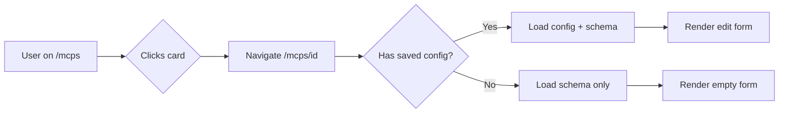
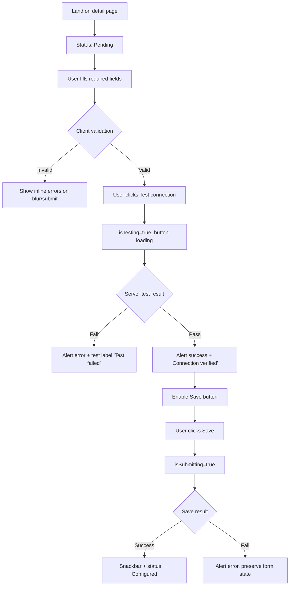

# MCP Configuration Management — UI Design Specification

**Feature:** MCP Configuration Management  
**Routes:** `/mcps` (list), `/mcps/[id]` (detail/configuration)  
**Design system:** The Synthetic Luminal (`.cursor/rules/design.md`)  
**Status:** Design handoff — ready for implementation

---

## 1. Design Rationale

### Problem

Users need to discover available MCP integrations, understand which are already configured for their workspace, and securely configure connection credentials through schema-driven forms — without leaving the vassembly atmospheric UI.

### Approach

Extend the existing MCP catalog page (`apps/web/app/mcps/`) rather than replacing it. The list page gains **status awareness** and **navigation**; a new detail page introduces **configuration** using patterns already proven in `AiIntegrationForm` and Settings.

### Design principles applied

| Principle | Application |
|-----------|-------------|
| Tonal stacking over borders | Section grouping via `surface-container` / `surface-container-high` backgrounds; ghost borders only on focus |
| Primary accent restraint | Blue (`primary`) for CTAs and focus; Sage (`secondary`) reserved for connection-success states |
| Editorial hierarchy | Space Grotesk page titles; Inter for form labels and body |
| Secure-by-default UX | Masked secrets, edit-mode placeholder semantics, test-before-save gate |
| Progressive disclosure | Configured MCPs surfaced first; full catalog below with existing search/filter |

### Reference implementations

| Pattern | Source |
|---------|--------|
| List page shell | `McpsPageView.tsx`, `McpListContainer.tsx` |
| Configuration form + test connection | `AiIntegrationForm.tsx`, `TestConnectionButton.tsx` |
| Section card layout | `SettingsSections.module.scss` (`.sectionCard`, `.formStack`) |
| Password show/hide | `SecurityControlledPasswordField.tsx` |
| Auth + loading wrapper | `page.tsx` + `ProtectedAuthRoute` + skeleton |
| Form components | `@vassembly/ui-system-design/text-field`, `ui-dropdown`, `ui-checkbox`, `ui-button`, `ui-alert`, `ui-tag`, `ui-loader` |

---

## 2. Page Specifications

### 2.1 MCP List Page (`/mcps`)

#### Layout wireframe (desktop)

```
┌─────────────────────────────────────────────────────────────────────────────┐
│  [Drawer Nav]                                                               │
├─────────────────────────────────────────────────────────────────────────────┤
│                                                                             │
│  MCPs                              ← Text h1, Space Grotesk                 │
│  Connect and manage Model Context Protocol integrations.  ← body2 secondary │
│                                                                             │
│  ┌─ YOUR MCPs ───────────────────────────────────────────────────────────┐  │
│  │  (label-sm, primary, tracked caps — "technical readout" header)       │  │
│  │                                                                       │  │
│  │  ┌──────────────┐  ┌──────────────┐  ┌──────────────┐                │  │
│  │  │ [icon] Name  │  │ [icon] Name  │  │ [icon] Name  │                │  │
│  │  │ [Configured] │  │ [Configured] │  │ [Pending]    │                │  │
│  │  │ Description… │  │ Description… │  │ Description… │                │  │
│  │  │ [tag][tag]   │  │ [tag]        │  │ [tag][tag]   │                │  │
│  │  └──────────────┘  └──────────────┘  └──────────────┘                │  │
│  │                                                                       │  │
│  │  (empty: "No MCPs configured yet. Browse below to get started.")      │  │
│  └───────────────────────────────────────────────────────────────────────┘  │
│                                                                             │
│  ┌─ DISCOVER ────────────────────────────────────────────────────────────┐  │
│  │  [🔍 Search MCPs…………………] [Tag filter ▾]  [Reset]                     │  │
│  │                                                                       │  │
│  │  ┌──────────────┐  ┌──────────────┐  ┌──────────────┐  ┌───────────┐  │  │
│  │  │ [icon] Name  │  │ [icon] Name  │  │ [icon] Name  │  │ …         │  │  │
│  │  │ [Pending]    │  │ [Configured] │  │ [Pending]    │  │           │  │  │
│  │  │ Description… │  │ Description… │  │ Description… │  │           │  │  │
│  │  │ [tag][tag]   │  │ [tag]        │  │              │  │           │  │  │
│  │  │ Docs · Repo  │  │ Docs         │  │ Docs · Repo  │  │           │  │  │
│  │  └──────────────┘  └──────────────┘  └──────────────┘  └───────────┘  │  │
│  │                                                                       │  │
│  │  Showing 1–20 of 48 total                        [◀ 1 2 3 ▶]         │  │
│  └───────────────────────────────────────────────────────────────────────┘  │
│                                                                             │
└─────────────────────────────────────────────────────────────────────────────┘
```

#### Layout wireframe (mobile)

```
┌──────────────────────────┐
│ MCPs                     │
│ Subtitle                 │
│                          │
│ YOUR MCPs                │
│ ┌──────────────────────┐ │
│ │ [icon] Name          │ │
│ │ [Configured]         │ │
│ │ Description (2 lines)│ │
│ └──────────────────────┘ │
│                          │
│ DISCOVER                 │
│ [Search…………………]          │
│ [Tag filter ▾]           │
│ ┌──────────────────────┐ │
│ │ card (full width)    │ │
│ └──────────────────────┘ │
│ Showing 1–20 of 48       │
│ [Pagination]             │
└──────────────────────────┘
```

#### Visual specifications

| Element | Token / component | Notes |
|---------|-------------------|-------|
| Page stack | `.pageStack`, `gap: $spacing-6` | Matches existing `McpsPageView` |
| Section container | `background: $color-surface-container-low`, `padding: $spacing-6`, `border-radius: $border-radius-lg` | Tonal nesting — no visible border |
| Section label | `Text variant="label-sm"`, `color: $color-primary`, `letter-spacing: +10%`, uppercase | "YOUR MCPs", "DISCOVER" |
| Card grid | `repeat(auto-fill, minmax(18rem, 1fr))` → single column on mobile | Reuse `McpListContainer` grid |
| Configured card elevation | `background: $color-surface-container-high` | Subtle lift vs. discover cards |
| Configured card accent | Left edge ambient glow: `box-shadow: -3px 0 12px rgba($color-primary, 0.15)` | Replaces hard border highlight |
| Card hover | `transition: 300ms cubic-bezier(0.22, 1, 0.36, 1)`; tonal shift + primary ghost border at 15% opacity | Clickable affordance |
| Card cursor | `cursor: pointer` on entire card; external links stop propagation | Extend `McpListItem` |

#### Section behavior

**YOUR MCPs**
- Shows all user-configured MCPs (status = `configured` or `pending`).
- Not affected by search/filter in Discover section.
- Sorted: `configured` first, then `pending`, then alphabetical by name.
- Max 6 visible; "View all configured" link if more (scrolls to matching items in Discover with filter pre-applied).

**DISCOVER**
- All MCPs with existing search (300ms debounce), tag filter, pagination (page size 20).
- Configured MCPs also appear here with their status badge.
- Default sort: unconfigured first, then alphabetical.

#### Navigation

- Entire card is a `<button>` or `<a href="/mcps/{id}">` wrapping card content.
- Documentation / Repository links remain `<a target="_blank">` with `stopPropagation`.
- Keyboard: card is focusable; Enter/Space navigates to detail.

---

### 2.2 MCP Detail / Configuration Page (`/mcps/[id]`)

#### Layout wireframe (desktop)

```
┌─────────────────────────────────────────────────────────────────────────────┐
│  MCPs  ›  MongoDB Atlas                    ← Breadcrumbs                    │
│                                                                             │
│  ┌─ HEADER CARD (surface-container-high) ──────────────────────────────┐  │
│  │  [48×48 icon]   MongoDB Atlas              [● Configured]  status pill │  │
│  │                 Connect your Atlas cluster for natural language queries │  │
│  │                 [database] [cloud] [official]   ← tags               │  │
│  │                 Documentation · Repository         ← external links    │  │
│  └───────────────────────────────────────────────────────────────────────┘  │
│                                                                             │
│  ┌─ CONFIGURATION (sectionCard) ─────────────────────────────────────────┐│
│  │  Configuration                          ← Text h2                     ││
│  │  Enter the credentials required to connect this MCP to your workspace.││
│  │                                                                         ││
│  │  Cluster Name *                                                         ││
│  │  ┌─────────────────────────────────────────────────────────────────┐   ││
│  │  │ my-production-cluster                                            │   ││
│  │  └─────────────────────────────────────────────────────────────────┘   ││
│  │                                                                         ││
│  │  API Key *                                                              ││
│  │  ┌────────────────────────────────────────────────────────── [Show] ┐  ││
│  │  │ ••••••••••••••••                                                  │  ││
│  │  └─────────────────────────────────────────────────────────────────┘   ││
│  │  Leave blank to keep the existing key.        ← edit mode only        ││
│  │                                                                         ││
│  │  Region *                                                               ││
│  │  ┌─────────────────────────────────────────────────────────────────┐   ││
│  │  │ US East (N. Virginia)                                        ▾  │   ││
│  │  └─────────────────────────────────────────────────────────────────┘   ││
│  │                                                                         ││
│  │  ☐ Enable read-only mode                                               ││
│  │                                                                         ││
│  │  ┌──────────────────┐  Connection verified ✓   ← after successful test ││
│  │  │ Test connection  │                                                   ││
│  │  └──────────────────┘                                                   ││
│  │                                                                         ││
│  │  [Alert: Connection failed — Invalid API key]  ← inline on test fail  ││
│  │                                                                         ││
│  │  ─ ─ ─ ─ ─ ─ ─ ─ ─ ─ ─ ─ ─ ─ ─ ─ ─ ─ ─ ─ ─ ─ ─ ─ ─ ─ ─ ─ ─ ─ ─ ─   ││
│  │                                                                         ││
│  │  [Save configuration]    [Cancel]                                       ││
│  │   primary contained       text/ghost                                   ││
│  └───────────────────────────────────────────────────────────────────────┘│
│                                                                             │
└─────────────────────────────────────────────────────────────────────────────┘
```

#### Layout wireframe (mobile)

- Breadcrumbs collapse to back link: `← MCPs`
- Header card stacks vertically (icon above name)
- Form fields full width (`isFullWidth` on all inputs)
- Action buttons stack: Save (full width), Cancel (full width, secondary)

#### Page states

| State | UI |
|-------|-----|
| Loading | `McpDetailSkeleton` — header placeholder + 4 field skeletons |
| Not found | Centered message + "Back to MCPs" tertiary button |
| Error (fetch) | `Alert variant="error"` + retry button |
| Success (new) | Empty form, status pill "Pending" |
| Success (edit) | Pre-filled form from saved config, status pill reflects saved state |

#### Max content width

- Form column: `max-width: 52rem` (matches Settings layout split)
- Centered in main content area with `$spacing-6` horizontal padding on mobile

---

## 3. Form Field Component Specifications

Dynamic form renders from a server-provided `configurationSchema` array. A single `McpConfigField` dispatcher maps schema `type` → component.

### 3.1 Schema → component mapping

| Schema `type` | Component | Props |
|---------------|-----------|-------|
| `text` | `TextField` | `type="text"`, `isFullWidth` |
| `password` / `secret` | `McpSecretField` | Wraps `TextField type="password"` + Show/Hide trailing action |
| `url` | `TextField` | `type="url"`, URL format validation |
| `number` | `TextField` | `type="number"`, min/max from schema |
| `select` / `enum` | `Dropdown` | `options` from schema `options[]` |
| `boolean` | `Checkbox` | `label`, `description` from schema |
| `textarea` | `TextField` | `isMultiline`, `minRows={3}` |

### 3.2 Field anatomy

```
Label *                    ← Text variant="label"; asterisk via schema.required
┌────────────────────────────────────────────┐
│  [leading icon?]  value          [action] │  ← surface-container-highest
└────────────────────────────────────────────┘
Helper or error text       ← Text variant="caption"
```

### 3.3 Required field indicator

- Append ` *` to label text when `schema.required === true`.
- Asterisk: `Text variant="caption"`, `aria-hidden="true"` on span; field has `aria-required="true"`.
- Do not rely on color alone.

### 3.4 Validation states

| State | Trigger | Visual |
|-------|---------|--------|
| Default | Untouched | `surface-container-highest` background, no border |
| Focus | `onFocus` | Ghost border: `outline-variant` at 40% opacity + subtle primary outer glow (`0 0 0 3px rgba(primary, 0.12)`) |
| Error | `touched && error` | `stateError` on input wrapper; caption in `$color-error`; faint `error_container` background wash |
| Success | Post-test field-level pass (optional) | `isSuccess` on `TextField` — use sparingly, only after connection test validates specific field |
| Disabled | `isSubmitting \|\| isTesting` | Reduced opacity, `cursor: not-allowed` |

### 3.5 Error UI patterns

**Inline field error** (preferred for schema validation):
```
API Key *
┌──────────────────────────────────┐
│                                  │  ← error wash background
└──────────────────────────────────┘
API key is required.               ← caption, error color
```

**Section-level alert** (connection / server errors):
```
┌─────────────────────────────────────────────────────────┐
│ ⚠  Connection failed — check your API key and region. │  ← Alert variant="error"
└─────────────────────────────────────────────────────────┘
```

**Toast** (save success):
- `Snackbar` — "MCP configuration saved" — auto-dismiss 4s

### 3.6 `McpSecretField` specification

Reuse `SecurityControlledPasswordField` pattern:

| Prop | Value |
|------|-------|
| Default type | `password` (masked) |
| Trailing action | Ghost "Show" / "Hide" text button |
| Edit mode helper | `"Leave blank to keep the existing key."` when field is optional on update |
| Autocomplete | `autocomplete="off"` or schema-driven `new-password` |
| Never render | Saved secret value — only empty field with helper text |

### 3.7 Dynamic form layout

- `formStack`: `flex column`, `gap: $spacing-component-gap-md`
- Group related fields with `gap: $spacing-4` and optional `label-sm` group header from schema `group` property
- Field order: exactly as schema array order (server controls priority)

---

## 4. Interaction Flows

### 4.1 List → Detail



### 4.2 Configure new MCP



### 4.3 Edit existing configuration

1. Form pre-populated with non-secret values.
2. Secret fields empty with helper: "Leave blank to keep the existing key."
3. Status pill shows current state (`Configured` or `Pending`).
4. Test connection uses current form values (merged with stored secrets server-side when fields blank).
5. Save enabled when: form is dirty AND (test passed OR user re-tested after changes).
6. Cancel → if dirty, confirmation modal; else `router.push('/mcps')`.

### 4.4 Cancel / unsaved changes

```
┌─────────────────────────────────────────────┐
│  Discard changes?                           │
│                                             │
│  You have unsaved configuration changes.    │
│  Leaving now will lose your progress.      │
│                                             │
│  [Keep editing]          [Discard]          │
└─────────────────────────────────────────────┘
```

- Modal: `@vassembly/ui-system-design/modal`
- Primary: "Keep editing" (closes modal)
- Destructive secondary: "Discard" (navigate away)

### 4.5 Save gate logic (match AiIntegrationForm)

| Button | Enabled when | Loading when |
|--------|--------------|--------------|
| Test connection | Required fields valid (client-side) | `isTesting` |
| Save configuration | `testResult.success === true` AND not testing/submitting | `isSubmitting` |
| Cancel | Always (unless submitting) | — |

**Exception:** If MCP schema has zero connection-testable fields (metadata-only), skip test gate — Save enabled when client validation passes. Show helper: "No connection test required for this MCP."

---

## 5. Status Indicator Designs

### 5.1 List card status badge

Use `@vassembly/ui-system-design/tag`:

| Status | Tag variant | Label | Icon (optional) |
|--------|-------------|-------|-----------------|
| Configured | `success` | Configured | — |
| Pending | `warning` | Pending | — |

Placement: top-right of card header row, opposite icon+name.

```
[icon] MongoDB Atlas          [Configured]
```

### 5.2 Detail page status pill

Larger status indicator in header card — not a Tag, a dedicated pill:

| Status | Background | Text | Dot |
|--------|------------|------|-----|
| Configured | `secondary-container` at 30% | `$color-success-300` | Filled sage dot, subtle pulse on first render |
| Pending | `surface-variant` at 40% | `$color-text-secondary` | Hollow outline dot |
| Error (connection) | `error_container` at 20% | `$color-error-300` | — (only after failed save/test persists) |

```
● Configured     ← 8px dot + label-sm
○ Pending
```

### 5.3 Connection test result (inline)

Reuse `TestConnectionButton` pattern from `AiIntegrationForm`:

| Result | Inline label | Color token |
|--------|--------------|-------------|
| Idle | (hidden) | — |
| Testing | Button `isLoading` | — |
| Success | "Connection verified" | `$color-success-300` |
| Failure | "Test failed" | `$color-error-300` |

Plus `Alert` below row for detailed error message.

### 5.4 Save outcome

| Outcome | Feedback |
|---------|----------|
| Success | Snackbar + update header status pill to Configured |
| Failure | `Alert variant="error"` at top of form card |

---

## 6. Loading and Error States

### 6.1 List page

| Scenario | Component | Behavior |
|----------|-----------|----------|
| Initial load | `McpsSkeleton` | Existing skeleton — extend with section placeholders |
| YOUR MCPs loading | 3 card skeletons in configured section | `ui-skeleton` rectangles |
| Discover loading | `Loader` centered in grid area | Existing pattern |
| List fetch error | `Alert variant="error"` above toolbar | Retry button in alert action slot |
| Empty catalog | `McpListEmptyState variant="no-mcps"` | Unchanged |
| No search results | `McpListEmptyState variant="no-results"` | Unchanged |
| Empty configured section | Text `body2` secondary, centered | "No MCPs configured yet. Browse below to get started." |

### 6.2 Detail page

| Scenario | UI |
|----------|-----|
| Page load | `McpDetailSkeleton`: breadcrumb bar + header block + 4 field skeletons + button skeleton |
| Schema fetch error | Full-page error card with "Back to MCPs" + "Retry" |
| Test connection | `TestConnectionButton` `isLoading`; form fields `isDisabled` |
| Save | Save button `isLoading`; all fields `isDisabled` |
| Test timeout | Alert: "Connection timed out. Check your network and endpoint URL." |

### 6.3 Skeleton specifications

```
McpDetailSkeleton
├── BreadcrumbSkeleton     (2 items, 120px + 80px wide bars)
├── HeaderSkeleton         (48px circle + 200px title bar + 2 tag bars)
├── FormSkeleton × 4       (label 80px + input full-width 40px height)
└── ActionsSkeleton        (120px button + 80px button)
```

Animation: subtle opacity pulse, 1.5s ease-in-out (match existing `McpsSkeleton`).

---

## 7. Security and UX Recommendations

### 7.1 Secret handling

| Rule | Implementation |
|------|----------------|
| Mask by default | `type="password"` on all secret schema fields |
| Show/hide toggle | Per-field, not global; resets to hidden on blur optional |
| Never echo secrets | API returns `hasApiKey: true` not the value; form shows empty |
| Edit semantics | Blank secret field = "keep existing" (document in helper text) |
| Clipboard | No copy-to-clipboard for secret fields |
| Logging | Never log field values client-side |

### 7.2 Confirmation flows

| Action | Confirm? |
|--------|----------|
| Cancel with dirty form | Yes — discard modal |
| Navigate away (browser back) | Yes — `beforeunload` + in-app guard |
| Save | No — test connection is the validation gate |
| Overwrite configured MCP | No separate confirm — save is explicit action |

### 7.3 Trust signals

- Lock icon (`ui-icons`) in section header: "Credentials are encrypted at rest."
- External doc links open in new tab with `rel="noopener noreferrer"`.
- Test connection label clarifies: "Validates credentials without saving."

### 7.4 Accessibility

| Requirement | Implementation |
|-------------|----------------|
| Focus order | Breadcrumbs → header links → form fields top-to-bottom → test → save → cancel |
| Error announcement | `aria-live="polite"` region for test/save alerts |
| Required fields | `aria-required`, visible asterisk, error text in `aria-describedby` |
| Status badges | `aria-label="Status: Configured"` on tag/pill |
| Loading | `aria-busy="true"` on form during test/save; `Loader ariaLabel` |
| Color contrast | Error/success text meets WCAG AA on dark surfaces |

### 7.5 Responsive breakpoints

| Breakpoint | Behavior |
|------------|----------|
| `< 768px` (`$media-mobile-only`) | Single column grid; stacked actions; back link replaces breadcrumbs |
| `≥ 768px` | Two+ column card grid; horizontal action row |
| `≥ 1024px` (`$media-desktop`) | Max-width form column centered |

---

## 8. Component Architecture (Developer Handoff)

### 8.1 New files (suggested)

```
apps/web/app/mcps/
├── [id]/
│   ├── page.tsx
│   ├── McpDetailPageView.tsx
│   ├── McpDetailPageView.module.scss
│   └── _components/
│       ├── McpDetailHeader/
│       ├── McpConfigForm/
│       ├── McpConfigField/
│       ├── McpSecretField/
│       ├── McpDetailSkeleton/
│       └── McpDiscardChangesModal/
└── _components/
    ├── McpListItem/          ← extend: status badge, click nav, configured variant
    ├── McpConfiguredSection/ ← new
    └── McpStatusTag/         ← new (thin wrapper over ui-tag)
```

### 8.2 `McpListItem` changes

| Addition | Detail |
|----------|--------|
| `configurationStatus` prop | `'configured' \| 'pending' \| undefined` |
| `onClick` / `href` | Navigate to `/mcps/${mcp.id}` |
| `variant` prop | `'configured' \| 'default'` — applies elevated surface + glow |
| `McpStatusTag` | Renders configured/pending tag |

### 8.3 `McpConfigForm` props (mirror AiIntegrationForm)

```typescript
interface McpConfigFormProps {
  mcpName: string;
  schema: McpConfigFieldSchema[];
  values: Record<string, unknown>;
  errors: Record<string, string>;
  touched: Record<string, boolean>;
  isSubmitting: boolean;
  isTesting: boolean;
  testResult?: TestConnectionResult;
  isEditing: boolean;
  onChange: (field: string, value: unknown) => void;
  onBlur: (field: string) => void;
  onSubmit: (event: FormEvent) => void;
  onTest: () => void;
  onCancel: () => void;
}
```

### 8.4 Styling conventions

- Import tokens: `@import '@vassembly/ui-system-design/theme/src/tokens/index.scss'`
- CSS Modules per component
- Reuse classes: `.sectionCard`, `.formStack`, `.toolbarRow` from Settings where applicable (extract to shared `ui-page-layout` if duplication grows)
- Animations: `300ms–500ms`, `cubic-bezier(0.22, 1, 0.36, 1)`
- Max two accent colors per screen: primary for CTAs, secondary for success states

### 8.5 API hooks (ui/api-hooks)

| Hook | Transport | Purpose |
|------|-----------|---------|
| `useMcp` | GraphQL | Single MCP + schema + config metadata |
| `useMcps` | GraphQL | Extend list item with `configurationStatus` |
| `useTestMcpConnection` | REST POST | Test connection |
| `useSaveMcpConfiguration` | REST POST/PATCH | Save config |

### 8.6 Design system alignment notes

The existing `McpListItem` uses `border: 1px solid $color-outline`. New work should **migrate toward tonal stacking** per The Synthetic Luminal:

- **Now:** Configured cards use `surface-container-high` background differentiation.
- **Target:** Remove visible borders on rest state; use tonal shift + ghost border on hover/focus only.
- Do not introduce additional accent colors beyond primary (blue) and secondary (sage) on these screens.

---

## 9. Component Variations Summary

### McpListItem card states

| State | Visual |
|-------|--------|
| Default | `surface-container` background |
| Configured variant | `surface-container-high` + left glow accent |
| Hover | Primary ghost border + ambient shadow |
| Focus-visible | `outline: 2px solid $color-primary`, `outline-offset: 2px` |
| Loading | Skeleton placeholder |

### Form field states

| State | Visual |
|-------|--------|
| Empty | Placeholder text in `$color-text-secondary` |
| Filled | User value, primary text color |
| Error | Error wash + caption |
| Disabled | 50% opacity during async ops |
| Secret masked | `••••••••` bullets |

### Buttons

| Button | Variant | Notes |
|--------|---------|-------|
| Test connection | `outlined` | Left of result label |
| Save configuration | `contained` | Primary gradient CTA |
| Cancel | `text` | Tertiary — no fill |
| Discard (modal) | `outlined` + error tone | Destructive confirm |
| Keep editing (modal) | `contained` | Default focus |

---

## 10. Open Questions for Product/Engineering

1. **URL param:** Use `mcp.id` or `mcp.slug` in route? Recommend `id` for stability; slug as optional alias redirect.
2. **Configured section cap:** Show all configured or paginate after 6?
3. **Test gate bypass:** Allow save without test for admin override?
4. **Delete configuration:** Out of scope for v1? If added later, use `dangerPanel` pattern from Settings.

---

*Document version: 1.0 — June 2026*
