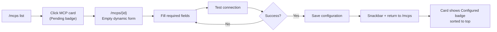

# Product Requirements Document: MCP Configuration Management

**Document status:** Draft for design & engineering handoff  
**Last updated:** 2026-06-08  
**Related:** [MCP Listing Page Architecture](../mcp-listing-page/architecture.md) (read-only catalog — prerequisite)  
**Primary routes:** `/mcps` (enhanced list), `/mcps/{id}` (configuration detail)

---

## 1. Feature Overview & Value Proposition

### 1.1 Feature statement

Enable authenticated users to **configure MCP integrations with their own credentials and settings**. Each MCP in the global catalog defines a **configuration schema** (required fields and field types). Users navigate from the MCP list to a detail page, complete a **dynamic form**, **test the connection**, and **save** a per-user configuration. Configurations are **private to each user** — not shared across a team or organization.

### 1.2 Value proposition

| Stakeholder | Value |
|-------------|-------|
| **End user** | Self-serve setup of MCP tools without admin intervention; clear visibility of what is configured vs pending |
| **Platform** | Foundation for agents/tasks to invoke user-scoped MCP connections at runtime |
| **Engineering** | Extends existing MCP catalog (`/mcps`) with user-owned config layer; follows established GraphQL-read / REST-command conventions |

### 1.3 Relationship to existing MCP listing

The MCP listing page (shipped) is a **read-only discovery catalog**. This feature adds:

- Per-user configuration state layered on top of catalog entries
- Clickable list items leading to a configuration detail page
- Status badges (`Configured` / `Pending`) on the list
- REST commands for save, update, delete, and test-connection

---

## 2. Project Overview & Scope

### 2.1 Feature name

**MCP Configuration Management** (MVP)

### 2.2 Target audience

- **Authenticated workspace users** who connect MCP tools to their personal Vassembly account
- **QA engineers** validating configuration flows, validation, and error states
- **Designers** defining form layouts, status badges, and empty/error states

### 2.3 In-scope (MVP)

| Area | Deliverable |
|------|-------------|
| **List page (`/mcps`)** | Status badges on each MCP card; configured MCPs sorted to top; cards navigate to detail page |
| **Detail page (`/mcps/{id}`)** | MCP metadata header, dynamic configuration form, Test Connection, Save, optional Clear/Remove configuration |
| **Configuration schema** | Catalog entries include a flat field schema (no nesting, no conditionals) |
| **Field types** | `text`, `password`, `select`, `checkbox` |
| **Validation** | Required fields, format validation (e.g., URL, email) as defined per field in schema |
| **Test connection** | Explicit user action before save is permitted; save blocked until successful test in current session |
| **Per-user storage** | New persistence for user ↔ MCP configuration records |
| **API — reads** | GraphQL queries for catalog + user configuration status |
| **API — commands** | REST endpoints for create/update/delete configuration and test connection |
| **Security (product level)** | Sensitive fields treated as secrets in UX (masked password inputs, never displayed after save); encryption mechanism deferred to architecture |

### 2.4 Out-of-scope (MVP)

| Item | Notes |
|------|-------|
| Team/shared configurations | One config per user per MCP only |
| Schema versioning | Single schema per MCP; no migration of existing user configs when schema changes |
| Conditional or nested fields | No `showIf`, field groups, or arrays of objects |
| Advanced field types | No file upload, JSON editor, multi-select, date picker |
| Admin MCP catalog CRUD | Catalog remains seed-driven; no admin UI to edit MCP definitions |
| Runtime MCP invocation | Agents/tasks consuming configs — separate feature |
| OAuth / SSO connection flows | Manual credential entry only |
| Connection health monitoring | No background re-test or alerting |
| Audit log of configuration changes | Not required in MVP |
| Bulk import/export of configurations | Not required |
| Credential encryption implementation details | Architecture phase deliverable |

---

## 3. User Experience & Logic

### 3.1 Configuration schema (catalog-level)

Each MCP catalog entry includes a **flat list of fields** that drive the dynamic form.

**Supported field types:**

| Type | UI control | Validation capabilities |
|------|------------|-------------------------|
| `text` | Single-line text input | `required`, `minLength`, `maxLength`, `pattern` (regex), `format` (`url`, `email`) |
| `password` | Masked input with show/hide toggle | `required`, `minLength`, `maxLength` |
| `select` | Dropdown | `required`, `options` (static list of `{ value, label }`) |
| `checkbox` | Single checkbox | Optional `required: true` (must be checked) |

**Schema field properties (per field):**

| Property | Required | Description |
|----------|----------|-------------|
| `key` | Yes | Stable identifier stored with user config |
| `label` | Yes | User-facing label |
| `type` | Yes | One of: `text`, `password`, `select`, `checkbox` |
| `description` | No | Helper text below field |
| `required` | No | Default `false` |
| `defaultValue` | No | Pre-filled value for new configurations |
| `placeholder` | No | Input placeholder (text/password) |
| `options` | For `select` | Non-empty array of options |
| `format` | No | `url` or `email` (text fields only) |
| `pattern` | No | Regex string for custom format validation |
| `minLength` / `maxLength` | No | String length bounds |

**Example schema (Gmail MCP — illustrative):**

```json
{
  "fields": [
    { "key": "clientId", "label": "Client ID", "type": "text", "required": true },
    { "key": "clientSecret", "label": "Client Secret", "type": "password", "required": true },
    { "key": "scopes", "label": "Access Level", "type": "select", "required": true, "options": [
      { "value": "readonly", "label": "Read only" },
      { "value": "full", "label": "Full access" }
    ]},
    { "key": "acceptTerms", "label": "I accept the provider terms", "type": "checkbox", "required": true }
  ]
}
```

### 3.2 List page enhancements (`/mcps`)

**Sorting:**

1. **Configured** MCPs first (alphabetical by name within group)
2. **Pending** MCPs second (alphabetical by name within group)
3. Within active search/tag filters, sort order applies to filtered results only

**Status badge:**

| Status | Condition | Badge label | Visual intent |
|--------|-----------|-------------|---------------|
| `Configured` | User has a saved configuration for this MCP | `Configured` | Success/neutral-positive |
| `Pending` | User has no saved configuration | `Pending` | Neutral/warning |

**Card interaction:**

- Entire card is clickable → navigates to `/mcps/{id}` (MCP catalog `id`, not `slug`)
- External Documentation/Repository links remain separate click targets (do not trigger navigation)
- Keyboard: card focusable; Enter/Space navigates to detail

**Empty/filtered states:** Unchanged from listing page — only badge and sort behavior are new.

### 3.3 Detail page (`/mcps/{id}`)

**Page sections:**

1. **Header** — MCP icon, name, description, tags, documentation/repository links
2. **Configuration form** — dynamically rendered from MCP schema
3. **Action bar** — Test Connection, Save (primary), Clear configuration (secondary, only when configured)

**Form behavior:**

| Rule | Behavior |
|------|----------|
| New configuration | All fields empty except `defaultValue` from schema |
| Existing configuration | Non-secret fields pre-filled; password fields empty with hint "Leave blank to keep existing value" |
| Field-level validation | On blur and on submit/test; inline error below field |
| Test Connection | Enabled when form passes client-side validation |
| Save | Enabled only after **successful Test Connection in the current page session** |
| Save after edit | Changing any field invalidates prior test result; user must re-test before save |
| Clear configuration | Confirmation dialog; removes user's saved config; returns status to Pending |

**Test Connection result display:**

| Result | UI |
|--------|-----|
| Success | Inline success message: "Connection successful" |
| Failure | Inline error with user-safe message from API (no stack traces) |
| In progress | Test button shows loading state; form fields disabled during test |

**Save result:**

| Result | UI |
|--------|-----|
| Success | Snackbar: "MCP configured successfully"; navigate back to `/mcps` |
| Failure | Snackbar with error message; remain on page with form state preserved |

### 3.4 Content & messaging

| Context | Copy |
|---------|------|
| Page title (detail) | `{MCP name}` |
| Section heading | `Configuration` |
| Test button | `Test connection` |
| Save button | `Save configuration` |
| Clear button | `Remove configuration` |
| Clear confirm title | `Remove configuration?` |
| Clear confirm body | `This will delete your saved credentials for {MCP name}. You can configure it again later.` |
| Clear confirm actions | `Cancel` / `Remove` |
| Test-before-save warning | `Test the connection before saving` |
| Password retain hint | `Leave blank to keep existing value` |
| Configured badge | `Configured` |
| Pending badge | `Pending` |
| Load error (detail) | `Unable to load MCP` |
| Not found | `MCP not found` |
| Unauthorized | Redirect to login with `returnUrl` |

---

## 4. User Stories

### 4.1 Primary user stories

#### US-1: View MCP configuration status on list

**As a** logged-in user,  
**I want** to see which MCPs I have configured vs pending on the list page,  
**So that** I can quickly identify what still needs setup.

**Acceptance criteria:**

- [ ] Each MCP card displays a status badge: `Configured` or `Pending`
- [ ] Configured MCPs appear above Pending MCPs in the default list order
- [ ] Status reflects the current user's configuration only (not other users)
- [ ] Status updates after returning from a successful save or removal
- [ ] Search and tag filters preserve configured-first sort within results

---

#### US-2: Navigate to MCP configuration detail

**As a** logged-in user,  
**I want** to click an MCP card to open its configuration page,  
**So that** I can set up or update my credentials.

**Acceptance criteria:**

- [ ] Clicking a card navigates to `/mcps/{id}`
- [ ] Detail page shows MCP name, description, icon, tags, and external links
- [ ] Invalid or unknown `id` shows a not-found state with link back to `/mcps`
- [ ] Unauthenticated access redirects to login with `returnUrl=/mcps/{id}`
- [ ] Documentation and Repository links open in new tab without navigating away

---

#### US-3: Configure an MCP using a dynamic form

**As a** logged-in user,  
**I want** the configuration form to match the MCP's required fields,  
**So that** I only provide relevant credentials and settings.

**Acceptance criteria:**

- [ ] Form fields render from the MCP's schema definition
- [ ] Supported types render correctly: text, password (masked), select, checkbox
- [ ] Required fields show a required indicator
- [ ] Field `description` renders as helper text when present
- [ ] `defaultValue` pre-fills fields on first-time configuration
- [ ] Validation errors appear inline for required, format, length, and pattern rules
- [ ] No conditional fields or nested structures appear in MVP

---

#### US-4: Test connection before saving

**As a** logged-in user,  
**I want** to verify my credentials work before saving,  
**So that** I do not store invalid configurations.

**Acceptance criteria:**

- [ ] `Test connection` button is visible on the detail page
- [ ] Test is blocked when client-side validation fails (inline errors shown)
- [ ] Successful test shows "Connection successful" inline message
- [ ] Failed test shows a user-readable error message inline
- [ ] Test button shows loading state during request; duplicate clicks prevented
- [ ] Save remains disabled until a successful test in the current session
- [ ] Editing any field after a successful test clears the test success state and disables Save until re-test

---

#### US-5: Save per-user MCP configuration

**As a** logged-in user,  
**I want** to save my MCP configuration securely,  
**So that** the platform can use my credentials for future MCP operations.

**Acceptance criteria:**

- [ ] Save succeeds only after successful test in current session
- [ ] Save persists configuration scoped to `userId` + `mcpId`
- [ ] Attempting save without prior successful test shows warning: "Test the connection before saving"
- [ ] After successful save, user sees success snackbar and returns to `/mcps`
- [ ] MCP appears as `Configured` on list page
- [ ] Re-opening detail page shows saved non-secret values; password fields empty with retain hint
- [ ] Updating config with blank password retains previous secret value
- [ ] Each user has at most one configuration per MCP

---

#### US-6: Remove MCP configuration

**As a** logged-in user,  
**I want** to remove my saved MCP configuration,  
**So that** I can revoke access or start over.

**Acceptance criteria:**

- [ ] `Remove configuration` visible only when user has an existing configuration
- [ ] Confirmation dialog required before deletion
- [ ] After removal, configuration is deleted for that user only
- [ ] User redirected or remains on page with empty form; list status returns to `Pending`
- [ ] Removal does not affect other users' configurations for the same MCP

---

### 4.2 Secondary user stories

#### US-7: Update existing configuration

**As a** logged-in user with an existing MCP configuration,  
**I want** to edit and re-save my settings,  
**So that** I can rotate credentials or change options.

**Acceptance criteria:**

- [ ] Detail page loads existing non-secret field values
- [ ] Password fields are empty on load; retain hint displayed
- [ ] User must re-test after any change before save
- [ ] Successful update shows success snackbar
- [ ] `lastUpdatedAt` (or equivalent) updated server-side

---

#### US-8: View configuration schema metadata on detail page

**As a** logged-in user,  
**I want** to see MCP documentation links alongside the form,  
**So that** I can find official setup instructions.

**Acceptance criteria:**

- [ ] Documentation and Repository links visible in page header when defined on catalog entry
- [ ] Links open externally in new tab

---

### 4.3 Edge-case user stories

#### US-9: Handle MCP with no configuration schema

**As a** logged-in user,  
**I want** clear feedback when an MCP has no configurable fields,  
**So that** I am not presented with a broken form.

**Acceptance criteria:**

- [ ] If schema has zero fields, show message: "This MCP does not require configuration"
- [ ] Test and Save buttons hidden when no fields
- [ ] Status remains `Pending` (not configurable in MVP)

---

#### US-10: Session interruption during configuration

**As a** logged-in user,  
**I want** graceful handling when my session expires mid-configuration,  
**So that** I understand what happened and can recover.

**Acceptance criteria:**

- [ ] API 401 on test/save redirects to login with `returnUrl`
- [ ] Unsaved form data is not persisted across login redirect (MVP)

---

## 5. User Flows

### 5.1 Happy path: First-time configuration



**Steps:**

1. User opens `/mcps` — sees MCPs with `Pending` badges
2. User clicks target MCP card
3. Detail page loads schema-driven form (defaults applied)
4. User completes all required fields
5. User clicks **Test connection** → success message shown
6. **Save configuration** becomes enabled
7. User clicks Save → success snackbar → redirected to `/mcps`
8. MCP card shows `Configured` badge and appears in top section

### 5.2 Update existing configuration

1. User opens `/mcps` — configured MCP at top with `Configured` badge
2. User clicks card → form loads with saved non-secret values
3. User changes one or more fields
4. Prior test result cleared; Save disabled
5. User clicks **Test connection** → success
6. User clicks **Save configuration** → updated config persisted
7. Return to list; status remains `Configured`

### 5.3 Remove configuration

1. User opens configured MCP detail page
2. User clicks **Remove configuration**
3. Confirmation dialog → user confirms
4. Configuration deleted; form resets to empty
5. User navigates to `/mcps` — MCP shows `Pending`, sorted below configured items

### 5.4 Failed test connection

1. User fills form with invalid credentials
2. User clicks **Test connection**
3. Inline error displayed (e.g., "Authentication failed")
4. Save remains disabled
5. User corrects fields and re-tests

---

## 6. Use Cases (Gherkin Syntax)

### 6.1 Primary use cases

```gherkin
Scenario: User views configured and pending MCPs on list page
  Given I am logged in
  And I have a saved configuration for "Gmail MCP"
  And I have no configuration for "Brave Search MCP"
  When I navigate to "/mcps"
  Then I see "Gmail MCP" with a "Configured" badge
  And I see "Brave Search MCP" with a "Pending" badge
  And "Gmail MCP" appears above "Brave Search MCP" in the list
```

```gherkin
Scenario: User configures an MCP for the first time
  Given I am logged in
  And I am on "/mcps/{gmailMcpId}"
  And the MCP schema defines required fields "Client ID" and "Client Secret"
  When I fill in valid values for all required fields
  And I click "Test connection"
  Then I see "Connection successful"
  And the "Save configuration" button becomes enabled
  When I click "Save configuration"
  Then I see a success message
  And I am redirected to "/mcps"
  And "Gmail MCP" shows a "Configured" badge
```

```gherkin
Scenario: User updates an existing MCP configuration
  Given I am logged in
  And I have a saved configuration for "Gmail MCP"
  When I navigate to "/mcps/{gmailMcpId}"
  Then I see my saved non-secret field values
  And password fields are empty with hint "Leave blank to keep existing value"
  When I change the "Client ID" field
  And I click "Test connection" successfully
  And I click "Save configuration"
  Then my configuration is updated
  And I see a success message
```

```gherkin
Scenario: User removes an MCP configuration
  Given I am logged in
  And I have a saved configuration for "Gmail MCP"
  When I navigate to "/mcps/{gmailMcpId}"
  And I click "Remove configuration"
  And I confirm the removal dialog
  Then my configuration is deleted
  And when I navigate to "/mcps" "Gmail MCP" shows a "Pending" badge
```

### 6.2 Secondary use cases

```gherkin
Scenario: User filters list while configured sort is active
  Given I am logged in
  And I have a saved configuration for "Gmail MCP"
  When I navigate to "/mcps"
  And I search for "Brave"
  Then only MCPs matching "Brave" are shown
  And configured-first sorting applies within the filtered results
```

```gherkin
Scenario: User opens documentation without leaving detail page
  Given I am logged in
  And I am on "/mcps/{gmailMcpId}"
  When I click the "Documentation" link
  Then the documentation opens in a new browser tab
  And I remain on the configuration page
```

---

## 7. Edge Cases & Error Handling (Gherkin Syntax)

### 7.1 Empty states

```gherkin
Scenario: MCP has no configuration schema fields
  Given I am logged in
  And the MCP has an empty configuration schema
  When I navigate to "/mcps/{mcpId}"
  Then I see "This MCP does not require configuration"
  And I do not see "Test connection" or "Save configuration" buttons
```

### 7.2 Validation rules

```gherkin
Scenario: Required field left empty on test
  Given I am logged in
  And I am on "/mcps/{mcpId}"
  And the schema marks "Client ID" as required
  When I leave "Client ID" empty
  And I click "Test connection"
  Then I see an inline error on "Client ID"
  And the connection test is not sent
```

```gherkin
Scenario: URL format validation fails
  Given I am logged in
  And the schema defines a text field "Webhook URL" with format "url"
  When I enter "not-a-url" in "Webhook URL"
  And I blur the field
  Then I see a format validation error on "Webhook URL"
```

```gherkin
Scenario: User attempts save without testing
  Given I am logged in
  And I have filled all required fields
  And I have not clicked "Test connection" successfully in this session
  When I attempt to save
  Then I see "Test the connection before saving"
  And the configuration is not saved
```

```gherkin
Scenario: User edits form after successful test
  Given I have successfully tested the connection in this session
  When I change any form field value
  Then the prior test success state is cleared
  And "Save configuration" becomes disabled
```

### 7.3 Interrupted flows

```gherkin
Scenario: Session expires during save
  Given I am logged in
  And I have successfully tested the connection
  And my session has expired
  When I click "Save configuration"
  Then I am redirected to login with returnUrl "/mcps/{mcpId}"
```

```gherkin
Scenario: Network loss during test connection
  Given I am logged in
  And I am on "/mcps/{mcpId}"
  When I click "Test connection"
  And the network request fails
  Then I see a user-friendly error message
  And I can retry the test when connectivity returns
```

### 7.4 System errors

```gherkin
Scenario: MCP catalog entry not found
  Given I am logged in
  When I navigate to "/mcps/non-existent-id"
  Then I see "MCP not found"
  And I can navigate back to "/mcps"
```

```gherkin
Scenario: Server error on save
  Given I am logged in
  And I have successfully tested the connection
  When I click "Save configuration"
  And the server returns a 500 error
  Then I see an error snackbar with a generic failure message
  And my unsaved form values remain on the page
```

```gherkin
Scenario: Connection test returns provider error
  Given I am logged in
  And I entered invalid credentials
  When I click "Test connection"
  Then I see an inline error with a provider-appropriate message
  And "Save configuration" remains disabled
```

```gherkin
Scenario: User attempts to access another user's configuration
  Given User A has a configuration for "Gmail MCP"
  And I am logged in as User B
  When I navigate to "/mcps/{gmailMcpId}"
  Then I see an empty form
  And the status for User B is "Pending"
```

---

## 8. API & Data Requirements (Product-Level)

> Transport and encryption details are for architecture; this section defines **what** the API must expose.

### 8.1 GraphQL queries (reads)

| Query | Purpose | Auth |
|-------|---------|------|
| `mcps` (enhanced) | List catalog with per-user `configurationStatus` (`configured` \| `pending`) | Required |
| `mcp` | Single catalog entry by `id` including `configSchema` | Required |
| `mcpConfiguration` | Current user's saved config for an MCP (non-secret values only; secrets masked/absent) | Required |

**List sort:** Server returns items; client applies configured-first sort OR server accepts `sortBy=configurationStatus` — architecture decision. Product requirement: configured-first ordering.

### 8.2 REST endpoints (commands)

| Endpoint | Method | Purpose |
|----------|--------|---------|
| `/api/mcps/{mcpId}/configuration` | `POST` | Create user configuration |
| `/api/mcps/{mcpId}/configuration` | `PATCH` | Update user configuration |
| `/api/mcps/{mcpId}/configuration` | `DELETE` | Remove user configuration |
| `/api/mcps/{mcpId}/configuration/test` | `POST` | Test connection (ephemeral body or saved config) |

**Command rules:**

- All endpoints require authenticated user
- User can only read/write/delete own configuration
- Test endpoint accepts full form payload (pre-save) or references saved config (post-save edit with unchanged secrets)
- Save rejected if connection test would fail (server-side enforcement mirrors AI integration pattern)

### 8.3 Data entities (product-level)

**User MCP configuration record:**

| Attribute | Description |
|-----------|-------------|
| `id` | Unique configuration record ID |
| `userId` | Owner (required) |
| `mcpId` | Reference to catalog MCP (required) |
| `fieldValues` | Key-value map matching schema field keys |
| `status` | `configured` (derived or stored) |
| `lastTestedAt` | Timestamp of last successful test |
| `createdAt` / `updatedAt` | Audit timestamps |

**Constraints:**

- Unique compound: one configuration per (`userId`, `mcpId`)
- Secret field values never returned in API responses after save

**Catalog extension:**

| Attribute | Description |
|-----------|-------------|
| `configSchema` | Flat field definitions (see §3.1) |

---

## 9. Non-Functional Requirements

### 9.1 Performance

| Interaction | Target |
|-------------|--------|
| List page load (with status) | ≤ 2s perceived on standard connection |
| Detail page load | ≤ 2s |
| Test connection | ≤ 15s with loading indicator; timeout shows friendly error |
| Save | ≤ 3s with button loading state |

### 9.2 Accessibility (a11y)

- All form fields have associated labels
- Error messages linked to inputs via `aria-describedby`
- Status badges include text labels (not color-only)
- Keyboard: Tab through form, activate Test/Save via Enter/Space
- Focus management on dialog open/close for removal confirmation

### 9.3 Platform specifics

- Web-only (Next.js App Router); responsive layout for tablet minimum
- Auth-gated routes consistent with existing `/mcps` listing

### 9.4 Persistence

- Configurations persist server-side per user
- Unsaved form state is **not** persisted across page refresh (MVP)
- After successful save, list and detail reflect persisted state on next fetch

### 9.5 Security (product requirements)

- Password-type fields always masked in UI
- Saved secrets never echoed in API responses or browser devtools payloads on read
- Per-user isolation enforced on all read/write/delete operations
- Encryption at rest: required but implementation deferred to architecture

---

## 10. Success Criteria & Metrics

### 10.1 MVP success criteria

| Criterion | Measure |
|-----------|---------|
| End-to-end configuration | User can configure at least one seed MCP (e.g., Gmail MCP) from list → detail → test → save |
| Status accuracy | List badges match actual per-user configuration state 100% after save/remove |
| Isolation | User A's configuration is invisible to User B |
| Test gate | Save impossible without successful test in session (client and server enforced) |
| Validation | All schema validation rules enforced before test/save |
| No regressions | Existing `/mcps` search, tag filter, and pagination continue to work |

### 10.2 Metrics (post-launch observability — optional instrumentation)

| Metric | Description |
|--------|-------------|
| Configuration completion rate | % of users who test successfully and save after opening detail |
| Test failure rate | % of test connection attempts that fail |
| Time to configure | Median time from detail page load to successful save |
| Removal rate | % of configurations removed within 30 days |

---

## 11. Constraints & Assumptions

### 11.1 Constraints

- Must follow API conventions: **GraphQL for reads**, **REST for commands**
- Builds on existing `@vassembly/domain-mcp` catalog — extends rather than replaces
- MVP field types limited to: `text`, `password`, `select`, `checkbox`
- No schema versioning — catalog schema changes may invalidate existing configs (acceptable risk for MVP; document in release notes)
- Credential encryption mechanism not specified in this PRD

### 11.2 Assumptions

- MCP catalog entries will be updated (seed) to include `configSchema` for MCPs that require configuration
- Test connection logic is MCP-specific but exposed through a unified test endpoint contract
- Authentication uses existing JWT session — same as `/mcps` listing
- AI Integration "test before save" UX is the reference pattern for gating save on successful test
- MCPs without `configSchema` (or empty schema) are display-only on detail page
- Runtime consumption of saved configs by agents/tasks is a follow-on feature

### 11.3 Dependencies

| Dependency | Status |
|------------|--------|
| MCP listing page (`/mcps`) | Shipped |
| User authentication | Shipped |
| AI integration test-before-save pattern | Shipped (reference) |

### 11.4 Open questions for architecture (not blocking PRD)

1. Should server enforce test-before-save on create/update internally (recommended: yes, mirror AI integrations)?
2. How are MCP-specific connection tests implemented per provider (adapter registry vs per-slug handler)?
3. Encryption approach for `password` field values at rest?
4. Should `PATCH` with unchanged password fields omit secret keys from body (recommended: yes)?

---

## 12. Acceptance Criteria for QA (Consolidated Checklist)

### 12.1 Functional

- [ ] List shows `Configured` / `Pending` badges per user
- [ ] Configured MCPs sorted above Pending MCPs
- [ ] Card click navigates to `/mcps/{id}`
- [ ] Dynamic form renders all four field types correctly
- [ ] Schema validation: required, min/max length, pattern, url, email
- [ ] Test connection success/failure states render correctly
- [ ] Save blocked until successful test; warning shown if attempted early
- [ ] Field edit after test clears success and disables save
- [ ] Create, update, delete configuration via REST
- [ ] Per-user isolation verified with two test accounts
- [ ] Remove configuration with confirmation dialog
- [ ] Password fields masked; not returned on read; retain-on-blank on update
- [ ] 404 for invalid MCP id
- [ ] 401 redirects to login with returnUrl

### 12.2 UI/UX states

- [ ] Loading: list skeleton, detail skeleton, test button loading, save button loading
- [ ] Disabled: Save disabled pre-test; Test disabled during in-flight test
- [ ] Active: inline validation errors, success/error test result
- [ ] Empty: no schema fields message
- [ ] Error: load failure, save failure snackbar, test failure inline

### 12.3 Regression

- [ ] `/mcps` search still works
- [ ] `/mcps` tag filter still works
- [ ] `/mcps` pagination still works
- [ ] External doc/repo links still work independently of card navigation
- [ ] Unauthenticated `/mcps` redirect unchanged

---

## 13. Implementation Handoff Notes

**Suggested feature slug:** `mcp-configuration-management`  
**Primary packages impacted (for architect):** `domains/mcp`, `services/mcp`, `apps/api`, `ui/api-hooks`, `apps/web/app/mcps`  
**Reference implementation:** AI Integrations credential flow (`test before save`, per-user storage, masked secrets)

**Next step:** Architecture document defining schema storage format, encryption, REST contracts, GraphQL type extensions, and MCP-specific test adapters.
