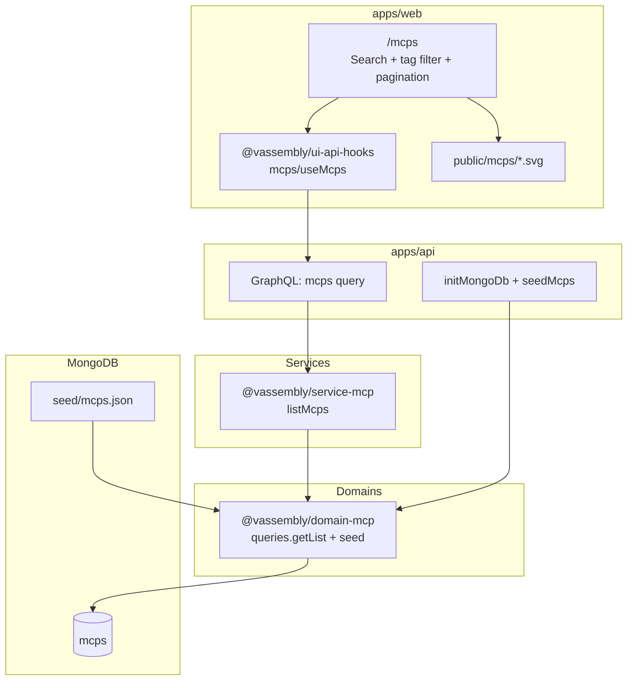
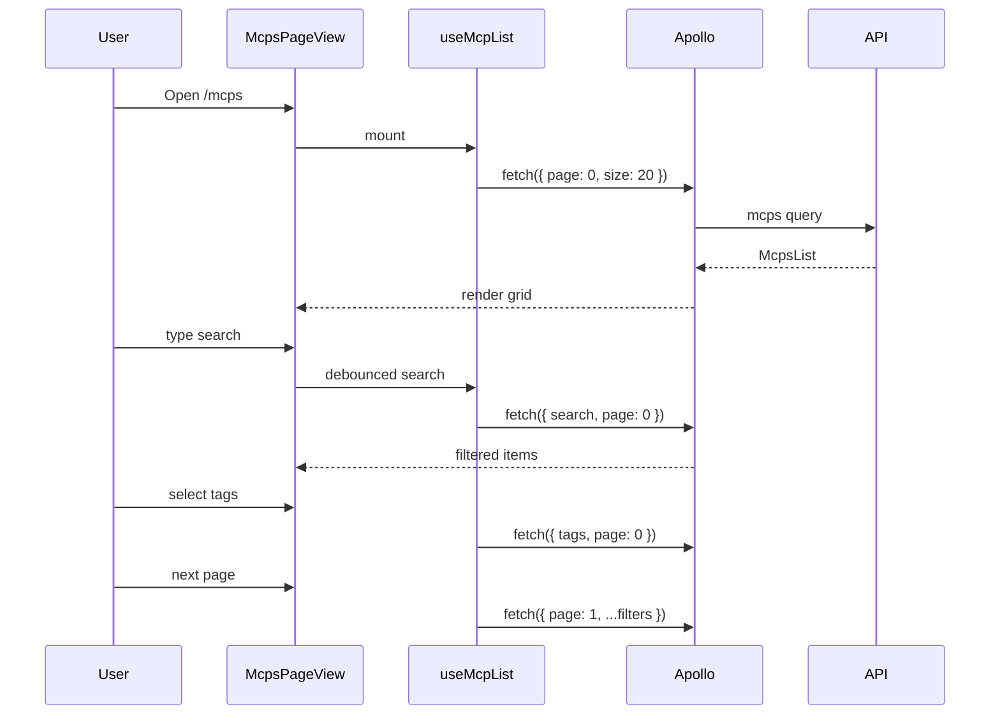

# MCP Listing Page — Architecture

**Status:** Engineering handoff  
**Last updated:** 2026-06-08  
**Related:** Confirmed requirements (read-only MCP discovery catalog)

---

## Analysis

### Audit of existing domains

| Domain | Relevance | Reuse |
|--------|-----------|-------|
| `@vassembly/domain-system-agent` | Paginated admin list with name/description search | **Primary backend pattern** — `getAdminList`, `buildNameDescriptionSearchFilter`, `resolvePagination`, MongoDB indexes |
| `@vassembly/domain-agent` | User-scoped paginated list | Auth-scoped list resolver pattern (no admin role) |
| `@vassembly/domain-ai-integration` | Multi-filter list (search + status + provider) | **Primary filter UX pattern** — server-side filters, page reset on filter change |
| `@vassembly/domain-task` | Paginated list query | Secondary pagination reference |

**No MCP domain exists today.** MCP catalog is a distinct bounded context (static reference data, no lifecycle commands). Do **not** extend `domain-system-agent` or `service-agent`.

### What exists vs gaps

| Layer | Exists | Gap |
|-------|--------|-----|
| Domain | List query patterns in system-agent / ai-integration | New `@vassembly/domain-mcp` (queries only, no commands) |
| Service | Handler orchestration in `service-agent` | New thin `@vassembly/service-mcp` with `listMcps` |
| GraphQL | `apps/api` gateway | New resolver + domain `gqlSchema` |
| MongoDB seed | Index bootstrap only (`initMongoDb`) | **New convention**: JSON seed + idempotent loader |
| Tag filter | None in any domain | New `$in` filter on `tags` array |
| Frontend | Agent/integration list pages | New `/mcps` page; reuse hooks/table/card primitives |
| REST | N/A for read-only | **No REST routes** (GraphQL query only per conventions) |

### New packages needed

| Package | Justification |
|---------|---------------|
| `domains/mcp/` (`@vassembly/domain-mcp`) | Owns MCP entity, MongoDB DAO, list query, seed loader, GraphQL schema |
| `services/mcp/` (`@vassembly/service-mcp`) | Thin handler layer between API and domain (monorepo convention) |

No new utility packages. Duplicate `buildNameDescriptionSearchFilter` / `resolvePagination` into `domains/mcp/src/queries/shared/` (same as system-agent) rather than extracting shared package prematurely.

### Librarian findings (incorporated)

- Closest reuse chain: `getAdminList` → `listSystemAgents` → `systemAgent` resolver → `useSystemAgents` → `PlatformAgentsSection`
- Seed-on-DB-creation is **not** established; `createMany` on DAO exists but is unwired
- GraphQL lives exclusively in `apps/api`
- UI primitives: `TextField`, `MultiSelect`, `Tag`, `Table`/`Pagination`, `Loader`
- Nav preset at `ui/components/layout/src/presets/main.tsx` — add `/mcps` link

---

## Architecture & Package Placement

### High-level data flow



### Package placement

| Artifact | Path | Package |
|----------|------|---------|
| Domain | `domains/mcp/` | `@vassembly/domain-mcp` |
| Seed JSON | `domains/mcp/seed/mcps.json` | Colocated with domain |
| Seed loader | `domains/mcp/src/seed/loadMcps.ts` | Exported from domain |
| Service | `services/mcp/` | `@vassembly/service-mcp` |
| GraphQL resolver | `apps/api/src/graphql/resolvers/mcp.ts` | `@vassembly/api` |
| API hooks | `ui/api-hooks/src/mcps/` | `@vassembly/ui-api-hooks` |
| Page | `apps/web/app/mcps/` | App-local components |
| Icon assets | `apps/web/public/mcps/` | Static files; DB stores paths like `/mcps/github.svg` |

> **Note:** Domain packages live at repo root `domains/`, not `packages/domains/`.

---

## 1. Domain Package Structure

```
domains/mcp/
├── seed/
│   └── mcps.json
├── src/
│   ├── index.ts                    # default export: { queries, mongodbIndexes, seedMcps, gqlSchema }
│   ├── constants.ts                # field max lengths, DEFAULT_PAGE_SIZE, collection name
│   ├── clients/
│   │   ├── index.ts
│   │   └── mongodb.ts              # DAO + mongodbIndexes()
│   ├── model/
│   │   ├── index.ts
│   │   ├── model.ts                # McpModel extends Model
│   │   ├── dto.ts                  # McpListItemResponse
│   │   ├── factories.ts            # mcpFactory
│   │   ├── graphql.ts              # gqlMcpSchema
│   │   └── toMcpResponse.ts
│   ├── queries/
│   │   ├── index.ts
│   │   ├── getList/
│   │   │   ├── index.ts            # Public paginated list query
│   │   │   ├── index.test.ts
│   │   │   └── types.ts
│   │   └── shared/
│   │       ├── buildNameDescriptionSearchFilter.ts  # Copy from system-agent
│   │       ├── buildTagsFilter.ts                   # New: { tags: { $in: [...] } }
│   │       ├── escapeRegex.ts
│   │       └── pagination.ts                        # Copy from system-agent
│   └── seed/
│       ├── loadMcps.ts             # Idempotent seed from JSON
│       ├── loadMcps.test.ts
│       ├── schema.ts               # Zod schema for seed entries
│       └── types.ts
├── package.json
├── tsconfig.json
├── vitest.config.ts
└── README.md
```

### Dependencies

```json
{
  "@vassembly/client-mongodb": "workspace:*",
  "@vassembly/errors": "workspace:*",
  "@vassembly/graphql": "workspace:*",
  "@vassembly/mappers": "workspace:*",
  "@vassembly/model": "workspace:*",
  "@vassembly/validation": "workspace:*",
  "zod": "^3.x"
}
```

**No commands folder** — read-only feature. Seed loading is infrastructure (`src/seed/`), not a domain command exposed to API.

### Domain export surface

```typescript
const mcpDomain = {
  queries,
  mongodbIndexes,
  seedMcps,
  gqlSchema: gqlMcpSchema,
};
```

---

## 2. Database Schema

### Collection: `mcps`

| Field | Type | Required | Notes |
|-------|------|----------|-------|
| `_id` | ObjectId | auto | Mapped to `id` string in model |
| `name` | string | yes | Display name; unique |
| `description` | string | yes | Short summary for list cards |
| `tags` | string[] | yes | Lowercase slug tags, e.g. `["database", "search"]` |
| `iconPath` | string | yes | Public URL path, e.g. `/mcps/github.svg` — not a filesystem path |
| `slug` | string | yes | Stable identifier for seed upserts, e.g. `github` |
| `documentationUrl` | string | no | External link metadata |
| `repositoryUrl` | string | no | External link metadata |
| `createdAt` | Date | yes | Set by factory on seed |
| `updatedAt` | Date | yes | Set by factory on seed |

### Indexes (`domains/mcp/src/clients/mongodb.ts`)

```typescript
await collection.createIndex({ slug: 1 }, { unique: true });
await collection.createIndex({ name: 1 }, { unique: true });
await collection.createIndex({ tags: 1 });                        // multikey for $in
await collection.createIndex({ name: 'text', description: 'text' }); // optional Atlas Search fallback
await collection.createIndex({ name: 1 });                          // default sort
```

**Search strategy:** Use `$regex` via `buildNameDescriptionSearchFilter` (consistent with system-agent/agent lists). Text index is optional backup; regex + pagination is sufficient for hundreds of records with proper indexes.

**Tag filter:** `{ tags: { $in: selectedTags } }` — match MCPs that have **any** selected tag. Document this in UI (OR semantics).

### Schema validation

**Application layer (required):** Zod schemas in:
- `domains/mcp/src/seed/schema.ts` — validate each seed entry before insert
- `domains/mcp/src/queries/getList/` — validate query args (`page`, `size`, `search`, `tags`)

**MongoDB collection validator (recommended, new pattern):**

```javascript
{
  $jsonSchema: {
    bsonType: 'object',
    required: ['name', 'description', 'tags', 'iconPath', 'slug', 'createdAt', 'updatedAt'],
    properties: {
      name: { bsonType: 'string', minLength: 1, maxLength: 120 },
      description: { bsonType: 'string', minLength: 1, maxLength: 500 },
      tags: { bsonType: 'array', items: { bsonType: 'string' }, minItems: 1 },
      iconPath: { bsonType: 'string', pattern: '^/mcps/' },
      slug: { bsonType: 'string', minLength: 1, maxLength: 80 },
      documentationUrl: { bsonType: ['string', 'null'] },
      repositoryUrl: { bsonType: ['string', 'null'] },
      createdAt: { bsonType: 'date' },
      updatedAt: { bsonType: 'date' }
    }
  }
}
```

Apply via `collMod` in `mongodbIndexes()` if team accepts first use of DB-level validation; otherwise Zod-only matches existing domains.

---

## 3. API Design

### GraphQL query (queries only — no mutations)

**Query name:** `mcps`

**Args** (align with existing list queries — use `page`/`size`, not raw offset/limit):

| Arg | Type | Default | Description |
|-----|------|---------|-------------|
| `page` | Int | `0` | Zero-based page index |
| `size` | Int | `20` | Page size (capped at 50) |
| `search` | String | — | Case-insensitive match on name OR description |
| `tags` | [String] | — | Filter: MCP has any of these tags |

> Internally: `skip = page * size`, `limit = size` via `resolvePagination`.

**Response type:** `McpsList`

```graphql
type Mcp {
  id: String!
  name: String!
  description: String!
  tags: [String!]!
  iconPath: String!
  slug: String!
  documentationUrl: String
  repositoryUrl: String
  createdAt: String!
  updatedAt: String!
}

type McpsList {
  items: [Mcp!]!
  total: Int!
  page: Int!
  size: Int!
}
```

### Resolver (`apps/api/src/graphql/resolvers/mcp.ts`)

- Require authenticated user (`context.authenticatedUserId`) — same as `agents` query
- **No admin role check** — all authenticated users see full catalog
- Delegate to `mcpService.listMcps({ page, size, search, tags })`

### REST

**None.** Read-only catalog uses GraphQL only per API conventions.

---

## 4. Frontend Components

### Route

`apps/web/app/mcps/page.tsx` — authenticated workspace page using main layout preset.

### Component breakdown

```
apps/web/app/mcps/
├── page.tsx
├── McpsPageView.tsx
└── _components/
    ├── McpListContainer/
    │   ├── McpListContainer.tsx      # Layout: toolbar + grid + pagination
    │   ├── useMcpList.ts             # Apollo lazy query + filter state
    │   └── types.ts
    ├── McpSearchBar/
    │   └── McpSearchBar.tsx          # TextField + debounced search
    ├── McpTagFilter/
    │   └── McpTagFilter.tsx          # MultiSelect for tags
    ├── McpListItem/
    │   ├── McpListItem.tsx           # Card: icon, name, description, Tag chips
    │   └── McpListItem.module.scss
    └── McpListEmptyState/
        └── McpListEmptyState.tsx     # Empty vs filtered-empty
```

### UX pattern choice

Use **card grid** (discovery catalog) inspired by `TaskList`/`TaskListItem`, not admin `Table` — MCPs are browse-only with no row actions.

Use **server-side filtering** (like `useAiIntegrationList`) — not client-side category filter anti-pattern from `usePlatformAgentsSection`.

### State management

| Concern | Approach |
|---------|----------|
| Data fetching | `useMcps()` from `@vassembly/ui-api-hooks` — Apollo lazy query, `fetchPolicy: 'no-cache'`, `withAuth: true` |
| Search | Local `searchInput` + `useDebouncedValue(300ms)` → refetch with `page: 0` |
| Tag filter | `MultiSelect` state → refetch with `tags` arg, reset page |
| Pagination | `page` state + `Pagination` or load-more; prefer numbered pagination for hundreds of items |
| Loading / error | `Loader`, inline error message |

### Interaction flow



### Nav integration

Add authenticated nav item in `ui/components/layout/src/presets/main.tsx`:

```typescript
{ id: 'mcps', label: 'MCPs', href: '/mcps', icon: /* appropriate icon */ }
```

### Icons

- Store SVGs in `apps/web/public/mcps/{slug}.svg`
- Seed `iconPath`: `/mcps/{slug}.svg`
- Render with Next.js `Image` or `` with fixed dimensions + fallback placeholder

---

## 5. Data Population

### Seed file location

`domains/mcp/seed/mcps.json`

```json
[
  {
    "slug": "github",
    "name": "GitHub",
    "description": "Interact with GitHub repositories and issues.",
    "tags": ["developer-tools", "git"],
    "iconPath": "/mcps/github.svg",
    "documentationUrl": "https://example.com/docs/github-mcp",
    "repositoryUrl": "https://github.com/example/github-mcp"
  }
]
```

### Load strategy

**Idempotent seed on API bootstrap** (after indexes):

```typescript
// apps/api/src/routes/index.ts
await initMongoDb({
  indexFunctions: [..., mcpDomain.mongodbIndexes],
});
await mcpDomain.seedMcps();
```

**`seedMcps` logic** (`domains/mcp/src/seed/loadMcps.ts`):

1. Read and parse `mcps.json`
2. Validate each entry with Zod
3. Check `countDocuments({}) === 0` **OR** upsert by `slug` (recommended: upsert-by-slug for dev re-seed safety)
4. Use `mcpFactory.create()` + `dao.createMany()` for initial load
5. Log count inserted/skipped; never fail API start on seed errors (log + continue) unless strict mode desired

**Alternative for CI/local:** Optional CLI script `pnpm --filter @vassembly/domain-mcp seed` calling same `seedMcps()` — not required for v1.

### Icon assets

Add SVG files alongside seed entries in same PR. CI check (optional): script validates every seed `iconPath` has matching file under `apps/web/public/`.

---

## 6. Integration Points

| Integration | Details |
|-------------|---------|
| API bootstrap | Register `mcpMongodbIndexes` + `seedMcps` in `apps/api/src/routes/index.ts` |
| GraphQL schema | Import `mcpDomain.gqlSchema(builder)` in `apps/api/src/graphql/index.ts` |
| GraphQL resolver | `registerMcpResolvers(builder)` in same file |
| Service wiring | Add `@vassembly/service-mcp` to `apps/api/package.json`; import in resolver |
| Domain wiring | Add `@vassembly/domain-mcp` to service + api package.json |
| Auth | JWT required (consistent with app); **no RBAC** — all logged-in users |
| Caching | None v1; static data could add HTTP/Apollo cache later |

---

## 7. Existing Code Reuse

| Copy from | Use for |
|-----------|---------|
| `domains/system-agent/src/queries/getAdminList/` | List query structure, parallel fetch + count |
| `domains/system-agent/src/queries/shared/*` | Search + pagination helpers |
| `services/agent/src/handlers/listSystemAgents/` | Thin service handler (minus admin check) |
| `apps/api/src/graphql/resolvers/agent.ts` | Auth-only resolver (not admin) |
| `ui/api-hooks/src/systemAgents/useSystemAgents.ts` | Lazy query hook pattern |
| `apps/web/.../AiIntegrationsList/useAiIntegrationList.ts` | Server-side filter + pagination state |
| `apps/web/app/_components/TaskList/TaskListItem.tsx` | Card row layout |
| `ui/system-design/multi-select/`, `tag/`, `text-field/`, `pagination/` | Filter and display primitives |

**Avoid:**
- Extending `service-agent` / `domain-system-agent`
- Client-side tag filtering after full fetch
- REST list endpoint
- GraphQL mutations

---

## 8. Implementation Phases

### Phase 1 — Backend foundation

1. Scaffold `@vassembly/domain-mcp` (create-domain skill)
2. Implement model, DAO, indexes, DTO mapper, `getList` query
3. Implement seed JSON schema + `seedMcps`
4. Unit tests for query filters and seed loader

### Phase 2 — Service & API

1. Scaffold `@vassembly/service-mcp` with `listMcps` handler
2. Add GraphQL schema + resolver in `apps/api`
3. Wire bootstrap: indexes + seed
4. Handler + resolver tests

### Phase 3 — Frontend

1. Add `ui/api-hooks/src/mcps/` (`LIST_MCPS_QUERY`, `useMcps`)
2. Build `/mcps` page and components
3. Add nav link + placeholder/public icons
4. Component tests for empty/filtered states

### Phase 4 — Testing & polish

1. Integration smoke: seed loads, query returns paginated results
2. Manual QA: search, tag filter, pagination, empty states
3. Update domain README

---

## 9. Risk Considerations

| Risk | Mitigation |
|------|------------|
| **Performance at scale (hundreds)** | Server-side pagination (max 50/page); indexes on `tags`, `name`; regex search acceptable at this scale |
| **Regex injection** | Reuse `escapeRegex` from system-agent |
| **Seed drift / missing icons** | Upsert by `slug`; optional CI check seed paths ↔ `public/mcps/` |
| **Duplicate seed on restart** | Idempotent upsert or count guard |
| **Tag filter confusion** | Document OR semantics in UI helper text |
| **Empty search results** | Distinct empty states: no MCPs vs no matches |
| **Large result pagination UX** | Show total count; disable next on last page |
| **Search latency** | 300ms debounce; cancel in-flight requests via Apollo |
| **Unauthenticated access** | Confirm product intent — default: require login like `/agents` |

---

## Recommendation

**Most conservative approach:** New `domain-mcp` + `service-mcp` packages copying the proven list-query stack from system-agent, with tag filter as the only new query logic. Seed JSON colocated in domain, loaded idempotently at API startup. Frontend follows AiIntegrations list interaction model with TaskList-style cards. No REST, no mutations, no admin gate.

**Trade-offs:**
- Duplicated pagination/search helpers vs shared package — accept duplication for v1
- Upsert-by-slug vs insert-only-on-empty — upsert safer for dev; insert-only simpler for prod immutability

---

## Implementation Steps

1. **Create domain package** — `.cursor/skills/create-domain/SKILL.md`
2. **Model + MongoDB** — `domains/mcp/src/model/*`, `clients/mongodb.ts`
3. **List query** — `queries/getList/index.ts` with search + tags + pagination
4. **Seed** — `seed/mcps.json`, `src/seed/loadMcps.ts`, Zod schema
5. **GraphQL types** — `model/graphql.ts`
6. **Create service** — `.cursor/skills/create-service/SKILL.md`, handler `listMcps`
7. **API gateway** — resolver, schema registration, bootstrap wiring
8. **API hooks** — `ui/api-hooks/src/mcps/*`
9. **Web page** — `apps/web/app/mcps/*`, nav link, public icons
10. **Tests** — domain query, seed, handler, hook (smoke)

---

## Todo Plan

1. **`@vassembly/domain-mcp`** — Type: new domain
   - Changes: Scaffold package; model, DAO, indexes, `getList` query, seed loader, gqlSchema, README
   - Files: `domains/mcp/**`, `domains/mcp/seed/mcps.json`
   - Workflow: coder → tdd-unit-test-writer (query + seed tests) → code-reviewer → documentation-writer
   - Dependencies: None

2. **`@vassembly/service-mcp`** — Type: new service
   - Changes: `listMcps` handler delegating to `mcpDomain.queries.getList`
   - Files: `services/mcp/src/handlers/listMcps/**`, `services/mcp/src/index.ts`
   - Workflow: tdd-unit-test-writer → coder → code-reviewer → documentation-writer
   - Dependencies: Todo 1

3. **`@vassembly/api`** — Type: app (API gateway)
   - Changes: GraphQL resolver, schema registration, bootstrap indexes + seed, package.json deps
   - Files: `apps/api/src/graphql/resolvers/mcp.ts`, `apps/api/src/graphql/index.ts`, `apps/api/src/routes/index.ts`, `apps/api/package.json`
   - Workflow: coder → code-reviewer
   - Dependencies: Todos 1, 2

4. **`@vassembly/ui-api-hooks`** — Type: UI package
   - Changes: `LIST_MCPS_QUERY`, `useMcps`, types, barrel export
   - Files: `ui/api-hooks/src/mcps/**`, `ui/api-hooks/src/index.ts`
   - Workflow: coder → code-reviewer
   - Dependencies: Todo 3

5. **`apps/web`** — Type: app (frontend)
   - Changes: `/mcps` page, components, icons in `public/mcps/`
   - Files: `apps/web/app/mcps/**`, `apps/web/public/mcps/*`
   - Workflow: ui-designer (optional layout pass) → coder → code-reviewer
   - Dependencies: Todo 4

6. **`@vassembly/ui-layout`** — Type: UI package
   - Changes: Add MCPs nav item to main drawer preset
   - Files: `ui/components/layout/src/presets/main.tsx`
   - Workflow: coder
   - Dependencies: Todo 5 (can parallel once route path confirmed)

---

## Team Assignments & Handoff Points

| Phase | Owner sequence | Handoff deliverable |
|-------|----------------|---------------------|
| Domain + seed | **coder** → **tdd-unit-test-writer** → **code-reviewer** → **documentation-writer** | `getList` + `seedMcps` tested; README documents model and seed format |
| Service | **tdd-unit-test-writer** → **coder** → **code-reviewer** | `listMcps` handler with mocked domain |
| API gateway | **coder** → **code-reviewer** | GraphQL query live; bootstrap seeds DB on start |
| API hooks | **coder** → **code-reviewer** | `useMcps` consumable from web |
| Frontend | **coder** (+ optional **ui-designer**) → **code-reviewer** | `/mcps` page functional end-to-end |
| Nav | **coder** | Drawer link to `/mcps` |

**Gate between backend and frontend:** GraphQL query verified (manual or test) returning seeded data before frontend work starts.

**Gate before merge:** E2E smoke — login → `/mcps` → search → filter → paginate.

---

## Blockers / Questions for Product

1. **Authentication:** Should `/mcps` require login (recommended, matches `/agents`) or be public?
2. **Tag filter semantics:** Match **any** selected tag (OR) or **all** selected tags (AND)?
3. **Seed mutability:** Insert-only on empty DB vs upsert-by-slug on every API start?
4. **Metadata fields:** Are `documentationUrl` / `repositoryUrl` in scope for v1 list UI, or store-only for future detail view?
5. **Initial catalog size:** Approximate count for first seed PR (drives icon asset batch size)?
6. **Pagination UX:** Numbered pages vs infinite scroll / load-more?
