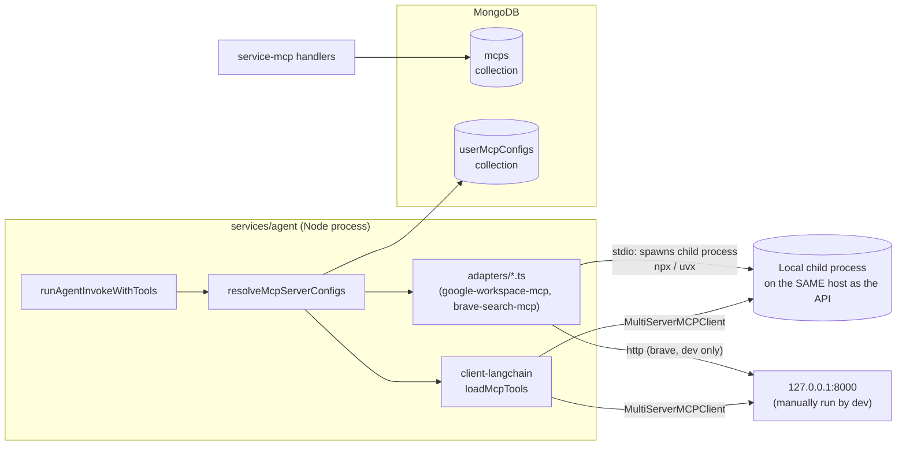
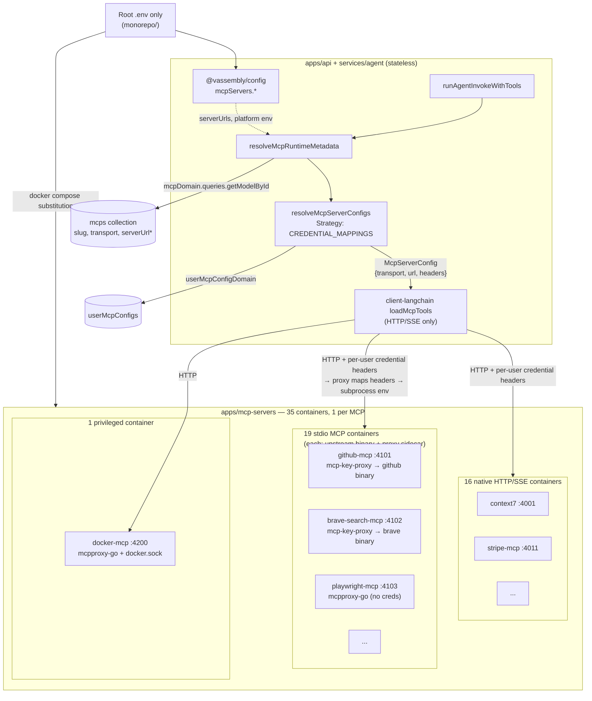

# MCP Servers Platform — Architecture

## 1. Executive Summary

vassembly currently ships two hard-coded MCP integrations (`google-workspace-mcp`, `brave-search-mcp`) whose runtime adapters spawn `npx`/`uvx` stdio subprocesses **inside the agent service process**. This does not scale (35+ target integrations), is not deployable to a stateless/serverless backend, and mixes ops concerns (log level, tool allow-lists) into the same `configSchema` that end users fill in for credentials.

This document defines the target architecture for a self-hosted **MCP server platform** that is **multi-tenant from day one**:

- A new app, `apps/mcp-servers/`, hosts every MCP server from the evaluation plan as **one Docker container per MCP** (35 containers). No shared gateway bundling multiple stdio servers — each integration is independently deployable, scalable, and isolatable.
- **Stdio-only MCPs (19)** run behind an **existing open-source stdio→HTTP proxy** (one proxy instance per container — never a shared gateway). Proxy choice is per MCP based on runtime and credential needs (§3, §5). **No custom vassembly proxy** — use off-the-shelf tools only.
- **Native HTTP/SSE MCPs (16)** run as upstream images directly — **no proxy layer**. The agent forwards per-user credentials as HTTP headers on every request.
- The agent runtime **never spawns child processes** and **never reads `process.env` for MCP settings**. All configuration flows through `@vassembly/config`; only the monorepo **root** `.env` / `.env.example` exist — no per-app or per-package env files.
- `McpModel` (domain-mcp) gains internal-only ops metadata (`serverUrl`, `transport`, `dockerImage`, `category`). `serverUrl` is **never** serialized to any DTO, GraphQL type, or REST response.
- `configSchema` holds **user credentials only**. Platform/ops settings (log level, enabled/disabled tools, stateless mode) live in `@vassembly/config` → passed to containers at compose startup via root `.env` substitution.
- All 35 servers are seeded via one-off migration script (`scripts/migrateMcpServerUrls.ts`). AWS/Lambda deployment is designed but deferred.

## 2. As-Is vs To-Be

### 2.1 As-Is



**Problems**:
- Credentials decrypted in `resolveMcpServerConfigs` are turned into **env vars for a locally-spawned process** — impossible once the API runs as multiple stateless replicas/Lambdas.
- Only 2 MCPs exist; adding a 3rd means hand-writing adapter files with duplicated boilerplate.
- Ops-only fields live inside user-facing `configSchema`.
- No multi-tenant path for stdio MCPs.

### 2.2 To-Be



`*` `serverUrl` is populated on `McpModel` but is **never** returned by public queries or any GraphQL/REST DTO.

## 3. Credential Transport & Stdio Proxy Selection

**Decision: per-request HTTP headers for ALL MCPs. Native HTTP MCPs receive headers directly; stdio MCPs receive headers via an existing proxy that maps them to subprocess env vars per session/user.**

### Why not MCPO or container-boot env vars

| Option | Verdict | Reason |
|---|---|---|
| MCPO shared gateway (`ghcr.io/open-webui/mcpo`) | ❌ Rejected | Cannot forward per-request headers into stdio subprocess env ([open-webui/mcpo#182](https://github.com/open-webui/mcpo/issues/182)). Bundling multiple servers in one container violates per-MCP isolation. |
| Credentials baked into container env at boot | ❌ Rejected | Single-tenant per deployment. Not production-ready. |
| Custom vassembly stdio-proxy | ❌ Rejected | Existing open-source proxies cover this; no need to build and maintain our own. |
| Shared proxy container for multiple stdio MCPs | ❌ Rejected | One container per MCP for isolation, scaling, and deploy independence. |

### Evaluation of stdio→HTTP proxy alternatives

The evaluation plan lists three alternatives to MCPO. Assessed against **multi-tenant production** requirements (per-user credentials, one container per MCP):

| Proxy | Production-ready | Multi-tenant stdio (per-request creds) | One MCP per container | Verdict |
|---|---|---|---|---|
| **A. mcpproxy-go** | ✅ Yes | ⚠️ OSS: static `env` at config time. Server Edition: per-user credential broker (separate store — duplicates `userMcpConfigs`). No header→env pass-through in OSS. | ✅ Single-upstream config per instance | **Use for stdio MCPs with no per-user credentials** (playwright, puppeteer, wikipedia, arxiv) and as general-purpose wrapper when creds are not needed. |
| **B. FastMCP** (`create_proxy`) | ✅ Yes | ⚠️ `ProxyClient` gives session isolation but no built-in header→env mapping for arbitrary upstream binaries. Suited to Python MCP scripts you control. | ✅ One proxy per container | **Use only when the upstream is a Python stdio MCP script** (none in current catalog; reserved for future Python MCPs). |
| **C. MCP Inspector proxy** | ❌ Dev tool only | ❌ Not designed for untrusted multi-tenant traffic | N/A | **Local dev/debug only** — never in `docker-compose.yml` production fleet. Use `npx @modelcontextprotocol/inspector` during MCP integration work. |
| **mcp-key-proxy** *(supplemental)* | ✅ Yes | ✅ **Header→env per request** + keyed process pool — built for multi-tenant API-key stdio MCPs | ✅ One proxy wrapping one stdio command | **Default for stdio MCPs requiring per-user API keys/tokens in env** (14 of 19 stdio MCPs). Not in the original MCPO-alternatives list but is the only evaluated tool that satisfies header→env multi-tenancy without a custom proxy. |

**Proxy selection rule (no custom code):**

```
stdio MCP needs per-user credentials in env?
  YES → mcp-key-proxy  (header --header-to-env mapping per MCP)
  NO  → mcpproxy-go    (single stdio upstream, no cred injection needed)
  
upstream is a Python stdio script we own?
  → FastMCP create_proxy() instead of mcpproxy-go

local dev / debugging only?
  → MCP Inspector (not in compose fleet)
```

### Uniform runtime shape (unchanged)

Every MCP produces the same `McpServerConfig` at runtime:

```typescript
{
  serverName: mcpId,
  transport: 'http' | 'sse',
  url: serverUrl,       // from catalog, via @vassembly/config per env
  headers: { ... },     // per-user, per-request
}
```

For **native-http** MCPs, headers go directly to the upstream (e.g. `Authorization: Bearer`, `DD-API-KEY`).

For **stdio MCPs behind mcp-key-proxy**, headers use the proxy's expected names (configured in `config.mcpServers.proxies[slug].headerToEnv` in `@vassembly/config`, mapped by domain adapters from `fieldValues`). Example:

```bash
# Container entrypoint (platform config, not user data):
mcp-key-proxy \
  --stdio "npx -y @brave/brave-search-mcp-server" \
  --header-to-env "X-Mcp-Env-BRAVE_API_KEY=BRAVE_API_KEY" \
  --port 8080
```

```
User A ── X-Mcp-Env-BRAVE_API_KEY: key_a ──► brave-search container ──► subprocess pool (env: BRAVE_API_KEY=key_a)
User B ── X-Mcp-Env-BRAVE_API_KEY: key_b ──► brave-search container ──► subprocess pool (env: BRAVE_API_KEY=key_b)
```

For **stdio MCPs behind mcpproxy-go** (no per-user creds), the agent connects with no credential headers; the proxy manages a single long-lived stdio subprocess.

`packages/client-langchain` requires no changes. Production traffic only uses the `http`/`sse` branch.

## 4. Lambda / Production Topology Decision (Deferred Deploy)

**Decision: one deployable unit per MCP slug, mirroring local Docker topology.**

| MCP transport class | Target compute | Multi-tenant |
|---|---|---|
| `native-http` (16) | AWS Lambda + Function URL (or ALB), one function per MCP image | Per-request headers |
| `stdio-wrapped` (19) | AWS Lambda container image (proxy + MCP binary), one function per MCP | Per-request headers → mcp-key-proxy (credentialed) or mcpproxy-go (no creds) |
| `docker-mcp` (1) | Dedicated Fargate task, network-isolated, docker.sock only | mcpproxy-go; never colocated with other MCPs |

**What ships now:** `@vassembly/config` carries placeholder production URLs. `apps/mcp-servers/docker-compose.yml` is the runnable local topology. No IaC artifacts in this phase.

## 5. Container Topology — One Container per MCP

**35 containers, 35 ports, zero shared gateways. Proxy only on stdio MCPs that need it.**

| Category | Slug | Container | Proxy | Local port |
|---|---|---|---|---|
| 1. Dev & VCS | `github-mcp` | stdio + wrapper | mcp-key-proxy | 4101 |
| | `context7` | native-http | — | 4001 |
| 2. Browser | `playwright-mcp` | stdio + wrapper | mcpproxy-go | 4102 |
| | `puppeteer-mcp` | stdio + wrapper | mcpproxy-go | 4103 |
| | `chrome-devtools-mcp` | native-http | — | 4002 |
| 3. Databases | `mongodb-mcp` | stdio + wrapper | mcp-key-proxy | 4104 |
| | `redis-mcp` | stdio + wrapper | mcp-key-proxy | 4105 |
| 4. Cloud/Infra | `docker-mcp` | stdio + wrapper (isolated) | mcpproxy-go | 4200 |
| | `aws-mcp` | stdio + wrapper | mcp-key-proxy | 4106 |
| | `vercel-mcp` | native-http | — | 4003 |
| | `terraform-mcp` | stdio + wrapper | mcp-key-proxy | 4107 |
| 5. Security | `sentry-mcp` | stdio + wrapper | mcp-key-proxy | 4108 |
| | `datadog-mcp` | native-http | — | 4004 |
| 6. Search | `brave-search-mcp` | stdio + wrapper | mcp-key-proxy | 4109 |
| | `firecrawl-mcp` | native-http | — | 4005 |
| | `wikipedia-mcp` | stdio + wrapper | mcpproxy-go | 4110 |
| | `pubmed-mcp` | stdio + wrapper | mcp-key-proxy | 4111 |
| | `arxiv-mcp` | stdio + wrapper | mcpproxy-go | 4112 |
| | `google-search-mcp` | stdio + wrapper | mcp-key-proxy | 4113 |
| 8. Knowledge | `notion-mcp` | native-http | — | 4006 |
| | `obsidian-mcp` | stdio + wrapper | mcp-key-proxy | 4114 |
| | `granola-mcp` | native-http | — | 4007 |
| 9. Communication | `discord-mcp` | stdio + wrapper | mcp-key-proxy | 4115 |
| | `gmail-mcp` | native-http | — | 4008 |
| 10. Productivity | `google-calendar-mcp` | native-http | — | 4009 |
| | `todoist-mcp` | stdio + wrapper | mcp-key-proxy | 4116 |
| | `linear-mcp` | native-http | — | 4010 |
| 11. Finance | `stripe-mcp` | native-http | — | 4011 |
| 12. Design | `figma-mcp` | native-http | — | 4012 |
| | `google-sheets-mcp` | native-http | — | 4013 |
| | `canva-mcp` | native-http | — | 4014 |
| 13. IoT/Geo | `home-assistant-mcp` | native-http | — | 4015 |
| | `google-maps-mcp` | stdio + wrapper | mcp-key-proxy | 4117 |
| | `openweather-mcp` | stdio + wrapper | mcp-key-proxy | 4118 |
| | `spotify-mcp` | native-http | — | 4016 |

Port assignments are the single source of truth in `@vassembly/config` (`config.mcpServers.containers[slug].port`). `serverUrl` values are derived from port + host (e.g. `http://localhost:4101/mcp`).

### Why one container per MCP (not shared)

| Concern | Per-MCP container | Shared gateway |
|---|---|---|
| Multi-tenant stdio | Session-scoped subprocess per user; credentials never shared across users | MCPO cannot inject per-request env; would be single-tenant |
| Independent scaling | Scale `github-mcp` without scaling `wikipedia-mcp` | All-or-nothing scaling |
| Blast radius | Compromise in one MCP does not affect others | Shared process space |
| Deploy cadence | Update one image without redeploying 18 others | Forced coordinated releases |
| Resource limits | Per-container CPU/memory limits | One container starves others |
| `docker-mcp` isolation | Dedicated container with socket mount only | Must never share with other MCPs |

## 6. `apps/mcp-servers/` Structure

```
apps/mcp-servers/
├── docker-compose.yml            # 35 services — NO .env file here
├── images/
│   ├── mcp-key-proxy/            # Thin image: mcp-key-proxy binary + entrypoint.sh
│   └── mcpproxy-go/              # Thin image: mcpproxy-go binary + entrypoint.sh
├── mcps/
│   ├── github-mcp/
│   │   └── Dockerfile            # FROM images/mcp-key-proxy + upstream MCP binary/config
│   ├── brave-search-mcp/
│   │   └── Dockerfile
│   ├── playwright-mcp/
│   │   └── Dockerfile            # FROM images/mcpproxy-go (no per-user creds)
│   └── ...                       # One folder per stdio MCP
├── package.json                  # scripts: "up", "down" (delegate to root compose)
└── README.md
```

**No `stdio-proxy/` custom code.** Proxy binaries are pulled from upstream images or installed in thin wrapper Dockerfiles. Platform proxy config (stdio command, header→env map, pool size) is defined in `@vassembly/config` (`config.mcpServers.proxies`) and passed to containers via root `.env` substitution — not hardcoded in Dockerfiles.

**No `.env` or `.env.example` in this app.** All env vars live in the monorepo root.

### docker-compose invocation (from monorepo root)

```bash
docker compose -f apps/mcp-servers/docker-compose.yml up -d
```

Docker Compose automatically loads `.env` from the **current working directory** (monorepo root). Service `environment:` blocks reference `${VAR}` placeholders that resolve from root `.env`.

Root `package.json` script:

```json
"mcp-servers:up": "docker compose -f apps/mcp-servers/docker-compose.yml up -d",
"mcp-servers:down": "docker compose -f apps/mcp-servers/docker-compose.yml down"
```

### Illustrative compose service (stdio MCP with mcp-key-proxy)

```yaml
services:
  github-mcp:
    build: ./mcps/github-mcp
    ports:
      - "${MCP_GITHUB_PORT:-4101}:8080"
    environment:
      - MCP_STDIO_COMMAND=${MCP_GITHUB_STDIO_COMMAND}
      - MCP_HEADER_ENV_MAP=${MCP_GITHUB_HEADER_ENV_MAP}
      - MCP_PROXY_POOL_SIZE=${MCP_PROXY_POOL_SIZE:-5}
      - MCP_LOG_LEVEL=${MCP_LOG_LEVEL:-info}
    # No user credentials — injected per-request via HTTP headers from the agent
```

### Illustrative compose service (stdio MCP with mcpproxy-go, no creds)

```yaml
services:
  playwright-mcp:
    build: ./mcps/playwright-mcp
    ports:
      - "${MCP_PLAYWRIGHT_PORT:-4102}:8080"
    environment:
      - MCP_STDIO_COMMAND=${MCP_PLAYWRIGHT_STDIO_COMMAND}
      - MCP_LOG_LEVEL=${MCP_LOG_LEVEL:-info}
```

### Illustrative compose service (native HTTP MCP — no proxy)

```yaml
services:
  stripe-mcp:
    image: stripe/mcp-server-stripe:latest
    ports:
      - "${MCP_STRIPE_PORT:-4011}:4011"
    environment:
      - MCP_LOG_LEVEL=${MCP_LOG_LEVEL:-info}
    # No STRIPE_API_KEY here — forwarded per-request by the agent
```

## 7. Configuration — Root `.env` → `@vassembly/config` → Consumers

**Rule: application packages and domains NEVER read `process.env` for MCP settings. They import `@vassembly/config`.**

Only `@vassembly/config` reads `process.env` (at module load, same pattern as `mongoDb`, `platformAi`, `skills.execution`).

### Config shape

`packages/config/src/types.ts`:

```typescript
export type McpTransport = 'native-http' | 'stdio-wrapped';

export type McpProxyKind = 'none' | 'mcp-key-proxy' | 'mcpproxy-go' | 'fastmcp';

export interface McpProxyConfig {
  kind: McpProxyKind;
  /** mcp-key-proxy: header name → upstream env var, e.g. "X-Mcp-Env-BRAVE_API_KEY=BRAVE_API_KEY" */
  headerToEnv?: Array<{ headerName: string; envVar: string }>;
  /** Stdio command the proxy wraps, e.g. "npx -y @brave/brave-search-mcp-server" */
  stdioCommand?: string;
  poolSize?: number;
}

export interface McpServerContainerConfig {
  port: number;
  transport: McpTransport;
  dockerImage: string;
  proxy: McpProxyConfig;
  /** Platform ops passed to container at startup — NOT user credentials. */
  platformEnv: Record<string, string>;
}

export interface McpServersConfig {
  /** Keyed by slug. Used by migration script and agent runtime metadata resolution. */
  serverUrls: Record<string, string>;
  /** Container topology — used by compose generation and ops tooling. */
  containers: Record<string, McpServerContainerConfig>;
  /** Shared platform defaults for all MCP containers. */
  defaults: {
    logLevel: string;
    host: string; // 'localhost' in dev, placeholder in prod
  };
}

export interface Config {
  // ...existing fields
  mcpServers: McpServersConfig;
}
```

### Env var → config loading

`packages/config/src/buildMcpServersConfig.ts` (new, mirrors `buildExecutionConfig.ts`):

```typescript
export const buildMcpServersConfig = (): McpServersConfig => ({
  defaults: {
    logLevel: process.env.MCP_LOG_LEVEL || 'info',
    host: process.env.MCP_HOST || 'localhost',
  },
  serverUrls: JSON.parse(process.env.MCP_SERVER_URLS_JSON || '{}'),
  containers: buildMcpContainerRegistry(), // port/image/transport from env or dev defaults
});
```

`packages/config/src/development.ts` — hardcoded `serverUrls` and `containers` for all 35 MCPs (derived from §5 port table), so local dev works with zero extra env configuration beyond `docker compose up`.

`packages/config/src/production.ts` — `serverUrls` from `MCP_SERVER_URLS_JSON`; `containers` from `MCP_CONTAINERS_JSON` or equivalent; placeholder AWS URLs.

### Root `.env.example` additions (only place env vars are documented)

```bash
# MCP Servers — platform config (NOT user credentials)
MCP_LOG_LEVEL=info
MCP_HOST=localhost
# MCP_SERVER_URLS_JSON=          # prod only — slug→url map
# MCP_CONTAINERS_JSON=           # prod only — container topology overrides

# MCP_GITHUB_STDIO_COMMAND=npx -y @modelcontextprotocol/server-github
# MCP_GITHUB_HEADER_ENV_MAP=X-Mcp-Env-GITHUB_PERSONAL_ACCESS_TOKEN=GITHUB_PERSONAL_ACCESS_TOKEN
# MCP_PROXY_POOL_SIZE=5
```

User credentials (`GITHUB_PERSONAL_ACCESS_TOKEN`, `BRAVE_API_KEY`, etc.) are **never** in `.env`. They live in `userMcpConfigs` in MongoDB, encrypted, and are sent as HTTP headers at runtime.

### Config consumption map

| Consumer | Reads from config | Never reads |
|---|---|---|
| `services/agent` | `config.mcpServers.serverUrls` (fallback if catalog `serverUrl` null) | `process.env` |
| `scripts/migrateMcpServerUrls.ts` | `config.mcpServers.serverUrls` | `process.env` |
| `domains/user-mcp-config` adapters | Receives `serverUrl`/`transport` from service layer | `process.env`, `@vassembly/config` |
| `apps/mcp-servers` compose | Root `.env` vars (loaded into `@vassembly/config` first; compose reads same root `.env` for `${VAR}` substitution) | Own `.env` file |
| `domains/mcp` seed | Static metadata only; no URLs | `process.env` |

Domains do not import `@vassembly/config` for MCP URLs — the service layer (`services/agent`) resolves `serverUrl` from catalog + config and passes it into domain commands (§12).

## 8. `McpModel` Schema Changes

`domains/mcp/src/model/model.ts`:

```typescript
export class McpModel extends Model {
  slug!: string;
  name!: string;
  description!: string;
  tags!: string[];
  iconPath!: string;
  documentationUrl?: string | null;
  repositoryUrl?: string | null;
  configurationStatus?: string | null;
  configSchema?: McpConfigSchema | null;
  specializationIds?: string[];
  category?: string | null;

  /** INTERNAL ONLY — never expose via dto.ts / GraphQL / REST. */
  transport!: McpTransportValue;
  /** INTERNAL ONLY — set by migration script from @vassembly/config. */
  serverUrl?: string | null;
  /** INTERNAL ONLY — ops metadata for apps/mcp-servers. */
  dockerImage?: string | null;
}
```

`dto.ts` / `toMcpResponse` — **unchanged**. Structural enforcement of internal-only `serverUrl`.

## 9. `configSchema` per MCP (user credentials only)

Ops fields (log level, ports, enabled/disabled tools, stateless mode) are **excluded** — they live in `@vassembly/config` → container `platformEnv` at compose startup (§7).

| Slug | Transport | Proxy | Credential field(s) | Header delivery |
|---|---|---|---|---|
| github-mcp | stdio-wrapped | mcp-key-proxy | `personalAccessToken: password` | `X-Mcp-Env-GITHUB_PERSONAL_ACCESS_TOKEN` |
| context7 | native-http | — | `apiKey: password` *(optional)* | `Authorization: Bearer` |
| playwright-mcp | stdio-wrapped | mcpproxy-go | *(none)* | — |
| puppeteer-mcp | stdio-wrapped | mcpproxy-go | *(none)* | — |
| chrome-devtools-mcp | native-http | — | *(none)* | — |
| mongodb-mcp | stdio-wrapped | mcp-key-proxy | `connectionUri: password` | `X-Mcp-Env-MONGODB_URI` |
| redis-mcp | stdio-wrapped | mcp-key-proxy | `connectionUrl: password` | `X-Mcp-Env-REDIS_URL` |
| docker-mcp | stdio-wrapped | mcpproxy-go | *(none)* | — |
| aws-mcp | stdio-wrapped | mcp-key-proxy | `accessKeyId`, `secretAccessKey`, `region` | `X-Mcp-Env-AWS_*` |
| vercel-mcp | native-http | — | `apiToken: password` | `Authorization: Bearer` |
| terraform-mcp | stdio-wrapped | mcp-key-proxy | `terraformCloudToken: password` | `X-Mcp-Env-TF_TOKEN_app_terraform_io` |
| sentry-mcp | stdio-wrapped | mcp-key-proxy | `authToken: password` | `X-Mcp-Env-SENTRY_AUTH_TOKEN` |
| datadog-mcp | native-http | — | `apiKey`, `applicationKey` | `DD-API-KEY`, `DD-APPLICATION-KEY` |
| brave-search-mcp | stdio-wrapped | mcp-key-proxy | `apiKey: password` | `X-Mcp-Env-BRAVE_API_KEY` |
| firecrawl-mcp | native-http | — | `apiKey: password` | `Authorization: Bearer` |
| wikipedia-mcp | stdio-wrapped | mcpproxy-go | *(none)* | — |
| pubmed-mcp | stdio-wrapped | mcp-key-proxy | `ncbiApiKey: password` *(optional)* | `X-Mcp-Env-NCBI_API_KEY` |
| arxiv-mcp | stdio-wrapped | mcpproxy-go | *(none)* | — |
| google-search-mcp | stdio-wrapped | mcp-key-proxy | `apiKey`, `searchEngineId` | `X-Mcp-Env-GOOGLE_*` |
| notion-mcp | native-http | — | `integrationToken: password` | `Authorization: Bearer` |
| obsidian-mcp | stdio-wrapped | mcp-key-proxy | `apiKey: password` | `X-Mcp-Env-OBSIDIAN_API_KEY` |
| granola-mcp | native-http | — | `apiToken: password` | `Authorization: Bearer` |
| discord-mcp | stdio-wrapped | mcp-key-proxy | `botToken: password` | `X-Mcp-Env-DISCORD_BOT_TOKEN` |
| gmail-mcp | native-http | — | `accessToken: password` *(MVP)* | `Authorization: Bearer` |
| google-calendar-mcp | native-http | — | `accessToken: password` *(MVP)* | `Authorization: Bearer` |
| todoist-mcp | stdio-wrapped | mcp-key-proxy | `apiToken: password` | `X-Mcp-Env-TODOIST_API_TOKEN` |
| linear-mcp | native-http | — | `apiKey: password` | `Authorization: Bearer` |
| stripe-mcp | native-http | — | `restrictedApiKey: password` | `Authorization: Bearer` |
| figma-mcp | native-http | — | `personalAccessToken: password` | `X-Figma-Token` |
| google-sheets-mcp | native-http | — | `accessToken: password` *(MVP)* | `Authorization: Bearer` |
| canva-mcp | native-http | — | `accessToken: password` *(MVP)* | `Authorization: Bearer` |
| home-assistant-mcp | native-http | — | `longLivedAccessToken: password` | `Authorization: Bearer` |
| google-maps-mcp | stdio-wrapped | mcp-key-proxy | `apiKey: password` | `X-Mcp-Env-GOOGLE_MAPS_API_KEY` |
| openweather-mcp | stdio-wrapped | mcp-key-proxy | `apiKey: password` | `X-Mcp-Env-OPENWEATHER_API_KEY` |
| spotify-mcp | native-http | — | `accessToken: password` *(MVP)* | `Authorization: Bearer` |

For **stdio-wrapped** MCPs using `mcp-key-proxy`, the domain adapter maps `fieldValues` → `X-Mcp-Env-*` headers; the proxy maps those headers → subprocess env vars per tenant. For **native-http** MCPs, adapters map to upstream header names directly. For **mcpproxy-go** stdio MCPs (no per-user creds), the agent connects with an empty header set.

## 10. Seed Strategy

- `domains/mcp/seed/mcps.json` — 35 entries, environment-agnostic (no `serverUrl`).
- `serverUrl` is set **only** by `scripts/migrateMcpServerUrls.ts`, reading from `config.mcpServers.serverUrls`.
- Boot-time `loadMcps()` stays insert-only for empty collections.

## 11. Migration Script Spec — `scripts/migrateMcpServerUrls.ts`

Unchanged from prior spec except:

- Imports `config` from `@vassembly/config` for `serverUrls` — never reads `process.env` directly.
- `REMOVED_SLUGS = ['google-workspace-mcp']`.
- Upserts 35 catalog entries with `serverUrl` from config.

## 12. Runtime Adapter Pattern (Strategy)

**All MCPs use the same header-based credential delivery.** The `CREDENTIAL_MAPPINGS` table drives a generic adapter:

```typescript
export type CredentialMapping =
  | { kind: 'header'; headers: Array<{ headerName: string; fieldKey: string; format?: 'bearer' }> }
  | { kind: 'mcp-key-proxy'; envHeaders: Array<{ headerName: string; fieldKey: string }> }
  | { kind: 'none' };

export const CREDENTIAL_MAPPINGS: Record<string, CredentialMapping> = {
  'github-mcp': {
    kind: 'mcp-key-proxy',
    envHeaders: [{ headerName: 'X-Mcp-Env-GITHUB_PERSONAL_ACCESS_TOKEN', fieldKey: 'personalAccessToken' }],
  },
  'stripe-mcp': {
    kind: 'header',
    headers: [{ headerName: 'Authorization', fieldKey: 'restrictedApiKey', format: 'bearer' }],
  },
  // ...
};
```

Both `kind` values produce `{ transport: 'http', url: serverUrl, headers }`. For `mcp-key-proxy` MCPs, headers use `X-Mcp-Env-*` naming; for `native-http`, headers use upstream conventions (`Authorization`, `DD-API-KEY`, etc.).

`testMcpConnection` adapters remain lightweight mocks (decision #6).

## 13. Internal `serverUrl` Access Path

Unchanged: `services/agent` calls `mcpDomain.queries.getModelById` (internal), threads `serverUrl` + `transport` into `resolveMcpServerConfigs`. Falls back to `config.mcpServers.serverUrls[slug]` if catalog field is null.

## 14. Phased Implementation Work Packages

1. **`packages/constants`** — `MCP_SLUGS` (35 entries).
2. **`packages/config`** — `McpServersConfig` (including `proxies` per slug), `buildMcpServersConfig`, dev/prod wiring, root `.env.example` updates. **No per-app env files.**
3. **`domains/mcp`** — model changes, 35-entry seed, transport enum (`native-http` | `stdio-wrapped`).
4. **`domains/user-mcp-config`** — unified header-based `CREDENTIAL_MAPPINGS` + generic adapter; delete legacy adapters.
5. **`services/agent`** — thread `serverUrl`/`transport` via `getModelById`.
6. **`apps/mcp-servers`** — thin wrapper images (`mcp-key-proxy`, `mcpproxy-go`), 35 MCP Dockerfiles, `docker-compose.yml`. **No custom proxy code.**
7. **`scripts/migrateMcpServerUrls.ts`** — reads config, upserts catalog.
8. **READMEs** — document root `.env` → `@vassembly/config` → compose flow; proxy selection per MCP.

Suggested order: `1 → 2 → (3, 6 in parallel) → 4 → 5 → 7 → 8`.

**Spike before full rollout:** integrate one `mcp-key-proxy` MCP (e.g. `brave-search-mcp`) and one `mcpproxy-go` MCP (e.g. `wikipedia-mcp`) end-to-end to validate multi-tenant header flow before generating all 35 Dockerfiles.

## 15. Risks and Mitigations

| Risk | Impact | Mitigation |
|---|---|---|
| Third-party proxy dependency (mcp-key-proxy, mcpproxy-go) | Upstream breaking changes or abandonment | Pin image versions; thin wrapper Dockerfiles; spike two MCPs before full rollout |
| mcpproxy-go OSS lacks header→env for credentialed stdio MCPs | Cannot use mcpproxy-go for multi-tenant API-key MCPs | Use mcp-key-proxy for all credentialed stdio MCPs (§3); mcpproxy-go only for no-credential MCPs |
| 35 containers is heavy locally | High memory/CPU on dev laptops | `docker-compose.override.yml` (gitignored) to start subset; documented in README |
| `docker-mcp` requires host socket | Host-level privilege | Isolated container (port 4200), never colocated; dedicated Fargate in prod |
| Per-session subprocess spawn latency (mcp-key-proxy) | Cold start per MCP session for credentialed stdio MCPs | mcp-key-proxy keyed process pool with TTL (`--pool-size`, `--ttl`); acceptable for agent sessions |
| `serverUrl` leaks via DTO | Exposes internal topology | Structural: never in `dto.ts`; code review checklist |
| OAuth token expiry (Gmail, Spotify, etc.) | Configurations stop working | MVP: pre-obtained token field; full OAuth flow is follow-up (§16) |

## 16. Out of Scope (this phase)

- Real MCP connection tests (mocked adapters).
- E2E tests against real containers.
- AWS/Lambda deploy artifacts (designed in §4, not built).
- Full OAuth 2.1 authorization flows.
- Per-MCP warm process pool tuning beyond mcp-key-proxy defaults.
- MCP Inspector in production compose (dev/debug tool only).
- Admin UI for `dockerImage`/`transport` metadata.
