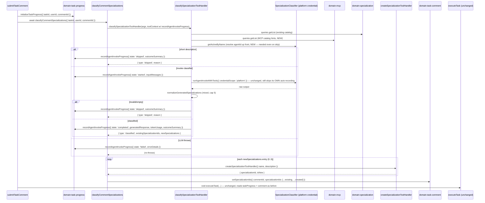

# Multi-Specialization Tasks — Architecture

**Feature slug:** `multi-specialization-tasks`
**Status:** Proposed — ready for implementation
**Reference architectures:** [`specialization/architecture.md`](../specialization/architecture.md) · [`task-skill-planning/architecture.md`](../task-skill-planning/architecture.md) · [`task-plan/architecture.md`](../task-plan/architecture.md) · [`platform-ai-config/architecture.md`](../platform-ai-config/architecture.md)
**Input:** [PRD](./prd.md) (approved — decisions D-1..D-8 locked)

This document extends `specialization/architecture.md` Phase 1/1.1. It does **not** introduce new domains or services — every change is a targeted extension of the existing classify → resolve → persist-plan → execute pipeline shipped in that PRD.

---

## Analysis

### Root cause verification (confirmed in code)

| PRD claim | File | Verified |
|---|---|---|
| Parser is either/or | `services/agent/src/internalTools/classifySpecialization/normalizeGeneratedSpecializations.ts` | ✅ — `newLine !== undefined` branch returns immediately, existing-name matches on the same output are never computed |
| Cap is 3 | same file, `MAX_SPECIALIZATION_RESULTS = 3` (local const) | ✅ |
| "Prefer fewer" in seed | `domains/system-agent/seed/systemAgents.json` → `"Specialization classifier"` rule, item 4 | ✅ |
| Classifier invisible in feed | `classifySpecializationToolHandler` calls `runAgentInvokeWithTools({ credentialScope: 'platform', toolContext: context })`; `classifyCommentSpecializations`'s `toolContext` object never sets `recordAgentInvokeProgress` at all; `runAgentInvokeWithTools` also unconditionally sets `recordProgress = credentialSource === 'platform' ? undefined : ...` | ✅ — **double gap**: (1) the caller never wires the callback, (2) the shared invoke helper would suppress it anyway for `platform` scope |
| Classification runs before `executeTask` | `services/task/src/handlers/submitTaskComment/index.ts` | ✅ — `initializeTaskProgress` → `classifyCommentSpecializations` (awaited) → `void executeTask(...)` (fire-and-forget) |
| Dead code path | `services/task/src/handlers/executeTask/runTaskSpecializationClassification.ts` | ✅ confirmed unused — not imported by `executeTask/index.ts` or any other file except its own module and docs |

### Librarian findings — what exists vs. what's new

| Existing piece | Location | Reuse plan |
|---|---|---|
| `classifySpecializationToolHandler` | `services/agent/src/internalTools/classifySpecialization/index.ts` | **Extended** — mixed parsing, MCP hints, explicit progress recording |
| `normalizeGeneratedSpecializations` | same folder | **Rewritten** — combined result shape, cap 5, deterministic truncation |
| `ClassifySpecializationResult` | `classifySpecialization/types.ts` | **Migrated** (OQ-5) — exclusive union → combined shape |
| `createSpecializationToolHandler` (Command) | `services/agent/src/internalTools/createSpecialization/index.ts` | **Reused unchanged**, now invoked in a loop (0..N times) instead of 0..1 |
| `classifyCommentSpecializations` handler | `services/task/src/handlers/classifyCommentSpecializations/index.ts` | **Extended** — `resolveSpecializationIds` loops new specializations; `toolContext` gains `recordAgentInvokeProgress` |
| `createRecordAgentInvokeProgress` / `recordProgressHelper` (Adapter) | `services/task/src/handlers/executeTask/{createRecordAgentInvokeProgress,recordProgressHelper}.ts` | **Promoted to shared** — moved to `services/task/src/handlers/shared/`, imported by both `executeTask` and `classifyCommentSpecializations` |
| `domain-task-progress` (`recordProgressEvent`, `initializeTaskProgress`, `ProgressEventModel`) | `domains/task-progress/src` | **Extended** — new `Skipped` state, new `outcomeSummary` field; **zero new commands/queries** |
| `getTaskActivityTimeline` progress-event mapping loop | `services/task/src/handlers/getTaskActivityTimeline/index.ts` | **Extended** (pass-through of one new field only) — the classifier's events are picked up **automatically** because it writes into the same `taskProgress` document via the same `commentId`-keyed collection; no new timeline item `kind` needed |
| `ActivityProgressEventRow` / `getProgressRowDisplay` | `apps/web/.../activityProgressEventRow/` | **Extended** — render `outcomeSummary`, add "Skipped" status label |
| `mapMcpsToSpecialization`'s MCP catalog formatting | `services/agent/src/internalTools/createSpecialization/mapMcpsToSpecialization.ts` | **Extracted to shared** `formatMcpCatalogSection` helper, reused by classifier (avoids duplicating the "- name (slug): description" formatting logic — general code rule: no duplicated code) |
| `formatTaskPlannerPlanningSection` | `domains/system-agent/src/utils/buildSystemAgentSystemMessage/` | **Extended** — one new ordering rule appended; no schema change |
| `runAgentInvokeWithTools` | `services/agent/src/internalTools/runAgentInvokeWithTools.ts` | **Unchanged** — see OQ-1 resolution below; this is the key conservative decision of this architecture |
| `taskComment.specializationIds` cap | `domains/task-comment/src/commands/setSpecializationIds/index.ts` | **Extended** — `.max(3)` → `.max(MAX_SPECIALIZATION_RESULTS)` |
| `MAX_SPECIALIZATION_RESULTS` | local const in `normalizeGeneratedSpecializations.ts` | **Promoted** to `packages/constants` (OQ-6) |
| `mcpDomain.queries.getList` | `domains/mcp/src/queries/getList` | **Reused unchanged** — same query already used by `mapMcpsToSpecialization` |
| `domains/task-plan-template` / `domains/task-plan-instance` execution mechanics | `domains/task-plan-*` | **Unchanged** — per FR-TP-2, only Task Planner *prompt guidance* changes, not persisted schema or orchestration loop |

### What is genuinely new

- One new constants file: `packages/constants/src/specialization.ts` (`MAX_SPECIALIZATION_RESULTS`)
- One new shared formatter: `services/agent/src/internalTools/shared/formatMcpCatalogSection.ts`
- One new MCP-hints builder local to the classifier: `services/agent/src/internalTools/classifySpecialization/buildMcpCatalogHintsSection.ts`
- One new enum member: `ProgressEventState.Skipped`
- One new generic field: `outcomeSummary?: string` on `ProgressEventModel` / `AgentInvokeProgressEventInput` / the timeline DTO (deliberately generic — not specialization-specific — so any future skip/outcome-bearing invocation can reuse it)
- **Deletion**: `services/task/src/handlers/executeTask/runTaskSpecializationClassification.ts` (see decision below)

### Design patterns applied

| Pattern | Where | Why |
|---|---|---|
| **Strategy** | `normalizeGeneratedSpecializations` — ordered line-by-line classification into `existing` / `new` / `unrecognized` buckets via a small lookup, replacing the current `if (newLine) return ... else ...` exclusive branch | Same "map object, not exclusive branching" principle already used by `deriveInstanceStatus` (task-plan) and `mapProgressStateToFilterGroup` (activity feed) |
| **Adapter** | `createRecordAgentInvokeProgress` (promoted to shared) adapts `InternalToolContext.recordAgentInvokeProgress` to `domain-task-progress` commands | Reused verbatim — this is the exact same adapter `executeTask` already uses for every other subagent |
| **Facade** | `classifySpecializationToolHandler` | Already a Facade over catalog fetch + agent invocation + normalization; extended (not replaced) to also own its own progress-recording lifecycle |
| **Command** | `createSpecializationToolHandler`, looped 0..N times | No new command — same idempotent create-specialization Command reused per new specialization entry |
| **Decorator** | `buildCatalogMessage` gains an additive MCP-hints section via `buildMcpCatalogHintsSection`; `formatTaskPlannerPlanningSection` gains one additive ordering rule | Same section-composition style as `buildSystemAgentSystemMessage`'s existing Decorator family (`formatSkillsCatalogSection`, `formatTaskPlannerAgentsCatalogSection`) — purely additive, never branches the base message |
| **Null Object / opt-out via absence** | `runAgentInvokeWithTools`'s existing `credentialScope === 'platform' → recordProgress = undefined` branch is left **untouched**; the classifier simply never routes its LLM call's auto-recording through it and instead performs explicit recording itself | Resolves OQ-1 with zero surface-area change to shared infra — see dedicated section below |

### Test strategy

- **Unit** (`tdd-unit-test-writer`): `normalizeGeneratedSpecializations` (all FR-CL-1..5 combinations), `classifySpecializationToolHandler` (skip/success/failure progress recording), `classifyCommentSpecializations`'s `resolveSpecializationIds` (multi-new loop), `setSpecializationIds` cap-5 validation, `formatTaskPlannerPlanningSection` (new rule text present), seed rule drift-guard test, `getTaskActivityTimeline` (`outcomeSummary`/`Skipped` pass-through), UI display helpers (`getProgressRowDisplay`, `getProgressStatusLabel`).
- **E2E** (`tdd-e2e-test-writer`): PRD §7 Gherkin `MSC-*`, `MSP-*`, `AF-*` map to `apps/web` — new feature files under `apps/web/e2e/features/multi-specialization-tasks/`. `AF-*` scenarios need only assert an entry with `agentName: "Specialization classifier"` exists at the correct filter group/status — no new selectors, since it renders through the **existing** `ActivityProgressEventRow`.
- **Regression**: existing `classifySpecialization`/`createSpecialization`/`runAgentInvokeWithTools` test suites must be updated for the type-shape change but their *scenarios* (single-existing-match, single-new, skip-on-short-description) must keep passing — this is a refactor of the result shape, not new business logic for the single-domain case (MSC-6).

---

## Architecture & Package Placement

```
packages/constants/                 ← NEW: MAX_SPECIALIZATION_RESULTS
domains/task-progress/              ← EXTENDED: ProgressEventState.Skipped, outcomeSummary field
domains/task-comment/               ← EXTENDED: setSpecializationIds cap 3→5
domains/system-agent/               ← EXTENDED: seed rule text (classifier), formatTaskPlannerPlanningSection
domains/mcp/                        ← UNCHANGED (getList reused as-is)
domains/task-plan-template/         ← UNCHANGED
domains/task-plan-instance/         ← UNCHANGED

services/agent/                     ← EXTENDED: classifySpecialization (parser, message, progress),
                                        new shared/formatMcpCatalogSection.ts,
                                        mapMcpsToSpecialization.ts refactored to reuse it
services/task/                      ← EXTENDED: classifyCommentSpecializations (multi-new loop,
                                        toolContext wiring), new handlers/shared/ (promoted progress helper),
                                        getTaskActivityTimeline (outcomeSummary pass-through)
                                        REMOVED: executeTask/runTaskSpecializationClassification.ts (dead code)

apps/api/                           ← EXTENDED: TaskActivityItem.outcomeSummary field
ui/api-hooks/                       ← EXTENDED: TaskActivityItemDto.outcomeSummary
apps/web/                           ← EXTENDED: ActivityProgressEventRow renders outcomeSummary + Skipped status
```

### Data flow — classification turn (new)



**No cross-domain imports introduced.** The classifier's progress event is written through the exact same `domain-task-progress` command (`recordProgressEvent`, keyed by `commentId`) that `executeTask`'s researcher/planner/worker/validator invocations already use. Because `getTaskActivityTimeline` already reads *all* events for a comment's `taskProgress` document, the classifier's entries surface in the feed **without any new timeline item kind, new GraphQL type, or new UI row component** — they are indistinguishable in shape from any other subagent's progress events, satisfying PRD §6.3's "not a new, bespoke card type" requirement structurally, not by convention alone.

---

## OQ-1 resolution — activity feed visibility mechanism (most important decision)

### Why not touch `runAgentInvokeWithTools`

`runAgentInvokeWithTools` is called with `credentialScope: 'platform'` from **six** sites today: `classifySpecializationToolHandler`, `invokeSkillPlanner`, `mapMcpsToSpecialization`, `generateSpecializationAgentDescriptions`, `generateSpecializationAgentCustomInstructions`, `generateTaskTitle`. Its current rule — `recordProgress = credentialSource === 'platform' ? undefined : toolContext.recordAgentInvokeProgress` — is a deliberate Strategy from `platform-ai-config/architecture.md` (P-1..P-4): platform-credential calls are *background/system* work, not part of the visible agent-invocation chain, and are intentionally excluded from the feed today. PRD §12's supersedes table is explicit that this general rule must **not** change for the other five call sites.

### Decision: the classifier records its own progress, entirely outside `runAgentInvokeWithTools`

`classifySpecializationToolHandler` already fully owns its invocation lifecycle (it is not reached via the generic `use_agent` chain — it is called directly from `classifyCommentSpecializations`). So instead of threading a flag through the shared helper, the handler:

1. Resolves the classifier's `agentId` **before** any skip check (previously resolved only on the happy path) — needed so even a `short_description` skip has an `agentId` to attribute the feed row to.
2. Calls `toolContext.recordAgentInvokeProgress` **directly** at each transition (`started` → `completed` | `skipped` | `failed`), using the same `AgentInvokeProgressEventInput` shape `runAgentInvokeWithTools` itself uses internally.
3. Still passes `credentialScope: 'platform'` to `runAgentInvokeWithTools` for the actual LLM call — that inner call's *own* auto-recording continues to no-op exactly as it does today (untouched code path), so there is no double-recording risk.
4. Wraps each `recordAgentInvokeProgress` call in a local try/catch that logs via the existing `logClassificationEvent` and never throws — satisfying PRD §9.2 ("activity feed visibility is additive observability, not a blocking dependency").

**Result:** zero lines changed in `runAgentInvokeWithTools.ts` or `resolveCredentialAndClient`. This is the most conservative of the PRD's three suggested options (special-case the call / make the skip opt-in per caller / thread a flag) — it needs none of them, because the classifier never relies on the shared auto-recording in the first place.

### Wiring `recordAgentInvokeProgress` into the classifier's `toolContext`

`classifyCommentSpecializations` currently builds a bare `InternalToolContext` with no callbacks. `createRecordAgentInvokeProgress` (currently private to `executeTask/`) is promoted to `services/task/src/handlers/shared/createRecordAgentInvokeProgress.ts` (with its `recordProgressHelper.ts` dependency moving alongside it), and both `executeTask/index.ts` and `classifyCommentSpecializations/index.ts` import it. Since `submitTaskComment` already calls `initializeTaskProgress({ taskId, userId, commentId })` **before** invoking `classifyCommentSpecializations`, the `taskProgress` document the classifier writes into is guaranteed to exist — no ordering change needed anywhere.

### "Skipped" status and outcome surfacing (AF-3, AF-4)

`ProgressEventState` gains one member: `Skipped = 'skipped'`. `ProgressEventModel` / `AgentInvokeProgressEventInput` / the `recordProgressEvent` command's Zod schema gain one new optional field: `outcomeSummary?: string` — deliberately generic free text (not specialization-typed fields), so it's reusable by any future invocation that wants a one-line takeaway in the feed without a schema explosion. The classifier populates it as:

- Skip: `` `Skipped: ${reason}` `` (e.g. `Skipped: short_description`, `Skipped: invalid_output`)
- Classified: `` `Matched: ${existingNames.join(', ')}` `` and/or `` `Created: ${newNames.join(', ')}` `` (both segments included when mixed, joined with `` ' · ' ``)

`getTaskActivityTimeline`'s existing per-comment progress-event mapping loop passes `outcomeSummary` through unchanged otherwise (one added line). `mapProgressStateToFilterGroup` maps `Skipped` → the existing `'agentFinished'` filter group (no new filter chip/UI needed — a skip is a non-error terminal outcome, closest existing bucket).

`ActivityProgressEventRow` / `getProgressRowDisplay.ts`: add `skipped: 'Skipped'` to `labelByState`; render `outcomeSummary` (when present) as a `Text` line in the expanded details section, directly above "Input" — visible for both skipped and completed states, satisfying AF-1 and AF-4 without a new component.

### Ordering (AF-5)

`getTaskActivityTimeline` items are sorted **descending** by `occurredAt` (newest first) via the existing `sortTimelineItems` — this sort is untouched. Because the classifier's events use real `Date` timestamps recorded strictly before `executeTask`'s own invocation begins, they slot into the feed at the chronologically correct position **using the exact same mechanism every other subagent's events already use**. No bespoke ordering logic is added for the classifier; AF-5 is satisfied structurally (correct `occurredAt`) rather than by special-casing feed placement.

---

## Classifier prompt + parser (Phase P2)

### `ClassifySpecializationResult` type migration (OQ-5)

```typescript
// services/agent/src/internalTools/classifySpecialization/types.ts
export interface NewSpecializationEntry {
  name: string;
  description: string;
}

export type ClassifySpecializationResult =
  | {
      type: 'classified';
      existingSpecializationIds: string[];
      newSpecializations: NewSpecializationEntry[];
    }
  | { type: 'skipped'; reason: string };
```

The prior exclusive `'existing' | 'new' | 'skipped'` union is replaced by a single `'classified'` branch carrying **both** arrays (either may be empty, never both — `normalizeGeneratedSpecializations` guarantees at least one combined entry when `isValid: true`). This is a smaller migration than introducing a fourth `'mixed'` variant: every consumer (`classifyCommentSpecializations.resolveSpecializationIds`) becomes a single code path instead of a 3-way switch.

**Consumers requiring updates:** `classifyCommentSpecializations/index.ts` (`resolveSpecializationIds`), `classifySpecialization/index.test.ts`, `runTaskSpecializationClassification.ts` — the last one is **deleted**, not migrated (see below), because it is confirmed dead code (no importers besides itself/docs) and keeping it compiling against the new type would be pure maintenance overhead with zero behavioral value.

### `normalizeGeneratedSpecializations` rewrite (FR-CL-1..5)

Replaces the current "first check for a `NEW:` line and return early" branch with a single ordered pass:

1. Split/trim/filter non-empty lines. Empty → `{ isValid: false, reason: 'empty_output' }`.
2. Walk lines **in order**; for each line, classify it as `new` (starts with `NEW:`, parses to `name|description`), `existing` (case-insensitive match against the catalog map), or `unrecognized` (silently ignored — the LLM occasionally emits stray prose despite instructions; this already happens today for `invalid_output` cases and is tolerated for the same reason FR-CL-1 asks us not to drop a *valid* branch just because another line is noisy).
3. Append each valid (`new` or `existing`) hit to one **combined ordered accumulator**, deduping by lowercase name (new) / by id (existing). Stop accumulating once the accumulator reaches `MAX_SPECIALIZATION_RESULTS` (5) — remaining lines are read but ignored (FR-CL-4's "first 5 in output order wins", confirmed sufficient per OQ-2 below).
4. Split the accumulator back into `existingSpecializationIds: string[]` and `newSpecializations: NewSpecializationEntry[]`, preserving each bucket's relative order.
5. If both buckets are empty → `{ isValid: false, reason: 'invalid_output' }`.
6. Otherwise → `{ isValid: true, existingSpecializationIds, newSpecializations }`.

This is a pure Strategy rewrite (ordered classification + accumulate-with-cap), not new business logic — same shape of change as `deriveInstanceStatus` in `task-plan/architecture.md`. `too_many_results` is dropped as a skip reason (truncation is now silent/deterministic per the PRD Edge Cases table: "excess entries are not applied... logged as informational, not an error"); the log-worthy signal moves into `logClassificationEvent`'s existing `completed` event (extend its `data` payload with `truncatedCount` for observability, no PRD-forbidden new metric — this is a structured log field, not a new dashboard/metric).

### Prompt / message construction

`buildCatalogMessage` (renamed conceptually but same file) is extended:

```typescript
const buildClassificationMessage = ({
  description,
  catalogItems,
  mcpCatalogSection,
}: BuildClassificationMessageParams): string =>
  [
    `Classify the new comment into up to ${MAX_SPECIALIZATION_RESULTS} topic and tool/platform specializations. Use previous comments only as context.`,
    '',
    description,
    '',
    'Existing specializations:',
    catalogLines,
    '',
    mcpCatalogSection,
  ].join('\n');
```

`buildMcpCatalogHintsSection` (new, in `classifySpecialization/`) calls `mcpDomain.queries.getList({ page: 0, size: MCP_CATALOG_PAGE_SIZE })` (same page size constant pattern as `mapMcpsToSpecialization`) and formats via the newly-extracted shared `formatMcpCatalogSection({ mcps })` (moved out of `mapMcpsToSpecialization.ts`, which is refactored to call the same helper — removing the one place this formatting logic was duplicated). When the MCP catalog is empty, `buildMcpCatalogHintsSection` returns a plain `'No cataloged MCPs.'` line rather than omitting the section (FR-MH-3 — classification proceeds unaffected either way, since the section is advisory-only text).

### Seed rule text (`domains/system-agent/seed/systemAgents.json`)

The `"Specialization classifier"` rule is rewritten to:
1. Remove "Prefer fewer specializations — only include a domain if it is clearly relevant." entirely (FR-CP-1).
2. Raise "1–3" → "up to 5" everywhere (FR-CP-4/D-3).
3. Add an explicit rule: "A named platform or tool (e.g., Notion, Slack, GitHub) mentioned in the request is itself a specialization candidate — classify it exactly like a subject-matter domain, using the same existing-match-or-`NEW:` logic. Prefer names from **Available tools/platforms** below when a mentioned platform matches one." (FR-CP-2, D-1).
4. Document the mixed-output format explicitly with a worked example combining an existing line and a `NEW:` line in one response (FR-CP-3).
5. Reference the injected "Available tools/platforms" section (new heading matching `buildMcpCatalogHintsSection`'s output) as advisory context only.

A new guard test (`domains/system-agent/src/seed/specializationClassifierRule.test.ts`) loads the seed JSON, imports `MAX_SPECIALIZATION_RESULTS` from `@vassembly/constants`, and asserts: (a) the rule text contains the literal cap number, (b) it does **not** contain "prefer fewer" (case-insensitive), (c) it does not contain the old literal "3" cap phrase. This is the drift guard OQ-6 asks for — since JSON seed text cannot `import` a TypeScript constant, the guard is a test-time assertion instead of a compile-time one, which is the standard pattern already used for other "prose must match constant" cases in this codebase (e.g., internal tool descriptions vs. registry IDs).

---

## `resolveSpecializationIds` / `classifyCommentSpecializations` (Phase P2)

```typescript
const resolveSpecializationIds = async ({
  classifyResult,
  toolContext,
}: ResolveSpecializationIdsParams): Promise<string[]> => {
  if (classifyResult.type === 'skipped') {
    return [];
  }

  const createdIds: string[] = [];

  for (const newSpec of classifyResult.newSpecializations) {
    const createRaw = await createSpecializationToolHandler(
      { name: newSpec.name, description: newSpec.description },
      toolContext,
    );
    createdIds.push(parseCreateResult(createRaw).specializationId);
  }

  return [...classifyResult.existingSpecializationIds, ...createdIds];
};
```

Sequential (not `Promise.all`) — same idempotent `create-specialization` Command is reused unchanged; sequential execution avoids any theoretical race between two same-named `NEW:` entries created in the same pass (the PRD's own edge case table already accepts near-duplicate names like "notion"/"notion-workspace" as a known trade-off; sequential execution at least prevents *identical*-name races within a single classification result, which `Promise.all` would not).

`classifyCommentSpecializations`'s `toolContext` gains one field:

```typescript
const toolContext: InternalToolContext = {
  ...existingFields,
  recordAgentInvokeProgress: createRecordAgentInvokeProgress({ taskId, userId, commentId }),
};
```

No other field changes. `setSpecializationIds` is called with the combined array exactly as today (already handles any-length array up to the domain's own cap).

---

## Task Planner cross-specialization ordering (Phase P4, resolves OQ-3)

**Mechanism decision: prompt guidance only, no new structured field.** The existing `persist_task_plan` schema, `TaskPlanTemplateItem`/`TaskPlanInstanceItem` domain models, and the orchestration loop's `order`-based grouping (`groupItemsByOrder`, `Promise.all` within a group) already fully support "N items share `order` X, run in parallel; higher `order` waits for lower `order` to finish" — this is exactly the ordering semantics PRD §5.2 needs. The **only** gap is that the Task Planner's prompt never told it *when* to differentiate `order` across specializations. A structured "dependsOn"/"consumes" field on plan items was considered and rejected: it would touch `persistTaskPlanSchema`, both task-plan domains' models, GraphQL types, and the orchestration loop's `resolveItemInputSlice` — a wide blast radius across an already-shipped feature — for a benefit (explicit producer/consumer graph) that the existing `{{slotName}}` reference mechanism in item `description` (from `task-plan/architecture.md` OQ-2) already lets the planner express informally when it chooses to.

`formatTaskPlannerPlanningSection.ts` gains one new numbered rule (appended after existing rule 7, still before the `persist_task_plan` schema block):

> 8. When ≥2 specializations are present, order items so specializations whose output is a documented input to another specialization's work come first: assign the producing specialization's item(s) a lower `order` than the consuming specialization's item(s) (e.g., a subject-matter research/content item before a tool/platform delivery item that uses its output). Specializations with no such dependency on each other may share the same `order` and run in parallel. A specialization with no dependency on any other specialization's output is `order` 1 regardless of how many other specializations are present.

This directly encodes the worked example in PRD §5.3 and the three plan-splitting Gherkin scenarios (MSP-1..3) without any schema or execution-mechanics change — satisfying FR-TP-1/TP-2/TP-3 verbatim (TP-3: "one item per specialization worker" rule is untouched; TP-2: no execution-mechanics change).

---

## Activity feed — file-level summary

| File | Change |
|---|---|
| `domains/task-progress/src/model/model.ts` | Add `ProgressEventState.Skipped`; add `outcomeSummary?: string` to `ProgressEventModel` |
| `domains/task-progress/src/commands/recordProgressEvent/{index.ts,types.ts}` | Add `outcomeSummary` to Zod schema + `RecordProgressEventInput`; pass through to the pushed event |
| `domains/task-progress/src/commands/recordProgressEvent/index.test.ts` | Add coverage for `outcomeSummary` persistence and `Skipped` state |
| `services/agent/src/internalTools/types.ts` | Add `outcomeSummary?: string` to `AgentInvokeProgressEventInput`; add `'skipped'` to the `state` union |
| `services/task/src/handlers/shared/createRecordAgentInvokeProgress.ts` (moved) | Pass `outcomeSummary` through |
| `services/task/src/handlers/shared/recordProgressHelper.ts` (moved) | Pass `outcomeSummary` through to the domain command |
| `services/task/src/handlers/executeTask/index.ts` | Import `createRecordAgentInvokeProgress` from `../shared` instead of local file |
| `services/task/src/handlers/classifyCommentSpecializations/index.ts` | Import `createRecordAgentInvokeProgress` from `../shared`; wire into `toolContext` |
| `services/task/src/handlers/getTaskActivityTimeline/index.ts` | Pass `outcomeSummary: event.outcomeSummary` through in the `progressEvent` item mapping |
| `services/task/src/handlers/getTaskActivityTimeline/types.ts` | Add `outcomeSummary?: string` to `TaskActivityProgressEventItem`; map `Skipped` state → `'agentFinished'` filter group in `mapProgressStateToFilterGroup` |
| `apps/api/src/graphql/resolvers/taskActivity.ts` | Add `outcomeSummary: t.exposeString('outcomeSummary', { nullable: true })` |
| `ui/api-hooks/src/tasks/.../TaskActivityItemDto` (+ its GraphQL query) | Add `outcomeSummary` field |
| `apps/web/.../activityProgressEventRow/getProgressRowDisplay.ts` | Add `skipped: 'Skipped'` to `labelByState` |
| `apps/web/.../activityProgressEventRow/ActivityProgressEventRow.tsx` | Render `item.outcomeSummary` (when present) in the expanded details section |
| `apps/web/.../activityProgressEventRow/getProgressRowDisplay.test.ts` | Add coverage for the `skipped` label |

**Explicitly not touched:** `TaskActivityItemKind` (no new `'classifierInvocation'` kind), `TaskActivityFeedItem.tsx` (no new branch), `TaskActivityFilter`/`useTaskActivityFeed` (no new filter group), `getTaskActivityTimeline`'s item-push loop structure (the classifier's events flow through the **existing** `resolveCommentProgress` → `events` loop, since they're the same `commentId`'s `taskProgress` document).

---

## File-by-file change list

### `packages/constants`

| File | Action |
|---|---|
| `src/specialization.ts` | Create — `export const MAX_SPECIALIZATION_RESULTS = 5;` |
| `src/index.ts` | Export it |

### `domains/task-progress`

| File | Action |
|---|---|
| `src/model/model.ts` | Add `ProgressEventState.Skipped`, `outcomeSummary?: string` on `ProgressEventModel` |
| `src/commands/recordProgressEvent/{index.ts,types.ts,index.test.ts}` | Extend schema + tests |

### `domains/task-comment`

| File | Action |
|---|---|
| `src/commands/setSpecializationIds/index.ts` | `.max(3)` → `.max(MAX_SPECIALIZATION_RESULTS)`, import from `@vassembly/constants` |
| `src/commands/setSpecializationIds/index.test.ts` | Add 5-item accept / 6-item reject cases |

### `domains/system-agent`

| File | Action |
|---|---|
| `seed/systemAgents.json` | Rewrite `"Specialization classifier"` rule text (remove "prefer fewer", raise cap, add tool/platform + mixed-output guidance) |
| `src/seed/specializationClassifierRule.test.ts` | Create — drift guard (cap number + no "prefer fewer") |
| `src/utils/buildSystemAgentSystemMessage/formatTaskPlannerPlanningSection.ts` | Add ordering rule 8 |
| `src/utils/buildSystemAgentSystemMessage/formatTaskPlannerPlanningSection.test.ts` | Add coverage |

### `services/agent`

| File | Action |
|---|---|
| `src/internalTools/classifySpecialization/types.ts` | Migrate `ClassifySpecializationResult` (OQ-5) |
| `src/internalTools/classifySpecialization/normalizeGeneratedSpecializations.ts` | Rewrite algorithm (FR-CL-1..5) |
| `src/internalTools/classifySpecialization/normalizeGeneratedSpecializations.test.ts` | Rewrite for mixed/cap/dedup cases |
| `src/internalTools/classifySpecialization/index.ts` | Resolve agent up front; explicit progress recording (started/completed/skipped/failed); message includes MCP hints |
| `src/internalTools/classifySpecialization/index.test.ts` | Rewrite for new result shape + progress-recording assertions |
| `src/internalTools/classifySpecialization/buildMcpCatalogHintsSection.ts` | Create |
| `src/internalTools/classifySpecialization/buildMcpCatalogHintsSection.test.ts` | Create |
| `src/internalTools/classifySpecialization/logClassificationEvent.ts` | Extend `data` payload with optional `truncatedCount` |
| `src/internalTools/shared/formatMcpCatalogSection.ts` | Create (extracted) |
| `src/internalTools/shared/formatMcpCatalogSection.test.ts` | Create |
| `src/internalTools/createSpecialization/mapMcpsToSpecialization.ts` | Refactor to call the shared formatter (no behavior change) |
| `src/internalTools/types.ts` | Add `outcomeSummary`, `'skipped'` state |

### `services/task`

| File | Action |
|---|---|
| `src/handlers/shared/createRecordAgentInvokeProgress.ts` | Create (moved from `executeTask/`) |
| `src/handlers/shared/recordProgressHelper.ts` | Create (moved from `executeTask/`) |
| `src/handlers/executeTask/createRecordAgentInvokeProgress.ts`, `recordProgressHelper.ts` | Delete (moved) |
| `src/handlers/executeTask/index.ts` | Update import path only |
| `src/handlers/executeTask/runTaskSpecializationClassification.ts` | **Delete** (confirmed dead; incompatible with new type without behavioral value) |
| `src/handlers/classifyCommentSpecializations/index.ts` | Loop over `newSpecializations`; wire `recordAgentInvokeProgress` into `toolContext` |
| `src/handlers/classifyCommentSpecializations/types.ts` | No change (input shape unaffected) |
| `src/handlers/getTaskActivityTimeline/index.ts` | Pass through `outcomeSummary` |
| `src/handlers/getTaskActivityTimeline/types.ts` | Add `outcomeSummary` field; map `Skipped` → `'agentFinished'` |
| `src/handlers/getTaskActivityTimeline/index.test.ts` | Add coverage for classifier progress event + `outcomeSummary` |

### `apps/api`

| File | Action |
|---|---|
| `src/graphql/resolvers/taskActivity.ts` | Add `outcomeSummary` field |
| `src/graphql/resolvers/taskActivity.test.ts` | Add coverage |

### `ui/api-hooks`

| File | Action |
|---|---|
| `src/tasks/graphql/getTaskActivityTimelineQuery.ts` | Add `outcomeSummary` |
| `src/tasks/mapTaskActivityTimeline.ts` (or equivalent DTO mapper) | Add `outcomeSummary` |

### `apps/web`

| File | Action |
|---|---|
| `app/tasks/[id]/_components/TaskActivityFeed/activityProgressEventRow/getProgressRowDisplay.ts` | Add `skipped` label |
| `.../getProgressRowDisplay.test.ts` | Add coverage |
| `.../ActivityProgressEventRow.tsx` | Render `outcomeSummary` |
| `e2e/features/multi-specialization-tasks/*.feature` | Create (MSC-*, MSP-*, AF-* scenarios) |

---

## Implementation phases

*(Numbered P2–P6, continuing after `specialization/architecture.md`'s Phase 1 / Phase 1.1)*

### P2 — Classifier correctness (parser, prompt, cap, constant)

| Work |
|---|
| `packages/constants` — `MAX_SPECIALIZATION_RESULTS` |
| `ClassifySpecializationResult` type migration |
| `normalizeGeneratedSpecializations` rewrite (mixed, cap 5, truncation) |
| `classifySpecializationToolHandler` — mixed result construction (progress recording deferred to P5, added in the same file but see P5 for that half) |
| `classifyCommentSpecializations.resolveSpecializationIds` — loop over `newSpecializations` |
| `domains/task-comment` cap 3→5 |
| Seed rule text rewrite (remove "prefer fewer", raise cap, tool/platform + mixed-output guidance) + drift-guard test |
| Delete `runTaskSpecializationClassification.ts` |

**Files:** `packages/constants/{src/specialization.ts,src/index.ts}`; `services/agent/src/internalTools/classifySpecialization/{types.ts,normalizeGeneratedSpecializations.ts,normalizeGeneratedSpecializations.test.ts,index.ts,index.test.ts}`; `services/task/src/handlers/classifyCommentSpecializations/index.ts`; `domains/task-comment/src/commands/setSpecializationIds/{index.ts,index.test.ts}`; `domains/system-agent/seed/systemAgents.json`; `domains/system-agent/src/seed/specializationClassifierRule.test.ts`; `services/task/src/handlers/executeTask/runTaskSpecializationClassification.ts` (deleted).

### P3 — MCP catalog hints

| Work |
|---|
| Extract `formatMcpCatalogSection` shared helper; refactor `mapMcpsToSpecialization` to use it |
| `buildMcpCatalogHintsSection` + wire into classifier's message |

**Files:** `services/agent/src/internalTools/shared/formatMcpCatalogSection.ts` (+test); `services/agent/src/internalTools/createSpecialization/mapMcpsToSpecialization.ts`; `services/agent/src/internalTools/classifySpecialization/{buildMcpCatalogHintsSection.ts,index.ts}` (+tests).

### P4 — Planner cross-specialization ordering

| Work |
|---|
| Append ordering rule 8 to `formatTaskPlannerPlanningSection` |

**Files:** `domains/system-agent/src/utils/buildSystemAgentSystemMessage/formatTaskPlannerPlanningSection.ts` (+test).

### P5 — Activity feed visibility

| Work |
|---|
| `domain-task-progress`: `Skipped` state, `outcomeSummary` field, schema + tests |
| Promote `createRecordAgentInvokeProgress`/`recordProgressHelper` to `services/task/src/handlers/shared/` |
| Wire `recordAgentInvokeProgress` into `classifyCommentSpecializations`'s `toolContext` |
| `classifySpecializationToolHandler`: resolve agent up front; explicit started/completed/skipped/failed recording with try/catch-and-log |
| `getTaskActivityTimeline` + GraphQL + `ui/api-hooks`: `outcomeSummary` pass-through; `Skipped` → filter group mapping |
| `apps/web`: `ActivityProgressEventRow` renders `outcomeSummary`; `Skipped` status label |

**Files:** `domains/task-progress/src/model/model.ts`; `domains/task-progress/src/commands/recordProgressEvent/{index.ts,types.ts,index.test.ts}`; `services/agent/src/internalTools/types.ts`; `services/task/src/handlers/shared/{createRecordAgentInvokeProgress.ts,recordProgressHelper.ts}` (new); `services/task/src/handlers/executeTask/index.ts` (import path); `services/task/src/handlers/executeTask/{createRecordAgentInvokeProgress.ts,recordProgressHelper.ts}` (deleted, moved); `services/task/src/handlers/classifyCommentSpecializations/index.ts`; `services/agent/src/internalTools/classifySpecialization/index.ts`; `services/task/src/handlers/getTaskActivityTimeline/{index.ts,types.ts,index.test.ts}`; `apps/api/src/graphql/resolvers/taskActivity.ts`; `ui/api-hooks/src/tasks/*`; `apps/web/.../activityProgressEventRow/{ActivityProgressEventRow.tsx,getProgressRowDisplay.ts,getProgressRowDisplay.test.ts}`.

### P6 — Tests, E2E, hardening

| Work |
|---|
| Full unit coverage across P2/P3/P4/P5 changes (see Test Strategy) |
| E2E: `MSC-1..6`, `MSP-1..3`, `AF-1..5` Playwright BDD features |
| Regression pass: single-domain classification (MSC-6) unaffected; existing `runAgentInvokeWithTools`/`invokeSkillPlanner`/`mapMcpsToSpecialization`/`generateTaskTitle` platform-credential skip behavior unaffected; existing `TaskActivityFeed` rendering for non-classifier rows unaffected |

**Files:** `apps/web/e2e/features/multi-specialization-tasks/*.feature`; `apps/web/e2e/steps/multi-specialization-tasks/*.ts` (only if new step definitions are needed beyond existing task-activity/comment steps).

**Dependencies:** P2 → P5 (P5's classifier progress recording depends on the P2 result-shape migration being in place); P3 and P4 are independent of P2/P5 and each other; P6 runs continuously alongside P2–P5 per todo, with E2E finalized once P2/P3/P4/P5 land.

---

## Todo Plan

```
1. packages/constants — MAX_SPECIALIZATION_RESULTS
   Changes needed: add shared constant, export it
   Files: src/specialization.ts, src/index.ts
   Suggested subagent workflow: coder → Done
   Dependencies: none

2. domains/task-comment — cap 3→5
   Changes needed: import MAX_SPECIALIZATION_RESULTS, replace .max(3)
   Files: src/commands/setSpecializationIds/{index.ts,index.test.ts}
   Suggested subagent workflow: tdd-unit-test-writer → coder ↔ code-reviewer (loop: max 2)
   Dependencies: todo #1

3. domains/system-agent — seed rule + planner ordering + drift guard
   Changes needed: rewrite classifier rule text; add ordering rule 8 to
                   formatTaskPlannerPlanningSection; add drift-guard test
   Files: seed/systemAgents.json, src/seed/specializationClassifierRule.test.ts,
          src/utils/buildSystemAgentSystemMessage/formatTaskPlannerPlanningSection.ts (+test)
   Suggested subagent workflow: tdd-unit-test-writer → coder ↔ code-reviewer (loop: max 2)
   Dependencies: todo #1

4. domains/task-progress — Skipped state + outcomeSummary field
   Changes needed: extend ProgressEventState, ProgressEventModel, recordProgressEvent schema
   Files: src/model/model.ts, src/commands/recordProgressEvent/{index.ts,types.ts,index.test.ts}
   Suggested subagent workflow: tdd-unit-test-writer → coder ↔ code-reviewer (loop: max 2)
   Dependencies: none

5. services/agent — classifier parser/type migration + progress recording + MCP hints
   Changes needed:
     (a) migrate ClassifySpecializationResult, rewrite normalizeGeneratedSpecializations
     (b) extract formatMcpCatalogSection shared helper; refactor mapMcpsToSpecialization
     (c) buildMcpCatalogHintsSection; extend buildCatalogMessage
     (d) classifySpecializationToolHandler: resolve agent up front, explicit
         started/completed/skipped/failed progress recording (try/catch-and-log),
         outcomeSummary construction
     (e) extend AgentInvokeProgressEventInput / InternalToolContext types
   Files: src/internalTools/classifySpecialization/{types.ts,normalizeGeneratedSpecializations.ts,
          normalizeGeneratedSpecializations.test.ts,index.ts,index.test.ts,
          buildMcpCatalogHintsSection.ts(+test),logClassificationEvent.ts},
          src/internalTools/shared/formatMcpCatalogSection.ts(+test),
          src/internalTools/createSpecialization/mapMcpsToSpecialization.ts,
          src/internalTools/types.ts
   Suggested subagent workflow: tdd-unit-test-writer → coder ↔ code-reviewer (loop: max 2) → documentation-writer
   Dependencies: todos #1, #4

6. services/task — resolveSpecializationIds loop, progress helper promotion, timeline pass-through, dead code removal
   Changes needed:
     (a) promote createRecordAgentInvokeProgress/recordProgressHelper to handlers/shared/
     (b) wire recordAgentInvokeProgress into classifyCommentSpecializations's toolContext
     (c) loop createSpecializationToolHandler over newSpecializations
     (d) getTaskActivityTimeline: pass through outcomeSummary; map Skipped state
     (e) delete runTaskSpecializationClassification.ts
   Files: src/handlers/shared/{createRecordAgentInvokeProgress.ts,recordProgressHelper.ts}(new),
          src/handlers/executeTask/index.ts (import path),
          src/handlers/executeTask/{createRecordAgentInvokeProgress.ts,recordProgressHelper.ts}(deleted),
          src/handlers/executeTask/runTaskSpecializationClassification.ts (deleted),
          src/handlers/classifyCommentSpecializations/index.ts,
          src/handlers/getTaskActivityTimeline/{index.ts,types.ts,index.test.ts}
   Suggested subagent workflow: tdd-unit-test-writer → coder ↔ code-reviewer (loop: max 2)
   Dependencies: todos #4, #5

7. apps/api + ui/api-hooks — outcomeSummary field exposure
   Changes needed: expose outcomeSummary on TaskActivityItem GraphQL type;
                   add to timeline query + DTO mapper
   Files: apps/api/src/graphql/resolvers/taskActivity.ts(+test),
          ui/api-hooks/src/tasks/graphql/getTaskActivityTimelineQuery.ts,
          ui/api-hooks/src/tasks/mapTaskActivityTimeline.ts
   Suggested subagent workflow: coder ↔ code-reviewer (loop: max 2)
   Dependencies: todo #6

8. apps/web — render outcomeSummary + Skipped status
   Changes needed: add 'skipped' status label; render outcomeSummary in
                   expanded progress-event details
   Files: app/tasks/[id]/_components/TaskActivityFeed/activityProgressEventRow/
          {getProgressRowDisplay.ts(+test),ActivityProgressEventRow.tsx}
   Suggested subagent workflow: coder ↔ code-reviewer (loop: max 2)
   Dependencies: todo #7

9. apps/web — E2E feature files
   Changes needed: Playwright BDD features for MSC-1..6, MSP-1..3, AF-1..5
   Files: e2e/features/multi-specialization-tasks/*.feature,
          e2e/steps/multi-specialization-tasks/*.ts (only if new steps needed)
   Suggested subagent workflow: tdd-e2e-test-writer → coder ↔ code-reviewer (loop: max 2)
   Dependencies: todos #5, #6, #8 (needs classifier + feed behavior live to pass)
```

### Parallelism

- **Batch 1 (no deps):** #1, #4
- **Batch 2:** #2, #3 (dep #1)
- **Batch 3:** #5 (deps #1, #4)
- **Batch 4:** #6 (deps #4, #5)
- **Batch 5:** #7 (dep #6)
- **Batch 6:** #8 (dep #7)
- **Batch 7:** #9 (deps #5, #6, #8)

---

## Test strategy (detail)

| Area | Scenarios |
|---|---|
| `normalizeGeneratedSpecializations` | Empty output → `empty_output`; 2 existing + 1 `NEW:` → all 3 combined (MSC-2); 2 `NEW:` lines → both created (FR-CL-5); 6 valid lines → first 5 in order retained, 6th dropped (MSC-4); all-unrecognized lines → `invalid_output`; single existing match → unaffected (MSC-6); case-insensitive existing match; duplicate `NEW:` names deduped |
| `classifySpecializationToolHandler` | short-description skip → `recordAgentInvokeProgress` called once with `state: 'skipped'`, agentId populated; successful classified result → started+completed progress calls with `outcomeSummary` reflecting matched/created names; invalid/empty normalize result → started+skipped; LLM throws → started+failed, error re-thrown; `recordAgentInvokeProgress` throwing internally does not prevent classification result from being returned (fire-and-log) |
| `classifyCommentSpecializations.resolveSpecializationIds` | skipped → `[]`; existing-only → passthrough ids; new-only (1 entry) → 1 create call; mixed (2 existing + 2 new) → 4 total ids, 2 create calls in sequence |
| `setSpecializationIds` | 5-item array accepted; 6-item array rejected with `ValidationError` |
| `formatTaskPlannerPlanningSection` | new rule text present; existing rules 1–7 unchanged verbatim |
| `specializationClassifierRule` (seed guard) | rule text contains `"5"`; does not contain "prefer fewer" (case-insensitive); does not contain old "1–3" phrasing |
| `getTaskActivityTimeline` | classifier's progress events appear as `progressEvent` items with `outcomeSummary`; `Skipped` state maps to `'agentFinished'` filter group |
| `getProgressRowDisplay` | `'skipped'` state → `"Skipped"` label |
| E2E (`apps/web/e2e/features/multi-specialization-tasks/`) | MSC-1 (meals+Notion → 2 ids); MSC-2 (mixed pass); MSC-3 (tool-as-specialization + MCP-name alignment); MSC-4 (cap at 5); MSC-6 (single-domain unaffected); MSP-1 (ordered plan items); MSP-2 (parallel independent specs); MSP-3 (standalone tool step order 1); AF-1 (classifier entry full detail); AF-2 (platform-credential still recorded); AF-3 (skipped entry + reason); AF-4 (new specialization surfaced inline); AF-5 (correct chronological position via existing sort) |
| Regression | `runAgentInvokeWithTools.test.ts` — all 5 other `credentialScope: 'platform'` call sites' skip behavior unchanged; existing `TaskActivityFeed` progressEvent rendering for researcher/planner/worker/validator rows unaffected by the new optional field; `create-specialization` idempotency holds across multiple sequential creates in one classification pass |

---

## Decisions table (resolving OQ-1 through OQ-6)

| # | Question | Resolution |
|---|---|---|
| **OQ-1** | Mechanism for recording the classifier's progress without altering the general platform-credential skip behavior | The classifier's own handler (`classifySpecializationToolHandler`) records `started`/`completed`/`skipped`/`failed` progress **directly** via `toolContext.recordAgentInvokeProgress`, entirely independent of `runAgentInvokeWithTools`'s internal auto-recording (which continues, unmodified, to no-op for `credentialScope: 'platform'`). Zero changes to `runAgentInvokeWithTools.ts`. The `toolContext` passed into `classifyCommentSpecializations` gains the callback (reusing the existing `createRecordAgentInvokeProgress` adapter, promoted to a shared location). |
| **OQ-2** | Truncation strategy when output exceeds the cap | Confirmed sufficient as proposed: first 5 valid entries in output order win (both existing-matches and `NEW:` entries interleaved by appearance order); excess entries silently dropped, logged as an informational `truncatedCount` field on the existing `specialization.classification.completed` log event — no re-prompting, no confidence scoring, no new metric. |
| **OQ-3** | Producer/consumer ordering mechanism | Prompt guidance only (new rule 8 in `formatTaskPlannerPlanningSection`) — no new structured "dependsOn" field. The existing `order`-based grouping already fully supports the desired execution semantics; a structured dependency graph would touch the already-shipped `persist_task_plan` schema and both task-plan domains for no behavioral gain over prompt guidance + the existing `{{slotName}}` reference mechanism. |
| **OQ-4** | MCP Specialization Classifier feed visibility | **Not addressed by this architecture** — confirmed out of scope per PRD §6.4/§15; noted as a natural follow-up once this pattern (handler-owned explicit progress recording) exists, since `mapMcpsToSpecialization` could adopt the identical technique later with no changes to shared infra required then either. |
| **OQ-5** | `ClassifySpecializationResult` migration path | Exclusive 3-way union → 2-way union: `{ type: 'classified'; existingSpecializationIds: string[]; newSpecializations: NewSpecializationEntry[] }` \| `{ type: 'skipped'; reason: string }`. Only consumer is `classifyCommentSpecializations.resolveSpecializationIds`, rewritten to a single loop. The other historical consumer, `runTaskSpecializationClassification.ts`, is confirmed dead code (no live importers) and is **deleted** rather than migrated. |
| **OQ-6** | `MAX_SPECIALIZATION_RESULTS` shared constant | Promoted to `packages/constants/src/specialization.ts`, imported by the parser (`services/agent`) and the domain cap (`domains/task-comment`). The seed JSON prose (which cannot import a TS constant) is guarded by a new unit test asserting the literal cap number in the rule text matches the constant, preventing silent drift. |

---

## Risks & mitigations

| Risk | Mitigation |
|---|---|
| Resolving the classifier `agentId` before the short-description skip check adds one extra DB read (`getActiveByName`) even when skipping | Negligible cost (single indexed lookup, already performed on every non-skip path today); required to attribute even skipped feed rows to "Specialization classifier" per AF-3 |
| `recordAgentInvokeProgress` failing mid-classification could otherwise break classification | Wrapped in a local try/catch inside the classifier handler that logs via `logClassificationEvent` and never re-throws — classification and specialization assignment always complete regardless of feed-recording failures (PRD §9.2) |
| Sequential (not parallel) creation of multiple `newSpecializations` slightly increases latency for multi-new-domain classifications | Acceptable — at most 5 creates in the worst case, each already bounded by `create-specialization`'s own p95; avoids a same-pass duplicate-name race that `Promise.all` could introduce |
| Reusing the generic `progressEvent` item (rather than a new `classifierInvocation` kind) means classifier rows are visually and structurally identical to other subagent rows | This is the explicit PRD requirement (§6.3: "not a new, bespoke card type") — treated as a feature, not a limitation; `outcomeSummary` gives it just enough differentiation for AF-4 |
| Deleting `runTaskSpecializationClassification.ts` removes a file the original Specialization PRD once referenced | Confirmed zero live importers via repo-wide search; PRD FR-AF-6 explicitly leaves its fate to architect discretion, and keeping it would require migrating it to the new type for no behavioral benefit (dead code) |
| Raising the cap to 5 without a "prefer fewer" instruct could cause the LLM to over-classify simple requests | Mitigated by prompt wording ("as many as **genuinely apply**, up to 5" — not "always aim for 5") and MSC-6's explicit regression scenario (single-domain prompts still yield exactly 1) |
| `outcomeSummary` free-text field could be misused for structured data later, causing schema creep | Kept intentionally as a single optional string (not a nested object) — any future structured need should get its own typed field/timeline kind rather than overloading this one |

---

*End of architecture — 0 new domains/services, 1 new shared constant, 1 new enum member + 1 new generic field on an existing domain, 1 dead file removed, 5 implementation phases (P2–P6).*
