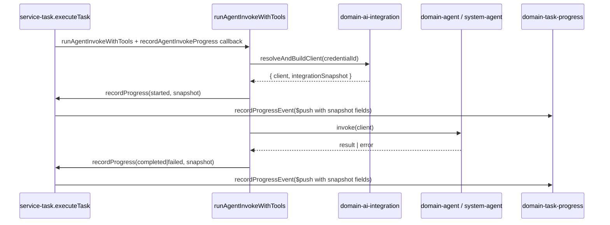

# Architecture Implementation Plan: AI Integration Info in Task Progress Events

**Document status:** Engineering handoff  
**Last updated:** 2026-06-15  
**Feature slug:** `progress-event-ai-integration`  
**Related docs:** [Real-Time Execution Progress](../real-time-execution-progress/architecture.md) · [AI Integrations](../ai-integrations/architecture.md)

---

## Table of Contents

1. [Analysis](#1-analysis)
2. [Architecture & Package Placement](#2-architecture--package-placement)
3. [Data Model Changes](#3-data-model-changes)
4. [Data Flow](#4-data-flow)
5. [Recommendation](#5-recommendation)
6. [Implementation Steps](#6-implementation-steps)
7. [Todo Plan](#7-todo-plan)
8. [Test Strategy](#8-test-strategy)

---

## 1. Analysis

### 1.1 Requirements (approved)

| # | Requirement |
|---|-------------|
| 1 | **Snapshot at write time** — store integration info on the event when recorded; no live credential lookup on read |
| 2 | **Scope** — task execution progress only (wired via `executeTask` callback); manual agent invokes omit the callback |
| 3 | **UI scope** — `ProgressDetailModal` only; no inline display on progress list rows |
| 4 | **Fields** — `integrationName`, `provider`, `model` only; **no** `integrationCredentialId` |
| 5 | **Nested agents** — each event carries its own integration info (nested invokes may use different credentials) |
| 6 | **Legacy events** — hide AI Integration section when fields are absent |
| 7 | **Provider labels** — human-readable in UI (e.g. "OpenAI ChatGPT", not `chatgpt`) |

### 1.2 Existing code audit

| Area | What exists | Gap |
|------|-------------|-----|
| `domains/task-progress` | `ProgressEventModel`, `recordProgressEvent`, GraphQL `ProgressEvent` type, DTO mappers | No AI integration fields |
| `domains/ai-integration` | `resolveAndBuildClient` loads credential (`name`, `provider`, `model`) then returns `ModeledProviderClient` only — metadata discarded | Must return snapshot alongside client |
| `services/agent` | `runAgentInvokeWithTools` calls `resolveAndBuildClient` inside invoke helpers; records progress via injected callback on started/completed/failed | Must resolve **before** started event; pass snapshot into all three progress records |
| `services/task` | `createRecordAgentInvokeProgress` → `recordProgressHelper` → `recordProgressEvent` — **only** wired from `executeTask` | Thin pass-through for new fields |
| `apps/api` | `taskProgress` GraphQL resolver enriches `agentName` at read time (opposite pattern) | Schema auto-extends from domain `gqlSchema`; no resolver enrichment needed |
| `ui/execution-progress-tracker` | Modal metadata for timestamp, duration, tokens, I/O | Query, normalize, types, modal section missing |
| Provider labels | `PROVIDER_LABELS` in `ui/api-hooks/src/aiIntegrations/constants.ts` | Not shared with execution-progress-tracker |

### 1.3 Domain isolation

- `domain-task-progress` **cannot** import `domain-ai-integration`.
- Snapshot is assembled in **`services/agent`** after `resolveAndBuildClient`, then passed as plain strings into `recordProgressEvent`.
- Manual invokes (`invokePersonalAgent`, `invokeSystemAgent`) do not pass `recordAgentInvokeProgress` — **no change required** to exclude them.

### 1.4 Nested agents

`useAgent` internal tool spreads `toolContext`, preserving `recordAgentInvokeProgress`. Each nested `runAgentInvokeWithTools` call resolves its own credential (personal agent credential or system preference) and must snapshot independently.

### 1.5 New packages

**None required.** Extend existing domains, services, constants package, and UI component.

---

## 2. Architecture & Package Placement

```
┌─────────────────────────────────────────────────────────────────────────┐
│                     Write path (task execution only)                     │
└─────────────────────────────────────────────────────────────────────────┘

apps/api createTask
  → service-task.executeTask
      → createRecordAgentInvokeProgress (callback factory)
      → service-agent.runAgentInvokeWithTools
          1. Resolve credentialId (agent or preference)
          2. domain-ai-integration.resolveAndBuildClient
             → { client, integrationSnapshot }
          3. recordProgress(started, …snapshot)        ← NEW: resolve before started
          4. domain-agent.invoke | domain-system-agent.invoke(client)
          5. recordProgress(completed|failed, …snapshot)
      → domain-task-progress.recordProgressEvent ($push flat fields)
      → domain-task-progress.finalizeTaskProgress

┌─────────────────────────────────────────────────────────────────────────┐
│                     Read path (GraphQL poll)                             │
└─────────────────────────────────────────────────────────────────────────┘

ui/execution-progress-tracker (poll)
  → apps/api GraphQL taskProgress(taskId)
      → domain-task-progress.getTaskProgressByTaskId
      → enrich agentName only (existing resolver)
  → normalizeTaskProgress
  → ProgressDetailModal (AI Integration section, legacy-safe)
```

### Package responsibilities

| Package | Role |
|---------|------|
| `domains/ai-integration` | Return `{ client, integrationSnapshot }` from `resolveAndBuildClient`; export snapshot type |
| `domains/task-progress` | Persist and expose optional flat fields on `ProgressEventModel` / GraphQL |
| `services/agent` | Resolve before started; attach snapshot to all progress callback invocations |
| `services/task` | Pass-through snapshot fields through callback chain |
| `packages/constants` | Single source of truth for `AI_INTEGRATION_PROVIDER_LABELS` |
| `ui/api-hooks` | Re-export labels from constants (backward compatible) |
| `ui/execution-progress-tracker` | Query fields, normalize, modal UI, label lookup |
| `apps/api` | No handler changes expected (domain gqlSchema drives schema) |

---

## 3. Data Model Changes

### 3.1 `AiIntegrationSnapshot` (domain-ai-integration)

New exported type in `domains/ai-integration/src/commands/resolveAndBuildClient/types.ts`:

```typescript
export interface AiIntegrationSnapshot {
  integrationName: string;
  provider: string; // AiIntegrationProvider enum value, e.g. 'chatgpt'
  model: string;
}
```

Built from credential at resolve time:

| Field | Source | Notes |
|-------|--------|-------|
| `integrationName` | `credential.name` | User-defined integration label |
| `provider` | `credential.provider` | Stored enum value, not display label |
| `model` | `credential.model \|\| ''` | Empty string if unset (consistent with client build) |

### 3.2 `ProgressEventModel` (domain-task-progress)

Add **optional flat fields** to `domains/task-progress/src/model/model.ts`:

```typescript
export interface ProgressEventModel {
  // …existing fields…
  integrationName?: string;
  provider?: string;
  model?: string;
}
```

| Field | Required on write | Required on read | Notes |
|-------|-------------------|------------------|-------|
| `integrationName` | No (optional) | No | Present on new task-execution events after this feature |
| `provider` | No | No | Raw provider id; UI maps to label |
| `model` | No | No | Model id string |

**Legacy:** existing MongoDB documents omit these keys → GraphQL returns `null` → UI hides section.

**Validation (Zod in `recordProgressEvent`):** all three optional `z.string()`; no cross-field requirement (snapshot always written together by service layer).

### 3.3 DTO & GraphQL

Extend in parallel:

- `ProgressEventResponse` in `domains/task-progress/src/model/dto.ts`
- `toProgressEventResponse` in `domains/task-progress/src/model/toTaskProgressResponse.ts`
- `ProgressEvent` in `domains/task-progress/src/model/graphql.ts` — three nullable string fields
- `RecordProgressEventInput` in `domains/task-progress/src/commands/recordProgressEvent/types.ts`

No new GraphQL types; flat nullable strings on `ProgressEvent`.

### 3.4 Service-layer callback types

Extend `AgentInvokeProgressEventInput` in `services/agent/src/helpers/internalTools/types.ts`:

```typescript
export interface AgentInvokeProgressEventInput {
  // …existing…
  integrationName?: string;
  provider?: string;
  model?: string;
}
```

Mirror in `services/task/src/handlers/recordTaskProgress/types.ts` (`RecordTaskProgressInput`).

---

## 4. Data Flow

### 4.1 Credential resolve → event record



**Critical ordering change:** `resolveAndBuildClient` must run **before** the `started` progress record so started events include the snapshot (requirement #5).

If resolve throws, no `started` event is recorded (same as today when invoke fails early — but today started is recorded *before* resolve). **New behavior:** resolve moves above started; a resolve failure produces **no** started event. This is acceptable — the agent never actually started.

### 4.2 GraphQL → modal

```
ProgressEvent (GraphQL)
  integrationName?: string | null
  provider?: string | null
  model?: string | null
    ↓ normalizeTaskProgress
ProgressEvent (UI type)
    ↓ ProgressDetailModal
  if (integrationName || provider || model) → render "AI Integration" section
  provider display → getProviderLabel(provider) from @vassembly/constants
```

**Legacy rule:** hide section when **all three** are absent/null/empty.

### 4.3 `resolveAndBuildClient` — non-breaking strategy

**Current:** `ResolveAndBuildClientResult = ModeledProviderClient`

**Proposed:** structured result object:

```typescript
export interface ResolveAndBuildClientResult {
  client: ModeledProviderClient;
  integrationSnapshot: AiIntegrationSnapshot;
}
```

| Concern | Mitigation |
|---------|------------|
| Breaking return type | Only **one** production caller: `runAgentInvokeWithTools.ts` (2 destructuring sites). Update mocks in `runAgentInvokeWithTools.test.ts`, `invokePersonalAgent/index.test.ts`, `invokeSystemAgent/index.test.ts` |
| Callers expecting bare client | Destructure `{ client }` at call site; pass `client` to `domain-agent.commands.invoke` unchanged |
| Type export | Export `AiIntegrationSnapshot` from `domain-ai-integration` index for service-layer typing |

**Rejected alternatives:**

- Attach snapshot on client object — obscures typing; `ModeledProviderClient` is external
- Separate `resolveCredentialMetadata` query — duplicate DB read; violates snapshot-at-resolve simplicity

### 4.4 Provider label mapping

**Strategy:** extract labels to `@vassembly/constants`; reuse everywhere.

| Location | Change |
|----------|--------|
| `packages/constants/src/aiIntegrationProviderLabels.ts` | **New** — `AI_INTEGRATION_PROVIDER_LABELS: Record<string, string>` (same map as today) |
| `packages/constants/src/index.ts` | Export new constant |
| `ui/api-hooks/src/aiIntegrations/constants.ts` | `PROVIDER_LABELS` re-exports from `@vassembly/constants` (no consumer breakage) |
| `ui/execution-progress-tracker/src/utils/getProviderLabel.ts` | **New** — `getProviderLabel({ provider })` using `AI_INTEGRATION_PROVIDER_LABELS`; fallback to raw value |

Example labels (unchanged):

| Stored `provider` | Display label |
|-------------------|---------------|
| `chatgpt` | OpenAI ChatGPT |
| `gemini` | Google Gemini |
| `anthropic` | Anthropic |
| `deep_seek` | Deep Seek |
| `lm_studio` | LM Studio (Local) |

---

## 5. Recommendation

**Most conservative approach:** extend existing snapshot-friendly flat fields on `ProgressEventModel`; change `resolveAndBuildClient` to return `{ client, integrationSnapshot }`; restructure `runAgentInvokeWithTools` to resolve before recording `started`; pass-through via existing callback chain; expose via domain GraphQL schema; display only in `ProgressDetailModal` with shared provider labels from `@vassembly/constants`.

**Why this minimizes scope:**

- No new domain, service, or collection
- No read-time joins (contrast with `agentName` enrichment)
- No API route changes (writes remain internal commands)
- Manual invokes unchanged (callback not wired)
- UI change isolated to one modal component + query/normalize

**Trade-offs:**

| Trade-off | Decision |
|-----------|----------|
| Resolve-before-started changes failure semantics | Acceptable — no spurious started events on bad credentials |
| Provider label extraction touches constants + api-hooks | Small, one-time; prevents duplication in UI package |
| Stored provider is raw enum value | Correct for snapshot stability if labels change later |

---

## 6. Implementation Steps

Ordered steps for coder execution:

1. **Extract provider labels** — `packages/constants/src/aiIntegrationProviderLabels.ts`; update `ui/api-hooks` to re-export
2. **Extend `resolveAndBuildClient`** — return `{ client, integrationSnapshot }`; export `AiIntegrationSnapshot` type
3. **Extend task-progress model** — `ProgressEventModel`, DTO, mapper, Zod schema, GraphQL fields, command input types
4. **Restructure `runAgentInvokeWithTools`** — extract credential resolution to top of function (before started record); destructure `{ client, integrationSnapshot }`; spread snapshot into all `recordProgress` calls; pass `client` into refactored invoke helpers
5. **Pass-through in service-task** — `createRecordAgentInvokeProgress`, `recordProgressHelper`, `RecordTaskProgressInput`
6. **UI package** — GraphQL query fields, `types.ts`, `normalizeTaskProgress.ts`, `getProviderLabel.ts`, `ProgressDetailModal.tsx` section + styles
7. **Verify apps/api** — type-check; GraphQL schema picks up domain fields automatically
8. **Update tests** — see Test Strategy
9. **Optional:** update `apps/web/e2e/fixtures/taskProgress.ts` with sample integration fields for future E2E

---

## 7. Todo Plan

### 1. **@vassembly/constants** — [Type: utility]

- **Changes needed:** Add `AI_INTEGRATION_PROVIDER_LABELS`; export from index
- **Files:** `packages/constants/src/aiIntegrationProviderLabels.ts`, `packages/constants/src/index.ts`
- **Suggested subagent workflow:** coder → Done
- **Dependencies:** None

### 2. **@vassembly/ui-api-hooks** — [Type: utility re-export]

- **Changes needed:** Re-export `PROVIDER_LABELS` from constants (preserve existing export name)
- **Files:** `ui/api-hooks/src/aiIntegrations/constants.ts`
- **Suggested subagent workflow:** coder → Done
- **Dependencies:** Todo 1

### 3. **@vassembly/domain-ai-integration** — [Type: domain extension]

- **Changes needed:** `AiIntegrationSnapshot` type; `resolveAndBuildClient` returns `{ client, integrationSnapshot }`
- **Files:**
  - `domains/ai-integration/src/commands/resolveAndBuildClient/types.ts`
  - `domains/ai-integration/src/commands/resolveAndBuildClient/index.ts`
  - `domains/ai-integration/src/index.ts` (export snapshot type)
- **Suggested subagent workflow:** tdd-unit-test-writer → coder ↔ code-reviewer (max 2) → documentation-writer
- **Dependencies:** None (parallel with Todo 1)

### 4. **@vassembly/domain-task-progress** — [Type: domain extension]

- **Changes needed:** Optional `integrationName`, `provider`, `model` on model, command input, Zod, DTO, mapper, GraphQL
- **Files:**
  - `domains/task-progress/src/model/model.ts`
  - `domains/task-progress/src/model/dto.ts`
  - `domains/task-progress/src/model/toTaskProgressResponse.ts`
  - `domains/task-progress/src/model/graphql.ts`
  - `domains/task-progress/src/commands/recordProgressEvent/types.ts`
  - `domains/task-progress/src/commands/recordProgressEvent/index.ts`
- **Suggested subagent workflow:** tdd-unit-test-writer → coder ↔ code-reviewer (max 2) → documentation-writer
- **Dependencies:** None (parallel with Todo 3)

### 5. **@vassembly/service-agent** — [Type: service extension]

- **Changes needed:** Restructure `runAgentInvokeWithTools` — resolve before started; extend `AgentInvokeProgressEventInput`; update invoke helpers to accept pre-built client
- **Files:**
  - `services/agent/src/helpers/internalTools/types.ts`
  - `services/agent/src/helpers/internalTools/runAgentInvokeWithTools.ts`
  - `services/agent/src/helpers/internalTools/runAgentInvokeWithTools.test.ts`
  - `services/agent/src/handlers/invokePersonalAgent/index.test.ts` (mock shape)
  - `services/agent/src/handlers/invokeSystemAgent/index.test.ts` (mock shape)
- **Suggested subagent workflow:** tdd-unit-test-writer → coder ↔ code-reviewer (max 2)
- **Dependencies:** Todo 3, Todo 4

### 6. **@vassembly/service-task** — [Type: service pass-through]

- **Changes needed:** Thread snapshot fields through callback factory and record helper
- **Files:**
  - `services/task/src/handlers/executeTask/createRecordAgentInvokeProgress.ts`
  - `services/task/src/handlers/executeTask/recordProgressHelper.ts`
  - `services/task/src/handlers/recordTaskProgress/types.ts`
- **Suggested subagent workflow:** coder → Done
- **Dependencies:** Todo 4, Todo 5

### 7. **@vassembly/ui-execution-progress-tracker** — [Type: UI component]

- **Changes needed:** GraphQL query, types, normalize, `getProviderLabel`, modal AI Integration section (legacy-safe), styles
- **Files:**
  - `ui/execution-progress-tracker/package.json` (add `@vassembly/constants` dep)
  - `ui/execution-progress-tracker/src/graphql/taskProgressQuery.ts`
  - `ui/execution-progress-tracker/src/types.ts`
  - `ui/execution-progress-tracker/src/utils/normalizeTaskProgress.ts`
  - `ui/execution-progress-tracker/src/utils/getProviderLabel.ts`
  - `ui/execution-progress-tracker/src/_components/ProgressDetailModal.tsx`
  - `ui/execution-progress-tracker/src/_components/ProgressDetailModal.module.scss`
- **Suggested subagent workflow:** coder ↔ code-reviewer (max 2)
- **Dependencies:** Todo 1, Todo 4 (GraphQL fields must exist)

### 8. **apps/api** — [Type: app verification]

- **Changes needed:** Verify GraphQL schema includes new fields; no resolver enrichment
- **Files:** None expected (confirm via type-check)
- **Suggested subagent workflow:** tester
- **Dependencies:** Todo 4

---

## 8. Test Strategy

| Package | Test type | What to test | Files |
|---------|-----------|--------------|-------|
| `domain-ai-integration` | Unit | `resolveAndBuildClient` returns `client` + `integrationSnapshot` with credential `name`, `provider`, `model` | `resolveAndBuildClient/index.test.ts` (new) |
| `domain-task-progress` | Unit | `recordProgressEvent` persists integration fields; mapper/DTO pass-through | Extend `recordProgressEvent/index.test.ts`; optional mapper test |
| `service-agent` | Unit | Progress callback receives snapshot on started/completed/failed; mock returns `{ client, integrationSnapshot }` | `runAgentInvokeWithTools.test.ts` |
| `service-task` | Unit | Optional — pass-through only; low priority | — |
| `ui-execution-progress-tracker` | Unit | `normalizeTaskProgress` maps fields; modal shows section when present, hides when absent; `getProviderLabel` maps known providers | `normalizeTaskProgress.test.ts` (new), `ProgressDetailModal.test.tsx` (new or extend) |
| `packages/constants` | Unit | Optional smoke test for label map keys matching `AiIntegrationProvider` | — |
| `apps/api` | Type-check | Schema compiles with new GraphQL fields | CI |
| `apps/web/e2e` | Optional | Update fixture `apps/web/e2e/fixtures/taskProgress.ts` for future scenarios | Not required for MVP |

**No E2E todo** — no PRD Gherkin scenarios provided for this increment.

---

## Appendix: Complete File List

### New files

| Path |
|------|
| `packages/constants/src/aiIntegrationProviderLabels.ts` |
| `ui/execution-progress-tracker/src/utils/getProviderLabel.ts` |
| `domains/ai-integration/src/commands/resolveAndBuildClient/index.test.ts` |

### Modified files

| Path | Change summary |
|------|----------------|
| `packages/constants/src/index.ts` | Export provider labels |
| `ui/api-hooks/src/aiIntegrations/constants.ts` | Re-export from constants |
| `domains/ai-integration/src/commands/resolveAndBuildClient/types.ts` | Snapshot + result types |
| `domains/ai-integration/src/commands/resolveAndBuildClient/index.ts` | Return `{ client, integrationSnapshot }` |
| `domains/ai-integration/src/index.ts` | Export `AiIntegrationSnapshot` |
| `domains/task-progress/src/model/model.ts` | Three optional fields |
| `domains/task-progress/src/model/dto.ts` | DTO fields |
| `domains/task-progress/src/model/toTaskProgressResponse.ts` | Mapper fields |
| `domains/task-progress/src/model/graphql.ts` | GraphQL nullable fields |
| `domains/task-progress/src/commands/recordProgressEvent/types.ts` | Input fields |
| `domains/task-progress/src/commands/recordProgressEvent/index.ts` | Zod + `$push` fields |
| `domains/task-progress/src/commands/recordProgressEvent/index.test.ts` | Integration field test |
| `services/agent/src/helpers/internalTools/types.ts` | Callback input fields |
| `services/agent/src/helpers/internalTools/runAgentInvokeWithTools.ts` | Resolve-first + snapshot forwarding |
| `services/agent/src/helpers/internalTools/runAgentInvokeWithTools.test.ts` | Updated mocks + snapshot assertions |
| `services/task/src/handlers/executeTask/createRecordAgentInvokeProgress.ts` | Pass-through |
| `services/task/src/handlers/executeTask/recordProgressHelper.ts` | Pass-through |
| `services/task/src/handlers/recordTaskProgress/types.ts` | Input fields |
| `ui/execution-progress-tracker/package.json` | Add `@vassembly/constants` |
| `ui/execution-progress-tracker/src/graphql/taskProgressQuery.ts` | Query fields |
| `ui/execution-progress-tracker/src/types.ts` | UI types |
| `ui/execution-progress-tracker/src/utils/normalizeTaskProgress.ts` | Normalize fields |
| `ui/execution-progress-tracker/src/_components/ProgressDetailModal.tsx` | AI Integration section |
| `ui/execution-progress-tracker/src/_components/ProgressDetailModal.module.scss` | Section styles |

### Unchanged (by design)

| Path | Reason |
|------|--------|
| `services/agent/src/handlers/invokePersonalAgent/index.ts` | No progress callback |
| `services/agent/src/handlers/invokeSystemAgent/index.ts` | No progress callback |
| `apps/api/src/graphql/resolvers/taskProgress.ts` | No read-time credential join |
| `ui/execution-progress-tracker/src/_components/ProgressList*` | Out of UI scope |
| `apps/bootstrap/mongoIndexes.ts` | No new query patterns on integration fields |
