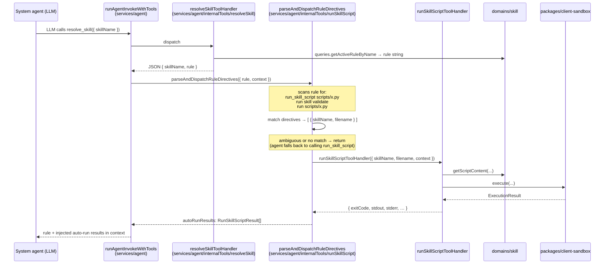
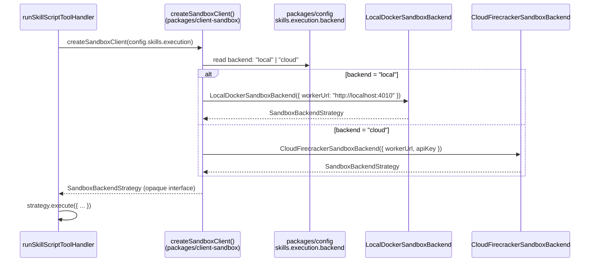

# Skill Script Execution — Architecture

**Feature slug:** `skill-script-execution`
**PRD:** [`prd.md`](./prd.md)
**Phase covered:** Phase 1 — Core runtime
**Related architectures:** [`skill/architecture.md`](../skill/architecture.md) · [`agent-internal-tools/architecture.md`](../agent-internal-tools/architecture.md)

---

## Analysis

### Audit of existing packages

| Existing piece | Location | Reuse plan |
|---|---|---|
| `resolveSkill/` tool handler | `services/agent/src/internalTools/resolveSkill/` | **Direct pattern** for `runSkillScript/` — identical folder structure, handler shape, context usage |
| `createInternalToolHandlers.ts` | `services/agent/src/internalTools/createInternalToolHandlers.ts` | **Extend** — add `'skill-run-script'` binding |
| `INTERNAL_TOOLS` registry | `packages/constants/src/internalTools/registry.ts` | **Extend** — add `run-skill-script` entry (`SYSTEM_ONLY`) via `defineInternalTool` |
| `buildInternalTools.ts` / LangChain schemas | `packages/client-langchain/src/internalTools/` | **Extend** — add `runSkillScriptSchema.ts` in `schemas/` |
| `getScriptContent` query | `domains/skill/src/queries/getScriptContent/` | **Direct reuse** — fetches script content from storage abstraction |
| `getActiveRuleByName` query | `domains/skill/src/queries/getActiveRuleByName/` | **Reuse** — also used for rule auto-run directive parsing |
| `SKILL_SCRIPT_LANGUAGES` constant | `domains/skill/src/constants.ts` | **Extend** — add `'terminal'` to the tuple |
| `@vassembly/client-script-storage` | `packages/client-script-storage/` | **Direct reuse** — strategy pattern already provides local + S3 backends |
| `SkillsConfig` + `packages/config` | `packages/config/src/types.ts` | **Extend** — add `skills.execution` namespace |
| `InternalToolContext` | `services/agent/src/internalTools/types.ts` | **Direct reuse** — provides `taskId`, `specializationIds`, `callerAgentId` needed for dispatch and authorization |
| `runAgentInvokeWithTools.ts` | `services/agent/src/internalTools/runAgentInvokeWithTools.ts` | **Extend** — hook rule auto-run post-processing here |
| `systemAgents.json` seed | `domains/system-agent/seed/systemAgents.json` | **Extend** — add `run-skill-script` to specialization workers and task workers |
| `apps/web/e2e/steps/skills/` | `apps/web/e2e/steps/skills/` | **Reuse** — `thenRuntime.steps.ts`, `whenRuntime.steps.ts`, `given.steps.ts` have patterns for agent execution |

### What exists vs. what is new

**Exists — do not rebuild:**

| Package | What already exists |
|---|---|
| `domains/skill` | `getScriptContent`, `getActiveRuleByName`, `getCatalogBySpecializationId`, `getById`, model, `SKILL_SCRIPT_LANGUAGES` (python/nodejs/bash), `clients/scriptStorage` factory |
| `packages/client-script-storage` | `ScriptStorageStrategy`, `LocalScriptStorageStrategy`, `S3ScriptStorageStrategy` |
| `packages/constants` | `INTERNAL_TOOLS` registry with `defineInternalTool` helper |
| `packages/client-langchain` | `buildInternalTools`, `schemas/`, all existing tool schemas |
| `services/agent/src/internalTools` | `resolveSkill/`, `createInternalToolHandlers.ts`, `runAgentInvokeWithTools.ts`, `InternalToolContext` |
| `packages/config` | `SkillsConfig`, `Environment`, config resolution for dev/prod |

**Extends existing:**

| Package | Extension needed |
|---|---|
| `domains/skill/src/constants.ts` | Add `'terminal'` to `SKILL_SCRIPT_LANGUAGES` tuple |
| `packages/constants/src/internalTools/registry.ts` | Add `run-skill-script` entry |
| `packages/client-langchain/src/internalTools/schemas/` | Add `runSkillScriptSchema.ts` |
| `packages/config/src/types.ts` | Add `ExecutionConfig` interface; extend `SkillsConfig` with `execution` field |
| `services/agent/src/internalTools/createInternalToolHandlers.ts` | Bind `'skill-run-script'` → `runSkillScriptToolHandler` |
| `services/agent/src/internalTools/runAgentInvokeWithTools.ts` | Add rule auto-run post-processing via `parseAndDispatchRuleDirectives` |
| `domains/system-agent/seed/systemAgents.json` | Add `run-skill-script` to specialization worker + task worker `assignedToolIds` |

**Genuinely new (greenfield):**

| Package | What is new |
|---|---|
| `packages/client-sandbox` | **New package** — Strategy pattern: `SandboxBackendStrategy` interface; `LocalDockerSandboxBackend` adapter; `CloudFirecrackerSandboxBackend` adapter; `createSandboxClient` factory; `WorkspaceManager` |
| `services/agent/src/internalTools/runSkillScript/` | New handler folder mirroring `resolveSkill/` |
| `packages/client-langchain/src/internalTools/schemas/runSkillScriptSchema.ts` | New Zod schema |
| Rule directive parser | Lives in `services/agent/src/internalTools/runSkillScript/parseRuleDirectives.ts` |

### Design Patterns applied

| Pattern | Where | Rationale |
|---|---|---|
| **Strategy** (Behavioral) | `packages/client-sandbox` — `SandboxBackendStrategy` interface; `LocalDockerSandboxBackend` + `CloudFirecrackerSandboxBackend` | The sandbox dispatch contract is identical regardless of backend; swap via config without changing tool handler. Mirrors the existing `ScriptStorageStrategy` in `client-script-storage`. |
| **Adapter** (Structural) | Both sandbox concrete implementations are adapters: local wraps Docker REST API; cloud wraps Firecracker HTTP worker | Each backend has a different wire protocol; the Adapter normalizes them to `SandboxBackendStrategy`. |
| **Facade** (Structural) | `packages/client-sandbox/src/createSandboxClient.ts` + `WorkspaceManager` compose Strategy selection + workspace lifecycle behind one surface | Tool handler calls one function; strategy selection and workspace ID management are hidden. |
| **Command** (Behavioral) | `runSkillScript/index.ts` tool handler — encapsulates the full `(skillName, filename, input, context) → { exitCode, stdout, … }` operation as a unit | Mirrors how `resolveSkill/index.ts` is a Command that encapsulates skill rule resolution. |
| **Registry** (existing) | `INTERNAL_TOOLS` in `packages/constants` | Already established; `run-skill-script` is added as a new entry following the same `defineInternalTool` builder. |

### Test strategy

| Test type | Agent | When |
|---|---|---|
| **Unit** | `tdd-unit-test-writer` | All new backend packages: `client-sandbox` strategy, tool handler authorization, rule directive parser, config extension |
| **E2E / acceptance** | `tdd-e2e-test-writer` | PRD Gherkin scenarios SSE-1 through SSE-11; placed in `apps/web/e2e/features/skills/skill-script-execution.feature`; reuse existing `whenRuntime.steps.ts` / `thenRuntime.steps.ts` step patterns |

---

## Architecture & Package Placement

### Package placement table

| Package | Type | New / modified paths | Responsibility |
|---|---|---|---|
| `packages/config` | extend | `src/types.ts` | Add `ExecutionConfig` interface; add `execution` to `SkillsConfig` |
| `packages/constants` | extend | `src/internalTools/registry.ts` | Add `run-skill-script` entry (SYSTEM_ONLY) |
| `packages/client-langchain` | extend | `src/internalTools/schemas/runSkillScriptSchema.ts`, `src/internalTools/schemas/index.ts` | Zod schema for `run_skill_script` LLM tool |
| `packages/client-sandbox` | **new package** | Full package under `packages/client-sandbox/` | Strategy interface + local Docker + cloud Firecracker adapters; WorkspaceManager; `createSandboxClient` factory |
| `domains/skill` | extend | `src/constants.ts` | Add `'terminal'` to `SKILL_SCRIPT_LANGUAGES` |
| `services/agent` | extend | `src/internalTools/runSkillScript/`, `createInternalToolHandlers.ts`, `runAgentInvokeWithTools.ts` | Tool handler; binding registration; rule auto-run dispatch |
| `domains/system-agent` | extend | `seed/systemAgents.json` | Add `run-skill-script` to specialization worker + task worker entries |

### Cross-package dependency rules

```
packages/config
  ↑ imported by: packages/client-sandbox (ExecutionConfig),
                 services/agent (ExecutionConfig for backend selection)

packages/constants
  ↑ imported by: services/agent (INTERNAL_TOOLS registry lookup),
                 packages/client-langchain (tool id lookup)

packages/client-sandbox
  ↑ imported by: services/agent (runSkillScript handler only)
  ⚠️  does NOT import domains/* or services/*
  ⚠️  does NOT import client-langchain

domains/skill
  ↑ imported by: services/agent (getScriptContent, getActiveRuleByName for tool handler)
  ⚠️  does NOT import packages/client-sandbox

services/agent
  ↑ imported by: apps/api (invoke handlers)
  ✅ imports packages/client-sandbox via tool handler only — NOT via domain bridge
     (client-sandbox is a client package, not a langchain-level runtime; direct import from service is permitted)

packages/client-langchain
  ↑ imports packages/constants (tool registry for buildInternalTools)
  ⚠️  does NOT import packages/client-sandbox
  ⚠️  does NOT import services/*
```

> **Key isolation:** `domains/skill` never imports `packages/client-sandbox`. Script fetching and script execution are independent concerns. The tool handler in `services/agent` is the only orchestrator that composes both.

### Sequence Diagram 1 — Tool-initiated run (`run_skill_script`)

```mermaid
sequenceDiagram
    participant Agent as System agent (LLM)
    participant Invoke as runAgentInvokeWithTools<br/>(services/agent)
    participant Handler as runSkillScriptToolHandler<br/>(services/agent/internalTools/runSkillScript)
    participant SkDomain as domains/skill
    participant Sandbox as packages/client-sandbox<br/>(SandboxBackendStrategy)
    participant Worker as Sandbox worker<br/>(local Docker or cloud Firecracker)

    Agent->>Invoke: LLM calls run_skill_script<br/>{ skillName, filename, input? }
    Invoke->>Handler: dispatch via createInternalToolHandlers binding
    Handler->>Handler: resolve specializationId<br/>(arg || context.specializationIds)
    Handler->>SkDomain: queries.getActiveRuleByName({ specializationId, skillName })<br/>→ validates skill is active + in scope
    Handler->>SkDomain: queries.getScriptContent({ skillId, filename })<br/>→ fetches script bytes from storage
    Handler->>Handler: validateScriptSize(scriptContent)
    Handler->>Sandbox: execute({ language, scriptContent, input,<br/>workspaceId, limits, correlationId })
    Sandbox->>Worker: HTTP POST /execute (local: localhost;<br/>cloud: Firecracker pool URL)
    Note over Worker: isolated process; no network;<br/>shared workspace volume
    Worker-->>Sandbox: { exitCode, stdout, stderr, durationMs }
    Sandbox-->>Handler: ExecutionResult
    Handler->>Handler: truncateIfNeeded(stdout, stderr)
    Handler-->>Agent: JSON string { skillName, filename, exitCode,<br/>stdout, stderr, durationMs, truncated }
    Note over Agent: LLM decides on non-zero exitCode<br/>(D-8 — no auto-fail)
```

### Sequence Diagram 2 — Rule auto-run path



> **Placement decision:** Auto-run parsing is hooked **post-`resolveSkillToolHandler` response** inside `runAgentInvokeWithTools.ts`. This avoids modifying the resolve tool handler itself (single-responsibility preserved) and keeps the injection at the orchestration layer that already controls the tool call loop.

### Sequence Diagram 3 — Backend selection (Strategy pattern)



### Sequence Diagram 4 — Shared workspace lifecycle

```mermaid
sequenceDiagram
    participant Invoke as runAgentInvokeWithTools
    participant WM as WorkspaceManager<br/>(packages/client-sandbox)
    participant Strategy as SandboxBackendStrategy
    participant Worker as Sandbox worker

    Note over Invoke: workspaceId = f(taskId, rootInvocationId)<br/>— stable across all script runs in same agent turn
    Invoke->>WM: getOrCreateWorkspace({ workspaceId })
    WM-->>Invoke: workspaceHandle

    loop each run_skill_script in turn
        Invoke->>Strategy: execute({ ..., workspaceId })
        Strategy->>Worker: mount/reuse workspace volume at workspaceId path
        Worker-->>Strategy: result (script may read/write files)
        Strategy-->>Invoke: ExecutionResult
    end

    Note over Invoke: task invocation complete
    Invoke->>WM: destroyWorkspace({ workspaceId })
    WM->>Strategy: deleteWorkspace({ workspaceId })
    Note over Worker: workspace volume destroyed;<br/>no files persist
```

---

## Recommendation

### Overall approach

**Maximum reuse.** This feature introduces one new package (`packages/client-sandbox`) and extends eight existing packages. No new domain or service package is required.

- **No new domain:** `domains/skill` already owns script metadata and the `getScriptContent` / `getActiveRuleByName` queries needed for the tool handler. Execution concerns belong at the service + client layer.
- **No new service:** `services/agent` already contains all internal tool handlers. `runSkillScript/` follows the exact `resolveSkill/` subfolder pattern. Adding a `services/script-execution` package would create an unnecessary service-to-service hop on the synchronous blocking path and add deployment complexity.
- **New package justified:** `packages/client-sandbox` is the correct placement for the Strategy + Adapter pattern. It is a pure client package (no domain logic, no service deps), reusable by other services if needed, and keeps the Docker/Firecracker wire protocol out of the agent service. This follows the existing pattern of `packages/client-script-storage` for storage abstraction.

### Local development — Docker-based sandbox worker

**Recommendation: Docker + gVisor (not local Firecracker).**

| Option | Verdict |
|---|---|
| **Docker + gVisor (runsc)** | ✅ Recommended — Docker is already a dev prerequisite; gVisor's `runsc` runtime provides kernel-level isolation matching the security contract; supported on Linux (standard dev machine); no KVM required |
| Local Firecracker | ❌ Rejected — requires KVM access + network bridge setup; complex dev prerequisites; Docker is already available |

**Local sandbox worker process:** A lightweight HTTP worker (`packages/client-sandbox/local-worker/`) runs as a sidecar process in the dev stack. It accepts `POST /execute` and runs scripts in `docker run --runtime=runsc` containers per language image. Started via `pnpm run dev` companion (e.g., `concurrently` entry or `docker-compose` sidecar service at port `4010`).

**Dev prerequisites (documented in `packages/client-sandbox/README.md`):**
- Docker Desktop or Docker Engine ≥ 24
- `gVisor` (`runsc`) runtime installed and configured in Docker daemon (`/etc/docker/daemon.json`)
- No AWS keys, no remote worker URL needed

### Cloud deployment — Firecracker on AWS

**Cloud backend shape:** A dedicated `services/script-worker` (separate from this Phase 1 scope) runs on AWS EKS or ECS. It exposes `POST /execute` over HTTPS with mTLS. The `CloudFirecrackerSandboxBackend` adapter in `packages/client-sandbox` points to this URL.

- Pre-baked Firecracker rootfs images per language: `python:3.12`, `node:20`, `bash+jq`, `shell` (for `terminal`)
- Warm pool: N idle microVMs per language (config: `skills.execution.cloud.warmPoolSize`, default 2)
- Script content cache: in-memory by `storageKey` + ETag, TTL 5 min
- **Phase 1:** Firecracker worker infrastructure is provisioned separately (Platform Engineering). `packages/client-sandbox` provides the adapter; worker deployment is out of architecture scope here.

### PII in transit — local vs. cloud

| Backend | Transport | Rationale |
|---|---|---|
| **Local** | HTTP to `localhost:4010` (loopback) | Loopback is not network-exposed; no TLS required for single-machine dev |
| **Cloud** | HTTPS + mTLS to Firecracker worker endpoint | `input` JSON may contain PII; mTLS ensures mutual authentication and in-transit encryption (D-4) |

### Why this approach reduces complexity

- **Single tool handler** for both backends — no forked logic; `config.skills.execution.backend` selects the Strategy at startup.
- **No async job queue** — sync blocking (D-2) eliminates a polling loop, SQS consumers, and state management.
- **Rule auto-run as post-processing** — no new middleware layer; `runAgentInvokeWithTools.ts` already mediates the tool call loop response.
- **Workspace ID from context** — `workspaceId = f(taskId, rootInvocationId)` derived deterministically from `InternalToolContext`; no extra DB state.

---

## Config Design

### `packages/config/src/types.ts` extension

```typescript
export interface SandboxLocalConfig {
  workerUrl: string;           // default: "http://localhost:4010"
}

export interface SandboxCloudConfig {
  workerUrl: string;           // Firecracker worker HTTPS endpoint
  apiKey?: string;             // optional bearer token for worker auth
  warmPoolSize: number;        // default: 2 per language
}

export interface ExecutionConfig {
  backend: 'local' | 'cloud';
  stdoutMaxBytes: number;      // default: 262144 (256 KB)
  stderrMaxBytes: number;      // default: 65536 (64 KB)
  memoryLimitMb: number;       // default: 256
  local: SandboxLocalConfig;
  cloud: SandboxCloudConfig;
}

export interface SkillsConfig {
  scriptStorage: SkillScriptStorageConfig;
  execution: ExecutionConfig;              // ← new
}
```

### Environment variable mapping (`packages/config/src/development.ts`, `production.ts`)

| Env var | Config path | Dev default | Prod default |
|---|---|---|---|
| `SKILLS_EXECUTION_BACKEND` | `skills.execution.backend` | `local` | `cloud` |
| `SKILLS_EXECUTION_WORKER_URL` | `skills.execution.local.workerUrl` / `cloud.workerUrl` | `http://localhost:4010` | required |
| `SKILLS_EXECUTION_CLOUD_API_KEY` | `skills.execution.cloud.apiKey` | — | required |
| `SKILLS_EXECUTION_STDOUT_MAX_BYTES` | `skills.execution.stdoutMaxBytes` | `262144` | `262144` |
| `SKILLS_EXECUTION_MEMORY_LIMIT_MB` | `skills.execution.memoryLimitMb` | `256` | `256` |

---

## Package: `packages/client-sandbox`

### Directory structure

```
packages/client-sandbox/
├── src/
│   ├── index.ts                        ← exports: createSandboxClient, WorkspaceManager, types
│   ├── types.ts                        ← SandboxBackendStrategy, ExecuteParams, ExecutionResult,
│   │                                      WorkspaceHandle, SandboxLimits
│   ├── createSandboxClient.ts          ← Factory: reads ExecutionConfig, returns SandboxBackendStrategy
│   ├── workspaceManager.ts             ← WorkspaceManager: getOrCreate, destroy
│   ├── localStrategy/
│   │   ├── index.ts                    ← LocalDockerSandboxBackend({ workerUrl })
│   │   ├── types.ts
│   │   └── localStrategy.test.ts
│   ├── cloudStrategy/
│   │   ├── index.ts                    ← CloudFirecrackerSandboxBackend({ workerUrl, apiKey })
│   │   ├── types.ts
│   │   └── cloudStrategy.test.ts
│   └── local-worker/
│       ├── server.ts                   ← Express HTTP worker (POST /execute, DELETE /workspace/:id)
│       ├── languages/
│       │   ├── python.ts               ← docker run --runtime=runsc python:3.12 wrapper
│       │   ├── nodejs.ts
│       │   ├── bash.ts
│       │   └── terminal.ts             ← /bin/sh -c execution
│       └── workspaceVolume.ts          ← bind-mount workspace dir management
├── package.json
├── tsconfig.json
├── vitest.config.ts
└── README.md                           ← prerequisites, local setup, language I/O contract
```

### `SandboxBackendStrategy` interface (`types.ts`)

```typescript
export interface ExecuteParams {
  language: SkillScriptLanguage;          // 'python' | 'nodejs' | 'bash' | 'terminal'
  scriptContent: string;
  input: Record<string, unknown>;         // JSON-serializable; may include PII
  env?: Record<string, string>;           // allowlisted keys only
  args?: string[];
  workspaceId: string;
  limits: SandboxLimits;
  correlationId: string;
}

export interface ExecutionResult {
  exitCode: number;
  stdout: string;
  stderr: string;
  durationMs: number;
  truncated: boolean;
}

export interface SandboxBackendStrategy {
  execute: (params: ExecuteParams) => Promise<ExecutionResult>;
  deleteWorkspace: (params: { workspaceId: string }) => Promise<void>;
}
```

### Local worker I/O contract per language

| Language | Script delivery | Input | Sandbox command |
|---|---|---|---|
| `python` | script written as `skill_script.py` in workspace | `input.json` in workspace; `SKILL_INPUT_PATH=./input.json` | `docker run --runtime=runsc python:3.12 python skill_script.py --input input.json` |
| `nodejs` | `skill_script.mjs` | `input.json`; `SKILL_INPUT_PATH` env | `docker run --runtime=runsc node:20 node skill_script.mjs` |
| `bash` | `skill_script.sh` | `input.json`; `SKILL_INPUT_PATH` env; `jq` pre-installed | `docker run --runtime=runsc bash+jq bash skill_script.sh` |
| `terminal` | Script content executed as `/bin/sh -c "…"` | `input.json`; `SKILL_INPUT_PATH` env | `docker run --runtime=runsc terminal-base /bin/sh -c "<content>"` |

All containers:
- `--network=none` — no network egress
- `--memory=256m` — default memory cap
- `--cpus=1` — CPU cap
- Workspace bind-mounted at `/workspace`; `SKILL_WORKSPACE_PATH=/workspace`

---

## Tool Handler: `services/agent/src/internalTools/runSkillScript/`

### Directory structure (mirrors `resolveSkill/`)

```
runSkillScript/
├── index.ts                  ← runSkillScriptToolHandler
├── types.ts                  ← RunSkillScriptArgs, RunSkillScriptResult
├── parseRuleDirectives.ts    ← parseAndDispatchRuleDirectives
└── index.test.ts
```

### Handler logic (`index.ts`)

```typescript
export const runSkillScriptToolHandler = async (
  args: Record<string, unknown>,
  context: InternalToolContext,
): Promise<string> => {
  const { skillName, filename, specializationId: specializationIdArg, input, env, args: scriptArgs } =
    runSkillScriptArgsSchema.parse(args);

  // 1. Resolve specializationId (matches resolve-skill precedence — D-3)
  const specializationId = await resolveSpecializationId({
    specializationIdArg,
    context,
  });

  // 2. Validate skill is active + in authorized scope (FR-IT-5)
  const skill = await skillDomain.queries.getActiveRuleByName({ specializationId, skillName });

  // 3. Fetch script content via existing domain query (FR-IT-6)
  const { content: scriptContent } = await skillDomain.queries.getScriptContent({
    skillId: skill.id,
    filename,
  });

  // 4. Validate allowlisted env keys (FR-SEC-3)
  validateEnvKeys(env);

  // 5. Build workspaceId from task context (FR-ES-6)
  const workspaceId = buildWorkspaceId({
    taskId: context.taskId,
    rootInvocationId: context.rootInvokeId,
  });

  // 6. Dispatch to sandbox backend — blocks until complete (D-2, FR-IT-10)
  const sandboxClient = createSandboxClient(config.skills.execution);
  const result = await sandboxClient.execute({
    language: skill.scriptLanguage,
    scriptContent,
    input: input ?? {},
    env: filterAllowlistedEnv({ env, taskId: context.taskId, skillName, filename, workspaceId }),
    args: scriptArgs,
    workspaceId,
    limits: buildLimits(config.skills.execution),
    correlationId: context.invocationId,
  });

  // 7. Truncate output (FR-SB-9)
  const truncated = truncateOutput(result, config.skills.execution);

  // 8. Emit observability event (SSE-7)
  emitScriptRunEvent({ context, skill, filename, result: truncated, trigger: 'tool' });

  // 9. Return structured result — non-zero exitCode does NOT throw (D-8, FR-IT-7)
  return JSON.stringify({
    skillName,
    filename,
    exitCode: truncated.exitCode,
    stdout: truncated.stdout,
    stderr: truncated.stderr,
    durationMs: truncated.durationMs,
    truncated: truncated.truncated,
  });
};
```

### Rule directive parser (`parseRuleDirectives.ts`)

Scans a resolved rule string for unambiguous auto-run directives:

```typescript
const DIRECTIVE_PATTERNS = [
  /^run_skill_script\s+(\S+)\s*$/m,   // explicit: run_skill_script scripts/validate.py
  /^run\s+scripts\/(\S+)\s*$/m,       // path: run scripts/validate.py
  /^run\s+skill\s+(\S+)\s*$/m,        // name alias: run skill validate (matched against script catalog)
];

export const parseAndDispatchRuleDirectives = async ({
  rule,
  skillName,
  context,
}: ParseRuleDirectivesParams): Promise<RunSkillScriptResult[]> => {
  const directives = extractDirectives(rule);
  if (directives.length === 0) return [];

  const results: RunSkillScriptResult[] = [];
  for (const directive of directives) {
    const result = await runSkillScriptToolHandler(
      { skillName, filename: directive.filename },
      { ...context, trigger: 'rule' },
    );
    results.push(JSON.parse(result));
  }
  return results;
};
```

> **Ambiguity policy:** If `run skill <name>` matches multiple scripts in the skill's catalog, the directive is skipped (returns empty) and the agent falls back to calling `run_skill_script` explicitly.

---

## Allowlisted Environment Keys

Per FR-SEC-3, only these keys are injected into sandbox `env`:

```typescript
const ALLOWED_SANDBOX_ENV_KEYS = new Set([
  'SKILL_INPUT_PATH',      // path to input.json in workspace
  'SKILL_NAME',            // skill name
  'SKILL_FILENAME',        // script filename
  'TASK_ID',               // task context
  'SKILL_WORKSPACE_PATH',  // absolute workspace path inside sandbox
] as const);
```

User-supplied `env` keys not in this set are rejected at the tool boundary with `WrongParamError`.

---

## WorkspaceId Derivation

```typescript
const buildWorkspaceId = ({
  taskId,
  rootInvocationId,
}: { taskId: string; rootInvocationId: string }): string =>
  `${taskId}__${rootInvocationId}`;
```

- One workspace per task invocation — shared across all sequential script runs
- Isolated per tenant (task IDs are tenant-scoped)
- Destroyed when the agent turn completes (`runAgentInvokeWithTools` post-hook)

---

## Registry Extension

Add to `packages/constants/src/internalTools/registry.ts`:

```typescript
defineInternalTool({
  domain: 'skill',
  action: 'run-script',
  description:
    'Execute a named script from a skill in a sandboxed process and return stdout. ' +
    'The agent turn blocks until the script completes.',
  accessScope: InternalToolAccessScope.SYSTEM_ONLY,
  llmToolName: 'run_skill_script',
}),
```

Tool id: `skill-run-script` (generated by `formatInternalToolId({ domain: 'skill', action: 'run-script' })`).

---

## LangChain Schema

**`packages/client-langchain/src/internalTools/schemas/runSkillScriptSchema.ts`:**

```typescript
import { z } from 'zod';

export const runSkillScriptSchema = z.object({
  skillName: z.string().min(1).describe(
    'Exact name of the skill whose script to execute (e.g. "contract-review")',
  ),
  filename: z.string().min(1).describe(
    'Script filename as stored in the skill (e.g. "scripts/validate.py")',
  ),
  specializationId: z.string().optional().describe(
    'Override specializationId. If omitted, resolved from calling agent context.',
  ),
  input: z.record(z.unknown()).optional().describe(
    'JSON-serializable input delivered to the script. May include PII.',
  ),
  env: z.record(z.string()).optional().describe(
    'Optional env overrides. Only allowlisted keys accepted.',
  ),
  args: z.array(z.string().max(256)).max(10).optional().describe(
    'Optional CLI arguments passed to the script. Max 10, each max 256 chars.',
  ),
});
```

---

## `terminal` Language Extension

In `domains/skill/src/constants.ts`:

```typescript
// Before:
export const SKILL_SCRIPT_LANGUAGES = ['python', 'nodejs', 'bash'] as const;

// After:
export const SKILL_SCRIPT_LANGUAGES = ['python', 'nodejs', 'bash', 'terminal'] as const;
```

`SkillScriptLanguage` type is derived from this tuple (`typeof SKILL_SCRIPT_LANGUAGES[number]`) — the GraphQL enum and domain model update automatically when the constant is extended.

**Filename convention for terminal scripts:** `scripts/{kebab-name}.terminal`

---

## Seed Update

In `domains/system-agent/seed/systemAgents.json`, add `"skill-run-script"` to `assignedToolIds` for:

1. **Specialization worker** agents (all existing entries with `specializationId` set)
2. **Task worker** agents (entries that execute tasks)

Pattern to follow: `"resolve-skill"` was added to the same agents in the skill architecture. Add `"skill-run-script"` alongside it.

---

## Observability Events

Emitted from the tool handler. No schema changes to existing models (Phase 1, D-9):

```typescript
// skill.script.run.started
{
  event: 'skill.script.run.started',
  taskId: string;
  skillId: string;
  skillName: string;
  filename: string;
  language: SkillScriptLanguage;
  invocationId: string;
  workspaceId: string;
  trigger: 'tool' | 'rule';
  sandboxBackend: 'local' | 'cloud';
}

// skill.script.run.completed (adds to started fields)
{
  exitCode: number;
  durationMs: number;
  stdoutBytes: number;
  stderrBytes: number;
  truncated: boolean;
}

// skill.script.run.failed (adds errorCode, errorMessage — no script body, no PII)
// skill.script.run.rate_limited
```

---

## Implementation Steps

### Step 1 — `packages/config` extension

Extend `packages/config/src/types.ts`: add `ExecutionConfig`, `SandboxLocalConfig`, `SandboxCloudConfig`; add `execution` field to `SkillsConfig`. Wire in `development.ts` (backend=`local`, workerUrl=`http://localhost:4010`) and `production.ts` (backend=`cloud`).

Files:
- `packages/config/src/types.ts`
- `packages/config/src/development.ts`
- `packages/config/src/production.ts`

### Step 2 — `domains/skill`: add `'terminal'` language

Extend `SKILL_SCRIPT_LANGUAGES` tuple in `domains/skill/src/constants.ts`. No other domain changes needed — DTO, model, and GraphQL enum derive from this constant.

Files:
- `domains/skill/src/constants.ts`

### Step 3 — `packages/constants`: register `run-skill-script`

Add `defineInternalTool` entry for `skill-run-script` (SYSTEM_ONLY, `run_skill_script`).

Files:
- `packages/constants/src/internalTools/registry.ts`

### Step 4 — `packages/client-langchain`: add `runSkillScriptSchema`

Create `src/internalTools/schemas/runSkillScriptSchema.ts`. Export from `src/internalTools/schemas/index.ts`.

Files:
- `packages/client-langchain/src/internalTools/schemas/runSkillScriptSchema.ts`
- `packages/client-langchain/src/internalTools/schemas/index.ts`

### Step 5 — `packages/client-sandbox`: create new package

Create package scaffold following monorepo template. Implement:

1. `types.ts` — `SandboxBackendStrategy`, `ExecuteParams`, `ExecutionResult`, `SandboxLimits`
2. `localStrategy/index.ts` — `LocalDockerSandboxBackend`: HTTP client to local worker at `workerUrl`
3. `cloudStrategy/index.ts` — `CloudFirecrackerSandboxBackend`: HTTP client to Firecracker pool at `workerUrl` (mTLS via node `fetch` with cert config)
4. `workspaceManager.ts` — `WorkspaceManager`: tracks active workspaces; calls `strategy.deleteWorkspace` on destroy
5. `createSandboxClient.ts` — Factory: reads `ExecutionConfig.backend`, returns Strategy instance
6. `local-worker/server.ts` — Express HTTP worker: `POST /execute`, `DELETE /workspace/:id`
7. `local-worker/languages/{python,nodejs,bash,terminal}.ts` — Docker run wrappers
8. `README.md` — prerequisites, local setup guide

Files (new package):
- `packages/client-sandbox/package.json`
- `packages/client-sandbox/tsconfig.json`
- `packages/client-sandbox/vitest.config.ts`
- `packages/client-sandbox/src/index.ts`
- `packages/client-sandbox/src/types.ts`
- `packages/client-sandbox/src/createSandboxClient.ts`
- `packages/client-sandbox/src/workspaceManager.ts`
- `packages/client-sandbox/src/localStrategy/index.ts`
- `packages/client-sandbox/src/localStrategy/types.ts`
- `packages/client-sandbox/src/cloudStrategy/index.ts`
- `packages/client-sandbox/src/cloudStrategy/types.ts`
- `packages/client-sandbox/src/local-worker/server.ts`
- `packages/client-sandbox/src/local-worker/languages/python.ts`
- `packages/client-sandbox/src/local-worker/languages/nodejs.ts`
- `packages/client-sandbox/src/local-worker/languages/bash.ts`
- `packages/client-sandbox/src/local-worker/languages/terminal.ts`
- `packages/client-sandbox/src/local-worker/workspaceVolume.ts`
- `packages/client-sandbox/README.md`

### Step 6 — `services/agent`: `runSkillScript` tool handler

Create `src/internalTools/runSkillScript/` following `resolveSkill/` pattern:

1. `types.ts` — `RunSkillScriptArgs`, `RunSkillScriptResult`, `ParseRuleDirectivesParams`
2. `index.ts` — `runSkillScriptToolHandler` (full logic per §Tool Handler above)
3. `parseRuleDirectives.ts` — `parseAndDispatchRuleDirectives`
4. `index.test.ts` — unit tests

Files:
- `services/agent/src/internalTools/runSkillScript/index.ts`
- `services/agent/src/internalTools/runSkillScript/types.ts`
- `services/agent/src/internalTools/runSkillScript/parseRuleDirectives.ts`
- `services/agent/src/internalTools/runSkillScript/index.test.ts`

### Step 7 — `services/agent`: register handler + hook auto-run

**`createInternalToolHandlers.ts`:** Import `runSkillScriptToolHandler`; add `'skill-run-script'` binding.

**`runAgentInvokeWithTools.ts`:** After `resolveSkillToolHandler` resolves successfully, call `parseAndDispatchRuleDirectives({ rule, skillName, context })` and inject results into the agent context response.

Files:
- `services/agent/src/internalTools/createInternalToolHandlers.ts`
- `services/agent/src/internalTools/runAgentInvokeWithTools.ts`

### Step 8 — `domains/system-agent/seed`: auto-assign to workers

Update `domains/system-agent/seed/systemAgents.json` — add `"skill-run-script"` to `assignedToolIds` for specialization worker and task worker system agent seed entries. Do NOT add to Task Planner or Skill Planner agents (FR-INT-2, SSE-6).

Files:
- `domains/system-agent/seed/systemAgents.json`

### Step 9 — E2E feature file

Write failing Playwright BDD scenarios covering SSE-1 through SSE-11.

Files:
- `apps/web/e2e/features/skills/skill-script-execution.feature`
- `apps/web/e2e/steps/skills/skillScriptExecution.steps.ts` (only if new steps needed beyond existing `whenRuntime.steps.ts` / `thenRuntime.steps.ts`)

---

## Todo Plan

### Phase 1 implementation todos

```
1. packages/config — extend SkillsConfig with ExecutionConfig
   Changes needed: Add ExecutionConfig, SandboxLocalConfig, SandboxCloudConfig interfaces;
                   add execution field to SkillsConfig; wire defaults in development.ts (backend=local)
                   and production.ts (backend=cloud)
   Files to modify:
     - packages/config/src/types.ts
     - packages/config/src/development.ts
     - packages/config/src/production.ts
   Suggested subagent workflow: coder → Done
   Dependencies: None

2. domains/skill — add 'terminal' to SKILL_SCRIPT_LANGUAGES
   Changes needed: Extend the SKILL_SCRIPT_LANGUAGES tuple with 'terminal'; all downstream types
                   (SkillScriptLanguage, GraphQL enum) derive from this constant automatically
   Files to modify:
     - domains/skill/src/constants.ts
   Suggested subagent workflow: coder → Done
   Dependencies: None

3. packages/constants — register run-skill-script tool
   Changes needed: Add defineInternalTool entry for skill-run-script
                   (SYSTEM_ONLY, llmToolName: 'run_skill_script')
   Files to modify:
     - packages/constants/src/internalTools/registry.ts
   Suggested subagent workflow: coder → Done
   Dependencies: None

4. packages/client-langchain — add runSkillScriptSchema
   Changes needed: Create Zod schema for run_skill_script LLM tool
                   (skillName, filename required; specializationId, input, env, args optional);
                   export from schemas/index.ts
   Files to create:
     - packages/client-langchain/src/internalTools/schemas/runSkillScriptSchema.ts
   Files to modify:
     - packages/client-langchain/src/internalTools/schemas/index.ts
   Suggested subagent workflow: coder → Done
   Dependencies: None

5. packages/client-sandbox — create new sandbox client package
   Changes needed: Create new package with:
     - SandboxBackendStrategy interface (types.ts)
     - LocalDockerSandboxBackend adapter (localStrategy/)
     - CloudFirecrackerSandboxBackend adapter (cloudStrategy/)
     - WorkspaceManager (workspaceManager.ts)
     - createSandboxClient factory (Strategy selector by config)
     - Local worker HTTP server (local-worker/server.ts)
     - Per-language Docker run wrappers (local-worker/languages/)
     - README with prerequisites (Docker + gVisor/runsc)
   Files to create: See §Package: packages/client-sandbox above (full file list)
   Suggested subagent workflow: tdd-unit-test-writer → coder ↔ code-reviewer (loop: max 2 iterations) → documentation-writer
   Dependencies: Todo 1 (ExecutionConfig interface)

6. services/agent — runSkillScript tool handler
   Changes needed: Create runSkillScript/ subfolder mirroring resolveSkill/:
     - runSkillScriptToolHandler with full authorization, script fetch, sandbox dispatch,
       truncation, and observability event emission
     - parseAndDispatchRuleDirectives for rule auto-run
   Files to create:
     - services/agent/src/internalTools/runSkillScript/index.ts
     - services/agent/src/internalTools/runSkillScript/types.ts
     - services/agent/src/internalTools/runSkillScript/parseRuleDirectives.ts
     - services/agent/src/internalTools/runSkillScript/index.test.ts
   Suggested subagent workflow: tdd-unit-test-writer → coder ↔ code-reviewer (loop: max 2 iterations)
   Dependencies: Todos 1, 3, 5 (config, registry, sandbox client)

7. services/agent — register handler + hook auto-run
   Changes needed:
     - createInternalToolHandlers.ts: add 'skill-run-script' binding
     - runAgentInvokeWithTools.ts: hook parseAndDispatchRuleDirectives after resolve-skill response
   Files to modify:
     - services/agent/src/internalTools/createInternalToolHandlers.ts
     - services/agent/src/internalTools/runAgentInvokeWithTools.ts
   Suggested subagent workflow: coder ↔ code-reviewer (loop: max 2 iterations)
   Dependencies: Todo 6

8. domains/system-agent/seed — auto-assign run-skill-script to workers
   Changes needed: Add "skill-run-script" to assignedToolIds of specialization worker
                   and task worker seed entries; NOT added to Task Planner or Skill Planner agents
   Files to modify:
     - domains/system-agent/seed/systemAgents.json
   Suggested subagent workflow: coder → Done
   Dependencies: Todo 3 (tool must be in registry before seed references it)

9. apps/web — E2E feature file for SSE-1 through SSE-11
   Changes needed: Write failing Playwright BDD feature files covering all Phase 1 Gherkin
                   scenarios (SSE-1 tool run, SSE-2 structured I/O, SSE-3 authorization,
                   SSE-4 no timeout, SSE-8 rule auto-run, SSE-9 terminal language,
                   SSE-10 shared workspace, SSE-11 local sandbox)
   Files to create:
     - apps/web/e2e/features/skills/skill-script-execution.feature
   Files to modify (if new steps needed):
     - apps/web/e2e/steps/skills/skillScriptExecution.steps.ts
       (reuse existing whenRuntime.steps.ts / thenRuntime.steps.ts / given.steps.ts where possible)
   Suggested subagent workflow: tdd-e2e-test-writer → coder ↔ code-reviewer (loop: max 2 iterations)
   Dependencies: PRD SSE Gherkin scenarios; Todos 6, 7, 8 must be green before E2E passes
```

### Parallelism

**Batch A (no deps) — run in parallel:**
- Todo 1 (`packages/config`)
- Todo 2 (`domains/skill` terminal constant)
- Todo 3 (`packages/constants` registry)
- Todo 4 (`packages/client-langchain` schema)

**Batch B (depends on Todo 1):**
- Todo 5 (`packages/client-sandbox`) — after Todo 1

**Batch C (depends on Todos 1, 3, 5):**
- Todo 6 (`services/agent` handler) — after Todos 1, 3, 5

**Batch D (depends on Todos 3, 6):**
- Todo 7 (`services/agent` registration + auto-run) — after Todo 6
- Todo 8 (seed) — after Todo 3

**Batch E (depends on Todos 6, 7, 8):**
- Todo 9 (E2E) — after Todos 6, 7, 8 are green

**Critical path:** 1 → 5 → 6 → 7 → 9

---

## Test Strategy

| Package | Test type | Key scenarios |
|---|---|---|
| `packages/client-sandbox` (localStrategy) | Unit | HTTP call to worker; correct Docker args per language; stdout/stderr capture; workspace bind-mount; no-network flag |
| `packages/client-sandbox` (cloudStrategy) | Unit | HTTP call to Firecracker worker URL; mTLS param passing; error mapping |
| `packages/client-sandbox` (workspaceManager) | Unit | getOrCreate returns same ID; destroy calls deleteWorkspace |
| `packages/client-sandbox` (createSandboxClient) | Unit | backend=local returns LocalDockerSandboxBackend; backend=cloud returns CloudFirecrackerSandboxBackend |
| `services/agent` (runSkillScriptToolHandler) | Unit | Returns JSON result for active skill; throws NotFoundError for missing script; throws AuthorizationError for cross-scope skill; non-zero exitCode returned without throw; stdout truncated at 256KB with truncated=true; allowlisted env only |
| `services/agent` (parseAndDispatchRuleDirectives) | Unit | `run_skill_script scripts/x.py` directive triggers auto-run; `run scripts/x.py` triggers auto-run; ambiguous `run skill name` with multiple matches returns empty; no directive in rule returns empty |
| `domains/skill` (constants) | Unit | SKILL_SCRIPT_LANGUAGES includes 'terminal'; SkillScriptLanguage type is correct |
| `packages/constants` (registry) | Unit | `getInternalToolById('skill-run-script')` returns SYSTEM_ONLY entry; `run_skill_script` LLM tool name registered |
| `apps/web` (E2E — SSE-1 through SSE-11) | E2E | Full Gherkin acceptance coverage per PRD; local backend (`skills.execution.backend=local`) in CI |

---

## Risks & Mitigations

| # | Risk | Likelihood | Impact | Mitigation |
|---|---|---|---|---|
| R-1 | `gVisor/runsc` not available on developer machine | Medium | Local sandbox cannot start | README documents installation; `createSandboxClient` fails-fast with clear error if worker health-check fails on startup |
| R-2 | Sync blocking causes agent service request timeout for long scripts | Medium | HTTP 504 from API gateway | Document that no wall-clock timeout is intentional (D-2); configure API gateway timeout ≥ 10 min or use chunked/streaming response |
| R-3 | Workspace not destroyed on agent crash / unhandled rejection | Medium | Storage leak | `runAgentInvokeWithTools` uses `finally` block to call `workspaceManager.destroyWorkspace`; local-worker has workspace TTL cleanup on startup |
| R-4 | Script size check bypass (storageKey collision or race) | Low | OOM in worker | `validateScriptSize` called in handler on fetched content before dispatch; 512KB hard limit |
| R-5 | `config.skills.execution` not wired in all config profiles | High | `createSandboxClient` throws at import time | Fail-fast config validation in `packages/config/src/index.test.ts`; add to CI config smoke test |
| R-6 | Docker `--runtime=runsc` not configured in CI | Medium | Local sandbox tests fail in CI | CI job for local backend installs gVisor; alternatively, local-worker has a `--no-gvisor` flag for CI that uses `runc` (documented trade-off) |
| R-7 | Rule directive parser false positives | Low | Unexpected auto-run | Directive patterns require full-line match (`^…$m`); unit tests cover edge cases; ambiguous cases skip silently |
| R-8 | `SKILL_SCRIPT_LANGUAGES` tuple extension breaks existing GraphQL enum | Low | Schema validation errors | TypeScript tuple-derived enum update is compile-time — caught by type checks in CI |
| R-9 | Sandbox client imported in services/agent violates architecture rules | Low | Architecture drift | `packages/client-sandbox` is a `client-*` package — services importing client packages is standard pattern; not a violation |
| R-10 | Cloud Firecracker worker not ready at Phase 1 launch | Medium | Cloud execution unavailable | Feature works fully with `backend=local` (D-12, FR-LOC-1); cloud deployment is Platform Engineering work; feature is not blocked |

---

## Open Questions — Architecture Decisions Made

| # | Question | Decision |
|---|---|---|
| OQ-1 | New domain `domains/script-execution` or extend existing? | **No new domain** — script execution is a service + client concern; `domains/skill` already owns metadata |
| OQ-2 | New service `services/script-execution` or extend `services/agent`? | **Extend `services/agent`** — sync blocking path; adding a service-to-service RPC hop adds latency and deployment complexity |
| OQ-3 | Local sandbox: Docker+gVisor vs local Firecracker? | **Docker + gVisor** — Docker already a prerequisite; no KVM requirement; sufficient isolation for local dev |
| OQ-4 | Sync RPC: HTTP vs gRPC? | **HTTP** — consistent with existing `packages/client-*` patterns; simpler local worker; gRPC not used elsewhere |
| OQ-5 | Where to hook rule auto-run? | **Post-`resolveSkill` in `runAgentInvokeWithTools`** — avoids modifying the resolve handler; stays at orchestration layer |
| OQ-6 | Does `getActiveRuleByName` need to return `skillId` + script metadata for authorization? | **Yes** — handler needs `skillId` for `getScriptContent` lookup; `getActiveRuleByName` already returns the full model row in `services/agent`; passes `skillId` to `getScriptContent` |
| OQ-7 | PII in transit for local backend: TLS or loopback? | **Loopback HTTP** — `localhost:4010` is not network-exposed; no TLS overhead in dev |
| OQ-8 | WorkspaceId stored in DB or derived? | **Derived** — `f(taskId, rootInvocationId)`; deterministic; no extra DB state |
| OQ-9 | Rate limiting placement? | **Tool handler** — per `taskId` + `userId` (from `context`) via in-memory sliding window; simple enough for Phase 1 |
| OQ-10 | E2E: new feature file or extend existing? | **New file** — `skill-script-execution.feature`; execution scenarios are distinct from skill management and rule resolution |

---

*End of architecture — Phase 1 scope. All todo items are scoped to single packages with file-level detail for delegation to `tdd-unit-test-writer`, `coder`, and `code-reviewer` subagents. Start with Batch A (Todos 1–4 in parallel); critical path runs through `packages/client-sandbox` (Todo 5) → `runSkillScript` handler (Todo 6) → registration + E2E.*
