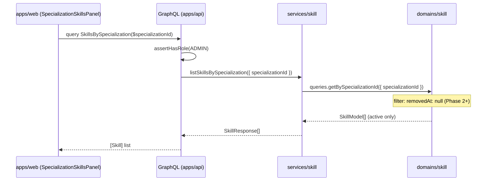
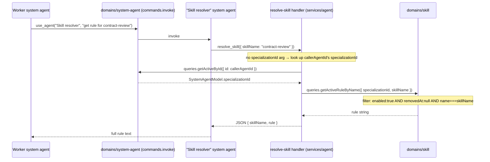

# Skill — Architecture

**Feature slug:** `skill`
**PRD:** [`prd.md`](./prd.md)
**Phases covered:** MVP (Read & view) · Phase 2 (Provisioning) · Phase 3 (Agent consumption)
**Reference architecture:** [`specialization/architecture.md`](../specialization/architecture.md)

---

## Analysis

### What Exists (Reuse)

| Existing piece | Location | Reuse plan |
|---|---|---|
| `domains/specialization` — domain pattern | `domains/specialization/src/` | Template for `domains/skill`: identical `model/dto/factory/graphql/queries/clients` layout |
| `services/specialization` — thin service layer | `services/specialization/src/handlers/` | Template for `services/skill`: same handler structure |
| `getBySpecializationId` FK query | `domains/system-agent/src/queries/getBySpecializationId/` | Pattern verbatim for `domains/skill/src/queries/getBySpecializationId/` |
| `SpecializationAgentsPanel` / `SpecializationMcpsPanel` | `apps/web/app/specialization/[id]/_components/` | Copy + adapt for `SpecializationSkillsPanel` |
| `useSpecializationDetail` hook | `apps/web/app/specialization/[id]/_components/useSpecializationDetail.ts` | Pattern for `useSkillDetail` |
| `GET_SPECIALIZATION_QUERY` / `useSpecialization` | `ui/api-hooks/src/specializations/` | Pattern for `GET_SKILL_QUERY`, `LIST_SKILLS_BY_SPECIALIZATION_QUERY` |
| `@vassembly/client-aws-s3` | `packages/client-aws-s3/src/client.ts` | `AwsS3Client({ bucketName }).getFile({ key: storageKey })` |
| `S3Config` / `Config` interfaces | `packages/config/src/types.ts` | Extend with `SkillsConfig` |
| `mongodbIndexes` pattern | `domains/specialization/src/clients/mongodb.ts` | Same `MongoDbDAO` + `createIndex` pattern |
| `registerApiMongoIndexes` bootstrap | `apps/api/src/bootstrap/mongoIndexes.ts` | Add `skillMongodbIndexes` |
| `registerSpecializationResolvers` pattern | `apps/api/src/graphql/resolvers/specialization.ts` | Copy structure for `registerSkillResolvers` |
| `defineRoute` + `authorizeAdminRequest` | `apps/api/src/routes/system-agents/getById.ts` | Pattern for REST script content route |
| `ProtectedAuthRoute` with `roles={['admin']}` | `apps/web/lib/auth/ProtectedAuthRoute.tsx` | Route guard for skill detail page |
| `NotFoundError` | `@vassembly/errors` | Throw when skill not found |
| **`domains/system-agent/commands/removeSoft`** | `domains/system-agent/src/commands/removeSoft/` | Exact pattern for `domains/skill/src/commands/removeSoft/` |
| **`services/agent/handlers/archiveSystemAgent`** | `services/agent/src/handlers/archiveSystemAgent/` | Pattern for `services/skill/handlers/archiveSkill/` |
| **`apps/api/src/routes/system-agents/delete.ts`** | `apps/api/src/routes/system-agents/delete.ts` | Pattern for `apps/api/src/routes/skills/archive.ts` |
| **`ui/api-hooks/src/systemAgents/http/archiveSystemAgent.ts`** | existing | Pattern for `ui/api-hooks/src/skills/http/archiveSkill.ts` |
| **`INTERNAL_TOOLS` registry** | `packages/constants/src/internalTools/registry.ts` | Add `resolve-skill` entry (`SYSTEM_ONLY`) |
| **`SYSTEM_AGENT_NAME` enum** | `packages/constants/src/SystemAgentName.ts` | Add `SkillResolver = 'Skill resolver'` |
| **`systemAgents.json` seed** | `domains/system-agent/seed/systemAgents.json` | Add "Skill resolver" seed entry |
| **`buildSystemAgentSystemMessage`** | `domains/system-agent/src/utils/buildSystemAgentSystemMessage/index.ts` | Extend to accept optional `skillsCatalogSection?: string` |
| **`services/agent/helpers/internalTools/createInternalToolHandlers`** | existing | Add `'resolve-skill'` binding |
| **`runAgentInvokeWithTools.ts` `invokeSystemAgent`** | `services/agent/src/helpers/internalTools/runAgentInvokeWithTools.ts` | Inject catalog section before system agent invoke |
| **`packages/client-langchain` schemas** | `packages/client-langchain/src/internalTools/schemas/` | Add `resolveSkillSchema.ts` |

### What Already Exists from MVP

The MVP phase shipped the following — **do not rebuild**:

| Package | What exists |
|---|---|
| `domains/skill` | `model/`, `queries/getById`, `queries/getModelById`, `queries/getBySpecializationId`, `commands/create`, `commands/update`, `clients/mongodb`, `clients/scriptStorage`, `constants` |
| `services/skill` | `handlers/createSkill`, `handlers/updateSkill`, `handlers/listSkillsBySpecialization`, `handlers/getSkill` |
| `apps/api/routes/skills` | `create.ts`, `update.ts`, `getSkillScript.ts`, `index.ts` |
| `ui/api-hooks/src/skills` | `GET_SKILL_QUERY`, `LIST_SKILLS_BY_SPECIALIZATION_QUERY`, `useSkill`, `useSkillsBySpecialization`, `useCreateSkill`, `useUpdateSkill`, `http/createSkill`, `http/updateSkill`, `types.ts` |
| `apps/web` | `SpecializationSkillsPanel`, skill detail route, skill create/edit routes, `SkillForm` |
| `packages/constants` | `create-skill` registered in `INTERNAL_TOOLS` |
| `packages/client-langchain` | `createSkillSchema.ts` |

### What is Genuinely New by Phase

**Phase 2 — Provisioning (archive only; create/edit already shipped)**

- `domains/skill/commands/removeSoft` — soft-delete command using `removeSoftDb` from `@vassembly/commands`
- `domains/skill/queries/getBySpecializationId` — **update** existing filter to exclude `removedAt != null`
- `services/skill/handlers/archiveSkill` — admin archive handler (mirrors `archiveSystemAgent`)
- `apps/api/src/routes/skills/archive.ts` — REST `DELETE /skills/:skillId` (admin-gated)
- `ui/api-hooks/src/skills/http/archiveSkill.ts` + `useArchiveSkill.ts` — client-side archive hook
- Admin archive dialog UI on the skills panel / skill detail page

**Phase 3 — Agent consumption**

- `domains/skill/queries/getCatalogBySpecializationId` — catalog-tier query: returns only `enabled: true AND removedAt: null`, name+description only, for system message injection
- `domains/skill/queries/getActiveRuleByName` — rule-tier query: looks up a single active skill rule by `specializationId + name`
- `domains/skill/utils/formatSkillsCatalogSection` — pure function: formats an array of `{name, description}` into a system-message-ready text block
- `services/agent/helpers/internalTools/resolveSkill` — `resolve-skill` internal tool handler
- `packages/client-langchain/schemas/resolveSkillSchema.ts` — Zod schema for `resolve_skill` LLM tool
- `packages/constants` — add `resolve-skill` to `INTERNAL_TOOLS` registry; add `SkillResolver` to `SYSTEM_AGENT_NAME`
- `domains/system-agent/seed/systemAgents.json` — add "Skill resolver" seed entry
- `domains/system-agent/commands/invoke/index.ts` + `types.ts` — accept optional `skillsCatalogSection?: string`; pass to `buildSystemAgentSystemMessage`
- `domains/system-agent/utils/buildSystemAgentSystemMessage/index.ts` + `types` — append `skillsCatalogSection` when present
- `services/agent/helpers/internalTools/runAgentInvokeWithTools.ts` `invokeSystemAgent` — query catalog and inject before invoke when `agent.specializationId` is set
- `services/agent/helpers/internalTools/createInternalToolHandlers.ts` — add `'resolve-skill'` binding

### Layers Involved (all phases)

```
packages/config                     ← extend Config + SkillsConfig types
packages/constants                  ← add resolve-skill to INTERNAL_TOOLS; add SkillResolver to SYSTEM_AGENT_NAME
packages/client-langchain           ← add resolveSkillSchema

domains/skill                       ← extend: commands/removeSoft, queries updates (archive filter + catalog + rule),
                                      utils/formatSkillsCatalogSection
domains/system-agent                ← extend: commands/invoke (skillsCatalogSection param),
                                      utils/buildSystemAgentSystemMessage (append section),
                                      seed/systemAgents.json (Skill resolver)

services/skill                      ← add: handlers/archiveSkill
services/agent                      ← extend: runAgentInvokeWithTools (catalog injection),
                                      internalTools/resolveSkill (new handler),
                                      createInternalToolHandlers (register resolve-skill)

apps/api                            ← add: routes/skills/archive.ts; register in routes/skills/index.ts
ui/api-hooks                        ← add: skills/http/archiveSkill.ts, skills/useArchiveSkill.ts
apps/web                            ← add: archive dialog + button in skills panel / skill detail
```

> **Domain isolation:** `domains/system-agent` must NOT import `domains/skill`. Catalog injection happens entirely in `services/agent`, which is allowed to import both domains. The catalog section is passed to `domains/system-agent/commands/invoke` as a pre-formatted `string` — no skill types cross the boundary.

---

## Architecture & Package Placement

### Data Flow: MVP — Admin reads skills list (GraphQL)



### Data Flow: Phase 2 — Admin archives a skill (REST DELETE)

```mermaid
sequenceDiagram
    participant UI as apps/web (ArchiveSkillDialog)
    participant REST as REST DELETE /api/skills/:id (apps/api)
    participant Svc as services/skill (archiveSkill)
    participant SkDomain as domains/skill (commands.removeSoft)

    UI->>REST: DELETE /api/skills/:skillId (admin token)
    REST->>REST: authorizeAdminRequest → userId
    REST->>Svc: archiveSkill({ adminUserId, skillId })
    Svc->>SkDomain: queries.getById({ id: skillId }) → verify exists
    Svc->>SkDomain: commands.removeSoft({ id: skillId })
    Note over SkDomain: sets removedAt = now; skill excluded from active queries
    SkDomain-->>Svc: SkillModel (archived)
    Svc-->>REST: SkillResponse (with removedAt)
    REST-->>UI: 200 { skill }
    Note over UI: remove skill from panel list; show success toast
```

### Data Flow: Phase 3 — Catalog tier (auto-inject into system agent)

```mermaid
sequenceDiagram
    participant Caller as use_agent tool caller
    participant SvcAgent as services/agent (runAgentInvokeWithTools)
    participant SkDomain as domains/skill
    participant SADomain as domains/system-agent (commands.invoke)

    Caller->>SvcAgent: invokeSystemAgent({ agentId, message })
    SvcAgent->>SADomain: queries.getActiveById({ id: agentId })
    SADomain-->>SvcAgent: SystemAgentModel (specializationId set)
    SvcAgent->>SkDomain: queries.getCatalogBySpecializationId({ specializationId })
    Note over SkDomain: filter: enabled:true AND removedAt:null; returns name+description only
    SkDomain-->>SvcAgent: CatalogItem[]
    SvcAgent->>SkDomain: utils.formatSkillsCatalogSection(items)
    SkDomain-->>SvcAgent: skillsCatalogSection string
    SvcAgent->>SADomain: commands.invoke({ ..., skillsCatalogSection })
    Note over SADomain: buildSystemAgentSystemMessage appends catalog section
    SADomain-->>SvcAgent: InvokeSystemAgentResult
```

> **Personal agents never receive catalog:** `invokePersonalAgent` does not perform catalog injection. Only `invokeSystemAgent` injects when `agent.specializationId != null`.

### Data Flow: Phase 3 — Rule tier (resolve-skill on demand)



### Cross-Package Dependency Map

```
packages/config
  ↑ imported by: apps/api (SkillsConfig wiring), domains/skill (scriptStorage factory)

packages/constants
  ↑ imported by: domains/system-agent (buildSystemAgentSystemMessage, SYSTEM_AGENT_NAME),
                 services/agent (INTERNAL_TOOLS registry, SYSTEM_AGENT_NAME)

packages/client-langchain
  ↑ imported by: domains/agent (tool schema registration for LLM)

domains/skill
  ↑ imported by: services/skill, services/agent (catalog injection + resolve-skill), apps/api (REST + GraphQL)

domains/system-agent
  ↑ imported by: services/agent (catalog injection, resolve-skill context lookup)
  ⚠️  does NOT import domains/skill

services/skill
  ↑ imported by: apps/api (GraphQL resolver)

services/agent
  ↑ imported by: apps/api (invoke + agent management handlers)

ui/api-hooks (skills/)
  ↑ imported by: apps/web

apps/web
  — imports: @vassembly/ui-api-hooks (skill hooks), next/navigation, react-syntax-highlighter
```

---

## Recommendation

**Overall approach:** All three phases extend existing packages incrementally — no new packages are introduced beyond what the MVP plan already created (`domain-skill`, `service-skill`). Phase 2 adds the archive command to the skill domain and a thin archive handler to the service. Phase 3 adds two new queries to the skill domain, a formatting utility, and extends `services/agent` with catalog injection and the `resolve-skill` tool handler. The `domains/system-agent` receives only a minimal param extension to `invoke` — it never imports `domains/skill`.

**Why this reduces complexity:**
- Archive reuses `removeSoftDb` verbatim — zero novel logic.
- Catalog injection is a pure data read + string format inserted into the existing `invokeSystemAgent` call path — no new abstractions.
- `resolve-skill` handler mirrors the `createSkill` handler structure exactly.
- `buildSystemAgentSystemMessage` extension follows the existing `formatIntentCategoriesSection` pattern.
- Personal agents are completely unaffected — catalog injection is conditional on `specializationId` which personal agents never have.

---

## Domain Model Details

### `SkillModel` (`domains/skill/src/model/model.ts`) — existing

```typescript
import { Model } from '@vassembly/model';
import type { SkillScript } from './types';

export class SkillModel extends Model {
  specializationId!: string;
  name!: string;
  description!: string;
  rule!: string;
  enabled!: boolean;
  scripts!: SkillScript[];
  // removedAt?: Date | null  ← inherited from base Model via removeSoftDb
}
```

> `enabled` and `removedAt` together determine active status. Phase 3 catalog queries filter on `enabled: true AND removedAt: null`.

### Response DTO (`domains/skill/src/model/dto.ts`) — Phase 2 extension

Add `removedAt: string | null` to `SkillResponse`:

```typescript
export interface SkillResponse {
  id: string;
  specializationId: string;
  name: string;
  description: string;
  rule: string;
  enabled: boolean;
  scripts: SkillScriptResponse[];
  createdAt: string;
  updatedAt: string;
  removedAt: string | null;  // Phase 2 addition
}
```

### Catalog Item type (`domains/skill/src/queries/getCatalogBySpecializationId/types.ts`) — Phase 3

```typescript
export interface SkillCatalogItem {
  name: string;
  description: string;
}

export interface GetCatalogBySpecializationIdParams {
  specializationId: string;
}

export interface GetCatalogBySpecializationIdResult {
  items: SkillCatalogItem[];
}
```

---

## API Design

### GraphQL (unchanged from MVP)

```graphql
type Skill {
  id: ID!
  specializationId: ID!
  name: String!
  description: String!
  rule: String!
  enabled: Boolean!
  scripts: [SkillScript!]!
  createdAt: String!
  updatedAt: String!
  removedAt: String
}

type Query {
  skill(id: ID!): Skill
  skillsBySpecialization(specializationId: ID!): [Skill!]!
}
```

Both queries require `AUTH_TOKEN_ROLE.ADMIN`. Active-only filter (`removedAt: null`) applied in `getBySpecializationId` query (Phase 2 update).

### REST: Script Content (MVP — unchanged)

```
GET /api/skills/:skillId/scripts/:filename
Authorization: Bearer <admin token>
```

### REST: Archive Skill (Phase 2 — new)

```
DELETE /api/skills/:skillId
Authorization: Bearer <admin token>
```

| Status | Body | Condition |
|--------|------|-----------|
| `200` | `{ skill: SkillResponse }` | Archived successfully |
| `403` | error JSON | Non-admin or unauthenticated |
| `404` | `{ error: "skill_not_found" }` | Skill ID not in DB |
| `409` | `{ error: "already_archived" }` | Skill already archived |

**Server-side steps:**
1. `authorizeAdminRequest({ headers })` — 403 if not admin
2. `skillService.archiveSkill({ adminUserId, skillId })` — throws `NotFoundError` / `WrongParamError`
3. Return `200 { skill: archivedSkillResponse }`

**Route file:** `apps/api/src/routes/skills/archive.ts`

### Internal Tool: `resolve-skill` (Phase 3 — new, system-only)

**LLM tool name:** `resolve_skill`
**Access scope:** `SYSTEM_ONLY`

**Args schema (`packages/client-langchain/schemas/resolveSkillSchema.ts`):**

```typescript
export const resolveSkillSchema = z.object({
  skillName: z.string().min(1).describe('Exact name of the skill to resolve (e.g. "contract-review")'),
  specializationId: z.string().optional().describe(
    'Override specializationId. If omitted, the calling agent\'s specializationId is used.',
  ),
});
```

**Handler result:** Returns a JSON string `{ skillName: string; rule: string }`.

**Error behavior:**
- `NotFoundError` if skill not found, archived, or disabled — LLM receives a descriptive error string.

---

## Phase 2 — Archive Implementation Details

### `domains/skill/commands/removeSoft` (new)

Pattern: verbatim copy of `domains/system-agent/src/commands/removeSoft/index.ts` adapted for skill:

```typescript
// domains/skill/src/commands/removeSoft/index.ts
import { removeSoftDb } from '@vassembly/commands';
import { WrongParamError, NotFoundError } from '@vassembly/errors';
import { skillMongodbDao } from '../../clients';
import { SkillModel, skillFactory } from '../../model';
import { getModelById } from '../../queries/getModelById';

export const removeSoft = async ({ id }: RemoveSoftParams): Promise<RemoveSoftResult> => {
  const existing = await getModelById({ id });
  if (existing.data === null) throw new NotFoundError('Skill not found');
  if (existing.data.removedAt != null) throw new WrongParamError('Archive requires active skill');

  const persistRemoveSoft = removeSoftDb<SkillModel>({
    dao: skillMongodbDao,
    factory: skillFactory,
  });

  return persistRemoveSoft({ id });
};
```

### `domains/skill/queries/getBySpecializationId` — update (Phase 2)

Add `removedAt: null` condition to `buildFilter`:

```typescript
const buildFilter = ({ specializationId, search }: BuildBySpecializationIdFilterParams) => {
  const conditions = [
    { specializationId },
    { $or: [{ removedAt: { $exists: false } }, { removedAt: null }] },
  ];
  const searchFilter = buildNameDescriptionSearchFilter({ search });
  if (searchFilter !== undefined) conditions.push(searchFilter);
  return { $and: conditions };
};
```

### `services/skill/handlers/archiveSkill` (new)

```typescript
// services/skill/src/handlers/archiveSkill/index.ts
import { AUTH_TOKEN_ROLE } from '@vassembly/constants';
import skillDomain from '@vassembly/domain-skill';
import userDomain from '@vassembly/domain-user';
import { NotFoundError } from '@vassembly/errors';
import { toSkillResponse } from '@vassembly/domain-skill';

export const archiveSkill = async ({
  adminUserId,
  skillId,
}: ArchiveSkillParams): Promise<ArchiveSkillResult> => {
  await userDomain.queries.assertHasRole({ userId: adminUserId, role: AUTH_TOKEN_ROLE.ADMIN });

  const existing = await skillDomain.queries.getById({ id: skillId });
  if (!existing.data) throw new NotFoundError('Skill not found');

  const result = await skillDomain.commands.removeSoft({ id: skillId });
  return { skill: toSkillResponse({ skill: result.data }) };
};
```

### Admin Archive UI

The archive dialog follows the existing pattern for system agent archiving. The `SpecializationSkillsPanel` item and/or the `SkillDetailPage` header gains an archive button (admin only). On confirmation:

1. `useArchiveSkill` hook calls `DELETE /api/skills/:skillId`
2. On success: refetch `skillsBySpecialization` query (panel list auto-updates)
3. If on detail page: navigate back to specialization detail

---

## Phase 3 — Agent Consumption Implementation Details

### `domains/skill/queries/getCatalogBySpecializationId` (new)

Returns only active (non-archived, enabled) skills, projecting only `name` and `description`:

```typescript
// domains/skill/src/queries/getCatalogBySpecializationId/index.ts
export const getCatalogBySpecializationId = async ({
  specializationId,
}: GetCatalogBySpecializationIdParams): Promise<GetCatalogBySpecializationIdResult> => {
  const rows = await skillMongodbDao.getManyRaw(
    {
      specializationId,
      enabled: true,
      $or: [{ removedAt: { $exists: false } }, { removedAt: null }],
    },
    { sort: { name: 1 } },
  );

  const items: SkillCatalogItem[] = rows.map((row) => ({
    name: String(row.name),
    description: String(row.description),
  }));

  return { items };
};
```

### `domains/skill/queries/getActiveRuleByName` (new)

```typescript
// domains/skill/src/queries/getActiveRuleByName/index.ts
export const getActiveRuleByName = async ({
  specializationId,
  skillName,
}: GetActiveRuleByNameParams): Promise<GetActiveRuleByNameResult> => {
  const row = await skillMongodbDao.getRaw({
    specializationId,
    name: skillName,
    enabled: true,
    $or: [{ removedAt: { $exists: false } }, { removedAt: null }],
  });

  if (!row) {
    throw new NotFoundError(`Skill "${skillName}" not found or not active`);
  }

  return { rule: String(row.rule) };
};
```

### `domains/skill/utils/formatSkillsCatalogSection` (new)

Pure function; lives in `domains/skill/src/utils/formatSkillsCatalogSection.ts`:

```typescript
export interface FormatSkillsCatalogSectionParams {
  items: Array<{ name: string; description: string }>;
}

export const formatSkillsCatalogSection = ({
  items,
}: FormatSkillsCatalogSectionParams): string => {
  if (items.length === 0) return '';

  const lines = items.map((item) => `- **${item.name}**: ${item.description}`);
  return `## Available Skills\n\n${lines.join('\n')}`;
};
```

> Exported from `domains/skill/src/index.ts` as a named utility.

### `domains/system-agent/commands/invoke` extension (Phase 3)

Extend `InvokeSystemAgentParams` with optional `skillsCatalogSection`:

```typescript
// domains/system-agent/src/commands/invoke/types.ts (extend)
export interface InvokeSystemAgentParams {
  // ...existing fields...
  skillsCatalogSection?: string;  // Phase 3: pre-formatted catalog block from services/agent
}
```

Pass through to `buildSystemAgentSystemMessage`:

```typescript
// domains/system-agent/src/commands/invoke/index.ts (extend call)
systemMessage: buildSystemAgentSystemMessage({
  name: agentResult.data.name!,
  rule: agentResult.data.rule,
  skillsCatalogSection: params.skillsCatalogSection,
}),
```

### `domains/system-agent/utils/buildSystemAgentSystemMessage` extension (Phase 3)

```typescript
// extend BuildSystemAgentSystemMessageParams
export interface BuildSystemAgentSystemMessageParams {
  name: string;
  rule: string;
  skillsCatalogSection?: string;  // Phase 3 addition
}

export const buildSystemAgentSystemMessage = ({
  name,
  rule,
  skillsCatalogSection,
}: BuildSystemAgentSystemMessageParams): string => {
  let systemMessage = rule;

  if (name === SYSTEM_AGENT_NAME.IntentClassifier) {
    systemMessage = `${rule}\n\n${formatIntentCategoriesSection()}`;
  } else if (name === SYSTEM_AGENT_NAME.Assistant) {
    systemMessage = `${rule}\n\n${formatIntentRoutingSection()}`;
  }

  if (skillsCatalogSection) {
    systemMessage = `${systemMessage}\n\n${skillsCatalogSection}`;
  }

  return systemMessage;
};
```

### `services/agent/helpers/internalTools/runAgentInvokeWithTools.ts` extension (Phase 3)

Extend `invokeSystemAgent` to query and inject the catalog when `agent.specializationId` is set:

```typescript
// add import at top
import skillDomain, { formatSkillsCatalogSection } from '@vassembly/domain-skill';

// inside invokeSystemAgent, after getting the agent:
const skillsCatalogSection =
  agent.specializationId
    ? await buildSkillsCatalogSection({ specializationId: agent.specializationId })
    : undefined;

// pass to invoke:
const result = await systemAgentDomain.commands.invoke({
  modeledProviderClient: client,
  systemAgentId: agentId,
  message,
  internalToolBindings: bindings,
  signal: toolContext.abortSignal,
  shouldAbort: toolContext.shouldAbort,
  skillsCatalogSection,  // Phase 3 addition
});
```

Where `buildSkillsCatalogSection` is an internal helper (same file or extracted to a small file in `services/agent/helpers/`):

```typescript
const buildSkillsCatalogSection = async ({
  specializationId,
}: {
  specializationId: string;
}): Promise<string | undefined> => {
  const { items } = await skillDomain.queries.getCatalogBySpecializationId({ specializationId });
  if (items.length === 0) return undefined;
  return formatSkillsCatalogSection({ items });
};
```

### `services/agent/helpers/internalTools/resolveSkill` (new)

```typescript
// services/agent/src/helpers/internalTools/resolveSkill/index.ts
import skillDomain from '@vassembly/domain-skill';
import systemAgentDomain from '@vassembly/domain-system-agent';
import { NotFoundError, ValidationError } from '@vassembly/errors';
import type { InternalToolContext } from '../types';

export const resolveSkillToolHandler = async (
  args: Record<string, unknown>,
  context: InternalToolContext,
): Promise<string> => {
  const skillName = typeof args.skillName === 'string' ? args.skillName.trim() : '';
  if (!skillName) throw new ValidationError('skillName is required');

  let specializationId = typeof args.specializationId === 'string'
    ? args.specializationId.trim()
    : '';

  if (!specializationId) {
    const { data: callerAgent } = await systemAgentDomain.queries.getActiveById({
      id: context.callerAgentId,
    });
    specializationId = callerAgent?.specializationId ?? '';
  }

  if (!specializationId) {
    throw new ValidationError('Cannot resolve skill: no specializationId available');
  }

  const { rule } = await skillDomain.queries.getActiveRuleByName({ specializationId, skillName });
  return JSON.stringify({ skillName, rule });
};
```

### "Skill resolver" seed (`domains/system-agent/seed/systemAgents.json` — Phase 3)

Add new entry:

```json
{
  "name": "Skill resolver",
  "description": "Resolves the full rule of a named skill for the calling agent's specialization domain.",
  "rule": "You retrieve the full instructions for a skill by name.\n\nWorkflow:\n1. Call resolve_skill with the skill name from the caller's message.\n2. If specializationId is not provided in the call, the tool resolves it automatically from your context.\n3. Return the full rule text to the caller as-is — no summarization or modification.\n\nIf resolve_skill returns an error, forward the error message to the caller.",
  "category": "utility",
  "assignedToolIds": ["resolve-skill"]
}
```

---

## Storage Abstraction Design (Refactored — Script Storage Strategy)

> **Status**: The original inline implementation in `domains/skill/src/clients/scriptStorage.ts` has been replaced by a Strategy-pattern design split across `packages/client-script-storage` (new), an extended `packages/client-file`, and a thin domain factory.

### Design Goals

- Apply Strategy pattern: `LocalScriptStorageStrategy` (fs) and `S3ScriptStorageStrategy` — each isolated in its own module
- Extract strategies into a reusable `packages/client-script-storage` package, keeping the domain client thin
- Reuse `@vassembly/client-file` (`FileClient`, `DirectoryClient`) in the local strategy instead of duplicating `node:fs` logic
- Remove `scriptStorageClient` from the domain's public exports — move the read path behind a domain query
- Fix the API route convention violation: `apps/api` must not import `scriptStorageClient` directly

---

### Package: `packages/client-script-storage` (new)

Provides the strategy interface and two concrete implementations. Consumed only by `domains/*/src/clients/`.

```
packages/client-script-storage/
├── src/
│   ├── index.ts                      ← exports: ScriptStorageStrategy type + both factories
│   ├── types.ts                      ← ScriptStorageStrategy, GetScriptContentParams,
│   │                                    PutScriptContentParams, RemoveScriptContentParams
│   ├── localStrategy/
│   │   ├── index.ts                  ← LocalScriptStorageStrategy({ rootPath })
│   │   └── types.ts                  ← LocalStrategyParams
│   └── s3Strategy/
│       ├── index.ts                  ← S3ScriptStorageStrategy({ bucketName })
│       └── types.ts                  ← S3StrategyParams
├── package.json
├── tsconfig.json
├── vitest.config.ts
└── README.md
```

**`ScriptStorageStrategy` interface (`types.ts`):**

```typescript
export interface ScriptStorageStrategy {
  getScriptContent: (params: GetScriptContentParams) => Promise<string>;
  putScriptContent: (params: PutScriptContentParams) => Promise<void>;
  removeScriptContent: (params: RemoveScriptContentParams) => Promise<void>;
}
```

**`LocalScriptStorageStrategy` (`localStrategy/index.ts`):**

Uses `FileClient` + `DirectoryClient` from `@vassembly/client-file`. Composes `DirectoryClient.create` before writing to ensure parent directories exist.

```typescript
export const LocalScriptStorageStrategy = ({ rootPath }: LocalStrategyParams): ScriptStorageStrategy => {
  const dir = DirectoryClient({ basePath: rootPath });
  const file = FileClient({ basePath: rootPath });

  return {
    getScriptContent: async ({ storageKey }) =>
      file.read({ filePath: storageKey }),    // throws NotFoundError on ENOENT (see client-file extension)

    putScriptContent: async ({ storageKey, content }) => {
      const parentDir = path.dirname(storageKey);
      if (parentDir !== '.') {
        await dir.create({ dirPath: parentDir });
      }
      await file.write({ filePath: storageKey, content });
    },

    removeScriptContent: async ({ storageKey }) =>
      file.removeIfExists({ filePath: storageKey }), // swallows ENOENT gracefully
  };
};
```

**`S3ScriptStorageStrategy` (`s3Strategy/index.ts`):**

```typescript
export const S3ScriptStorageStrategy = ({ bucketName }: S3StrategyParams): ScriptStorageStrategy => {
  const s3 = AwsS3Client({ bucketName });

  return {
    getScriptContent: async ({ storageKey }) => {
      const content = await s3.getFile({ key: storageKey });
      if (content === undefined) throw new NotFoundError('script_file_missing');
      return content;
    },
    putScriptContent: async ({ storageKey, content }) => {
      await s3.uploadFile({ key: storageKey, file: Buffer.from(content, 'utf-8'), fileType: 'text/plain' });
    },
    removeScriptContent: async ({ storageKey }) => s3.removeFile({ key: storageKey }),
  };
};
```

---

### Package: `packages/client-file` (extended)

Two gaps required extension to support the local strategy:

| Gap | Fix |
|-----|-----|
| `FileClient.read` wraps ENOENT as `InternalError` — callers cannot distinguish "file not found" | `read` now throws `NotFoundError` for ENOENT, `InternalError` for other failures |
| `FileClient.remove` wraps ENOENT as `InternalError` — removal of missing file should be a no-op | New `removeIfExists` method: swallows ENOENT, rethrows other errors as `InternalError` |

> `FileClient.write` does not auto-create parent dirs. The local strategy handles this explicitly via `DirectoryClient.create` — no change needed to `client-file`.

---

### Domain factory: `domains/skill/src/clients/scriptStorage.ts` (refactored)

The factory becomes ~20 lines — pure config-to-strategy dispatch, no inline fs/S3 code:

```typescript
import { LocalScriptStorageStrategy, S3ScriptStorageStrategy } from '@vassembly/client-script-storage';
import type { ScriptStorageStrategy } from '@vassembly/client-script-storage';
import { config, Environment } from '@vassembly/config';

export type ScriptStorageClient = ScriptStorageStrategy;  // stable alias for domain consumers

export const createScriptStorageClient = (): ScriptStorageClient => {
  if (config.environment !== Environment.Production) {
    const rootPath = config.skills.scriptStorage.localRootPath ?? './.data/skill-scripts';
    return LocalScriptStorageStrategy({ rootPath });
  }

  const { bucketName } = config.skills.scriptStorage;
  if (!bucketName) throw new Error('SKILL_SCRIPT_STORAGE_BUCKET is required in production');

  return S3ScriptStorageStrategy({ bucketName });
};

export const scriptStorageClient = createScriptStorageClient();
```

`ScriptStorageClient` is kept as a type alias for backward compatibility with `commands/shared/persistScripts.ts`. The singleton `scriptStorageClient` remains for internal domain use only — it is **no longer exported from `domains/skill/src/index.ts`**.

---

### Domain query: `domains/skill/src/queries/getScriptContent/` (new)

Encapsulates the full "get script content" read path — previously scattered across the API route:

```typescript
export const getScriptContent = async ({ skillId, filename }: GetScriptContentParams): Promise<GetScriptContentResult> => {
  const { data: skill } = await getModelById({ id: skillId });
  const script = skill.scripts.find((s) => s.filename === filename);
  if (!script) throw new NotFoundError('script_not_found');
  const content = await scriptStorageClient.getScriptContent({ storageKey: script.storageKey });
  return { content };
};
```

Exported from `domains/skill/src/queries/index.ts` and domain index.

---

### Service handler: `services/skill/src/handlers/getSkillScript/` (new)

Thin delegator — authorization is handled at the route level via `authorizeAdminRequest`:

```typescript
export const getSkillScript = async ({ skillId, filename }: GetSkillScriptParams): Promise<GetSkillScriptResult> => {
  return skillDomain.queries.getScriptContent({ skillId, filename });
};
```

---

### API route: `apps/api/src/routes/skills/getSkillScript.ts` (refactored)

- Remove direct `scriptStorageClient` import
- Remove `isEnoentError` helper (ENOENT → `NotFoundError` now handled in `FileClient.read` / domain query)
- Call `skillService.handlers.getSkillScript({ skillId, filename })`

---

### Config Extension (`packages/config/src/types.ts`)

Unchanged from MVP:

```typescript
export interface SkillScriptStorageConfig {
  bucketName: string;
  localRootPath?: string;
}

export interface SkillsConfig {
  scriptStorage: SkillScriptStorageConfig;
}
```

---

## MongoDB Indexes

```typescript
export const mongodbIndexes = async (): Promise<void> => {
  const collection = getSkillsCollection();
  await collection.createIndex({ specializationId: 1, name: 1 }, { unique: true });
  await collection.createIndex({ specializationId: 1 });
  // Phase 3: catalog query uses (specializationId, enabled, removedAt) — covered by { specializationId: 1 } + collection-level filter
};
```

> No additional indexes needed for Phase 3 catalog queries. The `{ specializationId: 1 }` index covers the catalog and rule lookups; `enabled` and `removedAt` filtering is in-memory on the small result set.

---

## UI File Structure

### Phase 2 additions to `ui/api-hooks/src/skills/`

```
skills/
  http/
    archiveSkill.ts          ← DELETE /api/skills/:id → { skill: SkillItem }
  useArchiveSkill.ts         ← wraps archiveSkill http, returns { archive, loading, error }
  index.ts                   ← re-export archiveSkill, useArchiveSkill
```

### Phase 2 additions to `apps/web`

```
specialization/[id]/_components/SpecializationSkillsPanel/
  SkillArchiveDialog/
    SkillArchiveDialog.tsx          ← confirmation modal: "Archive {name}?" + confirm/cancel
    SkillArchiveDialog.module.scss
  (extend SpecializationSkillsPanel.tsx) ← add archive button to each skill row (kebab menu or direct)
```

And/or on skill detail:

```
specialization/[id]/skills/[skillId]/_components/
  (extend SkillDetailHeader.tsx) ← add "Archive" button (admin only)
```

The archive button trigger options are left to the UI implementation phase. Either kebab menu on panel list item, or a prominent action on detail page — both are valid. The architecture permits both entry points independently since they both call `useArchiveSkill`.

---

## Implementation Steps

### Phase 2 — Archive

**Step P2-1 — `domains/skill/commands/removeSoft`**

Create `domains/skill/src/commands/removeSoft/index.ts` + `types.ts` following the `domains/system-agent/src/commands/removeSoft/index.ts` pattern. Export from `domains/skill/src/commands/index.ts`.

**Step P2-2 — `domains/skill/queries/getBySpecializationId` update**

In `buildFilter`, add `{ $or: [{ removedAt: { $exists: false } }, { removedAt: null }] }` to the `conditions` array. No type changes needed — the filter is raw MongoDB.

**Step P2-3 — `domains/skill/model/dto.ts` update**

Add `removedAt: string | null` to `SkillResponse`. Update `toSkillResponse` mapper to include it via `toNullableIsoString`.

**Step P2-4 — `services/skill/handlers/archiveSkill`**

Create `handlers/archiveSkill/index.ts` + `types.ts`. Export from `handlers/index.ts`. Handler: assertHasRole, getById (verify exists), removeSoft, return SkillResponse.

**Step P2-5 — `apps/api/src/routes/skills/archive.ts`**

New `DELETE /:skillId` route. Pattern: `systemAgentDeleteRoute` in `apps/api/src/routes/system-agents/delete.ts`. Add to `apps/api/src/routes/skills/index.ts` routes array.

**Step P2-6 — `ui/api-hooks` archive client + hook**

Create `skills/http/archiveSkill.ts` (mirrors `http/archiveSystemAgent.ts`). Create `skills/useArchiveSkill.ts`. Export from `skills/index.ts`.

**Step P2-7 — `apps/web` archive UI**

Add archive button + `SkillArchiveDialog` to `SpecializationSkillsPanel` list item and/or `SkillDetailHeader`. On confirm: call `useArchiveSkill`, then refetch or navigate away.

**Step P2-8 — Update SK-6 E2E**

SK-6 scenario is superseded for Phase 2: admin _can_ now archive from specialization detail. Update `apps/web/e2e/features/skills/skill-list-on-specialization.feature` to reflect mutation UI now in scope (archive button visible; SK-9 scenario added).

### Phase 3 — Agent Consumption

**Step P3-1 — `packages/constants` registry + enum**

In `internalTools/registry.ts`: add `resolve-skill` entry (`SYSTEM_ONLY`, `llmToolName: 'resolve_skill'`).
In `SystemAgentName.ts`: add `SkillResolver = 'Skill resolver'`.

**Step P3-2 — `packages/client-langchain/schemas/resolveSkillSchema.ts`**

Create Zod schema with `skillName` (required) + `specializationId` (optional). Register in the tool schemas index.

**Step P3-3 — `domains/skill` Phase 3 queries + util**

Create:
- `queries/getCatalogBySpecializationId/index.ts` + `types.ts`
- `queries/getActiveRuleByName/index.ts` + `types.ts`
- `utils/formatSkillsCatalogSection.ts`

Export all three from `domains/skill/src/index.ts`.

**Step P3-4 — `domains/system-agent/commands/invoke` + `buildSystemAgentSystemMessage` extension**

- `invoke/types.ts`: add optional `skillsCatalogSection?: string` to `InvokeSystemAgentParams`
- `invoke/index.ts`: pass `skillsCatalogSection: params.skillsCatalogSection` to `buildSystemAgentSystemMessage`
- `utils/buildSystemAgentSystemMessage/index.ts`: extend `BuildSystemAgentSystemMessageParams` with `skillsCatalogSection?: string`; append to message after existing sections when present

**Step P3-5 — `services/agent/helpers/internalTools/resolveSkill`**

Create `helpers/internalTools/resolveSkill/index.ts` + `types.ts` (mirrors `createSkill` tool handler). No unit test for the registry binding itself — handler logic is tested.

**Step P3-6 — `services/agent/helpers/internalTools/createInternalToolHandlers.ts`**

Import `resolveSkillToolHandler`; add `'resolve-skill': (args) => resolveSkillToolHandler(args, toolContext)` to the returned map.

**Step P3-7 — `services/agent/helpers/internalTools/runAgentInvokeWithTools.ts`**

In `invokeSystemAgent`: after `getActiveById`, check `agent.specializationId`; if set, call `buildSkillsCatalogSection`; pass result as `skillsCatalogSection` to `systemAgentDomain.commands.invoke`. Personal agent path (`invokePersonalAgent`) is NOT changed.

**Step P3-8 — `domains/system-agent/seed/systemAgents.json`**

Add "Skill resolver" entry with `assignedToolIds: ["resolve-skill"]` and the rule instructing the agent to call `resolve_skill`.

---

## Todo Plan

### Phase 2 Todos

```
P2-1. domains/skill — add commands/removeSoft
   Changes needed: Create removeSoft command using removeSoftDb pattern;
                   guard against re-archiving; export from commands/index.ts
   Files to create:
     - domains/skill/src/commands/removeSoft/index.ts
     - domains/skill/src/commands/removeSoft/types.ts
   Files to modify:
     - domains/skill/src/commands/index.ts (add export)
   Suggested subagent workflow: tdd-unit-test-writer → coder ↔ code-reviewer (loop: max 2 iterations)
   Dependencies: none

P2-2. domains/skill — update getBySpecializationId + dto (archive filter + removedAt field)
   Changes needed: Add removedAt:null filter to buildFilter; add removedAt to SkillResponse DTO;
                   update toSkillResponse mapper to include removedAt via toNullableIsoString
   Files to modify:
     - domains/skill/src/queries/getBySpecializationId/index.ts (buildFilter)
     - domains/skill/src/model/dto.ts (add removedAt field)
     - domains/skill/src/model/toSkillResponse.ts (map removedAt)
   Suggested subagent workflow: tdd-unit-test-writer → coder ↔ code-reviewer (loop: max 2 iterations)
   Dependencies: P2-1 (removedAt semantics defined by removeSoft)

P2-3. services/skill — add archiveSkill handler
   Changes needed: Create archiveSkill handler: assertHasRole → getById → commands.removeSoft → return SkillResponse
   Files to create:
     - services/skill/src/handlers/archiveSkill/index.ts
     - services/skill/src/handlers/archiveSkill/types.ts
   Files to modify:
     - services/skill/src/handlers/index.ts (add export)
   Suggested subagent workflow: tdd-unit-test-writer → coder ↔ code-reviewer (loop: max 2 iterations)
   Dependencies: P2-1, P2-2

P2-4. apps/api — archive REST route (DELETE /skills/:skillId)
   Changes needed: Add DELETE /:skillId route following system-agents/delete.ts pattern;
                   calls skillService.archiveSkill; register in routes/skills/index.ts
   Files to create:
     - apps/api/src/routes/skills/archive.ts
   Files to modify:
     - apps/api/src/routes/skills/index.ts (add archiveSkillRoute to routes array)
   Suggested subagent workflow: coder ↔ code-reviewer (loop: max 2 iterations)
   Dependencies: P2-3

P2-5. ui/api-hooks — archive skill client + hook
   Changes needed: Add archiveSkill HTTP function and useArchiveSkill hook;
                   export from skills/index.ts
   Files to create:
     - ui/api-hooks/src/skills/http/archiveSkill.ts
     - ui/api-hooks/src/skills/useArchiveSkill.ts
   Files to modify:
     - ui/api-hooks/src/skills/http/index.ts (add export)
     - ui/api-hooks/src/skills/index.ts (add export)
   Suggested subagent workflow: coder ↔ code-reviewer (loop: max 2 iterations)
   Dependencies: P2-4

P2-6. apps/web — archive dialog + button UI
   Changes needed: Add SkillArchiveDialog; add archive button/menu on SpecializationSkillsPanel
                   item or SkillDetailHeader; on confirm call useArchiveSkill then refetch/navigate
   Files to create:
     - apps/web/app/specialization/[id]/_components/SpecializationSkillsPanel/SkillArchiveDialog/SkillArchiveDialog.tsx
     - apps/web/app/specialization/[id]/_components/SpecializationSkillsPanel/SkillArchiveDialog/SkillArchiveDialog.module.scss
   Files to modify:
     - apps/web/app/specialization/[id]/_components/SpecializationSkillsPanel/SpecializationSkillsPanel.tsx
       (or SkillDetailHeader.tsx — implementer chooses entry point)
   Suggested subagent workflow: coder ↔ code-reviewer (loop: max 2 iterations)
   Dependencies: P2-5

P2-7. apps/web — E2E update (SK-6 + SK-9)
   Changes needed: Update SK-6 to reflect mutation UI now in scope (archive button visible);
                   add SK-9 Gherkin scenarios to skill-list-on-specialization.feature
   Files to modify:
     - apps/web/e2e/features/skills/skill-list-on-specialization.feature
   Files to create (if new steps needed):
     - apps/web/e2e/steps/skills/archiveSkill.ts (only if not covered by existing step files)
   Suggested subagent workflow: tdd-e2e-test-writer → coder ↔ code-reviewer (loop: max 2 iterations)
   Dependencies: P2-6
```

### Phase 3 Todos

```
P3-1. packages/constants — add resolve-skill + SkillResolver
   Changes needed: Add resolve-skill entry (SYSTEM_ONLY, llmToolName: 'resolve_skill') to INTERNAL_TOOLS;
                   add SkillResolver = 'Skill resolver' to SYSTEM_AGENT_NAME enum
   Files to modify:
     - packages/constants/src/internalTools/registry.ts
     - packages/constants/src/SystemAgentName.ts
   Suggested subagent workflow: coder → Done
   Dependencies: none

P3-2. packages/client-langchain — resolveSkillSchema
   Changes needed: Create resolveSkillSchema.ts with skillName (required) + specializationId (optional);
                   export from internalTools/schemas index
   Files to create:
     - packages/client-langchain/src/internalTools/schemas/resolveSkillSchema.ts
   Files to modify:
     - packages/client-langchain/src/internalTools/schemas/index.ts (add export)
   Suggested subagent workflow: coder → Done
   Dependencies: none

P3-3. domains/skill — Phase 3 queries + formatSkillsCatalogSection util
   Changes needed: Add getCatalogBySpecializationId query (enabled+non-archived, name+description only);
                   add getActiveRuleByName query (active skill rule lookup by name+specializationId);
                   add formatSkillsCatalogSection pure util;
                   export all three from domains/skill/src/index.ts
   Files to create:
     - domains/skill/src/queries/getCatalogBySpecializationId/index.ts
     - domains/skill/src/queries/getCatalogBySpecializationId/types.ts
     - domains/skill/src/queries/getActiveRuleByName/index.ts
     - domains/skill/src/queries/getActiveRuleByName/types.ts
     - domains/skill/src/utils/formatSkillsCatalogSection.ts
   Files to modify:
     - domains/skill/src/queries/index.ts (add exports)
     - domains/skill/src/index.ts (export formatSkillsCatalogSection)
   Suggested subagent workflow: tdd-unit-test-writer → coder ↔ code-reviewer (loop: max 2 iterations)
   Dependencies: P2-1, P2-2 (removedAt semantics must be defined)

P3-4. domains/system-agent — invoke + buildSystemAgentSystemMessage extension
   Changes needed: Add optional skillsCatalogSection?: string to InvokeSystemAgentParams;
                   pass through in invoke/index.ts to buildSystemAgentSystemMessage;
                   extend BuildSystemAgentSystemMessageParams + append section at end of message
   Files to modify:
     - domains/system-agent/src/commands/invoke/types.ts
     - domains/system-agent/src/commands/invoke/index.ts
     - domains/system-agent/src/utils/buildSystemAgentSystemMessage/index.ts
   Suggested subagent workflow: tdd-unit-test-writer → coder ↔ code-reviewer (loop: max 2 iterations)
   Dependencies: none (no skill domain import; just adds a string param)

P3-5. services/agent — resolveSkill tool handler
   Changes needed: Create resolveSkillToolHandler; accepts { skillName, specializationId? };
                   if no specializationId arg, look up callerAgentId's specializationId via systemAgentDomain;
                   call skillDomain.queries.getActiveRuleByName; return JSON { skillName, rule }
   Files to create:
     - services/agent/src/helpers/internalTools/resolveSkill/index.ts
     - services/agent/src/helpers/internalTools/resolveSkill/types.ts
   Suggested subagent workflow: tdd-unit-test-writer → coder ↔ code-reviewer (loop: max 2 iterations)
   Dependencies: P3-3

P3-6. services/agent — register resolve-skill in createInternalToolHandlers
   Changes needed: Import resolveSkillToolHandler; add 'resolve-skill' binding
   Files to modify:
     - services/agent/src/helpers/internalTools/createInternalToolHandlers.ts
   Suggested subagent workflow: coder → Done
   Dependencies: P3-5

P3-7. services/agent — catalog injection in runAgentInvokeWithTools
   Changes needed: In invokeSystemAgent, after getActiveById check agent.specializationId;
                   if set, call buildSkillsCatalogSection (local helper using getCatalogBySpecializationId
                   + formatSkillsCatalogSection); pass skillsCatalogSection to systemAgentDomain.commands.invoke
   Files to modify:
     - services/agent/src/helpers/internalTools/runAgentInvokeWithTools.ts
   Suggested subagent workflow: tdd-unit-test-writer → coder ↔ code-reviewer (loop: max 2 iterations)
   Dependencies: P3-3, P3-4

P3-8. domains/system-agent/seed — add Skill resolver entry
   Changes needed: Add Skill resolver entry to systemAgents.json with resolve-skill assignedToolId
                   and rule instructing the agent to call resolve_skill and return rule as-is
   Files to modify:
     - domains/system-agent/seed/systemAgents.json
   Suggested subagent workflow: coder → Done
   Dependencies: P3-1 (resolve-skill must be in registry before seed references it)

P3-9. apps/web — E2E feature files (SK-10 through SK-12)
   Changes needed: Write failing Playwright BDD feature files for catalog injection (SK-10),
                   resolve-skill tool (SK-11), and skill-resolver agent workflow (SK-12)
   Files to create:
     - apps/web/e2e/features/skills/skill-catalog-injection.feature   (SK-10)
     - apps/web/e2e/features/skills/skill-resolve.feature              (SK-11, SK-12)
   Suggested subagent workflow: tdd-e2e-test-writer → coder ↔ code-reviewer (loop: max 2 iterations)
   Dependencies: PRD SK-10 through SK-12 Gherkin scenarios; P3-7, P3-8 backend must pass for E2E green
```

### Parallelism

**Phase 2:**
- Batch P2-A (no deps): `P2-1`
- Batch P2-B (depends on P2-1): `P2-2`
- Batch P2-C (depends on P2-2): `P2-3`
- Batch P2-D (depends on P2-3): `P2-4`
- Batch P2-E (depends on P2-4): `P2-5`
- Batch P2-F (depends on P2-5): `P2-6`
- Batch P2-G (depends on P2-6): `P2-7` (E2E)

**Phase 3:**
- Batch P3-A (no deps): `P3-1`, `P3-2`, `P3-4` — run in parallel
- Batch P3-B (depends on P2-1, P2-2): `P3-3`
- Batch P3-C (depends on P3-3): `P3-5`
- Batch P3-D (depends on P3-3, P3-4): `P3-7`
- Batch P3-E (depends on P3-5): `P3-6`
- Batch P3-F (depends on P3-1): `P3-8`
- Batch P3-G (depends on P3-7, P3-8): `P3-9` (E2E)

---

## Test Strategy

| Package | Test type | Key scenarios |
|---|---|---|
| `domains/skill` (removeSoft) | Unit | Archives active skill; throws `WrongParamError` if already archived; throws `NotFoundError` if missing |
| `domains/skill` (getBySpecializationId — archive filter) | Unit | Archived skills excluded from result; active skills returned; search still works |
| `domains/skill` (getCatalogBySpecializationId) | Unit | Returns only enabled+non-archived skills; disabled or archived excluded; empty array for unknown specializationId |
| `domains/skill` (getActiveRuleByName) | Unit | Returns rule for active skill; throws `NotFoundError` for archived/disabled/missing skill |
| `domains/skill` (formatSkillsCatalogSection) | Unit | Empty array → empty string; items → correct markdown section with name+description |
| `services/skill` (archiveSkill) | Unit | Archives existing skill; throws `NotFoundError` for unknown skillId; throws on non-admin |
| `domains/system-agent` (buildSystemAgentSystemMessage + skillsCatalogSection) | Unit | Appends catalog section when provided; no catalog when undefined; existing IntentClassifier/Assistant behavior unchanged |
| `domains/system-agent` (invoke with skillsCatalogSection) | Unit | Passes skillsCatalogSection to buildSystemAgentSystemMessage correctly |
| `services/agent` (resolveSkillToolHandler) | Unit | Returns JSON `{ skillName, rule }` for active skill; uses callerAgentId's specializationId when arg omitted; throws on missing/archived skill |
| `services/agent` (runAgentInvokeWithTools — catalog injection) | Unit | System agent with specializationId gets catalog section; agent without specializationId gets no catalog; personal agent unaffected |
| `apps/api` (DELETE /skills/:skillId) | Unit | 200 on valid archive; 404 on missing skill; 409 on already archived; 403 non-admin |
| `apps/web` (E2E — SK-9) | E2E | Admin archives skill from panel; skill removed from list; archived skill excluded from runtime catalog |
| `apps/web` (E2E — SK-10) | E2E | Specialization-scoped system agent invoke includes catalog section with enabled skills; agent without specializationId has no catalog |
| `apps/web` (E2E — SK-11/SK-12) | E2E | Skill resolver + resolve-skill returns full rule; disabled/archived skill returns error |

---

## Risks & Mitigations

| # | Risk | Likelihood | Impact | Mitigation |
|---|------|------------|--------|------------|
| R-1 | Script content fetch per-select adds latency on each selection | Low | UX — script viewer feels slow | Loading state in `SkillCodeViewer`; cache content client-side in `useSkillDetail` state (no re-fetch on re-select) |
| R-2 | `storageKey` exposed to client via API response | High | Security — bucket path leak | `toSkillResponse` mapper strips `storageKey`; not in GraphQL `SkillScript` type; REST route resolves server-side |
| R-3 | Path traversal via malicious `storageKey` | Medium | Security (dev) | `storageKey` sourced from DB only; `decodeURIComponent` applied; matched against `skill.scripts[]` before resolving key |
| R-4 | `react-syntax-highlighter` bundle size | Low | Performance | Import dynamically or use PrismLight build; highlight only needed languages |
| R-5 | `config.skills.scriptStorage.bucketName` not wired in production | High | Script content fails | Add to `.env.example`; fail-fast on startup if bucketName empty in production |
| R-6 | Catalog section bloats system message token count | Medium | Cost / context window | Catalog section is name+description only (typically < 500 tokens for 20 skills); monitor token usage |
| R-7 | `resolveSkillToolHandler` fails to look up callerAgentId's specializationId if agent is archived | Low | Rule tier broken for archived agents | `getActiveById` returns null → propagate `ValidationError` with clear message |
| R-8 | Seed "Skill resolver" agent collides with DB on re-seed | Low | Duplicate agent | Seed uses `upsertByName` pattern (same as other system agents); idempotent |
| R-9 | Archive filter (`removedAt: null`) breaks existing admin skill list | Medium | Admin sees fewer skills unexpectedly | Guard with unit test on `getBySpecializationId`; no previously archived skills exist at launch |
| R-10 | `invokeSystemAgent` catalog query adds latency to every system agent invoke with specializationId | Medium | Response time regression | Catalog query is indexed (`{ specializationId: 1 }`); result cached in-request (single call per invoke); monitor p95 |

---

## Open Questions / Architecture Decisions Made

| # | Question | Decision taken |
|---|----------|----------------|
| OQ-1 | Route shape: `/specialization/[id]/skills/[skillId]` vs `/skill/[id]`? | **Nested** — preserves breadcrumb context |
| OQ-2 | `rule` rendered as Markdown or preformatted `<pre>` block? | **Preformatted `<pre>`** in MVP; swap in Phase 2 edit form if Markdown editor is introduced |
| OQ-3 | S3 bucket for skills: shared or dedicated? | **Dedicated bucket** — `config.skills.scriptStorage.bucketName` wired separately |
| OQ-4 | Local dev: auto-create `.data/skill-scripts/` or manual? | **Manual** in MVP; E2E fixture creates dirs as part of seed |
| OQ-5 | Syntax highlighting lib? | **`react-syntax-highlighter` with PrismLight** — most used in React ecosystem |
| OQ-6 | Syntax highlighting theme? | **`vscDarkPlus`** — bundled, matches modern editor aesthetics |
| OQ-7 | Skill seed format? | **`domains/skill/seed/skills.json`** — consistent with `systemAgents.json` pattern |
| OQ-8 | `update-skill` internal tool? | **Not planned** — admin REST PATCH (`update` command) covers updates; no tool |
| OQ-9 | Where does catalog formatting live? | **`domains/skill/src/utils/formatSkillsCatalogSection.ts`** — owned by skill domain; exported from domain index |
| OQ-10 | How does `resolve-skill` get specializationId? | **Context-first**: looks up `callerAgentId.specializationId` from `systemAgentDomain`; accepts explicit override arg |
| OQ-11 | Does `buildSystemAgentSystemMessage` need to know about skills? | **No** — it only receives a pre-built `string` (`skillsCatalogSection`); zero skill-domain coupling in `domains/system-agent` |
| OQ-12 | Where is catalog injection placed (before/after existing sections)? | **After** — appended at the end of the resolved system message so it doesn't override role-specific routing sections |

---

*End of Skill architecture — MVP + Phase 2 (provisioning) + Phase 3 (agent consumption). Each todo item is scoped to a single package with file-level detail for delegation to coder/tdd-writer subagents.*
