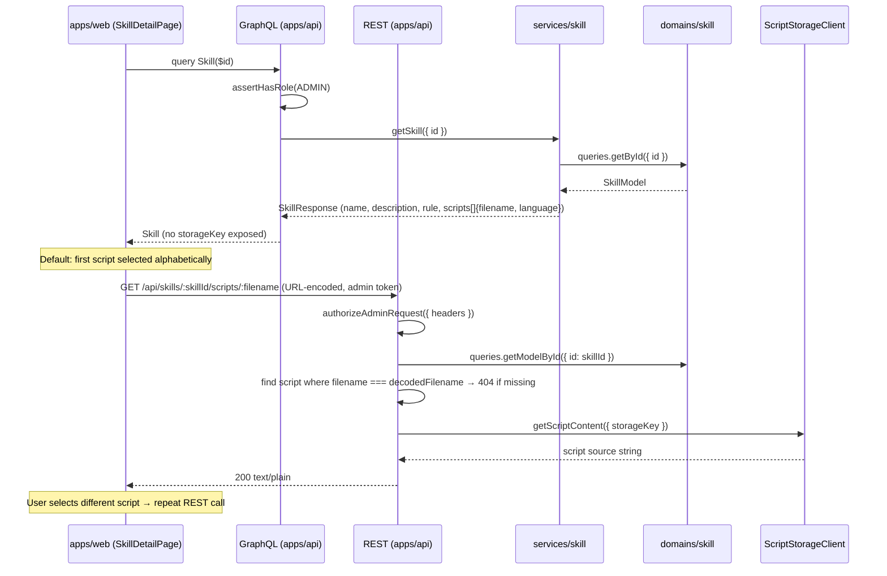

# Skill — Architecture

**Feature slug:** `skill`
**PRD:** [`prd.md`](./prd.md)
**Phase:** MVP — Read & view
**Reference architecture:** [`specialization/architecture.md`](../specialization/architecture.md)

---

## Analysis

### What Exists (Reuse)

| Existing piece | Location | Reuse plan |
|---|---|---|
| `domains/specialization` — domain pattern | `domains/specialization/src/` | Template for `domains/skill`: identical `model/dto/factory/graphql/queries/clients` layout; no `commands/` in MVP |
| `services/specialization` — thin service layer | `services/specialization/src/handlers/` | Template for `services/skill`: same `getSpecialization`/`listSpecializations` handler structure; no cross-domain enrichment needed in MVP |
| `getBySpecializationId` FK query | `domains/system-agent/src/queries/getBySpecializationId/` | Copy pattern verbatim for `domains/skill/src/queries/getBySpecializationId/` — same validation, same `getManyRaw` with `{ sort: { name: 1 } }` |
| `SpecializationAgentsPanel` / `SpecializationMcpsPanel` | `apps/web/app/specialization/[id]/_components/` | Copy + adapt for `SpecializationSkillsPanel`: same section / empty-state / list-item structure |
| `useSpecializationDetail` hook | `apps/web/app/specialization/[id]/_components/useSpecializationDetail.ts` | Pattern for `useSkillDetail`; separate script-content state managed independently |
| `GET_SPECIALIZATION_QUERY` / `useSpecialization` | `ui/api-hooks/src/specializations/` | Pattern for `GET_SKILL_QUERY`, `LIST_SKILLS_BY_SPECIALIZATION_QUERY`, `useSkill`, `useSkillsBySpecialization` |
| `@vassembly/client-aws-s3` | `packages/client-aws-s3/src/client.ts` | Call `AwsS3Client({ bucketName }).getFile({ key: storageKey })` for production script reads |
| `S3Config` / `Config` interfaces | `packages/config/src/types.ts` | Extend with `SkillsConfig` for bucket name + local root path |
| `mongodbIndexes` pattern | `domains/specialization/src/clients/mongodb.ts` | Same `MongoDbDAO` + `createIndex` pattern for skill indexes |
| `registerApiMongoIndexes` bootstrap | `apps/api/src/bootstrap/mongoIndexes.ts` | Add `skillMongodbIndexes` import to `getApiMongoIndexFunctions()` |
| `registerSpecializationResolvers` pattern | `apps/api/src/graphql/resolvers/specialization.ts` | Copy structure for `registerSkillResolvers`; admin role-gate with same `assertHasRole` pattern |
| `defineRoute` + `authorizeAdminRequest` | `apps/api/src/routes/system-agents/getById.ts` | Pattern for REST script content route |
| `ProtectedAuthRoute` with `roles={['admin']}` | `apps/web/lib/auth/ProtectedAuthRoute.tsx` | Route guard for skill detail page |
| `NotFoundError` | `@vassembly/errors` | Throw when skill not found or script file missing in storage |

### What is Genuinely New

- `@vassembly/domain-skill` — new domain package: `SkillModel`, constants, FK queries, MongoDB client with indexes
- `@vassembly/service-skill` — thin read-only service: `listSkillsBySpecialization`, `getSkill` handlers
- `ScriptStorageClient` — storage abstraction inside `domains/skill/src/clients/scriptStorage.ts`; hides S3 vs local filesystem behind a single interface
- `Config.skills` — new `SkillsConfig` section in `packages/config/src/types.ts` with bucket name + local root path
- `GET /api/skills/:skillId/scripts/:filename` — Fastify REST endpoint for script content (text/plain); admin-only
- `registerSkillResolvers` — GraphQL resolver with `skill(id)` and `skillsBySpecialization(specializationId)` queries
- `ui/api-hooks/src/skills/` — `useSkill`, `useSkillsBySpecialization` hooks
- `SpecializationSkillsPanel` — third panel on specialization detail page; fetches independently via `useSkillsBySpecialization`
- `/specialization/[id]/skills/[skillId]` — skill detail Next.js route with rule section + script file list + code viewer
- `react-syntax-highlighter` — new frontend dependency; no existing syntax-highlighting component found in the codebase

### Simplifications Applied

| Original consideration | Architecture decision | Saving |
|---|---|---|
| Separate `packages/skill-script-storage` package | Storage abstraction inside `domains/skill/src/clients/scriptStorage.ts` | No third new package; co-located with the domain that owns script metadata |
| GraphQL field for script code inline | REST `GET /api/skills/:skillId/scripts/:filename` (text/plain) | Avoids large binary/text payloads inside GraphQL; consistent with calling convention |
| `skillsCount` field on `Specialization` list type | Deferred to Phase 2; skills panel on detail uses a separate `skillsBySpecialization` query | No N+1 on specialization list; no change to `domains/specialization` in MVP |
| Admin write endpoints (create/update/delete) in MVP | Domain model + validation ready but no REST routes exposed; seed-only for MVP/E2E | Clean scope; Phase 2 only adds routes + service handler |
| Separate `packages/config-skill` for config types | Extend existing `packages/config/src/types.ts` in place | No new package for config; one-line interface addition |
| `scripts/` prefix in `storageKey` | `storageKey = "skills/{skillId}/{filename}"` where `filename` is the full value (e.g., `scripts/validate.py`) | Deterministic and derivable from `skillId + filename`; no extra transformation |

### Layers Involved

```
packages/config                     ← extend Config + SkillsConfig types; wire env vars
domains/skill                       ← NEW: SkillModel, queries (getById, getBySpecializationId),
                                      clients (mongodb + scriptStorage)
services/skill                      ← NEW: listSkillsBySpecialization, getSkill handlers
apps/api                            ← new skill GraphQL resolver + REST script endpoint + index bootstrap
ui/api-hooks                        ← new skills hooks (useSkill, useSkillsBySpecialization)
apps/web                            ← SpecializationSkillsPanel + /specialization/[id]/skills/[skillId]/ route
```

---

## Architecture & Package Placement

### Data Flow: Admin reads skills list (GraphQL)

```mermaid
sequenceDiagram
    participant UI as apps/web (SpecializationSkillsPanel)
    participant GQL as GraphQL (apps/api)
    participant Svc as services/skill
    participant SkDomain as domains/skill

    UI->>GQL: query SkillsBySpecialization($specializationId)
    GQL->>GQL: assertHasRole(ADMIN)
    GQL->>Svc: listSkillsBySpecialization({ specializationId })
    Svc->>SkDomain: queries.getBySpecializationId({ specializationId })
    SkDomain-->>Svc: SkillModel[]
    Svc-->>GQL: SkillResponse[] (metadata + rule + script metadata; no code)
    GQL-->>UI: [Skill] → list of skills with scripts[] metadata
```

### Data Flow: Admin views skill detail + script code (GraphQL + REST)



### Cross-Package Dependency Map

```
packages/config
  ↑ imported by: apps/api (SkillsConfig wiring), domains/skill (scriptStorage factory)

domains/skill
  ↑ imported by: services/skill, apps/api (REST route handler, GraphQL schema registration)

services/skill
  ↑ imported by: apps/api (GraphQL resolver)

ui/api-hooks (skills/)
  ↑ imported by: apps/web

apps/web (SpecializationSkillsPanel + skill detail route)
  — imports: @vassembly/ui-api-hooks (skill hooks), next/navigation, react-syntax-highlighter
```

> **Dependency note:** `domains/skill` does not import any other domain. It has no inter-domain dependencies in MVP — all it needs is `@vassembly/client-mongodb`, `@vassembly/client-aws-s3`, `@vassembly/config`, and standard utilities. This keeps the domain fully self-contained.

---

## Recommendation

**Approach:** Introduce two new packages (`domain-skill`, `service-skill`) following the established specialization pattern exactly. Script storage abstraction lives inside the domain's `clients/` folder. The UI extends the specialization detail page with a third skills panel and adds a nested skill detail route. No existing packages are modified except `packages/config` (type extension) and `apps/api` (resolver + route + index bootstrap).

**Why this reduces complexity vs alternatives:**
- Zero changes to `domains/specialization`, `services/specialization`, or any existing domain — clean extension.
- Storage abstraction co-located with the domain avoids a third new package and an additional cross-package import.
- REST endpoint for script content follows the established calling convention (large text/binary = REST, not GraphQL).
- UI panels follow the `SpecializationAgentsPanel` / `SpecializationMcpsPanel` pattern verbatim.

**Trade-offs:**
- The specialization detail page adds a third async panel (`skillsBySpecialization` query fires on detail load). Acceptable at MVP scale (p95 < 200 ms per PRD NFR). Phase 2 can add `skillsCount` to the specialization list query if aggregate counts are needed.
- `react-syntax-highlighter` is a new frontend dependency (~100 KB minified). No existing highlighting component found in the codebase. Acceptable trade-off for readable script display per SK-4 requirement.
- Script content is fetched per-select client-side via REST, not pre-loaded. This means a loading state per script selection — acceptable for an audit/read UI.

---

## Domain Model Details

### `SkillModel` (`domains/skill/src/model/model.ts`)

```typescript
import { Model } from '@vassembly/model';
import type { SkillScript } from './types';

export class SkillModel extends Model {
  specializationId!: string;
  name!: string;
  description!: string;
  rule!: string;
  scripts!: SkillScript[];
}
```

### `SkillScript` subdocument (`domains/skill/src/model/types.ts`)

```typescript
export const SKILL_SCRIPT_LANGUAGES = ['python', 'nodejs', 'bash'] as const;
export type SkillScriptLanguage = (typeof SKILL_SCRIPT_LANGUAGES)[number];

export interface SkillScript {
  filename: string;    // e.g. "scripts/validate.py" — relative path within skill
  language: SkillScriptLanguage;
  storageKey: string;  // e.g. "skills/skill_123/scripts/validate.py" — server-internal
}
```

### Response DTOs (`domains/skill/src/model/dto.ts`)

```typescript
export interface SkillScriptResponse {
  filename: string;
  language: SkillScriptLanguage;
  // storageKey intentionally omitted — server-internal; never exposed in API responses
}

export interface SkillResponse {
  id: string;
  specializationId: string;
  name: string;
  description: string;
  rule: string;
  scripts: SkillScriptResponse[];
  createdAt: string;
  updatedAt: string;
}

export interface SkillListResponse {
  items: SkillResponse[];
}
```

> `storageKey` is stripped in `toSkillResponse` mapper — not part of the DTO. The REST script endpoint resolves it internally from the `SkillModel`.

### Constants (`domains/skill/src/constants.ts`)

```typescript
export const COLLECTION_NAME = 'skills';
export const SKILL_NAME_MAX_LENGTH = 64;          // agentskills.io constraint
export const SKILL_DESCRIPTION_MAX_LENGTH = 1024; // FR-DM-4
export const SKILL_SCRIPT_MAX_SIZE_BYTES = 512 * 1024; // 512 KB per script (OQ-8 default)
```

### Storage Key Convention

```
skills/{skillId}/{filename}
```

Where `filename` is the value stored in `SkillScript.filename` (e.g., `scripts/validate.py`).

Full key example: `skills/skill_contract_review_01/scripts/validate.py`

> This makes `storageKey` deterministic and derivable from `skillId + filename`. For seeding, the storageKey can be generated as `skills/${skill.id}/${script.filename}` without additional configuration.

---

## API Design

### GraphQL Schema (`domains/skill/src/model/graphql.ts`)

```graphql
enum SkillScriptLanguage {
  python
  nodejs
  bash
}

type SkillScript {
  filename: String!
  language: SkillScriptLanguage!
}

type Skill {
  id: ID!
  specializationId: ID!
  name: String!
  description: String!
  rule: String!
  scripts: [SkillScript!]!
  createdAt: String!
  updatedAt: String!
}

type Query {
  skill(id: ID!): Skill
  skillsBySpecialization(specializationId: ID!): [Skill!]!
}
```

Both queries require `AUTH_TOKEN_ROLE.ADMIN`. `storageKey` is not included in the `SkillScript` type.

**Resolver (`apps/api/src/graphql/resolvers/skill.ts`)** mirrors `registerSpecializationResolvers` exactly:

```typescript
// gqlSkillSchema(builder) called once to register types
// skill(id: ID!) → skillService.getSkill({ id }) → returns SkillResponse | null
// skillsBySpecialization(specializationId: ID!) → skillService.listSkillsBySpecialization({ specializationId })
// Both: const { userId } = context.authenticatedUserId; assertHasRole({ userId, role: AUTH_TOKEN_ROLE.ADMIN })
```

### REST: Script Content

```
GET /api/skills/:skillId/scripts/:filename
Authorization: Bearer <admin token>
```

**Request:**
- `:skillId` — the skill's MongoDB ID
- `:filename` — URL-encoded relative path (e.g., `scripts%2Fvalidate.py` for `scripts/validate.py`)

**Response:**

| Status | Body | Condition |
|--------|------|-----------|
| `200 text/plain` | Script source code string | Success |
| `403` | error JSON | Non-admin or unauthenticated |
| `404` | `{ error: "skill_not_found" }` | `skillId` not in DB |
| `404` | `{ error: "script_not_found" }` | `filename` not in `skill.scripts[]` |
| `404` | `{ error: "script_file_missing" }` | Storage key exists in DB but file absent in storage |
| `500` | `{ error: "storage_error" }` | Storage read failure (S3 error / FS permission) |

**Server-side steps:**
1. `authorizeAdminRequest({ headers })` — 403 if not admin
2. `decodeURIComponent(request.params.filename)` — decode filename
3. `skillDomain.queries.getModelById({ id: skillId })` — 404 `skill_not_found` if missing
4. Find `script` in `skill.scripts` where `script.filename === decodedFilename` — 404 `script_not_found` if absent
5. `scriptStorageClient.getScriptContent({ storageKey: script.storageKey })` — 404/500 on storage error
6. `reply.type('text/plain').send(content)`

**Route file:** `apps/api/src/routes/skills/getSkillScript.ts`
**Route registration:** `routesWithPrefix('/skills', skillRoutesList)` in `apps/api/src/routes/index.ts`

---

## Storage Abstraction Design

### `ScriptStorageClient` interface + factory (`domains/skill/src/clients/scriptStorage.ts`)

```typescript
export interface ScriptStorageClient {
  getScriptContent: (params: { storageKey: string }) => Promise<string>;
}

export const createScriptStorageClient = (): ScriptStorageClient => {
  const isLocal = config.environment !== Environment.Production;

  if (isLocal) {
    const localRootPath = config.skills.scriptStorage.localRootPath ?? './.data/skill-scripts';
    return {
      getScriptContent: async ({ storageKey }) => {
        const fullPath = path.join(localRootPath, storageKey);
        return fs.readFile(fullPath, 'utf-8'); // throws on missing file → REST layer maps to 404
      },
    };
  }

  const s3 = AwsS3Client({ bucketName: config.skills.scriptStorage.bucketName });
  return {
    getScriptContent: ({ storageKey }) => s3.getFile({ key: storageKey }),
  };
};

export const scriptStorageClient = createScriptStorageClient();
```

> `createScriptStorageClient()` is called once at module load time. The REST route imports `scriptStorageClient` directly — no DI needed. Filesystem read errors (ENOENT) and S3 errors both bubble up; the REST route handler maps them to 404 (missing file) or 500 (other error) by inspecting the error code.

### Config Extension (`packages/config/src/types.ts`)

```typescript
export interface SkillScriptStorageConfig {
  bucketName: string;       // S3 bucket name (required in production)
  localRootPath?: string;   // Local dev root; default: ./.data/skill-scripts (OQ-6)
}

export interface SkillsConfig {
  scriptStorage: SkillScriptStorageConfig;
}

// Extend Config:
export interface Config {
  // ...existing fields...
  skills: SkillsConfig;
}
```

**Environment variables (to add to `apps/api` config wiring):**
- `SKILL_SCRIPT_STORAGE_BUCKET` → `config.skills.scriptStorage.bucketName`
- `SKILL_SCRIPT_STORAGE_LOCAL_PATH` → `config.skills.scriptStorage.localRootPath` (optional; default `./.data/skill-scripts`)

### Local Dev Folder Structure

```
.data/
  skill-scripts/
    skills/
      {skillId}/
        scripts/
          validate.py
          run-check.sh
```

Files placed at `.data/skill-scripts/skills/{skillId}/scripts/{bare-filename}` — matching the `storageKey` convention (`skills/{skillId}/scripts/{bare-filename}`).

---

## UI File Structure

### `ui/api-hooks/src/skills/`

```
skills/
  GET_SKILL_QUERY.ts
  LIST_SKILLS_BY_SPECIALIZATION_QUERY.ts
  useSkill.ts
  useSkillsBySpecialization.ts
  types.ts
  index.ts
```

**`LIST_SKILLS_BY_SPECIALIZATION_QUERY.ts`:**

```typescript
export const LIST_SKILLS_BY_SPECIALIZATION_QUERY = gql`
  query SkillsBySpecialization($specializationId: ID!) {
    skillsBySpecialization(specializationId: $specializationId) {
      id specializationId name description rule
      scripts { filename language }
      createdAt updatedAt
    }
  }
`;
```

**`GET_SKILL_QUERY.ts`:**

```typescript
export const GET_SKILL_QUERY = gql`
  query Skill($id: ID!) {
    skill(id: $id) {
      id specializationId name description rule
      scripts { filename language }
      createdAt updatedAt
    }
  }
`;
```

**`types.ts`** — key types:

```typescript
export interface SkillScriptItem {
  filename: string;
  language: 'python' | 'nodejs' | 'bash';
}

export interface SkillItem {
  id: string;
  specializationId: string;
  name: string;
  description: string;
  rule: string;
  scripts: SkillScriptItem[];
  createdAt: string;
  updatedAt: string;
}

export interface UseSkillsBySpecializationArgs {
  specializationId: string;
  skip?: boolean;
}

export interface UseSkillsBySpecializationResult {
  data?: { skillsBySpecialization: SkillItem[] };
  loading: boolean;
  error?: Error;
  refetch: () => void;
}

export interface UseSkillArgs {
  skillId: string;
  skip?: boolean;
}

export interface UseSkillResult {
  data?: { skill: SkillItem | null };
  loading: boolean;
  error?: CommonError;
  refetch: () => void;
}
```

### Specialization detail extensions (`apps/web/app/specialization/[id]/`)

**New files (third panel):**

```
_components/
  SpecializationSkillsPanel/
    SpecializationSkillsPanel.tsx      ← calls useSkillsBySpecialization internally; handles own states
    SpecializationSkillsPanel.module.scss
    SpecializationSkillListItem/
      SpecializationSkillListItem.tsx  ← name (code style) + description (truncated 80 chars) + link
      SpecializationSkillListItem.module.scss
    types.ts
```

**Modified files:**
- `SpecializationDetailPage.tsx` — add `<SpecializationSkillsPanel specializationId={specializationId} />` as a third panel in the panels layout section

> `useSpecializationDetail.ts` is NOT modified — skills data is fetched independently by the panel component, not via the specialization detail hook. This preserves the existing detail page load path.

### Skill detail route (`apps/web/app/specialization/[id]/skills/`)

```
skills/
  [skillId]/
    page.tsx                              ← ProtectedAuthRoute + SkillDetailPage
    _components/
      SkillDetailPage.tsx                 ← orchestrates all sub-sections
      SkillDetailPage.module.scss
      SkillDetailHeader/
        SkillDetailHeader.tsx             ← back link (← {specializationName}), h1 name, description
        SkillDetailHeader.module.scss
      SkillRuleSection/
        SkillRuleSection.tsx              ← "Instructions" heading + rendered Markdown / preformatted rule
        SkillRuleSection.module.scss
      SkillScriptsSection/
        SkillScriptsSection.tsx           ← file list (left) + code viewer (right); empty state
        SkillScriptsSection.module.scss
        SkillScriptList/
          SkillScriptList.tsx             ← list of filenames; active selection highlight
        SkillCodeViewer/
          SkillCodeViewer.tsx             ← SyntaxHighlighter wrapper with language map + loading/error states
          SkillCodeViewer.module.scss
      SkillNotFoundMessage/
        SkillNotFoundMessage.tsx          ← "Skill not found." + back link to specialization
      SkillDetailSkeleton/
        SkillDetailSkeleton.tsx
      useSkillDetail.ts                   ← GraphQL query + script content REST fetch state machine
      types.ts
      constants.ts                        ← LANGUAGE_MAP, SCRIPT_CONTENT_MAX_DISPLAY_BYTES
```

### `useSkillDetail` hook (`apps/web/.../useSkillDetail.ts`)

```typescript
// State managed:
// - skill metadata (from GraphQL useSkill hook)
// - activeScript: SkillScriptItem | null (default: first alphabetically by filename)
// - scriptContent: string | null
// - scriptLoading: boolean
// - scriptError: string | null

// Script content fetch:
// fetch(`/api/skills/${skillId}/scripts/${encodeURIComponent(activeScript.filename)}`)
// with Authorization: Bearer token from useAuthToken() (or equivalent auth hook)
// Fires when activeScript changes (useEffect)

// Returns: { skill, loading, error, isNotFound, activeScript, setActiveScript,
//            scriptContent, scriptLoading, scriptError, handleRetry }
```

### `SkillCodeViewer` syntax highlighting (`apps/web/.../SkillCodeViewer.tsx`)

**New dependency:** `react-syntax-highlighter` + `@types/react-syntax-highlighter`

**Language map** (`constants.ts`):

```typescript
export const LANGUAGE_MAP: Record<SkillScriptLanguage, string> = {
  python: 'python',
  nodejs: 'javascript',
  bash: 'bash',
};
```

`SkillCodeViewer` renders:
- Loading: skeleton / spinner
- Error: inline `Alert variant="error"` with retry button
- Content: `<SyntaxHighlighter language={LANGUAGE_MAP[script.language]} style={vscDarkPlus}>{content}</SyntaxHighlighter>`

---

## MongoDB Indexes

Defined in `domains/skill/src/clients/mongodb.ts`:

| Index | Options | Rationale |
|---|---|---|
| `{ specializationId: 1, name: 1 }` | `unique: true` | Skill name unique per specialization (OQ-5 decision: per-specialization uniqueness); prevents duplicate skill names within a domain |
| `{ specializationId: 1 }` | — | `getBySpecializationId` query; list-by-specialization without full collection scan |

```typescript
export const mongodbIndexes = async (): Promise<void> => {
  const collection = getSkillsCollection();
  await collection.createIndex({ specializationId: 1, name: 1 }, { unique: true });
  await collection.createIndex({ specializationId: 1 });
};
```

**Registration in `apps/api/src/bootstrap/mongoIndexes.ts`:**

```typescript
import { mongodbIndexes as skillMongodbIndexes } from '@vassembly/domain-skill';
// Add to getApiMongoIndexFunctions():
skillMongodbIndexes,
```

---

## Implementation Steps

### Step 1 — `packages/config`: extend `Config` with `SkillsConfig`

**`packages/config/src/types.ts`:**
- Add `SkillScriptStorageConfig` interface: `bucketName: string`, `localRootPath?: string`
- Add `SkillsConfig` interface: `scriptStorage: SkillScriptStorageConfig`
- Extend `Config` with `skills: SkillsConfig`

**`apps/api` config wiring** (wherever env vars are mapped to `config`):
- `SKILL_SCRIPT_STORAGE_BUCKET` → `config.skills.scriptStorage.bucketName`
- `SKILL_SCRIPT_STORAGE_LOCAL_PATH` → `config.skills.scriptStorage.localRootPath` (optional; default `./.data/skill-scripts`)

---

### Step 2 — `domains/skill`: new domain package

New package: `@vassembly/domain-skill`

**`package.json` dependencies** (same as `@vassembly/domain-specialization` + `@vassembly/client-aws-s3` + `@vassembly/config`):

```json
{
  "name": "@vassembly/domain-skill",
  "dependencies": {
    "@vassembly/client-aws-s3": "workspace:*",
    "@vassembly/client-mongodb": "workspace:*",
    "@vassembly/commands": "workspace:*",
    "@vassembly/config": "workspace:*",
    "@vassembly/errors": "workspace:*",
    "@vassembly/graphql": "workspace:*",
    "@vassembly/mappers": "workspace:*",
    "@vassembly/model": "workspace:*",
    "@vassembly/queries": "workspace:*",
    "@vassembly/validation": "workspace:*",
    "zod": "^4.3.6"
  }
}
```

**Full folder structure:**

```
domains/skill/
  package.json
  tsconfig.json
  README.md
  src/
    model/
      model.ts              ← SkillModel extends Model (specializationId, name, description, rule, scripts)
      types.ts              ← SkillScript, SkillScriptLanguage
      dto.ts                ← SkillResponse, SkillScriptResponse, SkillListResponse
      factories.ts          ← skillFactory.create(partial)
      toSkillResponse.ts    ← maps SkillModel → SkillResponse (strips storageKey)
      graphql.ts            ← gqlSkillSchema: Skill type, SkillScript type, SkillScriptLanguage enum
      index.ts
    queries/
      getById/
        index.ts            ← getById({ id }) → SkillResponse; throws NotFoundError if missing
        types.ts
      getModelById/
        index.ts            ← getModelById({ id }) → SkillModel; used by REST route for storageKey access
        types.ts
      getBySpecializationId/
        index.ts            ← mirrors domains/system-agent FK query exactly
        types.ts
      index.ts
    clients/
      mongodb.ts            ← skillMongodbDao + getSkillsCollection + mongodbIndexes
      scriptStorage.ts      ← ScriptStorageClient interface + createScriptStorageClient factory
      index.ts
    constants.ts            ← COLLECTION_NAME, name/description limits, SKILL_SCRIPT_LANGUAGES
    index.ts
```

> **No `commands/` in MVP.** Skills are read-only from the admin UI; created via seeding or future internal tools. Phase 2 adds `create`, `update`, and `archive` commands.

**`src/model/graphql.ts`** — uses `defineModelSchema` pattern from `@vassembly/graphql`:

```typescript
// gqlSkillSchema registers:
// - SkillScriptLanguage (enum type)
// - SkillScript (filename: String!, language: SkillScriptLanguage!)
// - Skill (id, specializationId, name, description, rule, scripts: [SkillScript!]!, createdAt, updatedAt)
// Note: storageKey NOT exposed in SkillScript GraphQL type
```

**`src/clients/scriptStorage.ts`** — storage factory (see Storage Abstraction section above).

**`src/queries/getBySpecializationId/index.ts`** — verbatim copy of `domains/system-agent/src/queries/getBySpecializationId/index.ts` adapted for skill:

```typescript
// Validates input, queries skillMongodbDao.getManyRaw({ specializationId }),
// sorts by { name: 1 }, maps via skillFactory.create, returns { items: SkillModel[] }
```

---

### Step 3 — `services/skill`: new read-only service package

New package: `@vassembly/service-skill`

**`package.json` dependencies:**

```json
{
  "name": "@vassembly/service-skill",
  "dependencies": {
    "@vassembly/domain-skill": "workspace:*",
    "@vassembly/errors": "workspace:*"
  }
}
```

**Folder structure:**

```
services/skill/
  package.json
  tsconfig.json
  README.md
  src/
    handlers/
      listSkillsBySpecialization/
        index.ts      ← delegates to skillDomain.queries.getBySpecializationId
        types.ts
      getSkill/
        index.ts      ← delegates to skillDomain.queries.getById; throws NotFoundError if null
        types.ts
      index.ts
    index.ts
```

**`handlers/listSkillsBySpecialization/types.ts`:**

```typescript
export interface ListSkillsBySpecializationInput {
  specializationId: string;
}

export interface ListSkillsBySpecializationResult {
  items: SkillResponse[];
}
```

**`handlers/getSkill/types.ts`:**

```typescript
export interface GetSkillInput {
  id: string;
}

export interface GetSkillResult {
  skill: SkillResponse;
}
```

`getSkill` throws `NotFoundError` when the skill does not exist (mirrors `getSpecialization` pattern). `listSkillsBySpecialization` returns `{ items: [] }` for an unknown `specializationId` — no error (empty result is valid).

No cross-domain enrichment in MVP (unlike `services/specialization`). Phase 3 extension point: inject runtime skill content into agent context.

---

### Step 4 — `apps/api`: GraphQL resolver + builder registration

**New file: `apps/api/src/graphql/resolvers/skill.ts`**

Mirrors `registerSpecializationResolvers` exactly:
- Import `gqlSkillSchema` from `@vassembly/domain-skill`
- Import `skillService` from `@vassembly/service-skill`
- `skill(id: ID!)` → `assertHasRole(ADMIN)` → `skillService.getSkill({ id })` → returns `SkillResponse | null`
- `skillsBySpecialization(specializationId: ID!)` → `assertHasRole(ADMIN)` → `skillService.listSkillsBySpecialization({ specializationId })` → returns `[SkillResponse]`

**`apps/api/src/graphql/index.ts`** — add after existing registrations:

```typescript
import { registerSkillResolvers } from './resolvers/skill';

// In builder setup:
registerSkillResolvers(builder);
```

> `gqlSkillSchema(builder)` is called inside `registerSkillResolvers` (same as `registerSpecializationResolvers` calling `gqlSpecializationSchema(builder)`) — no separate call needed.

---

### Step 5 — `apps/api`: REST script content endpoint

**New file: `apps/api/src/routes/skills/getSkillScript.ts`**

```typescript
// defineRoute({
//   method: 'GET',
//   url: '/:skillId/scripts/:filename',
//   handler: async ({ headers, params }) => {
//     const { userId } = await authHandlers.authorizeAdminRequest({ headers });
//     const { skillId, filename: encodedFilename } = params;
//     const filename = decodeURIComponent(encodedFilename);
//
//     const skillModel = await skillDomain.queries.getModelById({ id: skillId });
//     // → NotFoundError maps to 404 via Fastify error handler
//
//     const script = skillModel.scripts.find((s) => s.filename === filename);
//     if (!script) throw new NotFoundError('script_not_found');
//
//     const content = await scriptStorageClient.getScriptContent({ storageKey: script.storageKey });
//     // → storage errors: map ENOENT / missing-key to NotFoundError; other errors to InternalError
//
//     reply.type('text/plain').send(content);
//   }
// })
```

**New file: `apps/api/src/routes/skills/index.ts`** — exports `skillRoutesList`.

**`apps/api/src/routes/index.ts`** — add:

```typescript
import { routes as skillRoutesList } from './skills';
const skillRoutes = routesWithPrefix('/skills', skillRoutesList);
// Add skillRoutes to routes array
```

---

### Step 6 — `apps/api`: Index bootstrap registration

**`apps/api/src/bootstrap/mongoIndexes.ts`** — add:

```typescript
import { mongodbIndexes as skillMongodbIndexes } from '@vassembly/domain-skill';

// In getApiMongoIndexFunctions():
skillMongodbIndexes,
```

---

### Step 7 — `ui/api-hooks/src/skills/`: GraphQL query hooks

**Files to create** (see UI File Structure section above for full schema).

Export from `ui/api-hooks/src/index.ts`:

```typescript
export { useSkill, useSkillsBySpecialization } from './skills';
export type { SkillItem, SkillScriptItem, UseSkillArgs, UseSkillsBySpecializationArgs } from './skills';
```

---

### Step 8 — `apps/web`: `SpecializationSkillsPanel` on specialization detail

**Files to create:**

```
apps/web/app/specialization/[id]/_components/SpecializationSkillsPanel/
  SpecializationSkillsPanel.tsx
  SpecializationSkillsPanel.module.scss
  SpecializationSkillListItem/
    SpecializationSkillListItem.tsx
    SpecializationSkillListItem.module.scss
  types.ts
```

`SpecializationSkillsPanel` calls `useSkillsBySpecialization({ specializationId })` internally. It handles its own loading skeleton, empty state ("No skills linked to this specialization yet."), and error state (inline alert — does NOT break the parent page). This mirrors `SpecializationMcpsPanel` architecture exactly.

Each skill row: name (monospace code style, per agentskills.io hyphenated convention), description (truncated ~80 chars), click → `/specialization/{id}/skills/{skillId}`.

**`SpecializationDetailPage.tsx`** — add to panels section:

```typescript
<SpecializationSkillsPanel specializationId={specializationId} />
```

---

### Step 9 — `apps/web`: Skill detail route

**New Next.js route:** `apps/web/app/specialization/[id]/skills/[skillId]/page.tsx`

```typescript
// ProtectedAuthRoute with roles={['admin']} wrapping SkillDetailPage
// Reads params: specializationId (from [id]), skillId (from [skillId])
```

**`SkillDetailPage.tsx`** orchestrates:
1. `SkillDetailSkeleton` — while loading
2. `SkillNotFoundMessage` — when `isNotFound` (with back link to `/specialization/{id}`)
3. Error block with retry — when error and no data
4. Rendered page:
   - `SkillDetailHeader` — back link (`← {specializationName or 'Back'}`), h1 `skill.name`, `skill.description`
   - `SkillRuleSection` — "Instructions" heading + rule content (preformatted `<pre>` or Markdown renderer if available)
   - `SkillScriptsSection` — file list + code viewer (hidden when `skill.scripts.length === 0` → shows "No scripts bundled with this skill.")

**`useSkillDetail.ts`** — hook contract:

```typescript
// Calls useSkill({ skillId })
// State: activeScript (default: skill.scripts sorted by filename asc, first item)
// On activeScript change: fetch('/api/skills/{skillId}/scripts/{encodeURIComponent(filename)}', ...)
// Returns: { skill, loading, error, isNotFound, activeScript, setActiveScript,
//            scriptContent, scriptLoading, scriptError, handleScriptRetry }
```

**`constants.ts`:**

```typescript
export const LANGUAGE_MAP: Record<SkillScriptLanguage, string> = {
  python: 'python',
  nodejs: 'javascript',
  bash: 'bash',
};

export const EMPTY_SCRIPTS_MESSAGE = 'No scripts bundled with this skill.';
```

**`SkillCodeViewer.tsx`** — renders `react-syntax-highlighter` `<SyntaxHighlighter>` with `language={LANGUAGE_MAP[activeScript.language]}` and `style={vscDarkPlus}`. Shows loading spinner while `scriptLoading` is true; shows inline alert on `scriptError`.

**Install dependency in `apps/web`:**

```bash
pnpm add react-syntax-highlighter @types/react-syntax-highlighter
```

---

## Todo Plan

```
1. packages/config — extend Config with SkillsConfig
   Changes needed: Add SkillScriptStorageConfig + SkillsConfig interfaces;
                   extend Config with skills: SkillsConfig
   Files to modify:
     - packages/config/src/types.ts
   Files to identify and modify (env var wiring):
     - apps/api/src/index.ts or config wiring file (SKILL_SCRIPT_STORAGE_BUCKET + LOCAL_PATH)
   Suggested subagent workflow: coder → Done
   Dependencies: none

2. domains/skill — new domain package (scaffolding + full implementation)
   Changes needed: Create package from domain-specialization template; implement SkillModel,
                   SkillScript types, DTO, factory, toSkillResponse mapper, GraphQL schema
                   (Skill, SkillScript, SkillScriptLanguage enum), MongoDB client with indexes,
                   scriptStorage factory (S3/local), getById + getModelById + getBySpecializationId queries
   Files to create:
     - domains/skill/package.json
     - domains/skill/tsconfig.json
     - domains/skill/README.md
     - domains/skill/src/model/model.ts
     - domains/skill/src/model/types.ts
     - domains/skill/src/model/dto.ts
     - domains/skill/src/model/factories.ts
     - domains/skill/src/model/toSkillResponse.ts
     - domains/skill/src/model/graphql.ts
     - domains/skill/src/model/index.ts
     - domains/skill/src/queries/getById/index.ts
     - domains/skill/src/queries/getById/types.ts
     - domains/skill/src/queries/getModelById/index.ts
     - domains/skill/src/queries/getModelById/types.ts
     - domains/skill/src/queries/getBySpecializationId/index.ts
     - domains/skill/src/queries/getBySpecializationId/types.ts
     - domains/skill/src/queries/index.ts
     - domains/skill/src/clients/mongodb.ts
     - domains/skill/src/clients/scriptStorage.ts
     - domains/skill/src/clients/index.ts
     - domains/skill/src/constants.ts
     - domains/skill/src/index.ts
   Suggested subagent workflow: tdd-unit-test-writer → coder ↔ code-reviewer (loop: max 2 iterations) → documentation-writer
   Dependencies: todo #1 (config types needed for scriptStorage factory)

3. services/skill — new read-only service package
   Changes needed: Create package; implement listSkillsBySpecialization (delegate to
                   getBySpecializationId) and getSkill (delegate to getById, throw NotFoundError)
   Files to create:
     - services/skill/package.json
     - services/skill/tsconfig.json
     - services/skill/README.md
     - services/skill/src/handlers/listSkillsBySpecialization/index.ts
     - services/skill/src/handlers/listSkillsBySpecialization/types.ts
     - services/skill/src/handlers/getSkill/index.ts
     - services/skill/src/handlers/getSkill/types.ts
     - services/skill/src/handlers/index.ts
     - services/skill/src/index.ts
   Suggested subagent workflow: tdd-unit-test-writer → coder ↔ code-reviewer (loop: max 2 iterations) → documentation-writer
   Dependencies: todo #2

4. apps/api — GraphQL resolver + builder registration
   Changes needed: Add registerSkillResolvers with skill(id) and skillsBySpecialization queries;
                   both admin-gated; register in graphql/index.ts builder
   Files to create:
     - apps/api/src/graphql/resolvers/skill.ts
   Files to modify:
     - apps/api/src/graphql/index.ts (register skill schema + resolver)
   Suggested subagent workflow: coder ↔ code-reviewer (loop: max 2 iterations)
   Dependencies: todos #2, #3

5. apps/api — REST script content endpoint
   Changes needed: Add GET /skills/:skillId/scripts/:filename route;
                   admin-gated; URL-decode filename; resolve storageKey from SkillModel.scripts[];
                   call scriptStorageClient.getScriptContent; return text/plain;
                   register with routesWithPrefix('/skills', ...)
   Files to create:
     - apps/api/src/routes/skills/getSkillScript.ts
     - apps/api/src/routes/skills/index.ts
   Files to modify:
     - apps/api/src/routes/index.ts (add skill routes with /skills prefix)
   Suggested subagent workflow: coder ↔ code-reviewer (loop: max 2 iterations)
   Dependencies: todo #2

6. apps/api — MongoDB index registration
   Changes needed: Import skillMongodbIndexes from @vassembly/domain-skill;
                   add to getApiMongoIndexFunctions() array
   Files to modify:
     - apps/api/src/bootstrap/mongoIndexes.ts
   Suggested subagent workflow: coder → Done
   Dependencies: todo #2

7. ui/api-hooks — skills query hooks
   Changes needed: Add GET_SKILL_QUERY, LIST_SKILLS_BY_SPECIALIZATION_QUERY, useSkill,
                   useSkillsBySpecialization, SkillItem/SkillScriptItem types; export from package index
   Files to create:
     - ui/api-hooks/src/skills/GET_SKILL_QUERY.ts
     - ui/api-hooks/src/skills/LIST_SKILLS_BY_SPECIALIZATION_QUERY.ts
     - ui/api-hooks/src/skills/useSkill.ts
     - ui/api-hooks/src/skills/useSkillsBySpecialization.ts
     - ui/api-hooks/src/skills/types.ts
     - ui/api-hooks/src/skills/index.ts
   Files to modify:
     - ui/api-hooks/src/index.ts (add skills exports)
   Suggested subagent workflow: coder ↔ code-reviewer (loop: max 2 iterations)
   Dependencies: todo #4 (resolver must exist for schema to be correct)

8. apps/web — SpecializationSkillsPanel (third panel on specialization detail)
   Changes needed: Create SpecializationSkillsPanel calling useSkillsBySpecialization;
                   add SpecializationSkillListItem (name + description + link);
                   add panel to SpecializationDetailPage.tsx panels section
   Files to create:
     - apps/web/app/specialization/[id]/_components/SpecializationSkillsPanel/SpecializationSkillsPanel.tsx
     - apps/web/app/specialization/[id]/_components/SpecializationSkillsPanel/SpecializationSkillsPanel.module.scss
     - apps/web/app/specialization/[id]/_components/SpecializationSkillsPanel/SpecializationSkillListItem/SpecializationSkillListItem.tsx
     - apps/web/app/specialization/[id]/_components/SpecializationSkillsPanel/SpecializationSkillListItem/SpecializationSkillListItem.module.scss
     - apps/web/app/specialization/[id]/_components/SpecializationSkillsPanel/types.ts
   Files to modify:
     - apps/web/app/specialization/[id]/_components/SpecializationDetailPage.tsx
   Suggested subagent workflow: coder ↔ code-reviewer (loop: max 2 iterations)
   Dependencies: todos #4, #7

9. apps/web — Skill detail route (/specialization/[id]/skills/[skillId])
   Changes needed: New nested route with ProtectedAuthRoute;
                   SkillDetailPage orchestrating header + rule + scripts sections;
                   useSkillDetail hook managing GraphQL query + script content REST fetch;
                   SkillCodeViewer with react-syntax-highlighter;
                   add react-syntax-highlighter dependency to apps/web
   Files to create:
     - apps/web/app/specialization/[id]/skills/[skillId]/page.tsx
     - apps/web/app/specialization/[id]/skills/[skillId]/_components/SkillDetailPage.tsx
     - apps/web/app/specialization/[id]/skills/[skillId]/_components/SkillDetailPage.module.scss
     - apps/web/app/specialization/[id]/skills/[skillId]/_components/SkillDetailHeader/SkillDetailHeader.tsx
     - apps/web/app/specialization/[id]/skills/[skillId]/_components/SkillDetailHeader/SkillDetailHeader.module.scss
     - apps/web/app/specialization/[id]/skills/[skillId]/_components/SkillRuleSection/SkillRuleSection.tsx
     - apps/web/app/specialization/[id]/skills/[skillId]/_components/SkillRuleSection/SkillRuleSection.module.scss
     - apps/web/app/specialization/[id]/skills/[skillId]/_components/SkillScriptsSection/SkillScriptsSection.tsx
     - apps/web/app/specialization/[id]/skills/[skillId]/_components/SkillScriptsSection/SkillScriptsSection.module.scss
     - apps/web/app/specialization/[id]/skills/[skillId]/_components/SkillScriptsSection/SkillScriptList/SkillScriptList.tsx
     - apps/web/app/specialization/[id]/skills/[skillId]/_components/SkillScriptsSection/SkillCodeViewer/SkillCodeViewer.tsx
     - apps/web/app/specialization/[id]/skills/[skillId]/_components/SkillScriptsSection/SkillCodeViewer/SkillCodeViewer.module.scss
     - apps/web/app/specialization/[id]/skills/[skillId]/_components/SkillNotFoundMessage/SkillNotFoundMessage.tsx
     - apps/web/app/specialization/[id]/skills/[skillId]/_components/SkillDetailSkeleton/SkillDetailSkeleton.tsx
     - apps/web/app/specialization/[id]/skills/[skillId]/_components/useSkillDetail.ts
     - apps/web/app/specialization/[id]/skills/[skillId]/_components/types.ts
     - apps/web/app/specialization/[id]/skills/[skillId]/_components/constants.ts
   Suggested subagent workflow: tdd-e2e-test-writer → coder ↔ code-reviewer (loop: max 2 iterations) → documentation-writer
   Dependencies: todos #4, #5, #7, #8

10. apps/web — E2E feature files (Gherkin scenarios SK-1 through SK-6)
    Changes needed: Write failing Playwright BDD feature files covering all Gherkin scenarios
                    from PRD sections SK-1 to SK-6
    Files to create:
      - apps/web/e2e/features/skills/skill-list-on-specialization.feature  (SK-1, SK-6)
      - apps/web/e2e/features/skills/skill-detail.feature                  (SK-2, SK-3, SK-4, SK-5)
      - apps/web/e2e/steps/skills/ (new steps only if not covered by existing step files)
    Suggested subagent workflow: tdd-e2e-test-writer → coder ↔ code-reviewer (loop: max 2 iterations)
    Dependencies: PRD exists (done); todos #8, #9 must be implemented for E2E to pass
```

### Parallelism

- **Batch 1 (no deps):** Todo #1 — config types
- **Batch 2 (depends on #1):** Todo #2 (domain) — start once config types exist
- **Batch 3 (depends on #2):** Todos #3, #5, #6 — run in parallel once domain is ready
- **Batch 4 (depends on #2, #3):** Todo #4 (GraphQL resolver)
- **Batch 5 (depends on #4):** Todo #7 (api-hooks)
- **Batch 6 (depends on #4, #5, #7):** Todos #8, #9 — UI work (can run in parallel)
- **Batch 7 (depends on #8, #9):** Todo #10 (E2E feature files — can be written failing in parallel with #8/#9 once PRD is final)

---

## Test Strategy

| Package | Test type | Key scenarios |
|---|---|---|
| `domains/skill` (getBySpecializationId) | Unit | Returns skills for given `specializationId`; empty `[]` for unknown ID; sorted by `name` |
| `domains/skill` (getById) | Unit | Returns `SkillResponse` for valid ID; throws `NotFoundError` for missing ID |
| `domains/skill` (scriptStorage — local) | Unit | Reads file from correct path; throws on missing file (maps to NotFoundError upstream) |
| `domains/skill` (scriptStorage — S3) | Unit | Calls `AwsS3Client.getFile` with correct `storageKey`; propagates S3 error |
| `domains/skill` (toSkillResponse mapper) | Unit | `storageKey` is absent from `SkillScriptResponse`; all other fields present and correct |
| `services/skill` (listSkillsBySpecialization) | Unit | Returns `items: []` for unknown specializationId; returns correct items when found |
| `services/skill` (getSkill) | Unit | Returns `SkillResponse` for valid ID; throws `NotFoundError` for missing ID |
| `apps/api` (getSkillScript REST route) | Unit | 200 text/plain on valid skill+filename; 404 on missing skill; 404 on missing filename in scripts[]; 404 on missing storage file; 403 non-admin |
| `apps/web` (E2E — SK-1) | E2E | Admin sees Skills panel with skills on specialization detail; empty state when no skills |
| `apps/web` (E2E — SK-2) | E2E | Clicking skill row navigates to `/specialization/{id}/skills/{skillId}` |
| `apps/web` (E2E — SK-3) | E2E | Skill detail shows rule + script list; selecting script switches displayed code |
| `apps/web` (E2E — SK-4) | E2E | Python/nodejs/bash scripts use correct syntax highlighting language |
| `apps/web` (E2E — SK-5) | E2E | Unknown skillId shows "Skill not found." with back link |
| `apps/web` (E2E — SK-6) | E2E | No create/edit/delete controls on specialization detail or skill detail |

---

## Risks & Mitigations

| # | Risk | Likelihood | Impact | Mitigation |
|---|------|------------|--------|------------|
| R-1 | Script content fetch per-select adds latency on each selection | Low | UX — script viewer feels slow | Add loading state in `SkillCodeViewer`; p95 target is 500 ms per PRD NFR; cache content client-side in `useSkillDetail` state (same React state, no re-fetch on re-select) |
| R-2 | `storageKey` exposed to client via API response | High | Security — bucket path leak | `toSkillResponse` mapper explicitly strips `storageKey`; GraphQL `SkillScript` type does not declare it; REST route resolves it server-side from `SkillModel` only |
| R-3 | Local filesystem path traversal via malicious `storageKey` | Medium | Security — arbitrary file read in dev | `storageKey` is stored in DB and never set by the REST request directly; `decodeURIComponent` is applied to `:filename`; server matches against `skill.scripts[]` before resolving `storageKey` |
| R-4 | `react-syntax-highlighter` bundle size adds to initial page load | Low | Performance | Import dynamically or use the lighter `PrismLight` build; highlight only the languages needed (`python`, `javascript`, `bash`) |
| R-5 | `SpecializationSkillsPanel` fires a query on every specialization detail load | Low | Performance | Query is fast (index on `specializationId`); failure is isolated (panel shows error independently; parent page unaffected per PRD NFR 5.2) |
| R-6 | `config.skills.scriptStorage.bucketName` not wired in production deploy | High (deploy gap) | Script content fetch fails in production | Add to `.env.example` and deployment checklist; `createScriptStorageClient()` should throw on startup if `bucketName` is empty in production (fail-fast) |
| R-7 | E2E seed: skills + script files not set up for test environment | Medium | E2E tests cannot pass SK-3/SK-4 | Add skill seed fixture (mirroring specialization MCP seed); place script files in `.data/skill-scripts` for test env; document in E2E README |

---

## Open Questions (Pending User Approval)

| # | Question | Default recommendation |
|---|----------|------------------------|
| OQ-1 | Route shape: `/specialization/[id]/skills/[skillId]` vs `/skill/[id]`? | **Nested** — preserves specialization breadcrumb context (see PRD OQ-1) |
| OQ-2 | `rule` rendered as Markdown or preformatted `<pre>` block? | **Preformatted `<pre>`** in MVP (no Markdown renderer found for system agent rules); if a Markdown renderer is added, swap in Phase 2 |
| OQ-3 | S3 bucket for skills: shared with other S3 usage or dedicated bucket? | **New dedicated bucket** (`skill-scripts` or similar); `config.skills.scriptStorage.bucketName` wired separately — avoids co-mingling skill scripts with other storage objects |
| OQ-4 | Local dev: create `.data/skill-scripts/` automatically or require manual setup? | **Manual for MVP**; document in README; E2E fixture creates necessary directories as part of seed |
| OQ-5 | `react-syntax-highlighter` vs alternative (e.g. `shiki`, `highlight.js`)? | **`react-syntax-highlighter` with PrismLight** — most used in React ecosystem, easy per-language import, manageable bundle; revisit if perf profiling flags it |
| OQ-6 | Syntax highlighting theme for code viewer? | **`vscDarkPlus`** (bundled with react-syntax-highlighter, matches modern editor aesthetics); align with design system dark mode if one exists |
| OQ-7 | Should skill seed be a separate seed file in `domains/skill/seed/` (mirroring system-agent seed) or a DB migration script? | **`domains/skill/seed/skills.json`** — consistent with `systemAgents.json` pattern; seeded at API startup alongside system agents |

---

*End of Skill MVP architecture — ready for implementation. Each todo item is scoped to a single package with file-level detail for delegation to coder/test-writer subagents.*
