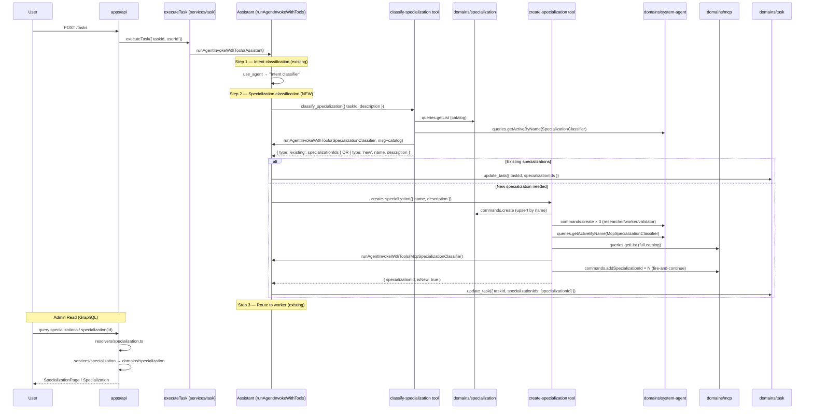
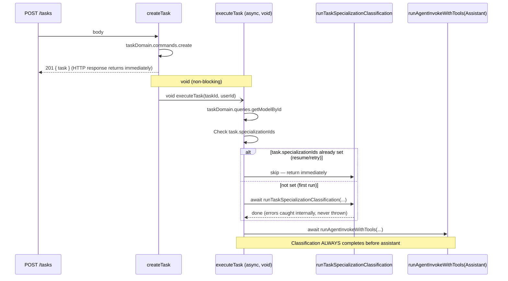
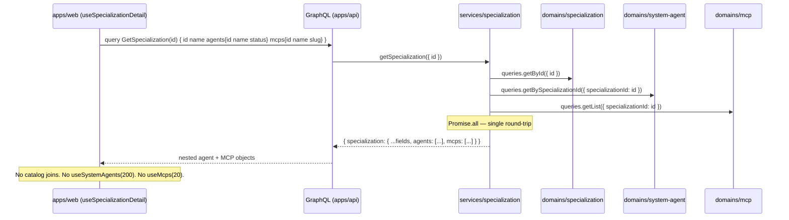

# Specialization — Architecture

**Feature slug:** `specialization`  
**PRD:** [`prd.md`](./prd.md)  
**Design:** [`design.md`](./design.md)  
**Phase:** 1 — Infrastructure  
**Reference architecture:** [`task-category-persistence/architecture.md`](../task-category-persistence/architecture.md)

---

## Analysis

### What Exists (Reuse)

| Existing piece | Location | Reuse plan |
|---|---|---|
| `generateTaskCategory` handler pattern | `services/task/src/handlers/generateTaskCategory/` | Model for `classifySpecialization` internal tool handler — same skip logic, normalization, log-event pattern |
| `createSystemAgent` handler | `services/agent/src/handlers/createSystemAgent/` | Reference for provisioning logic; use `systemAgentDomain.commands.create` directly inside internal tool |
| `SYSTEM_AGENT_NAME` enum | `packages/constants/src/SystemAgentName.ts` | Extend with `SpecializationClassifier`, `McpSpecializationClassifier` |
| `INTERNAL_TOOLS` registry | `packages/constants/src/internalTools/registry.ts` | Register `classify-specialization` and `create-specialization` |
| `systemAgents.json` seed | `domains/system-agent/seed/systemAgents.json` | Add 2 new classifier agent entries; update Assistant's rule and `assignedToolIds` |
| `domains/system-agent` commands/queries | `domains/system-agent/src/commands/create/`, `queries/getActiveByName/` | Re-use to provision specialization agents; add `getBySpecializationId` query |
| `TaskModel` + `updateTask` command | `domains/task/src/model/model.ts`, `commands/updateTask/` | Extend to carry `specializationIds`; same DB update pattern |
| `McpModel` | `domains/mcp/src/model/model.ts` | Extend with `specializationIds`; add first `commands/` with `addSpecializationId` |
| `updateDbById` helper | `@vassembly/commands` | Used by all new domain commands |
| `runAgentInvokeWithTools` | `@vassembly/service-agent` | Re-used inside both new internal tool handlers |
| MCP catalog pattern (UI) | `apps/web/app/mcps/` | List container, search bar, pagination, skeletons, empty/error states all adapted |
| `ProtectedAuthRoute` | `apps/web/lib/auth/ProtectedAuthRoute.tsx` | Route guard with `roles={['admin']}` |
| `userDomain.queries.assertHasRole` | resolver auth pattern | Identical admin role-check pattern in new resolver |
| `AUTH_TOKEN_ROLE.ADMIN` | `@vassembly/constants` | Resolver and route guard use same constant |
| McpsList GraphQL paginated type | `domains/mcp/src/model/graphql.ts` | Model for new `SpecializationPage` paginated type |
| `ui/api-hooks/src/mcps/` | hooks directory | Adapt `useMcps` → `useSpecializations`; `useMcp` → `useSpecialization` |

### What is Genuinely New

- `domains/specialization` — new domain package (model, commands, queries, MongoDB client)
- `services/specialization` — service package wrapping domain queries for GraphQL consumption
- `classify-specialization` internal tool handler in `services/agent` — catalog lookup + agent invocation + output normalization
- `create-specialization` internal tool handler in `services/agent` — specialization upsert + agent provisioning + MCP mapping pipeline
- `normalizeGeneratedSpecializations` utility — validates and parses raw LLM output into structured result
- `addSpecializationId` command in `domains/mcp` — first command in the MCP domain; appends without duplication
- `getBySpecializationId` query in `domains/system-agent` — fetch all agents for a specialization
- Admin UI pages: `apps/web/app/specialization/` (list + detail)
- Workspace drawer nav item (admin-only, after MCPs)
- GraphQL resolver for Specialization queries in `apps/api`
- `ui/api-hooks/src/specializations/` — query hooks for admin pages

### Simplifications Applied

| Original plan | Architecture decision | Saving |
|---|---|---|
| Standalone `classifySpecialization` service handler (like `generateTaskCategory`) | Internal tool handler — classification is driven by the assistant in-flow, not fire-and-forget | No new services/task handler; no separate async invocation path |
| Separate `update-task-specialization` internal tool | Extend existing `update-task` internal tool to accept `specializationIds` | −1 registry entry, −1 handler |
| Generic "service handler" for MCP mapping | Logic lives inside `create-specialization` internal tool handler (fire-and-continue pattern) | No additional service layer for MCP linking |
| New `services/specialization` handling both reads and writes | Reads in `services/specialization`; writes via internal tools only | Clean separation: service layer = reads; agent runtime = writes |

### Layers Involved

```
packages/constants                  ← SYSTEM_AGENT_NAME (2 new), INTERNAL_TOOLS (2 new)
domains/specialization              ← NEW: entity model, create command, list/get queries
domains/task                        ← extend updateTask command + model with specializationIds
domains/system-agent                ← extend model with specializationId; add getBySpecializationId query
domains/mcp                         ← extend model with specializationIds; add addSpecializationId command
services/specialization             ← NEW: listSpecializations, getSpecialization handlers (reads)
services/agent                      ← 2 new internal tool handlers; createInternalToolHandlers update
domains/system-agent/seed           ← 2 new system agents; update Assistant entry
apps/api                            ← new specialization GraphQL resolver + schema registration
ui/api-hooks                        ← new specializations hooks package
apps/web                            ← admin UI pages, drawer nav update
```

---

## Architecture & Package Placement

### Data Flow Diagram



### Cross-Package Dependency Map

```
packages/constants
  ↑ imported by: all domains, services, apps/api, apps/web

domains/specialization
  ↑ imported by: services/specialization, services/agent (internal tools)

domains/task       (extended)
  ↑ imported by: services/task, services/agent (existing pattern)

domains/system-agent  (extended)
  ↑ imported by: services/agent (existing pattern)

domains/mcp        (extended, new commands/)
  ↑ imported by: services/mcp (existing), services/agent (new — internal tool only)

services/specialization (new reads)
  ↑ imported by: apps/api

services/agent     (new internal tools)
  — imports: domains/specialization, domains/system-agent, domains/mcp (new dep for MCP mapping)
```

> **Dependency note:** `services/agent` already imports `domains/task` directly (via `updateTask` internal tool). The pattern of service-to-domain imports is established. Adding `domains/mcp` and `domains/specialization` as direct imports inside the internal tool handler folder follows the same convention.

---

## Recommendation

**Approach:** Run specialization classification as two in-flow internal tools (`classify-specialization` and `create-specialization`) called by the assistant agent during `executeTask`. This mirrors the existing internal tool pattern (no new execution paths, no new async handlers, no fire-and-forget outside the agent loop). Writes flow exclusively through the agent runtime; reads flow through a thin `services/specialization` consumed by the GraphQL resolver.

**Why this reduces complexity vs alternatives:**
- No new async handler in `services/task` (compare: `generateTaskCategory`) — the assistant already has an internal tool loop; we add to it rather than creating parallel post-create hooks.
- No `services/specialization` write path — internal tool handlers call domains directly (same as `updateTask`, `askUser`, `listAgents`).
- `update-task` internal tool is extended instead of creating `update-task-specializations` — one tool, one handler, one registry entry.
- Admin UI reuses the MCP catalog component family verbatim (copy + rename).

**Trade-off noted:** The assistant makes two sequential LLM calls in the flow (Intent Classifier + Specialization Classifier). This adds ~1–5 s latency per task submission. Acceptable at Phase 1 scale; Phase 2 optimization can combine them into one call once the specialization catalog stabilises.

---

## Implementation Steps

### Step 1 — `packages/constants`: extend enums + register internal tools

**`packages/constants/src/SystemAgentName.ts`** — add two new enum members:

```typescript
export enum SYSTEM_AGENT_NAME {
  // ... existing
  SpecializationClassifier = 'Specialization classifier',
  McpSpecializationClassifier = 'MCP specialization classifier',
}
```

**`packages/constants/src/internalTools/registry.ts`** — append two entries to `INTERNAL_TOOLS`:

```typescript
{
  id: 'classify-specialization',
  displayName: 'Classify specialization',
  description: 'Classify a task description into 1–3 specialization domains. Returns existing IDs or a signal to create a new specialization.',
  accessScope: InternalToolAccessScope.SYSTEM_ONLY,
  llmToolName: 'classify_specialization',
},
{
  id: 'create-specialization',
  displayName: 'Create specialization',
  description: 'Provision a new specialization domain: creates the entity, provisions researcher/worker/validator agents, and maps relevant MCPs.',
  accessScope: InternalToolAccessScope.SYSTEM_ONLY,
  llmToolName: 'create_specialization',
},
```

---

### Step 2 — `domains/specialization`: new domain package

New package: `@vassembly/domain-specialization`

**Folder structure:**

```
domains/specialization/
  package.json
  tsconfig.json
  README.md
  src/
    model/
      model.ts
      dto.ts
      factories.ts
      toSpecializationResponse.ts
      graphql.ts
      index.ts
    commands/
      create/
        index.ts        ← upsert-by-name (unique index enforces deduplication)
        types.ts
      index.ts
    queries/
      getById/
        index.ts
        types.ts
      getModelById/
        index.ts
        types.ts
      getByName/
        index.ts
        types.ts
      getModelByName/
        index.ts
        types.ts
      getList/
        index.ts
        types.ts
      shared/
        buildNameSearchFilter.ts
        pagination.ts  ← reuse same resolvePagination helper as mcp domain
      index.ts
    clients/
      mongodb.ts       ← unique index on `name` (case-insensitive collation)
    index.ts
```

**`src/model/model.ts`:**

```typescript
import { Model } from '@vassembly/model';

export class SpecializationModel extends Model {
  name!: string;
  description!: string;
}
```

**`src/model/dto.ts`:**

```typescript
export interface SpecializationResponse {
  id: string;
  name: string;
  description: string;
  agentIds: string[];
  mcpIds: string[];
  createdAt: string;
  updatedAt: string;
}

export interface SpecializationPageResponse {
  items: SpecializationResponse[];
  page: number;
  size: number;
  total: number;
}
```

> `agentIds` and `mcpIds` are computed fields — injected by the service layer by querying `domains/system-agent` and `domains/mcp` using `specializationId` as a filter. They are NOT stored on the `SpecializationModel` document to avoid sync problems.

**`src/model/graphql.ts`** — define `Specialization` and `SpecializationPage` types using `defineModelSchema` / `defineObjectType` (mirror `McpsList` pattern from `domains/mcp/src/model/graphql.ts`).

**`src/commands/create/types.ts`:**

```typescript
export interface CreateSpecializationCommandInput {
  name: string;
  description: string;
}

export interface CreateSpecializationCommandResult {
  id: string;
  isNew: boolean;
}
```

**`src/commands/create/index.ts`** — upsert pattern: find by normalized lowercase name first; if exists return existing ID with `isNew: false`; if not, insert and return new ID with `isNew: true`. Wrap in try-catch; re-throw `ConflictError` on duplicate key from MongoDB.

**`src/clients/mongodb.ts`** — MongoDB DAO with:
```typescript
// Index: { name: 1 }, unique: true, collation: { locale: 'en', strength: 2 }
```

Case-insensitive unique index using MongoDB collation. Normalise stored name to lowercase before insert (enforce in the create command via `name.trim().toLowerCase()`).

---

### Step 3 — `domains/task`: extend model, DTO, mapper, commands

**`domains/task/src/model/model.ts`** — add field:

```typescript
specializationIds?: string[] | null;
```

**`domains/task/src/model/dto.ts`** — add to `TaskResponse` (and any list DTO):

```typescript
specializationIds: string[] | null;
```

**`domains/task/src/model/toTaskResponse.ts`** — add mapping:

```typescript
specializationIds: task.specializationIds ?? null,
```

**`domains/task/src/model/graphql.ts`** — add nullable list field:

```typescript
specializationIds: t.exposeStringList('specializationIds', { nullable: true }),
```

**`domains/task/src/commands/updateTask/types.ts`** — extend input schema:

```typescript
// Add to UPDATE_TASK_INPUT_SCHEMA:
specializationIds: z.array(z.string().min(1)).max(3).nullable().optional(),

// Add to UpdateTaskCommandInput:
specializationIds?: string[] | null;
```

**`domains/task/src/commands/updateTask/index.ts`** — extend update data construction:

```typescript
// In UPDATE_TASK_DB_SCHEMA add:
specializationIds: z.array(z.string().min(1)).max(3).nullable().optional(),

// In data building add:
if (parsed.data.specializationIds !== undefined) {
  data.specializationIds = parsed.data.specializationIds;
}
```

**Refine guard:** Update the `.refine` check to include `specializationIds` in the "at least one field" validation.

---

### Step 4 — `domains/system-agent`: extend model + add query

**`domains/system-agent/src/model/model.ts`** — add field:

```typescript
specializationId?: string | null;
```

**`domains/system-agent/src/model/dto.ts`** — add to `SystemAgentAdminResponse`:

```typescript
specializationId?: string | null;
```

**`domains/system-agent/src/model/toSystemAgentResponse.ts`** — add mapping:

```typescript
specializationId: agent.specializationId ?? null,
```

**`domains/system-agent/src/model/graphql.ts`** — add nullable field:

```typescript
specializationId: t.exposeString('specializationId', { nullable: true }),
```

**`domains/system-agent/src/commands/shared/schemas.ts`** — add `specializationId` to `CREATE_SYSTEM_AGENT_SCHEMA` (optional, nullable string):

```typescript
specializationId: z.string().min(1).max(100).nullable().optional(),
```

**`domains/system-agent/src/commands/create/`** — extend `CreateSystemAgentParams` type to accept optional `specializationId`; include it in the DB write payload.

**New query: `domains/system-agent/src/queries/getBySpecializationId/`**

```typescript
// index.ts — returns all agents where specializationId matches; ordered by name
export const getBySpecializationId = async ({
  specializationId,
}: GetBySpecializationIdParams): Promise<GetBySpecializationIdResult>
```

Export from `domains/system-agent/src/queries/index.ts`.

---

### Step 5 — `domains/mcp`: extend model + add first command

**`domains/mcp/src/model/model.ts`** — add field:

```typescript
specializationIds?: string[];
```

**`domains/mcp/src/model/dto.ts`** — add to `McpListItemResponse`:

```typescript
specializationIds?: string[];
```

**`domains/mcp/src/model/graphql.ts`** — add nullable list field to `Mcp` schema:

```typescript
specializationIds: t.exposeStringList('specializationIds', { nullable: true }),
```

**New commands directory for `domains/mcp`:**

```
domains/mcp/src/commands/
  addSpecializationId/
    index.ts
    types.ts
  index.ts
```

**`types.ts`:**

```typescript
export interface AddSpecializationIdInput {
  mcpId: string;
  specializationId: string;
}

export interface AddSpecializationIdResult {
  success: boolean;
}
```

**`index.ts`** — use MongoDB `$addToSet` operator to append without duplication:

```typescript
export const addSpecializationId = async ({
  mcpId,
  specializationId,
}: AddSpecializationIdInput): Promise<AddSpecializationIdResult> => {
  // Use mcpMongodbDao raw update with $addToSet: { specializationIds: specializationId }
  // Returns success: true even if already present (idempotent)
}
```

Export from `domains/mcp/src/index.ts`.

---

### Step 6 — `services/specialization`: new read-only service package

New package: `@vassembly/service-specialization`

```
services/specialization/
  package.json
  tsconfig.json
  README.md
  src/
    handlers/
      listSpecializations/
        index.ts
        types.ts
      getSpecialization/
        index.ts
        types.ts
      index.ts
    index.ts
```

**`handlers/listSpecializations/types.ts`:**

```typescript
export interface ListSpecializationsInput {
  page: number;
  size: number;
  search?: string;
}

export interface ListSpecializationsResult {
  items: SpecializationResponse[];
  page: number;
  size: number;
  total: number;
}
```

**`handlers/listSpecializations/index.ts`** — calls `specializationDomain.queries.getList`; returns `SpecializationPageResponse`.

**`handlers/getSpecialization/types.ts`:**

```typescript
export interface GetSpecializationInput {
  id: string;
}

export interface GetSpecializationResult {
  specialization: SpecializationResponse;  // includes agentIds and mcpIds
}
```

**`handlers/getSpecialization/index.ts`** — fetches:
1. `specializationDomain.queries.getById({ id })`
2. `systemAgentDomain.queries.getBySpecializationId({ specializationId: id })` → map to `agentIds`
3. `mcpDomain.queries.getList` filtered by `specializationId in specializationIds` → map to `mcpIds`

All three run in `Promise.all`. Throws `NotFoundError` if specialization not found.

> **Note:** `mcpIds` derivation: use a MongoDB query filter `{ specializationIds: id }` in `mcpDomain` queries. This requires no new index beyond the sparse index added in Step 9.

---

### Step 7 — `services/agent`: two new internal tool handlers + registry wiring

#### 7a — `classify-specialization` internal tool handler

New folder: `services/agent/src/helpers/internalTools/classifySpecialization/`

```
classifySpecialization/
  index.ts
  types.ts
  normalizeGeneratedSpecializations.ts
  normalizeGeneratedSpecializations.test.ts
  logClassificationEvent.ts
```

**`types.ts`:**

```typescript
export interface ClassifySpecializationArgs {
  taskId: string;
  description: string;
}

export type ClassifySpecializationResult =
  | { type: 'existing'; specializationIds: string[] }
  | { type: 'new'; name: string; description: string }
  | { type: 'skipped'; reason: string };
```

**`normalizeGeneratedSpecializations.ts`** — mirrors `normalizeGeneratedCategory`:

```typescript
export type NormalizeGeneratedSpecializationsResult =
  | { isValid: true; type: 'existing'; specializationIds: string[] }
  | { isValid: true; type: 'new'; name: string; description: string }
  | { isValid: false; reason: 'empty_output' | 'invalid_output' | 'too_many_results' };

export const normalizeGeneratedSpecializations = ({
  rawOutput,
  existingNames,          // Set<string> of lowercase names from catalog
}: NormalizeGeneratedSpecializationsParams): NormalizeGeneratedSpecializationsResult
```

Parsing rules (from PRD §8.3):
1. Split by newlines; trim each line.
2. Lines starting with `NEW:` → extract `name|description`; return `{ type: 'new', ... }`.
3. Other lines → match case-insensitively against `existingNames`; collect matching IDs.
4. Deduplicate; cap at 3.
5. Return `{ isValid: false, reason: 'empty_output' }` if no lines.
6. Return `{ isValid: false, reason: 'invalid_output' }` if no matches and no `NEW:` line.

**`index.ts`** — full handler:

```typescript
export const classifySpecializationToolHandler = async (
  args: Record<string, unknown>,
  context: InternalToolContext,
): Promise<string> => {
  // 1. Validate args (taskId, description)
  // 2. Skip guard: description < 10 chars → return skipped JSON
  // 3. Fetch specialization catalog: specializationDomain.queries.getList({ page: 0, size: 500 })
  // 4. Get credential: systemAgentDomain.queries.getPreferenceByUserId({ userId: context.userId })
  // 5. Skip guard: no credential → return skipped JSON
  // 6. Get agent: systemAgentDomain.queries.getActiveByName({ name: SYSTEM_AGENT_NAME.SpecializationClassifier })
  // 7. Build message: description + formatted catalog list
  // 8. runAgentInvokeWithTools({ agentId, message, connectionOverride, ... })
  // 9. normalizeGeneratedSpecializations({ rawOutput, existingNames: catalog name set })
  // 10. Return JSON string of ClassifySpecializationResult
}
```

#### 7b — `create-specialization` internal tool handler

New folder: `services/agent/src/helpers/internalTools/createSpecialization/`

```
createSpecialization/
  index.ts
  types.ts
  provisionSpecializationAgents.ts   ← creates researcher/worker/validator
  mapMcpsToSpecialization.ts         ← runs MCP classifier + updates MCPs
  logSpecializationEvent.ts
```

**`types.ts`:**

```typescript
export interface CreateSpecializationArgs {
  name: string;
  description: string;
}
```

**`provisionSpecializationAgents.ts`:**

```typescript
export const provisionSpecializationAgents = async ({
  specializationId,
  specializationName,      // display name (title-cased in agent names)
}: ProvisionSpecializationAgentsParams): Promise<void> => {
  // 1. Check existing agents: systemAgentDomain.queries.getBySpecializationId
  // 2. Determine which roles are missing (researcher/worker/validator)
  // 3. For each missing role: systemAgentDomain.commands.create(...)
  //    - name: `${titleCase(specializationName)} ${role}`  (e.g. "Legal researcher")
  //    - rule: role-appropriate default rule
  //    - category: AgentCategory.Utility
  //    - specializationId
  //    - assignedToolIds: []
  //    - createdByAdminId / updatedByAdminId: SYSTEM_AGENT_ID constant
  // 4. Log each outcome (provisioned/skipped/failed) individually
}
```

Agent name format: `{TitleCase(name)} researcher | worker | validator` — e.g., for `name = "legal"` → `"Legal researcher"`, `"Legal worker"`, `"Legal validator"`.

Default rules per role:
- **Researcher**: "You research the given topic thoroughly and return a structured summary with sources and key findings."
- **Worker**: "You execute the task step-by-step based on the provided plan and research. Focus on delivering concrete outputs."
- **Validator**: "You review the work output for accuracy, completeness, and quality. Return a structured assessment with any issues or approvals."

**`mapMcpsToSpecialization.ts`:**

```typescript
export const mapMcpsToSpecialization = async ({
  specializationId,
  specializationName,
  specializationDescription,
  userId,
  connectionOverride,
}: MapMcpsToSpecializationParams): Promise<void> => {
  // 1. Get MCP catalog: mcpDomain.queries.getList({ page: 0, size: 200 })
  // 2. Skip if empty catalog
  // 3. Get agent: systemAgentDomain.queries.getActiveByName(McpSpecializationClassifier)
  // 4. Build message: spec name + description + MCP list (name, slug, description)
  // 5. runAgentInvokeWithTools(McpSpecializationClassifier, message)
  // 6. Parse output: one MCP slug per line
  // 7. Resolve MCP IDs from slugs (filter catalog by slug)
  // 8. For each matched MCP: mcpDomain.commands.addSpecializationId({ mcpId, specializationId })
  //    — each call wrapped in individual try-catch (failure of one doesn't block others)
  // 9. Log outcome
  // Entire function wrapped in try-catch; failure logged but never thrown (fire-and-continue)
}
```

**`index.ts`** — orchestrator:

```typescript
export const createSpecializationToolHandler = async (
  args: Record<string, unknown>,
  context: InternalToolContext,
): Promise<string> => {
  // 1. Validate args (name: string, description: string)
  // 2. specializationDomain.commands.create({ name: name.trim().toLowerCase(), description })
  //    → { id: specializationId, isNew }
  // 3. if isNew: await provisionSpecializationAgents({ specializationId, specializationName: name })
  //    — each agent creation wrapped individually; partial failure allowed
  // 4. if isNew: void mapMcpsToSpecialization({ specializationId, ... }).catch(logAndIgnore)
  //    — fire-and-continue; does not block tool completion
  // 5. Return JSON: { specializationId, isNew }
}
```

#### 7c — Extend `update-task` internal tool

**`services/agent/src/helpers/internalTools/updateTask/index.ts`** — add `specializationIds` support:

```typescript
// Add to validation:
if (specializationIds !== undefined) {
  if (!Array.isArray(specializationIds) || specializationIds.length > 3) {
    throw new ValidationError('specializationIds must be an array of max 3 strings');
  }
}

// Add to updateTask domain command call:
...(specializationIds !== undefined ? { specializationIds: specializationIds as string[] } : {}),
```

Update the `INTERNAL_TOOLS` registry entry description for `update-task` to mention `specializationIds`.

#### 7d — Register in `createInternalToolHandlers`

**`services/agent/src/helpers/internalTools/createInternalToolHandlers.ts`** — add:

```typescript
import { classifySpecializationToolHandler } from './classifySpecialization';
import { createSpecializationToolHandler } from './createSpecialization';

// Add to handler map:
'classify-specialization': (args) => classifySpecializationToolHandler(args, toolContext),
'create-specialization': (args) => createSpecializationToolHandler(args, toolContext),
```

---

### Step 8 — `domains/system-agent/seed/systemAgents.json`: seed additions + Assistant update

**Add two new entries:**

```json
{
  "name": "Specialization classifier",
  "description": "Classifies a user task description into one or more specialization domains. Returns existing specialization names when a match exists, or a new name and description when a new domain is needed.",
  "rule": "You are a specialization classifier. Given a task description and a list of existing specialization domains, identify the 1–3 most relevant domains.\n\nRules:\n1. If a matching specialization exists in the list, return its name exactly as given — one per line.\n2. If no existing specialization fits, return exactly one line starting with NEW: followed by: name|description (name: lowercase, max 3 words; description: max 100 words).\n3. Return at most 3 lines total.\n4. Prefer fewer specializations — only include a domain if it is clearly relevant.\n5. Return nothing else — no explanation, no headers.",
  "category": "utility",
  "assignedToolIds": []
},
{
  "name": "MCP specialization classifier",
  "description": "Given a new specialization's name and description, identifies which MCPs from the catalog are relevant to that specialization domain.",
  "rule": "You are an MCP specialization classifier. Given a specialization name and description, and a list of available MCPs (each with name, slug, and description), return the slugs of MCPs that are clearly relevant to the specialization.\n\nRules:\n1. Return one MCP slug per line.\n2. Return nothing if no MCP is clearly relevant.\n3. No explanation, no headers — slugs only.",
  "category": "utility",
  "assignedToolIds": []
}
```

**Update the Assistant entry** — extend `rule` and `assignedToolIds`:

```json
{
  "name": "Assistant",
  "rule": "You are the main assistant and first point of contact for user interactions.\n\nResponsibilities:\n1. Understand the user's request.\n2. Use list_agents to discover available agents.\n3. Use use_agent to delegate to specialized agents by exact name.\n\nDefault orchestration:\n1. Delegate classification to \"Intent classifier\" with the user's message.\n2. Call classify_specialization with the taskId and user message to classify the domain.\n   - If result type is 'existing': call update_task with specializationIds.\n   - If result type is 'new': call create_specialization with name and description, then call update_task with the returned specializationId.\n   - If result type is 'skipped': continue without setting specializationIds.\n3. Route by the Intent classifier's category output (see routing table below).\n4. Synthesize sub-agent outputs into one clear response.\n\nIf delegation fails, explain what is missing and ask a focused follow-up.",
  "assignedToolIds": ["use-agent", "list-agents", "update-task", "classify-specialization", "create-specialization"]
}
```

---

### Step 9 — MongoDB indexes

Add in client bootstrap files:

| Collection | Index | Options | Rationale |
|---|---|---|---|
| `specializations` | `{ name: 1 }` | unique, collation `{ locale: 'en', strength: 2 }` | Case-insensitive duplicate prevention |
| `specializations` | `{ createdAt: -1 }` | — | Default sort for paginated list |
| `systemAgents` | `{ specializationId: 1 }` | sparse | `getBySpecializationId` query |
| `mcps` | `{ specializationIds: 1 }` | sparse | Filter MCPs by specialization in detail view |
| `tasks` | `{ specializationIds: 1 }` | sparse | Phase 2 worker routing (create now, use later) |

Indexes for `specializations` are defined in `domains/specialization/src/clients/mongodb.ts`.  
Index for `systemAgents.specializationId` is added to `domains/system-agent/src/clients/mongodb.ts`.  
Index for `mcps.specializationIds` is added to `domains/mcp/src/clients/mongodb.ts`.  
Index for `tasks.specializationIds` is added to `domains/task/src/clients/mongodb.ts`.

No data migration required — MongoDB is schemaless; existing documents without new fields resolve to `undefined` → mapped to `null`/`[]` in response layer.

---

### Step 10 — `apps/api`: GraphQL resolver + schema registration

**New file: `apps/api/src/graphql/resolvers/specialization.ts`**

```typescript
import { applyResolvers } from '@vassembly/graphql';
import { AUTH_TOKEN_ROLE } from '@vassembly/constants';
import { UnauthorizedError } from '@vassembly/errors';
import { gqlSpecializationSchema } from '@vassembly/domain-specialization';
import specializationService from '@vassembly/service-specialization';
import userDomain from '@vassembly/domain-user';
import type { Builder } from '@vassembly/graphql';

interface SpecializationsResolverArgs {
  search?: string | null;
  page?: number | null;
  size?: number | null;
}

interface SpecializationResolverArgs {
  id: string;
}

interface ApiGraphQLContext {
  authenticatedUserId?: string;
}

export const registerSpecializationResolvers = (builder: Builder): void => {
  gqlSpecializationSchema(builder);

  applyResolvers({
    builder,
    queries: (t) => ({
      specializations: t.field({
        type: 'SpecializationPage',
        args: {
          search: t.arg.string({ required: false }),
          page: t.arg.int({ required: false, defaultValue: 0 }),
          size: t.arg.int({ required: false, defaultValue: 20 }),
        },
        resolve: async (_root, args: SpecializationsResolverArgs, context: ApiGraphQLContext) => {
          const userId = context.authenticatedUserId;
          if (userId === undefined) throw new UnauthorizedError('Authentication required');
          await userDomain.queries.assertHasRole({ userId, role: AUTH_TOKEN_ROLE.ADMIN });
          return specializationService.listSpecializations({
            page: args.page ?? 0,
            size: args.size ?? 20,
            search: args.search ?? undefined,
          });
        },
      }),

      specialization: t.field({
        type: 'Specialization',
        nullable: true,
        args: { id: t.arg.string({ required: true }) },
        resolve: async (_root, args: SpecializationResolverArgs, context: ApiGraphQLContext) => {
          const userId = context.authenticatedUserId;
          if (userId === undefined) throw new UnauthorizedError('Authentication required');
          await userDomain.queries.assertHasRole({ userId, role: AUTH_TOKEN_ROLE.ADMIN });
          const result = await specializationService.getSpecialization({ id: args.id });
          return result.specialization;
        },
      }),
    }),
  });
};
```

Register `registerSpecializationResolvers` in the main API GraphQL builder (wherever other resolvers like `registerSystemAgentResolvers` are called).

---

### Step 11 — `ui/api-hooks/src/specializations/`: GraphQL query hooks

New folder: `ui/api-hooks/src/specializations/`

```
specializations/
  LIST_SPECIALIZATIONS_QUERY.ts
  GET_SPECIALIZATION_QUERY.ts
  useSpecializations.ts           ← useQuery for paginated list
  useSpecialization.ts            ← useQuery for detail
  types.ts
  index.ts
```

**`LIST_SPECIALIZATIONS_QUERY.ts`:**

```typescript
export const LIST_SPECIALIZATIONS_QUERY = gql`
  query ListSpecializations($search: String, $page: Int, $size: Int) {
    specializations(search: $search, page: $page, size: $size) {
      items { id name description agentIds mcpIds createdAt updatedAt }
      page size total
    }
  }
`;
```

**`GET_SPECIALIZATION_QUERY.ts`:**

```typescript
export const GET_SPECIALIZATION_QUERY = gql`
  query GetSpecialization($id: ID!) {
    specialization(id: $id) {
      id name description agentIds mcpIds createdAt updatedAt
    }
  }
`;
```

Export from `ui/api-hooks/src/index.ts`.

---

### Step 12 — `apps/web`: admin UI pages + drawer nav

#### 12a — Workspace drawer item (admin only)

**`ui/components/layout/src/presets/main.tsx`**
- Extend `BuildMainDrawerSectionsParams` with `isAdmin?: boolean`.
- When `isAuthenticated && isAdmin`, append a `Specializations` link item after MCPs in the Workspace section (`id: 'specializations'`, `href: '/specialization'`, `icon: TagsIcon`).

**`ui/components/layout/src/resolveLayoutConfig.ts`**
- Derive `isAdmin` from `drawer.userRole?.trim().toLowerCase() === 'admin'`.
- Pass `isAdmin` to `buildMainDrawerSections`.

`apps/web/lib/layout/AuthLayout.tsx` already passes `userRole` — no change needed.

#### 12b — Page structure

```
apps/web/app/specialization/
  page.tsx                                  ← ProtectedAuthRoute + SpecializationsPageView
    SpecializationsPageView.tsx
    SpecializationsPageView.module.scss
    _components/
      SpecializationListContainer/
        SpecializationListContainer.tsx        ← search + pagination + grid
        SpecializationListContainer.module.scss
        useSpecializationList.ts               ← pagination + debounce state machine
        constants.ts                           ← SPECIALIZATION_LIST_PAGE_SIZE = 20
        SpecializationListItem/
          SpecializationListItem.tsx           ← card: name, description (80 char), counts, date
          SpecializationListItem.module.scss
        SpecializationSearchBar/
          SpecializationSearchBar.tsx
        SpecializationListEmptyState/
          SpecializationListEmptyState.tsx     ← no-specializations + no-results variants
        SpecializationsSkeleton/
          SpecializationsSkeleton.tsx
    [id]/
      page.tsx                                ← ProtectedAuthRoute + SpecializationDetailPage
      _components/
        SpecializationDetailPage.tsx
        SpecializationDetailPage.module.scss
        SpecializationDetailHeader/
          SpecializationDetailHeader.tsx       ← back link + h1 name + description + date
        SpecializationAgentsPanel/
          SpecializationAgentsPanel.tsx        ← fixed 3-slot: researcher/worker/validator
          SpecializationAgentSlot/
            SpecializationAgentSlot.tsx
        SpecializationMcpsPanel/
          SpecializationMcpsPanel.tsx
          SpecializationMcpListItem/
            SpecializationMcpListItem.tsx
        SpecializationDetailSkeleton/
          SpecializationDetailSkeleton.tsx
        SpecializationNotFoundMessage/
          SpecializationNotFoundMessage.tsx
        useSpecializationDetail.ts             ← detail query + agent/MCP resolution
```

#### 12c — Key hook contracts

**`useSpecializationList`** (mirrors `useMcpList` / `useMcpCatalog` pattern):
- State: `page` (0-based), `search` (debounced 300ms, min 1 char), `size = 20`
- Calls `useSpecializations` GraphQL hook
- Returns: `items`, `loading`, `errorMessage`, `total`, `totalPages`, `rangeStart`, `rangeEnd`, `isEmpty`, `isFilteredEmpty`, `handleSearchChange`, `handlePageChange`
- URL state: `?search={query}&page={n}` via `useSearchParams` + `router.push`

**`useSpecializationDetail`** (mirrors MCP detail hook):
- Calls `useSpecialization(id)` GraphQL hook
- Resolves `agentIds` → fetch system agent details for name + status (via `useSystemAgents` or batch query)
- Resolves `mcpIds` → fetch MCP details for name + slug (via `useMcps` batch or separate query)
- Maps agents to fixed 3-slot structure by name suffix (`researcher` / `worker` / `validator`)
- Returns: `specialization`, `agents: AgentSlot[]`, `mcps: McpSlotItem[]`, `loading`, `errorMessage`, `isNotFound`

#### 12d — `SpecializationAgentsPanel` slot resolution

The panel always renders 3 fixed slots. Slot assignment is done by matching expected name patterns against `agentIds`-resolved agents:

```typescript
const AGENT_SLOT_ROLES = ['researcher', 'worker', 'validator'] as const;

// For each role, find agent whose name.toLowerCase() ends with role:
const resolved = AGENT_SLOT_ROLES.map((role) => ({
  role,
  agent: agents.find((a) => a.name.toLowerCase().endsWith(role)) ?? null,
}));
```

If `agent === null`, the slot renders with "Not provisioned" (`Tag variant="warning"` with `role="status"`).

#### 12e — Component reuse from MCP catalog

Directly reuse (no changes):  `Text`, `TextField`, `Pagination`, `Loader`, `Skeleton`, `Alert`, `Tag`, `Button`, `ProtectedAuthRoute`, `useDebouncedValue`, `formatRelativeTime`, `systemAgentEditPath`, `getSystemAgentStatusLabel`, `getSystemAgentStatusVariant`, `CloseIcon`, `TagsIcon`.

Adapt (copy + rename + adjust props): `McpListContainer` → `SpecializationListContainer`, `McpSearchBar` → `SpecializationSearchBar`, `McpListItem` → `SpecializationListItem`, `McpListEmptyState` → `SpecializationListEmptyState`, `McpsSkeleton` → `SpecializationsSkeleton`, `McpNotFoundMessage` → `SpecializationNotFoundMessage`.

---

## Todo Plan

```
1. packages/constants — SYSTEM_AGENT_NAME + INTERNAL_TOOLS
   Changes needed: Add SpecializationClassifier + McpSpecializationClassifier to enum;
                   register classify-specialization and create-specialization in INTERNAL_TOOLS
   Files to modify:
     - packages/constants/src/SystemAgentName.ts
     - packages/constants/src/internalTools/registry.ts
   Suggested subagent workflow: coder → Done
   Dependencies: none

2. domains/specialization — new domain package (scaffolding + full implementation)
   Changes needed: Create new package from domain template; implement model, DTO, factories,
                   mapper, GraphQL schema, create command (upsert), list/get/getByName queries,
                   MongoDB client with unique index on name
   Files to create:
     - domains/specialization/package.json
     - domains/specialization/tsconfig.json
     - domains/specialization/README.md
     - domains/specialization/src/model/model.ts
     - domains/specialization/src/model/dto.ts
     - domains/specialization/src/model/factories.ts
     - domains/specialization/src/model/toSpecializationResponse.ts
     - domains/specialization/src/model/graphql.ts
     - domains/specialization/src/model/index.ts
     - domains/specialization/src/commands/create/index.ts
     - domains/specialization/src/commands/create/types.ts
     - domains/specialization/src/commands/index.ts
     - domains/specialization/src/queries/getById/index.ts
     - domains/specialization/src/queries/getById/types.ts
     - domains/specialization/src/queries/getModelById/index.ts
     - domains/specialization/src/queries/getModelById/types.ts
     - domains/specialization/src/queries/getByName/index.ts
     - domains/specialization/src/queries/getModelByName/index.ts
     - domains/specialization/src/queries/getList/index.ts
     - domains/specialization/src/queries/getList/types.ts
     - domains/specialization/src/queries/shared/buildNameSearchFilter.ts
     - domains/specialization/src/queries/shared/pagination.ts
     - domains/specialization/src/queries/index.ts
     - domains/specialization/src/clients/mongodb.ts
     - domains/specialization/src/index.ts
   Suggested subagent workflow: tdd-unit-test-writer → coder ↔ code-reviewer (loop: max 2 iterations) → documentation-writer
   Dependencies: todo #1 (constants may be imported for type refs)

3. domains/task — extend model + updateTask command
   Changes needed: Add specializationIds to TaskModel, TaskResponse DTO, toTaskResponse mapper,
                   GraphQL schema; extend updateTask command input/schema to accept specializationIds (max 3)
   Files to modify:
     - domains/task/src/model/model.ts
     - domains/task/src/model/dto.ts
     - domains/task/src/model/toTaskResponse.ts
     - domains/task/src/model/graphql.ts
     - domains/task/src/commands/updateTask/types.ts
     - domains/task/src/commands/updateTask/index.ts
     - domains/task/src/clients/mongodb.ts (add sparse index on specializationIds)
   Suggested subagent workflow: tdd-unit-test-writer → coder ↔ code-reviewer (loop: max 2 iterations)
   Dependencies: none

4. domains/system-agent — extend model + add getBySpecializationId query + extend create command
   Changes needed: Add optional specializationId to SystemAgentModel, SystemAgentAdminResponse DTO,
                   toSystemAgentResponse mapper, GraphQL schema; extend create command to accept
                   specializationId; add getBySpecializationId query; add sparse index
   Files to modify:
     - domains/system-agent/src/model/model.ts
     - domains/system-agent/src/model/dto.ts
     - domains/system-agent/src/model/toSystemAgentResponse.ts
     - domains/system-agent/src/model/graphql.ts
     - domains/system-agent/src/commands/shared/schemas.ts
     - domains/system-agent/src/commands/create/index.ts
     - domains/system-agent/src/commands/create/types.ts
     - domains/system-agent/src/queries/index.ts
     - domains/system-agent/src/clients/mongodb.ts (add sparse index on specializationId)
   Files to create:
     - domains/system-agent/src/queries/getBySpecializationId/index.ts
     - domains/system-agent/src/queries/getBySpecializationId/types.ts
   Suggested subagent workflow: tdd-unit-test-writer → coder ↔ code-reviewer (loop: max 2 iterations)
   Dependencies: none

5. domains/mcp — extend model + add addSpecializationId command
   Changes needed: Add optional specializationIds to McpModel, McpListItemResponse DTO,
                   GraphQL schema; add first commands/ directory with addSpecializationId command
                   using $addToSet; add sparse index
   Files to modify:
     - domains/mcp/src/model/model.ts
     - domains/mcp/src/model/dto.ts
     - domains/mcp/src/model/graphql.ts
     - domains/mcp/src/clients/mongodb.ts (add sparse index on specializationIds)
   Files to create:
     - domains/mcp/src/commands/addSpecializationId/index.ts
     - domains/mcp/src/commands/addSpecializationId/types.ts
     - domains/mcp/src/commands/index.ts
   Files to modify (export):
     - domains/mcp/src/index.ts (export commands)
   Suggested subagent workflow: tdd-unit-test-writer → coder ↔ code-reviewer (loop: max 2 iterations)
   Dependencies: none

6. domains/system-agent/seed — seed two new system agents + update Assistant entry
   Changes needed: Add Specialization classifier + MCP specialization classifier seed entries;
                   update Assistant rule + assignedToolIds (add classify-specialization, create-specialization)
   Files to modify:
     - domains/system-agent/seed/systemAgents.json
   Suggested subagent workflow: coder → Done
   Dependencies: todo #1 (internal tool IDs must exist before referencing in assignedToolIds)

7. services/specialization — new read-only service package
   Changes needed: Create package; implement listSpecializations and getSpecialization handlers;
                   getSpecialization resolves agentIds and mcpIds via parallel domain queries
   Files to create:
     - services/specialization/package.json
     - services/specialization/tsconfig.json
     - services/specialization/README.md
     - services/specialization/src/handlers/listSpecializations/index.ts
     - services/specialization/src/handlers/listSpecializations/types.ts
     - services/specialization/src/handlers/getSpecialization/index.ts
     - services/specialization/src/handlers/getSpecialization/types.ts
     - services/specialization/src/handlers/index.ts
     - services/specialization/src/index.ts
   Suggested subagent workflow: tdd-unit-test-writer → coder ↔ code-reviewer (loop: max 2 iterations) → documentation-writer
   Dependencies: todos #2, #4, #5

8. services/agent — two new internal tool handlers + extend update-task + register
   Changes needed:
     (a) classifySpecialization handler: catalog fetch + Specialization Classifier invocation +
         normalizeGeneratedSpecializations + log events
     (b) createSpecialization handler: upsert spec + provisionSpecializationAgents (3 agents) +
         mapMcpsToSpecialization (MCP classifier + addSpecializationId) + log events
     (c) extend updateTask handler to accept specializationIds
     (d) register new tools in createInternalToolHandlers
   Files to create:
     - services/agent/src/helpers/internalTools/classifySpecialization/index.ts
     - services/agent/src/helpers/internalTools/classifySpecialization/types.ts
     - services/agent/src/helpers/internalTools/classifySpecialization/normalizeGeneratedSpecializations.ts
     - services/agent/src/helpers/internalTools/classifySpecialization/normalizeGeneratedSpecializations.test.ts
     - services/agent/src/helpers/internalTools/classifySpecialization/logClassificationEvent.ts
     - services/agent/src/helpers/internalTools/createSpecialization/index.ts
     - services/agent/src/helpers/internalTools/createSpecialization/types.ts
     - services/agent/src/helpers/internalTools/createSpecialization/provisionSpecializationAgents.ts
     - services/agent/src/helpers/internalTools/createSpecialization/mapMcpsToSpecialization.ts
     - services/agent/src/helpers/internalTools/createSpecialization/logSpecializationEvent.ts
   Files to modify:
     - services/agent/src/helpers/internalTools/updateTask/index.ts (extend with specializationIds)
     - services/agent/src/helpers/internalTools/createInternalToolHandlers.ts (register 2 new)
   Suggested subagent workflow: tdd-unit-test-writer → coder ↔ code-reviewer (loop: max 2 iterations) → documentation-writer
   Dependencies: todos #1, #2, #3, #4, #5

9. apps/api — GraphQL resolver + schema registration
   Changes needed: Add specialization.ts resolver file with specializations + specialization(id) queries;
                   enforce admin role check; register in builder
   Files to create:
     - apps/api/src/graphql/resolvers/specialization.ts
   Files to modify:
     - apps/api/src/graphql/builder.ts (or wherever resolvers are registered)
   Suggested subagent workflow: coder ↔ code-reviewer (loop: max 2 iterations)
   Dependencies: todos #2, #7

10. ui/api-hooks — specializations query hooks
    Changes needed: Add LIST_SPECIALIZATIONS_QUERY, GET_SPECIALIZATION_QUERY, useSpecializations,
                    useSpecialization hooks; export from package index
    Files to create:
      - ui/api-hooks/src/specializations/LIST_SPECIALIZATIONS_QUERY.ts
      - ui/api-hooks/src/specializations/GET_SPECIALIZATION_QUERY.ts
      - ui/api-hooks/src/specializations/useSpecializations.ts
      - ui/api-hooks/src/specializations/useSpecialization.ts
      - ui/api-hooks/src/specializations/types.ts
      - ui/api-hooks/src/specializations/index.ts
    Files to modify:
      - ui/api-hooks/src/index.ts (add specialization exports)
    Suggested subagent workflow: coder ↔ code-reviewer (loop: max 2 iterations)
    Dependencies: todo #9 (resolver must exist for schema to be correct)

11. ui/components/layout — Workspace nav item (admin only, after MCPs)
    Changes needed: Extend BuildMainDrawerSectionsParams with isAdmin; append Specializations
                    link after MCPs in Workspace section when isAdmin is true; resolve isAdmin from userRole
    Files to modify:
      - ui/components/layout/src/presets/main.tsx
      - ui/components/layout/src/resolveLayoutConfig.ts
    Suggested subagent workflow: coder ↔ code-reviewer (loop: max 2 iterations)
    Dependencies: none

12. apps/web — specializations list + detail pages
    Changes needed: Create /specialization page (ProtectedAuthRoute + grid + search + pagination);
                    create /specialization/[id] detail page (header + agents panel + MCPs panel);
                    useSpecializationList hook, useSpecializationDetail hook;
                    adapt MCP catalog components (see Component Reuse Map in design.md)
    Files to create: (full tree in Step 12b above)
    Suggested subagent workflow: tdd-e2e-test-writer → coder ↔ code-reviewer (loop: max 2 iterations) → documentation-writer
    Dependencies: todos #9, #10, #11

13. apps/web — E2E feature files (admin list + detail flows)
    Changes needed: Write failing Playwright BDD feature files for SP-3 (Browse specialization catalog)
                    and SP-4 (View specialization detail) Gherkin scenarios
    Files to create:
      - apps/web/e2e/features/specializations/specialization-list.feature
      - apps/web/e2e/features/specializations/specialization-detail.feature
      - apps/web/e2e/steps/specializations/ (new steps only if not covered by existing)
    Suggested subagent workflow: tdd-e2e-test-writer → coder ↔ code-reviewer (loop: max 2 iterations)
    Dependencies: PRD must exist (done); todo #12 (UI must be implemented for E2E to pass)
```

### Parallelism

- **Batch 1 (no deps):** Todos #1, #3, #4, #5, #11 — run in parallel.
- **Batch 2 (depend on #1 only):** Todos #2, #6 — run in parallel after batch 1.
- **Batch 3 (depend on #2+):** Todos #7, #8 — run in parallel after todos #2, #3, #4, #5 complete.
- **Batch 4:** Todos #9, #10 — after todos #2, #7.
- **Batch 5:** Todos #12, #13 — after todos #9, #10, #11. (E2E tests can be written in parallel with UI implementation.)

---

## Test Strategy

| Package | Test type | Key scenarios |
|---|---|---|
| `domains/specialization` (create command) | Unit | Upsert new name → creates; duplicate name → returns existing; name normalization to lowercase; validation errors |
| `domains/specialization` (getList query) | Unit | Pagination; name search filter; empty result |
| `domains/task` (updateTask command) | Unit | Add `specializationIds: ['id1']`; exceed max 3 → ValidationError; `specializationIds: null` clears field; existing test cases unaffected |
| `domains/system-agent` (getBySpecializationId) | Unit | Returns agents for given specializationId; empty result |
| `domains/mcp` (addSpecializationId command) | Unit | Appends new ID; idempotent on duplicate (uses $addToSet) |
| `services/specialization` (listSpecializations) | Unit | Pagination passthrough; search passthrough |
| `services/specialization` (getSpecialization) | Unit | NotFoundError on missing ID; resolves agentIds + mcpIds from parallel queries |
| `services/agent` (normalizeGeneratedSpecializations) | Unit | Empty output → `invalid_output`; `NEW: legal\|desc` → `{type:'new'}`; existing name match → `{type:'existing',specializationIds}`; > 3 lines → `too_many_results`; mixed valid + invalid lines |
| `services/agent` (classifySpecialization handler) | Unit | Skip on short description; skip on missing credential; valid existing → returns specializationIds JSON; valid new → returns new-signal JSON; malformed LLM output → returns skipped JSON |
| `services/agent` (createSpecialization handler) | Unit | Idempotent: existing name returns existing id + `isNew:false`; new name → creates + provisions agents + fires MCP mapping; agent creation partial failure → still returns specializationId; MCP mapping failure doesn't throw |
| `services/agent` (updateTask handler) | Unit | Add `specializationIds` to existing test matrix; > 3 items → ValidationError |
| `apps/web` (E2E — SP-3) | E2E | Admin sees paginated list; search filters by name; non-admin sees forbidden |
| `apps/web` (E2E — SP-4) | E2E | Click row → detail page; agents panel shows 3 slots; Not provisioned for missing agent; MCPs listed |

---

## Risks & Mitigations

| # | Risk | Likelihood | Impact | Mitigation |
|---|------|-----------|--------|------------|
| R-1 | MCP catalog prompt exceeds LLM context window with many MCPs | Medium | MCP mapping quality | Cap MCP catalog to first 100 items (by name sort) in Phase 1; add truncation warning log; revisit in Phase 2 |
| R-2 | Concurrent task submissions race to create the same specialization | Medium | Duplicate specialization documents | Case-insensitive unique MongoDB index + upsert-by-name pattern in create command; ConflictError caught → return existing |
| R-3 | Classification quality depends on Specialization Classifier system prompt | High | Specialization coverage metric | Ship with documented rule; add `reason` to log events; iterate on rule in prod without code deploys (rule stored in seed/DB) |
| R-4 | Admin role enforcement not fully wired (per system-agent PRD risk) | High | Admin UI gating | `assertHasRole` pattern already implemented in `registerSystemAgentResolvers`; apply identically; validate in integration test |
| R-5 | `create-specialization` tool runs inside a user-context LLM call; agent provisioning uses system/admin identity | Medium | Security boundary | Use a `SYSTEM_AGENT_ID` constant as `createdByAdminId` (same approach as seed provisioning); explicitly document this in tool handler comments |
| R-6 | Assistant rule updates may break existing intent classification routing | High | All task flows | Add the specialization step after intent classification (non-mutating before routing); write regression test for existing category + specialization co-classification; seed update is idempotent |
| R-7 | `mapMcpsToSpecialization` is fire-and-continue; observable failure only via logs | Low | MCP mapping completeness | Structure log event `specialization.mcp-mapping-skipped` with reason; add monitoring alert on high skip rate |

---

*End of Phase 1 architecture — ready for implementation. Each todo item is scoped to a single package and provides sufficient file-level detail for delegation to coder/test-writer subagents.*

---

# Phase 1.1 — Refinements

**Based on:** post-Phase-1 implementation review + stakeholder feedback  
**Delta vs Phase 1:** bug fixes, idempotency guard, UI enrichment (task/MCP detail), dynamic agents panel, async agent description generation

---

## Analysis

### What Phase 1 Built (current state)

| Component | Status |
|---|---|
| `classifySpecializationToolHandler` | ✅ Implemented in `services/agent/src/helpers/internalTools/classifySpecialization/` |
| `createSpecializationToolHandler` | ✅ Implemented with `provisionSpecializationAgents` + `mapMcpsToSpecialization` |
| `runTaskSpecializationClassification` | ✅ In `executeTask` — called with `await` before `runAgentInvokeWithTools`; classification DOES block the assistant. `createTask` fires `executeTask` as `void` so HTTP response is not blocked. |
| `getSpecialization` service handler | ✅ Already resolves `agentIds`/`mcpIds` server-side via `Promise.all` |
| `domains/task/src/model/graphql.ts` | ✅ `specializationIds` field already defined |
| `domains/mcp/src/model/graphql.ts` | ✅ `specializationIds` field already defined |
| `systemAgentDomain.commands.update` | ✅ Accepts `description` field |

### Gaps and Bugs Discovered

| # | Gap / Bug | Root Cause | Impact |
|---|---|---|---|
| G-1 | No idempotency guard in classification | `runTaskSpecializationClassification` never checks `task.specializationIds`; runs on every `executeTask` call including resume/retry | Duplicate classification on resumed tasks; redundant LLM calls |
| G-2 | Specialization list shows 0 agents / 0 MCPs | `toSpecializationResponse` only maps stored fields; `agentIds`/`mcpIds` are computed, not stored in the specialization document; `listSpecializations` handler does not enrich | List counts always zero |
| G-3 | Specialization detail agents not shown | `useSpecializationDetail` resolves agent names by joining `agentIds` against `useSystemAgents({ size: 200 })` + `useMcps()` — fails when total system agents > 200 or total MCPs > 20 | Agent panel empty in large catalogs |
| G-4 | Fixed 3-slot agents panel | `AGENT_SLOT_ROLES = ['researcher', 'worker', 'validator']` hardcoded; does not accommodate specializations with additional or different agent roles | Panel breaks for future agent role additions |
| G-5 | Task detail missing specializations | `GET_TASK_QUERY` does not include `specializationIds`; no UI component renders them | Admin cannot see which specializations a task belongs to |
| G-6 | MCP detail missing specializations | `GET_MCP_QUERY` does not include `specializationIds`; no UI component renders them | Admin cannot see which specializations an MCP is mapped to |
| G-7 | Provisioned agents have no description | `provisionSpecializationAgents` creates agents with empty `description`; no async LLM call fired | Agent catalog shows blank descriptions; poor admin UX |

### Sequence Diagram — Corrected `executeTask` Flow



**Key clarification:** Classification blocks the assistant but never blocks the HTTP response. This is already the implemented pattern — the only missing piece is the idempotency skip guard.

---

## Architecture & Package Placement (Phase 1.1 Additions)

### G-1 Fix: Idempotency Skip Guard (`services/task`)

Extend `runTaskSpecializationClassification` to accept existing `specializationIds`:

```typescript
// services/task/src/handlers/executeTask/runTaskSpecializationClassification.ts
export interface RunTaskSpecializationClassificationParams {
  taskId: string;
  userId: string;
  description: string;
  existingSpecializationIds?: string[] | null;  // NEW
  abortSignal?: AbortSignal;
}

export const runTaskSpecializationClassification = async ({
  // ...
  existingSpecializationIds,
}: RunTaskSpecializationClassificationParams): Promise<void> => {
  // NEW: skip if task already has specializations (idempotent on resume/retry)
  if (existingSpecializationIds && existingSpecializationIds.length > 0) {
    return;
  }
  // ... rest of existing logic unchanged
};
```

In `executeTask`, pass the guard:

```typescript
// services/task/src/handlers/executeTask/index.ts
try {
  await runTaskSpecializationClassification({
    taskId,
    userId,
    description: task.description!,
    existingSpecializationIds: task.specializationIds ?? null,  // NEW
    abortSignal,
  });
} catch (error) {
  console.error('task.specialization.classification.failed', error);
}
```

> **No other changes** to `executeTask` or `createTask`. The error swallow is intentional (classification failure must not fail the task). The `void` pattern in `createTask` is correct — HTTP response is already non-blocking.

---

### G-2 Fix: List Enrichment (`services/specialization`)

**Root cause:** `toSpecializationResponse` maps only stored fields (`id, name, description, createdAt, updatedAt`). `agentIds`/`mcpIds` are computed cross-domain and must be injected by the service layer — exactly as `getSpecialization` already does.

**Fix:** `listSpecializations` handler enriches each page of results via parallel cross-domain queries.

```typescript
// services/specialization/src/handlers/listSpecializations/index.ts
import mcpDomain, { MAX_PAGE_SIZE } from '@vassembly/domain-mcp';
import specializationDomain from '@vassembly/domain-specialization';
import systemAgentDomain from '@vassembly/domain-system-agent';

export const listSpecializations = async (
  input: ListSpecializationsInput,
): Promise<ListSpecializationsResult> => {
  const result = await specializationDomain.queries.getList({
    page: input.page,
    size: input.size,
    search: input.search,
  });

  const enrichedItems = await Promise.all(
    result.items.map(async (item) => {
      const [agentsResult, mcpsResult] = await Promise.all([
        systemAgentDomain.queries.getBySpecializationId({ specializationId: item.id }),
        mcpDomain.queries.getList({ specializationId: item.id, page: 0, size: MAX_PAGE_SIZE }),
      ]);
      return {
        ...item,
        agentIds: agentsResult.items
          .map((a) => a.id)
          .filter((id): id is string => id !== undefined),
        mcpIds: mcpsResult.items.map((m) => m.id),
      };
    }),
  );

  return { ...result, items: enrichedItems };
};
```

**Scale note:** 20 items/page × 2 queries/item = 40 MongoDB queries. Acceptable for Phase 1 catalog sizes (< 500 specializations). Phase 2 optimization: add `getAgentCountsBySpecializationIds` and `getMcpCountsBySpecializationIds` batch queries to reduce to 2 queries total.

---

### G-3 + G-4 Fix: Server-side Nested Agents/MCPs + Dynamic Panel

**Root cause:** `useSpecializationDetail` does client-side joins against a capped `useSystemAgents(200)` catalog. `getSpecialization` already resolves the correct `agentIds`/`mcpIds` server-side — but returns only IDs.

**Fix:** Extend `getSpecialization` to return full agent/MCP objects, add nested `agents`/`mcps` fields to the `Specialization` GraphQL type, and update the client to consume them directly.

#### Step A — Extend `GetSpecializationResult` (`services/specialization`)

```typescript
// services/specialization/src/handlers/getSpecialization/types.ts
import type { SystemAgentAdminResponse } from '@vassembly/domain-system-agent';
import type { McpListItemResponse } from '@vassembly/domain-mcp';
import type { SpecializationResponse } from '@vassembly/domain-specialization';

export interface SpecializationDetailResponse extends SpecializationResponse {
  agents: Pick<SystemAgentAdminResponse, 'id' | 'name' | 'status'>[];
  mcps: Pick<McpListItemResponse, 'id' | 'name' | 'slug' | 'iconPath' | 'description'>[];
}

export interface GetSpecializationInput {
  id: string;
}

export interface GetSpecializationResult {
  specialization: SpecializationDetailResponse | null;
}
```

Update `getSpecialization` handler to populate `agents` and `mcps`:

```typescript
// services/specialization/src/handlers/getSpecialization/index.ts
return {
  specialization: {
    ...specializationResult.data,
    agentIds,
    mcpIds,
    agents: agentsResult.items.map((a) => ({
      id: a.id!,
      name: a.name!,
      status: a.status!,
    })),
    mcps: mcpsResult.items.map((m) => ({
      id: m.id,
      name: m.name,
      slug: m.slug,
      iconPath: m.iconPath,
      description: m.description,
    })),
  },
};
```

#### Step B — Add `agents`/`mcps` to `Specialization` GraphQL type (`domains/specialization`)

Reference `SystemAgent` and `Mcp` types by string — no domain cross-import:

```typescript
// domains/specialization/src/model/graphql.ts
agents: t.field({
  type: graphQLListType('SystemAgent'),
  nullable: true,
  resolve: (parent: { agents?: unknown[] }) => parent.agents ?? null,
}),
mcps: t.field({
  type: graphQLListType('Mcp'),
  nullable: true,
  resolve: (parent: { mcps?: unknown[] }) => parent.mcps ?? null,
}),
```

> **Domain isolation preserved:** No domain imports. `'SystemAgent'` and `'Mcp'` are string references to types already registered by their respective domain graphql schemas when the builder is initialised.

#### Step C — Update `GET_SPECIALIZATION_QUERY` (`ui/api-hooks`)

```typescript
// ui/api-hooks/src/specializations/GET_SPECIALIZATION_QUERY.ts
export const GET_SPECIALIZATION_QUERY = gql`
  query GetSpecialization($id: ID!) {
    specialization(id: $id) {
      id name description agentIds mcpIds createdAt updatedAt
      agents { id name status }
      mcps { id name slug iconPath description }
    }
  }
`;
```

Add a `SpecializationDetailItem` type in `ui/api-hooks/src/specializations/types.ts`:

```typescript
export interface SpecializationAgentItem {
  id: string;
  name: string;
  status: string;
}

export interface SpecializationMcpItem {
  id: string;
  name: string;
  slug: string;
  iconPath?: string;
  description?: string;
}

export interface SpecializationDetailItem extends SpecializationListItem {
  agents: SpecializationAgentItem[];
  mcps: SpecializationMcpItem[];
}
```

#### Step D — Fix `useSpecializationDetail` (`apps/web`)

Remove `useSystemAgents` and `useMcps` dependencies. Consume nested data directly:

```typescript
// apps/web/app/specialization/[id]/_components/useSpecializationDetail.ts
export const useSpecializationDetail = ({ specializationId }) => {
  const { data, loading, error, refetch } = useSpecialization(specializationId);
  const specialization = data?.specialization;

  // agents and mcps come directly from the GraphQL response — no catalog join
  const agents = specialization?.agents ?? [];
  const mcps = specialization?.mcps ?? [];

  const isNotFound = !loading && data !== undefined && specialization === null;
  const errorMessage = error?.message;
  const handleRetry = useCallback(() => { void refetch(); }, [refetch]);

  return { specialization, agents, mcps, loading, errorMessage, isNotFound, handleRetry };
};
```

Update `AgentSlot` and `UseSpecializationDetailResult` types in `types.ts`:

```typescript
// Old: AgentSlot has fixed role + nullable agent
// New: flat agent item list — no fixed slots

export interface AgentItem {
  id: string;
  name: string;
  status: string;
}

export interface McpSlotItem {
  id: string;
  name: string;
  slug: string;
  iconPath?: string;
  description?: string;
}

export interface UseSpecializationDetailResult {
  specialization: SpecializationDetailItem | null | undefined;
  agents: AgentItem[];           // was AgentSlot[]
  mcps: McpSlotItem[];
  loading: boolean;
  errorMessage?: string;
  isNotFound: boolean;
  handleRetry: () => void;
}
```

#### Step E — Dynamic `SpecializationAgentsPanel` (`apps/web`)

Replace fixed 3-slot rendering with a dynamic list:

```typescript
// apps/web/app/specialization/[id]/_components/SpecializationAgentsPanel/SpecializationAgentsPanel.tsx
export const SpecializationAgentsPanel = ({ agents }: { agents: AgentItem[] }) => (
  <section className={styles.panel} aria-label="Linked Agents">
    <Text variant="h2" as="h2">Linked Agents</Text>
    {agents.length === 0 ? (
      <Text variant="body2">No agents linked to this specialization.</Text>
    ) : (
      <div className={styles.slots}>
        {agents.map((agent) => (
          <SpecializationAgentItem key={agent.id} agent={agent} />
        ))}
      </div>
    )}
  </section>
);
```

- Rename `SpecializationAgentSlot` → `SpecializationAgentItem` (remove `role`/label row; each item is now just name + status + link)
- Remove `AGENT_SLOT_ROLES` and `AGENT_ROLE_LABELS` constants from `constants.ts`
- Update `AgentSlotRole` type — no longer needed (remove)

**Component name rationale:** `SpecializationAgentItem` over `SpecializationAgentSlot` because there are no longer fixed slots.

---

### G-5 Fix: Task Detail Linked Specializations (`ui/api-hooks` + `apps/web`)

`specializationIds` already exists in the Task GraphQL schema — it just needs to be included in the query and rendered.

#### Step A — Add `specializationIds` to `GET_TASK_QUERY` (`ui/api-hooks`)

```typescript
// ui/api-hooks/src/tasks/graphql/getTaskQuery.ts
export const GET_TASK_QUERY = `
  query GetTask($id: ID!) {
    task(id: $id) {
      id userId description type status agentAssignedId title category
      specializationIds          ← ADD THIS
      llmResponse errorMessage errorCode
      startedAt completedAt failedAt pausedAt createdAt updatedAt
    }
  }
`;
```

Update `mapTaskData` to forward `specializationIds?: string[] | null`.

#### Step B — Fetch specialization names (`ui/api-hooks`)

No new GraphQL query needed. Use the existing `useSpecialization(id)` hook (max 3 calls for ≤ 3 specializations). Add a `useTaskSpecializations` hook in `ui/api-hooks/src/tasks/`:

```typescript
// ui/api-hooks/src/tasks/useTaskSpecializations.ts
// Fetches specialization names for a list of IDs (max 3)
// Returns: { specializations: { id: string; name: string }[]; loading: boolean }
```

This hook calls `useSpecialization(id)` for each ID and aggregates results. Admin-gated downstream (the `specialization(id)` query requires admin role in the resolver).

#### Step C — Task detail UI (`apps/web`)

Add a `LinkedSpecializations` section to the task detail page (admin-only):

- Location: below task metadata, above LLM response
- Display: row of specialization name chips/tags, each linking to `/specialization/[id]`
- Only render if `task.specializationIds?.length > 0` AND user has admin role
- Use existing `Tag` component with links

**Files to modify:**
- `apps/web/app/tasks/[id]/` — add `LinkedSpecializations` component or inline in existing detail component
- Identify the task detail component and add the section conditionally

---

### G-6 Fix: MCP Detail Linked Specializations (`ui/api-hooks` + `apps/web`)

`specializationIds` already exists in the `Mcp` GraphQL schema.

#### Step A — Add `specializationIds` to `GET_MCP_QUERY` (`ui/api-hooks`)

```typescript
// ui/api-hooks/src/mcps/queries/GET_MCP_QUERY.ts
mcp(id: $id) {
  ...existing fields...
  specializationIds    ← ADD THIS
}
```

#### Step B — MCP detail UI (`apps/web`)

Add a `Linked Specializations` section to the MCP detail/edit page (admin-only):

- Display: list of specialization names with links to `/specialization/[id]`
- Only render if `mcp.specializationIds?.length > 0`
- Fetch names via `useSpecialization(id)` per ID (reuse same pattern as task detail)
- Empty state: no section shown (not an error — many MCPs won't be mapped yet)

**Files to identify and modify:**
- `apps/web/app/mcps/[id]/` — add linked specializations section

---

### G-7 Fix: Auto-generate Agent Descriptions (`packages/constants` + `domains/system-agent/seed` + `services/agent`)

After `provisionSpecializationAgents` creates new agents, fire-and-forget an LLM call to generate descriptions. Pattern: mirror `generateTaskTitle` in `services/task`.

#### Step A — New constant + seed entry

Add to `packages/constants/src/SystemAgentName.ts`:

```typescript
SpecializationAgentDescriptionGenerator = 'Specialization agent description generator',
```

Add seed entry in `domains/system-agent/seed/systemAgents.json`:

```json
{
  "name": "Specialization agent description generator",
  "description": "Generates a concise description for a newly provisioned specialization agent based on its name, role, and parent specialization context.",
  "rule": "You are a specialization agent description generator. Given an agent name and its parent specialization name, write a concise one-sentence description (max 100 words) for the agent.\n\nRules:\n1. Return only the description text — no labels, no quotes, no punctuation other than sentence-ending period.\n2. Incorporate both the role (researcher, worker, or validator) and the specialization domain.\n3. Keep it professional and specific.",
  "category": "utility",
  "assignedToolIds": []
}
```

#### Step B — Update `provisionSpecializationAgents` to return created agent IDs

```typescript
// services/agent/src/helpers/internalTools/createSpecialization/provisionSpecializationAgents.ts
export interface ProvisionSpecializationAgentsResult {
  createdAgentIds: string[];
}

export const provisionSpecializationAgents = async ({
  specializationId,
  specializationName,
}: ProvisionSpecializationAgentsParams): Promise<ProvisionSpecializationAgentsResult> => {
  const createdAgentIds: string[] = [];

  for (const role of SPECIALIZATION_AGENT_ROLES) {
    // ... existing loop logic ...
    try {
      const createResult = await systemAgentDomain.commands.create({ ... });
      if (createResult.data.id) {
        createdAgentIds.push(createResult.data.id);  // NEW: collect IDs
      }
    } catch (error) { ... }
  }

  return { createdAgentIds };  // NEW: return result
};
```

#### Step C — New `generateSpecializationAgentDescriptions` helper

```
services/agent/src/helpers/internalTools/createSpecialization/
  generateSpecializationAgentDescriptions.ts   ← NEW
```

```typescript
// generateSpecializationAgentDescriptions.ts
export interface GenerateSpecializationAgentDescriptionsParams {
  agentIds: string[];
  specializationName: string;
  userId: string;
  connectionOverride: { integrationCredentialId: string };
  toolContext: InternalToolContext;
}

export const generateSpecializationAgentDescriptions = async ({
  agentIds,
  specializationName,
  userId,
  connectionOverride,
  toolContext,
}: GenerateSpecializationAgentDescriptionsParams): Promise<void> => {
  const descriptionGeneratorResult = await systemAgentDomain.queries.getActiveByName({
    name: SYSTEM_AGENT_NAME.SpecializationAgentDescriptionGenerator,
  });

  await Promise.all(
    agentIds.map(async (agentId) => {
      try {
        const agentResult = await systemAgentDomain.queries.getModelById({ id: agentId });
        const agentName = agentResult.data?.name;
        if (!agentName) return;

        const invokeResult = await runAgentInvokeWithTools({
          userId,
          agentType: 'system',
          agentId: descriptionGeneratorResult.data.id!,
          message: `Agent name: ${agentName}\nSpecialization: ${specializationName}`,
          connectionOverride,
          toolContext,
        });

        const description = invokeResult.message?.trim();
        if (description && description.length > 0) {
          await systemAgentDomain.commands.update({
            id: agentId,
            updatedByAdminId: SPECIALIZATION_PROVISIONING_ADMIN_ID,
            data: { description },
          });
        }
      } catch (error) {
        logSpecializationEvent({
          event: 'specialization.agent.description.failed',
          specializationId: toolContext.taskId ?? '',
          agentId,
          reason: error instanceof Error ? error.message : String(error),
        });
      }
    }),
  );
};
```

#### Step D — Fire-and-forget from `createSpecializationToolHandler`

```typescript
// services/agent/src/helpers/internalTools/createSpecialization/index.ts
if (isNew) {
  const { createdAgentIds } = await provisionSpecializationAgents({  // updated return
    specializationId,
    specializationName: name,
  });

  const preference = await systemAgentDomain.queries.getPreferenceByUserId({ ... });
  const integrationCredentialId = preference.data?.integrationCredentialId;

  if (integrationCredentialId) {
    // Existing: fire-and-forget MCP mapping
    void mapMcpsToSpecialization({ ... }).catch(...);

    // NEW: fire-and-forget description generation
    if (createdAgentIds.length > 0) {
      void generateSpecializationAgentDescriptions({
        agentIds: createdAgentIds,
        specializationName: name,
        userId: context.userId,
        connectionOverride: { integrationCredentialId },
        toolContext: context,
      }).catch((error: unknown) => {
        logSpecializationEvent({
          event: 'specialization.agent.description.failed',
          specializationId,
          userId: context.userId,
          reason: error instanceof Error ? error.message : String(error),
        });
      });
    }
  }
}
```

> **Does NOT block** specialization creation or task execution. Runs in parallel with MCP mapping. If it fails, the agent exists but has no description — admin can add manually or re-trigger in Phase 4.

---

## Recommendation (Phase 1.1)

All seven gaps are addressed with **targeted, minimal changes**:

| Gap | Approach | Package(s) touched |
|---|---|---|
| G-1 Skip guard | Add `existingSpecializationIds` param check | `services/task` (1 file) |
| G-2 List counts | Enrich list handler with parallel queries | `services/specialization` (1 file) |
| G-3 Detail agents | Server-side nested `agents`/`mcps` in GraphQL type | `services/specialization`, `domains/specialization`, `ui/api-hooks`, `apps/web` |
| G-4 Dynamic panel | Remove `AGENT_SLOT_ROLES`; render flat agent list | `apps/web` (3 files) |
| G-5 Task detail | Add `specializationIds` to task query; add `useTaskSpecializations` hook | `ui/api-hooks`, `apps/web` |
| G-6 MCP detail | Add `specializationIds` to MCP query; add UI section | `ui/api-hooks`, `apps/web` |
| G-7 Agent descriptions | New handler, new seed agent, fire-and-forget | `packages/constants`, `domains/system-agent/seed`, `services/agent` |

No new packages. No architectural inversions. All changes extend existing patterns.

---

## Updated Sequence Diagram (Specialization Detail Data Flow)



---

## Implementation Steps (Phase 1.1)

### Step 1.1-A — `services/task`: Idempotency guard

**`services/task/src/handlers/executeTask/runTaskSpecializationClassification.ts`**
- Add `existingSpecializationIds?: string[] | null` to `RunTaskSpecializationClassificationParams`
- Return early if `existingSpecializationIds && existingSpecializationIds.length > 0`

**`services/task/src/handlers/executeTask/index.ts`**
- Pass `task.specializationIds` as `existingSpecializationIds` when calling `runTaskSpecializationClassification`

---

### Step 1.1-B — `services/specialization`: List enrichment

**`services/specialization/src/handlers/listSpecializations/index.ts`**
- Import `systemAgentDomain` and `mcpDomain`
- After `getList`, wrap items in `Promise.all` enrichment (see code above)
- Update `ListSpecializationsInput` in `types.ts` — no change needed (passthrough)

---

### Step 1.1-C — `domains/specialization`: GraphQL type extension

**`domains/specialization/src/model/graphql.ts`**
- Add `agents` field: `graphQLListType('SystemAgent')`, nullable, resolves `parent.agents ?? null`
- Add `mcps` field: `graphQLListType('Mcp')`, nullable, resolves `parent.mcps ?? null`

**`domains/specialization/src/model/dto.ts`**
- `SpecializationResponse` stays clean (only `agentIds?`/`mcpIds?`) — cross-domain types are NOT added here (domain isolation)

---

### Step 1.1-D — `services/specialization`: `getSpecialization` returns full objects

**`services/specialization/src/handlers/getSpecialization/types.ts`**
- Add `SpecializationDetailResponse` interface extending base response with `agents` and `mcps` arrays
- Update `GetSpecializationResult.specialization` type

**`services/specialization/src/handlers/getSpecialization/index.ts`**
- Map `agentsResult.items` to `{ id, name, status }[]` and attach as `agents`
- Map `mcpsResult.items` to `{ id, name, slug, iconPath, description }[]` and attach as `mcps`

---

### Step 1.1-E — `ui/api-hooks`: Query + type updates

**`ui/api-hooks/src/specializations/GET_SPECIALIZATION_QUERY.ts`**
- Add `agents { id name status }` and `mcps { id name slug iconPath description }` to query

**`ui/api-hooks/src/specializations/types.ts`**
- Add `SpecializationAgentItem`, `SpecializationMcpItem`, `SpecializationDetailItem` types

**`ui/api-hooks/src/tasks/graphql/getTaskQuery.ts`**
- Add `specializationIds` field

**`ui/api-hooks/src/tasks/mapTaskData.ts`** (or equivalent)
- Forward `specializationIds` from raw GQL response

**`ui/api-hooks/src/tasks/useTaskSpecializations.ts`** (NEW)
- Hook: accepts `specializationIds: string[]`, calls `useSpecialization(id)` per ID, returns `{ id, name }[]`

**`ui/api-hooks/src/mcps/queries/GET_MCP_QUERY.ts`**
- Add `specializationIds` field

---

### Step 1.1-F — `apps/web`: UI changes

**`apps/web/app/specialization/[id]/_components/useSpecializationDetail.ts`**
- Remove `useSystemAgents`, `useMcps` imports and calls
- Consume `agents`/`mcps` from `useSpecialization` response directly
- Update return type

**`apps/web/app/specialization/[id]/_components/types.ts`**
- Replace `AgentSlot` (fixed role) with `AgentItem` (flat agent)
- Update `UseSpecializationDetailResult`

**`apps/web/app/specialization/[id]/_components/constants.ts`**
- Remove `AGENT_SLOT_ROLES` and `AgentSlotRole` exports

**`apps/web/app/specialization/[id]/_components/SpecializationAgentsPanel/SpecializationAgentsPanel.tsx`**
- Accept `agents: AgentItem[]`; render dynamic list with empty state

**`apps/web/app/specialization/[id]/_components/SpecializationAgentsPanel/SpecializationAgentSlot/` → rename to `SpecializationAgentItem/`**
- Remove `role`/label row; render: agent name + status badge + View link
- Update `types.ts`, `constants.ts` (remove role labels), `SpecializationAgentSlot.tsx` → `SpecializationAgentItem.tsx`

**`apps/web/app/tasks/[id]/`** (task detail)
- Identify the task detail view component
- Add `LinkedSpecializations` sub-component: shows `Tag`-per-specialization with link to `/specialization/[id]`; renders only when `task.specializationIds?.length > 0` and user is admin
- Use `useTaskSpecializations` hook for name resolution

**`apps/web/app/mcps/[id]/`** (MCP detail)
- Add `LinkedSpecializations` section: list of specialization names with links
- Renders only when `mcp.specializationIds?.length > 0`
- Use same `useTaskSpecializations` hook (or a shared `useLinkedSpecializations` hook)

> **Shared hook opportunity:** Both task detail and MCP detail need specialization name resolution from IDs. Extract `useLinkedSpecializations({ ids: string[] })` to `ui/api-hooks/src/specializations/useLinkedSpecializations.ts` to avoid duplication.

---

### Step 1.1-G — `packages/constants`: New agent name

**`packages/constants/src/SystemAgentName.ts`**
- Add `SpecializationAgentDescriptionGenerator = 'Specialization agent description generator'`

---

### Step 1.1-H — `domains/system-agent/seed`: New seed entry

**`domains/system-agent/seed/systemAgents.json`**
- Add `"Specialization agent description generator"` seed entry (see spec above)

---

### Step 1.1-I — `services/agent`: Description generation

**`services/agent/src/helpers/internalTools/createSpecialization/provisionSpecializationAgents.ts`**
- Return `{ createdAgentIds: string[] }` instead of `Promise<void>`
- Collect created agent IDs during the provisioning loop

**`services/agent/src/helpers/internalTools/createSpecialization/generateSpecializationAgentDescriptions.ts`** (NEW)
- Full handler per spec above
- Uses `runAgentInvokeWithTools` with `SpecializationAgentDescriptionGenerator` agent
- Updates `systemAgentDomain.commands.update` with generated description
- Each agent wrapped in individual try-catch; parallel via `Promise.all`

**`services/agent/src/helpers/internalTools/createSpecialization/index.ts`**
- After `provisionSpecializationAgents`, fire-and-forget `generateSpecializationAgentDescriptions` when `createdAgentIds.length > 0` and credential present
- Pattern: same void + .catch pattern as `mapMcpsToSpecialization`

---

## Todo Plan (Phase 1.1)

```
P1.1-1. services/task — idempotency skip guard
   Changes needed: Add existingSpecializationIds check in runTaskSpecializationClassification;
                   pass task.specializationIds from executeTask
   Files to modify:
     - services/task/src/handlers/executeTask/runTaskSpecializationClassification.ts
     - services/task/src/handlers/executeTask/index.ts
   Suggested subagent workflow: tdd-unit-test-writer → coder ↔ code-reviewer (loop: max 2 iterations)
   Dependencies: none

P1.1-2. services/specialization — list enrichment
   Changes needed: Enrich listSpecializations handler with agentIds/mcpIds per item via
                   parallel Promise.all(getBySpecializationId + getList) for each page item
   Files to modify:
     - services/specialization/src/handlers/listSpecializations/index.ts
     - services/specialization/src/handlers/listSpecializations/types.ts (add domain imports)
   Suggested subagent workflow: tdd-unit-test-writer → coder ↔ code-reviewer (loop: max 2 iterations)
   Dependencies: none

P1.1-3. domains/specialization — GraphQL type extension (agents + mcps nested fields)
   Changes needed: Add agents: [SystemAgent] and mcps: [Mcp] nullable fields to Specialization
                   GraphQL type; referenced by string name (no domain import needed)
   Files to modify:
     - domains/specialization/src/model/graphql.ts
   Suggested subagent workflow: coder → Done
   Dependencies: none

P1.1-4. services/specialization — getSpecialization returns full nested objects
   Changes needed: Update GetSpecializationResult types to include agents/mcps as full objects;
                   update handler to map agent/mcp arrays; add SpecializationDetailResponse type
   Files to modify:
     - services/specialization/src/handlers/getSpecialization/types.ts
     - services/specialization/src/handlers/getSpecialization/index.ts
   Suggested subagent workflow: tdd-unit-test-writer → coder ↔ code-reviewer (loop: max 2 iterations)
   Dependencies: P1.1-3

P1.1-5. packages/constants — new SYSTEM_AGENT_NAME entry
   Changes needed: Add SpecializationAgentDescriptionGenerator enum member
   Files to modify:
     - packages/constants/src/SystemAgentName.ts
   Suggested subagent workflow: coder → Done
   Dependencies: none

P1.1-6. domains/system-agent/seed — new seed agent
   Changes needed: Add Specialization agent description generator entry to systemAgents.json
   Files to modify:
     - domains/system-agent/seed/systemAgents.json
   Suggested subagent workflow: coder → Done
   Dependencies: P1.1-5

P1.1-7. services/agent — agent description generation (post-provision)
   Changes needed: Update provisionSpecializationAgents to return createdAgentIds;
                   add generateSpecializationAgentDescriptions handler;
                   fire-and-forget from createSpecializationToolHandler
   Files to modify:
     - services/agent/src/helpers/internalTools/createSpecialization/provisionSpecializationAgents.ts
     - services/agent/src/helpers/internalTools/createSpecialization/index.ts
   Files to create:
     - services/agent/src/helpers/internalTools/createSpecialization/generateSpecializationAgentDescriptions.ts
   Suggested subagent workflow: tdd-unit-test-writer → coder ↔ code-reviewer (loop: max 2 iterations)
   Dependencies: P1.1-5, P1.1-6

P1.1-8. ui/api-hooks — query + type updates
   Changes needed:
     (a) GET_SPECIALIZATION_QUERY: add agents{id name status} and mcps{id name slug iconPath description}
     (b) Add SpecializationAgentItem, SpecializationMcpItem, SpecializationDetailItem types
     (c) GET_TASK_QUERY: add specializationIds field; update mapTaskData to forward it
     (d) Add useTaskSpecializations / useLinkedSpecializations hook (per-ID useSpecialization)
     (e) GET_MCP_QUERY: add specializationIds field
   Files to modify:
     - ui/api-hooks/src/specializations/GET_SPECIALIZATION_QUERY.ts
     - ui/api-hooks/src/specializations/types.ts
     - ui/api-hooks/src/tasks/graphql/getTaskQuery.ts
     - ui/api-hooks/src/tasks/mapTaskData.ts (or equivalent)
     - ui/api-hooks/src/mcps/queries/GET_MCP_QUERY.ts
   Files to create:
     - ui/api-hooks/src/specializations/useLinkedSpecializations.ts
   Suggested subagent workflow: coder ↔ code-reviewer (loop: max 2 iterations)
   Dependencies: P1.1-3, P1.1-4

P1.1-9. apps/web — specialization detail + task detail + MCP detail UI fixes
   Changes needed:
     (a) useSpecializationDetail: remove useSystemAgents/useMcps, consume agents/mcps from query
     (b) types.ts: replace AgentSlot with AgentItem (flat list)
     (c) constants.ts: remove AGENT_SLOT_ROLES, AgentSlotRole
     (d) SpecializationAgentsPanel: dynamic list rendering
     (e) Rename SpecializationAgentSlot → SpecializationAgentItem; remove role label
     (f) Task detail page: add LinkedSpecializations section (admin-only, useLinkedSpecializations)
     (g) MCP detail page: add Linked Specializations section (useLinkedSpecializations)
   Files to modify:
     - apps/web/app/specialization/[id]/_components/useSpecializationDetail.ts
     - apps/web/app/specialization/[id]/_components/types.ts
     - apps/web/app/specialization/[id]/_components/constants.ts
     - apps/web/app/specialization/[id]/_components/SpecializationAgentsPanel/SpecializationAgentsPanel.tsx
     - apps/web/app/specialization/[id]/_components/SpecializationAgentsPanel/SpecializationAgentsPanel.module.scss
     - apps/web/app/specialization/[id]/_components/SpecializationAgentsPanel/types.ts
   Files to rename/create:
     - SpecializationAgentSlot/ → SpecializationAgentItem/ (rename folder + files)
     - Identify and modify: apps/web/app/tasks/[id]/ task detail component (LinkedSpecializations section)
     - Identify and modify: apps/web/app/mcps/[id]/ MCP detail component (Linked Specializations section)
   Suggested subagent workflow: tdd-e2e-test-writer → coder ↔ code-reviewer (loop: max 2 iterations)
   Dependencies: P1.1-8
```

### Parallelism (Phase 1.1)

- **Batch A (no deps):** P1.1-1, P1.1-2, P1.1-3, P1.1-5 — run in parallel
- **Batch B:** P1.1-4 (depends on P1.1-3); P1.1-6 (depends on P1.1-5); P1.1-7 (depends on P1.1-5, P1.1-6)
- **Batch C:** P1.1-8 (depends on P1.1-3, P1.1-4)
- **Batch D:** P1.1-9 (depends on P1.1-8)

---

## Test Strategy (Phase 1.1 additions)

| Package | Test type | Key new scenarios |
|---|---|---|
| `services/task` (runTaskSpecializationClassification) | Unit | Skip when `existingSpecializationIds` non-empty; skip when empty array (still classifies); no change to original skip conditions |
| `services/specialization` (listSpecializations) | Unit | Items enriched with correct `agentIds`/`mcpIds`; empty page returns empty arrays; single item with no agents returns `agentIds: []` |
| `services/specialization` (getSpecialization) | Unit | Returns `agents` array with id/name/status; returns `mcps` array with id/name/slug; NotFoundError unchanged |
| `services/agent` (provisionSpecializationAgents) | Unit | Returns `createdAgentIds` for newly created agents; skipped agents not included in `createdAgentIds` |
| `services/agent` (generateSpecializationAgentDescriptions) | Unit | Calls update for each agent ID; description failure for one agent doesn't block others; missing agent (not found) skips gracefully |
| `apps/web` (E2E — SP-4 regression) | E2E | Detail page shows dynamic agent list (not fixed 3 slots); MCPs section renders from server data (no catalog join); "No agents" empty state when none linked |
| `apps/web` (E2E — task detail) | E2E | Admin sees specialization chips on task detail; non-admin sees no specialization section |
| `apps/web` (E2E — MCP detail) | E2E | Admin sees linked specializations on MCP detail page |

---

## Risks & Mitigations (Phase 1.1)

| # | Risk | Likelihood | Mitigation |
|---|------|-----------|------------|
| R-8 | List enrichment N+1 queries slow for large pages | Low (Phase 1 catalog < 200) | Document Phase 2 batch optimization; add p95 metric in monitoring |
| R-9 | `generateSpecializationAgentDescriptions` fires 3 parallel LLM calls per specialization | Low (fire-and-forget) | Each wrapped in try-catch; failure logged; agents still usable without description |
| R-10 | `SpecializationAgentItem` rename breaks existing E2E test selectors | Medium | Update E2E selectors in same PR; no user-facing text changes |
| R-11 | `useLinkedSpecializations` calls `useSpecialization` per ID — 3 GraphQL queries on task/MCP detail | Low (max 3 per page) | Acceptable for Phase 1; batch `specializationsByIds` query for Phase 2 |

---

*End of Phase 1.1 — each todo is implementation-ready for coder/test-writer subagents. Phase 1 todos above remain valid for any unimplemented items.*
