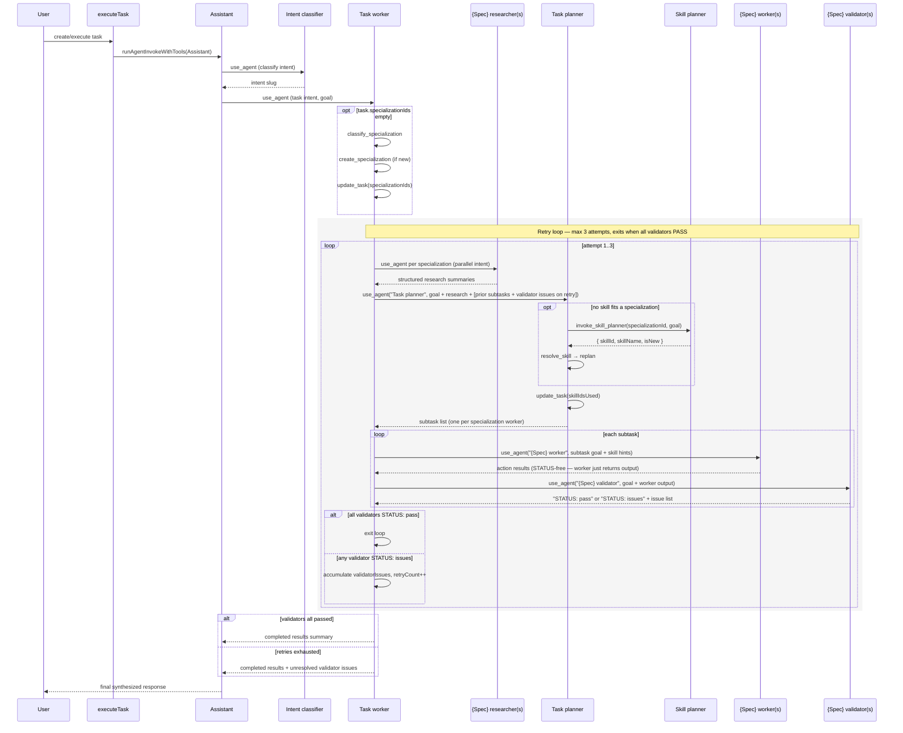
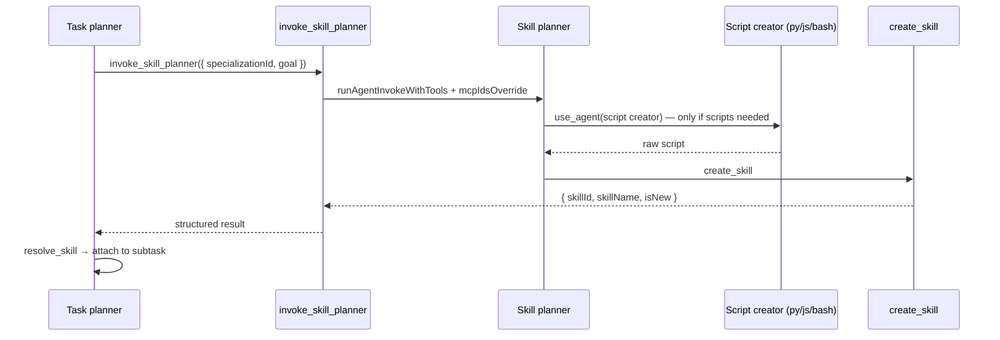

# Subagent Orchestration — Architecture

**Feature slug:** `subagent-orchestration`
**Status:** Proposed
**Reference architectures:** [`task-skill-planning/architecture.md`](../task-skill-planning/architecture.md) · [`system-agent/architecture.md`](../system-agent/architecture.md) · [`skill-composition/architecture.md`](../skill-composition/architecture.md) · [`skill-script-execution/architecture.md`](../skill-script-execution/architecture.md) · [`task-category-only-mode/architecture.md`](../task-category-only-mode/architecture.md) · [`agent-internal-tools/architecture.md`](../agent-internal-tools/architecture.md) · [`specialization/architecture.md`](../specialization/architecture.md)

This document **extends** `task-skill-planning/architecture.md` rather than replacing it. That doc introduced Task Planner, Skill Planner, and script creators. This doc closes the two gaps left open there:

1. A **cross-cutting rule** that every agent except Assistant is a subagent — its response is consumed by another agent, not the end user, and must be structured/machine-consumable.
2. A **mandatory validator + retry loop** (previously "only when the user explicitly requests validation") and a **subtask-list** planning output (previously "ordered steps"), with the Skill Planner triggered by Task Planner, not Task worker.

---

## Analysis

### Librarian findings (incorporated)

| Existing piece | Location | Reuse plan |
|---|---|---|
| `use_agent` / `list_agents` (role filter: researcher/worker/validator) | `services/agent/src/internalTools/useAgent/`, `listAgents/`, `filterAgentsByRole.ts` | Unchanged — Task worker already can list/invoke by role; no new tool needed for routing or retries |
| `runAgentInvokeWithTools` | `services/agent/src/internalTools/runAgentInvokeWithTools.ts` | Unchanged — every `use_agent` hop already goes through this |
| `buildSystemAgentSystemMessage` + section formatters | `domains/system-agent/src/utils/buildSystemAgentSystemMessage/**` | **Extended** — compose sections instead of exclusive `if/else`; add one new universal section |
| `SPECIALIZATION_AGENT_RULES` (researcher/worker/validator) | `services/agent/src/internalTools/createSpecialization/constants.ts` | **Rewritten** text only; same map shape, same provisioning call site |
| `provisionSpecializationAgents` / `backfillSpecializationAgentTools.ts` | `services/agent/src/internalTools/createSpecialization/` | Pattern reused for a new `backfillSpecializationAgentRules.ts` (rule text backfill for already-provisioned specializations) |
| `invoke_skill_planner` tool | `services/agent/src/internalTools/invokeSkillPlanner/` | **Unchanged handler** — already called by Task planner, not Task worker. Only `formatTaskWorkerOrchestrationSection` text was inconsistent with this; fixed in rule text, no code change to the tool |
| `update_task` (`skillIdsUsed`, `specializationIds`) | `services/agent/src/internalTools/updateTask/` | Unchanged |
| `ask_user` 2-round clarification convention | Task planner seed rule | Pattern reused for the validator retry cap (bounded loop, not unlimited) |
| `SYSTEM_AGENT_NAME` enum | `packages/constants/src/SystemAgentName.ts` | Unchanged — no new agent types needed |
| `systemAgentSeedSchema` | `domains/system-agent/src/seed/schema.ts` | Unchanged — rule is a plain string, no schema migration needed |

### What exists vs what is new

| Area | Exists | New / changed |
|---|---|---|
| Researcher → Task planner → worker chain | ✅ (`formatTaskWorkerOrchestrationSection`) | Rewritten: subtask routing, mandatory validator, retry loop, Skill planner ownership fixed |
| `Task planner` skill selection + `invoke_skill_planner` | ✅ Shipped | Output format changed: "ordered steps" → **subtask list** (one per specialization worker) |
| Validators | ✅ Provisioned per specialization (`SPECIALIZATION_AGENT_RULES.validator`) but **optional** in Task worker rule | **Mandatory**, with a `STATUS: pass \| issues` structured output convention consumed by Task worker's retry logic |
| "Subagent, not end user" principle | ❌ Implicit only (Assistant rule says "synthesize sub-agent outputs"; nothing tells subagents their output isn't user-facing) | **New universal section** (`formatSubagentOutputPolicySection`) injected for every agent except Assistant |
| Backfill of already-provisioned specialization agents | ✅ Pattern exists for tool ids (`backfillSpecializationAgentTools.ts`) | **New** `backfillSpecializationAgentRules.ts` — same pattern, for rule text |
| New internal tools / Zod schemas / DB fields | — | **None required** — `use_agent`'s `agentPrompt` is free text; retries and subtask payloads are conveyed as natural-language context, not structured DB fields |

### Design patterns applied

| Pattern | Where | Why |
|---|---|---|
| **Chain of Responsibility** | `## Mandatory delegation chain` (researcher → planner → worker → validator → retry) | Fixed ordered pipeline; each stage only proceeds once the prior stage's `use_agent` call returns |
| **Mediator** | Task worker orchestrating researchers/planner/workers/validators without them talking to each other directly | Central coordinator (Task worker) reduces coupling between specialization agents |
| **State** | Validator output convention `STATUS: pass \| issues` | Explicit state token instead of free-form prose — the next actor (Task worker) branches deterministically off it, avoiding an "if/else prose-sniffing" anti-pattern |
| **Strategy** | `SPECIALIZATION_AGENT_RULES: Record<SpecializationAgentRole, string>` | Already a map-object strategy keyed by role; extended (not restructured) with new text |
| **Decorator** | `buildSystemAgentSystemMessage` section composition | Each qualifying condition *appends* a section (universal output policy + role-specific section) instead of exclusive `if/else`, so cross-cutting behavior doesn't require duplicating text into every seed rule |
| **Facade** | `invoke_skill_planner` tool (unchanged) | Task planner still calls one tool; Skill Planner + script creators + `create_skill` stay hidden behind it |
| **Command** | `update_task`, `create_skill`, `create_specialization` (unchanged) | Existing domain commands, no new write operations needed |

### Test strategy

- **Unit tests** (`tdd-unit-test-writer`): `formatSubagentOutputPolicySection`, updated `formatTaskWorkerOrchestrationSection`, updated `buildSystemAgentSystemMessage/index.ts` composition, new `backfillSpecializationAgentRules`, updated `SPECIALIZATION_AGENT_RULES` constant shape (still a 3-key map, so existing consumers' types don't change).
- **No E2E scenarios** — this is a prompt/orchestration change with no new `apps/web` UI surface and no PRD Gherkin scenarios; skip `tdd-e2e-test-writer`.

---

## Architecture & Package Placement

```
domains/system-agent/seed/systemAgents.json                          ← Task worker + Task planner rule text
domains/system-agent/src/utils/buildSystemAgentSystemMessage/        ← new section + composition logic
services/agent/src/internalTools/createSpecialization/constants.ts   ← SPECIALIZATION_AGENT_RULES text
services/agent/src/internalTools/createSpecialization/               ← new backfillSpecializationAgentRules.ts
```

No new domains, services, or packages. All changes are **prompt/text + one composition-logic change** in an existing domain util. Data flow is unchanged: `executeTask` → `runAgentInvokeWithTools(Assistant)` → `use_agent` chain: Assistant → Task worker → {researchers, Task planner, workers, validators} — only the **content** of what's said at each hop changes, plus the loop/branch condition inside the Task worker's own rule.

---

## Recommendation

**Most conservative approach:** change only rule/prompt text (seed JSON + `SPECIALIZATION_AGENT_RULES`) and the section-composition logic in `buildSystemAgentSystemMessage`. Do **not** add new internal tools, Zod schemas, or DB fields — the entire orchestration protocol (subtask lists, validator status, retry context) is carried as natural-language `agentPrompt` strings through the existing `use_agent` tool, exactly as today's researcher → planner → worker chain already works.

**Why this reduces complexity:**
- Zero new domains/services; two files get new content, two get behavioral rewrites, one small new backfill script.
- Retry/loop state lives entirely in the Task worker's own reasoning (it is the one LLM call that stays "alive" across the whole chain) — no persisted loop-state field needed.
- The `STATUS: pass|issues` convention is the only "protocol" addition, and it's plain text, not a schema change.

**Trade-offs considered:**

| Decision | Choice | Alternative rejected |
|---|---|---|
| Retry loop state | Kept implicit in Task worker's own reasoning across nested `use_agent` calls | Persisting `retryCount`/`validatorIssues` on the task document — rejected, adds a domain field and command changes for a value that's only needed within one Task worker invocation |
| Retry cap | 3 attempts (mirrors `ask_user` 2-round convention, +1 for the initial pass) | Unbounded retries — rejected, risk of infinite loop with no code-level circuit breaker (this is LLM-driven, not a state machine) |
| Validator signal format | `STATUS: pass \| issues` leading line | Free-form prose — rejected, unreliable for the Task worker to branch on deterministically |
| Skill planner invocation | Task planner only (fixing the doc/rule inconsistency) | Task worker also allowed to call it — rejected per explicit user requirement; also avoids Task worker duplicating Task planner's catalog knowledge |
| Subtask list format | Structured plain-text list (Specialization / Goal / Skill hints) | JSON schema enforced via a new Zod tool schema — rejected; `agentPrompt` is unstructured text end-to-end today, and no code parses planner output, so JSON would add a schema with no consumer |
| Cross-cutting "not user-facing" rule | One new injected section (`formatSubagentOutputPolicySection`) applied to all non-Assistant agents | Copy-pasting the same paragraph into every seed rule — rejected, violates DRY and this repo's file/pattern conventions (matches existing Decorator-style sections) |

---

## Full Orchestration Flow

### Sequence diagram (with mandatory validator retry loop)



### Skill creation sub-chain (unchanged, shown for completeness)



---

## Agent Role Table

Every row except **Assistant** is subject to the new **Output policy** section (`## Output policy` — see [buildSystemAgentSystemMessage changes](#buildsystemagentsystemmessage-changes)): responses go to another agent, never the end user, and must be direct/structured/no filler.

| Agent | Role | Invoked by | Invokes | Input format | Output format |
|---|---|---|---|---|---|
| **Assistant** | Entry point; user-facing synthesizer (**exception** — output IS user-facing) | User (via `executeTask`) | Intent classifier, Task worker | Raw user message | Natural-language response to the user |
| **Intent classifier** | Classify intent | Assistant | — | User message | Single category slug (`task`) |
| **Specialization classifier** | Match/propose specialization domain | `classify_specialization` tool (called by Task worker) | — | Task description + existing specialization list | 1–3 existing names, or one `NEW: name\|description` line |
| **MCP specialization classifier** | Match relevant MCPs | `createSpecialization` flow (async, post-provisioning) | — | Specialization name/description + MCP catalog | MCP slugs, one per line |
| **Specialization agent description generator** | Generate agent descriptions | `createSpecialization` flow (async) | — | Agent name + role + specialization name | One-sentence description |
| **Task worker** | Mediator/orchestrator for the whole chain | Assistant | Researchers, Task planner, Workers, Validators, `classify_specialization`, `create_specialization` | Goal + intent category | Completed results (+ unresolved validator issues if retries exhausted) |
| **{Spec} researcher** | Research topic for its specialization | Task worker | `web_search`, `web_page_content`, `resolve_skill` | Goal / topic | `Findings / Sources / Open questions` |
| **Task planner** | Select/compose skills, split goal into subtasks | Task worker | `resolve_skill`, `invoke_skill_planner`, `ask_user`, `update_task` | Goal + intent category + research summaries + skill catalogs (+ prior subtasks + validator issues on retry) | `Goal / Assumptions / Subtasks (per specialization worker) / Dependencies / Referenced skills` |
| **Skill planner** | Create a new skill when no catalog skill fits | `invoke_skill_planner` tool (called only by Task planner) | Script creators, `create_skill` | `{ specializationId, goal }` | `{ skillId, skillName, isNew }` |
| **Skill script creator (python/js/bash)** | Write one script for a skill | Skill planner | — | Script requirement description | Raw source code only |
| **{Spec} worker** | Execute one subtask using skills | Task worker | `resolve_skill`, `run_skill_script`, `web_search`, `web_page_content` | Subtask goal + skill hints | `Result / Details / Issues` |
| **{Spec} validator** | Verify a worker's output against its goal | Task worker | `web_search`, `web_page_content` (verification only) | Worker's goal + worker's output | `STATUS: pass\|issues` + `Issues` or `Notes` |
| **Task title generator** | Short task title | (task creation flow) | — | Task description | Title text only (≤8 words) |
| **Skill resolver** | Resolve a named skill's full rule | `resolve_skill` callers (agents) | `resolve_skill` | Skill name | Full rule text, verbatim |

---

## Full Proposed Rule Text (copy-paste ready)

### `domains/system-agent/seed/systemAgents.json`

Only **Task worker** and **Task planner** rule text change. All other entries are unchanged (they already comply with the new cross-cutting principle — the universal Output policy section is injected at runtime, not baked into seed text, so no seed edit is needed for them).

#### Task worker (updated)

```
You orchestrate one-off tasks by delegating to specialization and system agents. You do not execute work yourself.

Setup (only when task.specializationIds is empty):
1. Call classify_specialization with the task description.
2. If type is existing, call update_task with those specializationIds. If type is new, call create_specialization then update_task with the new specializationId.

Then follow ## Mandatory delegation chain in order. Every step must be a use_agent call — researchers, Task planner, workers, then validators. Validators are mandatory for every specialization worker invoked in this task; never skip them and never skip them because the user did not ask for validation. If any validator reports issues, retry from Task planner with the validator issues as input. Repeat until all validators pass or the retry limit in the delegation chain is reached.

Your response is consumed by the Assistant, not the end user — return completed results, not plans, intended actions, or restated instructions.

Output:
1. Completed results from worker execution (primary)
2. Assumptions (if any)
3. Unresolved validator issues (only if the retry limit was reached)
4. Blockers or partial results only when work could not be fully completed

Keep the output proportional to request complexity.
```

#### Task planner (updated)

```
You plan tasks by selecting and combining skills from specialization catalogs, then split the goal into one subtask per specialization worker. Planning only — do not execute.

Workflow:
1. Read the goal, intent category, research summaries, and available skill catalogs for each linked specialization. On a retry, you will also receive the previous subtask list and validator issues — revise only the subtasks the issues point to; leave subtasks with no reported issues unchanged.
2. For each linked specialization, select and combine skills from its catalog only — never invent skill names.
3. Call resolve_skill for each selected skill to load full rules.
4. When no existing skill fits the goal for a specialization, call invoke_skill_planner with specializationId and goal; replan the affected subtask after the new skill is created. You are the only agent that calls invoke_skill_planner — Task worker never calls Skill planner directly.
5. Clarification: round 1 — call ask_user once with all needed questions; round 2 — at most one follow-up ask_user for clarification; after two rounds, produce a best-effort plan with stated assumptions.
6. Call update_task with skillIdsUsed for all skills referenced across all subtasks.
7. Return a subtask list — one subtask per specialization worker. Never return a single combined plan or a flat ordered-steps list.

Output:
1. Goal (one sentence)
2. Assumptions (if any)
3. Subtasks (numbered; one per specialization worker):
   - Specialization: <name>
   - Goal: <concrete, verifiable goal for that worker>
   - Skill hints: <skill name(s), optional>
4. Dependencies / blockers (cross-subtask only)
5. Referenced skill names (all subtasks combined)

Your response is consumed by the Task worker, not the end user.
```

#### All other agents — unchanged seed text (confirmed compliant)

| Agent | Why no seed change is needed |
|---|---|
| Assistant | Explicit exception — user-facing by design |
| Intent classifier | Already single-token output, no fluff |
| Specialization classifier | Already structured line-based output |
| MCP specialization classifier | Already slug-only output |
| Specialization agent description generator | Already single-sentence, label-free output |
| Question worker / Scheduled task worker / Routine task worker (`_disabled`) | Disabled under `task-category-only-mode`; when re-enabled, apply the same Task worker pattern above (researcher → planner → worker → mandatory validator retry loop) before turning them back on |
| Task title generator | Already title-only output |
| Skill resolver | Already verbatim pass-through, no prose |
| Skill planner | Already delegates/creates only; invocation source (Task planner only) is enforced by tool wiring, not rule text |
| Skill script creator (python/javascript/bash) | Already code-only output |

### `services/agent/src/internalTools/createSpecialization/constants.ts` — `SPECIALIZATION_AGENT_RULES`

```typescript
export const SPECIALIZATION_AGENT_RULES: Record<SpecializationAgentRole, string> = {
  researcher:
    `You research the given topic thoroughly for another agent, not the end user. Return a structured summary only — no LLM fluff, filler, or conversational prose.

Output format:
Findings: <bulleted key findings>
Sources: <bulleted sources/links, or "none">
Open questions: <bulleted unresolved gaps, or "none">

${SPECIALIZATION_WEB_SEARCH_GUIDANCE}`,
  worker:
    `You execute work for another agent, not the end user — you do not plan, delegate, or describe what should be done. When given a subtask goal, perform the work and return only the results of your actions (outputs, findings, created content, command results, deliverables). Do not restate the goal, list future steps, or explain what you would do.

Output format:
Result: <what was produced/done>
Details: <concrete output, data, or artifact content>
Issues: <anything that could not be completed, or "none">

If a step cannot be completed, report what was attempted, the actual error or blocker, and any partial results only. ${SPECIALIZATION_WEB_SEARCH_GUIDANCE}`,
  validator:
    `You review another agent's work output for accuracy, completeness, and quality against the goal it was given. Your response is consumed by the Task worker, not the end user — no LLM fluff or conversational prose.

Output format — the first line is mandatory and must be exactly one of:
STATUS: pass
STATUS: issues

When STATUS is issues, follow with:
Issues: <numbered list of concrete, actionable problems>

When STATUS is pass, follow with:
Notes: <brief confirmation of what was verified, or "none">

${SPECIALIZATION_WEB_SEARCH_GUIDANCE}`,
};
```

The `SPECIALIZATION_AGENT_ROLES`, `SPECIALIZATION_PROVISIONING_ADMIN_ID`, `SPECIALIZATION_WEB_SEARCH_GUIDANCE`, and `SPECIALIZATION_AGENT_TOOL_IDS` exports are **unchanged**.

---

## `buildSystemAgentSystemMessage` Changes

### New file: `formatSubagentOutputPolicySection.ts`

```typescript
export const SUBAGENT_OUTPUT_POLICY_SECTION_HEADING = '## Output policy';

export const formatSubagentOutputPolicySection = (): string => {
  return `${SUBAGENT_OUTPUT_POLICY_SECTION_HEADING}

Your response is consumed by another agent in this orchestration system — never by the end user directly. Only the Assistant's final synthesis reaches the user.

Rules:
1. No conversational filler, greetings, hedging, or restating the request.
2. Return direct, structured output using the format specified in your rule (or clear labeled sections if none is specified).
3. Prefer short labeled fields/lists over prose paragraphs.
4. Do not address "you" as if replying to the user — write as a result payload, not a reply.`;
};
```

### Updated `formatTaskWorkerOrchestrationSection.ts`

```typescript
import { SYSTEM_AGENT_NAME } from '@vassembly/constants';

export const TASK_WORKER_ORCHESTRATION_SECTION_HEADING = '## Mandatory delegation chain';

export const MAX_TASK_WORKER_VALIDATOR_RETRIES = 3;

export const formatTaskWorkerOrchestrationSection = (): string => {
  const taskPlannerName = SYSTEM_AGENT_NAME.TaskPlanner;

  return `${TASK_WORKER_ORCHESTRATION_SECTION_HEADING}

Complete every step via use_agent before starting the next. Never call specialization workers until "${taskPlannerName}" returns. Validators are mandatory — never skip step 4.

1. **Researchers (required)** — call list_agents with role=researcher, then use_agent for each "{Specialization} researcher". Collect research summaries.
2. **${taskPlannerName} (required)** — call use_agent name="${taskPlannerName}" with the goal, intent category, and research summaries. On a retry (step 5), also pass the previous ${taskPlannerName} subtask list and the combined validator issues. ${taskPlannerName} may call "Skill planner" internally when no skill fits — you never call Skill planner directly.
3. **Route subtasks to workers (required)** — ${taskPlannerName} returns a numbered subtask list, one subtask per specialization worker. For each subtask: call list_agents with role=worker scoped to that subtask's specialization, then use_agent to the matching "{Specialization} worker" with only that subtask's goal and skill hints. Do not forward the full subtask list to every worker.
4. **Validators (mandatory, never skip)** — for each specialization worker invoked in step 3, call list_agents with role=validator scoped to the same specialization, then use_agent to the matching "{Specialization} validator" with: the goal the worker was asked to achieve, and the worker's output. Collect each validator's "STATUS: pass" or "STATUS: issues" assessment.
5. **Retry loop** — if every validator reports "STATUS: pass", stop and synthesize the final result. If any validator reports "STATUS: issues", repeat from step 2, passing the prior ${taskPlannerName} subtask list and all validator issues. Retry at most ${MAX_TASK_WORKER_VALIDATOR_RETRIES} times total; if issues remain after ${MAX_TASK_WORKER_VALIDATOR_RETRIES} retries, stop and report the unresolved issues.

Forbidden before step 2 completes:
- use_agent to any specialization worker or validator
- Producing the final deliverable without ${taskPlannerName} output

Forbidden at any point:
- Skipping step 4 for any worker that ran in step 3
- Calling "Skill planner" directly — ${taskPlannerName} owns that decision

Exact use_agent name value for the system planner: "${taskPlannerName}".`;
};
```

### Updated `index.ts` (compose sections instead of exclusive branching)

```typescript
import { appendCurrentDateTimeSection, SYSTEM_AGENT_NAME } from '@vassembly/constants';

import { formatIntentCategoriesSection } from './formatIntentCategoriesSection';
import { formatIntentRoutingSection } from './formatIntentRoutingSection';
import { formatSkillPlannerScriptSection } from './formatSkillPlannerScriptSection';
import {
  formatSpecializationWorkerExecutionSection,
  isSpecializationWorkerAgentName,
} from './formatSpecializationWorkerExecutionSection';
import { formatSubagentOutputPolicySection } from './formatSubagentOutputPolicySection';
import { formatTaskWorkerOrchestrationSection } from './formatTaskWorkerOrchestrationSection';

export interface BuildSystemAgentSystemMessageParams {
  name: string;
  rule: string;
  skillsCatalogSection?: string;
  now?: Date;
}

export const buildSystemAgentSystemMessage = ({
  name,
  rule,
  skillsCatalogSection,
  now,
}: BuildSystemAgentSystemMessageParams): string => {
  const sections: string[] = [rule];

  if (name !== SYSTEM_AGENT_NAME.Assistant) {
    sections.push(formatSubagentOutputPolicySection());
  }

  if (name === SYSTEM_AGENT_NAME.IntentClassifier) {
    sections.push(formatIntentCategoriesSection());
  } else if (name === SYSTEM_AGENT_NAME.Assistant) {
    sections.push(formatIntentRoutingSection());
  } else if (name === SYSTEM_AGENT_NAME.TaskWorker) {
    sections.push(formatTaskWorkerOrchestrationSection());
  } else if (name === SYSTEM_AGENT_NAME.SkillPlanner) {
    sections.push(formatSkillPlannerScriptSection());
  } else if (isSpecializationWorkerAgentName({ name })) {
    sections.push(formatSpecializationWorkerExecutionSection());
  }

  let systemMessage = sections.join('\n\n');

  if (skillsCatalogSection) {
    systemMessage = `${systemMessage}\n\n${skillsCatalogSection}`;
  }

  return appendCurrentDateTimeSection({ systemMessage, now });
};
```

**Behavioral note:** `isSpecializationWorkerAgentName` and `formatSpecializationWorkerExecutionSection` are unchanged — researchers and validators do **not** get that section (it's worker-specific "you execute, don't plan" reinforcement), but they **do** get the new universal Output policy section via the `name !== Assistant` check above.

---

## Gap Analysis — Code Changes Beyond Rule Text

| Change | Type | Why it's needed beyond a rule edit |
|---|---|---|
| `formatSubagentOutputPolicySection.ts` (new file) | New code | Cross-cutting principle must not be copy-pasted into 15 seed rule strings — centralize it (DRY, matches existing Decorator pattern for sections) |
| `buildSystemAgentSystemMessage/index.ts` composition rewrite | Behavior change | Current `if/else-if` is **exclusive** — only one section is ever appended. Composing multiple sections is required for the universal Output policy section to coexist with role-specific sections |
| `formatTaskWorkerOrchestrationSection.ts` rewrite | Behavior change | Encodes the mandatory validator step, retry loop, subtask routing, and corrected Skill planner ownership — this is the single source of truth Task worker's seed rule points to (`## Mandatory delegation chain`), so the loop logic belongs here, not duplicated in the seed JSON |
| `backfillSpecializationAgentRules.ts` (new file, same pattern as `backfillSpecializationAgentTools.ts`) | New code | `SPECIALIZATION_AGENT_RULES` text only affects **newly provisioned** specializations. Existing specializations already have researcher/worker/validator system agents in MongoDB with the **old** rule baked in at creation time — a backfill is required to update their `rule` field to the new text (including the `STATUS: pass\|issues` convention the retry loop depends on) |
| `domains/system-agent/seed/systemAgents.json` — Task worker, Task planner | Data (seed) | Re-run `loadSystemAgents` on deploy to sync new seed text into the `systemAgents` collection (existing seed-sync mechanism, no new mechanism needed) |
| `services/agent/src/internalTools/createSpecialization/constants.ts` | Data (constants) | Feeds both new provisioning (`provisionSpecializationAgents`) and the new backfill script |
| Test updates | Tests | `buildSystemAgentSystemMessage/index.test.ts`, a new `formatSubagentOutputPolicySection.test.ts`, updated `formatTaskWorkerOrchestrationSection` assertions (if a test file is added), and a new `backfillSpecializationAgentRules.test.ts` |
| **No changes needed** | — | `packages/constants` (`SYSTEM_AGENT_NAME`, `INTERNAL_TOOLS`, `INTENT_CATEGORIES`), `packages/client-langchain` schemas, `domains/task` model/commands, `domains/skill/**`, `services/skill/**`, `services/task/src/handlers/executeTask/**`, `packages/client-sandbox` — none of these encode planning/validation/retry structure; they're all transport/persistence layers unaffected by prompt content |

**Why no new internal tool or schema:** `use_agent`'s Zod schema is `{ name: string, agentPrompt: string }` — the entire subtask list, validator goal/output pairing, and retry context are just strings placed into `agentPrompt` by the calling agent's own reasoning. There is no code today that parses Task planner's or a validator's output; every hop is LLM-to-LLM natural language. Introducing a JSON schema for the subtask list would require a *consumer* that parses it — none exists, and building one would be over-engineering for a purely prompt-driven system (see `.cursor/rules/software-design-patterns.mdc` anti-pattern: "pattern for pattern's sake").

---

## Reconciliation with Related Docs

| Doc | Relationship |
|---|---|
| `task-skill-planning/architecture.md` | **Extended, not duplicated.** That doc's Task Planner/Skill Planner agent definitions, `invoke_skill_planner` tool, and `skillIdsUsed` field are reused as-is. Only the Task Planner **output format** (§"Agent definitions → Task Planner → Output sections") and the Task worker orchestration steps it documents are superseded by this doc's rule text above. Recommend `documentation-writer` add a short "superseded by `subagent-orchestration`" cross-reference note at the top of that doc's Task Planner output-format section (no content deletion). |
| `system-agent/architecture.md` | Unrelated layer (domain package structure, RBAC, invoke API) — no overlap with orchestration rule content; no changes needed. |
| `skill-composition/architecture.md` | Unchanged — `usesSkillIds`, `resolve_skill` composition, and script tagging are consumed as-is by workers; this doc doesn't touch skill composition. |
| `skill-script-execution/architecture.md` | Unchanged — `run_skill_script` / sandbox execution is a worker-level tool; the validator/retry loop wraps around worker execution without touching how scripts run. |
| `task-category-only-mode/architecture.md` | Confirms Question/Scheduled/Routine workers are disabled — this doc's Task worker pattern is the template to apply to them when re-enabled (see seed table above), but re-enabling those flows is out of scope here. |

---

## Todo Plan

1. **`domains/system-agent`** — [Type: domain (seed + utils)]
   - Changes needed: Update `seed/systemAgents.json` (Task worker, Task planner rule text per this doc); add `formatSubagentOutputPolicySection.ts`; rewrite `formatTaskWorkerOrchestrationSection.ts`; update `buildSystemAgentSystemMessage/index.ts` to compose sections instead of exclusive branching
   - Files to modify/create: `seed/systemAgents.json`; `src/utils/buildSystemAgentSystemMessage/formatSubagentOutputPolicySection.ts` (new); `src/utils/buildSystemAgentSystemMessage/formatTaskWorkerOrchestrationSection.ts`; `src/utils/buildSystemAgentSystemMessage/index.ts`; `src/utils/buildSystemAgentSystemMessage/index.test.ts`
   - Suggested subagent workflow: `tdd-unit-test-writer` → `coder` ↔ `code-reviewer` (loop: max 2 iterations) → `documentation-writer`
   - Dependencies: None

2. **`services/agent`** — [Type: service (internal tools)]
   - Changes needed: Rewrite `SPECIALIZATION_AGENT_RULES` text in `createSpecialization/constants.ts`; add `backfillSpecializationAgentRules.ts` (mirrors `backfillSpecializationAgentTools.ts`) to update already-provisioned specialization agents' rule text; wire the backfill into the same place `backfillSpecializationAgentTools` is invoked (or expose as a standalone script if that's how the existing backfill runs)
   - Files to modify/create: `src/internalTools/createSpecialization/constants.ts`; `src/internalTools/createSpecialization/backfillSpecializationAgentRules.ts` (new); `src/internalTools/createSpecialization/backfillSpecializationAgentRules.test.ts` (new)
   - Suggested subagent workflow: `tdd-unit-test-writer` → `coder` ↔ `code-reviewer` (loop: max 2 iterations) → `documentation-writer`
   - Dependencies: None (can run in parallel with Todo 1)

3. **`docs/features/task-skill-planning`** — [Type: documentation cross-reference]
   - Changes needed: Add a short note at the Task Planner "Output sections" heading pointing to this doc's superseding subtask-list format; no deletions
   - Files to modify: `docs/features/task-skill-planning/architecture.md`
   - Suggested subagent workflow: `documentation-writer` → Done
   - Dependencies: Todo 1 (rule text finalized)

---

## Decisions

| # | Decision |
|---|---|
| D-1 | Every agent except Assistant gets a shared, code-injected "Output policy" section rather than per-rule duplicated text |
| D-2 | Validators are mandatory for every specialization worker invocation, with a bounded retry loop (max 3 attempts) back to Task planner |
| D-3 | Task planner is the **only** caller of Skill planner (via existing `invoke_skill_planner`); Task worker's rule and orchestration section no longer mention calling Skill planner directly |
| D-4 | Task planner output changes from a single ordered-steps plan to a subtask list, one subtask per specialization worker, with optional skill hints |
| D-5 | Validator output uses a fixed `STATUS: pass \| issues` leading line so Task worker can branch deterministically |
| D-6 | No new internal tools, Zod schemas, or DB fields — the entire protocol is carried through the existing free-text `agentPrompt` argument of `use_agent` |
| D-7 | Existing provisioned specialization agents need a rule-text backfill (new `backfillSpecializationAgentRules.ts`), following the established `backfillSpecializationAgentTools.ts` pattern |

---

*End of architecture — 3 todo items, zero new packages/domains/services, zero new internal tools.*
