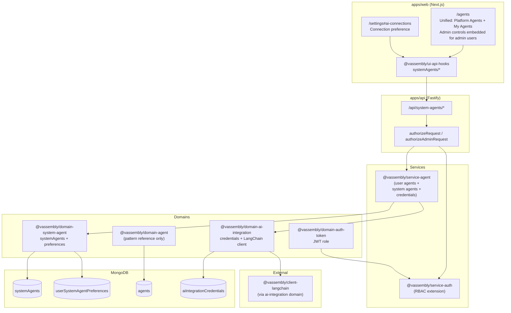
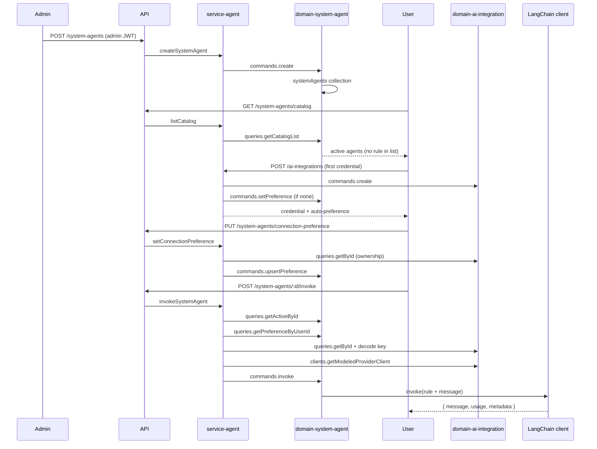
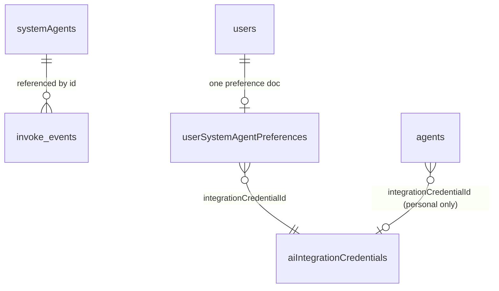
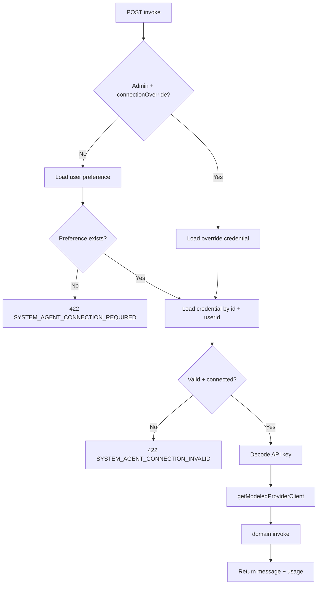
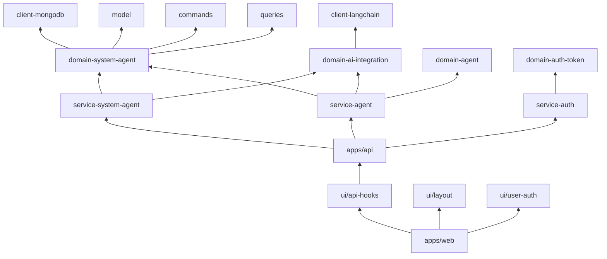

# System Agents — Architecture

**Status:** Engineering handoff  
**Last updated:** 2026-05-26  
**Related:** [PRD](./prd.md) · [UI/UX Design](./design.md) · [Agent Management](../agent-management/prd.md)

---

## 1. System Architecture Overview

### 1.1 High-level component diagram



### 1.2 End-to-end data flow



### 1.3 Integration points

| System | Role in System Agents |
|--------|----------------------|
| `@vassembly/domain-agent` | **Reused** — system agents extend existing agent model with `type` field; share collection, CRUD patterns, soft-delete, indexes. |
| `@vassembly/domain-ai-integration` | Credential lookup, ownership validation, `getModeledProviderClient`, `assertProviderConnection` / `testProviderConnection`. |
| `@vassembly/domain-auth-token` | JWT `role` claim (`user`, `admin`; `operator` planned). |
| `@vassembly/service-agent` | Cross-cutting hooks: auto-preference on first credential create; extend delete guard when credential is active system-agent preference. |
| `@vassembly/client-langchain` | Used **only** inside `domain-ai-integration` clients — never in services. |
| `@vassembly/client-encoder` | Decode `encryptedApiKey` in service layer before building LangChain client (same as `testConnection` handler). |

### 1.4 Collection decision

**Use a separate `systemAgents` MongoDB collection** (not a flag on `agents`).

|| Rationale | Detail |
||-----------|---------|
|| Query simplicity | Admin list has no `userId` filter; user catalog never joins personal agents. |
|| Schema divergence | No `userId`, no `integrationCredentialId` on agent doc; `rule` max 5000 vs 2000; categories include `onboarding`, `compliance`. |
|| Security boundary | Personal agent queries cannot accidentally return system agents. |
|| Audit fields | `createdByAdminId` / `updatedByAdminId` are platform-specific. |

**Trade-off:** Some CRUD boilerplate is duplicated from `@vassembly/domain-agent`. Acceptable — domains stay single-responsibility and queries remain simple.

---

## 2. Detailed File Structure & Packages

### 2.1 New packages

#### `domains/system-agent` — `@vassembly/domain-system-agent`

| Path | Type | Purpose |
|------|------|---------|
| `domains/system-agent/package.json` | JSON | Package manifest |
| `domains/system-agent/tsconfig.json` | JSON | TS config |
| `domains/system-agent/vitest.config.ts` | TS | Test config |
| `domains/system-agent/README.md` | MD | Domain API documentation |
| `domains/system-agent/src/index.ts` | TS | Default export: commands, queries, indexes |
| `domains/system-agent/src/model/model.ts` | TS | `SystemAgentModel`, enums |
| `domains/system-agent/src/model/dto.ts` | TS | Admin vs catalog DTO types |
| `domains/system-agent/src/model/factories.ts` | TS | Factory + translation |
| `domains/system-agent/src/model/toSystemAgentResponse.ts` | TS | Admin response mapper |
| `domains/system-agent/src/model/toCatalogResponse.ts` | TS | User catalog mapper (omits audit + rule in list) |
| `domains/system-agent/src/model/index.ts` | TS | Model exports |
| `domains/system-agent/src/model/preferenceModel.ts` | TS | `UserSystemAgentPreferenceModel` |
| `domains/system-agent/src/model/preferenceFactories.ts` | TS | Preference factory |
| `domains/system-agent/src/clients/mongodb.ts` | TS | DAOs + index bootstrap |
| `domains/system-agent/src/clients/index.ts` | TS | Client exports |
| `domains/system-agent/src/constants.ts` | TS | Shared enums/constants |
| `domains/system-agent/src/errors/index.ts` | TS | Domain-specific error helpers |
| `domains/system-agent/src/commands/create/index.ts` | TS | `createSystemAgent` |
| `domains/system-agent/src/commands/create/types.ts` | TS | Create input types |
| `domains/system-agent/src/commands/update/index.ts` | TS | `updateSystemAgent` |
| `domains/system-agent/src/commands/update/types.ts` | TS | Update input types |
| `domains/system-agent/src/commands/removeSoft/index.ts` | TS | Archive (soft delete) |
| `domains/system-agent/src/commands/removeSoft/types.ts` | TS | Archive input types |
| `domains/system-agent/src/commands/restore/index.ts` | TS | Restore archived |
| `domains/system-agent/src/commands/restore/types.ts` | TS | Restore input types |
| `domains/system-agent/src/commands/upsertPreference/index.ts` | TS | Set user preference |
| `domains/system-agent/src/commands/upsertPreference/types.ts` | TS | Preference input types |
| `domains/system-agent/src/commands/invoke/index.ts` | TS | LangChain invoke (no userId on agent) |
| `domains/system-agent/src/commands/invoke/types.ts` | TS | Invoke params/result |
| `domains/system-agent/src/commands/index.ts` | TS | Command barrel |
| `domains/system-agent/src/queries/getById/index.ts` | TS | Admin get (incl. archived) |
| `domains/system-agent/src/queries/getById/types.ts` | TS | Query types |
| `domains/system-agent/src/queries/getActiveById/index.ts` | TS | Catalog/invoke get (active only) |
| `domains/system-agent/src/queries/getActiveById/types.ts` | TS | Query types |
| `domains/system-agent/src/queries/getAdminList/index.ts` | TS | Paginated admin list + filters |
| `domains/system-agent/src/queries/getAdminList/types.ts` | TS | List query types |
| `domains/system-agent/src/queries/getCatalogList/index.ts` | TS | User catalog list |
| `domains/system-agent/src/queries/getCatalogList/types.ts` | TS | Catalog query types |
| `domains/system-agent/src/queries/getPreferenceByUserId/index.ts` | TS | Preference lookup |
| `domains/system-agent/src/queries/getPreferenceByUserId/types.ts` | TS | Preference query types |
| `domains/system-agent/src/queries/assertUniqueActiveName/index.ts` | TS | Name uniqueness check |
| `domains/system-agent/src/queries/assertUniqueActiveName/types.ts` | TS | Uniqueness types |
| `domains/system-agent/src/queries/index.ts` | TS | Query barrel |
| `domains/system-agent/src/commands/create/index.test.ts` | TS | Unit tests |
| `domains/system-agent/src/commands/invoke/index.test.ts` | TS | Unit tests |
| `domains/system-agent/src/commands/upsertPreference/index.test.ts` | TS | Unit tests |
| `domains/system-agent/src/queries/getCatalogList/index.test.ts` | TS | Unit tests |

#### `services/agent` — `@vassembly/service-agent` (consolidated)

Now includes all system-agent handlers. Structure:

| Path | Type | Purpose |
|------|------|---------|
| `services/agent/src/handlers/index.ts` | TS | Named handler exports (user + credential + system-agent) |
| `services/agent/src/handlers/createSystemAgent/` | TS | System agent handlers (10 total) |
| `services/agent/src/handlers/updateSystemAgent/` | TS | — |
| `services/agent/src/handlers/getSystemAgent/` | TS | — |
| `services/agent/src/handlers/listSystemAgents/` | TS | — |
| `services/agent/src/handlers/archiveSystemAgent/` | TS | — |
| `services/agent/src/handlers/restoreSystemAgent/` | TS | — |
| `services/agent/src/handlers/getConnectionPreference/` | TS | — |
| `services/agent/src/handlers/setConnectionPreference/` | TS | — |
| `services/agent/src/handlers/getUserConnectionPreference/` | TS | — |
| `services/agent/src/handlers/invokeSystemAgent/` | TS | — |
| `services/agent/src/helpers/toPreferenceResponse/` | TS | Preference response mapper |
| `services/agent/src/helpers/mapAdminResponse/` | TS | Admin response mapper |

### 2.2 Modified packages

#### `services/auth` — `@vassembly/service-auth`

| Path | Type | Change |
|------|------|--------|
| `services/auth/src/handlers/authorizeRequest/index.ts` | TS | Add optional `role` to output |
| `services/auth/src/handlers/authorizeRequest/types.ts` | TS | Extend `AuthorizeRequestOutput` |
| `services/auth/src/handlers/authorizeAdminRequest/index.ts` | TS | **New** — admin-only gate (403) |
| `services/auth/src/handlers/authorizeAdminRequest/types.ts` | TS | **New** |
| `services/auth/src/handlers/authorizeAdminRequest/index.test.ts` | TS | **New** |
| `services/auth/src/handlers/index.ts` | TS | Export `authorizeAdminRequest` |

#### `services/agent` — `@vassembly/service-agent`

| Path | Type | Change |
|------|------|--------|
| `services/agent/package.json` | JSON | Add `@vassembly/domain-user`, `@vassembly/domain-auth-token`, `@vassembly/constants` |
| `services/agent/vitest.config.ts` | TS | Add MongoDB mocks + setupFiles |
| `services/agent/vitest.setup.ts` | TS | **New** — MongoDB mock setup |
| `services/agent/test-mocks/client-mongodb.ts` | TS | **New** — MongoDB test fixtures |
| `services/agent/src/handlers/index.ts` | TS | Append 10 system-agent handlers + 2 helpers (toPreferenceResponse, mapAdminResponse) |
| `services/agent/src/handlers/[createSystemAgent-invokeSystemAgent]/` | TS | Migrated from service-system-agent |

#### `apps/api` — `@vassembly/api`

| Path | Type | Change |
|------|------|--------|
| `apps/api/package.json` | JSON | Remove `@vassembly/service-system-agent`; keep `@vassembly/domain-system-agent` |
| `apps/api/src/routes/index.ts` | TS | Register `/system-agents` prefix + indexes |
| `apps/api/src/routes/system-agents/index.ts` | TS | **New** — route aggregation (ordered) |
| `apps/api/src/routes/system-agents/*.ts` | TS | **Updated** — all routes now import from `@vassembly/service-agent` |
| `apps/api/src/graphql/resolvers/systemAgent.ts` | TS | **Updated** — import from `@vassembly/service-agent` |

#### `apps/web` — `@vassembly/web`

| Path | Type | Change |
|------|------|--------|
| `apps/web/lib/auth/ProtectedAuthRoute.tsx` | TS | Add optional `roles`, `forbiddenFallback` |
| `apps/web/app/admin/layout.tsx` | TS | **New** — admin layout + role gate |
| `apps/web/app/admin/_components/AdminForbiddenPage/AdminForbiddenPage.tsx` | React | **New** |
| `apps/web/app/admin/_components/AdminForbiddenPage/index.ts` | TS | **New** |
| `apps/web/app/admin/_components/AdminInfoBanner/AdminInfoBanner.tsx` | React | **New** |
| `apps/web/app/admin/_components/AdminInfoBanner/index.ts` | TS | **New** |
| `apps/web/app/admin/system-agents/page.tsx` | React | **New** — admin list |
| `apps/web/app/admin/system-agents/create/page.tsx` | React | **New** |
| `apps/web/app/admin/system-agents/[id]/edit/page.tsx` | React | **New** |
| `apps/web/app/admin/system-agents/_components/SystemAgentList/` | React | **New** — table/cards |
| `apps/web/app/admin/system-agents/_components/SystemAgentForm/` | React | **New** — create/edit form |
| `apps/web/app/admin/system-agents/_components/SystemAgentArchiveDialog/` | React | **New** |
| `apps/web/app/admin/system-agents/_components/SystemAgentRestoreDialog/` | React | **New** |
| `apps/web/app/admin/system-agents/_components/SystemAgentInvokeModal/` | React | **New** — Phase 4 admin test |
| `apps/web/app/agents/AgentsPageView.tsx` | React | Add `PlatformAgentsSection` |
| `apps/web/app/agents/_components/PlatformAgentsSection/PlatformAgentsSection.tsx` | React | **New** — user catalog |
| `apps/web/app/agents/_components/PlatformAgentsSection/PlatformAgentCard.tsx` | React | **New** |
| `apps/web/app/agents/_components/PlatformAgentsSection/usePlatformAgentsList.ts` | TS | **New** |
| `apps/web/app/agents/_components/SystemAgentInvokeModal/SystemAgentInvokeModal.tsx` | React | **New** — Phase 4 user invoke |
| `apps/web/app/settings/_components/SystemAgentConnectionPreference/` | React | **New** — Phase 3 |
| `apps/web/app/settings/page.tsx` | React | Add `#ai-connections` section |

#### `ui/api-hooks` — `@vassembly/ui-api-hooks`

| Path | Type | Change |
|------|------|--------|
| `ui/api-hooks/src/systemAgents/index.ts` | TS | **New** — barrel |
| `ui/api-hooks/src/systemAgents/types.ts` | TS | **New** — API types |
| `ui/api-hooks/src/systemAgents/http/createSystemAgent.ts` | TS | **New** |
| `ui/api-hooks/src/systemAgents/http/listSystemAgents.ts` | TS | **New** |
| `ui/api-hooks/src/systemAgents/http/getSystemAgent.ts` | TS | **New** |
| `ui/api-hooks/src/systemAgents/http/updateSystemAgent.ts` | TS | **New** |
| `ui/api-hooks/src/systemAgents/http/archiveSystemAgent.ts` | TS | **New** |
| `ui/api-hooks/src/systemAgents/http/restoreSystemAgent.ts` | TS | **New** |
| `ui/api-hooks/src/systemAgents/http/listCatalog.ts` | TS | **New** |
| `ui/api-hooks/src/systemAgents/http/getCatalogItem.ts` | TS | **New** |
| `ui/api-hooks/src/systemAgents/http/getConnectionPreference.ts` | TS | **New** |
| `ui/api-hooks/src/systemAgents/http/setConnectionPreference.ts` | TS | **New** |
| `ui/api-hooks/src/systemAgents/http/invokeSystemAgent.ts` | TS | **New** |
| `ui/api-hooks/src/systemAgents/useSystemAgents.ts` | TS | **New** — admin list hook |
| `ui/api-hooks/src/systemAgents/useSystemAgentCatalog.ts` | TS | **New** — user catalog hook |
| `ui/api-hooks/src/systemAgents/useSystemAgentPreference.ts` | TS | **New** |
| `ui/api-hooks/src/index.ts` | TS | Export system agent hooks |

#### `ui/components/layout` — `@vassembly/ui-layout`

| Path | Type | Change |
|------|------|--------|
| `ui/components/layout/src/presets/main.tsx` | TS | Add Administration drawer section (admin role) |

#### Root workspace

| Path | Type | Change |
|------|------|--------|
| `pnpm-workspace.yaml` | YAML | No change (existing globs cover new packages) |

### 2.3 Packages intentionally unchanged

| Package | Reason |
|---------|--------|
| `domains/agent` | Separate collection — no model or command changes required. |
| `domains/ai-integration` | Existing credential + LangChain client sufficient. |
| `packages/client-langchain` | No new provider support needed. |

### 2.4 Optional future extraction

If admin or catalog UI is reused beyond `apps/web`, extract to `ui/components/system-agent-form/` etc. **Defer until second consumer exists** — match current agents pattern (UI in app, hooks in `ui/api-hooks`).

---

## 3. Data Models & MongoDB Schema

### 3.1 `agents` collection (unified)

```typescript
import { ModelWithTranslation } from '@vassembly/model';

export enum AgentType {
  System = 'system',
  User = 'user',
}

export enum AgentCategory {
  Coding = 'coding',
  Utility = 'utility',
  Onboarding = 'onboarding',
  Compliance = 'compliance',
}

export enum AgentStatus {
  Active = 'active',
  Archived = 'archived',
  Disabled = 'disabled',
}

export class AgentModel extends ModelWithTranslation {
  type: AgentType; // 'system' or 'user'
  userId?: string; // Required for type: 'user'; absent for type: 'system'
  name?: string;
  description?: string;
  rule?: string;
  category?: AgentCategory; // Only for type: 'system'
  status?: AgentStatus;
  createdByAdminId?: string; // Only for type: 'system'
  updatedByAdminId?: string; // Only for type: 'system'
}
```

**Field rules (all agents)**

|| Field | Type | Constraints |
||-------|------|-------------|
|| `id` | string | System-generated (`@vassembly/model`) |
|| `type` | enum | Required; `'system'` or `'user'`; determines schema and visibility |
|| `name` | string | Required; 1–100 chars; trim; unique per type (global for system, per user for user agents) |
|| `rule` | string | Required; max 5000 for system, max 2000 for user |
|| `description` | string | Optional; max 500 |
|| `status` | enum | `'active'` (default), `'archived'`, `'disabled'` |
|| `createdAt`, `updatedAt` | Date | System-set |
|| `removedAt` | Date \| null | Null when active; set on archive |

**System agent only fields** (`type: 'system'`)

|| Field | Type | Constraints |
||-------|------|-------------|
|| `category` | enum | Optional; `'coding'`, `'utility'`, `'onboarding'`, `'compliance'` |
|| `createdByAdminId` | string | Required on create; set to admin `userId` |
|| `updatedByAdminId` | string | Required on every write; set to admin `userId` |

**User agent only fields** (`type: 'user'`)

|| Field | Type | Constraints |
||-------|------|-------------|
|| `userId` | string | Required; scope ownership |
|| `integrationCredentialId` | string | Optional; user's chosen integration for personal agent |

**Indexes**

```typescript
// For all agents
await collection.createIndex({ type: 1, status: 1 });
await collection.createIndex({ type: 1, createdAt: -1 });
await collection.createIndex({ type: 1, updatedAt: -1 });
await collection.createIndex({ userId: 1, status: 1 }); // For user agents

// Unique name constraints
await collection.createIndex(
  { type: 1, name: 1 },
  {
    unique: true,
    partialFilterExpression: { type: 'system', status: 'active', removedAt: null },
  },
); // System agent names globally unique

await collection.createIndex(
  { type: 1, userId: 1, name: 1 },
  {
    unique: true,
    partialFilterExpression: { type: 'user', status: 'active', removedAt: null },
    sparse: true,
  },
); // User agent names unique per user

// For full-text search
await collection.createIndex({ name: 'text', description: 'text' });
```

### 3.2 `userSystemAgentPreferences` collection

**Decision: separate collection** (not embedded on user profile).

| Rationale | Detail |
|-----------|--------|
| Isolation | Preference is orthogonal to user identity fields. |
| Write frequency | Updated independently of profile; avoids user doc contention. |
| Query pattern | Always keyed by `userId`; simple upsert. |
| PRD alignment | Explicit collection name in requirements. |

```typescript
export class UserSystemAgentPreferenceModel extends ModelWithTranslation {
  userId?: string;
  integrationCredentialId?: string;
}
```

**Field rules**

| Field | Type | Constraints |
|-------|------|-------------|
| `userId` | string | Required; **unique** |
| `integrationCredentialId` | string | Required; must reference owned, active credential |
| `createdAt`, `updatedAt` | Date | System-set |

**Indexes**

```typescript
await collection.createIndex({ userId: 1 }, { unique: true });
await collection.createIndex({ integrationCredentialId: 1 });
```

### 3.3 Relationships



- **System agents do not reference credentials.** Connection is always per-user via preference.
- **Personal agents** remain in `agents` with `userId` + optional `integrationCredentialId`.
- **Credential delete guard** checks both personal agent usage count and active system-agent preference.

### 3.4 Soft-delete pattern

Mirror `@vassembly/domain-agent`:

1. **Archive:** `removeSoftDb` sets `removedAt` + `status: archived`.
2. **Restore:** clear `removedAt`, set `status: active`.
3. **User catalog:** filter `removedAt: null` AND `status: active`.
4. **Admin list:** optional status filter includes archived/disabled.
5. **Invoke:** reject archived/disabled/missing → `404 SYSTEM_AGENT_NOT_FOUND`.

### 3.5 Response DTOs

```typescript
// Admin response — includes rule + audit
export interface SystemAgentAdminResponse {
  id: string;
  name: string;
  description?: string;
  rule: string;
  category?: SystemAgentCategory;
  status: SystemAgentStatus;
  createdByAdminId: string;
  updatedByAdminId: string;
  createdAt: string;
  updatedAt: string;
  removedAt: string | null;
}

// Catalog list item — omits rule and audit
export interface SystemAgentCatalogListItem {
  id: string;
  name: string;
  description?: string;
  category?: SystemAgentCategory;
  status: SystemAgentStatus;
}

// Catalog detail — includes rule for invoke preview
export interface SystemAgentCatalogDetail extends SystemAgentCatalogListItem {
  rule: string;
}

export interface SystemAgentPreferenceResponse {
  userId: string;
  integrationCredentialId: string;
  updatedAt: string;
}
```

---

## 4. Domain Layer (`domains/system-agent`)

### 4.1 Commands

| Command | Source pattern | New logic |
|---------|---------------|-----------|
| `create` | `domain-agent/commands/create` | No `userId`; set audit fields; unique name check; `rule` max 5000 |
| `update` | `domain-agent/commands/update` | Update audit field; unique name on rename |
| `removeSoft` | `domain-agent/commands/removeSoft` | No ownership check; set `status: archived` |
| `restore` | `domain-agent/commands/restore` | Require archived state |
| `upsertPreference` | **New** | Upsert by `userId`; does **not** validate credential ownership (service layer) |
| `invoke` | `domain-agent/commands/invoke` | Load via `getActiveById` (no `userId`); accept `message` appended to rule |

**Invoke command signature:**

```typescript
export interface InvokeSystemAgentParams {
  modeledProviderClient: ModeledProviderClient;
  systemAgentId: string;
  message: string;
}

export interface InvokeSystemAgentResult {
  message: string;
  usage?: { promptTokens: number; completionTokens: number; totalTokens: number };
  metadata?: { model: string; provider: string };
}
```

Implementation loads active agent, composes prompt as `${agent.rule}\n\n${message}` (or product-defined template), calls `modeledProviderClient.invoke`.

### 4.2 Queries

| Query | Purpose | Filters |
|-------|---------|---------|
| `getById` | Admin detail | Any status |
| `getActiveById` | Catalog detail + invoke | `removedAt: null`, `status: active` |
| `getAdminList` | Admin table | status, search, pagination |
| `getCatalogList` | User catalog | active only |
| `getPreferenceByUserId` | Preference lookup | by `userId` |
| `assertUniqueActiveName` | Create/update guard | case-insensitive among active |

### 4.3 Errors

Use `@vassembly/errors` with stable codes mapped at API layer:

| Condition | Error | HTTP |
|-----------|-------|------|
| Duplicate active name | `ConflictError` → `SYSTEM_AGENT_NAME_CONFLICT` | 409 |
| Agent not found / archived (catalog) | `NotFoundError` → `SYSTEM_AGENT_NOT_FOUND` | 404 |
| Non-admin management | `ForbiddenError` → `FORBIDDEN` | 403 |
| Validation failure | `ValidationError` → `VALIDATION_ERROR` | 400 |

Domain layer throws typed errors; services add business validation (credential ownership).

### 4.4 Reuse vs new

| Reuse | New |
|-------|-----|
| `@vassembly/commands` helpers (`createDb`, `updateDbById`, `removeSoftDb`) | System-specific Zod schemas |
| `@vassembly/queries` helpers where applicable | Catalog/admin list queries without `userId` |
| Soft-delete semantics from agent domain | Preference model + upsert |
| DTO mapping pattern (`toAgentResponse` → `toCatalogResponse`) | Category enum extension |
| — | Admin audit fields on every write |

**Do not** import or call `@vassembly/domain-agent` commands — prevents accidental cross-collection access.

---

## 5. Service Layer (`services/system-agent`)

### 5.1 Handler inventory

| Handler | Domain ops | Notes |
|---------|-----------|-------|
| `createSystemAgent` | `assertUniqueActiveName`, `commands.create` | Sets `createdByAdminId`, `updatedByAdminId` from admin `userId` |
| `updateSystemAgent` | `getById`, `assertUniqueActiveName`, `commands.update` | |
| `getSystemAgent` | `queries.getById` | |
| `listSystemAgents` | `queries.getAdminList` | No `userId` filter |
| `archiveSystemAgent` | `commands.removeSoft` | Always allowed (archived hidden from catalog) |
| `restoreSystemAgent` | `commands.restore` | |
| `listCatalog` | `queries.getCatalogList` | Maps to catalog DTO |
| `getCatalogItem` | `queries.getActiveById` | Includes `rule` |
| `getConnectionPreference` | `queries.getPreferenceByUserId` | Returns null/404 when unset |
| `setConnectionPreference` | validate credential, `commands.upsertPreference` | |
| `getUserConnectionPreference` | admin read any user | |
| `invokeSystemAgent` | resolve credential, build client, `commands.invoke` | See §8 |

### 5.2 RBAC middleware

**Approach: additive handler in `@vassembly/service-auth`** (minimal churn).

```typescript
// services/auth/src/handlers/authorizeAdminRequest/index.ts
export const authorizeAdminRequest = async (
  input: AuthorizeAdminRequestInput,
): Promise<AuthorizeAdminRequestOutput> => {
  const { userId, role } = await authorizeRequest(input);
  if (role !== AuthTokenRole.ADMIN) {
    throw new ForbiddenError('Admin access required');
  }
  return { userId, role };
};
```

**Extend `authorizeRequest`** to return `{ userId, role }` from JWT verify (non-breaking additive field).

| Route group | Auth helper |
|-------------|-------------|
| Admin CRUD | `authorizeAdminRequest` |
| Catalog | `authorizeRequest` (any authenticated) |
| Preference GET/PUT (own) | `authorizeRequest` |
| Preference GET by userId | `authorizeAdminRequest` |
| Invoke | `authorizeRequest`; handler rejects `connectionOverride` unless `role === admin` |

**Do not rely on UI-only gating.** API returns 403 for all management routes.

### 5.3 Credential validation (service helpers)

`resolveInvokeCredential`:

1. If admin + `connectionOverride.integrationCredentialId` → load credential (admin must own override credential OR product allows any — **default: admin's own credentials only**).
2. Else load preference by `userId`.
3. If no preference → throw `422 SYSTEM_AGENT_CONNECTION_REQUIRED`.
4. Load credential via `aiIntegrationDomain.queries.getById({ id, userId })`.
5. Validate: exists, `removedAt: null`, `status: active`, `connectionStatus: connected`.
6. If not connected → optionally call `testProviderConnection`; on failure → `422 SYSTEM_AGENT_CONNECTION_INVALID`.

`buildModeledProviderClient`:

1. Decode `encryptedApiKey` via `@vassembly/client-encoder`.
2. Call `aiIntegrationDomain.clients.getModeledProviderClient({ provider, apiKey, baseUrl, organizationId, model })`.

### 5.4 Cross-cutting: `services/agent` changes

**`createCredential`** — after successful create:

```typescript
const existing = await systemAgentDomain.queries.getPreferenceByUserId({ userId });
if (!existing.data) {
  await systemAgentDomain.commands.upsertPreference({
    userId,
    integrationCredentialId: credentialId,
  });
}
```

Return flag `isFirstSystemAgentPreference: true` for UI toast.

**`deleteCredential`** — before delete:

```typescript
const preference = await systemAgentDomain.queries.getPreferenceByUserId({ userId });
if (preference.data?.integrationCredentialId === credentialId) {
  throw new ConflictError('Cannot delete credential used for system agents');
}
```

---

## 6. API Routes & Endpoints

**Prefix:** `/api/system-agents` (registered in `apps/api/src/routes/index.ts`).

**Route registration order** (critical — static paths before `/:id`):

1. `GET /catalog`
2. `GET /catalog/:id`
3. `GET /connection-preference`
4. `PUT /connection-preference`
5. `GET /connection-preference/users/:userId`
6. `POST /`
7. `GET /`
8. `GET /:id`
9. `PATCH /:id`
10. `DELETE /:id`
11. `POST /:id/restore`
12. `POST /:id/invoke`

### 6.1 Endpoint reference

| Method | Path | Auth | Request body | Success response | Error codes |
|--------|------|------|--------------|------------------|-------------|
| POST | `/` | admin | `{ name, rule, description?, category? }` | `201 SystemAgentAdminResponse` | 400, 403, 409 |
| GET | `/` | admin | Query: `status?, search?, page?, size?` | `200 { items, page, size, total }` | 403 |
| GET | `/:id` | admin | — | `200 SystemAgentAdminResponse` | 403, 404 |
| PATCH | `/:id` | admin | Partial update fields | `200 SystemAgentAdminResponse` | 400, 403, 404, 409 |
| DELETE | `/:id` | admin | — | `200 SystemAgentAdminResponse` (archived) | 403, 404 |
| POST | `/:id/restore` | admin | — | `200 SystemAgentAdminResponse` | 403, 404 |
| GET | `/catalog` | user+ | Query: `search?, page?, size?` | `200 { items: CatalogListItem[], page, size, total }` | 401 |
| GET | `/catalog/:id` | user+ | — | `200 SystemAgentCatalogDetail` | 401, 404 |
| GET | `/connection-preference` | user+ | — | `200 PreferenceResponse` or `404` | 401 |
| PUT | `/connection-preference` | user+ | `{ integrationCredentialId }` | `200 PreferenceResponse` | 400, 401, 404 |
| GET | `/connection-preference/users/:userId` | admin | — | `200 PreferenceResponse` or `404` | 403, 404 |
| POST | `/:id/invoke` | user+ | `{ message, connectionOverride? }` | `200 InvokeResult` | 403, 404, 422 |

`user+` = authenticated user, operator (future), or admin.

### 6.2 Invoke request/response

**Request (user):**

```json
{ "message": "Summarize our Q1 compliance checklist." }
```

**Request (admin test):**

```json
{
  "message": "Hello",
  "connectionOverride": { "integrationCredentialId": "cred_abc" }
}
```

**Response:**

```json
{
  "message": "Here is a summary...",
  "usage": { "promptTokens": 120, "completionTokens": 80, "totalTokens": 200 },
  "metadata": { "model": "gpt-4", "provider": "chatgpt" }
}
```

### 6.3 Route handler pattern

```typescript
// apps/api/src/routes/system-agents/create.ts
export const systemAgentCreateRoute = defineRoute({
  method: 'POST',
  url: '/',
  schema: { body: CREATE_SYSTEM_AGENT_BODY_SCHEMA },
  handler: async ({ body, headers }) => {
    const { userId } = await authHandlers.authorizeAdminRequest({ headers });
    return systemAgentService.createSystemAgent({ adminUserId: userId, body });
  },
});
```

---

## 7. UI Architecture

### 7.1 Component hierarchy

```
apps/web
├── app/agents/
│   ├── page.tsx
│   ├── AgentsPageView.tsx
│   │   ├── PlatformAgentsSection           ← Admin list (cards + filters)
│   │   │   ├── PlatformAgentCard.tsx
│   │   │   ├── SystemAgentArchiveDialog.tsx
│   │   │   └── SystemAgentRestoreDialog.tsx
│   │   ├── AgentList                       ← existing
│   │   └── AiIntegrationsSection           ← existing
│   ├── platform-agents/
│   │   ├── create/page.tsx                 ← Admin create (mirrors /agents/create)
│   │   └── [id]/edit/page.tsx              ← Admin edit (mirrors /agents/[id]/edit)
│   ├── platformAgentRoutes.ts              ← Route constants (mirrors aiIntegrationRoutes.ts)
│   └── _components/
│       ├── PlatformAgentsSection/
│       │   ├── SystemAgentForm/            ← Extracted from modals (Create + Edit modes)
│       │   ├── SystemAgentFormFields.tsx   ← Reused field UI
│       │   └── useSystemAgentForm.ts       ← Reused validation
│       └── SystemAgentInvokeModal/         ← User + admin test invoke (stays modal)
├── app/settings/
│   └── _components/
│       └── SystemAgentConnectionPreference/ ← Connection preference
```

**Removed after migration:** `SystemAgentCreateModal.tsx`, `SystemAgentEditModal.tsx` (replaced by dedicated pages).

### 7.2 Routing & auth

| Route | Guard | Fallback |
|-------|-------|----------|
| `/agents` | Auth | Login redirect |
| `/agents/platform-agents/create` | Auth + `roles={['admin']}` | Login redirect / forbidden |
| `/agents/platform-agents/[id]/edit` | Auth + `roles={['admin']}` | Login redirect / forbidden |
| `/settings#ai-connections` | Auth | — |

**Routing:** Platform agent CRUD uses nested routes under `/agents`, matching `/agents/ai-integrations/*`. List remains on `/agents#platform-agents`; create/edit navigate away and redirect back after save.

### 7.3 API hooks

| Hook | HTTP | Used by |
|------|------|---------|
| `useSystemAgents` | GET `/system-agents` | Admin list |
| `useCreateSystemAgent` | POST `/system-agents` | Admin create |
| `useUpdateSystemAgent` | PATCH `/system-agents/:id` | Admin edit |
| `useArchiveSystemAgent` | DELETE `/system-agents/:id` | Admin archive |
| `useRestoreSystemAgent` | POST `/system-agents/:id/restore` | Admin restore |
| `useSystemAgentCatalog` | GET `/system-agents/catalog` | PlatformAgentsSection |
| `useSystemAgentCatalogItem` | GET `/system-agents/catalog/:id` | Invoke modal detail |
| `useSystemAgentPreference` | GET/PUT `/connection-preference` | Settings |
| `useInvokeSystemAgent` | POST `/system-agents/:id/invoke` | Invoke modals |

Hooks follow `ui/api-hooks/src/agents/` and `aiIntegrations/http/` patterns: `useHttpMutation`, `useFetch`, `withAuth: true`.

### 7.4 State management

No new global store. Page-local state via existing patterns:

- List filters → `useState` + URL search params (mirror `useAgentListFilters`).
- Form state → `useAgentForm` pattern with react-hook-form + Zod.
- Preference → server as source of truth; optimistic update optional on PUT.

### 7.5 Navigation

- **Create:** `PlatformAgentsSection` toolbar → `router.push('/agents/platform-agents/create')`
- **Edit:** `PlatformAgentCard` → `router.push(platformAgentEditPath(id))`
- **After save:** snackbar + redirect to `/agents#platform-agents` (mirror AI integrations `AI_INTEGRATIONS_LIST_ANCHOR`)
- **Invoke / archive / restore:** remain on list page (modals/dialogs)

No drawer nav changes required.

---

## 8. AI Integration & Credential Handling

### 8.1 Invoke resolution flow



### 8.2 LangChain reuse

Identical path to planned personal agent invoke:

1. `@vassembly/domain-ai-integration` → `getModeledProviderClient`
2. `@vassembly/client-langchain` → `createProviderClient` → `invoke({ model, message })`

Services never import `@vassembly/client-langchain` directly.

### 8.3 Pre-invoke validation

| Check | When | Error |
|-------|------|-------|
| System agent active | Always | 404 |
| Preference exists | User invoke | 422 `SYSTEM_AGENT_CONNECTION_REQUIRED` |
| Credential owned by user | Always | 422 `SYSTEM_AGENT_CONNECTION_INVALID` |
| Credential not archived | Always | 422 |
| `connectionStatus === connected` | Before provider call | 422 (or test-then-fail) |
| User sends `connectionOverride` | Non-admin | 403 `CONNECTION_OVERRIDE_FORBIDDEN` |

**Product decision:** Prefer checking stored `connectionStatus` for speed; expose "Test connection" in settings for manual refresh. Optional: invoke-time re-test behind feature flag.

### 8.4 Error UX mapping

| API code | User message |
|----------|--------------|
| `SYSTEM_AGENT_CONNECTION_REQUIRED` | "Add an AI connection before using platform agents." |
| `SYSTEM_AGENT_CONNECTION_INVALID` | "Your system agent connection isn't working. Update it in Settings or test the connection." |
| `SYSTEM_AGENT_NOT_FOUND` | "This platform agent is no longer available." |
| `CONNECTION_OVERRIDE_FORBIDDEN` | (Admin-only; not shown to users) |

---

## 9. Implementation Phases & Milestones

> **Note:** PRD Phase 1 includes admin UI; this plan front-loads **API-first** delivery per engineering handoff. Admin UI ships early Phase 2 in parallel with user catalog.

### Phase 1 — Foundation (API + domain)

**Deliverable:** Admins can create/edit/list/archive system agents via API. MongoDB collections and indexes live.

**Dependencies:** Extend `authorizeRequest` to expose `role`; admin users issuable in auth (seed/script).

| Package | Files |
|---------|-------|
| `domains/system-agent` | Full model, clients, indexes, CRUD commands, admin queries |
| `services/auth` | `authorizeAdminRequest`, extend `authorizeRequest` |
| `services/system-agent` | CRUD handlers only |
| `apps/api` | Admin routes + index registration |

**Exit criteria:** Postman/contract tests pass for admin CRUD; non-admin receives 403.

### Phase 2 — User Visibility (+ Admin UI)

**Deliverable:** Users see Platform Agents catalog; admins manage via embedded controls in `/agents` page.

**Dependencies:** Phase 1 complete.

| Package | Files |
|---------|-------|
| `domains/system-agent` | `getCatalogList`, `getActiveById`, catalog DTOs |
| `services/system-agent` | `listCatalog`, `getCatalogItem` |
| `apps/api` | `/catalog`, `/catalog/:id` routes |
| `ui/api-hooks` | Catalog + admin hooks |
| `apps/web` | Admin pages, `PlatformAgentsSection`, layout nav, `ProtectedAuthRoute` roles |

**Exit criteria:** Catalog omits audit fields and rule in list; admin UI parity with design spec §3.1–3.2.

### Phase 3 — Connection Preference

**Deliverable:** Users select and persist system-agent connection; first credential auto-defaults.

**Dependencies:** Phase 2 complete.

| Package | Files |
|---------|-------|
| `domains/system-agent` | Preference model, `upsertPreference`, `getPreferenceByUserId` |
| `services/system-agent` | Preference handlers |
| `services/agent` | Auto-preference in `createCredential`; delete guard |
| `apps/api` | Preference routes |
| `ui/api-hooks` | `useSystemAgentPreference` |
| `apps/web` | Settings `#ai-connections`, first-credential toast |

**Exit criteria:** Preference persists across sessions; delete credential blocked when active preference.

### Phase 4 — Invoke

**Deliverable:** Users invoke system agents with selected credential; admins can test with override.

**Dependencies:** Phase 3 complete. **Recommended:** wire personal agent invoke (`POST /agents/:id/invoke`) first for response parity.

| Package | Files |
|---------|-------|
| `domains/system-agent` | `commands.invoke` |
| `services/system-agent` | `invokeSystemAgent`, credential helpers |
| `apps/api` | `POST /:id/invoke` |
| `ui/api-hooks` | `useInvokeSystemAgent` |
| `apps/web` | User + admin invoke modals |

**Exit criteria:** E2E invoke with connected credential; distinct errors for missing/invalid connection.

---

## 10. Security & Authorization Matrix

| Endpoint | Unauthenticated | user | operator* | admin |
|----------|-----------------|------|-----------|-------|
| POST `/system-agents` | 401 | 403 | 403 | ✅ |
| GET `/system-agents` | 401 | 403 | 403 | ✅ |
| GET `/system-agents/:id` | 401 | 403 | 403 | ✅ |
| PATCH `/system-agents/:id` | 401 | 403 | 403 | ✅ |
| DELETE `/system-agents/:id` | 401 | 403 | 403 | ✅ |
| POST `/system-agents/:id/restore` | 401 | 403 | 403 | ✅ |
| GET `/catalog` | 401 | ✅ | ✅ | ✅ |
| GET `/catalog/:id` | 401 | ✅ | ✅ | ✅ |
| GET `/connection-preference` | 401 | own | own | own |
| PUT `/connection-preference` | 401 | own | own | 403 |
| GET `/connection-preference/users/:userId` | 401 | 403 | 403 | ✅ |
| POST `/system-agents/:id/invoke` | 401 | ✅† | ✅† | ✅‡ |

\* `operator` role planned — add to `AuthTokenRole` and login issuance path.  
† No `connectionOverride`.  
‡ May pass `connectionOverride` (admin's own credentials).

**Credential isolation:** Users may only invoke with credentials where `credential.userId === jwt.userId`. IDOR attempts return 422 (not 404) to avoid leaking credential existence.

**Audit trail:** `createdByAdminId` / `updatedByAdminId` on every system agent write. Structured logs include admin `userId` on create/update/archive (never log full `rule` at info level).

---

## 11. Testing Strategy

### 11.1 Unit tests (Vitest)

| Area | Focus | Location |
|------|-------|----------|
| Domain CRUD | Validation, soft delete, name uniqueness | `domains/system-agent/src/**/*.test.ts` |
| Preference upsert | Upsert idempotency | `commands/upsertPreference/` |
| Invoke command | Active-only guard, prompt composition | `commands/invoke/` |
| `resolveInvokeCredential` | Missing pref, invalid cred, admin override | `services/system-agent/src/helpers/` |
| `authorizeAdminRequest` | 403 for non-admin | `services/auth/` |
| Auto-preference hook | First credential sets pref | `services/agent/createCredential/` |

**Mocking:** Mock domain modules in service tests; mock MongoDB DAO in domain tests via `@vassembly/commands` patterns.

### 11.2 Integration tests (API)

| Suite | Cases |
|-------|-------|
| Admin CRUD | Create → list → update → archive → restore |
| RBAC | User JWT on admin routes → 403 |
| Catalog | Active only; archived returns 404 on detail |
| Preference | PUT + GET; reject other user's credential |
| Invoke | Happy path; missing preference; override forbidden for user |

Location: `apps/api/src/routes/system-agents/*.integration.test.ts` (or service-level with supertest if established).

### 11.3 E2E (optional, Phase 4)

Playwright flow: admin creates agent → user sees catalog → user sets preference → invoke returns message.

### 11.4 LangChain mocking

Mock `@vassembly/client-langchain` at the `domain-ai-integration` client boundary:

```typescript
vi.mock('@vassembly/domain-ai-integration', () => ({
  clients: {
    getModeledProviderClient: () => ({
      invoke: vi.fn().mockResolvedValue({ message: 'mock response' }),
    }),
  },
}));
```

Never call real providers in CI.

---

## 12. Dependency Graph & Build Considerations



**Build order:**

1. `domains/system-agent`
2. `services/auth` (RBAC extension)
3. `services/system-agent`
4. `services/agent` (cross-cutting hooks)
5. `apps/api`
6. `ui/api-hooks`
7. `apps/web`

**Circular dependency prevention:**

- `domain-system-agent` does **not** depend on `domain-agent` or `domain-ai-integration`.
- `service-agent` depends on `domain-system-agent` (one-way for preference hooks).
- `service-system-agent` depends on both `domain-system-agent` and `domain-ai-integration`.

**New external dependencies:** None expected.

---

## 13. Deployment & Rollout

### 13.1 Feature flags (optional)

| Flag | Controls |
|------|----------|
| `SYSTEM_AGENTS_ADMIN_API` | Phase 1 admin routes |
| `SYSTEM_AGENTS_CATALOG` | Phase 2 catalog API + UI |
| `SYSTEM_AGENTS_PREFERENCE` | Phase 3 preference |
| `SYSTEM_AGENTS_INVOKE` | Phase 4 invoke |

Flags live in `@vassembly/config` if used; default off until phase validated.

### 13.2 Database migration

On deploy, `initMongoDb` runs new index functions from `domain-system-agent`. Collections are created implicitly on first write. No backfill required.

**Pre-deploy checklist:**

- [ ] Register `systemAgentMongodbIndexes` in `apps/api/src/routes/index.ts`
- [ ] Seed at least one admin user with `role: admin` in JWT issuance
- [ ] Verify partial unique index on `systemAgents.name` in staging

### 13.3 Backward compatibility

- Personal agents unchanged (`/api/agents`, `agents` collection).
- No schema changes to existing collections.
- Web `/agents` page additive — Platform Agents section above existing content.

---

## 14. Monitoring & Observability

### 14.1 Structured logging

| Event | Fields |
|-------|--------|
| `system_agent.created` | `systemAgentId`, `adminUserId` |
| `system_agent.updated` | `systemAgentId`, `adminUserId` |
| `system_agent.archived` | `systemAgentId`, `adminUserId` |
| `system_agent.preference.set` | `userId`, `credentialId` |
| `system_agent.invoke` | `systemAgentId`, `userId`, `credentialId`, `outcome`, `durationMs` |
| `system_agent.invoke.error` | above + `errorCode` (never `apiKey`) |

### 14.2 Metrics

| Metric | Type | Labels |
|--------|------|--------|
| `system_agent_catalog_requests_total` | counter | `status` |
| `system_agent_invoke_total` | counter | `outcome`, `provider` |
| `system_agent_invoke_duration_ms` | histogram | `provider` |
| `system_agent_preference_updates_total` | counter | — |
| `system_agent_active_count` | gauge | — |

### 14.3 Alerting

| Alert | Condition |
|-------|-----------|
| Empty catalog in prod | `system_agent_active_count == 0` for 24h (post-launch) |
| Invoke failure spike | `invoke error rate > 10%` over 15m |
| Preference misconfiguration | High rate of `SYSTEM_AGENT_CONNECTION_REQUIRED` |

### 14.4 KPI alignment (from PRD)

- Catalog adoption → `system_agent_invoke_total` by unique `userId`
- Invoke reliability → success ratio when `connectionStatus === connected`
- Admin governance → audit field completeness (DB constraint + admin API)

---

## 15. Known Gotchas & Design Decisions

### 15.1 Separate collection vs flag on `agents`

| Separate collection ✅ | Flag on agents ❌ |
|------------------------|-------------------|
| Clean queries (no `userId IS NULL` everywhere) | Every agent query needs exclusion filter |
| Different validation limits | Risk of leaking platform rules into personal APIs |
| Independent indexes | Mixed lifecycle semantics |

**Risk mitigation:** Code review gate — no imports from `domain-agent` in `domain-system-agent`.

### 15.2 Admin RBAC missing today

`authorizeRequest` returns only `userId`. **Must ship `authorizeAdminRequest` before any admin route.**

**Risk mitigation:** Integration tests assert 403 for user JWT on all management routes before UI ships.

### 15.3 Admin role issuance

Login currently always issues `role: user`. **Dependency:** admin bootstrap (seed script or manual DB role + token claim).

**Risk mitigation:** Document admin provisioning in deploy runbook; block Phase 1 QA without test admin account.

### 15.4 First credential auto-preference

Hook in `createCredential` after successful connection test + create.

**Risk mitigation:** Idempotent upsert (only when no preference doc exists). Return `isFirstSystemAgentPreference` for one-time toast. Wrap in try/catch — credential create succeeds even if preference write fails (log error, alert).

### 15.5 Invoke credential validation timing

Validate before LangChain call to surface actionable 422 errors.

**Risk mitigation:** Distinct error codes (`SYSTEM_AGENT_CONNECTION_REQUIRED` vs `SYSTEM_AGENT_CONNECTION_INVALID`); never expose provider raw errors to client.

### 15.6 Personal invoke not wired

Domain `invoke` exists; no service/route. Phase 4 should implement personal invoke first (or in parallel) so response envelope is shared.

**Risk mitigation:** Define shared `InvokeResult` type in `packages/model` or `domain-ai-integration` if both invokes need identical shape.

### 15.7 Route shadowing

`/catalog` and `/connection-preference` must register before `/:id`.

**Risk mitigation:** Explicit ordered array in `routes/system-agents/index.ts`; add integration test that `GET /catalog` does not hit `getById`.

### 15.8 Operator role

PRD references `operator` but `AuthTokenRole` only has `user` and `admin`.

**Risk mitigation:** Treat operator as Phase 2+ follow-up; catalog/invoke auth uses `authorizeRequest` (any authenticated). Add enum value when login issuance exists.

### 15.9 Rule confidentiality

System agent rules may contain sensitive platform instructions.

**Risk mitigation:** Omit `rule` from catalog list; avoid logging full rule; admin-only full access.

---

## Todo Plan

1. **`@vassembly/domain-system-agent`** — [Type: new domain]
   - Changes needed: Model, MongoDB clients/indexes, CRUD commands, catalog/admin queries, preference model, invoke command
   - Files: `domains/system-agent/**` (see §2.1)
   - Suggested subagent workflow: coder → unit-test-writer → code-reviewer → documentation-writer
   - Dependencies: None

2. **`@vassembly/service-auth`** — [Type: modified service]
   - Changes needed: Extend `authorizeRequest` with `role`; add `authorizeAdminRequest`
   - Files: `services/auth/src/handlers/authorizeRequest/**`, `authorizeAdminRequest/**`
   - Suggested subagent workflow: unit-test-writer → coder → code-reviewer
   - Dependencies: None (can parallel with todo 1)

3. **`@vassembly/service-system-agent`** — [Type: new service]
   - Changes needed: All handlers, invoke credential helpers
   - Files: `services/system-agent/**` (see §2.1)
   - Suggested subagent workflow: unit-test-writer → coder ↔ code-reviewer (max 2) → documentation-writer
   - Dependencies: Todo 1, Todo 2

4. **`@vassembly/service-agent`** — [Type: modified service]
   - Changes needed: Auto-preference on createCredential; delete guard for active preference
   - Files: `services/agent/src/handlers/createCredential/**`, `deleteCredential/**`, `package.json`
   - Suggested subagent workflow: unit-test-writer → coder → code-reviewer
   - Dependencies: Todo 1 (preference queries/commands)

5. **`@vassembly/api`** — [Type: modified app]
   - Changes needed: Register `/system-agents` routes, indexes, Zod schemas
   - Files: `apps/api/src/routes/system-agents/**`, `apps/api/src/routes/index.ts`, `package.json`
   - Suggested subagent workflow: coder → code-reviewer
   - Dependencies: Todo 2, Todo 3

6. **`@vassembly/ui-api-hooks`** — [Type: modified package]
   - Changes needed: System agent HTTP hooks
   - Files: `ui/api-hooks/src/systemAgents/**`, `src/index.ts`
   - Suggested subagent workflow: coder → Done
   - Dependencies: Todo 5

7. **`@vassembly/web`** — [Type: modified app]
   - Changes needed: Admin pages, Platform Agents section, settings preference, invoke modals, auth route extension, drawer nav
   - Files: `apps/web/app/admin/**`, `apps/web/app/agents/**`, `apps/web/app/settings/**`, `apps/web/lib/auth/ProtectedAuthRoute.tsx`
   - Suggested subagent workflow: ui-designer (review against design.md) → coder → code-reviewer
   - Dependencies: Todo 6

8. **`@vassembly/ui-layout`** — [Type: modified package]
   - Changes needed: Administration drawer section for admin role
   - Files: `ui/components/layout/src/presets/main.tsx`
   - Suggested subagent workflow: coder → Done
   - Dependencies: Todo 7 (can start once role available in layout props)

---

## Appendix: Librarian reuse summary

| Existing asset | Reuse for System Agents |
|----------------|-------------------------|
| `domains/agent` CRUD/soft-delete/list patterns | Clone structure, not imports |
| `domains/ai-integration` credentials + LangChain | Direct dependency for invoke |
| `services/agent` handler folder pattern | Template for `service-system-agent` |
| `apps/api/src/routes/agents/*` | Route definition template |
| `apps/web/app/agents/*` | UI clone source |
| `ui/api-hooks/src/agents`, `aiIntegrations` | Hook patterns |
| `ui/user-auth/RequireAuth` | Admin UI gating |
| `docs/features/system-agent/prd.md`, `design.md` | Requirements source of truth |

**Greenfield:** `domains/system-agent`, `services/system-agent`, `apps/web/app/admin/*`, API admin RBAC, server-side preference storage, invoke routes/handlers.
