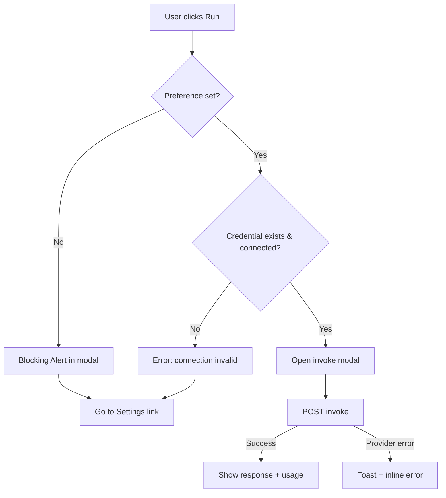

# System Agents — UI/UX Design Specification

**Status:** Draft for engineering handoff  
**Related PRD:** [`prd.md`](./prd.md)  
**Related specs:** [Agent Management](../agent-management/design.md) · [AI Integrations](../ai-integrations/design.md) · [User Settings](../user-settings/design.md)  
**Design system:** [Synthetic Luminal](/.cursor/rules/design.md) · Theme tokens: `ui/system-design/theme/src/tokens/`

---

## 1. Design Rationale

System Agents introduce a **governed, globally shared catalog** that end users consume read-only while admins publish and maintain definitions. The UI must make three truths obvious at a glance:

1. **Platform agents are not yours** — they are curated, shared, and immutable for non-admins.
2. **Your credentials power invocations** — platform rules run on the user's chosen AI connection, never on embedded platform keys.
3. **System agents live alongside personal agents** — consolidated in the same unified `/agents` view with clear visual distinction and role-based admin controls.

Visual language follows **The Synthetic Luminal**: tonal stacking on dark surfaces, glassmorphic modals, restrained primary accent (blue gradient CTAs), semantic success/warning/error only for status. Platform Agents use a **single consistent badge treatment** (`Platform Agent`) rather than a third neon accent — category differentiation comes from label + icon on tonal backgrounds.

**Phasing alignment**

|| Phase | UI deliverable |
||-------|----------------|
|| 1 | System agents consolidated with user agents on `/agents` |
|| 2 | Connection preference in Settings + first-credential toast |
|| 3 | Invoke modal/page + test invoke for admins |
|| 4 | Admin editing & management features |

---

## 2. Information Architecture & Routes

System agents are now fully integrated with user agents on a single screen, providing a unified experience.

|| Audience | Route | Purpose |
||----------|-------|---------|
|| User | `/agents` | **Unified agents page**: Platform Agents section + My Agents + AI integrations |
|| Admin | `/agents` | **Same route**: System agents management controls embedded within Platform Agents section (admin-only) |
|| User | `/settings#ai-connections` | **Use for system agents** connection selector |
|| Invoke surface | Modal from catalog | Modal from Platform Agents section; mirrors personal agent invoke when available |
|| Non-authenticated | `/login` | Auth required for all agent features |

**Navigation**

- **User drawer:** **Agents** item → `/agents` is the single entry point for all agent features and management (both users and admins).
- **Agents page layout (unified):** 
  - **Platform Agents section** at the top (read-only for users, admin-managed for admins)
  - **My Agents section** below (user-created agents)
  - **AI Integrations section** at the bottom
- **Admin management**: Create, edit, archive, restore, and test invoke actions are conditionally rendered within the Platform Agents section and only visible to admin users.
- **Settings anchor:** Add `#ai-connections` to settings IA for connection preference management.

**Auth gates**

```tsx
// All agents routes use existing auth-only pattern
<ProtectedAuthRoute requireAuthenticated redirectPath="/login?returnUrl=..." />

// Admin-specific controls within /agents are conditionally rendered based on user role
{isAdmin && (
  <>
    <CreateAgentButton />
    <EditActions />
    <ArchiveActions />
  </>
)}
```

---

## 3. Wireframes & Flow Diagrams

### 3.1 Unified agents page — `/agents` (desktop, for admin)

```
┌──────────────────────────────────────────────────────────────────────────────┐
│  Agents                                                                       │
│  Connect AI integrations and run agents with your credentials.                │
│                                                                               │
│  ═══ PLATFORM AGENTS ═══════════════════════════════════════════════════════  │
│  [ Platform Agent ]  Governed agents provided by your organization             │
│  [⚙️ Admin controls]  (Create Agent, Search, Filters for admin users only)     │
│                                                                               │
│  [🔍 Search platform agents…]  [Status ▼] [Category ▼]  [ Create Agent ]   │
│                                                                               │
│  ┌─────────────────────┐  ┌─────────────────────┐  ┌─────────────────────┐   │
│  │ [Platform Agent]    │  │ [Platform Agent]    │  │                     │   │
│  │ Code Review Assist  │  │ Onboarding Guide      │  │  (empty slot)       │   │
│  │ Coding              │  │ Onboarding            │  │                     │   │
│  │ Reviews PRs for…    │  │ Helps new users…      │  │                     │   │
│  │  [ Run ] [Edit]     │  │  [ Run ] [Edit]       │  │                     │   │
│  │  [Archive/Restore]  │  │  [Archive/Restore]    │  │                     │   │
│  └─────────────────────┘  └─────────────────────┘  └─────────────────────┘   │
│                                                                               │
│  ═══ MY AGENTS ═════════════════════════════════════════════════════════════  │
│  (existing AgentList table — Create Agent, filters, edit/delete)              │
│                                                                               │
│  ═══ AI INTEGRATIONS ═══════════════════════════════════════════════════════  │
│  (existing AiIntegrationsSection)                                             │
└──────────────────────────────────────────────────────────────────────────────┘
```

**Mobile (<768px):** Platform Agents section uses single-column card layout. Admin controls (Edit, Archive) appear inline on each card or in a card header overflow menu. Toolbar stacks: Create full-width, then search, then filter row.

**User view (same route):** Identical layout but without admin controls. Cards show only Run button.

### 3.2 Admin management within Platform Agents

Admin users see conditional controls integrated into the Platform Agents section:

- **Create System Agent button** in the toolbar (top-right, next to search)
- **Edit, Test, Archive/Restore actions** appear on each card as a menu or inline buttons
- **Search, Status filter, Category filter** available to all users

Clicking **Create Agent** or **Edit** opens a modal or inline form (per design decision).

### 3.3 User agents page — `/agents` with Platform Agents (user view)

```
┌──────────────────────────────────────────────────────────────────────────────┐
│  Agents                                                                       │
│  Connect AI integrations and run agents with your credentials.                │
│                                                                               │
│  ═══ PLATFORM AGENTS ═══════════════════════════════════════════════════════  │
│  [ Platform Agent ]  Governed agents provided by your organization             │
│                                                                               │
│  [🔍 Search platform agents…]                                                  │
│                                                                               │
│  ┌─────────────────────┐  ┌─────────────────────┐  ┌─────────────────────┐   │
│  │ [Platform Agent]    │  │ [Platform Agent]    │  │                     │   │
│  │ Code Review Assist  │  │ Onboarding Guide      │  │  (empty slot)       │   │
│  │ Coding              │  │ Onboarding            │  │                     │   │
│  │ Reviews PRs for…    │  │ Helps new users…      │  │                     │   │
│  │        [ Run ]      │  │        [ Run ]        │  │                     │   │
│  └─────────────────────┘  └─────────────────────┘  └─────────────────────┘   │
│                                                                               │
│  ═══ MY AGENTS ═════════════════════════════════════════════════════════════  │
│  (existing AgentList table — Create Agent, filters, edit/delete)              │
│                                                                               │
│  ═══ AI INTEGRATIONS ═══════════════════════════════════════════════════════  │
│  (existing AiIntegrationsSection)                                             │
└──────────────────────────────────────────────────────────────────────────────┘
```

**List vs cards:** Platform Agents use **3-column card grid** on desktop (read-only cards for users, admin-managed cards for admins). Mobile: single-column cards.

### 3.4 Settings — connection preference

**Placement decision:** Add subsection within **Settings** scroll page at `#ai-connections` **and** retain manage-integrations entry on `/agents`. Settings subsection is the **canonical preference control**; `/agents` AI integrations section links to it.

```
┌─ Settings ──────────────────────────────────────────────────────────────────┐
│  AI Connections                                              (#ai-connections) │
│  Manage credentials and choose which connection powers platform agents.        │
│                                                                                │
│  Use for system agents *                                                       │
│  [  My OpenAI Production (ChatGPT)                              ▼ ]            │
│  Platform agents run using this connection and your API keys.                  │
│  Only one connection is used at a time.                                        │
│                                                                                │
│  Connection status: ● Connected                                                │
│                                                                                │
│  [ Manage all integrations → ]          [ Save ]                             │
│                                                                                │
│  ── Empty state (no credentials) ──                                          │
│  Create your first AI connection to use system agents.                         │
│  [ Add AI connection ]  → /agents/ai-integrations/create                       │
└────────────────────────────────────────────────────────────────────────────────┘
```

### 3.5 Invoke modal (Phase 3)

```
        ╔══════════════════════════════════════════════════════════╗
        ║  Run platform agent                              [ × ]    ║
        ║  Code Review Assistant                                    ║
        ║  [Platform Agent] · Coding                              ║
        ║  ─────────────────────────────────────────────────────── ║
        ║  Reviews pull requests for style, safety, and clarity.   ║
        ║                                                          ║
        ║  Your message *                                          ║
        ║  [  Paste code or describe what to review…            ]  ║
        ║                                                          ║
        ║  Connection                                              ║
        ║  My OpenAI Production (ChatGPT) · Connected              ║
        ║  [ Change in Settings ]                                  ║
        ║                                                          ║
        ║  ── Admin test only ──                                   ║
        ║  Debug connection override                               ║
        ║  [ Select credential…                                 ▼ ]  ║
        ║                                                          ║
        ║  [ Cancel ]                              [ Run ]           ║
        ╚══════════════════════════════════════════════════════════╝

        ── During invoke ──
        [ Neural Pulse loader ]  Running Code Review Assistant…
        [ streaming response area — AI bubble, secondary-container gradient ]

        ── After invoke ──
        Response text…
        Usage: 120 prompt · 80 completion tokens · gpt-4
        [ Run again ]  [ Close ]
        Admin only: [ Change connection & re-run ]
```

### 3.6 Flow diagrams

**Admin create → publish (from `/agents`)**

```mermaid
flowchart TD
  A[/agents - Platform Agents section] --> B[Click Create System Agent]
  B --> C[Open create modal or form]
  C --> D{Client validation}
  D -->|Invalid| C
  D -->|Valid| E[POST /api/system-agents]
  E -->|409 name conflict| F[Inline error on Name]
  F --> C
  E -->|Success| G[Toast: System agent created]
  G --> A
```

**User first credential → invoke-ready**

```mermaid
flowchart TD
  A[No credentials] --> B[/agents/ai-integrations/create]
  B --> C[Create + test connection]
  C --> D[POST credential + auto-set preference]
  D --> E[Toast + optional CTA]
  E --> F{User choice}
  F -->|See system agents| G[/agents#platform-agents]
  F -->|Dismiss| H[Stay on integrations]
  G --> I[Run platform agent]
  I --> J{Preference valid?}
  J -->|Yes| K[Invoke modal → success]
  J -->|No| L[Error + link Settings]
```

**Invoke pre-checks**



---

## 4. Component Specifications

### 4.1 New components (app-local, `apps/web/app/`)

|| Component | Location | Props / API | States |
||-----------|----------|-------------|--------|
|| `PlatformAgentsSection` | `agents/_components/` | `{ isAdmin?, onEditClick? }` | loading, empty, filtered-empty, populated |
|| `PlatformAgentCard` | same | `{ agent: SystemAgentCatalogDto, onRun, onEdit?, onArchive?, isAdmin?, isInvokeEnabled? }` | default, hover, focus, disabled |
|| `PlatformAgentBadge` | same | `{ size?: 'small' \| 'medium' }` | — |
|| `SystemAgentConnectionPreference` | `settings/_components/` | `{ subjectUserId }` | loading, empty, saving, saved, error |
|| `SystemAgentCreateModal` | `agents/_components/` | `{ open, onClose, onSubmit, isSubmitting? }` | open/closed, submitting, error |
|| `SystemAgentEditModal` | same | `{ open, agent?, onClose, onSubmit, onArchive?, isSubmitting? }` | open/closed, submitting, archived-readonly |
|| `SystemAgentArchiveDialog` | same | `{ name, open, onClose, onConfirm, isConfirmBusy? }` | open/closed, busy |
|| `SystemAgentRestoreDialog` | same | Same shape as archive | open/closed, busy |
|| `SystemAgentTestInvokeDialog` | same | `{ agent, open, onClose }` — admin only | idle, invoking, streaming, success, error |

### 4.2 Extended / reused components

|| Component | Source | Adaptation |
||-----------|--------|------------|
|| `Card` / grid layout | `@vassembly/ui-card` | Platform Agents card display |
|| `TextField`, `Dropdown` | system-design | Form fields |
|| `Tag` | `@vassembly/ui-tag` | Category, status, Platform Agent badge |
|| `Modal` | `@vassembly/ui-modal` | Archive, restore, invoke, create, edit, test invoke |
|| `Snackbar` | `@vassembly/ui-snackbar` | All success/error toasts |
|| `Alert` | `@vassembly/ui-alert` | Invoke blocking states, errors |
|| `Loader` | `@vassembly/ui-loader` | Section/form loading |
|| `IntegrationCredentialPicker` | `agents/_components/` | **Extend** with `label`, `helperText`, `manageHref` props for settings + admin override |
|| `ConnectionStatusBadge` | ai-integrations | Show status beside selected preference |
|| `Button` (with dropdown menu) | system-design | Admin actions menu on cards |

### 4.3 Platform Agent card anatomy

```
┌ surface-container-high ────────────────────────┐
│ [Platform Agent tag]                    (⋮ or x) │
│ Title (Space Grotesk, title-md)                │
│ [Category badge]                               │
│ Description snippet (2 lines, body-sm, muted)  │
│                                    [ Run ]     │
│ (Admin: [Edit] [Archive/Restore] [Test])       │
└────────────────────────────────────────────────┘
```

- **No edit/delete overflow menu for users** — Run is the only action.
- **Admin users see additional actions**: Edit, Test invoke, Archive/Restore.
- **Run button**: primary gradient; disabled with tooltip when connection preference missing.
- Card is **not** a link; Run is the primary action. Optional: entire card clickable to open detail drawer (Phase 2+).

### 4.4 Admin actions visibility

Admin controls are embedded within the Platform Agents section and conditionally rendered:

| Action | Trigger | Scope |
|--------|---------|-------|
| Create System Agent | Button in toolbar | Platform Agents header |
| Edit | Button/menu on card | Per-card |
| Test invoke | Button/menu on card | Per-card (modal) |
| Archive | Button/menu on card | Per-card (confirmation) |
| Restore | Button/menu on card (archived agents) | Per-card (confirmation) |

---

## 5. Interaction Patterns

### 5.1 Modals

|| Modal | Size | Initial focus | Close |
||-------|------|---------------|-------|
|| Create agent | `md` | Name field | ESC, backdrop, Cancel |
|| Edit agent | `md` | Name field | same |
|| Archive | `sm` | Cancel | ESC, backdrop, Cancel |
|| Restore | `sm` | Cancel | same |
|| Test invoke (admin) | `lg` | Message field | same |
|| User invoke | `lg` | Message field | same; warn if response in progress |

All modals: `role="dialog"`, `aria-modal="true"`, glass panel (`surface-variant` + blur 20px), focus trap, return focus to trigger.

### 5.2 Forms

- **Create/Edit:** Modal or inline form — compact form for quick creation/updates.
- **Dirty state:** No unsaved guard on Cancel (PRD parity with agents).
- **Validation:** On blur + on submit. Submit disabled when invalid or submitting.

### 5.3 Search & filters

|| Surface | Search | Filters | Sort |
||---------|--------|---------|------|
|| Platform catalog | Debounced 300ms, name only (no rule) | Status (admin), Category | Name asc (default) |

Clear search: × in field; "No matches" empty state with **Clear search** link.

### 5.4 Toasts

|| Event | Variant | Message | Duration |
||-------|---------|---------|----------|
|| Admin create | success | System agent created. | 4s |
|| Admin update | success | System agent updated. | 4s |
|| Admin archive | success | Platform agent archived. | 4s |
|| Admin restore | success | Platform agent restored. | 4s |
|| Preference save | success | System agent connection updated. | 4s |
|| First credential | success | This connection will be used for platform agents. You can change this in Settings. | 6s, dismissible |
|| Invoke success | success | Response ready. | 4s (optional if inline result) |
|| Generic API error | error | Server message or fallback | 5s, dismissible |

Use `role="alert"` for errors, `role="status"` for success.

### 5.5 Admin test invoke

- Trigger: **Test** action from card menu or button.
- Opens `SystemAgentTestInvokeDialog` with:
  - Read-only agent summary
  - Message field (required)
  - **Connection override** dropdown — admin's own credentials only (MVP); label: **Debug connection override**
  - Run → streams or shows spinner → result + usage
- Non-admin: control not rendered; API returns 403 if tampered.

---

## 6. Copy & Microcopy

### 6.1 Page titles & section headers

|| Location | Copy |
||----------|------|
|| Platform section overline | PLATFORM AGENTS |
|| Platform section title | Platform Agents |
|| Platform section intro | Governed agents provided by your organization. They run using your AI connection. |
|| Admin info banner | Platform agents are visible to all signed-in users. Only admins can create, edit, or archive them. |
|| My Agents section | My Agents |
|| Settings section | AI Connections |
|| Settings subsection label | Use for system agents |
|| Invoke modal title | Run platform agent |

### 6.2 Buttons & links

|| Action | Label |
||--------|-------|
|| Create CTA | Create System Agent |
|| Submit create | Create System Agent |
|| Submit edit | Save changes |
|| Archive | Archive |
|| Restore | Restore |
|| Test | Test invoke |
|| User run | Run |
|| Invoke submit | Run |
|| Settings save | Save |
|| Manage integrations | Manage all integrations |
|| Go to settings (error) | Go to Settings |
|| Add connection (empty) | Add AI connection |
|| First-time CTA | See platform agents |
|| First-time skip | Dismiss |

### 6.3 Help text

|| Context | Copy |
||---------|------|
|| Name helper | Must be unique across active platform agents (max 100 characters). |
|| Rule helper | System prompt applied when users run this agent. Not shown in the public catalog list. |
|| Description helper | Optional. Shown in the platform agent catalog (max 500 characters). |
|| Category helper | Helps users filter agents in the catalog. |
|| Connection preference | Platform agents run using this connection and your API keys. |
|| Single-choice note | Only one connection is used at a time. |
|| Invoke connection row | Uses your saved system agent connection. |
|| Admin override helper | For debugging only. Uses your credential, not end-user keys. |

### 6.4 Badges

|| Badge | Visible text | Tag variant |
||-------|--------------|-------------|
|| Platform Agent | Platform Agent | `primary` outline or tonal primary |
|| Category coding | Coding | `default` + icon |
|| Category utility | Utility | `default` + icon |
|| Category onboarding | Onboarding | `default` + icon |
|| Category compliance | Compliance | `default` + icon |
|| Status active | Active | `success` |
|| Status archived | Archived | `warning` |
|| Status disabled | Disabled | `default` |

### 6.5 Error & validation messages

|| Code / case | Field / surface | Message |
||-------------|-----------------|---------|
|| Name required | Name | Name is required. |
|| Name too long | Name | Name must be at most 100 characters. |
|| Name duplicate | Name | An agent with this name already exists. |
|| Rule required | Rule | Prompt is required. |
|| Rule too long | Rule | Prompt must not exceed 5000 characters. |
|| Description too long | Description | Description must be at most 500 characters. |
|| Category invalid | Category | Select a valid category. |
|| No preference | Invoke modal | Please select an AI connection for system agents in Settings before invoking. |
|| Invalid credential | Invoke modal | Your system agent connection is no longer valid. Please select a new one in Settings. |
|| Credential failed | Invoke modal | Your system agent connection isn't working. Test the connection or choose another in Settings. |
|| Archived agent invoke | Invoke | This platform agent is no longer available. |
|| List fetch error | Alert | Couldn't load system agents. Try again. |
|| Catalog fetch error | Alert | Couldn't load platform agents. Try again. |
|| Provider timeout | Invoke | The AI provider took too long. Try again. |

### 6.6 Empty states

|| Surface | Headline | Body | CTA |
||---------|----------|------|-----|
|| Admin creates first agent | No system agents yet | Create the first platform agent for your users. | Create System Agent |
|| Search no matches | No platform agents match your search | — | Clear search |
|| User catalog (none) | No platform agents are available right now | Check back later or contact your administrator. | — |
|| Settings (no credentials) | No AI connections yet | Create your first AI connection to use system agents. | Add AI connection |

### 6.7 Confirmation dialogs

**Archive**

- Title: Archive platform agent?
- Body: Archive **"{name}"**? Users will no longer see or invoke it. You can restore it later.
- Actions: Cancel · Archive (danger)

**Restore**

- Title: Restore platform agent?
- Body: Restore **"{name}"**? It will appear in the platform catalog again.
- Actions: Cancel · Restore (primary)

---

## 7. First-Time User Flow

### Step-by-step

|| Step | Screen | What happens |
||------|--------|--------------|
|| 1 | `/agents` | User sees Platform Agents section with Run disabled or pre-check message if no credentials |
|| 2 | `/agents/ai-integrations/create` | User completes integration form + test connection |
|| 3 | Success | Backend creates credential **and** sets `userSystemAgentPreferences` to new id (atomic or immediate follow-up) |
|| 4 | Toast | **This connection will be used for platform agents. You can change this in Settings.** |
|| 5 | Toast actions | Primary: **See platform agents** → `/agents#platform-agents`; Text: **Dismiss** |
|| 6 | Redirect | **No forced redirect** — stay on integration success path unless user clicks CTA; toast alone is sufficient per PRD |
|| 7 | `/agents#platform-agents` | User can Run immediately without visiting Settings |

**Design note:** Do not show first-time toast on subsequent credential creates — only when preference was previously unset.

---

## 8. Error Handling & Edge Cases (10 scenarios)

|| # | Scenario | Visual treatment |
||---|----------|------------------|
|| 1 | Duplicate name on create | Inline error on Name field + `aria-invalid`; submit stays enabled after fix |
|| 2 | Empty rule on submit | Inline error under Rule; focus first invalid field |
|| 3 | Rule > 5000 chars | Inline error + counter turns error color at limit |
|| 4 | No connection preference on Run | Invoke modal replaced by blocking `Alert` (warning) with **Go to Settings** link; no message field |
|| 5 | Preference points to deleted credential | Same as #4 with **invalid connection** copy; Settings link |
|| 6 | Credential `connectionStatus: failed` | Alert in invoke modal above Run; Run disabled until user fixes in Settings |
|| 7 | Non-admin views admin controls | Admin controls hidden via conditional rendering; no 403 page needed |
|| 8 | Session expired on admin save | Redirect login with `returnUrl`; toast optional on return |
|| 9 | Catalog agent archived mid-session | Run returns 404 → toast **This platform agent is no longer available**; remove card on list refresh |
|| 10 | Provider timeout on invoke | Inline error in modal + retry Run; partial stream cleared; no success toast |

**Admin archive active agent:** Allowed (PRD default) — no usage-count gate in UI; confirm dialog only.

---

## 9. Accessibility Checklist

- [ ] **Page structure:** One `h1` per page; Platform Agents section uses `h2`; My Agents remains `h2`
- [ ] **Section labels:** `aria-labelledby` on catalog and list regions
- [ ] **Platform Agent badge:** Not color-only — includes text "Platform Agent"
- [ ] **Info banner:** `role="note"` or `region` with accessible name
- [ ] **Forms:** All fields have visible labels; `aria-required` on required fields
- [ ] **Errors:** `aria-invalid` + `aria-describedby` linking to error text ids
- [ ] **Connection picker:** Label **Use for system agents** read by screen readers; announces selected credential + provider
- [ ] **Invoke modal:** Focus trap; initial focus on message field when valid; loading announces `aria-busy`
- [ ] **Streaming response:** `aria-live="polite"` region for new tokens
- [ ] **Toasts:** Errors use `role="alert"`; success `role="status"`; pause on hover/focus
- [ ] **Keyboard:** Run buttons activatable via Enter/Space; modals ESC to close
- [ ] **Focus order:** Platform Agents section appears **before** My Agents in tab order (matches visual order)
- [ ] **Contrast:** Badge text ≥ 4.5:1 on tonal backgrounds; error text on `error_container` wash
- [ ] **Touch targets:** Action buttons and Run ≥ 44×44px hit area
- [ ] **Reduced motion:** Respect `prefers-reduced-motion` for Neural Pulse loader — static spinner fallback

---

## 10. Design System Consistency

|| Pattern | Application |
||---------|-------------|
|| Surfaces | Page `surface`; toolbars `surface-container`; cards `surface-container-high` |
|| No divider lines | Separate Platform vs My Agents with `spacing-8` + overline label (`label-sm`, tracked, primary) |
|| Primary CTA | Gradient Run / Create buttons |
|| Secondary | Glass Cancel / Manage links |
|| Modals | Glass + blur 20px; max-width invoke `lg` ~640px |
|| Motion | 300–500ms transitions; modal enter 400ms |
|| Typography | Space Grotesk: page titles, agent names, dates, token counts; Inter: body, helpers |
|| Two-accent rule | Primary blue for CTAs + Platform badge; secondary/sage only for AI response bubbles in invoke |
|| Icons | `primary_fixed_dim` for category icons; gear/settings for admin controls |

Align with existing `sectionCard`, `toolbarRow`, `filtersGroup` SCSS from `apps/web/app/agents/_components/`.

---

## 11. Admin vs User View Comparison

|| Aspect | Admin | End user |
||--------|-------|----------|
|| Route | `/agents` | `/agents` (same route) |
|| Nav visibility | Agents only (unified) | Agents only (unified) |
|| Platform section | Full controls: Create, Edit, Archive, Restore, Test | Read-only cards + Run |
|| Data shown | Full list incl. archived; audit ids; **rule** on edit | Active catalog only; **no rule** in list; description snippet |
|| Create/edit | Yes (modal/form) | No |
|| Archive/restore | Yes | No |
|| Test invoke + override | Yes (modal) | No |
|| Run / invoke | Yes (with override option) | Yes (preference only) |
|| Connection picker context | Debug override in test modal | Read-only in invoke; change via Settings |
|| Badges | Status (Active/Archived/Disabled) | Platform Agent + category |
|| Empty copy | No system agents yet | No platform agents are available right now |

---

## 12. Component Reuse Plan

### Reuse as-is

|| Asset | Path |
||-------|------|
|| Card layout | `@vassembly/ui-card` |
|| Modal shell | `@vassembly/ui-modal` |
|| Snackbar | `@vassembly/ui-snackbar` |
|| TextField, Dropdown, Button, Text, Alert, Loader, Tag | system-design packages |
|| `sectionCard` / toolbar layout | `agents/_components/*/styles.module.scss` |
|| `ConnectionStatusBadge` | `ai-integrations/.../ConnectionStatusBadge.tsx` |
|| `ProtectedAuthRoute` | `apps/web/lib/auth/` |

### Extend (minor props)

|| Component | Change |
||-----------|--------|
|| `IntegrationCredentialPicker` | Add optional `label`, `helperText`, `manageButtonText`, `manageHref`, `showManageButton` |
|| Settings page | New `#ai-connections` anchor + `SystemAgentConnectionPreference` section |

### New builds

|| Component | Reason |
||-----------|--------|
|| `PlatformAgentsSection` | Read-only and admin-managed catalog UX |
|| `PlatformAgentCard` | Card layout + Run + admin actions |
|| `SystemAgentCreateModal` | Create form in modal |
|| `SystemAgentEditModal` | Edit form in modal |
|| `SystemAgentTestInvokeDialog` | Admin override + invoke streaming |
|| `SystemAgentConnectionPreference` | Settings-specific save + empty state |

### API hooks (`ui/api-hooks`)

Add: `useSystemAgentCatalog`, `useSystemAgentConnectionPreference`, `useSystemAgentInvoke`, `useCreateSystemAgent`, `useUpdateSystemAgent`, etc. — mirror existing agent hook patterns.

---

## 13. Responsive Behavior

|| Breakpoint | Platform Agents | My Agents | Settings |
||------------|-----------------|-----------|----------|
|| ≥1024px | 3-column card grid | Table | Two-column; preference in main column |
|| 768–1023px | 2-column grid | Table horizontal scroll | Single column |
|| <768px | 1-column cards; stacked toolbar | Stacked cards | Single column; full-width Save |

Admin actions stack or collapse into menu on mobile.

---

## 14. Developer Handoff Notes

1. **Feature flags:** Gate catalog (`system_agents_catalog_enabled`), preference (`system_agents_preference_enabled`), invoke (`system_agents_invoke_enabled`) independently per PRD §9.
2. **Dual fetch on `/agents`:** Call `GET /api/system-agents/catalog` and existing agents list in parallel; do not merge API responses in UI state — render two sections.
3. **Hash anchor:** `#platform-agents` on `/agents` for first-time CTA deep link; apply `scroll-margin-top` for fixed header.
4. **Rule visibility:** Omit `rule` from catalog list DTO; show in admin edit and optionally in invoke modal footer as collapsible "Agent instructions" (admin-only preview) — **default hidden for users**.
5. **Admin role detection:** Use JWT `role` claim or app context to conditionally render admin controls; no separate route required.
6. **Tests:** Follow Vitest black-box patterns from `AgentList.test.tsx`, `AgentForm.test.tsx`.
7. **Operator role:** When shipped, operator sees same catalog as user; hide all admin UI — no separate design.

### Implementation order

1. `PlatformAgentsSection` on `/agents` (read-only catalog for all users)
2. Connection preference in Settings + first-credential toast hook in integration create page
3. Invoke modal + streaming (user + admin test modes)
4. Admin controls: Create, Edit, Archive, Restore, Test within Platform Agents section

---

## 15. Open Design Decisions (resolved for build)

|| Question | Decision |
||----------|----------|
|| Admin UI location | Embedded within `/agents` Platform Agents section — no separate admin route |
|| Catalog layout | Card grid for platform agents on desktop; flexible for mobile |
|| Settings vs agents for preference | **Settings** is canonical; invoke shows read-only + link |
|| First credential redirect | Toast + optional CTA only — no auto-redirect |
|| Form interaction | Create/Edit in modals (compact) vs dedicated pages (reviewable) — **TBD by PM** |
|| Rule in user detail | Omit from list; full description only; rule not exposed to users in MVP |
|| Unified routing | Single `/agents` route for all users and admins; role-based UI conditionals |

---

*End of design spec — ready for architecture review and frontend implementation.*
