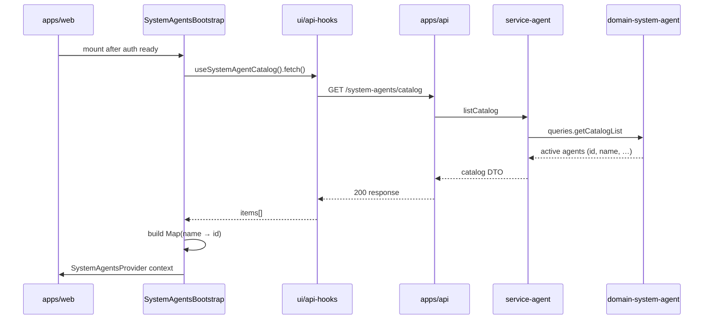
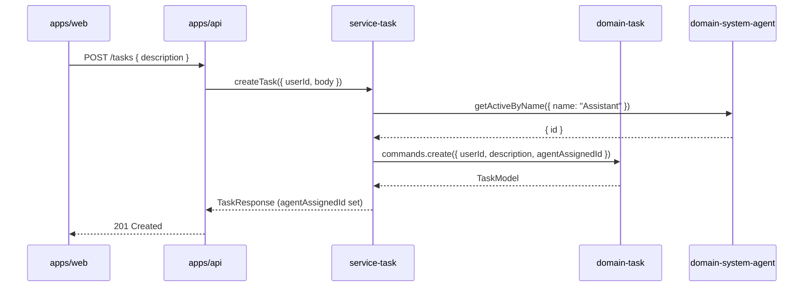
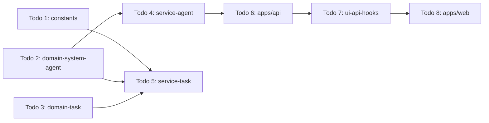

# Task Agent Assignment — Architecture

**Status:** Engineering handoff  
**Last updated:** 2026-05-29  
**Related:** [Task Domain](../task-domain/architecture.md) · [System Agents](../system-agent/architecture.md)

---

## Analysis

### Existing infrastructure (reuse)

| Layer | What exists | Gap for this feature |
|-------|-------------|------------------------|
| `@vassembly/domain-system-agent` | CRUD, admin list, `getActiveById`, `assertUniqueActiveName` | No `getActiveByName`, no `getCatalogList`, no user catalog DTO |
| `@vassembly/service-agent` | Admin system-agent handlers | No `listCatalog` handler |
| `@vassembly/domain-task` | `commands.create`, `agentAssignedId` on model | Command hardcodes `agentAssignedId: null`; input has no agent field |
| `@vassembly/service-task` | `createTask` handler | No cross-domain lookup |
| `apps/api` | Admin `GET /system-agents`, GraphQL `systemAgents` (admin-only) | No user `GET /system-agents/catalog` |
| `ui/api-hooks` | Admin `useSystemAgents` (GraphQL) | No catalog hook for authenticated users |
| `apps/web` | `SessionBootstrap` + `UserAuthProvider` pattern | No system-agent bootstrap/cache |
| `packages/constants` | Shared enums (`AUTH_TOKEN_ROLE`) | No `SystemAgentName` enum |

### Key decisions

1. **Data source for frontend cache:** REST `GET /system-agents/catalog` (already specced in [system-agent architecture](../system-agent/architecture.md), not yet implemented). Do **not** use admin GraphQL `systemAgents` — it requires admin role and returns audit fields.

2. **GraphQL for system agents?** No. Reads use GraphQL per convention, but the system-agent feature already standardizes user-facing reads on REST catalog routes. Adding a parallel GraphQL query would duplicate the catalog and diverge from the existing system-agent plan.

3. **Who assigns the Assistant agent on create?** **Backend only** (`@vassembly/service-task`). The frontend cache is for display/resolution elsewhere in the UI lifecycle, not for sending `agentAssignedId` on `POST /tasks`. This prevents client tampering and keeps assignment logic in one place.

4. **Static name enum:** Add `SystemAgentName` to `@vassembly/constants` (shared FE/BE), starting with `Assistant = 'Assistant'`. Admin-created agents must use names matching enum values (case-insensitive match at query layer, same as `assertUniqueActiveName`).

5. **No new packages.** Extend existing domain, services, API, hooks, and web app.

### Librarian findings incorporated

- `@vassembly/service-agent` owns system-agent orchestration — add `listCatalog` there, not a new service.
- `@vassembly/service-task` should depend on `@vassembly/domain-system-agent` directly for name lookup (service-layer cross-domain composition).
- `getCatalogList` is documented in domain README but **not implemented** — implement the minimal catalog slice needed for bootstrap.
- Platform agents UI today uses admin-only hooks; app-wide bootstrap needs authenticated-user catalog.

---

## Architecture & Package Placement

### Data flow — system agent cache (frontend)



### Data flow — task creation with assignment (backend)



### Layer responsibilities

| Package | Responsibility |
|---------|----------------|
| `packages/constants` | `SystemAgentName` enum |
| `domains/system-agent` | `getActiveByName`, `getCatalogList`, catalog DTO mapper |
| `services/agent` | `listCatalog` handler |
| `services/task` | Orchestrate Assistant lookup + task create |
| `domains/task` | Accept `agentAssignedId` on create command |
| `apps/api` | `GET /system-agents/catalog` route (before `/:id`) |
| `ui/api-hooks` | `useSystemAgentCatalog`, HTTP client for catalog |
| `apps/web` | `SystemAgentsBootstrap`, `SystemAgentsProvider`, wire into `providers.tsx` |

---

## Recommendation

**Most conservative approach:** Implement the smallest missing catalog slice from the system-agent architecture (domain query + service handler + REST route + hook), add a focused `getActiveByName` domain query for backend assignment, and extend task create end-to-end. Frontend builds the name→ID map from catalog response items — no separate id-map endpoint.

**Why this reduces complexity:**

- Reuses specced catalog API instead of inventing a one-off endpoint.
- Backend assignment avoids FE changes to `useCreateTask` / `POST /tasks` body.
- `SessionBootstrap` pattern is proven in the codebase for app-load initialization.
- Single enum in `@vassembly/constants` gives type-safe names on both sides.

**Trade-offs:**

| Choice | Benefit | Cost |
|--------|---------|------|
| Backend assignment | Single source of truth, secure | Requires Assistant agent seeded in DB |
| Catalog vs dedicated id-map | Reusable for future UI | Slightly more payload than `{ name: id }` only |
| Context in `apps/web` vs `ui/user-auth` | Keeps auth package focused | Cache not reusable by other apps without extraction |
| Fail create if Assistant missing | Matches "automatically assign" intent | Ops must ensure agent exists |

**Failure mode when Assistant agent is missing:** `createTask` throws `NotFoundError` → API returns `404` or maps to `422` with stable code. Task is **not** created with `null` — assignment is required behavior.

---

## Implementation Steps

### Phase 1 — Shared constants

1. Add `packages/constants/src/systemAgentName.ts`:

```typescript
export enum SystemAgentName {
  Assistant = 'Assistant',
}
```

2. Export from `packages/constants/src/index.ts`.

3. Add unit test validating enum string values (optional, mirrors `authTokenRole` pattern if tests exist).

**Prerequisite:** Admin must create an active system agent named `"Assistant"` (case-insensitive) before task creation succeeds in non-dev environments.

---

### Phase 2 — Domain extensions (`@vassembly/domain-system-agent`)

#### 2a. `getActiveByName` query

| File | Purpose |
|------|---------|
| `domains/system-agent/src/queries/getActiveByName/index.ts` | Lookup active agent by name (case-insensitive) |
| `domains/system-agent/src/queries/getActiveByName/types.ts` | Input/output types |
| `domains/system-agent/src/queries/getActiveByName/index.test.ts` | Black-box tests |

Reuse:
- `ACTIVE_SYSTEM_AGENT_FILTER` from `queries/shared/activeSystemAgentFilter.ts`
- `escapeRegex` + case-insensitive `$regex` from `assertUniqueActiveName`

Return: internal `SystemAgentModel` (or `{ data: SystemAgentModel }`) — used by service-task, not exposed to clients directly.

Throw `throwSystemAgentNotFoundError()` when no active match.

#### 2b. Catalog query + DTO (minimal slice)

| File | Purpose |
|------|---------|
| `domains/system-agent/src/model/dto.ts` | Add `SystemAgentCatalogListItem` (`id`, `name`, `description?`, `category?`) |
| `domains/system-agent/src/model/toCatalogResponse.ts` | `toCatalogListItem` mapper (omit rule, audit fields) |
| `domains/system-agent/src/queries/getCatalogList/index.ts` | Active agents list (paginated; default fetch all for bootstrap) |
| `domains/system-agent/src/queries/getCatalogList/types.ts` | Query input/output |
| `domains/system-agent/src/queries/getCatalogList/index.test.ts` | Tests |

Export new queries from `domains/system-agent/src/queries/index.ts`.

Update `domains/system-agent/README.md` with new queries.

---

### Phase 3 — Service layer

#### 3a. `@vassembly/service-agent` — `listCatalog`

| File | Purpose |
|------|---------|
| `services/agent/src/handlers/listCatalog/index.ts` | Call `queries.getCatalogList`, map to catalog DTOs |
| `services/agent/src/handlers/listCatalog/types.ts` | Handler I/O types |
| `services/agent/src/handlers/listCatalog/index.test.ts` | Mock domain, validate output |
| `services/agent/src/handlers/index.ts` | Export `listCatalog` |

#### 3b. `@vassembly/service-task` — extend `createTask`

| File | Change |
|------|--------|
| `services/task/package.json` | Add `@vassembly/domain-system-agent`, `@vassembly/constants` |
| `services/task/src/handlers/createTask/index.ts` | Lookup `SystemAgentName.Assistant`, pass `agentAssignedId` |
| `services/task/src/handlers/createTask/index.test.ts` | Mock system-agent query; assert `agentAssignedId` forwarded |
| `services/task/README.md` | Document Assistant assignment behavior |

Handler logic (pseudocode):

```typescript
import { SystemAgentName } from '@vassembly/constants';
import systemAgentDomain from '@vassembly/domain-system-agent';

const assistant = await systemAgentDomain.queries.getActiveByName({
  name: SystemAgentName.Assistant,
});

const result = await taskDomain.commands.create({
  userId,
  description: body.description,
  agentAssignedId: assistant.data.id,
});
```

---

### Phase 4 — Domain task command extension

| File | Change |
|------|--------|
| `domains/task/src/commands/create/types.ts` | Add `agentAssignedId?: string \| null` to `CreateTaskCommandInput` |
| `domains/task/src/commands/create/index.ts` | Pass through `agentAssignedId` (default `null` if omitted for backward compat) |
| `domains/task/src/commands/create/index.test.ts` | Test with explicit `agentAssignedId` |
| `domains/task/README.md` | Update defaults documentation |

---

### Phase 5 — API gateway

| File | Change |
|------|--------|
| `apps/api/src/routes/system-agents/listCatalog.ts` | **New** — `GET /catalog`, `authorizeRequest` (any authenticated user) |
| `apps/api/src/routes/system-agents/index.ts` | Register `listCatalog` **before** `getById` (route ordering) |
| `apps/api/src/routes/tasks/create.test.ts` | Integration test: created task has non-null `agentAssignedId` when Assistant exists |
| `apps/api/README.md` | Document catalog route |

No change to `POST /tasks` request body — assignment remains server-side.

---

### Phase 6 — Frontend hooks (`@vassembly/ui-api-hooks`)

| File | Purpose |
|------|---------|
| `ui/api-hooks/src/systemAgents/http/listCatalog.ts` | `GET /system-agents/catalog` |
| `ui/api-hooks/src/systemAgents/types.ts` | Add catalog response types (or extend existing) |
| `ui/api-hooks/src/systemAgents/useSystemAgentCatalog.ts` | Fetch hook with `fetch()`, `data`, `isLoading`, `error` |
| `ui/api-hooks/src/systemAgents/index.ts` | Export new hook |
| `ui/api-hooks/src/index.ts` | Re-export if needed |
| `ui/api-hooks/src/systemAgents/useSystemAgentCatalog.test.ts` | Hook behavior tests |

Pattern: mirror `useSystemAgents` lazy fetch style, but use **HTTP** (REST) not GraphQL.

Optional helper (same package):

```typescript
// ui/api-hooks/src/systemAgents/buildSystemAgentIdMap.ts
export const buildSystemAgentIdMap = (
  items: Array<{ id: string; name: string }>,
): ReadonlyMap<string, string> => new Map(items.map((a) => [a.name, a.id]));
```

---

### Phase 7 — Web app cache (`apps/web`)

#### 7a. Context + bootstrap

| File | Purpose |
|------|---------|
| `apps/web/lib/systemAgents/types.ts` | Context value: `idMap`, `getSystemAgentId(name)`, `isLoading`, `error` |
| `apps/web/lib/systemAgents/SystemAgentsContext.tsx` | React context definition |
| `apps/web/lib/systemAgents/SystemAgentsProvider.tsx` | Provider holding `Map<string, string>` state |
| `apps/web/lib/systemAgents/useSystemAgentsCache.ts` | Consumer hook |
| `apps/web/lib/systemAgents/SystemAgentsBootstrap.tsx` | Fetch catalog when auth ready; populate provider |
| `apps/web/app/providers.tsx` | Nest `SystemAgentsProvider` + `SystemAgentsBootstrap` after `SessionBootstrap` |

Bootstrap sequence:

1. Wait for `UserAuthProvider.bootstrapLoading === false`.
2. If `isAuthenticated`, call `useSystemAgentCatalog().fetch()`.
3. Build `Map<string, string>` from `items` (key = agent `name`, value = `id`).
4. Store in context for app lifecycle (no refetch unless explicit refresh added later).
5. If unauthenticated, skip fetch; expose empty map.

Mirror `SessionBootstrap.tsx` structure (`useRef` guard, effect on auth state).

#### 7b. No changes required for task creation UI

`apps/web/app/_components/TaskInputComposer/useTaskInput.ts` and `ui/api-hooks/src/tasks/useCreateTask.ts` remain unchanged — backend assigns agent.

Cache becomes available for future UI (e.g., task detail showing agent name, invoke flows).

---

## Todo Plan

1. **`@vassembly/constants`** — [Type: utility extension]
   - Changes needed: Add `SystemAgentName` enum with `Assistant`
   - Files: `packages/constants/src/systemAgentName.ts`, `packages/constants/src/index.ts`
   - Suggested subagent workflow: coder → Done
   - Dependencies: None

2. **`@vassembly/domain-system-agent`** — [Type: domain extension]
   - Changes needed: `getActiveByName` query, catalog DTO + `getCatalogList` query
   - Files: `domains/system-agent/src/queries/getActiveByName/**`, `domains/system-agent/src/queries/getCatalogList/**`, `domains/system-agent/src/model/dto.ts`, `domains/system-agent/src/model/toCatalogResponse.ts`, `domains/system-agent/src/queries/index.ts`, `domains/system-agent/README.md`
   - Suggested subagent workflow: unit-test-writer → coder ↔ code-reviewer (max 2) → documentation-writer
   - Dependencies: Todo 1 (enum used in tests/docs only; domain stays name-agnostic)

3. **`@vassembly/domain-task`** — [Type: domain extension]
   - Changes needed: Accept `agentAssignedId` on create command
   - Files: `domains/task/src/commands/create/types.ts`, `domains/task/src/commands/create/index.ts`, `domains/task/src/commands/create/index.test.ts`, `domains/task/README.md`
   - Suggested subagent workflow: unit-test-writer → coder → Done
   - Dependencies: None (can parallel with Todo 2)

4. **`@vassembly/service-agent`** — [Type: service extension]
   - Changes needed: `listCatalog` handler
   - Files: `services/agent/src/handlers/listCatalog/**`, `services/agent/src/handlers/index.ts`
   - Suggested subagent workflow: unit-test-writer → coder ↔ code-reviewer (max 2) → documentation-writer
   - Dependencies: Todo 2 (`getCatalogList`)

5. **`@vassembly/service-task`** — [Type: service extension]
   - Changes needed: Assistant lookup + pass `agentAssignedId` on create
   - Files: `services/task/package.json`, `services/task/src/handlers/createTask/index.ts`, `services/task/src/handlers/createTask/index.test.ts`, `services/task/README.md`
   - Suggested subagent workflow: unit-test-writer → coder ↔ code-reviewer (max 2) → documentation-writer
   - Dependencies: Todo 1, Todo 2 (`getActiveByName`), Todo 3 (create command accepts field)

6. **`@vassembly/api` (`apps/api`)** — [Type: app extension]
   - Changes needed: `GET /system-agents/catalog` route; update task create integration tests
   - Files: `apps/api/src/routes/system-agents/listCatalog.ts`, `apps/api/src/routes/system-agents/index.ts`, `apps/api/src/routes/tasks/create.test.ts`, `apps/api/README.md`
   - Suggested subagent workflow: coder → Done
   - Dependencies: Todo 4

7. **`@vassembly/ui-api-hooks`** — [Type: UI package extension]
   - Changes needed: Catalog HTTP client + `useSystemAgentCatalog` hook + id-map builder
   - Files: `ui/api-hooks/src/systemAgents/http/listCatalog.ts`, `ui/api-hooks/src/systemAgents/useSystemAgentCatalog.ts`, `ui/api-hooks/src/systemAgents/buildSystemAgentIdMap.ts`, `ui/api-hooks/src/systemAgents/types.ts`, `ui/api-hooks/src/systemAgents/index.ts`
   - Suggested subagent workflow: unit-test-writer → coder → Done
   - Dependencies: Todo 6 (route must exist for integration; can stub in tests)

8. **`@vassembly/web` (`apps/web`)** — [Type: app extension]
   - Changes needed: System agents bootstrap + context; wire into providers
   - Files: `apps/web/lib/systemAgents/**`, `apps/web/app/providers.tsx`
   - Suggested subagent workflow: coder → Done
   - Dependencies: Todo 7

---

## Parallelization



- **Parallel track A:** Todo 1 + Todo 2 + Todo 3
- **Parallel track B (after A):** Todo 4 + Todo 5
- **Sequential:** Todo 6 → Todo 7 → Todo 8

---

## Files summary (create / modify)

### Create

| Path |
|------|
| `packages/constants/src/systemAgentName.ts` |
| `domains/system-agent/src/queries/getActiveByName/index.ts` |
| `domains/system-agent/src/queries/getActiveByName/types.ts` |
| `domains/system-agent/src/queries/getActiveByName/index.test.ts` |
| `domains/system-agent/src/queries/getCatalogList/index.ts` |
| `domains/system-agent/src/queries/getCatalogList/types.ts` |
| `domains/system-agent/src/queries/getCatalogList/index.test.ts` |
| `domains/system-agent/src/model/toCatalogResponse.ts` |
| `services/agent/src/handlers/listCatalog/index.ts` |
| `services/agent/src/handlers/listCatalog/types.ts` |
| `services/agent/src/handlers/listCatalog/index.test.ts` |
| `apps/api/src/routes/system-agents/listCatalog.ts` |
| `ui/api-hooks/src/systemAgents/http/listCatalog.ts` |
| `ui/api-hooks/src/systemAgents/useSystemAgentCatalog.ts` |
| `ui/api-hooks/src/systemAgents/buildSystemAgentIdMap.ts` |
| `apps/web/lib/systemAgents/types.ts` |
| `apps/web/lib/systemAgents/SystemAgentsContext.tsx` |
| `apps/web/lib/systemAgents/SystemAgentsProvider.tsx` |
| `apps/web/lib/systemAgents/useSystemAgentsCache.ts` |
| `apps/web/lib/systemAgents/SystemAgentsBootstrap.tsx` |

### Modify

| Path |
|------|
| `packages/constants/src/index.ts` |
| `domains/system-agent/src/model/dto.ts` |
| `domains/system-agent/src/queries/index.ts` |
| `domains/system-agent/README.md` |
| `domains/task/src/commands/create/types.ts` |
| `domains/task/src/commands/create/index.ts` |
| `domains/task/src/commands/create/index.test.ts` |
| `domains/task/README.md` |
| `services/task/package.json` |
| `services/task/src/handlers/createTask/index.ts` |
| `services/task/src/handlers/createTask/index.test.ts` |
| `services/task/README.md` |
| `services/agent/src/handlers/index.ts` |
| `apps/api/src/routes/system-agents/index.ts` |
| `apps/api/src/routes/tasks/create.test.ts` |
| `apps/api/README.md` |
| `ui/api-hooks/src/systemAgents/types.ts` |
| `ui/api-hooks/src/systemAgents/index.ts` |
| `apps/web/app/providers.tsx` |

### Unchanged (by design)

| Path | Reason |
|------|--------|
| `ui/api-hooks/src/tasks/useCreateTask.ts` | Backend assigns agent; no body change |
| `apps/api/src/routes/tasks/create.ts` | Thin adapter; no new fields |
| `apps/api/src/graphql/resolvers/systemAgent.ts` | Admin GraphQL unchanged |

---

## Operational note

Ensure an active system agent named **Assistant** exists in `systemAgents` collection before enabling task creation in an environment. Consider a seed script or admin setup checklist. Without it, `POST /tasks` will fail at the Assistant lookup step.
