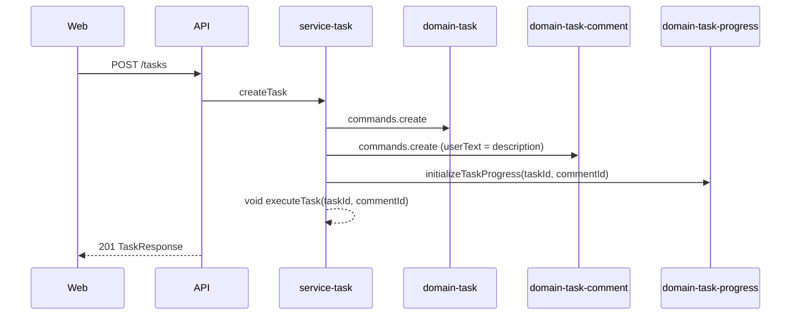
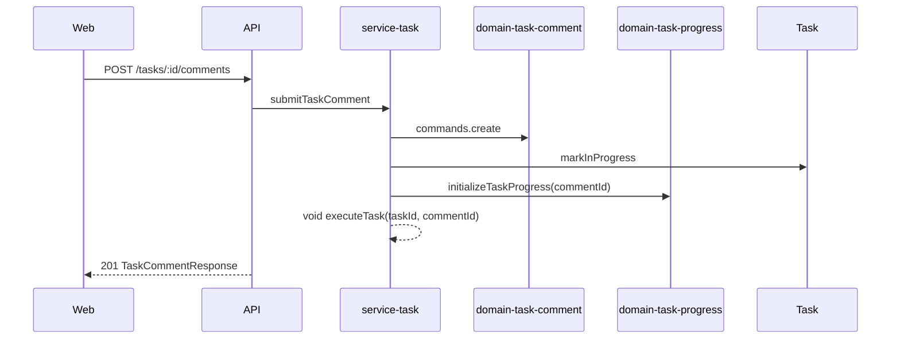
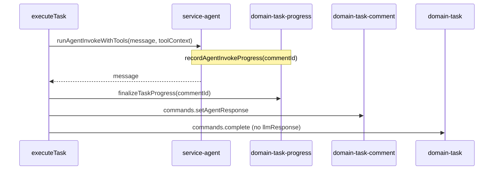

# Task Comment Conversation — Architecture

**Status:** Engineering handoff  
**Last updated:** 2026-07-23 (activity feed UX revision)  
**Feature slug:** `task-comment-conversation`  
**Related:** [PRD](./prd.md) · [UI design](./ui-design.md) · [Async LLM Task Execution](../async-llm-task-execution/architecture.md) · [Real-Time Execution Progress](../real-time-execution-progress/architecture.md) · [Pause, Resume, and Retry](../pause-resume-task/prd.md)

---

## Analysis

### Reuse vs new

| Layer | Reuse | New / change |
|-------|-------|----------------|
| `domains/task` | create, complete/fail, lifecycle | Remove `llmResponse`; `complete` no longer stores agent text |
| `domains/task-comment` | — | **New package** — comment CRUD, list by taskId, `setAgentResponse` |
| `domains/task-progress` | Event model, record/finalize | **Breaking:** scope by `commentId`; queries/commands keyed by comment |
| `domains/task-questions` | pending/answered model | Add `commentId` on ask + answer |
| `services/task` | `executeTask`, create/retry/resume | `commentId` through execution; conversation message builder; `submitTaskComment`; `getTaskActivityTimeline` |
| `services/agent` | `runAgentInvokeWithTools`, tools | Pass `commentId` in `toolContext` when recording questions/progress |
| `apps/api` | task routes/resolvers | REST `POST …/comments`; GraphQL `activityTimeline`; deprecate task-only progress read |
| `ui/api-hooks` | task detail hooks | Timeline query; submit comment mutation (REST) |
| `apps/web` | detail page shell | `TaskActivityFeed`, `TaskActivityFilter`, `TaskExecutionStatistics`, `TaskCommentComposer` |
| `ui/execution-progress-tracker` | polling, `ProgressHeader`, modal | Inline expand rows; export statistics panel; **remove modal** on task detail; poll by `commentId`; **descending** sort |

### Domain isolation

Domains do **not** import each other. **Activity timeline assembly** lives in `services/task` (or `apps/api` GraphQL resolver calling a single service handler) and composes:

- `taskComment` queries  
- `taskProgress` queries (by task or by comment list)  
- `taskQuestions` queries  

---

## Architecture Overview

### End-to-end: create task



### End-to-end: follow-up comment



### Complete turn



---

## Data Model

### `@vassembly/domain-task-comment` (new)

**Collection:** `taskComments`

| Field | Type |
|-------|------|
| `id` | string |
| `taskId` | string |
| `userId` | string |
| `userText` | string |
| `agentResponse` | string \| null |
| `createdAt`, `updatedAt` | Date |

**Commands:** `create`, `setAgentResponse` (zod max 5000 on agent text)  
**Queries:** `getById`, `getModelById`, `listByTaskId` (asc `createdAt`)

### `@vassembly/domain-task-progress` (breaking)

| Before | After |
|--------|--------|
| One doc per `taskId` (unique index on `taskId`) | One doc per **`commentId`** (unique index on `commentId`) |
| `getModelByTaskId` | `getModelByCommentId`; optional `listByTaskId` for timeline builder |
| `initializeTaskProgress({ taskId, userId })` | `initializeTaskProgress({ taskId, userId, commentId })` |
| `recordProgressEvent({ taskId, … })` | `recordProgressEvent({ commentId, … })` |
| `resetTaskProgress({ taskId })` | `resetTaskProgress({ commentId })` |
| `finalizeTaskProgress({ taskId })` | `finalizeTaskProgress({ commentId })` |

**Migration:** No backfill of `llmResponse`. Existing progress documents keyed only by `taskId` may be **orphaned**; acceptable per PRD (no migration). New executions always use `commentId`.

### `@vassembly/domain-task`

- Remove `llmResponse` from model, DTO, GraphQL, mappers, `complete` schema.
- `complete({ taskId })` — status + `completedAt` only.

### `@vassembly/domain-task-questions`

- Add `commentId: string` to `PendingQuestion` and `AnsweredQuestion`.
- When agent tool asks question: set `commentId` from `toolContext.commentId`.
- `submitAnswer` preserves `commentId` on answered record.

---

## Execution (`executeTask`)

### Signature

```typescript
export interface ExecuteTaskParams {
  taskId: string;
  userId: string;
  commentId: string;
  mode?: TaskExecutionMode;
}
```

All callers (`createTask`, `submitTaskComment`, `resumeTask`, `retryTask`) must pass **`commentId`**:

| Caller | `commentId` |
|--------|-------------|
| `createTask` | First comment created in same handler |
| `submitTaskComment` | New comment id |
| `resumeTask` | Active comment (latest without `agentResponse`, or task field `activeCommentId` — see below) |
| `retryTask` | Same comment as paused/failed turn; `resetTaskProgress(commentId)` |

**Recommendation:** Add optional `activeCommentId` on `TaskModel` set when a turn starts, cleared on complete/fail — simplifies resume/retry and HITL. Alternative: derive as latest comment where `agentResponse == null` (fragile if fail leaves null).

### Agent message (`Fresh` mode)

Replace `task.description`-only message with **`buildConversationMessage`** in `services/task`:

1. Load `listByTaskId` comments ascending.
2. For each prior comment with `agentResponse`: append user/assistant turns.
3. Current comment: use `userText` as latest user message.

Keep `task.description` for classification/title handlers only.

### Agent message (`Resume` mode)

Unchanged semantics: `buildResumeMessage` + events from **`getModelByCommentId(activeCommentId)`** + answered questions filtered by `commentId` (or all answered with matching `commentId`).

### Progress recording

`createRecordAgentInvokeProgress({ taskId, userId, commentId })` → domain `recordProgressEvent({ commentId, … })`.

### Complete

```typescript
await taskCommentDomain.commands.setAgentResponse({ commentId, agentResponse: invokeResult.message });
await taskDomain.commands.complete({ taskId });
```

### Tool context

Extend `toolContext` in `runAgentInvokeWithTools` with `commentId: string` for question + progress tools.

---

## Activity timeline (`getTaskActivityTimeline`)

**Location:** `services/task/src/handlers/getTaskActivityTimeline/`

**Input:** `{ taskId, userId }` (ownership check via task query)

**Algorithm:**

1. Load comments for `taskId` (ordered).
2. For each comment:
   - Emit `userComment` at `createdAt`.
   - Load progress doc by `commentId`; emit each event as `progressEvent` at `event.timestamp`.
   - Load answered questions where `commentId` matches; emit `hitlAnswered` at `answeredAt`.
   - If `agentResponse` set: emit `agentResponse` at `updatedAt` (or dedicated `completedAt` on comment if added).
3. Sort all emitted items by **`occurredAt` descending**, then `sortKey` descending (newest first).

Each item includes **`filterGroup`** for client multiselect (UI design §3.3):

| `filterGroup` | Item kinds |
|---------------|------------|
| `comments` | `userComment` |
| `responses` | `agentResponse` |
| `questions` | `hitlAnswered` |
| `agentStarted` | `progressEvent` where `state` is started |
| `agentFinished` | `progressEvent` where `state` is completed |
| `agentFailed` | `progressEvent` where `state` is failed |
| `agentWaiting` | `progressEvent` where `state` is waiting |

Progress events MUST include full detail payload needed for **inline expand** (fields today shown in `ProgressDetailModal`).

**GraphQL:** Union type `TaskActivityItem` with `__typename`, `occurredAt`, `filterGroup`; expose as `Task.activityTimeline` on detail query only (not on list). Filtering is client-side in v1.

---

## API Gateway

### REST (commands)

| Method | Path | Handler |
|--------|------|---------|
| `POST` | `/tasks/:taskId/comments` | `submitTaskComment` |

Zod body: `{ userText: string.min(1) }`. Reject if task status is `in-progress` or `paused`.

### REST (reads)

| Change | Detail |
|--------|--------|
| `GET /tasks/:taskId/progress` | **Remove** or redirect to deprecated; use comment-scoped route |
| `GET /tasks/:taskId/comments/:commentId/progress` | Optional if web polls REST; prefer GraphQL nested `comment.progress` |

### GraphQL (reads)

- Remove `llmResponse` from `Task`.
- Add `TaskComment` type + `task(id) { comments { … } activityTimeline { … } }`.
- Pending questions: existing field on task detail query.

---

## Frontend

### `ui/api-hooks`

- `getTaskQuery`: add `activityTimeline` selection; remove `llmResponse`.
- `useSubmitTaskComment`: REST POST wrapper.
- Types: `TaskActivityItem` union mapped in `mapTaskActivityTimeline`.

### `apps/web`

Per [ui-design.md](./ui-design.md):

- `TaskActivityFeed`: unified list (comments, responses, HITL, all progress events); **newest first**; progress rows expand/collapse inline (no modal).
- `TaskActivityFilter`: multiselect on `filterGroup`; default all selected.
- `TaskExecutionStatistics`: former `ProgressHeader` metrics **below** the list.
- Poll active comment progress while `in-progress`; prepend new events to feed.
- Remove `TaskQuestionsHistory`, **`TaskDetailAiResponse` entirely**, page-level `ExecutionProgressTracker`.

### `ui/execution-progress-tracker`

- `useCommentProgressPolling({ taskId, commentId, enabled })`.
- Export `ProgressEventRow` with **inline expand** (replace `ProgressDetailModal` + `useModalState` for task detail).
- Export `TaskExecutionStatistics` (from `ProgressHeader` fields).
- `mergeTimelineItems` / activity sort: **descending** by timestamp.

---

## Implementation Phases (PR order)

| PR | Scope |
|----|--------|
| **1** | `domain-task-comment` + remove `llmResponse` from task domain |
| **2** | `domain-task-progress` commentId breaking change + service `executeTask` wiring |
| **3** | `domain-task-questions` `commentId` + agent tool context |
| **4** | `submitTaskComment`, `createTask` comment path, `getTaskActivityTimeline`, API |
| **5** | Web timeline + composer + api-hooks |
| **6** | E2E + doc cross-refs (`task-skill-planning`, `real-time-execution-progress`) |

---

## Testing

| Layer | Focus |
|-------|--------|
| `domain-task-comment` | create, setAgentResponse validation (5000) |
| `domain-task-progress` | unique `commentId`, reset per comment |
| `executeTask` | completes comment not task.llmResponse; Fresh uses conversation message |
| `getTaskActivityTimeline` | descending sort; all item types; `filterGroup` on each row |
| Web | filters, inline expand, show more, stats below list; no AI response component |

---

## Risks

| Risk | Mitigation |
|------|------------|
| Breaking progress API | Coordinate web + api-hooks in same PR as domain-progress |
| Active comment ambiguity on fail | Set `activeCommentId` on task or document “failed turn” comment explicitly |
| Large timelines | Paginate timeline in v2; v1 load all comments for task (acceptable for MVP) |

---

## Next workflow steps

1. **tdd-unit-test-writer** — failing tests per phase above  
2. **tdd-e2e-test-writer** — PRD Gherkin CC-* in `apps/web/e2e/features/task-comment-conversation/`  
3. **coder** — implement PR sequence  
4. **tester** → **code-reviewer** → **documentation-writer**
