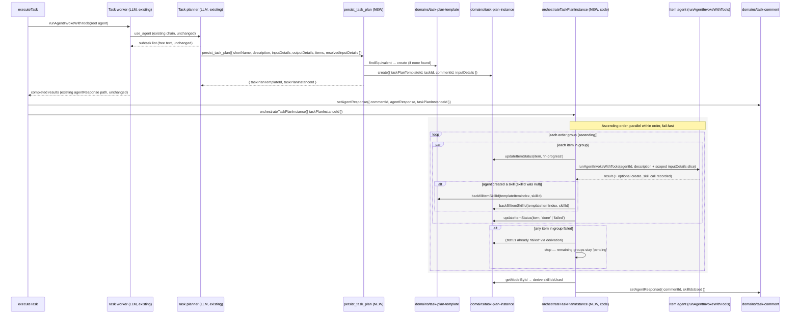
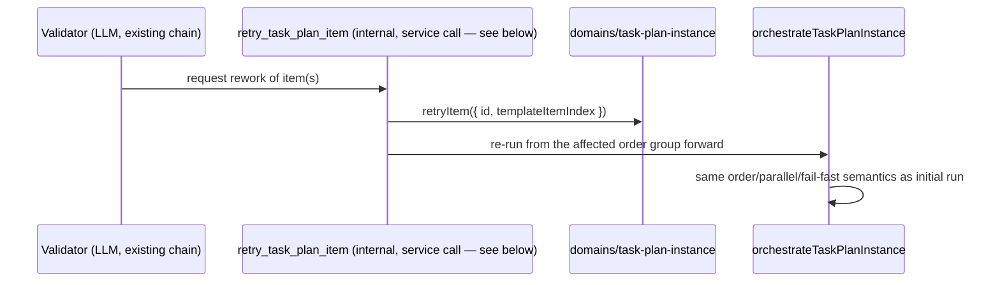

# Persisted Task Plans (Template + Instance) — Architecture

**Feature slug:** `task-plan`
**Status:** Proposed — ready for implementation
**Reference architectures:** [`task-skill-planning/architecture.md`](../task-skill-planning/architecture.md) · [`subagent-orchestration/architecture.md`](../subagent-orchestration/architecture.md) · [`agent-internal-tools/architecture.md`](../agent-internal-tools/architecture.md) · [`skill/architecture.md`](../skill/architecture.md) · [`system-agent/architecture.md`](../system-agent/architecture.md)
**Inputs:** [PRD](./prd.md) (approved, Q6/Q11/Q14 resolved) · [UI design spec](./ui-design.md)

This document **extends** `task-skill-planning/architecture.md` and `subagent-orchestration/architecture.md`. Those docs kept the entire orchestration protocol as free-text `agentPrompt` strings with **zero persisted plan state** ("no new internal tools / Zod schemas / DB fields" — `subagent-orchestration/architecture.md` D-6). This PRD explicitly **narrows** that conclusion (PRD §12, D-13): the plan *shape* and *run state* now need durable, machine-consumable persistence and code-driven orchestration, while the rest of the researcher → planner → worker → validator prompt protocol is unchanged and reused as-is.

---

## Analysis

### Librarian findings (incorporated)

| Existing piece | Location | Reuse plan |
|---|---|---|
| `domains/task` | `domains/task/src/model/model.ts` | **Remove** `skillIdsUsed` field (FR-TM-1); `updateTask` command loses that arg |
| `domains/task-comment` | `domains/task-comment/src/{model,commands,queries}` | **Extend** — add `skillIdsUsed`, `taskPlanInstanceId`; follows existing `setAgentResponse`/`setSpecializationIds` command pattern |
| `domains/skill` | `domains/skill/src/queries/getById`, `getModelById` | Reused by both new domains to validate `skillId` references (service-layer lookups only, no cross-domain import) |
| `domains/system-agent` | `domains/system-agent/src/queries/getActiveById` (existing) | Reused to validate `agentId` at template-write time and to resolve agent identity for the orchestration loop invocation |
| `domains/task-progress` | `domains/task-progress/src/commands/recordProgressEvent` | Reused for plan-level start/complete/fail progress events (FR-OB-2) — no new progress domain |
| `services/task` — `executeTask` | `services/task/src/handlers/executeTask/index.ts` | **Extended** — after the root agent invocation, drive the new instance-orchestration loop when the comment produced a `taskPlanInstanceId` |
| `services/task` — `getTaskActivityTimeline` | `services/task/src/handlers/getTaskActivityTimeline/index.ts` | **Extended** — emit one `kind: 'plan'` item per comment that has a `taskPlanInstanceId` |
| `services/task` — `submitTaskComment` | `services/task/src/handlers/submitTaskComment/index.ts` | **Unchanged** — still just creates the comment and fires `executeTask`; no plan-specific wiring needed here |
| `services/agent` — `runAgentInvokeWithTools` | `services/agent/src/internalTools/runAgentInvokeWithTools.ts` | Reused directly (by `agentId`, not by name) for **both** the Task Planner/Worker/Validator hops (existing `use_agent` path) **and** the new instance-orchestration loop's per-item agent invocations |
| `services/agent` — `useAgent` / `resolveTarget` | `services/agent/src/internalTools/useAgent/` | **Not reused for plan-item execution** — `use_agent` resolves targets **by name**; plan items store `agentId` (MongoDB ID) per PRD §4.5. The orchestration loop calls `runAgentInvokeWithTools` directly with the denormalized `agentId`, mirroring how `executeTask` already invokes the root agent by ID |
| `services/agent` — `createSkill` internal tool | `services/agent/src/internalTools/createSkill/index.ts` | Reused unchanged — the worker agent assigned to a `skillId: null` item calls `create_skill` exactly as today; only the **backfill hook** after a successful call is new |
| `services/agent` — `buildTaskPlannerSkillsCatalogSection.ts` | `services/agent/src/internalTools/buildTaskPlannerSkillsCatalogSection.ts` | Unchanged — still injects the skill catalog into Task Planner's context |
| `packages/constants` — `INTERNAL_TOOLS` registry | `packages/constants/src/internalTools/registry.ts` | Extended with one new entry: `persist_task_plan` (Task Planner only) |
| `apps/api` — GraphQL reads | `apps/api/src/graphql/resolvers/task.ts`, `taskActivity.ts` | Extended: `taskComment.plan`, computed `task.skillIdsUsed`; timeline item shape extended with plan fields |
| `apps/api` — REST writes | `apps/api/src/routes/tasks/**` | **No new routes** — per PRD §8.2/§8.3, all template/instance writes are internal-tool/service-orchestration only; confirms API Calling Conventions rule (GraphQL reads / REST commands) by having **no public command surface at all** for this feature, not a REST/GraphQL mismatch |
| `apps/web` — `TaskActivityFeed`, `TaskActivityFeedItem` | `apps/web/app/tasks/[id]/_components/TaskActivityFeed/` | Extended with a new `kind === 'plan'` branch → `ActivityPlanRow` (new), following the existing `ActivityProgressEventRow` inline-expand pattern |
| `apps/web` — `TaskDetailSkillsUsed` / `LinkedSpecializations` | `apps/web/app/tasks/[id]/_components/TaskDetailSkillsUsed/`, `apps/web/app/_components/LinkedSpecializations/` | `LinkedSpecializations`' `Tag` + admin-`Link` pattern is extracted into the new shared `CommentSkillTags` component; `TaskDetailSkillsUsed` becomes a thin wrapper fed by the **computed** `task.skillIdsUsed` GraphQL field instead of the (removed) stored field |
| `ui/api-hooks` — `useTaskActivityTimeline`, `mapTaskActivityTimeline` | `ui/api-hooks/src/tasks/` | Extended: `TaskActivityItemDto` gains plan fields + `'plans'` filter group; `GET_TASK_ACTIVITY_TIMELINE_QUERY` gains the `plan { ... }` sub-selection |
| `ui/api-hooks` — `useLinkedSkills` | `ui/api-hooks/src/skills/useLinkedSkills.ts` | Reused as-is by `CommentSkillTags` (same batch-resolve-by-id hook already used by `TaskDetailSkillsUsed`) |

### What exists vs. what is new

| Area | Exists | New / changed |
|---|---|---|
| Ephemeral plan text in `agentResponse` | ✅ (Task Skill Planning) | **Removed** — `agentResponse` becomes post-work result only (FR-TP-2) |
| Researcher → planner → worker → validator prompt chain | ✅ (Subagent Orchestration) | **Unchanged** — Task Planner still produces a subtask list via free-text `agentPrompt`; this PRD adds a **persistence step immediately after** that chain, not a replacement for it |
| `task.skillIdsUsed` | ✅ (Task Skill Planning) | **Removed** from `domains/task`; **added** to `domains/task-comment`; **computed** on `Task` GraphQL type |
| `domains/task-plan-template` | ❌ | **New domain** |
| `domains/task-plan-instance` | ❌ | **New domain** |
| `persist_task_plan` internal tool | ❌ | **New** — Task Planner's only write path for plan persistence |
| Instance-orchestration loop | ❌ | **New** — code (not LLM prompt) inside `services/task`, invoked from `executeTask` |
| `backfillItemSkillId` (template + instance) | ❌ | **New commands**, invoked by the orchestration loop after `create_skill` succeeds on a null-`skillId` item |
| `retryItem` (instance) | ❌ | **New command**, invoked by the Validator's retry path |
| Activity timeline `plan` item kind | ❌ | **New** — `getTaskActivityTimeline` handler + GraphQL + UI |
| `CommentSkillTags` shared component | ❌ (logic exists inline in `TaskDetailSkillsUsed`/`LinkedSpecializations`) | **New** — extracted, reused by 3 activity card types + task-level aggregation |

### Design patterns applied

| Pattern | Where | Why |
|---|---|---|
| **Command** | `domains/task-plan-template/commands/*`, `domains/task-plan-instance/commands/*` | Each write (`create`, `backfillItemSkillId`, `updateItemStatus`, `retryItem`, `removeSoft`) is an encapsulated command module, matching every existing domain in the repo |
| **State** | `TaskPlanInstanceModel.status` / `TaskPlanInstanceItem.status` (`pending → in-progress → done/failed`) | Explicit status enum + a single derivation function (`deriveInstanceStatus`, a map/lookup over item states) rather than ad hoc branching scattered across callers — mirrors `subagent-orchestration`'s `STATUS: pass\|issues` State pattern for the Validator |
| **Strategy** | `deriveInstanceStatus` (`Record`-driven precedence: any `failed` → `failed`; all `done` → `done`; any `in-progress`/mixed → `in-progress`; else `pending`) | Pure function, no `switch`/`if-else` chain, testable in isolation — matches `code-rules-general.mdc` "map object instead of switch case" |
| **Mediator** | Instance-orchestration loop in `services/task/src/handlers/executeTask/orchestrateTaskPlanInstance/` | The loop is the single coordinator invoking N item-agents via `runAgentInvokeWithTools`; items never invoke each other directly — same role the Task Worker already plays one level up in `subagent-orchestration` |
| **Facade** | `persist_task_plan` internal tool handler | Hides "find-or-create template" + "create instance" behind one call for Task Planner, exactly like `invoke_skill_planner` hides Skill Planner + script creators + `create_skill` behind one call |
| **Chain of Responsibility** | Orchestration loop's `order`-group iteration (`groupItemsByOrder` → sequential `for` over groups, `Promise.all` within a group) | Each order group only proceeds once the previous group's promises all settle — same fixed-pipeline shape as the existing Task Worker → Researcher → Planner → Worker → Validator chain, just data-driven instead of prompt-driven |
| **Decorator** | `formatPlanEntrySection` (new, optional) appended to Task Planner's context when a matching template is found | Follows the same section-composition style as `buildSystemAgentSystemMessage`'s existing Decorator (`formatSubagentOutputPolicySection`, etc.) — additive, not exclusive branching |
| **Adapter** | `toTaskPlanTemplateItemPublicView` / `toTaskPlanInstanceItemPublicView` mappers resolving `agentName`/`skillName` for GraphQL | Adapts internal ID-only storage to the read-shape the UI needs, isolated in the domain mapper layer (not in the resolver) per `domain-package-structure.mdc` |

### Test strategy

- **Unit tests** (`tdd-unit-test-writer`): both new domains' commands/queries (especially `deriveInstanceStatus`, `retryItem` idempotency, `backfillItemSkillId`), the orchestration loop's order-grouping and fail-fast logic, `findEquivalent` matching, `getTaskActivityTimeline` plan-item emission, GraphQL resolver field wiring, `CommentSkillTags`/`ActivityPlanRow` component logic (`getPlanStatusSummary`, `getPlanItemStatusDisplay`).
- **E2E / acceptance** (`tdd-e2e-test-writer`): PRD §5 Gherkin scenarios `UI-1`–`UI-5` map directly to `apps/web` user-facing flows (Plan feed item, skill tag scoping, admin vs. regular-user links) — write failing Playwright BDD features under `apps/web/e2e/features/task-plan/` before UI implementation. Orchestration scenarios (`EXE-1`–`EXE-5`, `TPT-*`, `TPI-*`) are backend/domain-level and are covered by unit + service integration tests, not E2E (no deterministic way to drive real LLM planning output in Playwright).

---

## Architecture & Package Placement

```
domains/task-plan-template/          ← NEW domain — generic, reusable plan shape
domains/task-plan-instance/          ← NEW domain — per-(taskId, commentId) run state
domains/task-comment/                ← EXTENDED — skillIdsUsed, taskPlanInstanceId fields
domains/task/                        ← EXTENDED (field removal) — drop skillIdsUsed
domains/skill/                       ← UNCHANGED — referenced by ID only
domains/system-agent/                ← UNCHANGED — referenced by ID only
domains/task-progress/               ← UNCHANGED — existing comment-scoped progress events reused

packages/constants/                  ← EXTENDED — one new INTERNAL_TOOLS entry (persist_task_plan)
packages/client-langchain/           ← EXTENDED — persistTaskPlanSchema (Zod)

services/agent/                      ← EXTENDED — persistTaskPlan internal tool handler;
                                        backfill hook wired into the orchestration loop, not into create_skill itself
services/task/                       ← EXTENDED — executeTask gains post-planning orchestration step;
                                        getTaskActivityTimeline emits `plan` items

apps/api/                            ← EXTENDED — GraphQL: TaskPlanTemplate/Instance types,
                                        taskComment.plan, computed task.skillIdsUsed;
                                        NO new REST routes (writes are internal-tool/service-only)

ui/api-hooks/                        ← EXTENDED — timeline DTO + query, useLinkedSkills reused
apps/web/                            ← EXTENDED — ActivityPlanRow + subcomponents, CommentSkillTags,
                                        filter group, page.tsx wiring
```

### Data flow

```
Task Planner (LLM, use_agent hop)
   │  produces subtask list (unchanged, free text)
   ▼
persist_task_plan (NEW internal tool, service-layer handler)
   │  find-or-create template  +  create instance
   ▼
domains/task-plan-template / domains/task-plan-instance  (NEW domains)
   │
   ▼
executeTask orchestration loop (NEW, services/task)         ─┐
   │  per order-group: runAgentInvokeWithTools(agentId)       │ code-driven, not LLM-driven
   │  updateItemStatus / backfillItemSkillId / retryItem      │
   ▼                                                          ┘
taskComment.agentResponse (unchanged path)      taskComment.plan (NEW read via taskPlanInstanceId)
   │                                                    │
   ▼                                                    ▼
apps/api GraphQL (reads)                    apps/api GraphQL (reads)
   │                                                    │
   ▼                                                    ▼
apps/web ActivityAgentResponse              apps/web ActivityPlanRow (NEW)
```

**No cross-domain imports.** `task-plan-instance` never imports `task-plan-template` — the service-layer orchestration loop reads both by ID and passes data between them, per `domain-package-structure.mdc`'s domain isolation rule. Both new domains validate `agentId`/`skillId` via **service-layer queries** against `domains/system-agent`/`domains/skill`, never via direct domain-to-domain imports (mirrors FR-TPT-3's "checked at the service layer, not via domain cross-import").

---

## Recommendation

**Most conservative approach:** two new domains (unavoidable — templates and instances are genuinely new persisted entities with their own lifecycle, not extensions of `task`/`task-comment`/`skill`/`system-agent`), one new internal tool (`persist_task_plan`), and one new **code** orchestration loop inside the existing `executeTask` handler. Everything else — the Task Planner/Worker/Validator LLM chain, `use_agent`, `create_skill`, comment-scoped progress, the activity feed's item-type extension point — is reused unchanged.

**Why new domains are justified (per the Domain Creation Decision Framework):**
- `task-plan-template` and `task-plan-instance` are distinct business entities with their own lifecycle (template: created once, backfilled, soft-deletable; instance: created per comment turn, mutated through execution states) — they don't fit as fields on `task`, `task-comment`, or `skill`.
- They depend on **multiple** other domains for validation (`system-agent`, `skill`) — per the framework, this is itself a signal they're correctly placed as domains (not fields on an existing one) with validation composed at the **service** layer, exactly as `FR-TPT-3` specifies.
- They do **not** depend back on any domain that would create a cycle — `task-plan-template`/`task-plan-instance` are leaf domains referenced by ID from `task-comment`, never the reverse.

**Why the orchestration loop is code, not a new prompt-only step:** Unlike `subagent-orchestration`'s conclusion (protocol carried as `agentPrompt` strings, no DB state), this PRD's own decisions (D-6 ordering, D-7 failure propagation, D-14 backfill, EXE-1..EXE-5) require **deterministic, testable, replayable state transitions** — "0 cases of an order-N item starting before order-(N-1) completes" (§1.3 metric) cannot be guaranteed by an LLM's own reasoning the way the existing validator retry loop's *count* can be. This is the one deliberate, narrow exception to "no new DB fields for orchestration," exactly as PRD D-13 states.

**Trade-offs considered:**

| Decision | Choice | Alternative rejected |
|---|---|---|
| Orchestration owner | New code loop in `services/task` (`executeTask` extension), invoked after the Task Worker/Planner LLM chain returns | Keep orchestration inside the Task Worker's own LLM reasoning (as `subagent-orchestration` does for the validator retry loop) — rejected: PRD requires machine-verifiable ordering/parallelism/fail-fast guarantees an LLM call cannot deterministically provide (§1.3 "Orchestration correctness" metric) |
| Item agent invocation | Orchestration loop calls `runAgentInvokeWithTools` directly with the item's denormalized `agentId` | Have the loop emit `use_agent` tool calls by agent **name** | rejected — plan items store MongoDB IDs (D-3), and `use_agent`'s `resolveTarget` only resolves by name; forcing a name round-trip would require a redundant name lookup with no benefit |
| Template/instance validation | Service-layer queries (`systemAgentDomain.queries.getActiveById`, `skillDomain.queries.getById`) called from the **internal tool handler**, not from inside the new domains' commands | Cross-domain import from `task-plan-template` into `system-agent`/`skill` — rejected, violates domain isolation |
| Backfill trigger point | Orchestration loop detects a `create_skill` call result for a null-`skillId` item and calls `backfillItemSkillId` on both domains | Have `create_skill`'s tool handler itself know about plan items — rejected, keeps `create_skill` domain-agnostic and reusable outside plan execution (it's also called directly by Skill Planner) |
| `findEquivalent` algorithm (OQ-1) | Exact `shortName` match **plus** a normalized-description hash (whitespace/case-folded, hashed) as a secondary exact-match key — no embeddings/semantic search in v1 | Semantic/embedding similarity — rejected as over-engineering for v1; no embedding infra exists in any current domain, and PRD accepts "best-effort, not exact-match guaranteed" (FR-TPT-7) with rare-race duplicates as acceptable |
| Per-item invocation payload (OQ-2) | Orchestration loop builds a **scoped slice** of `instance.inputDetails` per item, keyed by the template item's declared slot references (see `resolveItemInputSlice` below) — not the whole `inputDetails` blob | Pass the entire `instance.inputDetails` to every item's agent — rejected, leaks unrelated resolved values into unrelated agents' context and bloats prompts as plans grow |
| Comment-level retry vs. instance retry (OQ-3) | A comment-level retry (Pause/Resume/Retry) for a comment that already has a `taskPlanInstanceId` **resets the same instance** (all items → `pending`, `retryCount` unchanged for a full-comment retry) rather than creating a new instance | Create a new instance per comment-level retry — rejected, violates PRD's explicit "commentId is unique across all taskPlanInstance documents" (TPI-1) and D-5 "mutate existing instance" |
| `pending`-item retry (OQ-4) | `retryItem` always increments `retryCount`, even on an already-`pending` item, for audit completeness | True no-op with no counter change — rejected per PRD's own Edge Cases table, which already assumes "always increment" |
| Concurrency on `updateItemStatus` (OQ-5) | **Single-writer orchestration loop** — the loop is the only caller of `updateItemStatus`/status derivation, and same-order items' `Promise.all` results are folded into one sequential `updateItemStatus` call per settled item before the group is considered complete; no distributed lock or optimistic-concurrency token needed | DB-level optimistic locking (`updatedAt` compare-and-swap) — rejected as unnecessary complexity; there is exactly one process (the `executeTask` invocation for that comment) that ever writes to a given instance, so a race is architecturally impossible, not just statistically unlikely |
| `inputDetails`/`outputDetails` schema strictness (OQ-6) | Remain **freeform JSON** in the domain/DB layer for v1; add **UI-only** optional display helpers (`getPlanFieldDisplayLabel`) that render common shapes (`{ slots: [...] }`) nicely when present, but do not enforce a schema | Introduce a shared Zod schema for slot definitions — rejected as premature; no consumer parses this server-side beyond size validation, and enforcing a schema would block the Task Planner from expressing plan-shape-specific slot metadata |
| Task-level skills aggregation performance (OQ-7) | **Live aggregation** at read time (GraphQL resolver joins across `taskCommentDomain.queries.listByTaskId` results) — no cache/denormalization in v1 | Precompute/cache a task-level skills field — rejected; §7.1 target (p95 < 800ms for ≤ 50 comments) is achievable with a single indexed `listByTaskId` query and in-memory `Set` dedup, matching the existing (removed) stored-field cost profile it replaces |
| Backfill retroactivity (OQ-8) | Backfill only mutates the **triggering instance** and its parent **template**; other already-created instances of the same template keep their own denormalized snapshot untouched | Retroactively update all existing instances referencing that template item | rejected — PRD explicitly frames denormalization as "frozen at instance-creation time except the explicit skillId backfill path" (§7.3) scoped to the instance currently backfilling, and retroactive writes would violate that per-run audit-trail guarantee |

---

## Domain 1: `domains/task-plan-template`

### Model (`src/model/model.ts`)

```typescript
import { Model } from '@vassembly/model';

export interface TaskPlanTemplateItem {
  agentId: string;
  skillId: string | null;
  description: string;
  order: number;
}

export class TaskPlanTemplateModel extends Model {
  shortName?: string;
  description?: string;
  inputDetails?: Record<string, unknown>;
  outputDetails?: Record<string, unknown>;
  items?: TaskPlanTemplateItem[];
  removedAt?: Date | null;
}
```

### Commands

| Command | Behavior |
|---|---|
| `create` | `createDb()` with Zod schema per FR-TPT-2..5 (bounded `description`, size-capped `inputDetails`/`outputDetails`); `items[]` structural validation only inside the command — `agentId`/`skillId` **existence** validation happens in the `persist_task_plan` tool handler (service layer), not the domain, per domain isolation |
| `backfillItemSkillId` | Custom command: `{ id, templateItemIndex, skillId }` → targeted single-field array-index update via `updateDb()`-style helper; does not touch other fields (FR-TPT-6) |
| `removeSoft` | Standard `removeSoftDb()` (FR-TPT-8) |

### Queries

| Query | Behavior |
|---|---|
| `getModelById` | Standard internal query |
| `getById` | Standard public query → `toTaskPlanTemplateResponse` mapper |
| `findEquivalent` | Custom query, `{ shortName, normalizedDescriptionHash }` → first non-removed match on **exact `shortName`** OR **exact `normalizedDescriptionHash`** (see OQ-1 resolution). Returns `TaskPlanTemplateModel | null`. No cross-domain calls. |

`normalizedDescriptionHash` is computed by a shared `queries/shared/normalizeDescriptionHash.ts` helper (lowercase, collapse whitespace, strip punctuation, SHA-256) — used identically by the `create` write path (to store the hash alongside `description` for future lookups) and by `findEquivalent`.

---

## Domain 2: `domains/task-plan-instance`

### Model (`src/model/model.ts`)

```typescript
import { Model } from '@vassembly/model';

export enum TaskPlanInstanceStatus {
  Pending = 'pending',
  InProgress = 'in-progress',
  Done = 'done',
  Failed = 'failed',
}

export interface TaskPlanInstanceItem {
  templateItemIndex: number;
  agentId: string;
  skillId: string | null;
  order: number;
  status: TaskPlanInstanceStatus;
  startedAt: Date | null;
  completedAt: Date | null;
  failedAt: Date | null;
  output: Record<string, unknown> | null;
  errorMessage: string | null;
  retryCount: number;
}

export class TaskPlanInstanceModel extends Model {
  taskPlanTemplateId?: string;
  taskId?: string;
  commentId?: string;
  inputDetails?: Record<string, unknown>;
  status?: TaskPlanInstanceStatus;
  items?: TaskPlanInstanceItem[];
  startedAt?: Date | null;
  completedAt?: Date | null;
  failedAt?: Date | null;
}
```

### Commands

| Command | Behavior |
|---|---|
| `create` | `createDb()` — seeds `items[]` 1:1 from the referenced template's items (all `status: pending`, `retryCount: 0`); unique index on `commentId` enforced at the DAO layer (Mongo unique index, `createDb` bubbles the duplicate-key error as a `ConflictError`) |
| `updateItemStatus` | Custom command: `{ id, templateItemIndex, status, output?, errorMessage? }` → sets item timestamps per transition, then recomputes and persists `status`/`startedAt`/`completedAt`/`failedAt` at the **instance** level via `deriveInstanceStatus` (Strategy, see below) |
| `retryItem` | Custom command: `{ id, templateItemIndex }` → resets targeted item to `pending`, clears `completedAt`/`failedAt`/`errorMessage`, increments `retryCount`, sets instance `status: in-progress` (always increments per OQ-4 resolution — idempotent in the sense that calling it twice on a still-`pending` item just increments twice, which is the intended audit behavior) |
| `backfillItemSkillId` | Custom command: `{ id, templateItemIndex, skillId }` → targeted single-field update, mirrors template command (FR-TPI-5) |

### Queries

| Query | Behavior |
|---|---|
| `getModelById` / `getById` | Standard |
| `getByCommentId` | Custom, 1:1 lookup by unique `commentId` index |
| `getByTaskId` | Custom, list by `taskId` (task-level aggregation support) |

### `deriveInstanceStatus` (Strategy pattern, `commands/shared/deriveInstanceStatus.ts`)

```typescript
const ITEM_STATUS_PRECEDENCE: Array<(items: TaskPlanInstanceItem[]) => boolean> = [
  (items) => items.some((item) => item.status === 'failed'),      // → failed
  (items) => items.every((item) => item.status === 'done'),        // → done
  (items) => items.some((item) => item.status !== 'pending'),      // → in-progress
];
```

Evaluated top-to-bottom; falls through to `pending` — a direct map-based Strategy implementation of FR-TPI-7's rule table, unit-testable independent of the DAO layer.

---

## Task and task-comment changes

| File | Change |
|---|---|
| `domains/task/src/model/model.ts` | Remove `skillIdsUsed?: string[] \| null` |
| `domains/task/src/model/dto.ts`, `toTaskResponse.ts`, `graphql.ts` | Remove `skillIdsUsed` |
| `domains/task/src/commands/updateTask/index.ts` (+ `types.ts`) | Remove `skillIdsUsed` from accepted input schema |
| `domains/task-comment/src/model/model.ts` | Add `skillIdsUsed?: string[] \| null`, `taskPlanInstanceId?: string \| null` |
| `domains/task-comment/src/model/dto.ts`, `toTaskCommentResponse.ts`, `graphql.ts` | Expose both new fields |
| `domains/task-comment/src/commands/setAgentResponse/index.ts` (+ `types.ts`) | Extend to optionally accept `skillIdsUsed` and `taskPlanInstanceId` at the same write point execution already updates the comment (matches FR-TM-2/TM-3 — no separate command needed since `setAgentResponse` already fires once per completed execution turn) |

`services/agent/src/internalTools/updateTask/index.ts` — remove the `skillIdsUsed` argument path entirely (currently persists to `task.skillIdsUsed`); Task Planner no longer calls `update_task` for skills. Skills used are now derived automatically by the orchestration loop from the plan instance's resolved `skillId`s per completed item (see below) — **no LLM call is needed to report `skillIdsUsed`**, removing a class of "LLM forgot to call `update_task`" failure mode that existed before.

---

## Orchestration loop (`services/task`)

### Placement

New handler-internal module (not a separate top-level handler, since it's only ever invoked from `executeTask`):

```
services/task/src/handlers/executeTask/
  orchestrateTaskPlanInstance/
    index.ts                    ← main loop (Mediator + Chain of Responsibility)
    groupItemsByOrder.ts         ← pure grouping helper
    resolveItemInputSlice.ts     ← OQ-2: scoped inputDetails slice per item
    runPlanItem.ts               ← single-item invocation + status recording
    deriveSkillIdsUsedForComment.ts  ← collects non-null skillIds from a completed instance
```

### Flow (sequence diagram)



### Validator retry sub-flow



**Note on the retry entry point:** per PRD §4.3, retry is Validator-triggered within the **existing** Task Worker retry loop (`subagent-orchestration`'s `## Mandatory delegation chain` step 5, unchanged). No new LLM-facing tool is required for the common case — the Task Worker's existing retry-from-Task-Planner loop naturally re-invokes `persist_task_plan`-adjacent logic only if a **new** plan is needed; for **in-place item retry** specifically (the common case here), the simplest and most conservative implementation is for the orchestration loop itself to detect "instance already exists and is `failed`" on a comment-level re-entry into `executeTask` (see comment-level retry reconciliation, OQ-3) and call `retryItem` for the failed item(s) before re-running the loop — **no new agent-facing internal tool needed** for the standard automatic-retry path. If product feedback later requires the Validator LLM to explicitly target arbitrary non-adjacent items mid-conversation, a `plan-retry-item` internal tool can be added then; it is **not required for this PRD's scope** (avoids "pattern for pattern's sake").

### `resolveItemInputSlice` (OQ-2 resolution)

```typescript
export interface ResolveItemInputSliceParams {
  templateItem: TaskPlanTemplateItem;
  instanceInputDetails: Record<string, unknown>;
}

export const resolveItemInputSlice = ({
  templateItem,
  instanceInputDetails,
}: ResolveItemInputSliceParams): Record<string, unknown> => {
  const slotRefs = extractSlotRefs({ description: templateItem.description });
  if (slotRefs.length === 0) {
    return instanceInputDetails;
  }
  return pickFields({ source: instanceInputDetails, keys: slotRefs });
};
```

Template items may optionally reference slot names inline (e.g. `"Summarize {{documentReference}}"`); `extractSlotRefs` extracts `{{slotName}}` tokens. When no explicit references exist (freeform description), the full `inputDetails` is passed through — a safe, conservative default that avoids under-scoping when the Task Planner didn't annotate slot usage. This keeps `inputDetails` freeform (OQ-6 decision) while still enabling scoping when the planner opts in.

---

## Internal tools

### New: `persist_task_plan`

| Property | Value |
|---|---|
| **Domain/action** | `task-plan` / `persist` |
| **`llmToolName`** | `persist_task_plan` |
| **Access scope** | `SYSTEM_ONLY` (mirrors `skill-create`, `skill-plan`) |
| **Called by** | Task Planner only (new step appended after its existing subtask-list output, per FR-TP-1) |
| **Schema** (`packages/client-langchain/src/internalTools/schemas/persistTaskPlanSchema.ts`) | see below |
| **Handler** | `services/agent/src/internalTools/persistTaskPlan/index.ts` |

```typescript
export const persistTaskPlanSchema = z.object({
  shortName: z.string().min(1).max(120),
  description: z.string().min(1).max(500),
  inputDetails: z.record(z.unknown()),
  outputDetails: z.record(z.unknown()),
  resolvedInputDetails: z.record(z.unknown()),
  items: z.array(
    z.object({
      agentId: z.string().min(1),
      skillId: z.string().nullable(),
      description: z.string().min(1).max(500),
      order: z.number().int().nonnegative(),
    }),
  ).min(1),
});
```

**Handler logic (Facade):**
1. Validate every `agentId` resolves to an active `domains/system-agent` document (`systemAgentDomain.queries.getActiveById`); validate every non-null `skillId` resolves to an active `domains/skill` document (`skillDomain.queries.getById`) — reject with `ValidationError` before any write (FR-TPT-3, TPT-3 Gherkin).
2. Compute `normalizedDescriptionHash`; call `taskPlanTemplateDomain.queries.findEquivalent`.
3. If found → reuse `taskPlanTemplateId`. Else → `taskPlanTemplateDomain.commands.create(...)`.
4. `taskPlanInstanceDomain.commands.create({ taskPlanTemplateId, taskId: context.taskId, commentId: context.commentId, inputDetails: resolvedInputDetails })`.
5. Return `JSON.stringify({ taskPlanTemplateId, taskPlanInstanceId, reusedExistingTemplate })`.

Question-intent turns never reach this tool (Task Planner is not invoked for `question` intent per existing routing — INT-3 is satisfied by the unchanged intent-routing table, no new guard needed).

### `INTERNAL_TOOLS` registry addition

```typescript
defineInternalTool({
  domain: 'task-plan',
  action: 'persist',
  description:
    'Persist the composed plan as a reusable template (creating or reusing one) and a run-specific instance bound to the current task and comment.',
  accessScope: InternalToolAccessScope.SYSTEM_ONLY,
  llmToolName: 'persist_task_plan',
}),
```

### Reuse vs. new (full picture)

| Tool | Verdict |
|---|---|
| `use_agent`, `list_agents`, `resolve_skill`, `create_skill`, `ask_user`, `invoke_skill_planner` | **Reuse, unchanged** |
| `update_task` | **Narrowed** — `skillIdsUsed` argument removed; `title`/`category`/`specializationIds` unchanged |
| `persist_task_plan` | **New** — Facade, Task Planner only |
| Agent-facing item-retry tool | **Rejected for v1** — retry driven by code (orchestration loop re-entry), not an LLM tool call (see retry sub-flow note above) |

---

## API surface

Per [API Calling Conventions](../../../.cursor/rules/api-calling-conventions.mdc): reads via GraphQL, commands via REST. This feature's writes are **internal-tool/service-orchestration only** — there is intentionally no REST route for template/instance CRUD (PRD §8.2), which is consistent with the convention (no *public* command surface exists at all, so there's nothing to route through REST).

### GraphQL (reads) — `apps/api/src/graphql`

New object types (new file `apps/api/src/graphql/resolvers/taskPlan.ts`, registered alongside `taskActivity.ts`):

```graphql
type TaskPlanTemplateItem {
  agentId: ID!
  agentName: String!
  skillId: ID
  skillName: String
  description: String!
  order: Int!
}

type TaskPlanTemplate {
  id: ID!
  shortName: String!
  description: String!
  inputDetails: JSON!
  outputDetails: JSON!
  items: [TaskPlanTemplateItem!]!
}

type TaskPlanInstanceItem {
  templateItemIndex: Int!
  agentId: ID!
  agentName: String!
  skillId: ID
  skillName: String
  order: Int!
  status: TaskPlanItemStatus!
  startedAt: DateTime
  completedAt: DateTime
  failedAt: DateTime
  errorMessage: String
  retryCount: Int!
}

type TaskPlanInstance {
  id: ID!
  taskPlanTemplateId: ID!
  status: TaskPlanInstanceStatus!
  inputDetails: JSON!
  items: [TaskPlanInstanceItem!]!
  startedAt: DateTime
  completedAt: DateTime
  failedAt: DateTime
}

type TaskCommentPlan {
  template: TaskPlanTemplate!
  instance: TaskPlanInstance!
}

extend type TaskComment {
  skillIdsUsed: [ID!]
  taskPlanInstanceId: ID
  plan: TaskCommentPlan
}

extend type Task {
  skillIdsUsed: [ID!]   # computed resolver — union across comments, NOT a stored field
}
```

**Resolver placement (Facade over 2 domains, no new service handler needed for the nested read):**
- `TaskComment.plan` resolver: given `taskComment.taskPlanInstanceId`, calls `taskPlanInstanceDomain.queries.getById` then `taskPlanTemplateDomain.queries.getById`; enriches `agentName`/`skillName` via `resolveAgentDisplayNames` (existing helper, `apps/api/src/graphql/resolvers/shared/resolveAgentDisplayName.ts`) and a parallel `resolveSkillDisplayNames` (new, same shape, calling `skillDomain.queries.getById` in batch) — **not** a new service handler; this nested-read composition belongs in the API Gateway layer per `api-gateway-package-structure.mdc` ("No business logic in routes/GraphQL" refers to *domain* logic, not cross-domain read composition, which the existing `taskActivity.ts` resolver already does for `agentName`).
- `Task.skillIdsUsed` resolver: calls `taskCommentDomain.queries.listByTaskId({ taskId })`, unions + dedupes `skillIdsUsed` across all comments (OQ-7: live aggregation, no cache).

**Timeline extension** (`apps/api/src/graphql/resolvers/taskActivity.ts`): `TaskActivityItem` gains plan-shaped fields (`planTemplateShortName`, `planTemplateDescription`, `planInstanceStatus`, `planItems: [TaskPlanInstanceItem!]`, `commentSkillIds: [ID!]`) — added the same way `progressEvent`/`mcpInvocation` fields already coexist as optional fields on one shared union-ish object type (existing convention in this file, not a GraphQL union type).

### REST (commands) — none new

Confirmed per PRD §8.2/§8.3: no `POST /task-plan-templates`, no `POST /task-plan-instances`. All writes flow through `persist_task_plan` (Task Planner, internal tool) and the orchestration loop's direct domain command calls (code, not a route).

---

## UI (apps/web) — summary (full detail in [UI design spec](./ui-design.md))

| Area | Change |
|---|---|
| `apps/web/app/_components/CommentSkillTags/` | **New** — extracted from `TaskDetailSkillsUsed`/`LinkedSpecializations`' shared tag/link pattern; props `{ skillIds, isAdmin, size?, className? }` |
| `apps/web/app/tasks/[id]/_components/TaskActivityFeed/activityPlanRow/` | **New** — `ActivityPlanRow`, `ActivityPlanOrderGroup`, `ActivityPlanItemRow`, `useActivityPlanRow`, `getPlanStatusSummary`, `getPlanItemStatusDisplay` |
| `TaskActivityFeedItem.tsx` | Add `item.kind === 'plan'` branch → `ActivityPlanRow` |
| `TaskActivityFilter` / `useTaskActivityFeed` | Add `'plans'` filter group (default selected) |
| `ActivityAgentResponse`, `ActivityUserComment` (in `activityEmphasizedCard/`) | Add `skillIds` prop → render `CommentSkillTags` |
| `TaskDetailSkillsUsed.tsx` | Delegate rendering to `CommentSkillTags`; fed by computed `task.skillIdsUsed` |
| `page.tsx` | No structural change — `view.task.skillIdsUsed` now resolves from the computed GraphQL field transparently (mapper-level change, not page-level) |
| `ui/api-hooks/src/tasks/` | `GET_TASK_ACTIVITY_TIMELINE_QUERY` gains `plan { ... }`/`commentSkillIds`; `TaskActivityItemDto`/`TaskActivityFilterGroup` gain `'plan'`/`'plans'` |

---

## File-by-file change list

### `domains/task-plan-template` (new package, scaffolded via `create-domain` skill)

| File | Action |
|---|---|
| `src/model/model.ts`, `dto.ts`, `factories.ts`, `graphql.ts`, `index.ts`, `toTaskPlanTemplateResponse.ts` | Create |
| `src/commands/create/{index.ts,types.ts,index.test.ts}` | Create |
| `src/commands/backfillItemSkillId/{index.ts,types.ts,index.test.ts}` | Create |
| `src/commands/removeSoft/{index.ts,types.ts,index.test.ts}` | Create |
| `src/commands/shared/schemas.ts` | Create (shared Zod validation for `items[]` structural shape) |
| `src/commands/index.ts` | Create |
| `src/queries/getModelById/`, `getById/`, `findEquivalent/` (each with `index.ts`, `types.ts`, `index.test.ts`) | Create |
| `src/queries/shared/normalizeDescriptionHash.ts` (+ test) | Create |
| `src/queries/index.ts` | Create |
| `src/clients/mongodb.ts`, `index.ts` | Create |
| `src/index.ts` | Create |
| `package.json`, `tsconfig.json`, `vitest.config.ts`, `README.md` | Create (via `create-domain` skill) |

### `domains/task-plan-instance` (new package)

| File | Action |
|---|---|
| `src/model/model.ts`, `dto.ts`, `factories.ts`, `graphql.ts`, `index.ts`, `toTaskPlanInstanceResponse.ts` | Create |
| `src/commands/create/`, `updateItemStatus/`, `retryItem/`, `backfillItemSkillId/` (each `index.ts`, `types.ts`, `index.test.ts`) | Create |
| `src/commands/shared/deriveInstanceStatus.ts` (+ test) | Create |
| `src/commands/index.ts` | Create |
| `src/queries/getModelById/`, `getById/`, `getByCommentId/`, `getByTaskId/` (each `index.ts`, `types.ts`, `index.test.ts`) | Create |
| `src/queries/index.ts` | Create |
| `src/clients/mongodb.ts`, `index.ts` | Create |
| `src/index.ts` | Create |
| `package.json`, `tsconfig.json`, `vitest.config.ts`, `README.md` | Create |

### `domains/task`

| File | Action |
|---|---|
| `src/model/model.ts` | Remove `skillIdsUsed` |
| `src/model/dto.ts`, `toTaskResponse.ts`, `graphql.ts` | Remove `skillIdsUsed` |
| `src/commands/updateTask/index.ts`, `types.ts` | Remove `skillIdsUsed` from schema/input |
| `src/model/toTaskResponse.test.ts`, `commands/updateTask/index.test.ts` | Update assertions |

### `domains/task-comment`

| File | Action |
|---|---|
| `src/model/model.ts` | Add `skillIdsUsed`, `taskPlanInstanceId` |
| `src/model/dto.ts`, `toTaskCommentResponse.ts`, `graphql.ts` | Expose both fields |
| `src/commands/setAgentResponse/index.ts`, `types.ts` | Accept optional `skillIdsUsed`, `taskPlanInstanceId` |
| `src/commands/setAgentResponse/index.test.ts` | Add coverage |

### `packages/constants`

| File | Action |
|---|---|
| `src/internalTools/registry.ts` | Add `persist_task_plan`; remove `skillIdsUsed` mention from `task-update` description |
| `src/internalTools/registry.test.ts` | Add coverage |

### `packages/client-langchain`

| File | Action |
|---|---|
| `src/internalTools/schemas/persistTaskPlanSchema.ts` | Create |
| `src/internalTools/buildInternalTools.ts` | Register schema |

### `services/agent`

| File | Action |
|---|---|
| `src/internalTools/persistTaskPlan/{index.ts,types.ts,index.test.ts}` | Create |
| `src/internalTools/createInternalToolHandlers.ts` | Register `persist_task_plan` |
| `src/internalTools/updateTask/index.ts` | Remove `skillIdsUsed` handling |

### `services/task`

| File | Action |
|---|---|
| `src/handlers/executeTask/index.ts` | After `setAgentResponse`, call `orchestrateTaskPlanInstance` when the comment has a `taskPlanInstanceId` (resolved via `taskCommentDomain.queries.getModelById`); handle comment-level retry re-entry (OQ-3) by detecting an existing `failed` instance and calling `retryItem` before re-orchestrating |
| `src/handlers/executeTask/orchestrateTaskPlanInstance/{index.ts,groupItemsByOrder.ts,resolveItemInputSlice.ts,runPlanItem.ts,deriveSkillIdsUsedForComment.ts}` (+ tests) | Create |
| `src/handlers/getTaskActivityTimeline/index.ts` | Emit `kind: 'plan'` item per comment with `taskPlanInstanceId`; include `commentSkillIds` |
| `src/handlers/getTaskActivityTimeline/types.ts` | Extend `TaskActivityItem` union with plan fields |
| `src/handlers/getTaskActivityTimeline/index.test.ts` | Add coverage |

### `apps/api`

| File | Action |
|---|---|
| `src/graphql/resolvers/taskPlan.ts` | Create — `TaskPlanTemplate`/`TaskPlanInstance`/`TaskCommentPlan` types + field resolvers |
| `src/graphql/resolvers/task.ts` | Add computed `Task.skillIdsUsed` field |
| `src/graphql/resolvers/taskActivity.ts` | Extend `TaskActivityItem` fields; resolve `agentName`/`skillName` for plan sub-fields |
| `src/graphql/resolvers/shared/resolveSkillDisplayName.ts` | Create (mirrors `resolveAgentDisplayName.ts`) |
| `src/graphql/index.ts` | Register `registerTaskPlanResolvers` |
| `src/graphql/resolvers/task.test.ts` | Add coverage |

### `ui/api-hooks`

| File | Action |
|---|---|
| `src/tasks/graphql/getTaskActivityTimelineQuery.ts` | Add `plan { ... }`, `commentSkillIds` |
| `src/tasks/mapTaskActivityTimeline.ts` | Extend `TaskActivityItemDto`, `TaskActivityFilterGroup` (`'plans'`) |
| `src/tasks/graphql/getTaskQuery.ts`, `mapTaskData.ts` | Add computed `skillIdsUsed` field mapping (same field name, different source) |

### `apps/web`

| File | Action |
|---|---|
| `app/_components/CommentSkillTags/{CommentSkillTags.tsx,CommentSkillTags.module.scss,types.ts,index.ts}` | Create |
| `app/tasks/[id]/_components/TaskActivityFeed/activityPlanRow/**` (per UI design §8.4 file tree) | Create |
| `app/tasks/[id]/_components/TaskActivityFeed/TaskActivityFeedItem.tsx` | Add `plan` branch |
| `app/tasks/[id]/_components/TaskActivityFilter/*` | Add `plans` group |
| `app/tasks/[id]/_components/TaskActivityFeed/useTaskActivityFeed.ts` | Include `plans` in `ALL_FILTER_GROUPS` |
| `app/tasks/[id]/_components/TaskActivityFeed/activityEmphasizedCard/ActivityEmphasizedCard.tsx` | Add `CommentSkillTags` to `ActivityAgentResponse`/`ActivityUserComment` |
| `app/tasks/[id]/_components/TaskDetailSkillsUsed/TaskDetailSkillsUsed.tsx` | Delegate to `CommentSkillTags` |
| `e2e/features/task-plan/*.feature` | Create (UI-1..UI-5 scenarios) |

---

## Implementation phases

### Phase 1 — Domain foundations

| ID | Work |
|---|---|
| P1-1 | Scaffold `domains/task-plan-template` (model, commands, queries, clients) via `create-domain` skill |
| P1-2 | Scaffold `domains/task-plan-instance` |
| P1-3 | `domains/task` — remove `skillIdsUsed`; `domains/task-comment` — add `skillIdsUsed`, `taskPlanInstanceId` |

### Phase 2 — Persistence (Task Planner writes)

| ID | Work |
|---|---|
| P2-1 | `persist_task_plan` Zod schema + `INTERNAL_TOOLS` registry entry |
| P2-2 | `persistTaskPlan` internal tool handler (find-or-create template + create instance, agentId/skillId validation) |
| P2-3 | Register handler in `createInternalToolHandlers`; update Task Planner seed rule to call `persist_task_plan` after producing its subtask list |
| P2-4 | `updateTask` internal tool — remove `skillIdsUsed` argument |

### Phase 3 — Orchestration

| ID | Work |
|---|---|
| P3-1 | `orchestrateTaskPlanInstance` loop: `groupItemsByOrder`, `resolveItemInputSlice`, `runPlanItem`, fail-fast semantics |
| P3-2 | Wire into `executeTask` post-agentResponse; `deriveSkillIdsUsedForComment` → `setAgentResponse` extension |
| P3-3 | Inline skill-creation backfill detection + `backfillItemSkillId` calls (both domains) |
| P3-4 | Comment-level retry reconciliation (OQ-3): detect existing `failed`/`in-progress` instance on re-entry, call `retryItem`, re-run loop from the affected order group |

### Phase 4 — Reads & UI

| ID | Work |
|---|---|
| P4-1 | GraphQL: `taskPlan.ts` resolvers, computed `Task.skillIdsUsed`, `taskActivity.ts` plan fields |
| P4-2 | `getTaskActivityTimeline` handler — emit `plan` items |
| P4-3 | `ui/api-hooks` — timeline query/DTO extension |
| P4-4 | `apps/web` — `CommentSkillTags` extraction; `ActivityPlanRow` + subcomponents; filter group; agent response/user comment skill tags |
| P4-5 | E2E: UI-1 through UI-5 Playwright BDD features |

### Phase 5 — Tests & hardening

| ID | Work |
|---|---|
| P5-1 | Unit tests: both domains' commands/queries, `deriveInstanceStatus`, `findEquivalent`, orchestration loop (order grouping, fail-fast, backfill, retry) |
| P5-2 | Integration test: full plan lifecycle (persist → orchestrate → done) and failure path (persist → orchestrate → one item fails → instance fails, remaining pending) |
| P5-3 | Regression: existing Task Skill Planning / Subagent Orchestration flows unaffected; question-intent turns produce no template/instance |
| P5-4 | Docs: `documentation-writer` updates both new domains' `README.md` and adds a short superseded-by cross-reference note in `task-skill-planning/architecture.md`'s Task Planner output section (plan is now persisted, not just returned in `agentResponse`) |

**Dependencies:** P1 → P2 → P3 → P4; P5 runs continuously alongside P2–P4 per todo (see Todo Plan).

---

## Test strategy (detail)

| Area | Scenarios |
|---|---|
| `domains/task-plan-template` commands/queries | `create` validation (bounded description, size cap); `findEquivalent` exact `shortName` + hash match, no match; `backfillItemSkillId` targeted update; `removeSoft` |
| `domains/task-plan-instance` commands/queries | `create` seeds items 1:1, unique `commentId` violation; `deriveInstanceStatus` all 4 branches; `updateItemStatus` transitions; `retryItem` resets + increments (including `pending`-item case); `backfillItemSkillId` |
| `persistTaskPlan` internal tool | Happy path new template; happy path reused template; invalid `agentId` rejected before any write; invalid `skillId` rejected; oversized `inputDetails` rejected |
| Orchestration loop | 2-order/3-item plan (EXE-1: parallel-then-sequential); one parallel item fails → whole instance fails, next order never starts (EXE-2); null-`skillId` item executes + backfills both domains (EXE-4); all-done → instance `done` (EXE-5); comment-level retry re-entry reuses instance (OQ-3) |
| `getTaskActivityTimeline` | Emits `plan` item only when `taskPlanInstanceId` present; question-intent comment has no plan item |
| GraphQL resolvers | `taskComment.plan` nested read; computed `task.skillIdsUsed` dedup across comments |
| `apps/web` components | `ActivityPlanRow` collapsed/expanded states; `getPlanStatusSummary` all 4 statuses; `CommentSkillTags` admin vs. regular-user rendering; empty `skillIdsUsed` renders nothing |
| E2E (`apps/web/e2e/features/task-plan/`) | UI-1 (plan as distinct entry) · UI-2 (comment-level tags) · UI-3 (aggregated tags) · UI-4 (admin link vs. plain tag) · UI-5 (agentResponse/plan separation) |
| Regression | Question-intent path unchanged; existing Task Skill Planning / Subagent Orchestration agent chain unaffected; Pause/Resume/Retry at task level still functions with instance-retry reconciliation |

---

## Risks & mitigations

| Risk | Mitigation |
|---|---|
| Task Planner LLM forgets to call `persist_task_plan` after its subtask list | Seed rule makes the call **mandatory** immediately after subtask-list output, mirroring the existing mandatory-validator pattern from `subagent-orchestration`; comment execution surfaces a clear error if no instance exists when orchestration is expected (non-`question` intent) |
| Orchestration loop crash mid-plan leaves inconsistent state | Each `updateItemStatus` call is a single atomic Mongo write; the loop is idempotent-safe to resume from last-persisted per-item state on process restart (matches PRD §7.2's accepted limitation, same as Pause/Resume/Retry) |
| `findEquivalent` race between two concurrent comment executions | Accepted per PRD Edge Cases — best-effort matching, rare duplicate templates in a race are not a correctness bug (no distributed lock added, avoiding over-engineering) |
| Freeform `inputDetails`/`outputDetails` growing unbounded | Size cap enforced at the `create` command's Zod schema (≤ 32 KB serialized, FR-TPT-5) |
| Removing `task.skillIdsUsed` breaks existing readers | Single coordinated PR across `domains/task`, `apps/api`, `ui/api-hooks`, `apps/web` in Phase 1/4; no historical migration needed (PRD explicitly out-of-scope) |
| Per-item agent invocation latency multiplies total execution time for large plans | `Promise.all` within an order group already parallelizes; no additional mitigation in scope (matches PRD §7.1 targets, which measure orchestration overhead excluding agent invocation itself) |
| Backfill race if the same template item executes in two instances near-simultaneously | Acceptable per OQ-8 resolution — only the triggering instance is guaranteed consistent; a second concurrent instance may denormalize a still-null `skillId` at its own creation time, which is a correct snapshot of the template as it existed then |

---

## Decisions table (resolving OQ-1 through OQ-8)

| # | Question | Resolution |
|---|----------|------------|
| **OQ-1** | `findEquivalent` matching strategy | Exact `shortName` match **or** exact normalized-description hash match (SHA-256 of lowercased, whitespace-collapsed, punctuation-stripped `description`). No embeddings/semantic search in v1. Best-effort per FR-TPT-7; rare race-condition duplicates accepted. |
| **OQ-2** | Per-item `use_agent`-equivalent invocation payload | Orchestration loop is **code**, not an LLM `use_agent` call — it invokes `runAgentInvokeWithTools` directly with the item's denormalized `agentId`. Payload is the item's `description` plus a **scoped slice** of `instance.inputDetails`, resolved via `resolveItemInputSlice` using `{{slotName}}` references the Task Planner may embed in the item description; falls back to passing the full `inputDetails` when no slot references are present. |
| **OQ-3** | Comment-level retry vs. instance-level retry | A comment-level retry (Pause/Resume/Retry) for a comment that already has a `taskPlanInstanceId` **reuses and resets the same instance** (not a new instance/commentId) — `executeTask`'s re-entry path detects the existing instance via `taskComment.taskPlanInstanceId`, calls `retryItem` for any non-`done` items, and re-runs the orchestration loop from the earliest affected order group. No new `taskPlanInstance` document is created, honoring the `commentId` uniqueness constraint. |
| **OQ-4** | `retryItem` on a `pending` item | Always increments `retryCount`, even when the item never started, for audit completeness — matches the PRD's own Edge Cases table assumption. |
| **OQ-5** | Concurrency/locking on `updateItemStatus` | **Single-writer orchestration loop** — exactly one `executeTask` invocation (and therefore exactly one loop instance) ever writes to a given `taskPlanInstance` at a time; same-order items' results are folded into sequential `updateItemStatus` calls after `Promise.all` settles. No optimistic locking or DB-level CAS needed; a race is architecturally impossible, not merely unlikely. |
| **OQ-6** | `inputDetails`/`outputDetails` schema strictness | Remain **fully freeform JSON** at the domain/DB layer (size-capped only). Optional **UI-only** display helpers recognize common shapes (e.g. `{ slots: [...] }`) for nicer rendering but enforce nothing server-side. |
| **OQ-7** | Task-level aggregated `skillIdsUsed` performance | **Live aggregation** at GraphQL read time via `taskCommentDomain.queries.listByTaskId` + in-memory dedup — sufficient for the ≤ 50-comment / p95 < 800ms target (§7.1); no caching/denormalization in v1. |
| **OQ-8** | Backfill retroactivity to prior instances | Backfill mutates **only** the triggering instance and its parent template — other already-created instances of that template keep their own frozen, denormalized snapshot. Matches the "frozen at instance-creation time" audit-trail guarantee (§7.3). |

---

*End of architecture — 2 new domains, 1 new internal tool, 1 new code orchestration loop inside `executeTask`, zero new REST routes, 5 implementation phases.*
