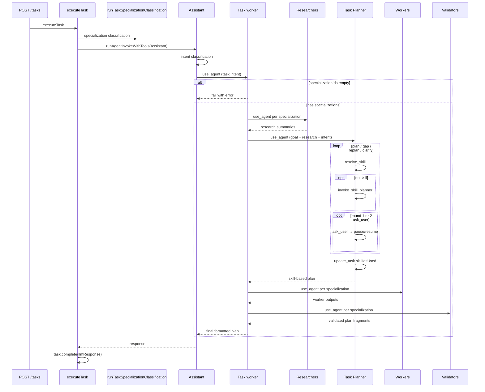
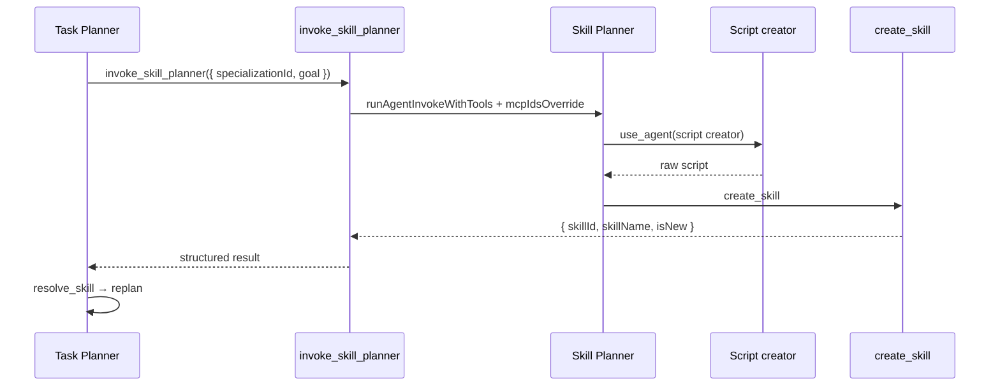

# Deterministic Task Planning via Skills — Architecture

**Feature slug:** `task-skill-planning`  
**Status:** Approved (Option B — task workers orchestrate Task Planner within Assistant flow)  
**Reference architectures:** [`skill/architecture.md`](../skill/architecture.md) · [`specialization/architecture.md`](../specialization/architecture.md) · [`agent-internal-tools/architecture.md`](../agent-internal-tools/architecture.md)

---

## Analysis

### Librarian findings (incorporated)

| Existing piece | Location | Reuse plan |
|---|---|---|
| `use_agent` / `list_agents` | `services/agent/src/internalTools/useAgent/`, `listAgents/` | Task workers orchestrate researchers, Task Planner, workers, validators; Skill Planner delegates to script creators |
| `runAgentInvokeWithTools` | `services/agent/src/internalTools/runAgentInvokeWithTools.ts` | Shared invoke engine; Skill Planner invoked via `invoke_skill_planner` handler |
| `create_skill` | `services/agent/src/internalTools/createSkill/` | Skill Planner persists new skills |
| `resolve_skill` | `services/agent/src/internalTools/resolveSkill/` | Task Planner loads full skill rules |
| `update_task` | `services/agent/src/internalTools/updateTask/` | Task Planner persists `skillIdsUsed` |
| Researcher / worker / validator per specialization | `provisionSpecializationAgents` | Task workers invoke in order per specialization |
| `INTENT_CATEGORIES` routing | `packages/constants/src/intentCategories/registry.ts` | **Unchanged** — task intents still route to Task / Scheduled / Routine workers |
| `getCatalogBySpecializationId` + `formatSkillsCatalogSection` | `domains/skill/` | Injected into Task Planner context via task worker message or catalog injection |
| `getList` MCP filter by specialization | `domains/mcp/src/queries/getList/` | Resolve MCP IDs for Skill Planner invoke |
| `ask_user` | `user-ask` internal tool | Task Planner clarification (2-round policy) |
| Assistant orchestration | `executeTask` → Assistant invoke | **Unchanged** — all non-question tasks still flow through Assistant |

### What exists vs what is new

| Area | Exists | New / changed |
|---|---|---|
| Skill domain + `create_skill` / `resolve_skill` | ✅ Shipped | No domain changes |
| Task workers (3) | ✅ Seed + INTENT_CATEGORIES routes | **Updated rules** — researcher → Task planner → worker → validator |
| Assistant orchestration | ✅ Classifies intent + delegates to workers | **Unchanged** |
| Task Planner | ❌ | New system agent |
| Skill Planner | ❌ | New system agent + **`skill-plan`** (`invoke_skill_planner`) tool |
| Script creator agents | ❌ | Three new seed agents (python, javascript/nodejs, bash) |
| `task.skillIdsUsed` | ❌ | New field on task model + GraphQL + task detail UI |
| `executeTask` routing split | ❌ **Rejected** | No bypass of Assistant |

### Design patterns applied

| Pattern | Where | Why |
|---|---|---|
| **Mediator** | `invoke-skill-planner` tool | Task Planner ↔ Skill Planner synchronous handoff with structured JSON |
| **Facade** | `invokeSkillPlannerToolHandler` | Hide Skill Planner invoke + MCP resolution |
| **Strategy** | Task Planner rule maps intent slug → plan output sections | One Task Planner; scheduled/routine sections differ by category |
| **Chain of Responsibility** | Task worker workflow steps | Fixed order: researcher → planner → worker → validator |
| **Command** | `update_task` for `skillIdsUsed`, `create_skill` for skills | Existing domain commands |

### Layers involved

```
packages/constants                  ← SYSTEM_AGENT_NAME (5 new), INTERNAL_TOOLS (1 new); INTENT_CATEGORIES unchanged
packages/client-langchain           ← invokeSkillPlannerSchema (new Zod schema)
domains/system-agent/seed           ← 5 new agents; updated task worker rules
domains/task                        ← skillIdsUsed field on model, DTO, GraphQL, updateTask
services/agent                      ← invokeSkillPlanner handler; runAgentInvokeWithTools mcpIdsOverride
apps/web                            ← task detail: skills used section
```

> **No new domain packages.** Task field addition in `domains/task` only.

---

## Recommendation

**Approach (Option B — approved):** Keep the **Assistant → intent classification → task worker** entry path. Update task worker rules to orchestrate:

1. Fail if `task.specializationIds` is empty
2. Per specialization: **researcher**
3. **Task Planner** (once, with all research summaries + goal + intent category)
4. Per specialization: **worker** (skill-based plan as context)
5. Per specialization: **validator**
6. Worker formats final plan (+ schedule/recurrence sections per intent slug)

Task Planner uses existing skills (multi-skill composition allowed), calls `invoke_skill_planner` when gaps exist, asks clarification questions (all at once in round 1; one follow-up in round 2), and persists `skillIdsUsed` via `update_task`.

**Why this approach:**

- Preserves existing Assistant orchestration and intent-specific worker formatting
- Task workers remain the single orchestration entry for task intents
- Validators stay in the loop for plan quality per specialization
- `invoke_skill_planner` guarantees synchronous skill provisioning before replanning

**Trade-offs:**

| Decision | Choice | Alternative rejected |
|---|---|---|
| Task execution path | Assistant → task worker orchestration | `executeTask` bypasses Assistant — breaks established flow |
| INTENT_CATEGORIES | Unchanged (task → Task worker, etc.) | Route directly to Task Planner |
| Research phase | Task worker invokes researchers via `use_agent` | Programmatic pre-step in `executeTask` |
| Validators | Invoked after Task Planner per specialization | Skip validators — user requires them |
| Empty `specializationIds` | Fail with clear error | Graceful degradation |
| `skillIdsUsed` | Persist on task + task detail UI | Logs only |
| Skill gap handling | `invoke-skill-planner` tool | Raw `use_agent` only |

---

## Agent definitions

### 1. Task Planner

| Property | Value |
|---|---|
| **Enum** | `SYSTEM_AGENT_NAME.TaskPlanner = 'Task planner'` |
| **Invoked via** | Task worker `use_agent` (not INTENT_CATEGORIES, not Assistant directly) |
| **`specializationId`** | `null` (global; multi-spec via message + `resolve_skill` args) |
| **`assignedToolIds`** | `agent-use`, `agent-list`, `user-ask`, `skill-resolve`, `skill-plan`, `task-update` |
| **Rule outline** | 1) Read goal, intent category, research summaries, skill catalogs. 2) Select/combine skill(s) from catalog — **never invent names**. 3) `resolve_skill` per skill. 4) `invoke_skill_planner` on gaps; replan. 5) `ask_user` round 1: all questions at once; round 2: clarification only; then best-effort plan. 6) `update_task` with `skillIdsUsed`. 7) Return structured plan for workers/validators. Planning only. |
| **Multi-skill** | Join existing skills or split goal into multiple skills when logic is reusable |
| **Output sections (Strategy map)** | `task`: Goal, Assumptions, Steps, Dependencies, Referenced skills. `scheduled_task`: + Scheduled time, Pre-execution prep, Reminders. `routine_task`: + Recurrence, Setup, Per-occurrence steps, Start/stop conditions. |

### 2. Skill Planner

| Property | Value |
|---|---|
| **Enum** | `SYSTEM_AGENT_NAME.SkillPlanner = 'Skill planner'` |
| **Invoked via** | `invoke_skill_planner` tool (called by Task Planner) |
| **`assignedToolIds`** | `skill-create`, `agent-use` |
| **MCPs** | Runtime `mcpIdsOverride` from specialization-linked MCPs |
| **Rule outline** | Draft name/description/rule; delegate scripts to language-specific creators; `create_skill`; return skill metadata |

### 3. Skill Script Creators

| Agent name (seed) | Enum constant | Output |
|---|---|---|
| `Skill script creator (python)` | `SkillScriptCreatorPython` | Raw Python only |
| `Skill script creator (javascript)` | `SkillScriptCreatorJavascript` | Raw JS (`nodejs` in skill) |
| `Skill script creator (bash)` | `SkillScriptCreatorBash` | Raw Bash (`set -euo pipefail`) |

| Property | Value |
|---|---|
| **`assignedToolIds`** | `[]` |
| **Rule outline** | Code-only output; language-specific standards in seed rules |

### 4. Task workers (updated)

| Agent | Orchestration change |
|---|---|
| `Task worker` | researcher(s) → Task planner → worker(s) → validator(s); fail if no specializations |
| `Scheduled task worker` | Same + schedule sections in final output |
| `Routine task worker` | Same + recurrence sections in final output |

### 5. Existing agents (unchanged routing)

| Agent | Role |
|---|---|
| `Assistant` | Entry point for all tasks; intent classify + delegate |
| `Question worker` | Question intents only — no Task Planner |
| `{Spec} researcher/worker/validator` | Invoked by task workers per specialization |
| `Skill resolver` | Optional; Task Planner prefers `resolve_skill` |

---

## Flow diagrams

### End-to-end task execution (approved)



### Skill creation chain



---

## Internal tools

### Reuse vs new

| Tool | Verdict |
|---|---|
| `use_agent`, `list_agents`, `resolve_skill`, `create_skill`, `ask_user`, `update_task` | **Reuse** |
| **`skill-plan`** (`invoke_skill_planner`) | **New** — synchronous Skill Planner Mediator |
| `plan-task` tool | **Rejected** — task workers own orchestration |

### New tool: `skill-plan`

Same schema and handler as prior draft:

```typescript
export const invokeSkillPlannerSchema = z.object({
  specializationId: z.string().min(1),
  goal: z.string().min(1),
});
```

Handler: validate → load specialization → resolve MCPs → `runAgentInvokeWithTools(Skill Planner, mcpIdsOverride)` → return `{ skillId, skillName, isNew, specializationId }`.

### `runAgentInvokeWithTools` extension

Add optional **`mcpIdsOverride?: string[]`** for Skill Planner invoke only.

---

## Changes to intent routing / Assistant / executeTask

### INTENT_CATEGORIES — **no changes**

```typescript
// Unchanged targets:
question → Question worker
task → Task worker
scheduled_task → Scheduled task worker
routine_task → Routine task worker
```

### Assistant — **no routing changes**

Assistant continues to classify intent and delegate to workers. Optional seed note: task workers now include Task Planner in their workflow.

### executeTask — **no routing split**

`executeTask` continues to invoke Assistant only (after specialization classification). No `runTaskIntentClassification` or `runTaskSpecializationResearch` pre-steps.

### Task worker seed rules — **primary orchestration change**

Replace current researcher → worker → validator-only workflow with:

```
1. If task has no specializationIds → stop with clear error (do not plan).
2. list_agents → researchers per specialization → use_agent each.
3. use_agent → "Task planner" with goal, intent category, research summaries.
4. list_agents → workers per specialization → use_agent each (pass Task planner output).
5. list_agents → validators per specialization → use_agent each.
6. Format final plan per intent-specific output sections.
```

---

## Task model: `skillIdsUsed`

| Layer | Change |
|---|---|
| `domains/task/src/model/model.ts` | `skillIdsUsed?: string[] \| null` |
| `domains/task/src/model/dto.ts` | Include in `TaskResponse` |
| `domains/task/src/model/graphql.ts` | Expose `skillIdsUsed: [String]` |
| `domains/task/src/commands/updateTask` | Accept `skillIdsUsed` in schema |
| `services/agent/internalTools/updateTask` | Allow Task Planner to set field |
| `apps/web/app/tasks/[id]/` | New section: skills used in plan |

---

## File-by-file change list

### `packages/constants`

| File | Action |
|---|---|
| `src/SystemAgentName.ts` | Add 5 new agent names |
| `src/internalTools/registry.ts` | Add `skill-plan` |
| `src/intentCategories/registry.ts` | **No change** |

### `packages/client-langchain`

| File | Action |
|---|---|
| `src/internalTools/schemas/invokeSkillPlannerSchema.ts` | **Create** |
| `src/internalTools/buildInternalTools.ts` | Register schema |

### `domains/system-agent/seed`

| File | Action |
|---|---|
| `seed/systemAgents.json` | Add 5 agents; **update** 3 task worker rules |

### `domains/task`

| File | Action |
|---|---|
| `src/model/model.ts`, `dto.ts`, `graphql.ts`, `toTaskResponse.ts` | Add `skillIdsUsed` |
| `src/commands/updateTask/` | Accept `skillIdsUsed` |

### `services/agent`

| File | Action |
|---|---|
| `src/internalTools/invokeSkillPlanner/` | **Create** handler |
| `src/internalTools/runAgentInvokeWithTools.ts` | `mcpIdsOverride` |
| `src/internalTools/createInternalToolHandlers.ts` | Register `skill-plan` |

### `apps/web`

| File | Action |
|---|---|
| `app/tasks/[id]/_components/TaskDetailSkillsUsed/` | **Create** — display skills from `skillIdsUsed` |
| GraphQL query hook for task detail | Include `skillIdsUsed` |

### `services/task`

| File | Action |
|---|---|
| No `executeTask` routing split | Regression tests only |

---

## Implementation phases

### Phase 1 — Foundation

| ID | Work |
|---|---|
| **P1-1** | Constants: enums + `skill-plan` registry |
| **P1-2** | `invokeSkillPlannerSchema` + buildInternalTools |
| **P1-3** | Seed 5 new agents + update 3 task worker rules |

### Phase 2 — Skill Planner runtime

| ID | Work |
|---|---|
| **P2-1** | `mcpIdsOverride` in `runAgentInvokeWithTools` |
| **P2-2** | `invokeSkillPlanner` handler |

### Phase 3 — Task model & UI

| ID | Work |
|---|---|
| **P3-1** | `skillIdsUsed` on task domain + `update_task` |
| **P3-2** | GraphQL + task detail UI section |

### Phase 4 — Tests & hardening

| ID | Work |
|---|---|
| **P4-1** | Unit tests: invokeSkillPlanner, mcpIdsOverride, updateTask skillIdsUsed |
| **P4-2** | Seed/rule regression; Assistant flow unchanged |
| **P4-3** | E2E: task detail shows skills used |

**Dependencies:** P1 → P2; P1 + P2 → manual/E2E validation of full worker orchestration (LLM-driven).

---

## Test strategy

| Area | Scenarios |
|---|---|
| `invokeSkillPlanner` | Happy path; MCP override; missing Skill Planner |
| Task worker rules (seed) | Document expected workflow; integration via mocked LLM |
| `skillIdsUsed` | update_task persists; GraphQL returns; UI renders |
| Regression | Question path unchanged; INTENT_CATEGORIES unchanged; Assistant still entry point |
| Empty `specializationIds` | Task worker fails per rule |

---

## Risks & mitigations

| Risk | Mitigation |
|---|---|
| Task worker LLM skips Task Planner step | Explicit numbered workflow in seed rules; progress logging |
| Task Planner invents skill names | Closed catalog in message; rule forbids invention |
| `ask_user` multi-round complexity | Document 2-round policy in Task Planner rule |
| Worker orchestration latency | Existing pattern; parallel researchers where possible |

---

## Decisions (approved 2026-07-01)

| # | Decision |
|---|---|
| OQ-1 | **Option B** — Task Planner via task workers; Assistant flow unchanged |
| OQ-2 | Multi-skill composition allowed |
| OQ-3 | Empty `specializationIds` → fail |
| OQ-4 | `skillIdsUsed` on task + task detail UI |
| OQ-5 | Research in task workers (not executeTask pre-step) |
| OQ-6 | Validators invoked after Task Planner |
| OQ-7 | Clarification: round 1 all questions; round 2 follow-up; then best-effort |
| OQ-8 | `invoke-skill-planner` tool for synchronous skill creation |
| OQ-9 | INTENT_CATEGORIES unchanged |
| OQ-10 | javascript creator name; `nodejs` language enum in `create_skill` |

---

*End of architecture — 4 implementation phases, Option B orchestration, zero new domain packages.*
