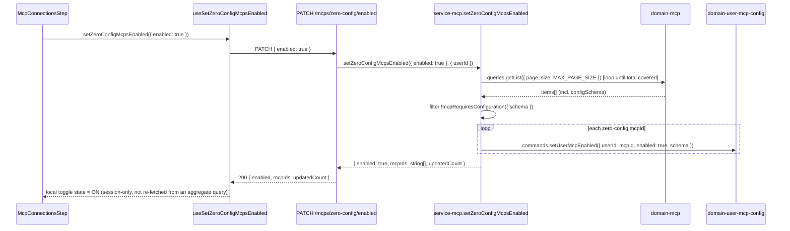

# User Onboarding — Architecture Specification

**Status:** Draft — implementation specification  
**Last updated:** 2026-06-27  
**Route:** `/onboarding`  
**Related:** [PRD](./PRD.md) · [User Registration Architecture](../user-registration/architecture.md) · [User Settings Architecture](../user-settings/architecture.md) · [AI Integrations Architecture](../ai-integrations/architecture.md)

This document describes how User Onboarding fits the Vassembly monorepo: domains, auth service, API gateway, web app, and UI packages. It maximises reuse of the existing auth, registration, and AI integrations stacks — no new packages are required.

---

## Analysis

### Monorepo audit

| Layer | Package / path | Current capability | Gap vs PRD |
|-------|---------------|-------------------|------------|
| User entity | `@vassembly/domain-user` (`domains/user/`) | `UserModel` with `verifiedAt`; `passwordResetToken` / `passwordResetExpiresAt` token pattern; `sendResetPasswordEmail` SES command | No `onboarding` nested object; no email verification token fields; no verification email command |
| Auth orchestration | `@vassembly/service-auth` (`services/auth/`) | `register`, `login`, `refresh`, `getUser`, password-reset handlers | No `confirmEmailVerification`, `resendEmailVerification`, `getOnboardingStatus`, `checkAndCompleteOnboarding` handlers |
| Auth token | `@vassembly/domain-auth-token` (`domains/auth-token/`) | JWT minting: `sub`, `role`, `jti`, `exp`, `iat` claims | No `onboardingCompleted` claim — required for stateless middleware enforcement |
| API gateway | `@vassembly/api` (`apps/api/`) | REST auth routes, GraphQL `user(id)` query, `authorizeRequest` | No `POST /auth/verify-email`, `POST /auth/resend-verification`; no onboarding-gate middleware |
| Web middleware | `apps/web/middleware.ts` | Redirects authenticated users away from auth pages (`/login`, `/register`, etc.) | No onboarding allowlist enforcement |
| Web auth guard | `apps/web/lib/auth/ProtectedAuthRoute.tsx` | Client-side auth/guest gating; `role` check | No `onboardingCompleted` awareness |
| User auth context | `@vassembly/ui-user-auth` | `UserAuthProvider`, `AuthUser` shape (`id`, `email`, `role`, `verifiedAt`) | `AuthUser` missing `onboardingCompleted` |
| UI hooks | `@vassembly/ui-api-hooks` | `useGetUser` GraphQL, auth REST hooks | No `useVerifyEmail`, `useResendVerification`; `GET_USER_QUERY` missing `onboarding` fields |
| AI integration create | `apps/web/app/agents/ai-integrations/create/` | `useAiIntegrationCreatePage` redirects to `AI_INTEGRATIONS_LIST_ANCHOR` on success | Must redirect to `/onboarding` instead when user is in onboarding |
| Stepper UI | `@vassembly/ui-system-design/stepper` (`ui/system-design/stepper/`) | Step progress component | Ready to use — no changes needed |

### What can be reused (~85%)

- `passwordResetToken` / `passwordResetExpiresAt` / `encode` / `randomString` pattern → directly mirrors email verification token storage (hashed token, expiry, single-use)
- `sendResetPasswordEmail` command structure → template for `sendVerificationEmail` (same SES client, same error guard)
- `initiatePasswordReset` orchestration → template for `initiateEmailVerification` (randomString → encode → store → send)
- `confirmAccountDeletion` / `resetPassword` commands → template for `confirmEmailVerification` (token lookup, expiry check, single-use invalidation)
- `service-auth` handler file conventions (`index.ts`, `types.ts`, `index.test.ts`) → all new handlers follow this layout
- `ProtectedAuthRoute` — used unchanged on `/onboarding` to enforce authentication
- `aiIntegrations(status: "active", page: 1, size: 1)` GraphQL query → reused to derive Step 2 status (no new query)
- `resolvePostRegisterTargetUrl` same-origin validation → reused for `returnUrl` safety on onboarding completion
- `@vassembly/ui-system-design/stepper` — reused as-is for two-step progress display

### What is genuinely new (~15%)

| Gap | Placement |
|-----|-----------|
| `onboarding` nested object on `UserModel` | `domains/user/src/model/model.ts` |
| Email verification token fields on `UserModel` | `domains/user/src/model/model.ts` |
| `initiateOnboarding`, `completeOnboarding`, `requestEmailVerification`, `confirmEmailVerification`, `sendVerificationEmail` commands | `domains/user/src/commands/` |
| `onboardingCompleted` JWT claim | `domains/auth-token/src/commands/create/` + `types.ts` |
| Service handlers: `confirmEmailVerification`, `resendEmailVerification`, `getOnboardingStatus`, `checkAndCompleteOnboarding` | `services/auth/src/handlers/` |
| REST routes: `POST /auth/verify-email`, `POST /auth/resend-verification` | `apps/api/src/routes/auth/` |
| API-level onboarding gate middleware | `apps/api/src/plugins/` or `apps/api/src/routes/index.ts` |
| Next.js middleware extension for allowlist enforcement | `apps/web/middleware.ts` |
| `/onboarding` hub page + components | `apps/web/app/onboarding/` |
| Migration script for existing users | `scripts/` or `domains/user/scripts/` |

### Design patterns applied

| Pattern | Where | Rationale |
|---------|-------|-----------|
| **Command** | `domains/user/src/commands/initiateOnboarding/`, `confirmEmailVerification/`, etc. | Every domain write operation is a Command module (`index.ts`, `types.ts`) — matches the existing `requestPasswordReset`, `sendResetPasswordEmail`, `initiatePasswordReset` structure |
| **Template Method** | `sendVerificationEmail` mirrors `sendResetPasswordEmail` | Shared email-dispatch flow (SES client, config guard, prod-only throw) with overridable parameters |
| **Facade** | Service handlers (`confirmEmailVerification`, `checkAndCompleteOnboarding`) | Orchestrate multiple domain commands and queries behind a single entry point — same role as `handlers.login`, `handlers.register` |
| **Strategy (map)** | Onboarding allowlist constant (`ONBOARDING_ALLOWED_ROUTES`) | Routes checked via `Set.has()` instead of switch/if-else chain, per workspace rule |
| **Chain of Responsibility** | Next.js middleware pipeline | Existing auth-page check is step 1; onboarding gate is a new step 2 — each step either redirects or passes to `NextResponse.next()` |
| **State** | `onboarding` object lifecycle (`undefined` → `{completedAt: null}` → `{completedAt: Date}`) | Entity lifecycle states map to explicit field values; `checkAndCompleteOnboarding` is the state-transition guard |
| **Observer** | Token refresh after step completion | UI subscribes to step completion, triggers `useRefresh`, and re-renders hub on updated JWT/user data |

---

## Architecture & Package Placement

### Conceptual flow — new user happy path

```mermaid
sequenceDiagram
  participant Web as apps/web (/register → /onboarding)
  participant Mid as middleware.ts
  participant Hooks as ui-api-hooks
  participant API as apps/api
  participant Svc as service-auth
  participant Dom as domain-user
  participant ATok as domain-auth-token
  participant DB as MongoDB users
  participant SES as AWS SES

  Web->>API: POST /user/register
  API->>Svc: handlers.register(body)
  Svc->>Dom: commands.create(...)
  Svc->>Dom: commands.initiateOnboarding({ userId })
  Dom->>DB: set onboarding.startedAt, completedAt=null
  Svc->>Dom: commands.requestEmailVerification({ userId })
  Dom->>DB: set emailVerificationToken (hashed), expiresAt, issuedAt
  Svc->>Dom: commands.sendVerificationEmail({ to, verificationUrl })
  Dom->>SES: send verification email
  Svc->>ATok: commands.create({ ..., onboardingCompleted: false })
  API-->>Web: { user, authToken, refreshToken }
  Web->>Web: setTokens(); router.replace('/onboarding')

  Note over Mid: On every navigation
  Mid->>Mid: read auth-token cookie; decode JWT payload
  Mid->>Mid: check onboardingCompleted claim + role
  Mid->>Mid: if incomplete & not admin & route not in allowlist → redirect /onboarding

  Note over Web: User clicks verification link
  Web->>API: POST /auth/verify-email { token }
  API->>Svc: handlers.confirmEmailVerification({ token })
  Svc->>Dom: commands.confirmEmailVerification({ token })
  Dom->>DB: set verifiedAt; clear token fields
  Svc->>Svc: checkAndCompleteOnboarding({ userId })
  API-->>Web: { success: true }
  Web->>API: POST /auth/refresh (via useRefresh)
  API-->>Web: new authToken (onboardingCompleted still false)
  Web->>Web: router.replace('/onboarding') — Step 1 now complete

  Note over Web: User creates AI integration
  Web->>API: POST /ai-integrations
  API->>Svc: authHandlers.checkAndCompleteOnboarding({ userId })
  Svc->>Dom: queries.getById({ id: userId })
  Svc->>API: queries aiIntegrations count
  Svc->>Dom: commands.completeOnboarding({ userId })
  Dom->>DB: set onboarding.completedAt = now
  API-->>Web: { credential }
  Web->>Web: router.push('/onboarding')
  Web->>API: POST /auth/refresh
  API-->>Web: new authToken (onboardingCompleted: true)
  Web->>Web: router.replace(returnUrl or '/')
```

### Layer responsibilities

| Layer | Responsibility |
|-------|----------------|
| **`domains/user`** | Authoritative persistence for `onboarding` object, `verifiedAt`, verification token fields; all writes are Command modules; no orchestration |
| **`domains/auth-token`** | JWT minting extended with `onboardingCompleted` claim; derived at token creation time from user state |
| **`services/auth`** | Orchestrates onboarding use cases: `confirmEmailVerification` (token validation → `verifiedAt` → completion check), `resendEmailVerification` (rate limit → new token → email), `checkAndCompleteOnboarding` (derives step states → sets `completedAt`), extend `register` to call `initiateOnboarding` + `requestEmailVerification` |
| **`apps/api`** | REST routes for commands; API-level onboarding gate (Fastify `preHandler` or inline `enforceOnboardingComplete` helper in protected routes); GraphQL `User` type extended with `onboarding` field |
| **`@vassembly/ui-api-hooks`** | `useVerifyEmail`, `useResendVerification` REST hooks; extend `GET_USER_QUERY` with `onboarding` fragment; extend `useGetUser` return types |
| **`@vassembly/ui-user-auth`** | Extend `AuthUser` with `onboardingCompleted: boolean`; `UserAuthProvider` derives it from JWT claim or user data |
| **`apps/web/middleware.ts`** | Chain of Responsibility: auth-page check (existing) → onboarding gate (new). Decodes JWT payload from cookie (no signature verification — routing only). Admin check from `role` claim. Allowlist constant. |
| **`apps/web/app/onboarding/`** | Hub page: queries `getUser` (for `verifiedAt`, `onboarding`) + `aiIntegrations(active)` (for Step 2); triggers `useRefresh` on `completedAt` detection; redirects to safe `returnUrl` or `/`; `ProtectedAuthRoute requireAuthenticated` |

### Package dependency graph

```
apps/web (onboarding page + middleware)
  → @vassembly/ui-api-hooks (useVerifyEmail, useResendVerification, useGetUser, useAiIntegrations)
  → @vassembly/ui-user-auth (UserAuthProvider, AuthUser.onboardingCompleted)
  → @vassembly/ui-system-design/stepper (step display)

@vassembly/ui-api-hooks
  → GraphQL: apps/api (extended User type with onboarding)
  → REST: apps/api (POST /auth/verify-email, POST /auth/resend-verification)

apps/api
  → @vassembly/service-auth (new handlers)
  → @vassembly/service-ai-integration (POST /ai-integrations route calls checkAndCompleteOnboarding after create)

@vassembly/service-auth
  → @vassembly/domain-user (new commands + queries)
  → @vassembly/domain-auth-token (extended create with onboardingCompleted)

@vassembly/domain-auth-token
  → JWT payload extended (onboardingCompleted claim)
```

---

## Recommendation

**Extend `@vassembly/domain-user` with five new Command modules** following the `requestPasswordReset` / `sendResetPasswordEmail` template, **add `onboardingCompleted` to the JWT payload** (one field, stateless middleware enforcement at edge with no network calls), **extend `service-auth` with four new handlers** following existing handler conventions, and **extend `apps/api` + `apps/web`** minimally.

**No new packages.** All changes are additive extensions to existing packages.

**Route guard decision — Next.js middleware (recommended):** The PRD explicitly requires middleware-level enforcement and admin bypass. The existing `middleware.ts` already reads the `auth-token` cookie. Extending it to base64-decode the JWT payload (no verification, routing only) and check the `onboardingCompleted` claim is the lightest-weight change:
- No extra HTTP calls in middleware
- No cookie synchronisation issues between API and web
- Admin bypass from existing `role` claim
- Client-side `ProtectedAuthRoute` on the hub page handles the inverse check (redirect completed users away from `/onboarding`)

**Alternative considered — `OnboardingGuard` client component:** Would cause a flash-of-unrestricted-content before JS hydrates and is purely client-side. Rejected in favour of middleware.

**Alternative considered — separate `onboarding-complete` cookie:** Requires keeping a separate non-JWT cookie in sync across register/login/verify/complete flows. More moving parts than a single JWT claim.

---

## Data model

### `UserModel` additions (`domains/user/src/model/model.ts`)

```typescript
// Onboarding lifecycle object
onboarding?: {
  version: number;         // schema version (current: 1)
  startedAt?: Date;        // set at registration
  completedAt?: Date | null; // null = in-progress; Date = done; undefined = grandfathered (treated as complete)
};

// Email verification token fields — mirror passwordResetToken pattern
emailVerificationToken?: string | null;      // stored as encode(plaintextToken) — never exposed in DTO
emailVerificationExpiresAt?: Date | null;    // server-enforced expiry
emailVerificationIssuedAt?: Date | null;     // for resend rate-limiting (now - issuedAt < COOLDOWN)
```

### `AuthTokenModel` / JWT claim addition (`domains/auth-token/`)

Extend `CreateAuthTokenArgs` input to accept `onboardingCompleted?: boolean`. JWT payload gains `onb: boolean` (short key). Derived at mint time:

```typescript
// service-auth handlers derive the flag before calling authTokenDomain.commands.create
const onboardingCompleted =
  user.onboarding === undefined            // grandfathered
  || user.onboarding.completedAt != null;  // finished
```

### Step completion derivation (runtime — never stored)

| Step | Signal | Source |
|------|--------|--------|
| Email verified | `user.verifiedAt != null` | `domain-user` query |
| AI integration created | `aiIntegrations(active).totalCount >= 1` | `domain-ai-integration` query |

### Onboarding state machine

```
undefined (absent)          → treated as COMPLETE (grandfathered migration)
{ completedAt: null }       → IN_PROGRESS — gate active
{ completedAt: Date }       → COMPLETE — gate inactive
```

Transitions:
- `undefined → { completedAt: null }` — `initiateOnboarding` command (called by `register` handler)
- `{ completedAt: null } → { completedAt: Date }` — `completeOnboarding` command (called by `checkAndCompleteOnboarding` when both steps satisfied)

---

## Domain: `@vassembly/domain-user`

### New Command modules

All follow the existing command file convention: `commands/<name>/index.ts`, `commands/<name>/types.ts`, `commands/<name>/index.test.ts`.

#### `commands/initiateOnboarding/`

Sets `onboarding.startedAt = now`, `onboarding.completedAt = null`, `onboarding.version = 1`. Called once at registration. No-op if already set.

```typescript
// types.ts
export interface InitiateOnboardingCommand {
  userId: string;
}
```

#### `commands/completeOnboarding/`

Sets `onboarding.completedAt = now`. Validates `onboarding` object exists and `completedAt` is currently `null` (idempotent guard). Throws `WrongParamError` if already complete.

```typescript
export interface CompleteOnboardingCommand {
  userId: string;
}
```

#### `commands/requestEmailVerification/`

Mirror of `requestPasswordReset`: generates `randomString(32)`, stores `encode(token)` as `emailVerificationToken`, sets `emailVerificationExpiresAt = now + EMAIL_VERIFICATION_TOKEN_TTL_MS` (48h default), sets `emailVerificationIssuedAt = now`.

```typescript
export interface RequestEmailVerificationCommand {
  userId: string;
  token: string; // plaintext; command stores encoded version
}
```

#### `commands/confirmEmailVerification/`

Accepts plaintext token. Fetches user by `id`, validates:
1. `emailVerificationToken !== null` (token exists)
2. `encode(token) === emailVerificationToken` (matches stored hash)
3. `emailVerificationExpiresAt > now` (not expired)

On success: sets `verifiedAt = now`, clears all three verification token fields.  
On failure: throws `WrongParamError` with a non-enumerating message ("Invalid or expired verification link"). Never reveals whether the email exists.

```typescript
export interface ConfirmEmailVerificationCommand {
  userId: string;
  token: string; // plaintext token from URL
}
```

#### `commands/sendVerificationEmail/`

Template Method: mirror of `sendResetPasswordEmail`. Uses same SES client pattern (config guard, prod-only throw, warn in dev). Uses a distinct SES template name from password reset.

```typescript
export interface SendVerificationEmailCommand {
  to: string;
  verificationUrl: string;
}
```

Constants: `EMAIL_VERIFICATION_TOKEN_TTL_MS`, `VERIFICATION_EMAIL_ERROR_CONTEXT`, `VERIFICATION_EMAIL_CONFIG_ERROR` in `commands/sendVerificationEmail/constants.ts`.

### `UserPublicResponse` / DTO

Extend the existing `toUserPublicResponse` mapper to include:
```typescript
onboarding?: {
  version: number;
  startedAt?: string | null;
  completedAt?: string | null;
};
```

Verification token fields (`emailVerificationToken`, `emailVerificationExpiresAt`, `emailVerificationIssuedAt`) are **never included** in the public response.

### GraphQL `User` type extension (`domains/user/src/model/graphql.ts`)

Add `onboarding` sub-type:

```graphql
type UserOnboarding {
  version: Int!
  startedAt: DateTime
  completedAt: DateTime
}
```

Extend `User` type: `onboarding: UserOnboarding`.

---

## Domain: `@vassembly/domain-auth-token`

### Extend `CreateAuthTokenArgs` (`commands/create/types.ts`)

Add optional input field:

```typescript
interface CreateAuthTokenInput {
  userId: string;
  refreshTokenId: string;
  role: AUTH_TOKEN_ROLE;
  onboardingCompleted?: boolean; // new
}
```

### Extend JWT payload (`commands/create/index.ts`)

Include `onb` claim in the signed JWT:

```typescript
const token = await jwtClient.create({
  data: {
    sub: data.userId,
    role: data.role,
    jti: data.refreshTokenId,
    exp: data.expiresAt?.getTime(),
    iat: data.createdAt?.getTime(),
    onb: input.onboardingCompleted ?? true, // default true for backward compat
  },
  options,
});
```

Default `true` is backward-compatible: existing tokens without the claim are treated as complete.

---

## Service: `@vassembly/service-auth`

### Extend `register` handler (`handlers/register/index.ts`)

After `userDomain.commands.create`, add:

```typescript
// Facade: orchestrate onboarding initiation and email verification
await userDomain.commands.initiateOnboarding({ userId: user.data.id });

const verificationToken = randomString(32);
await userDomain.commands.requestEmailVerification({ userId: user.data.id, token: verificationToken });
await userDomain.commands.sendVerificationEmail({
  to: user.data.email,
  verificationUrl: buildVerificationUrl({ token: verificationToken }),
});
```

Pass `onboardingCompleted: false` to `authTokenDomain.commands.create`.

Add `buildVerificationUrl` utility in `domains/user/src/utils/buildVerificationUrl.ts` (mirrors `buildResetUrl`).

### Extend `login` handler (`handlers/login/index.ts`)

After loading the user, derive `onboardingCompleted` before minting tokens:

```typescript
const onboardingCompleted =
  user.onboarding === undefined || user.onboarding.completedAt != null;
// Pass to authTokenDomain.commands.create
```

### Extend `refresh` handler (`handlers/refresh/index.ts`)

Re-derive `onboardingCompleted` from the current user record (same logic as login). This ensures the refreshed JWT reflects any state change after registration.

### New handler: `confirmEmailVerification` (`handlers/confirmEmailVerification/`)

**Facade** pattern — orchestrates domain calls:

1. Accept `{ userId, token }` (userId from auth context; token from request body)
2. Call `userDomain.commands.confirmEmailVerification({ userId, token })`
3. Call `checkAndCompleteOnboarding({ userId })` (see below)
4. Return `{ success: true }`

Error cases: surface `WrongParamError` (expired/invalid token) → API maps to `400`; `NotFoundError` → `400` (non-enumerating).

```typescript
// types.ts
export interface ConfirmEmailVerificationInput {
  userId: string;
  token: string;
}
export interface ConfirmEmailVerificationOutput {
  success: boolean;
}
```

### New handler: `resendEmailVerification` (`handlers/resendEmailVerification/`)

**Facade** — rate-limit check + token refresh:

1. Accept `{ userId }` from auth context
2. Fetch user via `userDomain.queries.getById({ id: userId })`
3. If `user.verifiedAt != null` → throw `WrongParamError("Email already verified")` → API maps to `409`
4. If `user.emailVerificationIssuedAt` is within `RESEND_COOLDOWN_MS` (60s default) → throw `WrongParamError({ retryAfter })` → API maps to `429`
5. Generate new `randomString(32)` token
6. Call `userDomain.commands.requestEmailVerification({ userId, token })` (invalidates previous token)
7. Call `userDomain.commands.sendVerificationEmail({ to: user.email, verificationUrl })`
8. Return `{ success: true }`

```typescript
export interface ResendEmailVerificationInput {
  userId: string;
}
export interface ResendEmailVerificationOutput {
  success: boolean;
}
```

### New handler: `checkAndCompleteOnboarding` (`handlers/checkAndCompleteOnboarding/`)

**State transition guard** — called after both verification and AI integration creation:

```typescript
export const checkAndCompleteOnboarding = async ({ userId }: CheckAndCompleteOnboardingInput): Promise<void> => {
  const { user } = await getUser({ id: userId });

  if (user.onboarding?.completedAt != null || user.onboarding === undefined) {
    return; // already complete or grandfathered
  }

  const isEmailVerified = user.verifiedAt != null;
  if (!isEmailVerified) {
    return;
  }

  // Query active AI credential count via domain-ai-integration
  const { totalCount } = await aiIntegrationDomain.queries.getListForUser({
    userId,
    page: 1,
    size: 1,
    status: AiIntegrationListStatusFilter.Active,
  });

  if (totalCount === 0) {
    return;
  }

  await userDomain.commands.completeOnboarding({ userId });
};
```

---

## API gateway: `apps/api`

### New REST routes

**Directory:** `apps/api/src/routes/auth/`

#### `verifyEmail.ts` — `POST /auth/verify-email`

```typescript
export const verifyEmailRoute = defineRoute({
  method: 'POST',
  url: '/verify-email',
  handler: async ({ body, headers }) => {
    const { userId } = await handlers.authorizeRequest({ headers });
    const { token } = verifyEmailBodySchema.parse(body); // z.object({ token: z.string().min(1) })
    return handlers.confirmEmailVerification({ userId, token });
  },
});
```

Response: `200 { success: true }` or `400` (invalid/expired token).

#### `resendVerification.ts` — `POST /auth/resend-verification`

```typescript
export const resendVerificationRoute = defineRoute({
  method: 'POST',
  url: '/resend-verification',
  handler: async ({ headers }) => {
    const { userId } = await handlers.authorizeRequest({ headers });
    return handlers.resendEmailVerification({ userId });
  },
});
```

Response: `200 { success: true }`, `409` (already verified), or `429 { retryAfter: number }`.

### API-level onboarding gate

A shared helper `enforceOnboardingComplete` is added to `apps/api/src/routes/shared/` (mirrors `authorizeRequest` pattern). It decodes the JWT claims (already parsed by `authorizeRequest`) and checks `onboardingCompleted`:

```typescript
// apps/api/src/routes/shared/enforceOnboardingComplete.ts
export const enforceOnboardingComplete = ({ onboardingCompleted }: AuthClaims): void => {
  if (!onboardingCompleted) {
    throw new UnauthorizedError('Onboarding incomplete'); // maps to 403
  }
};
```

Applied in all protected route handlers **except** the onboarding-scoped ones (`/auth/verify-email`, `/auth/resend-verification`, `/ai-integrations`, `/user/settings`-related routes). The API onboarding scope allowlist matches the UI allowlist.

### GraphQL `User` type extension

Extend `gqlUserSchema` in `domains/user/src/model/graphql.ts` to expose `onboarding`:

```typescript
onboarding: t.expose('onboarding', {
  type: UserOnboardingType, // new Pothos object type
  nullable: true,
}),
```

`UserOnboardingType` exposes `version`, `startedAt`, `completedAt`.

### Register new auth routes

Update `apps/api/src/routes/auth/index.ts` to include `verifyEmailRoute` and `resendVerificationRoute`.

### AI integration route — completion hook

In `apps/api/src/routes/ai-integrations/create.ts`, after the successful `createCredential` call:

```typescript
// Non-blocking: fire and forget within the request (user already created)
await authHandlers.checkAndCompleteOnboarding({ userId });
```

This is the only cross-service coordination in the API layer, consistent with the Facade role of service handlers.

---

## Frontend: `apps/web`

### Middleware extension (`apps/web/middleware.ts`)

**Chain of Responsibility** — extend existing middleware with a second step:

```typescript
const AUTH_PAGES = ['/login', '/register', '/forgot-password', '/reset-password'];
const AUTH_TOKEN_KEY = 'auth-token';

const ONBOARDING_ALLOWED_ROUTES = new Set(['/onboarding', '/settings', '/agents/ai-integrations/create']);
const ONBOARDING_ROUTE = '/onboarding';

function decodeJwtPayload(token: string): Record<string, unknown> | null {
  try {
    const payload = token.split('.')[1];
    return JSON.parse(atob(payload));
  } catch {
    return null;
  }
}

export function middleware(request: NextRequest): NextResponse {
  const pathname = request.nextUrl.pathname;
  const authToken = request.cookies.get(AUTH_TOKEN_KEY)?.value;

  // Step 1: existing auth-page gate (unchanged)
  const isAuthPage = AUTH_PAGES.some((page) => pathname.startsWith(page));
  if (isAuthPage && authToken) {
    return NextResponse.redirect(new URL('/', request.url));
  }

  // Step 2: onboarding gate
  if (authToken) {
    const claims = decodeJwtPayload(authToken);
    const isAdmin = claims?.role === 'admin';
    const onboardingCompleted = claims?.onb !== false; // missing claim → true (backward compat)

    if (!isAdmin && !onboardingCompleted && !ONBOARDING_ALLOWED_ROUTES.has(pathname)) {
      const returnUrl = encodeURIComponent(pathname);
      return NextResponse.redirect(new URL(`${ONBOARDING_ROUTE}?returnUrl=${returnUrl}`, request.url));
    }

    // Redirect completed user away from /onboarding
    if (onboardingCompleted && pathname.startsWith(ONBOARDING_ROUTE)) {
      return NextResponse.redirect(new URL('/', request.url));
    }
  }

  return NextResponse.next();
}

export const config = {
  matcher: [
    '/login/:path*', '/register/:path*', '/forgot-password/:path*', '/reset-password/:path*',
    '/((?!_next/static|_next/image|favicon.ico|public).*)',
  ],
};
```

> Note: JWT payload decoding in middleware is **not** a security bypass — the API enforces `onboardingCompleted` via the signed token. Middleware decoding is for routing UX only.

### Extend `AuthUser` and `UserAuthProvider` (`@vassembly/ui-user-auth`)

Add `onboardingCompleted: boolean` to `AuthUser`. `UserAuthProvider` derives it from the parsed JWT `onb` claim (or from `user.onboarding` if loaded via GraphQL). Default `true` when claim is absent (backward compat).

### Onboarding hub page (`apps/web/app/onboarding/`)

```
apps/web/app/onboarding/
  page.tsx
  _components/
    OnboardingHub.tsx
    OnboardingStepCard.tsx
    EmailVerificationStep.tsx
    AiIntegrationStep.tsx
    useOnboardingHub.ts
    useResendVerification.ts
    types.ts
```

**`page.tsx`** — wraps with `ProtectedAuthRoute requireAuthenticated redirectPath='/login'`.

**`useOnboardingHub.ts`** — orchestrates hub state:
1. Query `getUser` (for `verifiedAt`, `onboarding`, `email`)
2. Query `aiIntegrations(page: 1, size: 1, status: "active")` (for `totalCount`)
3. Derive `steps: { emailVerified: boolean; aiIntegrationCreated: boolean }`
4. Monitor `onboarding.completedAt` — when set: trigger `useRefresh` (updates JWT), then `router.replace(returnUrl or '/')`
5. Return step states, email for display, resend handler

**`OnboardingHub.tsx`** — renders two `OnboardingStepCard` instances using `@vassembly/ui-system-design/stepper` layout. Step 2 is visually locked when Step 1 is pending.

**`EmailVerificationStep.tsx`** — calls `useResendVerification` hook; shows countdown (`retryAfter` from 429 response); shows user email.

**`AiIntegrationStep.tsx`** — CTA button navigating to `/agents/ai-integrations/create`; disabled and styled locked when Step 1 pending.

### `returnUrl` handling

- Middleware passes `?returnUrl=<encoded-path>` when redirecting to `/onboarding`
- `useOnboardingHub` reads `useSearchParams().get('returnUrl')` and stores in `useRef` (persists through re-renders without extra storage)
- On completion: `resolvePostRegisterTargetUrl` (existing same-origin validator) validates the stored `returnUrl`; safe → redirect there; unsafe → redirect to `/`

### Post-register redirect change (`apps/web/app/register/page.tsx`)

Change `handleRegisterSuccess` to redirect to `/onboarding` (not `returnUrl`) regardless of query params:

```typescript
const handleRegisterSuccess = (result: { authToken: string; refreshToken: string }) => {
  setTokens({ authToken: result.authToken, refreshToken: result.refreshToken });
  router.replace('/onboarding');
};
```

The `returnUrl` from before registration will be captured by middleware when the user first tried to reach a protected route, and passed along to `/onboarding?returnUrl=`.

### AI integration create redirect during onboarding (`apps/web/app/agents/ai-integrations/create/`)

In `useAiIntegrationCreatePage.tsx`, after successful create, check onboarding state:

```typescript
const { onboardingCompleted } = useUserAuth();
// ...
const redirectTarget = onboardingCompleted ? AI_INTEGRATIONS_LIST_ANCHOR : '/onboarding';
setTimeout(() => {
  router.push(redirectTarget);
}, REDIRECT_AFTER_CREATE_MS);
```

### `GET_USER_QUERY` extension (`ui/api-hooks/src/user/getUserQuery.ts`)

```graphql
query GetUser($id: ID!) {
  user(id: $id) {
    id
    email
    firstName
    lastName
    verifiedAt
    onboarding {
      version
      startedAt
      completedAt
    }
  }
}
```

### New hooks (`ui/api-hooks/src/auth/`)

#### `useVerifyEmail.ts`

REST `POST /auth/verify-email` — accepts `{ token: string }`, returns `{ success: boolean }`.

#### `useResendVerification.ts`

REST `POST /auth/resend-verification` — returns `{ success: boolean }`. Surfaces `retryAfter` from 429 response.

Both follow existing `useFetch`/`useHttpMutation` pattern from the `auth/` module.

---

## Migration

### Existing user grandfather script

One-off idempotent script sets `onboarding.completedAt` for all users without an `onboarding` field:

```typescript
// scripts/migrateOnboarding.ts
await db.collection('users').updateMany(
  { onboarding: { $exists: false } },
  { $set: { onboarding: { version: 1, completedAt: new Date('2026-06-27T00:00:00.000Z') } } },
);
```

- **Idempotent**: `$exists: false` filter skips already-migrated users
- **Safe to re-run**: no-op on second execution
- **No `startedAt`**: grandfathered users never started onboarding; `startedAt` remains absent
- **JWT compatibility**: existing sessions without `onb` claim default to `true` in middleware — no forced re-login

Deploy order: run migration script **before** deploying the API with onboarding gate middleware, to avoid gating existing users.

---

## Security considerations

| Concern | Handling |
|---------|---------|
| Verification token storage | Stored as `encode(token)` (AES-256-CBC via `@vassembly/client-encoder`) — mirrors `passwordResetToken` pattern; plaintext only in email link |
| Token expiry | Server-enforced via `emailVerificationExpiresAt`; default 48h |
| Single-use enforcement | `confirmEmailVerification` clears token fields on success; subsequent use hits `emailVerificationToken === null` check |
| Token enumeration | All invalid/expired/used token errors return the same `WrongParamError` message |
| Resend rate-limit | `emailVerificationIssuedAt` checked in handler; returns `429` with `retryAfter`; no email sent |
| Already-verified resend | Handler checks `verifiedAt != null` → returns `409`; no email sent |
| JWT decode in middleware | Base64 decode only (no verification) — acceptable for routing UX; API enforces signed JWT |
| `returnUrl` safety | `resolvePostRegisterTargetUrl` (existing) validates same-origin before redirect |
| Admin bypass | `role === 'admin'` claim in JWT checked before allowlist enforcement |
| No PII in logs | Verification URLs and tokens never logged; user email not included in error responses |

---

## File and folder structure

```
domains/user/src/
  model/
    model.ts                          # + onboarding, emailVerification* fields
    graphql.ts                        # + UserOnboardingType, onboarding field on User
    toUserPublicResponse.ts           # + onboarding mapping (no token fields)
  commands/
    initiateOnboarding/
      index.ts
      types.ts
      index.test.ts
    completeOnboarding/
      index.ts
      types.ts
      index.test.ts
    requestEmailVerification/
      index.ts
      types.ts
      constants.ts                    # EMAIL_VERIFICATION_TOKEN_TTL_MS
      index.test.ts
    confirmEmailVerification/
      index.ts
      types.ts
      index.test.ts
    sendVerificationEmail/
      index.ts
      types.ts
      constants.ts
      index.test.ts
  utils/
    buildVerificationUrl.ts           # mirrors buildResetUrl.ts

domains/auth-token/src/commands/create/
  index.ts                            # + onb claim in JWT payload
  types.ts                            # + onboardingCompleted?: boolean in input

services/auth/src/handlers/
  register/
    index.ts                          # + initiateOnboarding + requestEmailVerification + sendVerificationEmail calls
  login/
    index.ts                          # + onboardingCompleted derivation
  refresh/
    index.ts                          # + onboardingCompleted re-derivation from user record
  confirmEmailVerification/
    index.ts
    types.ts
    index.test.ts
  resendEmailVerification/
    index.ts
    types.ts
    index.test.ts
  checkAndCompleteOnboarding/
    index.ts
    types.ts
    index.test.ts

apps/api/src/routes/
  auth/
    verifyEmail.ts
    resendVerification.ts
    index.ts                          # + register new routes
  shared/
    enforceOnboardingComplete.ts      # gate helper
  ai-integrations/
    create.ts                         # + checkAndCompleteOnboarding call after create

apps/web/
  middleware.ts                       # + onboarding gate logic + ONBOARDING_ALLOWED_ROUTES
  app/
    register/
      page.tsx                        # change redirect to /onboarding
    onboarding/
      page.tsx
      _components/
        OnboardingHub.tsx
        OnboardingStepCard.tsx
        EmailVerificationStep.tsx
        AiIntegrationStep.tsx
        useOnboardingHub.ts
        useResendVerification.ts
        types.ts
    agents/
      ai-integrations/
        _components/ai-integrations/_components/createPage/
          useAiIntegrationCreatePage.tsx  # conditional redirect on onboardingCompleted

ui/api-hooks/src/
  auth/
    useVerifyEmail.ts
    useResendVerification.ts
    index.ts                          # + new hook exports
  user/
    getUserQuery.ts                   # + onboarding fragment
    useGetUser.ts                     # + onboarding in return type

ui/user-auth/src/                     # extend AuthUser + UserAuthProvider
  types.ts                            # + onboardingCompleted: boolean
  UserAuthProvider.tsx                # + derive onboardingCompleted from JWT onb claim

scripts/
  migrateOnboarding.ts               # one-off existing-user migration
```

---

## Implementation phases and Todo Plan

### Phase ordering

```
Phase 1: Domain foundation (domain-user model + commands, domain-auth-token claim)
Phase 2: Service handlers + extend register/login/refresh
Phase 3: API routes + gate + GraphQL extension
Phase 4: UI hooks + AuthUser extension
Phase 5: Web — onboarding page + middleware + redirect changes
Phase 6: Migration script
Phase 7: E2E tests
```

Phases 1–3 are sequential (backend). Phases 4–5 can start after Phase 3 with mocked API. Phase 6 runs independently. Phase 7 requires Phase 5 complete.

---

## Todo Plan

1. **`@vassembly/domain-user`** — extend existing domain
   - Changes: Add `onboarding`, `emailVerificationToken`, `emailVerificationExpiresAt`, `emailVerificationIssuedAt` to `UserModel`; five new Command modules (`initiateOnboarding`, `completeOnboarding`, `requestEmailVerification`, `confirmEmailVerification`, `sendVerificationEmail`); `buildVerificationUrl` utility; extend `toUserPublicResponse` with `onboarding` field; extend `graphql.ts` with `UserOnboardingType`
   - Files: `domains/user/src/model/model.ts`, `domains/user/src/model/graphql.ts`, `domains/user/src/model/toUserPublicResponse.ts`, `domains/user/src/commands/initiateOnboarding/**`, `domains/user/src/commands/completeOnboarding/**`, `domains/user/src/commands/requestEmailVerification/**`, `domains/user/src/commands/confirmEmailVerification/**`, `domains/user/src/commands/sendVerificationEmail/**`, `domains/user/src/utils/buildVerificationUrl.ts`, `domains/user/src/commands/index.ts`
   - Workflow: tdd-unit-test-writer → coder ↔ code-reviewer (max 2) → documentation-writer
   - Dependencies: None

2. **`@vassembly/domain-auth-token`** — extend JWT claims
   - Changes: Add `onboardingCompleted?: boolean` to `CreateAuthTokenArgs` input; include `onb` claim in JWT payload; default `true` when absent
   - Files: `domains/auth-token/src/commands/create/index.ts`, `domains/auth-token/src/commands/create/types.ts`
   - Workflow: tdd-unit-test-writer → coder ↔ code-reviewer (max 2)
   - Dependencies: None (parallel with Todo 1)

3. **`@vassembly/service-auth`** — extend service and add handlers
   - Changes: Extend `register` handler (call `initiateOnboarding`, `requestEmailVerification`, `sendVerificationEmail`, pass `onboardingCompleted: false` to auth token); extend `login` and `refresh` handlers (derive and pass `onboardingCompleted`); add four new handlers (`confirmEmailVerification`, `resendEmailVerification`, `checkAndCompleteOnboarding`, export from handlers `index.ts`)
   - Files: `services/auth/src/handlers/register/index.ts`, `services/auth/src/handlers/login/index.ts`, `services/auth/src/handlers/refresh/index.ts`, `services/auth/src/handlers/confirmEmailVerification/**`, `services/auth/src/handlers/resendEmailVerification/**`, `services/auth/src/handlers/checkAndCompleteOnboarding/**`, `services/auth/src/handlers/index.ts`
   - Workflow: tdd-unit-test-writer → coder ↔ code-reviewer (max 2) → documentation-writer
   - Dependencies: Todo 1, Todo 2

4. **`apps/api`** — REST routes, GraphQL extension, API gate, AI integration completion hook
   - Changes: `POST /auth/verify-email` and `POST /auth/resend-verification` routes; `enforceOnboardingComplete` shared helper applied to protected routes; register new routes in `routes/auth/index.ts`; call `checkAndCompleteOnboarding` in `ai-integrations/create.ts` after credential creation; register `UserOnboardingType` in GraphQL schema
   - Files: `apps/api/src/routes/auth/verifyEmail.ts`, `apps/api/src/routes/auth/resendVerification.ts`, `apps/api/src/routes/auth/index.ts`, `apps/api/src/routes/shared/enforceOnboardingComplete.ts`, `apps/api/src/routes/ai-integrations/create.ts`, `apps/api/src/graphql/resolvers/user.ts`, `apps/api/src/graphql/index.ts`
   - Workflow: coder ↔ code-reviewer (max 2)
   - Dependencies: Todo 3

5. **`@vassembly/ui-api-hooks`** — new hooks and query extension
   - Changes: `useVerifyEmail.ts`, `useResendVerification.ts` in `src/auth/`; extend `GET_USER_QUERY` with `onboarding` fragment; update `GetUserData` types
   - Files: `ui/api-hooks/src/auth/useVerifyEmail.ts`, `ui/api-hooks/src/auth/useResendVerification.ts`, `ui/api-hooks/src/auth/index.ts`, `ui/api-hooks/src/user/getUserQuery.ts`, `ui/api-hooks/src/user/useGetUser.ts`
   - Workflow: coder ↔ code-reviewer (max 2)
   - Dependencies: Todo 4

6. **`@vassembly/ui-user-auth`** — extend `AuthUser` with `onboardingCompleted`
   - Changes: Add `onboardingCompleted: boolean` to `AuthUser` type; `UserAuthProvider` derives from JWT `onb` claim (or `user.onboarding`); default `true` when absent
   - Files: `ui/user-auth/src/types.ts` (or equivalent `AuthUser` type file), `ui/user-auth/src/UserAuthProvider.tsx`
   - Workflow: coder ↔ code-reviewer (max 2)
   - Dependencies: Todo 2 (for JWT claim shape)

7. **`apps/web`** — middleware, onboarding page, redirect changes
   - Changes: Extend `middleware.ts` with onboarding gate (Chain of Responsibility); new `/onboarding` page + `_components/` tree using `@vassembly/ui-system-design/stepper`; change `register/page.tsx` post-register redirect to `/onboarding`; change `ai-integrations create` to redirect to `/onboarding` when `onboardingCompleted === false`
   - Files: `apps/web/middleware.ts`, `apps/web/app/onboarding/page.tsx`, `apps/web/app/onboarding/_components/**`, `apps/web/app/register/page.tsx`, `apps/web/app/agents/ai-integrations/_components/ai-integrations/_components/createPage/useAiIntegrationCreatePage.tsx`
   - Workflow: tdd-unit-test-writer (middleware + useOnboardingHub) → coder ↔ code-reviewer (max 2) → documentation-writer
   - Dependencies: Todo 5, Todo 6

8. **Migration script** — existing user grandfather
   - Changes: One-off idempotent script setting `onboarding.completedAt` for users without `onboarding` field; deploy before API goes live
   - Files: `scripts/migrateOnboarding.ts` (or `domains/user/scripts/migrateOnboarding.ts`)
   - Workflow: coder → code-reviewer
   - Dependencies: Todo 1 (model shape defined)

9. **`apps/web`** — E2E acceptance tests
   - Changes: Failing Playwright BDD feature files for all PRD Gherkin scenarios (§9 Use Cases + §10 Edge Cases): new user onboarding happy path, email verification, AI integration completion, route enforcement, admin bypass, resend cooldown, returnUrl safety
   - Files: `apps/web/e2e/features/onboarding/onboarding.feature`, `apps/web/e2e/steps/onboarding/` (new steps only where existing steps do not cover)
   - Workflow: tdd-e2e-test-writer → coder ↔ code-reviewer (max 2)
   - Dependencies: Todo 7 (implementation must exist for E2E to pass; feature files can be written once PRD exists)

---

## Test strategy

| Layer | Scope | Subagent |
|-------|-------|----------|
| `domain-user` commands | Black-box Vitest per command: `initiateOnboarding` idempotency; `confirmEmailVerification` token match/expiry/single-use/non-enumeration; `requestEmailVerification` encode/store; `completeOnboarding` guard | `tdd-unit-test-writer` |
| `domain-auth-token` | JWT payload includes `onb` claim; absent input defaults to `true` | `tdd-unit-test-writer` |
| `service-auth` handlers | Mocked domains: `register` initiates onboarding + sends verification; `confirmEmailVerification` calls completion check; `resendEmailVerification` rate-limit 429 + cooldown check; `checkAndCompleteOnboarding` state transitions | `tdd-unit-test-writer` |
| `apps/web` middleware | Unit test: allowlist routes pass through; non-allowlist with `onb: false` redirect; admin bypass; completed user redirected from `/onboarding`; backward-compat token without `onb` treated as complete | `tdd-unit-test-writer` |
| `apps/web` hub hook | Unit test `useOnboardingHub`: step derivation from user data + AI credential count; completion detection triggers refresh; returnUrl safety | `tdd-unit-test-writer` |
| E2E — full user flows | All PRD §9 Use Cases + §10 Edge Cases as Playwright BDD scenarios | `tdd-e2e-test-writer` |

---

## Open decisions

| ID | Topic | Architecture stance |
|----|-------|---------------------|
| D-1 | `RESEND_COOLDOWN_MS` value | Default 60 000ms (60s); configure via `@vassembly/config` constant; easy to tune without code change |
| D-2 | `EMAIL_VERIFICATION_TOKEN_TTL_MS` | Default 172 800 000ms (48h); configure via constants; PRD says 24–72h |
| D-3 | SES template name for verification email | Distinct from `passwordResetTemplateName`; add `emailVerificationTemplateName` to `config.aws.ses` |
| D-4 | `onb` JWT claim key | Short key `onb` chosen for token size; document in `domain-auth-token` README |
| D-5 | API onboarding gate scope | `enforceOnboardingComplete` applied in each protected route handler (explicit); alternative: Fastify `preHandler` plugin for all `/api/*` except allowlist paths. Plugin approach is more central but harder to test in isolation — start with explicit, migrate to plugin if boilerplate grows |
| D-6 | `buildVerificationUrl` config key | Add `EMAIL_VERIFICATION_WEB_URL` env/config key (mirrors `AUTH_PASSWORD_RESET_WEB_URL`) |

---

## Addendum: Step 3 — MCP Connections (Optional)

**Status:** Draft — implementation specification
**Added:** 2026-07-26
**Related:** [MCP Architecture](../../../domains/mcp/README.md) · [User MCP Config Domain](../../../domains/user-mcp-config/README.md)

Adds a third, **optional**, non-blocking onboarding step that lets the user enable all zero-configuration MCPs in one action. Sequence becomes: 1) Email → 2) AI integration → 3) MCP connections.

### Confirmed requirements recap

- Step 3 is **optional** — `checkAndCompleteOnboarding` (`services/auth/src/handlers/checkAndCompleteOnboarding/index.ts`) is **unchanged**; `onboarding.completedAt` still derives only from email + AI integration.
- Toggle ON → batch-enable all zero-config MCPs; toggle OFF → batch-disable all zero-config MCPs. One REST request per toggle flip.
- Toggle always renders **OFF on page load** — it is a session-local UI affordance, not a reflection of persisted aggregate state.
- `/mcps` and `/mcps/[id]` must be reachable while onboarding is incomplete (both route allowlist and GraphQL query allowlist).
- Zero-config detection reuses `mcpRequiresConfiguration()` (`domains/user-mcp-config/src/utils/mcpRequiresConfiguration.ts`) — never re-implemented.
- GraphQL for reads, REST for the batch command, per `.cursor/rules/api-calling-conventions.mdc`.

### Analysis — monorepo audit

| Layer | Existing capability | Gap |
|---|---|---|
| `domains/mcp` | `queries.getList` returns `McpListItemResponse[]` incl. `configSchema` (needed to detect zero-config), paginated, `MAX_PAGE_SIZE = 50` (catalog is 35 items — fits one page today) | None — no domain change needed |
| `domains/user-mcp-config` | `commands.setUserMcpEnabled({ userId, mcpId, enabled, schema })` — full per-MCP enable/disable lifecycle (create-on-enable, update-on-toggle, `WrongParamError` guard for configurable MCPs without config); `mcpRequiresConfiguration()` util | None — this command is reused as-is, once per zero-config MCP |
| `services/mcp` | `enrichMcpListWithUserStatus` already imports **both** `mcpDomain` and `mcpRequiresConfiguration` from `@vassembly/domain-user-mcp-config` in the service layer — proof this composition is the sanctioned integration point (domains cannot cross-import each other; services can) | No batch/aggregate handler yet |
| `apps/api` | `apps/api/src/routes/mcps/setEnabled.ts` — `PATCH /mcps/:mcpId/enabled`, single MCP | No batch route; static `/zero-config/enabled` segment routes correctly ahead of `/:mcpId/enabled` (Fastify matches static path segments before parametric ones, so registration order is irrelevant) |
| `apps/api` GraphQL | `mcps` resolver already calls `enforceOnboardingCompleteForQuery({ queryName: 'mcps', context })`; gate checks `ONBOARDING_GRAPHQL_ALLOWED_QUERIES` (currently `user`, `aiIntegrations`) | `mcps` (and, per dependency audit below, `availableTags`, `userConfiguredMcps`, `mcp`, `mcpConfiguration`, `mcpWithAgents`) must be added or `/mcps` and `/mcps/[id]` partially break during onboarding |
| `apps/api` REST | No REST-level onboarding gate is actually wired today — `apps/api/src/routes/mcps/*.ts` call only `authorizeProtectedRequest`, never `enforceOnboardingComplete` (that helper is only invoked from GraphQL's `enforceOnboardingCompleteForQuery`) | None — the new batch REST route follows the same unguarded-by-onboarding pattern as `setEnabled.ts`; no new gate code needed |
| `ui/api-hooks` | `useSetMcpEnabled` — REST hook calling `PATCH /mcps/:mcpId/enabled` | New sibling hook for the batch endpoint |
| `apps/web` onboarding | 2-step stepper (`onboardingStepperSteps.tsx`), `OnboardingStepCard` (`stepNumber: 1 \| 2`), `useOnboardingHub` (`resolveOnboardingCurrentStepIndex` returns 0/1/2), `OnboardingHub.tsx` renders `EmailVerificationStep` + `AiIntegrationStep` | Add 3rd stepper entry, widen `stepNumber` type, add step-index branch, render `McpConnectionsStep` |
| `apps/web` middleware + constants | `ONBOARDING_ALLOWED_ROUTES` (`packages/constants/src/onboardingAllowedRoutes.ts`) checked via `Set.has(pathname)` (exact match only) in `middleware.ts` | `/mcps/[id]` is a dynamic route — exact-match `Set.has()` never matches `/mcps/abc123`; matching logic must become prefix-aware |

### What can be reused (~90%)

- `userMcpConfigDomain.commands.setUserMcpEnabled` — the entire enable/disable state machine (create-if-missing, update-if-existing, config-required guard) is reused unchanged, called once per zero-config MCP id.
- `mcpDomain.queries.getList` — reused to enumerate the catalog (with `configSchema`) instead of adding a new domain query.
- `mcpRequiresConfiguration()` — reused, unmodified, exactly as documented in the requirements.
- `OnboardingStepCard`, `OnboardingProgressPanel`, `Stepper` (`@vassembly/ui-system-design/stepper`) — reused as-is; only the steps data array and the `stepNumber` union grow.
- `Switch` (`@vassembly/ui-system-design/switch`) — existing toggle primitive, used for the ON/OFF control (same component family as other settings toggles in the app).
- `useHttpClient` + REST hook pattern from `useSetMcpEnabled` — template for the new batch hook.
- Onboarding allowlist + middleware Chain-of-Responsibility structure — extended, not replaced.

### What is genuinely new (~10%)

| Gap | Placement |
|---|---|
| `setZeroConfigMcpsEnabled` service handler (Facade: enumerate catalog → filter zero-config → fan out `setUserMcpEnabled` per id) | `services/mcp/src/handlers/setZeroConfigMcpsEnabled/` |
| `PATCH /mcps/zero-config/enabled` REST route | `apps/api/src/routes/mcps/setZeroConfigEnabled.ts` |
| `useSetZeroConfigMcpsEnabled` REST hook | `ui/api-hooks/src/mcps/useSetZeroConfigMcpsEnabled.ts` |
| `McpConnectionsStep` component + `useMcpConnectionsStep` hook | `apps/web/app/onboarding/_components/` |
| 3rd stepper entry + `stepNumber` union widening | `apps/web/app/onboarding/_components/onboardingStepperSteps.tsx`, `OnboardingStepCard/types.ts` |
| Prefix-aware allowlist matching (`/mcps/[id]` support) | `apps/web/middleware.ts`, `packages/constants/src/onboardingAllowedRoutes.ts` |
| GraphQL onboarding-allowed query additions | `packages/constants/src/onboardingAllowedRoutes.ts` |

### Design patterns applied

| Pattern | Where | Rationale |
|---|---|---|
| **Facade** | `services/mcp/src/handlers/setZeroConfigMcpsEnabled/` | Orchestrates a domain-mcp catalog read + N domain-user-mcp-config command calls behind one entry point — same role as `checkAndCompleteOnboarding` |
| **Command** | Reuses existing `userMcpConfigDomain.commands.setUserMcpEnabled` per MCP id — no new Command module | Avoids duplicating the enable/disable state machine |
| **Strategy (map/predicate)** | Zero-config filter (`!mcpRequiresConfiguration({ schema })`) applied to the catalog list | Matches workspace convention of predicate/map filtering over branching logic |
| **Chain of Responsibility** | `apps/web/middleware.ts` allowlist check | Same chain already documented for the auth-page → onboarding gate steps; only the route-matching predicate changes (exact → prefix-aware) |
| **Template Method** | `McpConnectionsStep` mirrors `AiIntegrationStep`'s `OnboardingStepCard` composition (`resolveStatus`, locked/unlocked body, footer CTA) | Consistent step-card shape without inventing a new layout |

### Architecture & package placement

```
apps/web/app/onboarding (Step 3: McpConnectionsStep, toggle)
  → ui/api-hooks (useSetZeroConfigMcpsEnabled: REST)
  → ui/system-design/switch (toggle primitive)

ui/api-hooks
  → REST: apps/api PATCH /mcps/zero-config/enabled

apps/api routes/mcps/setZeroConfigEnabled.ts
  → service-mcp handlers.setZeroConfigMcpsEnabled

service-mcp handlers/setZeroConfigMcpsEnabled
  → domain-mcp queries.getList (catalog + configSchema)
  → domain-user-mcp-config utils.mcpRequiresConfiguration (filter)
  → domain-user-mcp-config commands.setUserMcpEnabled (per zero-config mcpId, fan-out)

apps/web/middleware.ts + packages/constants
  → prefix-aware ONBOARDING_ALLOWED_ROUTES (/mcps, /mcps/[id])

apps/api graphql/resolvers/mcp.ts (unchanged code)
  → packages/constants ONBOARDING_GRAPHQL_ALLOWED_QUERIES (+ mcps, and dependency-audited queries)
```

No new packages, no new domain, no new domain command. All new code lives in one service handler, one REST route, one UI hook, and onboarding-scoped frontend components/constants.

### Recommendation

**Add a single Facade handler in `services/mcp`** that composes two already-existing domain operations (`mcpDomain.queries.getList` + `userMcpConfigDomain.commands.setUserMcpEnabled`), expose it via **one new REST route**, and consume it from **one new UI hook**. This is the most conservative implementation: zero new domain commands/queries, zero duplication of the enable/disable state machine, and the zero-config predicate is asserted exactly once (in the service handler) using the existing exported utility.

**Alternative considered — new domain query `getZeroConfigMcpIds` in `domains/mcp`:** Rejected. `domains/mcp` cannot import `domains/user-mcp-config` (domain isolation), so a domain-level query would have to re-implement the `fields.length === 0` predicate, duplicating logic the requirements explicitly forbid duplicating. The service layer already legitimately imports both domains (see `enrichMcpListWithUserStatus`), so filtering there needs no new logic at all.

**Alternative considered — one combined `PATCH` request that both lists and toggles:** Rejected in favor of a dedicated `PATCH /mcps/zero-config/enabled` command-only endpoint, keeping strict REST-for-commands / GraphQL-for-reads separation per `api-calling-conventions.mdc`.

**Pagination note:** the catalog is 35 MCPs (`< MAX_PAGE_SIZE = 50`), so a single `getList({ page: 0, size: MAX_PAGE_SIZE })` call covers the whole catalog today. The handler still loops pages defensively (`while items collected < total`) so it keeps working if the catalog grows past 50 without another architecture change.

### Data flow — toggle ON



### Backend — `services/mcp` (new handler)

`services/mcp/src/handlers/setZeroConfigMcpsEnabled/`

```typescript
// types.ts
export interface SetZeroConfigMcpsEnabledInput {
  enabled: boolean;
}

export interface SetZeroConfigMcpsEnabledResult {
  enabled: boolean;
  mcpIds: string[];
  updatedCount: number;
}
```

```typescript
// index.ts (shape — coder implements against real types)
import mcpDomain from '@vassembly/domain-mcp';
import { userMcpConfigDomain, mcpRequiresConfiguration } from '@vassembly/domain-user-mcp-config';
import { UnauthorizedError } from '@vassembly/errors';

export const setZeroConfigMcpsEnabled = async (input, context) => {
  if (!context.userId) throw new UnauthorizedError('Unauthorized');

  // 1. Enumerate full catalog (loop pages defensively past MAX_PAGE_SIZE)
  // 2. Filter: !mcpRequiresConfiguration({ schema: item.configSchema })
  // 3. Promise.all(zeroConfigItems.map((mcp) =>
  //      userMcpConfigDomain.commands.setUserMcpEnabled({
  //        userId: context.userId, mcpId: mcp.id, enabled: input.enabled, schema: mcp.configSchema!,
  //      })))
  // 4. return { enabled: input.enabled, mcpIds: zeroConfigItems.map((m) => m.id), updatedCount: zeroConfigItems.length }
};
```

Export from `services/mcp/src/handlers/index.ts`.

**Error handling:** if an individual `setUserMcpEnabled` call fails, follow the "never silently catch" rule — either let `Promise.all` reject (fail the whole batch, client can retry — matches "one batch REST request" semantics), or use `Promise.allSettled` and throw an aggregate `InternalError` listing failed mcpIds if any failed. Given the requirement says "one batch REST request" atomically from the UI's perspective, prefer `Promise.all` (fail-fast) for a first pass; document as an open decision if partial-success UX is desired later.

### API gateway — `apps/api`

`apps/api/src/routes/mcps/setZeroConfigEnabled.ts`:

```typescript
export const setZeroConfigMcpsEnabledBodySchema = z.object({ enabled: z.boolean() });

export const setZeroConfigMcpsEnabledResponseSchema = z.object({
  enabled: z.boolean(),
  mcpIds: z.array(z.string()),
  updatedCount: z.number(),
});

export const setZeroConfigMcpsEnabledRoute = defineRoute({
  method: 'PATCH',
  url: '/zero-config/enabled',
  schema: {
    body: setZeroConfigMcpsEnabledBodySchema,
    response: withErrorResponses(setZeroConfigMcpsEnabledResponseSchema),
  },
  handler: async ({ body, headers }) => {
    const { userId } = await authorizeProtectedRequest({ headers });
    return mcpService.setZeroConfigMcpsEnabled({ enabled: body.enabled }, { userId });
  },
});
```

Register in `apps/api/src/routes/mcps/index.ts` — add to the `mcpConfigurationRoutes` array (order irrelevant: Fastify's router matches the static `/zero-config/enabled` segment ahead of the parametric `/:mcpId/enabled`, confirmed by existing Fastify radix-tree routing used via `@vassembly/server`).

No `enforceOnboardingComplete` call needed — no existing `mcps/*.ts` REST route calls it today (that gate is currently wired only into GraphQL resolvers via `enforceOnboardingCompleteForQuery`), so the new route stays consistent with its siblings.

### GraphQL allowlist — `packages/constants/src/onboardingAllowedRoutes.ts`

```typescript
export const ONBOARDING_GRAPHQL_ALLOWED_QUERIES = new Set([
  'user',
  'aiIntegrations',
  'mcps',              // required — /mcps list
  'availableTags',     // required — McpTagFilter on /mcps
  'userConfiguredMcps',// required — YourMcpsSection on /mcps
  'mcp',               // required — /mcps/[id] detail
  'mcpConfiguration',  // required — /mcps/[id] config form
  'mcpWithAgents',     // required — /mcps/[id] agents section
]);
```

Dependency audit (`useMcpListWithStatus`, `useYourMcpsSection`, `McpTagFilter`, `[id]/page.tsx`, `useMcpAgentsSection`) shows `/mcps` and `/mcps/[id]` call all seven queries above; whitelisting only `mcps` (the explicitly named query) leaves the tag filter, "Your MCPs" section, and the entire detail page broken for incomplete-onboarding users. Recommend whitelisting the full dependency set — flag for confirmation during review since it broadens the GraphQL onboarding allowlist beyond the single query named in the requirements.

### Route allowlist — prefix-aware matching

`packages/constants/src/onboardingAllowedRoutes.ts`:

```typescript
export const ONBOARDING_ALLOWED_ROUTES = [
  '/onboarding',
  '/settings',
  '/agents/ai-integrations/create',
  '/verify-email',
  '/mcps',   // covers /mcps and, via prefix match, /mcps/[id]
] as const;
```

`apps/web/middleware.ts` — replace the exact-match `Set.has(pathname)` check with a prefix-aware predicate (mirrors the existing `AUTH_PAGES.some((page) => pathname.startsWith(page))` pattern already in the same file — Chain of Responsibility, consistent style):

```typescript
const isOnboardingAllowedRoute = (pathname: string): boolean =>
  ONBOARDING_ALLOWED_ROUTES.some((route) => pathname === route || pathname.startsWith(`${route}/`));
```

Replace both usages of `ONBOARDING_ALLOWED_ROUTE_SET.has(pathname)` in `middleware.ts` with `isOnboardingAllowedRoute(pathname)`. This is a **behavior-preserving generalization** for existing entries (`/onboarding`, `/settings`, etc. have no nested pages today) and adds correct matching for `/mcps/[id]`.

### Frontend — `apps/web/app/onboarding`

**`onboardingStepperSteps.tsx`** — add third entry:

```typescript
export const ONBOARDING_STEPPER_STEPS: readonly StepperStep[] = [
  { id: 'email', icon: <SendEmailIcon />, title: 'Verify email address', description: 'Confirm your email to secure your account.' },
  { id: 'ai-integration', icon: <BulbIcon />, title: 'Create first AI integration', description: 'Connect an AI provider to use platform agents.' },
  { id: 'mcp-connections', icon: <PlugIcon /* or closest available icon */ />, title: 'Connect MCPs', description: 'Turn on ready-to-use tool connections for your agents.' },
];
```

**`OnboardingStepCard/types.ts`** — widen `stepNumber: 1 | 2` → `stepNumber: 1 | 2 | 3`.

**`useOnboardingHub.ts`** — `resolveOnboardingCurrentStepIndex` gains a third branch. Since step 3 never "completes" the flow (optional), the index simply advances to `2` once step 2 is done (same trigger condition as today) — no new signal is read from the server for step 3's own completion:

```typescript
export const resolveOnboardingCurrentStepIndex = ({ emailVerified, aiIntegrationCreated }: OnboardingSteps): number => {
  if (aiIntegrationCreated) return 2; // now points at the MCP connections step, not "finished"
  if (emailVerified) return 1;
  return 0;
};
```

No change to `OnboardingSteps` type (`types.ts`) is required — Step 3 has no persisted completion signal to derive (`isLocked` for the card is fully computed from `!aiIntegrationCreated`, exactly like Step 2 is computed from `!emailVerified`).

**New `McpConnectionsStep.tsx`** (mirrors `AiIntegrationStep.tsx` composition 1:1):

```typescript
export interface McpConnectionsStepProps {
  isLocked: boolean;
}

export const McpConnectionsStep = ({ isLocked }: McpConnectionsStepProps): JSX.Element => {
  const router = useRouter();
  const { isEnabled, isLoading, errorMessage, handleToggle } = useMcpConnectionsStep();
  const status = isEnabled ? 'done' : isLocked ? 'locked' : 'active'; // session-local status only, not persisted aggregate state

  // body: Switch (isChecked={isEnabled}, isDisabled={isLocked || isLoading}, onChange={handleToggle}) + copy
  // footer: "Manage individual connections" Button (variant="outlined") -> router.push('/mcps')

  return (
    <OnboardingStepCard stepNumber={3} title="Connect MCPs" description="Turn on ready-to-use tool connections for your agents." status={status} isLocked={isLocked} body={body} footer={footer} />
  );
};
```

**New `useMcpConnectionsStep.ts`** (mirrors `useResendVerificationHandler.ts` shape — local state, no persisted read):

```typescript
export interface UseMcpConnectionsStepResult {
  isEnabled: boolean;   // session-local; always initializes to false
  isLoading: boolean;
  errorMessage: string | null;
  handleToggle: (nextEnabled: boolean) => Promise<void>;
}

export const useMcpConnectionsStep = (): UseMcpConnectionsStepResult => {
  const [setZeroConfigMcpsEnabled, { loading, error }] = useSetZeroConfigMcpsEnabled();
  const [isEnabled, setIsEnabled] = useState(false); // always OFF on load — never derived from a query

  const handleToggle = useCallback(async (nextEnabled: boolean) => {
    const result = await setZeroConfigMcpsEnabled({ enabled: nextEnabled });
    if (result !== undefined) setIsEnabled(nextEnabled);
  }, [setZeroConfigMcpsEnabled]);

  return { isEnabled, isLoading: loading, errorMessage: error?.message ?? null, handleToggle };
};
```

**`OnboardingHub.tsx`** — render the third card after `AiIntegrationStep`:

```typescript
<AiIntegrationStep isLocked={!steps.emailVerified} isComplete={steps.aiIntegrationCreated} />
<McpConnectionsStep isLocked={!steps.aiIntegrationCreated} />
```

Step 3 has no live-region completion announcement (mirrors that only Step 1→2 transition is announced today; extending is optional polish, not required by the spec).

### `ui/api-hooks` — new hook

`ui/api-hooks/src/mcps/useSetZeroConfigMcpsEnabled.ts` — copy of `useSetMcpEnabled.ts` structure, hitting `PATCH /mcps/zero-config/enabled`:

```typescript
export function useSetZeroConfigMcpsEnabled(): readonly [
  (input: { enabled: boolean }) => Promise<SetZeroConfigMcpsEnabledResponse | undefined>,
  McpConfigurationMutationState,
] {
  // same httpClient.patch pattern as useSetMcpEnabled, path: '/mcps/zero-config/enabled'
  // reuses handleMcpMutationError for error normalization
}
```

Add `SetZeroConfigMcpsEnabledResponse` to `ui/api-hooks/src/mcps/types.ts`:

```typescript
export interface SetZeroConfigMcpsEnabledResponse {
  enabled: boolean;
  mcpIds: string[];
  updatedCount: number;
}
```

Export both from `ui/api-hooks/src/mcps/index.ts`.

### Suggested UX copy

| Element | Copy |
|---|---|
| Stepper item title | "Connect MCPs" |
| Stepper item description | "Turn on ready-to-use tool connections for your agents." |
| Step card title | "Connect MCPs" |
| Step card description | "Turn on ready-to-use tool connections for your agents." |
| Body copy (unlocked) | "Some of our MCPs work instantly — no setup required. Flip the switch to turn them all on for your agents." |
| Body copy (toggle ON, after success) | "Zero-setup MCPs are connected. You can fine-tune individual connections anytime." |
| Locked body copy | "Complete step 2 — add an AI integration first." (mirrors `AiIntegrationStep`'s locked copy style) |
| Toggle label (next to `Switch`) | "Enable zero-setup MCPs" |
| Footer hint (unlocked, toggle OFF) | "Optional — you can always manage this later from MCP settings." |
| Footer CTA button | "Manage individual connections" → navigates to `/mcps` |
| Error message (toggle failed) | "Something went wrong turning on MCPs. Please try again." |
| Step badge label ('done' status, session-local) | "Enabled" (extend `STATUS_BADGE_LABEL` map in `OnboardingStepCard.tsx` — it is already keyed by the full `OnboardingStepStatus` union, so `'done': 'Enabled'` for this context reads correctly; no schema change needed since `'done'` is reused, not a new status value) |

### Test plan

| Layer | Scope | Subagent |
|---|---|---|
| `services/mcp` | `setZeroConfigMcpsEnabled`: filters zero-config vs. configurable MCPs correctly (mock `mcpDomain.queries.getList`, `mcpRequiresConfiguration` semantics via fixtures with empty vs. non-empty `configSchema.fields`); enable=true calls `setUserMcpEnabled` per zero-config id with `enabled: true`; enable=false mirrors with `enabled: false`; empty zero-config catalog → `updatedCount: 0`, no domain calls; unauthenticated context throws `UnauthorizedError`; pagination loop covers >1 page (mock `getList` returning `total > size`) | `tdd-unit-test-writer` |
| `apps/api` route | `PATCH /mcps/zero-config/enabled`: 200 with valid body + auth; 400 on missing/invalid `enabled`; 401 without auth token (via `authorizeProtectedRequest`) | `tdd-unit-test-writer` (or coder + code-reviewer if the route test harness is thin) |
| `apps/web` middleware | `isOnboardingAllowedRoute('/mcps')` → true; `isOnboardingAllowedRoute('/mcps/abc123')` → true (new); existing allowlist entries unaffected (regression); non-allowlisted route still redirects | `tdd-unit-test-writer` |
| `apps/web` `useOnboardingHub` | `resolveOnboardingCurrentStepIndex` returns `2` when `aiIntegrationCreated` true (regression + confirms it now maps to Step 3, not "done") | `tdd-unit-test-writer` |
| `apps/web` `useMcpConnectionsStep` | Initializes `isEnabled: false` always; toggle ON calls hook with `{ enabled: true }` and flips local state on success; failed call leaves `isEnabled` unchanged and surfaces `errorMessage`; toggle OFF mirrors with `{ enabled: false }` | `tdd-unit-test-writer` |
| `apps/web` E2E | New/extended Gherkin scenarios (see below) — toggle ON enables zero-config MCPs (assert via `/mcps` page state after navigating there), toggle OFF disables them, CTA navigates to `/mcps`, step 3 does not block `onboarding.completedAt`, `/mcps` and `/mcps/[id]` are reachable before onboarding completes | `tdd-e2e-test-writer` |

### PRD update

**Required.** `docs/features/user-onboarding/PRD.md` currently only documents a 2-step flow (§3 Onboarding Steps Definition, §4 Allowed Routes, §8 Onboarding Hub Page, §9/§10 Gherkin). Recommend the product-manager/business-analyst agents add:

- §3: Step 3 definition (optional, non-blocking, toggle semantics, zero-config scope).
- §4: `/mcps`, `/mcps/[id]` added to the allowed-routes table.
- §8: New subsection "8.5 Step 3 — MCP connections" (content requirements, states: locked/active/enabled).
- §9/§10: New Gherkin scenarios — toggle ON enables all zero-config MCPs; toggle OFF disables them; toggling does not affect `onboarding.completedAt`; toggle always renders OFF on reload; CTA navigates to `/mcps`; `/mcps` and `/mcps/[id]` reachable during incomplete onboarding.
- §6.2: Note that Step 3 has **no** stored or runtime-derived completion signal (unlike Steps 1–2) — it is purely an optional user action.

This architecture addendum does not modify `PRD.md` itself (architect scope is the implementation plan); flagging it here per workflow so `tdd-e2e-test-writer` has Gherkin source material before writing feature files.

### Implementation order / Todo Plan

1. **`services/mcp`** — new Facade handler
   - Changes: Add `setZeroConfigMcpsEnabled` handler composing `mcpDomain.queries.getList` (paged) + `mcpRequiresConfiguration` filter + `userMcpConfigDomain.commands.setUserMcpEnabled` fan-out; export from `handlers/index.ts`
   - Files: `services/mcp/src/handlers/setZeroConfigMcpsEnabled/index.ts`, `.../types.ts`, `.../index.test.ts`, `services/mcp/src/handlers/index.ts`
   - Workflow: `tdd-unit-test-writer` → `coder` ↔ `code-reviewer` (max 2) → `documentation-writer`
   - Dependencies: None (pure composition of existing domain exports)

2. **`apps/api`** — REST route
   - Changes: `PATCH /mcps/zero-config/enabled` route calling `mcpService.setZeroConfigMcpsEnabled`; register in `routes/mcps/index.ts`; add `mcps`, `availableTags`, `userConfiguredMcps`, `mcp`, `mcpConfiguration`, `mcpWithAgents` to `ONBOARDING_GRAPHQL_ALLOWED_QUERIES`
   - Files: `apps/api/src/routes/mcps/setZeroConfigEnabled.ts`, `apps/api/src/routes/mcps/index.ts`, `packages/constants/src/onboardingAllowedRoutes.ts`
   - Workflow: `coder` ↔ `code-reviewer` (max 2)
   - Dependencies: Todo 1

3. **`@vassembly/ui-api-hooks`** — new hook
   - Changes: `useSetZeroConfigMcpsEnabled.ts` (mirrors `useSetMcpEnabled.ts`); add `SetZeroConfigMcpsEnabledResponse` to `types.ts`; export from `index.ts`
   - Files: `ui/api-hooks/src/mcps/useSetZeroConfigMcpsEnabled.ts`, `ui/api-hooks/src/mcps/types.ts`, `ui/api-hooks/src/mcps/index.ts`
   - Workflow: `coder` ↔ `code-reviewer` (max 2)
   - Dependencies: Todo 2

4. **`apps/web`** — route allowlist + middleware
   - Changes: Add `/mcps` to `ONBOARDING_ALLOWED_ROUTES`; replace exact-match `Set.has()` with prefix-aware `isOnboardingAllowedRoute()` in `middleware.ts`
   - Files: `packages/constants/src/onboardingAllowedRoutes.ts`, `apps/web/middleware.ts`
   - Workflow: `tdd-unit-test-writer` → `coder` ↔ `code-reviewer` (max 2)
   - Dependencies: None (can run parallel with Todos 1–3)

5. **`apps/web`** — onboarding Step 3 UI
   - Changes: 3rd entry in `onboardingStepperSteps.tsx`; widen `OnboardingStepCard` `stepNumber` union to `1 | 2 | 3`; extend `resolveOnboardingCurrentStepIndex` in `useOnboardingHub.ts`; new `McpConnectionsStep.tsx` + `.module.scss` + `useMcpConnectionsStep.ts`; render in `OnboardingHub.tsx`
   - Files: `apps/web/app/onboarding/_components/onboardingStepperSteps.tsx`, `apps/web/app/onboarding/_components/OnboardingStepCard/types.ts`, `apps/web/app/onboarding/_components/useOnboardingHub.ts`, `apps/web/app/onboarding/_components/McpConnectionsStep.tsx`, `apps/web/app/onboarding/_components/McpConnectionsStep.module.scss`, `apps/web/app/onboarding/_components/useMcpConnectionsStep.ts`, `apps/web/app/onboarding/_components/OnboardingHub.tsx`
   - Workflow: `tdd-unit-test-writer` (`useMcpConnectionsStep`, `resolveOnboardingCurrentStepIndex`) → `coder` ↔ `code-reviewer` (max 2) → `documentation-writer`
   - Dependencies: Todo 3

6. **`docs/features/user-onboarding`** — PRD update
   - Changes: Add Step 3 definition, allowed routes, hub page subsection, Gherkin scenarios (see PRD update section above)
   - Files: `docs/features/user-onboarding/PRD.md`
   - Workflow: `product-manager` (or `business-analyst` → `product-manager`)
   - Dependencies: None — can run in parallel with Todos 1–5; required before Todo 7

7. **`apps/web`** — E2E acceptance tests
   - Changes: Failing Playwright BDD scenarios for toggle ON/OFF, non-blocking completion, `/mcps` + `/mcps/[id]` reachability during onboarding, CTA navigation
   - Files: `apps/web/e2e/features/onboarding/mcpConnections.feature` (or extend `onboarding.feature`), `apps/web/e2e/steps/onboarding/` (new steps only if existing ones don't cover toggle interactions)
   - Workflow: `tdd-e2e-test-writer` → `coder` ↔ `code-reviewer` (max 2)
   - Dependencies: Todo 6 (Gherkin source), Todo 5 (implementation must exist for scenarios to pass)
