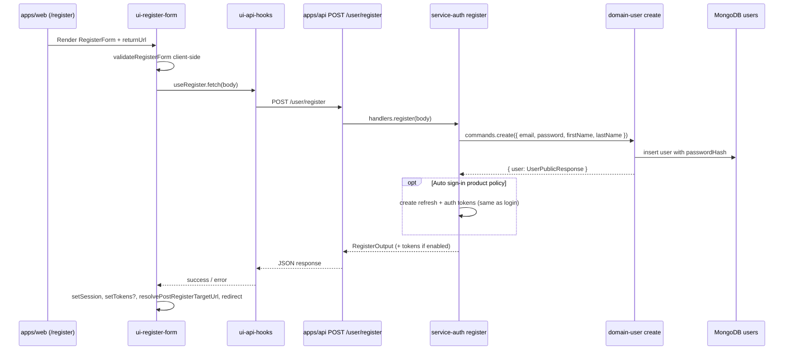

# User registration — architecture

**Status:** Draft — implementation specification  
**Last updated:** 2026-05-05  
**Related:** [PRD](./prd.md) · [Reset password architecture](../reset-password/architecture.md) · [User settings architecture](../user-settings/architecture.md)

This document describes how user registration fits the Vassembly monorepo: domains, auth service, API gateway, web app, and UI packages. It aligns with the registration PRD and reuses the same layering as **login** and **password reset**.

---

## Overview

**User registration** lets a visitor create an account with email, password, and name fields. The server persists a **user row** with an adaptive **password hash** (never plaintext). The product may then **auto-issue a session** (same token shape as login) or return success without tokens so the user signs in manually. **Email verification** is optional per PRD §12.4; the data model already exposes `verifiedAt` for future verification flows.

**Existing implementation (reuse):**

- **Domain:** `@vassembly/domain-user` `commands.create` — uniqueness check, password policy, hashing, persistence, public user payload (`UserPublicResponse`).
- **Service:** `@vassembly/service-auth` `handlers.register` — thin orchestration calling `create`.
- **API:** `POST /user/register` via `apps/api/src/routes/user/register.ts` (body validated with Zod; delegates to `handlers.register`).
- **Client:** `@vassembly/ui-api-hooks` `useRegister`, `@vassembly/ui-register-form` `RegisterForm` + validation/completion effects, `apps/web/app/register/page.tsx`, `middleware.ts` auth-page allowlist, `ProtectedAuthRoute` for “guest-only” routes.

**Gaps vs PRD / client contracts (to close explicitly):**

- **Auto sign-in:** `handlers.register` currently returns only `{ user }` (`RegisterOutput`), while `RegisterResponse` in `ui/api-hooks` and `useRegisterFormCompletionEffect` expect `authToken` and `refreshToken`. Product must choose auto sign-in (then extend `register` handler to mint tokens like `handlers.login`) or login-only success (then narrow client types + UX: no `setTokens`, redirect to `/login` with optional `?email=`).
- **`requiresEmailVerification`:** Frontend supports branching to `verificationPendingPath` when this flag is true; backend does not emit it until a verification policy and email pipeline exist.
- **Rate limiting:** PRD recommends limits on registration (and verification); enforce at **`@vassembly/server` / gateway / edge** consistently with login—not yet visible as dedicated middleware in-repo; treat as infra/gateway backlog.

---

## Analysis

### Monorepo audit (librarian-aligned)

| Layer | Package / path | Role in registration | Notes |
|------|----------------|----------------------|--------|
| Domain | `@vassembly/domain-user` | `commands.create`; `queries.getByEmail` for duplicate detection | Password rules in `commands/create/constants.ts`; hashing via `@vassembly/client-encoder` |
| Tokens | `@vassembly/domain-auth-token`, `@vassembly/domain-refresh-token` | Session issuance **after** user id exists | Same sequence as login |
| Service | `@vassembly/service-auth` | `handlers.register` → `domain-user.commands.create` | Extend here for tokens + verification side effects |
| API | `apps/api` | `POST /user/register` under `/user` prefix | Mirror Zod constraints with domain; map errors to HTTP |
| Hooks | `@vassembly/ui-api-hooks` | `useRegister` → `POST /user/register` | Types should match finalized API contract |
| UI | `@vassembly/ui-register-form` | Form, strength indicator, completion effect, safe `returnUrl` | Reuse patterns from login-form |
| Web | `apps/web` | `/register`, session storage on success | `middleware` + `ProtectedAuthRoute` guard auth pages |

### Integration with related features

| Feature | Relationship |
|---------|----------------|
| **Login** | Shared password policy expectation; login page links to `/register`; successful auto sign-in should return **`User` + tokens** matching `handlers.login`. |
| **Forgot / reset password** | New users register; reset is for **existing** credentials. Separate email templates and token lifecycles (reset already uses user-document token fields — see reset-password architecture). |
| **User settings** | Registered users expose `firstName` / `lastName` / `verifiedAt` in public responses; profile flows consume the same shapes. |

### What stays vs what may be extended

- **Reuse as-is:** `commands.create`, API route wiring, register form UX, duplicate-email messaging path (`WrongParamError` “Email already exists” → mapped in `formatRegisterErrorMessage`).
- **Extend:** `handlers.register` (tokens, optional verification email dispatch, optional `verificationEmailSent` / `requiresEmailVerification` flags), API response typing, hooks types, possibly new domain commands for verification-only (if/when verification ships).

---

## System architecture

### Conceptual flow



### Layer responsibilities

| Layer | Responsibility |
|-------|----------------|
| **`domains/user`** | Authoritative validation for persisted fields; **email uniqueness**; **password policy** + hash; strip secrets from `UserPublicResponse` via factory (`domains/user/src/model/factories.ts`). |
| **`services/auth`** | Orchestrate registration use case: create user; optionally mint session tokens; optionally trigger verification email; **no HTTP**. |
| **`apps/api`** | Zod parsing, size limits via server defaults, error → status mapping; call `handlers.register`. |
| **`ui/api-hooks`** | Typed POST wrapper; surfaces `CommonError` to UI. |
| **`ui/register-form`** | Field UX, password strength feedback, loading/double-submit guard, snackbars, **`resolvePostRegisterTargetUrl`** same-origin guard. |
| **`apps/web`** | Route composition, `ProtectedAuthRoute` (**guest-only**), `setTokens` when policy returns tokens (`apps/web/app/register/page.tsx`). |

---

## Data models

### `UserModel` (authoritative: `domains/user/src/model/model.ts`)

Registration **captures** (PRD §7):

| Field | At sign-up | Storage |
|-------|-------------|---------|
| `email` | Required | Indexed / unique constraint at DB recommended |
| Password | Required | Stored only as **`passwordHash`** (via `commands.create`) |
| `firstName`, `lastName` | Required in current API Zod schema | Persisted strings |
| `verifiedAt` | Not set | `null` until email verification succeeds |
| Timestamps / `id` | System | Via `@vassembly/model` / DAO |

**Do not expose** `passwordHash`, reset tokens, deletion tokens, or raw verification artifacts in REST/GraphQL public types.

### Public response shape

`createUserFactory().toPublicResponse` maps persisted user → `UserPublicResponse` (`id`, `email`, names, `verifiedAt`, timestamps). This aligns with `{ user }` fragments expected by **`UserAuthProvider`** mapping (`mapRegisterUserToAuthUser` in register-form).

### Optional verification extension (future)

If email verification becomes required:

1. Add **opaque verification token** storage (hashed at rest, expiry) — either new optional fields on `UserModel` or a dedicated subdocument pattern; follow the same **hash-in-DB, plaintext only in email** approach as password reset (`docs/features/reset-password/architecture.md`).
2. Add domain commands, e.g. `requestEmailVerification` / `confirmEmailVerification`, and a **distinct** transactional email template from reset-password.
3. Set `verifiedAt` on successful confirmation.

---

## API contracts

### Endpoint

- **Method / path:** `POST /user/register` (mounted with `/user` prefix in `apps/api/src/routes/index.ts`).
- **Request body (current Zod):** `email`, `password`, `firstName`, `lastName` — all strings (`apps/api/src/routes/user/register.ts`).

**Recommendation:** Tighten route schema to match domain intent (`z.string().email()`, min/max lengths for names) to fail fast at the gateway; keep **password complexity** enforcement in the domain as the single source of truth so bypass attempts still fail safely.

### Success response (target contract)

Align with PRD §5.2 and existing client types:

| Field | When |
|-------|------|
| `user` | Always — public user object |
| `authToken`, `refreshToken` | When **auto sign-in** is enabled (mirror `handlers.login` output) |
| `verificationEmailSent` | Optional boolean for analytics/copy when email subsystem sends verification |
| `requiresEmailVerification` | When product routes user to a “check your email” path before full access |

**Current code reference — handler returns user only:**

```5:11:services/auth/src/handlers/register/index.ts
export const register = async (input: RegisterInput): Promise<RegisterOutput> => {
  const { email, password, firstName, lastName } = input;
  
  const user = await userDomain.commands.create({ email, password, firstName, lastName });
  
  return { user: user.data };
};
```

**Client expects tokens (types):**

```11:22:ui/api-hooks/src/auth/useRegister.ts
export interface RegisterResponse {
  authToken: string;
  refreshToken: string;
  user: {
    id: string;
    email: string;
    firstName?: string;
    lastName?: string;
    verifiedAt?: Date | null;
  };
  requiresEmailVerification?: boolean;
}
```

Resolving this mismatch is a **release blocker** for the auto sign-in path described in the web register page (`setTokens` in `apps/web/app/register/page.tsx`).

### Error responses

| Situation | Domain / service behavior | HTTP (illustrative) | Client mapping |
|-----------|---------------------------|---------------------|----------------|
| Validation (email format, names, password policy) | Zod / `validatorFactory` failures → `WrongParamError` or validation errors | 400 | `formatRegisterErrorMessage` — password vs generic validation |
| Duplicate email | `WrongParamError("Email already exists")` from `commands.create` | 409 **or** 400 with stable code (PRD §5.3 — **enumerate vs generic** is a product decision) | `EMAIL_TAKEN` copy path in `formatRegisterErrorMessage` |
| Rate limit | Gateway / middleware | 429 | Add branch for calm retry copy (not yet in formatter) |
| Server failure | `InternalError` / unexpected | 5xx | Generic retry |

**Enumeration stance:** PRD §5.3 / §8 — document the chosen policy in the PRD “Open product decisions” and keep **error codes/messages stable** for QA and analytics.

---

## Frontend implementation

### Routing and guards

| Concern | Implementation |
|---------|----------------|
| **Route** | `apps/web/app/register/page.tsx` — `RegisterForm` inside `Suspense` for `useSearchParams`. |
| **Guest-only** | `ProtectedAuthRoute` with default `requireAuthenticated={false}` redirects **authenticated** users to `redirectPath` (default `/`) — same pattern as login. |
| **Middleware** | `AUTH_PAGES` includes `/register`; if `authToken` cookie present, redirect to `/` (`apps/web/middleware.ts`) — complements client-side guard. |
| **returnUrl** | Query param passed to `RegisterForm`; `resolvePostRegisterTargetUrl` restricts to **same origin** (`ui/components/register-form/src/resolvePostRegisterTargetUrl.ts`). |

### Form package (`@vassembly/ui-register-form`)

- **Validation:** `validateRegisterForm` (email RFC-practical alignment, confirm password, names).
- **Password UX:** Strength indicator aligns with complexity rules (`validatePasswordStrength` should stay consistent with backend `PASSWORD_VALIDATION_SCHEMA` in `domains/user/src/commands/create/constants.ts`).
- **Submit:** Guards `register.isLoading` to prevent duplicate POST (`useRegisterForm`).
- **Completion:** `useRegisterFormCompletionEffect` sets session from `register.data.user`, calls `onSuccess` with tokens, resolves redirect vs `verificationPendingPath` (`useRegisterFormCompletionEffect.ts`).

### Cross-links

- Login surfaces **Register** at `/register` (`ui/components/login-form/src/LoginForm.tsx`).
- Register form should retain **Sign in** link (component fields / stories — keep parity with PRD §4.1).

---

## Security & error handling

### Password hashing and policy

- **Hashing:** `commands.create` uses `hash` from `@vassembly/client-encoder` after validation (`domains/user/src/commands/create/index.ts`).
- **Policy:** `PASSWORD_VALIDATION_SCHEMA` — min length 8, max 100, character-class rules (`domains/user/src/commands/create/constants.ts`). **Keep parity** with reset-password PRD/policy; if drift appears, extract a shared schema module (incremental refactor).

### Duplicate email & timing

- `getByEmail` then throw `WrongParamError` prevents duplicate registrations before insert.
- For **enumeration mitigation**, product may substitute a generic 200/202 response for certain flows — that belongs in **service + API** layering with security review (not silently changing domain uniqueness).

### Tokens and session storage

- If auto sign-in: mint **refresh token** then **auth token** using the same `handlers.login` sequencing (`services/auth/src/handlers/login/index.ts`).
- Browser storage: **`setTokens`** in web app parallels login; never log tokens or passwords.

### Rate limiting & abuse

- Apply **per-IP / per-email** limits at API edge or Fastify plugin; return **429** with safe copy.
- Optional later: CAPTCHA at edge (PRD out of scope for MVP).

### Logging

- Never log passwords, raw verification/reset tokens, or full auth headers. Follow the same discipline as forgot/reset handlers.

---

## Testing strategy

| Layer | Focus |
|-------|--------|
| **domain-user `commands.create`** | Black-box Vitest: success, duplicate email (`WrongParamError`), weak password, persistence of hash not plaintext (`domains/user/src/commands/create/index.test.ts` pattern). |
| **service-auth `register`** | With mocked domains: returns shape; **with integration intent:** after extending handler — tokens issued once per login parity. |
| **apps/api route** | Schema rejection (malformed body), forwarding to handler, status mapping for typed errors (contract tests optional). |
| **ui-register-form** | `validateRegisterForm`, `resolvePostRegisterTargetUrl` same-origin rejection, completion effect redirects (Vitest / RTL where present). |
| **ui-api-hooks** | Mock HTTP: success and error propagation to `CommonError`. |

---

## Deployment considerations

- **Config:** Feature flags or env for **auto sign-in** vs redirect-to-login — avoids shipping incompatible client/server pairs.
- **Database:** Unique index on **normalized email** (lowercase collation or application-level normalization consistently applied in `getByEmail` + `create`).
- **Email infra:** SES (or equivalent) templates for **verification** distinct from reset-password; environment base URLs for absolute links (`packages/config`).
- **CORS / cookies:** If switching to cookie-based session later, reconcile with current `sessionStorage` + middleware cookie check for auth pages (`AUTH_TOKEN_KEY` in `middleware.ts`).
- **Ordering:** Prefer **deploy API + hooks + web** atomically when response contracts change (`RegisterResponse`), or ship behind feature flag.

---

## Design decisions & trade-offs

| Topic | Recommended approach | Alternative | Trade-off |
|-------|---------------------|-------------|-----------|
| Auto sign-in | Extend `handlers.register` to call token domains after successful `create` when flag enabled | Always redirect to login | Better UX vs slightly larger attack surface — mitigate with rate limits |
| Password policy source of truth | Domain Zod schema | Duplicate in UI only | Domain must win; UI mirrors for fast feedback |
| Duplicate email HTTP code | **409 Conflict** when messaging is explicit | 400 + code | Clear semantics vs older clients |
| Email verification | Phase 2: new fields + commands + `/user/verify-email` style route | Block registration until verified | Product policy dependent (PRD §12.4) |
| returnUrl | Client-side same-origin resolver (current) | Server validates allowlist | Current pattern reduces server trust in query strings for redirect |

---

## Implementation steps (ordered)

1. **Product:** Resolve PRD §12.4 items (auto sign-in, verification phase, duplicate messaging, password rules doc link).
2. **`@vassembly/service-auth`:** Extend `handlers.register` to optionally issue `authToken` / `refreshToken` (reuse login token creation); add `requiresEmailVerification` / `verificationEmailSent` when verification exists.
3. **`@vassembly/ui-api-hooks`:** Make `authToken` / `refreshToken` **optional** in types if login-only mode is supported, or keep required when auto sign-in is the only supported mode — **types must match JSON**.
4. **`apps/api`:** Align Zod body schema with domain; map `WrongParamError` for duplicate email to chosen status; add rate limit plugin if available.
5. **`@vassembly/ui-register-form`:** Adjust completion effect for “no tokens” path (set session vs don’t, redirect to `/login?email=`).
6. **Verification (when in scope):** Domain fields + commands + mail + route; reuse reset-password email security patterns.

---

## Todo Plan (per-package delegation)

1. **`@vassembly/domain-user`** — Type: extend (only if verification)  
   - Changes: Optional verification token fields + `confirmEmailVerification` command; unique index documentation.  
   - Dependencies: Product decision on verification.  
   - Workflow: tdd-unit-test-writer → coder ↔ code-reviewer  

2. **`@vassembly/service-auth`** — Type: extend  
   - Changes: `handlers.register` — token issuance path; optional verification email hook; `RegisterOutput` / types tests.  
   - Files: `services/auth/src/handlers/register/*`  
   - Dependencies: Todo 1 only if verification bundled.  
   - Workflow: tdd-unit-test-writer → coder ↔ code-reviewer  

3. **`apps/api`** — Type: gateway  
   - Changes: Stricter Zod; HTTP codes; rate limit if standard plugin exists.  
   - Files: `apps/api/src/routes/user/register.ts`  
   - Dependencies: Todo 2  

4. **`@vassembly/ui-api-hooks`** — Type: client  
   - Changes: `RegisterResponse` alignment; tests.  
   - Files: `ui/api-hooks/src/auth/useRegister.ts`  
   - Dependencies: Todo 3  

5. **`@vassembly/ui-register-form`** — Type: UI  
   - Changes: Completion effect branches; optional token-less success UX.  
   - Dependencies: Todo 4  

6. **`@vassembly/web`** — Type: app  
   - Changes: Register page `onSuccess` / redirect when no tokens; optional `/register/pending` page content.  
   - Files: `apps/web/app/register/**`  
   - Dependencies: Todo 5  

---

## Recommendation

**Keep registration logic in `@vassembly/domain-user` `commands.create` and extend `@vassembly/service-auth` `register` for session and optional mail-only orchestration** — the same conservative split as login. **Close the API/client contract gap** (tokens and flags) before release. Defer verification storage to a follow-up unless PRD mandates it for launch; when added, **mirror password-reset token hygiene** (hashed at rest, single-use, expiry) and **do not** reuse reset tokens for verification.

---

## Open decisions (product)

Track in PRD §12.4 — architecture blocked items:

1. Auto sign-in vs redirect to login.  
2. Email verification timing (required / optional / phase 2).  
3. Duplicate email: explicit vs non-enumerating response.  
4. Single password policy document shared with reset-password.
