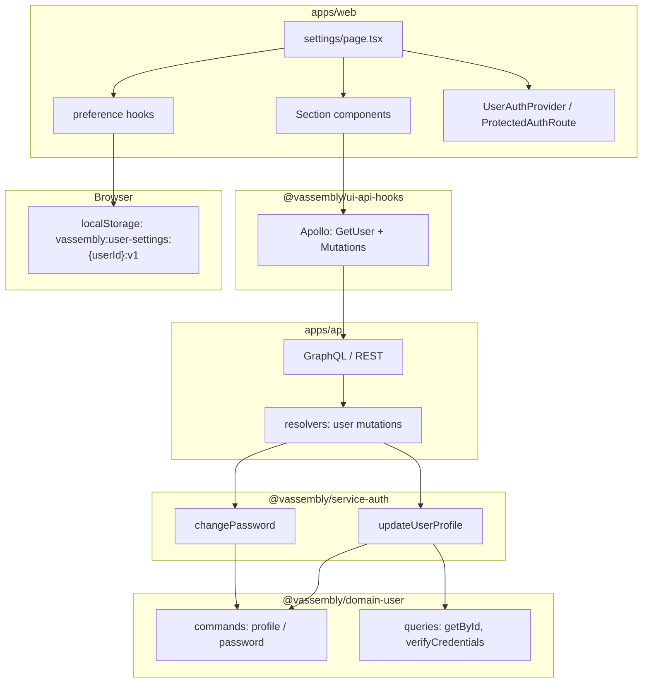

# User Settings — Architecture Specification

**Status:** Draft — implementation specification  
**Last updated:** 2026-05-06  
**Related:** [PRD](./prd.md) · [Design](./design.md)

This document defines system architecture, data flow, package boundaries, and phased delivery for the User Settings feature. It incorporates the **librarian catalog audit** (existing packages, gaps, risks) and aligns with monorepo rules (domains, services, `apps/api` gateway, `apps/web`).

---

## Account Deletion Feature

**Note:** Account deletion is now a **separate feature** with its own PRD and architecture specification.

**See:**
- **[Account Deletion PRD](../account-deletion/prd.md)** — product requirements (R1–R12), acceptance criteria, UX rules.
- **[Account Deletion Architecture](../account-deletion/architecture.md)** — technical specification, backend/frontend implementation, testing strategy.

**In User Settings:** The **Account deletion** section (UI-only confirmation modal, REST `POST /user/delete-account`, session teardown) is **fully specified** in the account deletion docs.

---

## Analysis

### Audit of existing domains and services

|| Area | Package / path | Current capability | Gap vs PRD |
||------|----------------|-------------------|------------|
|| User entity | `@vassembly/domain-user` (`domains/user/`) | `create`, `update`, password-reset commands, `getById`, `verifyCredentials`; generic `remove` helper exists | No `displayName`-style field on `UserModel` today; no password-change command in historical snapshot; **account deletion:** see **[Account Deletion feature](../account-deletion/prd.md)** (separate, immediate `removedAt` soft-delete) |
|| Auth orchestration | `@vassembly/service-auth` (`services/auth/`) | `login`, `register`, `refresh`, `auth`, `logout`, `getUser` | No handlers for profile update, change password, or account deletion workflow |
|| API gateway | `@vassembly/api` (`apps/api/`) | REST: user login/register, auth routes; GraphQL: `user(id)` query via `registerUserResolvers` | **No GraphQL mutations** registered yet for user mutations |
|| Web auth shell | `apps/web` | `ProtectedAuthRoute` (`apps/web/lib/auth/ProtectedAuthRoute.tsx`) with `requireAuthenticated`; JWT in `sessionStorage` / `localStorage` patterns | No `app/settings/` route; drawer **Settings** footers expect `onOpenSettings` but `AuthLayout` / `Layout` do not thread it (no-op until wired) |
|| Client data | `@vassembly/ui-api-hooks` | `useGetUser`, `useApolloMutation` available, REST `useFetch` for login | No settings mutations or profile hooks |
|| Auth context | `@vassembly/ui-user-auth` | `UserAuthProvider`, `AuthUser` (`id`, `email`, `firstName`, `lastName`, `role`, `verifiedAt`) | May need `refetch` / `updateLocalUser` after profile save; **role** is `string` — PRD matrix assumes richer roles |
|| Theme | `@vassembly/ui-system-design/theme` | Tokens / CSS variable system | Integrate with local theme preference hook and document attribute/class application on `document` or root |

### What can be reused (~70%)

- Identity and persistence: extend `@vassembly/domain-user` rather than new domain.
- Orchestration: extend `@vassembly/service-auth` handlers; keep HTTP/GraphQL out of services.
- GraphQL wiring: extend `apps/api/src/graphql/` and resolvers alongside existing `user` query.
- UI primitives: `@vassembly/ui-system-design/text-field`, `ui-modal`, `ui-switch`, `ui-checkbox`, `ui-radio-button`, `ui-button`, `ui-alert`, `ui-snackbar`, `ui-anchor-list`, `ui-text`, layout/drawer (`@vassembly/ui-components-layout`, drawer navigation).
- Auth gating pattern: `ProtectedAuthRoute` + `UserAuthProvider` (PRD T-1).
- Form patterns: mirror `ui/components/login-form`, `register-form` (controlled fields, validation, submit loading).

### What must be new (~30%)

- Domain commands (or specialized use of existing `update`) + password verification.
- Service handlers wrapping those commands with authorization checks (actor == subject).
- GraphQL mutations (or REST parity — **recommend GraphQL** for alignment with `useGetUser` and single client surface; REST acceptable if team standardizes on REST for mutations only — see §Open Decisions).
- `apps/web/app/settings/` page composition, section components, modals.
- Local preference layer: typed schema, versioned storage, hooks (`useNotificationPreferences`, `usePrivacyPreferences`) — default placement `apps/web/lib/preferences/` unless a second app needs sharing (then `packages/client-user-preferences` or `ui/*` hooks package).

### New packages

- **Not required for MVP** if hooks live under `apps/web/lib/preferences/`.
- **Optional later:** `packages/client-user-preferences` when multi-app reuse is proven.

### Librarian-identified risks (mitigate in rollout)

- **GraphQL schema evolution:** adding `Mutation` types affects Apollo documents — coordinate `ui/api-hooks` and API deploy order.
- **Account deletion:** follow **[Account Deletion Architecture](../account-deletion/architecture.md)** (immediate `removedAt` soft-delete, single route/handler); hard-delete via naive `remove` must stay non-UI-facing.
- **Import consistency:** some code uses `default` import of `@vassembly/domain-user` while domain exports named symbols too — migrate consistently when touching handlers.
- **Route alignment:** PRD route is **`/settings`**; some tests reference `/app/settings` — standardize on **`/settings`** (App Router).

---

## 1. System architecture overview

### 1.1 Conceptual component diagram



### 1.2 Data flow (user action → UI)

**Server-backed (profile / password)**

1. User edits form in section component (local React state).
2. Client validation (Zod or shared validators where appropriate).
3. **Mutation** (GraphQL) or REST POST → `apps/api` → **service-auth handler**.
4. Handler enforces **self-service only** (`input.userId` must match authenticated subject from token/header — exact mechanism depends on existing `auth` middleware).
5. Handler calls **domain command(s)**; domain validates with Zod, updates Mongo via DAO.
6. Success: handler returns payload; client shows Snackbar/Alert; **refetch `GetUser`** or patch `UserAuthProvider` user object.
7. Failure: map `@vassembly/errors` to user-safe messages; inline field errors when validation-related.

**Local-first (notifications, privacy)**

1. User toggles control → hook updates React state optimistically.
2. Hook persists to **versioned JSON** under namespaced key (see §4).
3. App shell reads preference hooks on load; settings persist locally on device.

### 1.3 Role-based access control flow

- **Source of truth for role in UI:** JWT claims + `AuthUser.role` in `UserAuthProvider` (extend login/session parsing if claims add canonical role enum).
- **Notifications section:** build **category list from a registry** `{ id, label, rolesAllowed[] }`; filter **before render** (hide supervisor-only rows for worker — PRD §3.3).
- **Deep links:** hash targets (e.g. `#notifications`) do not bypass filtering; optional `?category=` query cleared with **Alert** if role lacks access (design §4.3).
- **Backend:** mutations must **not** trust client role for authorization of *other users'* data; only verify **subject == resource user id**. Role affects **UI only** for MVP local notification labels unless future server validates preference payloads.

### 1.4 Local storage integration points

- **Read:** on `UserAuthProvider` authenticated transition, load preferences key scoped by `user.id` (PRD §8.2 shared devices).
- **Write:** inside each preference hook on change; use `try/catch` + quota detection (§9).
- **Logout / account deletion:** `clearSession` path must call **preference + session cleanup** for that user's namespaced keys (PRD §11).

---

## 2. Component structure

### 2.1 Entry point

|| File | Responsibility |
||------|----------------|
|| `apps/web/app/settings/page.tsx` | Client page; wraps content with `ProtectedAuthRoute` (`requireAuthenticated={true}`, `redirectPath='/login'` or product default); composes layout sections |
|| `apps/web/app/settings/layout.tsx` (optional) | Shared metadata, suspense boundary, or auth shell if needed |

Design default: **single scrollable page** with anchor IDs; desktop **AnchorList** from `@vassembly/ui-system-design/anchor-list`.

### 2.2 Section components (suggested files)

Keep each file **focused** (workspace rule: ≤100 lines per file — split if needed):

|| Component | Suggested path | PRD / design anchor |
||-----------|----------------|---------------------|
|| `SettingsPageHeader` | `apps/web/app/settings/_components/SettingsPageHeader.tsx` | Title, subtitle |
|| `SettingsProfileSection` | `.../SettingsProfileSection.tsx` | `#profile` |
|| `SettingsSecuritySection` | `.../SettingsSecuritySection.tsx` | `#security` |
|| `SettingsNotificationsSection` | `.../SettingsNotificationsSection.tsx` | `#notifications` |
|| `SettingsPrivacySection` | `.../SettingsPrivacySection.tsx` | `#privacy` |
|| `SettingsSessionSection` | `.../SettingsSessionSection.tsx` | `#session` — sign out |
|| `SettingsAccountDeletionSection` | `.../SettingsAccountDeletionSection.tsx` | `#account-deletion` — **see [Account Deletion feature](../account-deletion/architecture.md)** |
|| `SettingsDesktopNav` | `.../SettingsDesktopNav.tsx` | Sticky `AnchorList` ≥1024px |
|| `notificationCategoryRegistry` | `.../notificationCategoryRegistry.ts` | Role → visible category ids (pure data, testable) |

### 2.3 Shared form pattern / hooks

- Reuse patterns from **`@vassembly/ui-components-login-form`** / **register-form**: controlled `TextField`, submit disabled + `isLoading` on primary `Button`, field-level error state.
- Shared helpers (if duplication grows): `apps/web/lib/settings/useSettingsForm.ts` for common dirty/submit state **or** colocate per section to stay minimal.

### 2.4 Modals

- **Account deletion:** **see [Account Deletion Architecture](../account-deletion/architecture.md)** for modal spec (UX-only confirmation, single API call).
- **Sign-out (recommended):** same Modal pattern for shared-device mis-tap protection (PRD Q-6).

---

## 3. Backend architecture

### 3.1 Extend `@vassembly/domain-user`

**Model (`domains/user/src/model/model.ts`)**

- Add fields as required by PRD after **Open Decision** on display name:
  - **Option A:** `displayName?: string` (single editable field).
  - **Option B:** keep `firstName` / `lastName` only; UI "display name" maps to both fields (simpler persistence, different UX).

Additional fields if product requires email change in MVP (usually **not**): `pendingEmail`, etc. — defer unless PRD confirms.

**Password**

- `changePassword` command (or named folder command): inputs `{ userId, currentPassword, newPassword }`; internally `verifyCredentials`-style check then hash replacement using same bcrypt pattern as `create`/login stack; enforce policy schema (min length, complexity via Zod).

**Profile update**

- Either extend `commands/update.ts` validation schema with `displayName` **or** add `updateProfile` command that wraps `updateDbById` with PRD-specific schema (max length, trim).

**Validation**

- All Zod schemas colocated with commands; throw `ValidationError` from `@vassembly/errors` consistently.

**GraphQL schema (`domains/user/src/model/graphql.ts`)**

- Extend `User` type with new fields exposed to clients (e.g. `displayName`).
- Do **not** expose `passwordHash`, reset tokens, or deletion tokens.

### 3.2 Extend `@vassembly/service-auth`

New handlers (each: `index.ts`, `types.ts`, `index.test.ts`):

|| Handler | Input highlights | Behavior |
||---------|------------------|----------|
|| `updateUserProfile` | `userId`, profile fields, **caller identity** from auth context | Verify caller owns `userId`; call domain commands.update / updateProfile |
|| `changePassword` | `userId`, `currentPassword`, `newPassword` | Verify ownership; call domain changePassword |

**Errors:** `UnauthorizedError`, `ValidationError`, `NotFoundError`, domain errors — no silent catches.

**Export** from `services/auth/src/handlers/index.ts` and default `handlers` object.

### 3.3 GraphQL mutations (recommended shape in `apps/api`)

Register alongside existing `registerUserResolvers`:

|| Mutation | Input | Output |
||----------|-------|--------|
|| `updateUserProfile` | `UpdateUserProfileInput` (displayName, optional first/last names per final model) | `User` or `UpdateUserProfilePayload { user }` |
|| `changePassword` | `ChangePasswordInput` (currentPassword, newPassword) | `ChangePasswordPayload { success: Boolean }` |

**Auth:** resolvers read Fastify/request context (existing `auth` plugin) — **reject** if unauthenticated or subject mismatch.

**Alternative:** REST routes under `apps/api/src/routes/user/` for parity with login/register — acceptable if team prefers; still thin, calling same handlers.

---

## 4. Data layer and local storage

### 4.1 Settings schema (localStorage JSON)

Aligned with PRD §8.1:

```typescript
interface UserSettingsV1 {
  schemaVersion: 1;
  notifications: {
    masterEnabled: boolean;
    categories: Record<string, boolean>;
    channels: {
      inApp: boolean;
      email: boolean;
      push: boolean;
      sms: boolean;
    };
  };
  privacy: {
    analyticsEnabled: boolean;
    crashReportingEnabled: boolean;
    marketingOptIn: boolean;
  };
}
```

Category keys must match **`notificationCategoryRegistry`** ids (PRD §10.2 / Q-7).

### 4.2 Storage keys and versioning

- **Key pattern:** `vassembly:user-settings:${userId}:v1` (PRD §8.2).
- **Versioning:** `schemaVersion` inside JSON; on read, if missing or incompatible, **reset to defaults** and optionally one-time Snackbar "Preferences reset on this device."
- **Constants file:** `apps/web/lib/preferences/storageKeys.ts` + `DEFAULT_USER_SETTINGS_V1`.

### 4.3 Preference hooks

|| Hook | Responsibility |
||------|----------------|
|| `useNotificationPreferences` | Read/write `notifications` subtree; master toggle disables category UI |
|| `usePrivacyPreferences` | Read/write `privacy` subtree |

Implementation sketch: single `useUserSettingsStorage(userId)` internal + thin wrappers to avoid multiple JSON parses (performance).

### 4.4 Migration strategy for future backend sync

- Reserve optional fields: `serverRevision?: string`, `lastSyncedAt?: string` (PRD §8.4).
- **ADR when sync ships:** server-wins vs merge for conflicts.
- Hooks should isolate persistence behind a small interface so **sync adapter** can replace local-only writer later.

---

## 5. State management

|| Concern | Location |
||---------|----------|
|| Authenticated user | `UserAuthProvider` — **source of truth** for id, email, names, role |
|| Profile/security forms | Local `useState` / `useReducer` per section; dirty tracking for Save/Cancel |
|| Local preferences | `useSyncExternalStore` or `useState` + effects to localStorage (hooks §4.3) |
|| Theme application | Prefer **attribute on `document.documentElement`** or existing theme provider; hook runs on layout mount |
|| Server after save | **Refetch GraphQL `GetUser`** then `setSession({ user: mappedUser })` **or** extend context with `refreshUser()` |

**UserAuthProvider extension:** add `refreshUser` that calls `useGetUser` lazy query or passes Apollo client from web providers — avoid duplicating user shape mapping.

---

## 6. API and mutations

### 6.1 Request/response shapes (illustrative)

**`UpdateUserProfileInput`**

```graphql
input UpdateUserProfileInput {
  displayName: String # or firstName/lastName per model decision
}
```

**`ChangePasswordInput`**

```graphql
input ChangePasswordInput {
  currentPassword: String!
  newPassword: String!
}
```

### 6.2 Error handling and user feedback

- Map known errors to **Alert** (section-level) and **inline** (password wrong).
- Network offline: `navigator.onLine` check before submit where useful; still handle `fetch` failure.
- 401: trigger session expiry UX; preserve local prefs (PRD edge case).
- **No PII** in client logs (PRD T-7).

---

## 7. Routing and authentication

|| Requirement | Implementation |
||-------------|----------------|
|| Protected `/settings` | `ProtectedAuthRoute` with `requireAuthenticated={true}`; `redirectPath` = login (or register) |
|| Drawer entry | Pass **`onOpenSettings`** from `AuthLayout` / `Layout` to drawer → `router.push('/settings')` (fix current no-op) |
|| Role visibility | Filter sections/categories in render; optional **central registry** |
|| Deep-link protection | Invalid hash/query shows **Alert**; do not mount hidden controls |
|| Auth failure | Redirect unauthenticated users; no settings HTML in RSC payload beyond gated client tree — align with Next App Router patterns already used |

**Tests:** align any **`/app/settings`** references to **`/settings`**.

---

## 8. UI component integration

|| Section | Reuse |
||---------|--------|
|| Profile | `TextField`, `Text`, `Button`, `Alert` |
|| Security | `TextField` (password), SSO `Alert` |
|| Notifications | `Switch`, optional `Accordion` mobile |
|| Privacy | `Switch`, honest copy |
|| Theme | `RadioButton` group or styled radios |
|| Language | `Menu` / `Dropdown` |
|| Session | `Button`, `Modal` |
|| Account deletion | **see [Account Deletion Architecture](../account-deletion/architecture.md)** |
|| Feedback | `Snackbar`, `Alert` |

**New UI packages:** avoid unless a second consumer appears; prefer **page-local** `_components` under `apps/web/app/settings/`.

---

## 9. Error handling and edge cases

|| Scenario | Behavior |
||----------|----------|
|| Offline | Block success path; Alert with retry |
|| Field validation | First invalid focus; `TextField` error slots |
|| Wrong current password | Inline + Alert |
|| 5xx | Generic retry message |
|| Session expiry | Re-auth prompt; no false "saved" |
|| localStorage quota / disabled | Snackbar/Alert; session-only fallback if feasible; disclose limitation |
|| Worker deep link to supervisor category | Info `Alert` (design §4.3) |

---

## 10. Performance and scalability

- **Lazy load** heavy sections with `dynamic(() => import(...), { ssr: false })` only if profiling shows need; goal PRD T-5: shell < 2s, section switch < 200ms perceived.
- **Memoize** category lists derived from role.
- **Bundle:** prefer tree-shakable imports from `@vassembly/ui-*` per component.
- **Future:** multi-device sync via optional package and service (out of MVP).

---

## 11. Testing strategy

|| Layer | Scope |
||-------|--------|
|| Unit | Domain commands (password change), Zod validation; **preference hook** + storage key migration with mocked `localStorage` |
|| Unit | `notificationCategoryRegistry` pure functions |
|| Component | Section forms (React Testing Library): disabled states, SSO hidden password |
|| Integration | Handler tests in `service-auth` with mocked `domain-user` |
|| API | Resolver tests or contract tests calling handlers |
|| E2E (later) | Profile save, password change, worker vs supervisor notifications |

Vitest everywhere per workspace standards.

---

## 12. Security considerations

- **Password:** bcrypt (existing domain pattern); never log passwords; rate-limit change-password at gateway if abuse is a concern.
- **CSRF:** follow existing API cookie/header strategy; if JWT in header only, CSRF scope differs — align with `apps/api` security baseline.
- **localStorage:** store **no secrets**; only preference JSON and public-ish ids — session tokens stay existing storage module.
- **RBAC:** backend enforces **user can only mutate self**; UI role matrix is additive for notifications only.

---

## 13. Implementation phases

### Phase 1 — Backend infrastructure

1. Finalize **display name** model decision; update `UserModel`, factories, GraphQL `User` fields.
2. Implement domain: `changePassword`, extend profile update.
3. Unit tests for new commands.
4. Implement `service-auth` handlers + tests (mock domains where appropriate).
5. Align default imports / exports for `@vassembly/domain-user` if touched.

### Phase 2 — API and client hooks

1. Add GraphQL mutations (or REST) in `apps/api`; wire auth context.
2. Extend `@vassembly/ui-api-hooks` with `useUpdateUserProfile`, `useChangePassword`.
3. Update `GetUser` document/fragments if new user fields.

### Phase 3 — Web preferences and shell

1. Implement `apps/web/lib/preferences/*` + hooks; wire theme to CSS variables / theme package.
2. Wire `onOpenSettings` → `/settings`.
3. Optional: `refreshUser` on `UserAuthProvider`.

### Phase 4 — UI page assembly

1. Create `apps/web/app/settings/page.tsx` and section components per §2.
2. Integrate modals, Snackbars, role-filtered notifications.
3. Analytics events per PRD §12.2 (no PII).

### Phase 5 — Integration and hardening

1. E2E critical paths; fix route test paths.
2. Accessibility audit (focus trap, 44px targets, reduced motion).
3. Performance check on mid-tier mobile.

---

## 14. Dependencies and integration points

### Package graph (conceptual)

```
apps/web
  → @vassembly/ui-* (primitives)
  → @vassembly/ui-api-hooks
  → @vassembly/ui-user-auth
  → @vassembly/ui-system-design/theme

@vassembly/ui-api-hooks
  → @apollo/client
  → (existing domain-auth-token contracts)

apps/api
  → @vassembly/service-auth
  → @vassembly/domain-user (schema)
  → @vassembly/graphql

@vassembly/service-auth
  → @vassembly/domain-user
  → @vassembly/errors

@vassembly/domain-user
  → @vassembly/commands, @vassembly/queries, @vassembly/client-mongodb, …
```

### Breaking changes

- **GraphQL:** adding mutations is additive; changing `User` fields may break clients — use nullable additions and coordinated releases.
- **Token claims:** introducing canonical roles may require **logout/login** or refresh for old tokens — document in changelog.

---

## 15. Open decisions and assumptions

|| ID | Topic | Architecture stance |
||----|--------|----------------------|
|| Q-1 | Role enum | Define `worker | supervisor | planner | quality | maintenance | admin` in shared types package or `ui-user-auth` when JWT carries them; until then, **string** role with safe defaults (treat unknown as full or restricted per product call). |
|| Q-2 | Maintenance notification tier | Default **full** in registry; one-line flag to switch to worker subset. |
|| Q-3 | SSO vs password | **Hide** password form + `Alert` when `AuthUser` indicates SSO-only (needs claim from backend). |
|| Q-5 | Channels | Toggle visibility driven by **feature flags** or backend capability endpoint; hide if unsupported (PRD 10.1). |
|| Q-6 | Sign-out confirm | **Modal confirm** default for manufacturing shared devices. |
|| Q-7 | Category names | Central `notificationCategoryRegistry` — single source for UI + analytics enums. |
|| — | GraphQL vs REST mutations | **Default GraphQL** for consistency with `user` query; REST acceptable if explicitly chosen. |
|| — | Display name storage | **Decide in Phase 1** before coding profile (§3.1 Option A vs B). |
|| — | Theme provider location | Apply in root layout **after** reading persisted preference; coordination with `@vassembly/ui-system-design/theme` — document DOM contract in a single `THEME_APPLICATION.md` only if team asks (else inline in web lib). |

---

## Todo Plan (per-package delegation)

1. **`@vassembly/domain-user`** — extend domain  
   - Changes: Model fields (display name decision); commands `changePassword`; extend profile update; GraphQL `User` fields; DAO compatibility.  
   - Files: `domains/user/src/model/model.ts`, `domains/user/src/model/graphql.ts`, `domains/user/src/model/factories.ts`, `domains/user/src/commands/**`, `domains/user/src/commands/index.ts`, `domains/user/src/index.ts`  
   - Workflow: tdd-unit-test-writer → coder ↔ code-reviewer (max 2) → documentation-writer (README)  
   - Dependencies: None (blocked only on Open Decision display name)

2. **`@vassembly/service-auth`** — extend service  
   - Changes: Handlers `updateUserProfile`, `changePassword`; types; tests.  
   - Files: `services/auth/src/handlers/**`, `services/auth/src/handlers/index.ts`  
   - Workflow: tdd-unit-test-writer → coder ↔ code-reviewer → documentation-writer  
   - Dependencies: Todo 1

3. **`@vassembly/api`** — gateway  
   - Changes: GraphQL mutation registration + resolvers **or** REST routes; auth wiring.  
   - Files: `apps/api/src/graphql/**`, optionally `apps/api/src/routes/user/**`  
   - Workflow: coder ↔ code-reviewer  
   - Dependencies: Todo 2

4. **`@vassembly/ui-api-hooks`** — client data layer  
   - Changes: Mutations hooks, documents, types; extend `GetUser` if needed.  
   - Files: `ui/api-hooks/src/**`  
   - Workflow: coder → code-reviewer  
   - Dependencies: Todo 3

5. **`@vassembly/web`** — settings UI + preferences  
   - Changes: `app/settings/**`, `lib/preferences/**`, drawer `onOpenSettings`, optional `UserAuthProvider` refresh helper.  
   - Files: `apps/web/app/settings/**`, `apps/web/lib/preferences/**`, `apps/web/lib/layout/**` (or equivalent Layout paths)  
   - Workflow: unit-test-writer (hooks) → coder ↔ code-reviewer  
   - Dependencies: Todo 4 (server hooks); Todo 3 can parallel partially with mocked API

6. **`@vassembly/ui-components-layout` / `@vassembly/ui-drawer-navigation`** — only if API changes required for settings navigation  
   - Changes: Ensure `onOpenSettings` typing/docs align (may be **apps/web-only** wiring without package change).  
   - Workflow: coder  
   - Dependencies: None if only web wiring

**Note:** Account deletion implementation tasks are documented separately in **[Account Deletion Architecture](../account-deletion/architecture.md)** §Todo plan.

---

## Recommendation

**Extend** `@vassembly/domain-user` and `@vassembly/service-auth` in place; **add GraphQL mutations** in `apps/api`; **compose** the settings page in `apps/web` with **page-local** preference hooks under `lib/preferences/` until a second app needs them. This maximizes reuse of existing auth, GraphQL query, and UI primitives while keeping MVP scope honest (local-only prefs, role-filtered UI). Incorporate librarian risks into PR review checklist: schema coordination, import consistency, route `/settings`. Account deletion is **separately planned** and tracked in its own feature branch/PR.
